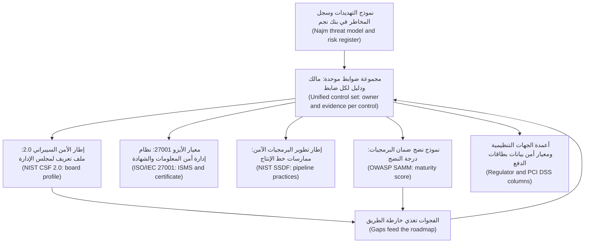
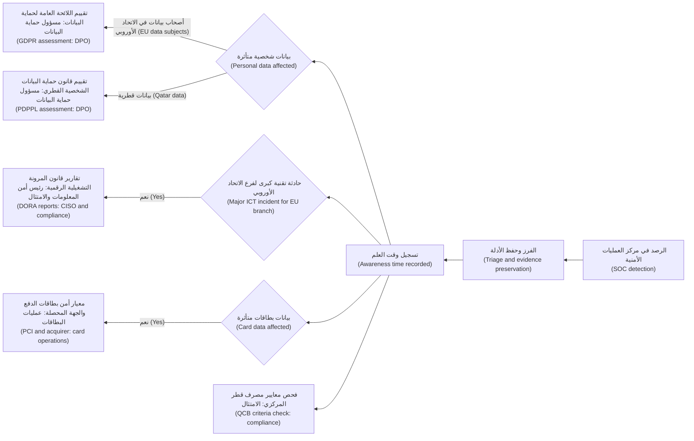
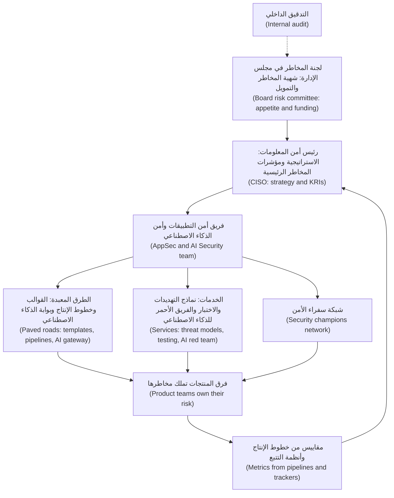

# الوحدة 11 — الحوكمة والقيادة

*كل ضابطٍ في الوحدات 1–10 يحتاج إلى من يملكه، ويموّله، ويثبت أنه يعمل، ويُبقيه عاملًا كلما تغيّر البنك. تلك هي الحوكمة، وعندها تتعثّر كثيرٌ من فرق الأمن القديرة. فهي تدير أربعة أطر بوصفها أربعة مشاريع جداول بيانات. ويقرأ المحامون اللوائح التنظيمية، لكن لا أحد يحوّلها إلى متطلباتٍ هندسية. ويُدافَع عن الميزانية بعددٍ من الثغرات لا يستطيع أحدٌ تفسيره. تغطي هذه الوحدة الجانب القيادي لأمن التطبيقات وأمن الذكاء الاصطناعي. يشرح الدرس 11.1 الأطر الرئيسية، وهي NIST CSF 2.0 وISO/IEC 27001 وNIST SSDF وOWASP SAMM، وكيف تُدار بوصفها مجموعة ضوابط واحدة. ويحوّل الدرس 11.2 القوانين التي تطال بنك نجم، أي اللائحة العامة لحماية البيانات، وقانون حماية خصوصية البيانات الشخصية في قطر، وقانون الذكاء الاصطناعي الأوروبي، وDORA، وغيرها من قواعد القطاع المالي، إلى ضوابط وأدلةٍ ومواعيد نهائية للإخطار عن الحوادث. ويبني الدرس 11.3 برنامجًا يدوم: سفراء الأمن، والطرق المعبّدة، ومقاييس تقود القرارات، وميزانية سيموّلها مجلس الإدارة. ستعمل مع نورة وحمد وهما يستعدّان للجنة التدقيق، ومع سارة وجاسم حين تُطلق حادثةٌ في بوابة الشركات الصغيرة عدة مواعيد نهائية قانونية في آنٍ واحد، ومع حمد وعلي وهما يتعلّمان لماذا لا تُعدّ عبارة «تم رصد 12,481 ثغرة» مقياسًا، ولماذا لا يستطيع بنكٌ أن يبلغ التغطية بالتوظيف وحده.*

> **المراحل:** Govern, Plan — تحويل الضوابط إلى برنامجٍ له مالكون، ويُقاس، ويُموَّل يُرضي المدققين والجهات التنظيمية لأنه يقلّل المخاطر فعلًا.

---

# 11.1 — الأطر: NIST CSF 2.0 وISO/IEC 27001 وNIST SSDF وOWASP SAMM
*المستوى: 🔴 متقدم* · *المتطلبات: 1.3، 6.1* · *المرحلة: Govern*

**بعد هذا الدرس تستطيع** أن تربط ضوابط تطبيقٍ بوظائف NIST CSF 2.0، وتقيّم ممارسات فريقك في SAMM بأدلة وأهداف مبنية على المخاطر. *مدة الدراسة: قراءة نحو 15 دقيقةً، وعمل تطبيقي نحو 5 ساعات (تقدير).*

## ⚡ الدرس في دقيقة
- **الإطار الأمني** مجموعةٌ منشورةٌ ومنظَّمة من النتائج أو المتطلبات أو الممارسات. يساعدك على اكتشاف الفجوات، ويمنحك لغةً مشتركة مع المدققين والجهات التنظيمية والعملاء. إنه خريطةٌ للأمن، لا الأمن نفسه.
- تجيب الأطر الأربعة هنا عن أسئلةٍ مختلفة. **NIST CSF 2.0**: ما النتائج التي ينبغي أن تحققها المنظمة بأكملها؟ **ISO/IEC 27001**: هل يوجد نظامٌ إداري يدير الأمن يستطيع مدققٌ أن يمنحه شهادة؟ **NIST SSDF**: ما الممارسات التي تجعل البرمجيات آمنة؟ **OWASP SAMM**: ما مدى نضج ممارستنا لأمن البرمجيات، وما الخطوة التالية؟
- القاعدة الأهم: احتفظ **بمجموعة ضوابط واحدة** لها مالكون مسمَّون وأدلة، ثم **اربطها** بكل إطارٍ تحتاج إليه. ويُسمّى هذا الربط **جدول المطابقة**.
- مؤشر القرار: عميلٌ يريد شهادة ← ISO/IEC 27001. ومجلس الإدارة يسأل «أين نحن، وأين ينبغي أن نكون؟» ← ملفات تعريف CSF. والمهندسون يسألون عمّا يجب أن يفعله خط الإنتاج ← SSDF. وفريق أمن التطبيقات يسأل عمّا ينبغي تحسينه تاليًا ← SAMM.
- أكبر فخ: معاملة الشهادة أو درجة النضج دليلًا على الأمن. فالأطر تتحقق من أن الضوابط موجودة وتعمل؛ والاختبار وحده يُظهر أنها توقف الهجمات.

## 🧭 لماذا يهم
يتلقّى حمد، رئيس أمن المعلومات (CISO)، ثلاثة طلباتٍ في أسبوعٍ واحد. فلجنة التدقيق في مجلس الإدارة تريد أن تعرف «أي إطارٍ نتّبع وأين نقف» قبل المراجعة الإشرافية القادمة. وعميلٌ مؤسسي كبير يريد الاتصال بواجهة برمجة بوابة الشركات الصغيرة يرسل استبيانًا أمنيًا من 300 سؤال، ويسأل هل المنصة حاصلةٌ على شهادة ISO/IEC 27001. أما طارق، قائد الهندسة، الذي باتت فرقه تكتب كثيرًا من شيفرتها بوكلاء البرمجة بالذكاء الاصطناعي، فيسأل عمّا يتطلّبه «التطوير الآمن» فعلًا من خطوط الإنتاج لديه.

تتضمن خطة علي الأولى أربعة مسارات عمل، واحدًا لكل إطار، ولكلٍّ منها جدول بياناته الخاص. وتختار نورة، رئيسة أمن التطبيقات والذكاء الاصطناعي، صفًّا واحدًا من كل مسودة. فإذا بالأربعة تصف الضابط نفسه: كل تغييرٍ على واجهة برمجة المدفوعات يُراجَع ويُفحص قبل الدمج. «إذا حافظنا على ذلك الضابط أربع مرات، فسنثبته أربع مرات ولن نحسّنه مرةً واحدة. اكتبه مرةً واحدة، وامنحه مالكًا وأدلة، ثم اربطه بالأطر.»

يُظهر السجل العام لماذا يهمّ تشغيل الضابط أكثر من صياغته. خذ Equifax، انظر 0.1، التي اختُرقت عام 2017 عبر ثغرةٍ معروفة في Struts كان إصلاحها قد نُشر بالفعل. وكان كل إطارٍ رئيسي يشترط أصلًا إدارةً للثغرات في الوقت المناسب. ووصفت التحقيقات العلنية عمليةَ ترقيعٍ أخفقت في العثور على النظام المعرَّض وإصلاحه. كان الضابط موجودًا على الورق، لا في الممارسة.

## 📐 كيف يعمل

### 🟢 الأساسيات

**المصطلحات.** **الضابط** إجراءٌ وقائي يقلّل المخاطر، مثل «المصادقة متعددة العوامل على جميع وحدات تحكّم المشرفين». و**الإطار** ينظّم الضوابط أو النتائج. و**المعيار** يصدر عن هيئة معايير؛ و**المعيار القابل للاعتماد** يتيح لمدققٍ معتمد أن يفحصك ويصدر لك شهادة. أما **نموذج النضج** فيقيّم بالدرجات مدى جودة أدائك لممارسةٍ ما ومدى اتساقه.

| | NIST CSF 2.0 | ISO/IEC 27001:2022 | NIST SSDF | OWASP SAMM |
|---|---|---|---|---|
| الجهة الناشرة والإصدار | المعهد الوطني الأمريكي للمعايير والتقنية (US NIST)، فبراير 2024 | منظمتا ISO وIEC، عام 2022، مع تعديلٍ في 2024 | وثيقة NIST SP 800-218، الإصدار 1.1، فبراير 2022 | مجتمع OWASP، الإصدار 2 |
| ما هو | نتائج لإدارة المخاطر السيبرانية | متطلباتٌ لنظام إدارة أمن المعلومات | ممارسات تطوير البرمجيات الآمن | نموذج نضجٍ لأمن البرمجيات |
| هل هو قابل للاعتماد؟ | لا: تقيّم نفسك بنفسك | نعم، من جهات منح الشهادات المعتمدة | لا، وإن كان يُستخدم في إقرارات الموردين | لا: تقييمٌ ذاتي أو بمساعدة |
| يستخدمه بنك نجم من أجل | رؤية مجلس الإدارة: ملف التعريف الحالي والمستهدف | شهادةٌ لبوابة الشركات الصغيرة ومنصة واجهات البرمجة | متطلبات خط الإنتاج لكل فريق | خط أساسٍ سنوي لأمن التطبيقات وخارطة طريق |

**NIST CSF 2.0.** إطار الأمن السيبراني بنيةٌ هرمية. في قمّتها ست **وظائف**: **الحوكمة**، الجديدة في الإصدار 2.0، وتغطي الاستراتيجية والأدوار والسياسة والإشراف ومخاطر سلسلة التوريد؛ و**التحديد**، وتغطي الأصول وتقييم المخاطر؛ و**الحماية**، وتغطي الإجراءات الوقائية مثل التحكم في الوصول والتدريب وأمن المنصات؛ و**الرصد**، وتغطي المراقبة والتحليل؛ و**الاستجابة**، وتغطي إدارة الحوادث والإبلاغ عنها؛ و**التعافي**، وتغطي استعادة العمليات.

وتنقسم كل وظيفة إلى **فئات**، عددها 22 فئة إجمالًا، مثل PR.AA، أي «إدارة الهوية والمصادقة والتحكم في الوصول»؛ وتنقسم كل فئة إلى **فئات فرعية**، وهي عبارات نتائج. فمثلًا، تنص PR.PS-06 على أن ممارسات تطوير البرمجيات الآمن مدمجة وأن أداءها مراقَب طوال دورة الحياة. ويحدد الإطار *ما* ينبغي تحقيقه، لا *كيف*. كما وسّع الإصدار 2.0 جمهوره من البنية التحتية الحيوية إلى جميع المؤسسات.

تجعل أداتان الإطارَ مفيدًا. **ملف التعريف** يصف وضعك بمصطلحات الإطار: **ملف التعريف الحالي**، أي أين أنت، و**ملف التعريف المستهدف**، أي أين ينبغي أن تكون. والفجوة بينهما هي خارطة طريقك. أما **المستويات**، وهي 1 جزئي، و2 مستنير بالمخاطر، و3 قابل للتكرار، و4 متكيّف، فتصف مدى صرامة حوكمتك وإدارتك للمخاطر السيبرانية.

**ISO/IEC 27001:2022.** يحدد هذا المعيار **نظام إدارة أمن المعلومات**: السياسات والعمليات والأدوار والسجلات التي تستخدمها المنظمة لإدارة مخاطر الأمن والتحسّن. والبنود من 4 إلى 10 إلزامية: السياق والنطاق، والقيادة، والتخطيط، أي تقييم المخاطر ومعالجتها، والدعم، والتشغيل، وتقييم الأداء، أي المراقبة والتدقيق الداخلي ومراجعة الإدارة، والتحسين. ويسرد **الملحق A** 93 ضابطًا مرجعيًا في أربعة محاور: تنظيمية بعدد 37، وبشرية بعدد 8، ومادية بعدد 14، وتقنية بعدد 34. وعدّة منها تهمّ أمن التطبيقات مباشرة: الضابط 8.25 دورة حياة التطوير الآمن، و8.26 متطلبات أمن التطبيقات، و8.28 البرمجة الآمنة، و8.29 الاختبار الأمني في التطوير والقبول، و8.8 إدارة الثغرات التقنية. وتختار الضوابط عبر معالجة المخاطر، وتبرّر إدراج كلٍّ منها أو استبعاده في **بيان قابلية التطبيق**. والاعتماد تدقيقٌ على مرحلتين، تليه تدقيقات مراقبةٍ سنوية وإعادة اعتمادٍ كل ثلاث سنوات. ويقدّم معيار ISO/IEC 27002 إرشاداتٍ حول تطبيق كل ضابط.

**NIST SSDF ‏(SP 800-218).** يجمع إطار تطوير البرمجيات الآمن الممارساتِ في أربع عائلات:
- **إعداد المنظمة (PO)**: المتطلبات، والأدوار، وسلاسل الأدوات، ومعايير الفحوص الأمنية (PO.4).
- **حماية البرمجيات (PS)**: حماية الشيفرة من العبث، وتمكين المستخدمين من التحقق من الإصدارات، وأرشفة كل إصدار.
- **إنتاج برمجياتٍ محكمة الأمان (PW)**: التصميم الآمن، وإعادة استخدام مكوّناتٍ محكمة الأمان، ومراجعة الشيفرة وتحليلها (PW.7)، واختبار الشيفرة القابلة للتنفيذ (PW.8)، والإعدادات الافتراضية الآمنة.
- **الاستجابة للثغرات (RV)**: تحديد الثغرات وتأكيدها (RV.1)، وإصلاحها (RV.2)، وتحليل أسبابها الجذرية (RV.3).

وكما هو حال CSF، يصف SSDF النتائجَ لا الأدوات. وتضيف الوثيقة NIST SP 800-218A الصادرة في 2024 ممارساتٍ لتطوير الذكاء الاصطناعي التوليدي والنماذج التأسيسية مزدوجة الاستخدام، مثل حماية بيانات التدريب وأوزان النموذج.

**OWASP SAMM.** لنموذج نضج ضمان البرمجيات خمس **وظائف أعمال**، لكلٍّ منها ثلاث **ممارسات أمنية**:

| وظيفة الأعمال | الممارسات الأمنية |
|---|---|
| الحوكمة | الاستراتيجية والمقاييس · السياسة والامتثال · التعليم والإرشاد |
| التصميم | تقييم التهديدات · المتطلبات الأمنية · المعمارية الآمنة |
| التنفيذ | البناء الآمن · النشر الآمن · إدارة العيوب |
| التحقق | تقييم المعمارية · الاختبار القائم على المتطلبات · الاختبار الأمني |
| العمليات | إدارة الحوادث · إدارة البيئة · الإدارة التشغيلية |

لكل ممارسةٍ **مساران** وثلاثة مستويات نضج. ويمنح التقييمُ، المبني على المقابلات والأدلة، كلَّ ممارسةٍ درجةً من 0 إلى 3. ونموذج SAMM مجانيٌّ ومفتوح، وله استبيانٌ منشور وصندوق أدوات.

### 🟡 التعمق أكثر

**كيف تتكامل الأطر الأربعة.** إنها طبقاتٌ لا متنافسات. فإطار CSF يؤطّر المخاطر السيبرانية للبنك بأكمله لمجلس الإدارة. ومعيار ISO/IEC 27001 هو المحرّك الذي يشغّل الضوابط ويدقّقها ويحسّنها، ويمنح الأطراف الخارجية شهادة. ويفصّل SSDF ما يعنيه «التطوير الآمن» داخل وظيفة الحماية في CSF والضابط 8.25 في ISO. ويقيس SAMM مدى نضج تلك الممارسة. ويقع نموذج التهديدات لدى بنك نجم تحتها جميعًا.


```mermaid
flowchart TD
    T["نموذج التهديدات وسجل المخاطر في بنك نجم<br/>(Najm threat model and risk register)"] --> C["مجموعة ضوابط موحدة: مالك ودليل لكل ضابط<br/>(Unified control set: owner and evidence per control)"]
    C --> CSF["إطار الأمن السيبراني 2.0: ملف تعريف لمجلس الإدارة<br/>(NIST CSF 2.0: board profile)"]
    C --> ISO["معيار الأيزو 27001: نظام إدارة أمن المعلومات والشهادة<br/>(ISO/IEC 27001: ISMS and certificate)"]
    C --> SSDF["إطار تطوير البرمجيات الآمن: ممارسات خط الإنتاج<br/>(NIST SSDF: pipeline practices)"]
    C --> SAMM["نموذج نضج ضمان البرمجيات: درجة النضج<br/>(OWASP SAMM: maturity score)"]
    C --> REG["أعمدة الجهات التنظيمية ومعيار أمن بيانات بطاقات الدفع<br/>(Regulator and PCI DSS columns)"]
    CSF --> R["الفجوات تغذي خارطة الطريق<br/>(Gaps feed the roadmap)"]
    SAMM --> R
    R --> C
```

**جدول المطابقة.** يربط جدول المطابقة كل ضابطٍ داخلي بالمراجع المقابلة في كل إطار. فالضابط الداخلي هو وحدة العمل؛ ومعرّفات الأطر وسومٌ عليه. وحين يتغيّر إصدار إطارٍ ما، تحدّث الوسوم لا الضابط. وحيث توجد مطابقاتٌ رسمية، ابدأ منها: إذ ينشر NIST مراجعَ إرشادية تربط CSF بالمعايير الأخرى.

**اكتب ضوابط قابلة للاختبار.** الضابط الذي لا يستطيع أحدٌ اختباره لا يمكن إثباته بالأدلة. فهو يرسب في تدقيقه، أو، وهذا أسوأ، ينجح بناءً على الثقة. قارن:

```yaml
# Weak: an aspiration, not a control
- id: SDLC-1
  text: "Developers should write secure code."
```

```yaml
# Strong: scoped, owned, mapped and evidenced
- id: NAJM-AS-02
  text: >
    Every change merged to the main branch of a Tier 1 application
    is peer-reviewed and passes SAST, SCA and secret scanning.
  applies_to: [najm-mobile-api, sme-portal, najm-assist]
  owner: Engineering lead (Tariq)
  maps_to:
    nist_csf_2: [PR.PS-06]
    iso_27001_2022: ["8.25", "8.28", "8.29", "8.32"]
    nist_ssdf_1_1: [PO.4, PW.7, PW.8]
    owasp_samm_2: ["Secure Build", "Security Testing"]
  evidence:
    check: "merges to main without required checks, last 90 days"
    pass_if: 0
```

**فعالية التصميم مقابل فعالية التشغيل.** يسأل المدققون هل الضابط **مصمَّم** لمعالجة المخاطر، وهل **عمل** طوال الفترة، كأن يأخذوا عيّنةً من عمليات الدمج في الربع الماضي. اجمع الأدلة آليًا من الأنظمة التي تشغّل الضابط؛ أما لقطات الشاشة المأخوذة في الأسبوع السابق للتدقيق فلا تثبت إلا القليل.

**اقرأ النطاق.** لا تغطي شهادة ISO/IEC 27001 إلا النطاق المكتوب عليها. فقد تغطي شهادة مزوّدٍ سحابي مراكز بياناته دون الخدمة المُدارة التي يشتريها بنك نجم. وقبل الاعتماد على شهادة مورّد، اقرأ بيان النطاق، واطلب بيان قابلية التطبيق أو ملخّصًا له، وتأكّد من أن جهة منح الشهادة معتمدة، وتحقّق من أن الشهادة سارية.

**أهداف SAMM خياراتٌ قائمة على المخاطر.** ليست كل ممارسةٍ بحاجةٍ إلى المستوى 3. فتقييم التهديدات بالغ الأهمية الآن بعد أن بدأ نجم أسيست يكتسب أدواتٍ تتصرّف في الحسابات؛ أما رفع درجة إدارة البيئة فلن يضيف إلا القليل هذا العام.

### 🔴 نظرة الخبير

**الامتثال هو الحد الأدنى.** تختزل الأطر خبرةَ منظماتٍ كثيرة؛ أما نموذج التهديدات لديك (1.1) فيصف أنظمتك أنت. ابدأ من تهديداتك، واستخدم الأطر لاكتشاف النقاط العمياء، لا العكس. فملف التعريف المستهدف المنسوخ من قالب يتجاهل ما يميّز بنك نجم، مثل وكيلٍ قائمٍ على نموذج لغوي كبير يستطيع تجميد البطاقات.

**النماذج التوجيهية والنماذج الوصفية.** نموذج SAMM **توجيهي**: يخبرك كيف يبدو المستوى التالي. أما **BSIMM**، أي نموذج نضج بناء الأمن من الداخل، فهو **وصفي**: يسجّل الأنشطة المرصودة في كثيرٍ من برامج أمن البرمجيات الحقيقية. استخدمه لمقارنة نفسك بنظرائك، لا بوصفه قائمة مهام.

**إدخال الذكاء الاصطناعي في النطاق.** لا يحتاج أيٌّ من هذه الأطر إلى استبدال من أجل الذكاء الاصطناعي، لكن نطاقها يجب أن يتّسع. فالنماذج والموجّهات ومجموعات البيانات مكانها في جرد الأصول (ID.AM)؛ ومزوّدو النماذج ومستودعات النماذج مكانهم في مخاطر سلسلة التوريد، أي GV.SC وضوابط الموردين في ISO؛ وحقن الموجّهات (prompt injection) وتسميم البيانات (data poisoning) مكانهما في تقييم المخاطر. ويحدد معيار **ISO/IEC 42001:2023** نظامًا لإدارة الذكاء الاصطناعي بالبنية نفسها التي لمعيار ISO/IEC 27001، ولذا يمكن للاثنين أن يتشاركا التدقيق الداخلي ومراجعة الإدارة. كما نشر NIST مسودةً أولية لملف تعريفٍ سيبراني للذكاء الاصطناعي ضمن CSF، هي NIST IR 8596، في ديسمبر 2025؛ تحقّق من وضعها. وتغطي دورة *AI Governance: Zero to Hero* حوكمةَ الذكاء الاصطناعي بأكملها.

**قانون غودهارت ينطبق على الدرجات.** حين تصبح درجة SAMM أو «نسبة الضوابط الممتثلة» هدفًا بحد ذاتها، تتعلّم الفرق إرضاء المقيِّم بدلًا من تقليل المخاطر. اقرن كل درجةٍ بنتيجة اختبار: نتائج الفريق الأحمر، أو معدل الإفلات (11.3)، أو الأسباب الجذرية للحوادث.

**أبقِ جدول المطابقة حيًّا.** في وقت كتابة هذا الدرس، أي عام 2026، الإصداراتُ المذكورة هنا هي السارية، لكن NIST نشر مسودة الإصدار 1.2 من SSDF، أي SP 800-218 Rev. 1، للتعليق في ديسمبر 2025، وكان على الشهادات الصادرة وفق إصدار 2013 من ISO/IEC 27001 أن تنتقل إلى إصدار 2022 بحلول أكتوبر 2025. كلّف شخصًا واحدًا بمهمة التحقق من الإصدارات كل عام.

## 🧰 الأدوات
| الضابط أو المعيار أو الأداة | ما هو وماذا يفعل | متى تلجأ إليه |
|---|---|---|
| **NIST CSF 2.0** — إطار NIST للأمن السيبراني | ست وظائف لنتائج المخاطر السيبرانية، مع ملفات تعريف ومستويات | تقارير مجلس الإدارة؛ وتحليل الفجوات على مستوى المنظمة |
| **ISO/IEC 27001** — مع ISO/IEC 27002 | متطلبات نظام إدارة أمن المعلومات القابلة للاعتماد، إضافةً إلى 93 ضابطًا مرجعيًا في الملحق A | حين يحتاج أحدٌ إلى اعتمادٍ مستقل؛ وإدارة الأمن بوصفه دورةً مُدارة |
| **NIST SSDF** — وثيقة SP 800-218، ووثيقة SP 800-218A لنماذج الذكاء الاصطناعي | ممارسات تطويرٍ آمن قائمة على النتائج في أربع مجموعات | تحديد ما يجب أن يفعله كل خط إنتاجٍ وفريقٍ ومورّد برمجيات |
| **OWASP SAMM** — نموذج نضج ضمان البرمجيات | نموذج نضجٍ مفتوح: 15 ممارسة، تُمنح كلٌّ منها درجةً من 0 إلى 3 | خط أساس أمن التطبيقات، وخارطة الطريق، والتحقق السنوي من التقدم |
| **BSIMM** — نموذج نضج بناء الأمن من الداخل | دراسةٌ وصفية للأنشطة في برامج أمن البرمجيات الحقيقية | المقارنة المعيارية بالنظراء |
| **Control crosswalk** — جدول مطابقة الضوابط | مجموعة ضوابط داخلية واحدة مربوطة بأطرٍ كثيرة | بمجرد أن تخضع لأكثر من إطار |
| **ISO/IEC 42001** — معيار نظام إدارة الذكاء الاصطناعي | معيارٌ لنظام إدارة الذكاء الاصطناعي بالبنية نفسها التي لمعيار ISO/IEC 27001 | توسيع نظام إدارة أمن المعلومات ليشمل الذكاء الاصطناعي؛ انظر دورة الحوكمة |

## 🏛️ عمليًا في بنك نجم
ينشر فريق نورة **مجموعة الضوابط الموحّدة لبنك نجم، الإصدار 1: مستخلص أمن التطبيقات والذكاء الاصطناعي**. لكل ضابطٍ مالكٌ واحد ومصدر أدلةٍ واحد؛ وأعمدة الأطر وسوم، تُطابَق مع النصوص الرسمية كل عام.

| المعرّف | الضابط | المالك | CSF 2.0 | الملحق A في ISO 27001 | SSDF 1.1 | SAMM v2 | الأدلة |
|---|---|---|---|---|---|---|---|
| NAJM-AS-01 | لكل تطبيقٍ من الفئة 1 ولكل ميزة ذكاءٍ اصطناعي نموذجُ تهديدات، يُراجَع عند التصميم وعند أي تغييرٍ كبير | نورة | ID.RA | 5.8، 8.27 | PW.1، PW.2 | تقييم التهديدات | سجل نماذج التهديدات (Threat-model register) مربوطًا بسجلات التصميم |
| NAJM-AS-02 | كل دمجٍ في الفرع الرئيسي لتطبيقٍ من الفئة 1 يخضع لمراجعة الأقران وينجح في SAST وSCA وفحص الأسرار | طارق | PR.PS-06 | 8.25، 8.28، 8.29، 8.32 | PO.4، PW.7، PW.8 | البناء الآمن؛ الاختبار الأمني | آلي: عمليات الدمج دون فحوص خلال 90 يومًا = 0 (merges without checks in 90 days = 0) |
| NAJM-AS-03 | لكل إصدارٍ بناءٌ موقَّع وقائمة مكوّنات برمجيات؛ ولا تأتي الاعتماديات إلا من سجلاتٍ معتمدة | طارق | GV.SC، ID.AM | 5.21، 8.25 | PS.2، PS.3، PW.4 | البناء الآمن | سجل المخرجات؛ وسجل التحقق من التواقيع |
| NAJM-AS-04 | الثغرات المعروفة المستغَلة (Known exploited vulnerabilities)، أي المدرجة في CISA KEV أو التي رُصد استغلالها، في الأنظمة المكشوفة على الإنترنت أو التي تحوي بيانات العملاء تُصلَح خلال 7 أيام، كما يحدد معيار إدارة الثغرات (10.3) | جاسم | ID.RA | 8.8 | RV.1، RV.2 | إدارة العيوب | تقرير المواعيد النهائية في منصة الثغرات |
| NAJM-AS-05 | تجتاز ميزات الذكاء الاصطناعي بوابةَ الفريق الأحمر للذكاء الاصطناعي ومراجعةً لصلاحيات الأدوات قبل الإصدار | مريم | ID.RA، PR.AA | 8.29، 5.15 | PW.8؛ 800-218A | الاختبار الأمني | تقرير الفريق الأحمر الموقَّع في سجل الإصدار |
| NAJM-AS-06 | يُكمل المطوّرون كل عامٍ تدريبًا على البرمجة الآمنة حسب الدور، يشمل قواعد وكلاء البرمجة بالذكاء الاصطناعي | نورة | PR.AT | 6.3 | PO.2 | التعليم والإرشاد | الإكمال حسب الفريق |

**أهداف SAMM للأشهر الاثني عشر القادمة، وهي توضيحية:** تقييم التهديدات من 1.0 إلى 2.0، لأن نجم أسيست يكتسب أدواتٍ تتصرّف في الحسابات. والبناء الآمن من 1.5 إلى 2.5، لأن وكلاء البرمجة بالذكاء الاصطناعي يضيفون اعتمادياتٍ بسرعة. وإدارة العيوب من 1.0 إلى 2.0، لأن اتفاقيات مستوى الخدمة (SLAs) موجودةٌ لكنها لا تُقاس. وتبقى إدارة البيئة عند 2.0: وهو مستوى كافٍ للمخاطر الحالية.

## 🛠️ التمارين
- 🟢 خذ تطبيقًا واحدًا تملكه أو تعمل عليه، أو مختبرًا معرَّضًا للثغرات عمدًا مثل OWASP Juice Shop تشغّله بنفسك. اسرد ثمانية ضوابط يملكها اليوم، وضع على كلٍّ منها وسمَ وظيفته في CSF 2.0. *يكتمل عندما:* يكون لكل وظيفةٍ ضابطٌ واحد على الأقل أو «فجوة» مكتوبة، وتسمّي مدخلةٌ واحدة على الأقل في وظيفة الحوكمة مالكًا.
- 🟡 أجرِ تقييمًا ذاتيًا خفيفًا وفق SAMM لفريقك في تقييم التهديدات والبناء الآمن والاختبار الأمني وإدارة العيوب، مستخدمًا أسئلة SAMM المنشورة. *يكتمل عندما:* يكون لكل ممارسةٍ درجةٌ من 0 إلى 3 مدعومةٌ بالأدلة، وهدفٌ مرتبط بمخاطر حقيقية.
- 🔴 أعد كتابة ثلاثةٍ من ضوابط فريقك بصيغة YAML القابلة للاختبار أعلاه، واربطها بـ CSF 2.0 والملحق A في ISO/IEC 27001 وSSDF وSAMM، وأتمت الأدلة لواحدٍ منها في خط التكامل المستمر لمستودعك الخاص. *يكتمل عندما:* يُنتج ضابطٌ واحد أدلةً مقروءةً آليًا من مستودعك الخاص، ويستشهد كل ربطٍ بمعرّفٍ تحققت منه في النص الرسمي.

## ⚠️ أخطاء وفخاخ
- **أربعة أطر، أربعة مشاريع.** احتفظ بمجموعة ضوابط واحدة لها مالكون وأدلة، واربطها بالأطر.
- **معاملة الشهادة دليلًا على الأمن.** اقرأ النطاق وبيان قابلية التطبيق، واختبر ما يهمّك.
- **ضوابط غير قابلة للاختبار** مثل «على المطوّرين أن يبرمجوا بأمان». اكتب عباراتٍ محدّدة النطاق ولها مالك ومصدرُ أدلة.
- **مطاردة أعلى مستوى نضجٍ في كل مكان.** حدّد أهداف SAMM لكل ممارسةٍ انطلاقًا من مخاطرك.
- **نسخ المطابقات من المورّدين أو المدوّنات.** طابقها مع النصوص الرسمية.
- **إبقاء الذكاء الاصطناعي خارج النطاق.** أضف النماذج والموجّهات ومجموعات البيانات ومزوّدي النماذج إلى الجرد وتقييم المخاطر.

## 🧾 الخلاصة
- يحدد NIST CSF 2.0 نتائج على مستوى المنظمة في ست وظائف، ووظيفة الحوكمة جديدةٌ في الإصدار 2.0؛ وتُظهر ملفات التعريف الوضعَ الحالي مقابل المستهدف.
- يحدد ISO/IEC 27001:2022 نظامًا لإدارة أمن المعلومات قابلًا للاعتماد، مع 93 ضابطًا في الملحق A تُختار عبر معالجة المخاطر وتُبرَّر في بيان قابلية التطبيق.
- يسرد NIST SSDF ممارسات التطوير الآمن في أربع مجموعات، هي PO وPS وPW وRV؛ وتوسّعه وثيقة SP 800-218A لتشمل تطوير نماذج الذكاء الاصطناعي.
- يمنح OWASP SAMM درجاتٍ لـ 15 ممارسةً في أمن البرمجيات من 0 إلى 3، ويُظهر الخطوة التالية.
- أدِر مجموعة ضوابط واحدة لها مالكون وأدلةٌ آلية، مربوطةً بكل إطار، واحكم عليها بالاختبارات لا بالدرجات.

## ✍️ اختبر نفسك

**1. يطلب عميلٌ مؤسسي دليلًا مستقلًا على أن منصة واجهات البرمجة في بوابة الشركات الصغيرة تعمل في ظل نظام إدارة أمن معلوماتٍ مدقَّقٍ ومعترفٍ به دوليًا. ماذا ينبغي أن يقدّم بنك نجم؟**

- A. ملف تعريفٍ مستهدف وفق NIST CSF 2.0
- B. شهادة ISO/IEC 27001 من جهةٍ معتمدة، يغطي نطاقها بوابة الشركات الصغيرة ومنصة واجهات البرمجة
- C. أحدث درجات OWASP SAMM
- D. خطابٌ من رئيس أمن المعلومات يؤكّد اتّباع SSDF، موقَّعٌ منه ومؤرّخٌ خلال الأشهر الاثني عشر الماضية كحدٍّ أقصى

<details><summary>الإجابة</summary>

**B.** معيار ISO/IEC 27001 هو المعيار القابل للاعتماد، ويجب أن يغطي نطاقُ الشهادة النظامَ. أما CSF وSAMM فيُقيَّمان ذاتيًا، وهما A وC؛ وD إقرارٌ ذاتي. انظر: 🟢 الأساسيات؛ 🟡 اقرأ النطاق.

</details>

**2. يصوغ علي ضابطًا: «على المطوّرين أن يكتبوا شيفرةً آمنة». ما أفضل تحسين؟**

- A. أضف «ويجب أن يتّبعوا إرشادات OWASP» إلى نهاية الجملة وأرفق وثيقة الإرشادات، ثم اعتبر الأمر منتهيًا
- B. اربطه بمزيدٍ من الأطر كي يجيب عن مزيدٍ من أسئلة التدقيق، وأدرج كل بندٍ يستوفيه في السياسة
- C. أعد كتابته عبارةً محدّدة النطاق، ولها مالك، وقابلةً للاختبار بأدلةٍ آلية
- D. احذفه، لأن البرمجة الآمنة لا يمكن حوكمتها بالسياسات ولأن المعيار قديم الآن

<details><summary>الإجابة</summary>

**C.** يحتاج الضابط إلى نطاقٍ ومالكٍ وأدلةٍ على أنه عمل. أما A فيبقى غير قابلٍ للاختبار؛ وB يضع وسومًا على شيءٍ لا يستطيع أحدٌ اختباره؛ وD يتخلّى عن ضابطٍ يشترطه كل إطار. انظر: 🟡 اكتب ضوابط قابلة للاختبار.

</details>

**3. ما الذي أضافه الإصدار 2.0 من إطار NIST للأمن السيبراني ويهمّ قادة الأمن أكثر من غيره؟**

- A. برنامج اعتمادٍ يديره NIST، كي تُثبت المؤسسات امتثالها رسميًا
- B. وظيفة الحوكمة للاستراتيجية والأدوار والسياسة وسلسلة التوريد، وجمهورٌ أوسع
- C. أدواتٌ إلزامية لكل فئة فرعية، كي تستخدم المؤسسات المنتجات نفسها
- D. درجات نضجٍ بدلًا من ملفات التعريف، كي تُرتَّب كل مؤسسة على مقياسٍ واحد

<details><summary>الإجابة</summary>

**B.** أضاف CSF 2.0، الصادر في فبراير 2024، وظيفةَ الحوكمة ووسّع نطاقه. وهو غير قابلٍ للاعتماد (A)، ولا يفرض أدوات (C)، وما زال يستخدم ملفات التعريف والمستويات (D). انظر: 🟢 الأساسيات.

</details>

**4. يُظهر خط الأساس لدى بنك نجم وفق SAMM أن تقييم التهديدات عند 1.0. ويطلب حمد أن تبلغ كل ممارسةٍ المستوى 3 بنهاية العام. ما أفضل ردّ؟**

- A. وافق، لأن المستوى 3 في كل مكان هو ما يتوقعه المدققون وهو يعطي هدفًا واحدًا بسيطًا لكل فريق في البرنامج، ويسهل شرحه
- B. اطلب من الفرق أن تعيد تقييم نفسها عند 3
- C. تخلَّ عن SAMM، لأن نماذج النضج غير مفيدة
- D. اقترح أهدافًا قائمةً على المخاطر لكل ممارسة، مع رفع تقييم التهديدات أولًا، واقرن الدرجات بنتائج الاختبارات

<details><summary>الإجابة</summary>

**D.** أهداف SAMM خياراتٌ قائمة على المخاطر، ويجب التحقق من الدرجات مقابل النتائج الحقيقية. أما A فيُسيء فهم SAMM؛ وB يتلاعب بالدرجة؛ وC يتخلّى عن خارطة طريقٍ مفيدة. انظر: 🟡 أهداف SAMM؛ 🔴 قانون غودهارت.

</details>

**5. يريد بنك نجم ممارساتٍ تستطيع فرقه الهندسية، ومنها الفرق التي تُجري الضبط الدقيق للنماذج، أن تبنيها في خطوط الإنتاج لديها. أي مصدرٍ هو الأنسب؟**

- A. NIST SSDF، أي SP 800-218، مع SP 800-218A لتطوير نماذج الذكاء الاصطناعي التوليدي
- B. البند 9 من ISO/IEC 27001 بشأن تقييم الأداء، بما فيه التدقيق الداخلي ومراجعة الإدارة
- C. مستويات CSF
- D. BSIMM، مُستخدَمًا بوصفه قائمةَ تحققٍ إلزامية

<details><summary>الإجابة</summary>

**A.** يحدد SSDF ممارسات التطوير الآمن، وتوسّعها وثيقة 800-218A لتشمل نماذج الذكاء الاصطناعي. أما B فيقيس نظام إدارة أمن المعلومات؛ وC يصف صرامة إدارة المخاطر؛ وD وصفيّ، للمقارنة المعيارية. انظر: 🟢 الأساسيات؛ 🔴 نظرة الخبير.

</details>

## 📚 المراجع
- NIST، إطار NIST للأمن السيبراني 2.0، فبراير 2024 — https://www.nist.gov/cyberframework
- NIST SP 800-218، إطار تطوير البرمجيات الآمن (Secure Software Development Framework)، أي SSDF، الإصدار 1.1 — https://csrc.nist.gov/pubs/sp/800/218/final
- NIST SP 800-218A، ممارسات تطوير البرمجيات الآمن للذكاء الاصطناعي التوليدي والنماذج التأسيسية مزدوجة الاستخدام — https://csrc.nist.gov/pubs/sp/800/218/a/final
- أداة NIST المرجعية للأمن السيبراني والخصوصية، أي المراجع الإرشادية — https://csrc.nist.gov/projects/cprt
- ISO/IEC 27001:2022، أنظمة إدارة أمن المعلومات — المتطلبات — https://www.iso.org/standard/27001
- ISO/IEC 42001:2023، الذكاء الاصطناعي — نظام الإدارة — https://www.iso.org/
- OWASP SAMM، نموذج نضج ضمان البرمجيات (Software Assurance Maturity Model) — https://owaspsamm.org/
- BSIMM — https://www.bsimm.com/
- الثغرة CVE-2017-5638 في Apache Struts — https://www.cve.org/CVERecord?id=CVE-2017-5638

---

# 11.2 — التشريعات التي تمسّ الأمن: GDPR وPDPPL وقانون الذكاء الاصطناعي الأوروبي وقواعد القطاع المالي
*المستوى: 🔴 متقدم* · *المتطلبات: 5.3، 10.2، 11.1* · *المرحلة: Govern, Respond*

**بعد هذا الدرس تستطيع** أن تحدّد أنظمة حماية البيانات والذكاء الاصطناعي التي يُرجَّح انطباقها على تطبيق، مع مالك قرار مسمّى لكلٍّ منها، وتحسب مواعيد استحقاق الإبلاغ في حادثة. *مدة الدراسة: قراءة نحو 20 دقيقةً، وعمل تطبيقي نحو 5 ساعات (تقدير).*

## ⚡ الدرس في دقيقة
- تنصّ معظم قوانين الأمن على **نتيجة**، كالأمن المناسب والمرونة والإخطار في الوقت المناسب، وتجعلك **مُساءَلًا**: يجب أن تُظهر ما فعلته ولماذا. ونادرًا ما تسمّي أداةً بعينها.
- بالنسبة إلى بنك نجم: **اللائحة العامة لحماية البيانات (GDPR)** للعملاء في الاتحاد الأوروبي، أي المادة 32 للأمن، والمادتان 33–34 للإخطار بالخرق، مع موعدٍ نهائي مدته 72 ساعة لإخطار السلطة حيثما أمكن؛ و**قانون حماية خصوصية البيانات الشخصية (PDPPL)** في قطر، وهو القانون رقم 13 لسنة 2016؛ والمادة 15 من **قانون الذكاء الاصطناعي الأوروبي (EU AI Act)** للذكاء الاصطناعي عالي المخاطر؛ و**قانون المرونة التشغيلية الرقمية (DORA)** للكيانات المالية في الاتحاد الأوروبي؛ ومتطلبات **مصرف قطر المركزي (QCB)** و**الوكالة الوطنية للأمن السيبراني**؛ و**معيار أمن بيانات صناعة بطاقات الدفع** لبيانات البطاقات.
- الخطوة الهندسية: حوّل كل التزامٍ إلى ضابطٍ ومالكٍ وأدلة في جدول المطابقة من الدرس 11.1. فتصبح كل لائحةٍ عمودًا إضافيًا.
- مؤشر القرار: في الحادثة، يكون السؤال القانوني الأول «متى علمنا؟». فقد تبدأ عندها عدة مواعيد نهائية، لكلٍّ منها عتبتها ومتلقّيها.
- أكبر فخ: أن يقرر المهندسون وحدهم وجوب الإخطار، أو أن يقرر المحامون دون وقائع. يأتي فريق الأمن بالأدلة؛ ويقرر مسؤول حماية البيانات والامتثال والشؤون القانونية. وهذا الدرس ليس استشارةً قانونية.

## 🧭 لماذا يهم
الخميس، الساعة 16:40. يرصد مركز العمليات الأمنية (SOC) التابع لجاسم أحجام تنزيلٍ غير معتادة من ميزة تصدير التقارير في بوابة الشركات الصغيرة. وفي غضون ساعة، يتأكّد الفريق أن مستخدمًا في إحدى الشركات كان يستطيع تنزيل دفعات فواتير شركاتٍ أخرى: خللٌ في التحكم في الوصول (broken access control) في نقطة نهاية التصدير (3.3). وتتضمن بعض الفواتير أسماء التجّار الأفراد وعناوينهم وأرقام هواتفهم في قطر وفي ألمانيا، حيث يخدم فرع بنك نجم في فرانكفورت عملاءه.

يبدأ علي كتابة إصلاح. وتطرح سارة، مسؤولة حماية البيانات (DPO)، أربعة أسئلة. متى علمنا؟ بيانات مَن، وفي أي دول؟ هل كان أيٌّ منها مشفّرًا؟ هل نستطيع أن نُظهر أي سجلات البيانات نُزّلت فعلًا؟ ويسأل حمد هل هذه حادثةٌ كبرى متعلقة بتقنية المعلومات والاتصالات بالنسبة إلى فرع فرانكفورت. ولا أحد يستطيع الإجابة عن سؤال سارة الأخير، لأن نقطة النهاية لا تسجّل إلا «تم إنشاء التقرير»، لا سجلات البيانات التي احتواها كل تقرير.

تحكم الجهات التنظيمية على إخفاقات الأمن مقابل ما كان بوسع المنظمة أن تمتلكه وما كان ينبغي أن تمتلكه. ففي عام 2020، فرض مكتب مفوّض المعلومات في المملكة المتحدة غرامةً على الخطوط الجوية البريطانية بسبب هجومٍ وقع في 2018 سُرقت فيه تفاصيل بطاقات الدفع الخاصة بالعملاء من موقعها الإلكتروني؛ ووجد إشعار العقوبة أن تدابير الأمن المناسبة لم تكن قائمة. و«المناسبة» كلمةٌ قانونية ذات مضمونٍ هندسي. ويُبيّن هذا الدرس كيف تملأ ذلك المضمون.

## 📐 كيف يعمل

### 🟢 الأساسيات

**كيف تُكتب قوانين الأمن.** تشترك قوانين حماية البيانات والمرونة في نمطٍ واحد:
1. **واجبٌ قائمٌ على المخاطر**: «تدابير تقنية وتنظيمية مناسبة»، يُحكم عليها مقابل المخاطر وأحدث ما بلغته التقنية والتكلفة، وفق المادة 32 من GDPR.
2. **المساءلة**: يجب أن تُظهر تقييمات المخاطر والاختبارات والقرارات، مع أسبابها.
3. **الإخطار**: تُبلغ الجهة التنظيمية، وأحيانًا الأشخاص المتأثرين، ضمن مهلةٍ محددة.
4. **مسؤولية القيادة**: بموجب المادة 5 من DORA، تتحمّل الهيئة الإدارية المسؤولية النهائية عن مخاطر تقنية المعلومات والاتصالات؛ وتفرض المادة 20 من NIS2 واجباتٍ مماثلة.

**الأنظمة التي تطال بنك نجم.** باختصار؛ وتتعمّق دورة *AI Governance: Zero to Hero* في القانون نفسه.

| النظام | يطال بنك نجم حين | واجبات الأمن | الإخطار |
|---|---|---|---|
| **GDPR**، أي Regulation 2016/679 | المعالجة في سياق فرع فرانكفورت، وبعض المعالجة المتعلقة بأشخاصٍ في الاتحاد الأوروبي | المادة 25 الحماية بالتصميم وافتراضيًا؛ والمادة 32 الأمن؛ والمادة 35 تقييم أثر حماية البيانات | المادة 33: إخطار السلطة خلال 72 ساعة من العلم حيثما أمكن، ما لم يكن مستبعدًا أن ينتج عنه خطر. المادة 34: إبلاغ الأفراد إذا كان الخطر عاليًا |
| **قانون حماية خصوصية البيانات الشخصية في قطر (Qatar PDPPL)**، القانون رقم 13 لسنة 2016 | بيانات شخصية تُعالَج في قطر | احتياطاتٌ ضد الفقدان والتلف والتعديل والإفصاح والوصول غير المشروع | الخروقات التي قد تسبب ضررًا جسيمًا: الجهة المختصة والأشخاص المتأثرون؛ والتوقيتات وفق الإرشادات السارية |
| **متطلبات مصرف قطر المركزي والوكالة الوطنية للأمن السيبراني** | الترخيص من مصرف قطر المركزي؛ والمعايير الوطنية الصادرة عن الوكالة الوطنية للأمن السيبراني | تعاميم مصرف قطر المركزي بشأن مخاطر التقنية والمخاطر السيبرانية، وإرشاده للذكاء الاصطناعي للجهات المرخّصة (Artificial Intelligence Guideline)، الساري منذ 4 سبتمبر 2024 (البند 1)؛ ومعايير ضمان المعلومات الوطنية | وفق ما تقتضيه النصوص السارية |
| **قانون الذكاء الاصطناعي الأوروبي**، أي Regulation 2024/1689 | ذكاءٌ اصطناعي مستخدم في الاتحاد الأوروبي؛ وتشمل الاستخدامات عالية المخاطر الجدارةَ الائتمانية للأشخاص الطبيعيين، بحسب الملحق III | المادة 15 الصحة الإجمالية (accuracy) والمتانة والأمن السيبراني؛ والمادة 12 التسجيل؛ والمادة 50 شفافية روبوتات المحادثة | يُبلغ المزوّدون عن الحوادث الخطيرة، وفق المادة 73 |
| **DORA**، أي Regulation 2022/2554 | الكيانات المالية في الاتحاد الأوروبي، ومنها مؤسسات الائتمان، منذ 17 يناير 2025 | إدارة مخاطر تقنية المعلومات والاتصالات، واختبار المرونة، ومخاطر الأطراف الثالثة | الحوادث الكبرى المتعلقة بتقنية المعلومات والاتصالات: تقارير أولية ومرحلية ونهائية |
| **PCI DSS**، الإصدار v4.0.1 | حين تُخزَّن بيانات البطاقات أو تُعالَج أو تُنقل | اثنا عشر متطلبًا؛ ويغطي المتطلب 6 البرمجيات الآمنة | وفق اتفاقيات العلامات التجارية للبطاقات والجهات المحصِّلة |

تحديد ما إذا كان نظامٌ ما ينطبق مسألةٌ قانونية. ويقرر فريق الامتثال في بنك نجم النطاق، بما في ذلك كيف يطال DORA فرع فرانكفورت؛ وتُربط قواعد حماية البيانات والبنك المركزي الخاصة بالشركة التابعة في الإمارات بالطريقة نفسها. ويقع قانونان أوروبيان آخران على مقربة. فتوجيه **NIS2**، أي Directive 2022/2555، يغطي القطاع المصرفي، لكن DORA ينطبق على الكيانات المالية بوصفه القانون القطاعي الخاص حيث يتداخلان، ولذا لا يطال NIS2 بنك نجم إلا عبر الموردين في الغالب. أما **قانون المرونة السيبرانية**، أي Regulation 2024/2847، فيُلزم مصنّعي المنتجات ذات العناصر الرقمية، مع الإبلاغ عن الثغرات بدءًا من سبتمبر 2026 ومعظم الواجبات الأخرى بدءًا من ديسمبر 2027؛ ويتعامل معه بنك نجم بصفته مشتريًا في الأساس.

**من الالتزام إلى الضابط.** اقرأ البند الأمني بوصفه قائمةً من المتطلبات، ثم جِد الضوابط أو ابنِها. فالمادة 32(1) من GDPR تسرد، «حسب الاقتضاء»: التسمية المستعارة والتشفير (5.1، 5.3)؛ والسرية والسلامة والتوافر والمرونة على نحوٍ مستمر، مثل عزل المستأجرين (3.3) والتقسيم (7.3)؛ والاستعادة في الوقت المناسب بعد الحادثة، عبر عمليات استعادةٍ مختبَرة (10.2)؛ والاختبار المنتظم للفعالية، عبر SAST وDAST واختبارات الاختراق والفريق الأحمر للذكاء الاصطناعي (6.1، 9.4). ويصبح كل التزامٍ صفًّا في **سجل الالتزامات التنظيمية**، مربوطًا بمعرّفات الضوابط الموحّدة من الدرس 11.1.

### 🟡 التعمق أكثر

**المواعيد النهائية للإخطار بالخرق.** تبدأ ساعات GDPR الاثنتان والسبعون من اللحظة التي يصبح فيها المتحكّم في البيانات **على علم** بخرقٍ للبيانات الشخصية؛ وتصف إرشادات المجلس الأوروبي لحماية البيانات ذلك بأنه درجةٌ معقولة من اليقين بأن حادثةً أمنية قد أضرّت بالبيانات الشخصية. ويُسمح بتحقيقٍ قصير؛ أما اختيار عدم البحث فغير مسموح. وتسمح المادة 33(4) بتقديم المعلومات على مراحل، وتشترط المادة 33(5) توثيق كل خرق، سواءٌ أُخطر به أم لا.

بموجب DORA، تصنّف الكيانات الحوادث المتعلقة بتقنية المعلومات والاتصالات وفق معايير مثل العملاء المتأثرين والمدة وفقدان البيانات والخدمات الحيوية. وبالنسبة إلى الحادثة **الكبرى**، تشترط المعايير التقنية السارية وقت الكتابة، أي عام 2026، إخطارًا أوليًا خلال 4 ساعات من التصنيف وفي موعدٍ أقصاه 24 ساعة بعد العلم، وتقريرًا مرحليًا خلال 72 ساعة من الإخطار الأولي، وتقريرًا نهائيًا خلال شهر. تحقّق من ذلك مقابل المعايير السارية.

قد تُطلق حادثةٌ واحدة عدة مواعيد نهائية. ويصنّف دليل التشغيل في بنك نجم الحادثةَ مرةً واحدة، مقابل معايير كل نظام، ويشغّل المهل بالتوازي:


```mermaid
flowchart RL
    D["الرصد في مركز العمليات الأمنية<br/>(SOC detection)"] --> T["الفرز وحفظ الأدلة<br/>(Triage and evidence preservation)"]
    T --> A["تسجيل وقت العلم<br/>(Awareness time recorded)"]
    A --> P{"بيانات شخصية متأثرة<br/>(Personal data affected)"}
    A --> M{"حادثة تقنية كبرى لفرع الاتحاد الأوروبي<br/>(Major ICT incident for EU branch)"}
    A --> K{"بيانات بطاقات متأثرة<br/>(Card data affected)"}
    A --> S["فحص معايير مصرف قطر المركزي: الامتثال<br/>(QCB criteria check: compliance)"]
    P -->|"أصحاب بيانات في الاتحاد الأوروبي (EU data subjects)"| G["تقييم اللائحة العامة لحماية البيانات: مسؤول حماية البيانات<br/>(GDPR assessment: DPO)"]
    P -->|"بيانات قطرية (Qatar data)"| Q["تقييم قانون حماية البيانات الشخصية القطري: مسؤول حماية البيانات<br/>(PDPPL assessment: DPO)"]
    M -->|"نعم (Yes)"| R["تقارير قانون المرونة التشغيلية الرقمية: رئيس أمن المعلومات والامتثال<br/>(DORA reports: CISO and compliance)"]
    K -->|"نعم (Yes)"| C["معيار أمن بطاقات الدفع والجهة المحصلة: عمليات البطاقات<br/>(PCI and acquirer: card operations)"]
```

لكل موعدٍ نهائي حدثُ بدايةٍ خاص بها، ويُسجَّل وقت العلم لحظة حدوثه، لا يُعاد بناؤه لاحقًا:

```python
from datetime import datetime, timedelta

# Illustrative: Compliance confirms every deadline against current texts.
# Times are timezone-aware (UTC) and recorded when they happen.
def due_times(incident_aware_at: datetime,
              breach_aware_at: datetime | None = None,
              major_at: datetime | None = None) -> dict:
    due = {}
    if breach_aware_at:  # aware that EU personal data was compromised
        due["GDPR Art. 33"] = breach_aware_at + timedelta(hours=72)
    if major_at:  # incident classified as major under DORA
        due["DORA initial"] = min(major_at + timedelta(hours=4),
                                  incident_aware_at + timedelta(hours=24))
    return due
```

**السجلات تحدد حجم الخرق.** لأن نقطة نهاية التصدير لم تسجّل إلا «تم إنشاء التقرير»، لا يستطيع بنك نجم استبعاد أي سجلّ بياناتٍ كان بوسعها الوصول إليه، ويجب عليه أن يعامل تلك المجموعة الأوسع على أنها مكشوفة. فالتسجيل الأمني على مستوى سجلّ البيانات (10.1)، مع تقليل البيانات الشخصية في السجلات إلى الحد الأدنى (5.3)، يحوّل عبارة «لا نستطيع استبعاد ذلك» إلى «هذا ما حدث». والتشفير يؤتي ثماره قانونيًا أيضًا: إذ تنص المادة 34(3) على أن الأفراد لا يلزم إبلاغهم حين تكون البيانات غير مفهومة لأي شخصٍ غير مخوّل، كأن تكون مشفّرة ولم تتعرّض المفاتيح للاختراق.

**قانون الذكاء الاصطناعي الأوروبي يجعل أمن الذكاء الاصطناعي واجبًا صريحًا.** تشترط المادة 15 أن تحقق أنظمة الذكاء الاصطناعي عالية المخاطر مستوىً مناسبًا من الصحة الإجمالية والمتانة والأمن السيبراني، باتّساقٍ طوال دورة حياتها. وتشترط المادة 15(5) المرونةَ في مواجهة المحاولات غير المصرّح بها لتغيير استخدام النظام أو مخرجاته أو أدائه، وتسمّي هجماتٍ خاصة بالذكاء الاصطناعي يجب منعها ورصدها والاستجابة لها وحلّها والتحكم فيها، حيثما كان ذلك مناسبًا:

| ما تسمّيه المادة 15(5) | الضابط في بنك نجم |
|---|---|
| تسميم البيانات | تتبّع مصدر البيانات (Data provenance)؛ والتحكم في الوصول إلى مخازن التدريب (8.3) |
| تسميم النموذج، أي تسميم المكوّنات المدرّبة مسبقًا | مصادر نماذج معتمدة؛ ومخرجات موقّعة (6.2، 8.3) |
| الأمثلة العدائية أو التهرّب من النموذج | اختبار المتانة؛ ومراقبة محاولات السبر (8.3، 9.4) |
| هجمات السرية (Confidentiality attacks) | حدود المعدل (Rate limits)؛ واختبارات الاستخراج واستنتاج العضوية (8.3) |
| عيوب النموذج | التقييم والفريق الأحمر للذكاء الاصطناعي قبل الإصدار (9.4) |

تقع هذه الواجبات أساسًا على **المزوّد**، وهو من يطوّر نظامًا عالي المخاطر ويطرحه في السوق أو يضعه في الخدمة باسمه الخاص، كما سيفعل بنك نجم لو بنى نموذجه الخاص لتقييم الجدارة الائتمانية للمتقدّمين من الاتحاد الأوروبي. ويُستثنى كشف الاحتيال من فئة الجدارة الائتمانية في الملحق III، ولذا فإن التنبيهات الذكية ليست عالية المخاطر على هذا الأساس؛ أما نجم أسيست فيحمل أساسًا واجب المادة 50 بإبلاغ الناس بأنهم يتحدثون إلى ذكاءٍ اصطناعي، وهو واجبٌ ينطبق اعتبارًا من 2 أغسطس 2026. وكان من المقرر أصلًا أن تنطبق قواعد الأنظمة عالية المخاطر على أنظمة الملحق III في ذلك التاريخ أيضًا؛ لكن الحزمة الرقمية الشاملة بشأن الذكاء الاصطناعي، السارية منذ يوليو 2026، أرجأتها إلى 2 ديسمبر 2027، وإلى أغسطس 2028 للذكاء الاصطناعي في المنتجات المشمولة بالملحق I. تحقّق من النص الساري على EUR-Lex.

**DORA يطال مورّدي الذكاء الاصطناعي أيضًا.** واجهة برمجة النموذج اللغوي الكبير التي يعتمد عليها نجم أسيست هي **مزوّد خدماتٍ من طرفٍ ثالث في مجال تقنية المعلومات والاتصالات** بمصطلحات DORA: فهي تحتاج إلى قيدٍ في السجل وإلى شروطٍ تعاقدية وفق المادة 30، وهي وصف الخدمة، ومواقع البيانات، والأمن، والمساعدة في الحوادث، والإنهاء. وإذا كانت تدعم وظيفةً حرجة أو مهمة، كما قد يفعل وكيلٌ يتصرّف في الحسابات، فأضف حقوق التدقيق، وخطط الخروج، واستراتيجية خروجٍ مختبَرة. وأدِر المراجعة الأمنية للمورّد وملفه وفق DORA بوصفهما عمليةً واحدة.

### 🔴 نظرة الخبير

**حادثةٌ واحدة، وتعريفاتٌ متعددة.** لكلٍّ من خرق البيانات الشخصية وفق GDPR، والحادثة الكبرى المتعلقة بتقنية المعلومات والاتصالات وفق DORA، والحادثة الخطيرة وفق قانون الذكاء الاصطناعي (AI Act)، واختراق بيانات البطاقات وفق PCI DSS، تعريفاتٌ وعتباتٌ مختلفة. والتقييمات المنفصلة لكل نظام تفوّت المواعيد النهائية. اجمع كل معيارٍ في خطوة تصنيفٍ واحدة في دليل التشغيل (10.2)، مع مالكي قرارٍ مسمَّين وسجلّ قراراتٍ يوثّق ما كان معروفًا، ومتى، ولماذا.

**أنظمة الاختبار.** يشترط DORA برنامجًا لاختبار المرونة، و**اختبار اختراقٍ موجَّهًا بالتهديدات** مرةً كل ثلاث سنوات على الأقل للكيانات التي تحددها سلطاتها، استنادًا إلى إطار TIBER-EU. اكتب نطاق الفريق الأحمر للذكاء الاصطناعي لدى مريم (9.4) بحيث يمكن إدراجه ضمن أحدها.

**توطين البيانات يشكّل المعمارية.** إرسال موجّهاتٍ تحوي بيانات العملاء إلى نموذجٍ مستضافٍ في الخارج يُرجَّح أن يكون نقلًا للبيانات الشخصية عبر الحدود، وهو ما يعالجه كلٌّ من GDPR وPDPPL. فتثبيت المنطقة، والتنقيح قبل الموجّه، وموقع السجلات قراراتٌ قانونية تُتّخذ في الشيفرة. أشرك سارة منذ مرحلة نمذجة التهديدات (1.1).

**«المناسب» يتغيّر مع أحدث ما بلغته التقنية.** باتت المصادقة متعددة العوامل للمشرفين، والترقيع السريع للثغرات المعروفة المستغَلة، والسجلات الكافية لتحديد نطاق الخرق أمورًا متوقعةً على نطاقٍ واسع. وتوقّع الانجراف نفسه في الذكاء الاصطناعي: فما إن تصبح شائعةً الدفاعاتُ ضد حقن الموجّهات والصلاحيات المفرطة، حتى قد تسألك جهةٌ تنظيمية لماذا افتقرت إليها.

## 🧰 الأدوات
| الضابط أو المعيار أو الأداة | ما هو وماذا يفعل | متى تلجأ إليه |
|---|---|---|
| **GDPR** — اللائحة العامة لحماية البيانات، المواد 25 و32–35 | قانون الاتحاد الأوروبي لحماية البيانات: أمن المعالجة، والإخطار بالخرق، وتقييمات أثر حماية البيانات (DPIAs) | أي نظامٍ يحتفظ بالبيانات الشخصية لعملاء الاتحاد الأوروبي |
| **Qatar PDPPL** — قانون حماية خصوصية البيانات الشخصية في قطر | القانون القطري رقم 13 لسنة 2016 بشأن حماية البيانات الشخصية | أي نظامٍ يحتفظ ببيانات شخصية تُعالَج في قطر |
| **EU AI Act** — قانون الذكاء الاصطناعي الأوروبي، المادة 15 | واجبات الصحة الإجمالية والمتانة والأمن السيبراني للذكاء الاصطناعي عالي المخاطر | بناء ذكاءٍ اصطناعي عالي المخاطر أو شراؤه، مثل تقييم الجدارة الائتمانية للمتقدمين من الاتحاد الأوروبي |
| **DORA** — قانون المرونة التشغيلية الرقمية | قواعد الاتحاد الأوروبي بشأن مخاطر تقنية المعلومات والاتصالات، والإبلاغ عن الحوادث، واختبار المرونة، والأطراف الثالثة في تقنية المعلومات والاتصالات | العمليات المالية في الاتحاد الأوروبي؛ وعقود مورّدي تقنية المعلومات والاتصالات والذكاء الاصطناعي |
| **NIS2** — توجيه الاتحاد الأوروبي بشأن أمن الشبكات والمعلومات | توجيه الاتحاد الأوروبي للأمن السيبراني للكيانات الأساسية والمهمة | تقييم المورّدين خارج نطاق DORA |
| **PCI DSS** — معيار أمن بيانات صناعة بطاقات الدفع | معيارٌ أمني لصناعة البطاقات، إصداره الحالي v4.0.1 | الأنظمة التي تخزّن بيانات البطاقات أو تعالجها أو تنقلها |
| **Regulatory obligations register** — سجل الالتزامات التنظيمية | كل التزامٍ قانوني مربوطٌ بالأنظمة والضوابط والأدلة ومالك | دائمًا؛ فهو أعمدة التنظيم في جدول المطابقة |
| **Incident clock matrix** — مصفوفة المواعيد النهائية للحوادث | محفّزات الإخطار ومتلقّوه ومواعيده النهائية ومالكو القرار في جدولٍ واحد | أدلة تشغيل الحوادث وتمارين المحاكاة المكتبية |

## 🏛️ عمليًا في بنك نجم
تنشر سارة وحمد ونورة وثيقتين، تُراجَعان كل ستة أشهر مع فريق الامتثال.

**A. سجل الالتزامات التنظيمية، مستخلص**

| الالتزام | المصدر | الأنظمة | الضوابط الموحّدة | الأدلة | المالك |
|---|---|---|---|---|---|
| أمن معالجةٍ مناسب ومختبَر بانتظام | المادة 32 من GDPR؛ وPDPPL القطري | جميع الأنظمة التي تحوي بيانات شخصية | NAJM-AS-02، 04، 05 | تقرير الضوابط؛ ونتائج اختبارات الاختراق والفريق الأحمر | سارة، مع نورة |
| الصحة الإجمالية للذكاء الاصطناعي عالي المخاطر ومتانته وأمنه السيبراني | المادة 15 من قانون الذكاء الاصطناعي | نموذج تقييم الجدارة الائتمانية المخطط له في الاتحاد الأوروبي | NAJM-AS-01، 05، إضافةً إلى تتبّع مصدر البيانات | اختبارات المتانة؛ وتقرير الفريق الأحمر | دانة، مع ليلى |
| سجل الأطراف الثالثة في تقنية المعلومات والاتصالات وشروط العقود | المواد 28–30 من DORA | واجهة برمجة النموذج اللغوي الكبير، والمنصة السحابية | المراجعة الأمنية للمورّد | قيد السجل؛ والبنود الموقّعة؛ وخطة الخروج | حمد |
| برمجياتٌ آمنة لبيانات البطاقات | المتطلب 6 من PCI DSS | ميزات البطاقات في تطبيق نجم للهاتف | NAJM-AS-02، 03، 04 | حزمة أدلة التقييم | طارق |

**B. مصفوفة المواعيد النهائية للحوادث، ملحقٌ بأدلة إدارة الحوادث من الدرس 10.2**

| المحفّز | النظام | المتلقّي | الموعد النهائي: تحقّق من النص الساري | يقرر | تقدّمه الهندسة |
|---|---|---|---|---|---|
| خرق بيانات شخصية لأصحاب بيانات في الاتحاد الأوروبي | المادة 33 من GDPR | السلطة الرقابية المختصة، كما تحددها سارة | خلال 72 ساعة من العلم حيثما أمكن | سارة | سجلات البيانات وأنواعها، وحالة التشفير، والتسلسل الزمني |
| خطرٌ عالٍ محتمل على الأفراد | المادة 34 من GDPR | الأشخاص المتأثرون | دون تأخيرٍ غير مبرر | سارة | بيانات الاتصال لسجلات البيانات المتأثرة فقط |
| خرقٌ قد يسبب ضررًا جسيمًا لبياناتٍ قطرية | PDPPL القطري | الجهة المختصة؛ والأشخاص المتأثرون | وفق القانون والإرشادات السارية | سارة | كما أعلاه |
| حادثة كبرى متعلقة بتقنية المعلومات والاتصالات في فرع فرانكفورت | DORA | السلطة المختصة في الاتحاد الأوروبي | 4 ساعات من التصنيف، وبحدٍّ أقصى 24 ساعة من العلم؛ ثم 72 ساعة؛ ثم شهر | حمد | الخدمات والعملاء والمدة والسبب الجذري |
| حادثة تستوفي معايير مصرف قطر المركزي | تعاميم مصرف قطر المركزي | مصرف قطر المركزي | وفق التعاميم السارية | حمد | كما أعلاه |
| اختراق بيانات البطاقات | PCI DSS، والعقود | الجهة المحصِّلة والعلامات التجارية للبطاقات | وفق الاتفاقيات | رئيس عمليات البطاقات | النطاق الجنائي الرقمي |

القاعدة: يسجّل جاسم، بصفته قائد الحادثة، وقتَ العلم في التذكرة، وتراجعه سارة خلال ساعة. ولا يحذف أحدٌ السجلات أو يكتب فوقها أثناء الحادثة دون موافقة جاسم.

## 🛠️ التمارين
- 🟢 لتطبيقٍ تملكه أو تعمل عليه، اسرد البيانات الشخصية التي يعالجها والدول التي يوجد فيها مستخدموه. حدّد أيّ الأنظمة في هذا الدرس يُحتمل أن تنطبق ومن يقرر ذلك. *يكتمل عندما:* يكون لكل نظامٍ مالك قرارٍ مسمّى وعلامة «للتأكيد مع الشؤون القانونية»، ولا يُوسم أي شيءٍ بأنه «لا ينطبق» دون سبب.
- 🟡 نفّذ تمرين محاكاةٍ مكتبيًا على الورق لحادثة بوابة الشركات الصغيرة في هذا الدرس، من الرصد حتى آخر قرار إخطار. *يكتمل عندما:* يُعرَّف وقت العلم مع أدلته، ويكون لكل موعدٍ نهائي في المصفوفة وقتُ استحقاق، وتكون قد كتبت استعلامات السجلات التي تجيب عن سؤال «أي سجلات البيانات نُزّلت؟» لتطبيقٍ تملكه.
- 🔴 لنموذج تعلّمٍ آلي أو ميزةٍ قائمة على نموذج لغوي كبير تملكها، أو لنموذجٍ في مختبرٍ محلي، اربط كل فئة هجومٍ في المادة 15(5) من قانون الذكاء الاصطناعي بضابطٍ واختبار. *يكتمل عندما:* يكون لكلٍّ من تسميم البيانات وتسميم النموذج (model poisoning) والأمثلة العدائية وهجمات السرية وعيوب النموذج ضابطٌ، واختبارٌ شغّلته على نظامك، ونتيجةٌ محفوظة.

## ⚠️ أخطاء وفخاخ
- **انتظار اليقين الكامل قبل بدء احتساب الموعد النهائي.** عرّف معايير العلم، وسجّل الوقت، وأخطر على مراحل إن لزم.
- **أن يقرر المهندسون وحدهم وجوب الإخطار، أو المحامون دون وقائع.** يقدّم المهندسون الأدلة؛ ويقرر مسؤول حماية البيانات والامتثال.
- **سجلاتٌ أضعف من أن تحدد نطاق الخرق.** سجّل أيّ سجلات البيانات تُرجعها نقاط النهاية الحساسة، مع تقليل البيانات الشخصية إلى الحد الأدنى.
- **معاملة قانون الذكاء الاصطناعي على أنه مشكلة فريق الحوكمة.** فالمادة 15 تضع متطلباتٍ هندسية.
- **نسيان الأطراف الثالثة.** مزوّدو نماذج الذكاء الاصطناعي أطرافٌ ثالثة في تقنية المعلومات والاتصالات بموجب DORA.
- **نسخ المواعيد النهائية من مصادر ثانوية**، بما فيها هذه الدورة. اقرأ النص الساري.

## 🧾 الخلاصة
- تضع قوانين الأمن واجباتٍ قائمة على المخاطر، وتطلب الأدلة، وتفرض مواعيد نهائية للإخطار، وتُلقي الواجب على مجلس الإدارة بصورةٍ متزايدة.
- بالنسبة إلى بنك نجم: المواد 32–34 من GDPR، وPDPPL القطري، ومتطلبات مصرف قطر المركزي والوكالة الوطنية للأمن السيبراني، والمادة 15 من قانون الذكاء الاصطناعي الأوروبي، وDORA، وPCI DSS؛ أما NIS2 وقانون المرونة السيبرانية فيطالانه غالبًا عبر الموردين.
- حوّل الالتزامات إلى ضوابط: سجل التزاماتٍ تنظيمية بمالكين وأدلة.
- قد تُطلق حادثةٌ واحدة عدة مواعيد نهائية؛ فصنّف مرةً واحدة، وسجّل وقت العلم، ودع السجلات تحدد حجم الخرق.
- تسمّي المادة 15(5) من قانون الذكاء الاصطناعي تسميمَ البيانات، وتسميم النموذج، والأمثلة العدائية، وهجمات السرية، وعيوب النموذج.

## ✍️ اختبر نفسك

**1. سُرق حاسوبٌ محمول لبنك نجم كان يحوي جدول بياناتٍ فيه بياناتٌ شخصية لعملاء من الاتحاد الأوروبي. وكان القرص مشفّرًا بالكامل، ولم يكن المفتاح مع الجهاز. أي عبارةٍ هي الأفضل؟**

- A. يجب إبلاغ كل عميلٍ في الملف خلال 72 ساعة، مع السلطة الرقابية المعنية وشبكات البطاقات، في الوقت نفسه
- B. لا يلزم فعل شيء، لأن البيانات كانت مشفّرة
- C. يجب توثيق الخرق وتقييمه بموجب المادة 33، لكن بموجب المادة 34(3) يُرجَّح ألّا يلزم إبلاغ الأفراد
- D. أخطِر فقط إذا أصبحت السرقة علنية

<details><summary>الإجابة</summary>

**C.** التشفير بمفاتيح لم تُخترق هو المثال الوارد في المادة 34(3)، لكن المادة 33(5) تظل تشترط توثيق الخرق. أما B فيتجاوز ذلك الواجب؛ وA يُسيء فهم المواعيد النهائية؛ وD لا أساس له. انظر: 🟡 المواعيد النهائية للإخطار بالخرق؛ السجلات تحدد حجم الخرق.

</details>

**2. تسأل دانة عمّا يشترطه قانون الذكاء الاصطناعي الأوروبي بشأن الأمن لنموذج تقييم جدارةٍ ائتمانية قد يبنيه بنك نجم للمتقدمين من الاتحاد الأوروبي. أي إجابةٍ هي الأدق؟**

- A. مجرد إشعارٍ يبلغ المتقدمين بأن الذكاء الاصطناعي مستخدَم في قرار ائتمانهم
- B. المادة 15: الصحة الإجمالية والمتانة والأمن السيبراني، بما في ذلك المرونة أمام التسميم والأمثلة العدائية
- C. شهادة ISO/IEC 27001 لمنصة علم البيانات التي تدرّب النموذج وتستضيفه
- D. لا شيء، لأن القانون لا ينظّم إلا النماذج ذات الأغراض العامة، لا نماذج البنوك

<details><summary>الإجابة</summary>

**B.** تقييم الجدارة الائتمانية للأشخاص الطبيعيين استخدامٌ عالي المخاطر وفق الملحق III، والمادة 15(5) تسمّي تلك الهجمات. أما A فيصف واجبات روبوتات المحادثة في المادة 50؛ وC وD خاطئتان. انظر: 🟡 قانون الذكاء الاصطناعي الأوروبي.

</details>

**3. بعد أربعين دقيقةً من بدء حادثة بوابة الشركات الصغيرة، ما أثمن إسهامٍ يقدّمه علي؟**

- A. احتوِ التعرّض، واحفظ السجلات، وزوّد جاسم وسارة بالوقائع: متى اكتُشف، وأي بياناتٍ ودول، وحالة التشفير، وما تُظهره السجلات
- B. قرّر أنه لا حاجة إلى إخطار لأن المستخدمين عملاء من الشركات لا أفراد، وسجّل هذا القرار في تذكرة الحادثة فورًا دون إشراك مسؤولة حماية البيانات
- C. لا تُبلغ أحدًا حتى يُعرف السبب الجذري كاملًا
- D. امسح سجلات التصدير المزدحمة كي يُنشر الإصلاح بسلاسة

<details><summary>الإجابة</summary>

**A.** يحتوي المهندسون الحادثة ويقدّمون الأدلة؛ ويقرر مسؤول حماية البيانات والامتثال. أما B فقرارٌ قانوني يُتّخذ دون وقائع، إذ إن التجّار الأفراد أفرادٌ طبيعيون؛ وC يترك المواعيد النهائية تمضي دون أن يراها أحد؛ وD يُتلف الأدلة. انظر: 🔴 نظرة الخبير؛ 🏛️ عمليًا.

</details>

**4. يستدعي نجم أسيست واجهة برمجة نموذجٍ لغوي كبير خارجية. بالنسبة إلى عمليات بنك نجم في الاتحاد الأوروبي، كيف يعامل DORA مزوّد هذه الواجهة؟**

- A. خارج النطاق، لأن قانون الذكاء الاصطناعي وحده ينظّم أنظمة الذكاء الاصطناعي ومزوّديها
- B. المزوّد وحده عليه واجبات، بموجب قواعد الذكاء الاصطناعي ذي الأغراض العامة في قانون الذكاء الاصطناعي
- C. لا يحتاج بنك نجم إلا إلى شهادة ISO/IEC 27001 الخاصة بالمزوّد قبل الإطلاق
- D. مزوّد خدماتٍ تقنية من طرفٍ ثالث: قيدٌ في السجل، وشروطٌ تعاقدية، وخطة خروجٍ مختبَرة للوظائف الحرجة أو المهمة

<details><summary>الإجابة</summary>

**D.** تغطي قواعد الأطراف الثالثة في DORA خدماتِ تقنية المعلومات والاتصالات، بما فيها واجهات برمجة نماذج الذكاء الاصطناعي. أما A وB فيتجاهلان DORA؛ وC دليلٌ مفيد لكنه ليس بديلًا. انظر: 🟡 DORA يطال مورّدي الذكاء الاصطناعي أيضًا.

</details>

**5. لماذا يهمّ، قانونيًا وتقنيًا معًا، أن نقطة نهاية التصدير لم تسجّل إلا «تم إنشاء التقرير»؟**

- A. لا يهمّ؛ فالسجلات اختيارية بموجب GDPR
- B. لا يستطيع بنك نجم أن يُظهر أي سجلات البيانات أُخذت، ولذا يجب عليه أن يعامل كل سجلّ بياناتٍ أمكن الوصول إليه على أنه ربما كُشف
- C. تقليل التسجيل يقلّل دائمًا التزامات الخرق
- D. لا تنظر الجهات التنظيمية إلا في سجلات آخر 24 ساعة، ولذا يمكن حذف الإدخالات الأقدم في أي وقت دون أي توثيق أو موافقة، ودون إبلاغ أحد

<details><summary>الإجابة</summary>

**B.** الأدلة تحدد نطاق الخرق. أما A فيتجاهل المساءلة؛ وC يخلط بين تقليل البيانات الشخصية في السجلات وعدم تسجيل الوصول؛ وD مختلَق. انظر: 🟡 السجلات تحدد حجم الخرق.

</details>

## 📚 المراجع
- GDPR، أي Regulation 2016/679 — https://eur-lex.europa.eu/eli/reg/2016/679/oj
- المجلس الأوروبي لحماية البيانات، الإرشادات 9/2022 بشأن الإخطار بخرق البيانات الشخصية بموجب GDPR — https://www.edpb.europa.eu/
- قانون الذكاء الاصطناعي الأوروبي، أي Regulation 2024/1689 — https://eur-lex.europa.eu/eli/reg/2024/1689/oj
- DORA، أي Regulation 2022/2554 — https://eur-lex.europa.eu/eli/reg/2022/2554/oj
- NIS2، أي Directive 2022/2555 — https://eur-lex.europa.eu/eli/dir/2022/2555/oj
- قانون المرونة السيبرانية، أي Regulation 2024/2847 — https://eur-lex.europa.eu/eli/reg/2024/2847/oj
- بوابة الميزان القانونية القطرية، القانون رقم 13 لسنة 2016، أي PDPPL — https://www.almeezan.qa/
- الوكالة الوطنية للأمن السيبراني في قطر — https://www.ncsa.gov.qa/
- مصرف قطر المركزي (التعاميم؛ وإرشاد تنظيم استخدام الذكاء الاصطناعي لدى الجهات المرخّصة، 4 سبتمبر 2024) — https://www.qcb.gov.qa/
- مجلس معايير أمن صناعة بطاقات الدفع، أي PCI DSS — https://www.pcisecuritystandards.org/
- مكتب مفوّض المعلومات في المملكة المتحدة، إشعارات الإنفاذ — https://ico.org.uk/

---

# 11.3 — بناء برنامجٍ وثقافةٍ للأمن: السفراء والمقاييس والميزانيات
*المستوى: 🔴 متقدم* · *المتطلبات: 10.3، 11.1، 11.2* · *المرحلة: Plan, Govern*

**بعد هذا الدرس تستطيع** أن تعرّف مقاييس أمنية لكلٍّ منها معادلة ومصدر بيانات ومالك ومقياس مقابل يكشف التلاعب، وتكتب حالة ميزانية من صفحة واحدة بثلاثة خيارات. *مدة الدراسة: قراءة نحو 15 دقيقةً، وعمل تطبيقي نحو 4 ساعات (تقدير).*

## ⚡ الدرس في دقيقة
- **برنامج الأمن** هو المنظومة الدائمة من الأشخاص والأدوار والخدمات والمنصات والمقاييس والميزانية التي تُبقي الضوابط عاملةً بينما تتغيّر المنظمة. المشاريع تنتهي؛ أما البرنامج فلا.
- يتوسّع الفريق المركزي الصغير عبر الآخرين: **الطرق المعبّدة**، أي إعداداتٌ افتراضية آمنة مدمجة في القوالب وخطوط الإنتاج والمنصات، و**سفراء الأمن**، أي مهندسون مدرَّبون داخل كل فريق منتج.
- قِس ما يقود القرارات: التغطية، وسرعة الإصلاح، وعدد العيوب التي تفلت إلى بيئة الإنتاج، والمخاطر مقابل شهية المخاطر. وتخلَّ عن أعداد التباهي مثل «الثغرات المرصودة».
- ابنِ الميزانية على المخاطر: اربط كل بندٍ بمخاطرةٍ مسمّاة، وبالتخفيض الذي يشتريه، وبالمقياس الذي سيُظهر أنه نجح. قدّم خيارات، لا رقمًا واحدًا.
- الثقافة هي ما يفعله الناس حين لا يكون الأمن حاضرًا في الغرفة. اجعل المسار الآمن هو الأسهل، وكافئ الإبلاغ المبكر، وأجرِ مراجعاتٍ دون لوم.
- أكبر فخ: شراء الأدوات بدلًا من بناء المالكين. فالماسح الذي لا يفرز أحدٌ نتائجه تكلفةٌ لا ضابط.

## 🧭 لماذا يهم
في نوفمبر، يحظى حمد بعشرين دقيقة أمام لجنة المخاطر في مجلس الإدارة للدفاع عن ميزانية الأمن للعام المقبل. وكان عرض العام الماضي المؤلف من أربعين شريحة يتصدّره رقم «تم رصد 12,481 ثغرة». فسأل أحد أعضاء المجلس هل هذا جيدٌ أم سيئ، ولم يستطع أحدٌ الإجابة. وباتت قواعد مثل DORA تضع مخاطر تقنية المعلومات والاتصالات على عاتق مجلس الإدارة نفسه (11.2)، ولذا ستكون أسئلة هذا العام أحدّ.

يضم فريق نورة ستة أشخاص ويدعم نحو أربعين فريق منتج. ومنذ أن تبنّت معظم تلك الفرق وكلاء البرمجة بالذكاء الاصطناعي، نما حجم الشيفرة بأسرع بكثيرٍ مما يستطيع فريقها مراجعته. ويقترح علي توظيف عشرة مهندسين إضافيين لأمن التطبيقات. فتجيب نورة: «لا نستطيع بلوغ التغطية بالتوظيف وحده. على كل فريقٍ أن يملك أمنه، وعلى المنصة أن تجعل الطريقة الآمنة هي الافتراضية. مهمتنا أن نبني ذلك، ثم نثبت أنه يعمل.»

والإرشادات العامة تتفق مع ذلك. فمبادئ «الأمن بالتصميم» الصادرة عن CISA، المنشورة مع وكالاتٍ شريكة دولية في 2023، تطلب من صانعي البرمجيات أن يتحمّلوا مسؤولية النتائج الأمنية لعملائهم، وأن يتبنّوا الشفافية الجذرية والمساءلة، وأن يقودوا من القمة: وهذه خياراتٌ تتعلق بالبرنامج والثقافة، لا بشراء الأدوات.

## 📐 كيف يعمل

### 🟢 الأساسيات

**ما يتضمنه البرنامج.** دوّن كل عنصر؛ فالفجوات تُريك من أين تبدأ.

| العنصر | السؤال الذي يجيب عنه | مثالٌ من بنك نجم |
|---|---|---|
| الميثاق والتفويض | ما الغرض من الفريق، وبأي صلاحية؟ | معتمدٌ من لجنة المخاطر في مجلس الإدارة؛ ويجوز له إيقاف إصدارٍ من الفئة 1 فيه نتيجةٌ حرجة مفتوحة |
| النطاق والجرد | ماذا نحمي؟ | كل تطبيقٍ وواجهة برمجةٍ ونظام ذكاءٍ اصطناعي وخط إنتاج، مصنّفةً في فئاتٍ حسب المخاطر |
| السياسات والأدوار | ما القواعد، ومن يفعل ماذا؟ | معايير التطوير الآمن ووكلاء البرمجة بالذكاء الاصطناعي؛ ومصفوفة RACI عبر الفرق والسفراء وأمن التطبيقات ومركز العمليات الأمنية ومسؤول حماية البيانات وحوكمة الذكاء الاصطناعي |
| الخدمات | ماذا يقدّم الفريق المركزي؟ | نمذجة التهديدات (Threat modelling)، ومراجعة التصميم، والاختبار، والفريق الأحمر للذكاء الاصطناعي (AI red-teaming)، والتدريب، ودعم الحوادث |
| المنصات | ما الآمن افتراضيًا؟ | الطرق المعبّدة، انظر أدناه |
| المقاييس والميزانية وخارطة الطريق | هل يعمل، وما التالي؟ | لوحات المعلومات، ومؤشرات المخاطر الرئيسية لمجلس الإدارة، وأهداف SAMM المقدّرة التكلفة من الدرس 11.1 |

**الخطوط الثلاثة.** تنظّم بنوكٌ كثيرة المخاطر وفق **نموذج الخطوط الثلاثة** الصادر عن معهد المدققين الداخليين. فـ**الخط الأول**، أي فرق المنتجات والهندسة، يملك المخاطر ويديرها. و**الخط الثاني**، أي إدارة المخاطر والامتثال، ومكتب رئيس أمن المعلومات في كثيرٍ من البنوك، يضع السياسات ويقدّم المشورة ويطرح التحدّي. و**الخط الثالث**، أي التدقيق الداخلي، يقدّم لمجلس الإدارة ضمانًا مستقلًا. ويختلف موقع رئيس أمن المعلومات؛ والمهم أن يملك أصحاب الأنظمة مخاطرهم وأن يتحقق طرفٌ مستقل.

**سفراء الأمن.** السفير مهندسٌ أو مختبِرٌ في فريق منتج يخصّص جزءًا من وقته للأمن: يجيب عن الأسئلة، وينمذج التهديدات مع فريق أمن التطبيقات، ويفرز النتائج، ويثير المشكلات مبكرًا. والبرنامج الناجح يتضمن:
- **متطوّعين بدعمٍ من مديريهم** ووقتًا محميًا متفقًا عليه مسبقًا. فالوقت غير الممول يختفي عند أول موعدٍ نهائي.
- **التدريب والمجتمع**: مسارٌ تعليمي، ومنتدى منتظم، ووصولٌ سريع إلى خبراء أمن التطبيقات.
- **حدودٌ واضحة.** السفير يضاعف مهارة الفريق؛ ويبقى قائد الفريق مسؤولًا عن مخاطر الفريق.
- **التقدير**: فضلٌ ظاهر يُنسب إليه، وقيمةٌ مهنية، وصوتٌ في معايير الأمن.

وتتضمن ممارسة التعليم والإرشاد في OWASP SAMM بناءَ هذا المجتمع، كما تدير OWASP مشروع دليل سفراء الأمن.

**الطرق المعبّدة.** الطريق المعبّد، وهو مصطلحٌ روّجت له الفرق الهندسية في Netflix، هو الطريقة المدعومة لبناء شيءٍ ما، مع أمنٍ مدمجٍ فيه. ويجوز للفرق مغادرته، لكنها تحتاج حينئذٍ إلى استثناءٍ معتمد. ويتضمن الطريق المعبّد في بنك نجم قالب خدمةٍ فيه برمجياتٌ وسيطة للمصادقة وتسجيلٌ ينقّح البيانات الشخصية؛ وخط تكاملٍ مستمر فيه SAST وSCA وفحص الأسرار وقوائم مكوّنات البرمجيات وعمليات بناءٍ موقّعة؛ وأسرارًا لا تأتي إلا من مدير الأسرار؛ وبوابة نماذج فيها تسجيلٌ وضوابط وقائية، إضافةً إلى إطارٍ لصلاحيات الأدوات في نجم أسيست (9.2)؛ ووكلاء برمجةٍ بالذكاء الاصطناعي معتمدين يعملون في بيئةٍ معزولة دون بيانات اعتماد الإنتاج، وتمرّ مخرجاتهم عبر خط الإنتاج نفسه الذي تمرّ به شيفرة البشر (6.3). وحين يكتب الوكلاء كثيرًا من الشيفرة، يكون الطريق المعبّد هو سبيل الأمن إلى مواكبة الوتيرة.

**استثناءاتٌ لها تاريخ انتهاء.** تحدد **عملية قبول المخاطر** من يجوز له قبول أي مستوى من المخاطر المتبقية، كأن يقبلها صاحب النظام للمستوى المنخفض، ورئيس أمن المعلومات للمستوى العالي، ولجنة المخاطر للمستوى الحرج، مع سببٍ مكتوب وضوابط تعويضية (compensating controls) وتاريخ انتهاء. ومن دونها، تصبح الاستثناءات دائمةً وغير مرئية.

وعند جمع ذلك كله، يبدو نموذج التشغيل هكذا:


```mermaid
flowchart TD
    B["لجنة المخاطر في مجلس الإدارة: شهية المخاطر والتمويل<br/>(Board risk committee: appetite and funding)"] --> H["رئيس أمن المعلومات: الاستراتيجية ومؤشرات المخاطر الرئيسية<br/>(CISO: strategy and KRIs)"]
    H --> N["فريق أمن التطبيقات وأمن الذكاء الاصطناعي<br/>(AppSec and AI Security team)"]
    N --> P["الطرق المعبدة: القوالب وخطوط الإنتاج وبوابة الذكاء الاصطناعي<br/>(Paved roads: templates, pipelines, AI gateway)"]
    N --> S["الخدمات: نماذج التهديدات والاختبار والفريق الأحمر للذكاء الاصطناعي<br/>(Services: threat models, testing, AI red team)"]
    N --> C["شبكة سفراء الأمن<br/>(Security champions network)"]
    P --> T["فرق المنتجات تملك مخاطرها<br/>(Product teams own their risk)"]
    S --> T
    C --> T
    T --> M["مقاييس من خطوط الإنتاج وأنظمة التتبع<br/>(Metrics from pipelines and trackers)"]
    M --> H
    A["التدقيق الداخلي<br/>(Internal audit)"] -.-> B
```

### 🟡 التعمق أكثر

**مقاييس تقود القرارات.** للمقياس الأمني الجيد مالكٌ، وصيغة، ومصدر بياناتٍ آلي، وهدف، وقرارٌ يسترشد به. ويصعب التلاعب به، أو يُقرن بمقياسٍ يكشف التلاعب.

| المقياس | التعريف | ما يخبرك به | كيف يُتلاعب به، وطريقة الفحص |
|---|---|---|---|
| تغطية نمذجة التهديدات (Threat-model coverage) | تطبيقات الفئة 1 وميزات الذكاء الاصطناعي التي لها نموذج تهديداتٍ حديث ÷ جميع تطبيقات الفئة 1 | هل الأمن مصمَّمٌ من البداية؟ | ملء الخانات شكليًا؛ راجع عيّنة |
| تغطية خطوط الإنتاج | مستودعات الفئة 1 التي تُفرض فيها الفحوص المطلوبة ÷ جميع مستودعات الفئة 1 | هل يُستخدم الطريق المعبّد؟ | فحوصٌ «للتحذير فقط»؛ قِس الفرض |
| المُصلَح ضمن اتفاقية مستوى الخدمة | النتائج الحرجة والعالية المغلقة ضمن اتفاقية مستوى الخدمة ÷ جميع المغلقة | هل نحن سريعون بما يكفي؟ | الإصلاحات السهلة أولًا؛ اقرنه بالمفتوحة المتأخرة |
| المفتوحة المتأخرة | عدد النتائج المفتوحة التي تجاوزت اتفاقية مستوى الخدمة وأعمارها، مع تقديم المدرجة في CISA KEV | أين تتراكم المخاطر؟ | تخفيضات الخطورة الصامتة؛ دقّق فيها |
| معدل الإفلات | النتائج المكتشفة أول مرة في بيئة الإنتاج، عبر اختبار اختراقٍ أو مكافآت الثغرات أو حادثة، ÷ جميع النتائج | هل يعمل الاختبار المبكر؟ | الإبلاغ الناقص؛ راقب حجم بلاغات المكافآت |
| معدل الإبلاغ عن التصيّد | الموظفون الذين يبلغون عن رسالة تصيّدٍ محاكاة ÷ الموظفون المستهدفون | هل يبلغ الناس مبكرًا؟ | مراقبة النقرات وحدها؛ تتبّع الوقت حتى أول بلاغ |

**المؤشرات الاستباقية واللاحقة.** التغطية واعتماد الطرق المعبّدة **مؤشراتٌ استباقية**، تتحرك قبل أن تتحرك المخاطر؛ أما الحوادث ومعدل الإفلات فهي **لاحقة**. أبلغ عن كليهما. و**مؤشرات المخاطر الرئيسية** هي المقاييس القليلة التي لها عتباتٌ مرتبطة بـ**شهية المخاطر** لدى البنك، أي مقدار المخاطر الذي يقبله مجلس الإدارة. وحين يتجاوز مؤشرٌ منها عتبته، يتصرّف شخصٌ مسمّى.

**تحيّز البقاء في مقاييس المعالجة.** يتحسّن متوسط زمن المعالجة المحسوب على النتائج *المغلقة* حين تغلق الفرق الإصلاحات السريعة وتترك الصعبة مفتوحة. فأبلغ دائمًا، بجانبه، عمّا لا يزال مفتوحًا ومتأخرًا:

```sql
-- Closed last quarter: share fixed within SLA, by team and severity
SELECT team, severity,
       COUNT(*) AS closed,
       AVG(CASE WHEN closed_at - opened_at <= sla THEN 1.0 ELSE 0 END) AS within_sla
FROM findings
WHERE closed_at >= DATE '2026-07-01' AND closed_at < DATE '2026-10-01'
  AND severity IN ('critical', 'high')
GROUP BY team, severity;

-- Still open and past SLA today: the number that time-to-fix hides
SELECT team, severity,
       COUNT(*) AS open_overdue,
       MAX(CURRENT_DATE - opened_at::date) AS oldest_days
FROM findings
WHERE closed_at IS NULL AND opened_at + sla < NOW()
GROUP BY team, severity;
```

**الإبلاغ إلى مجلس الإدارة.** لوحات المعلومات للفرق. أما مجلس الإدارة فيحتاج إلى صفحةٍ واحدة: أبرز المخاطر مقابل شهية المخاطر مع اتجاهها، ومن ثلاثة إلى خمسة مؤشرات مخاطر رئيسية، وما الذي تغيّر، والقرارات أو التمويل المطلوب. وترجم النتائج إلى عواقب: لا تقل «312 نتيجة عالية الخطورة»، بل قل «يحمل نظامان مكشوفان على الإنترنت ثغراتٍ معروفة مستغَلة تجاوزت حدّنا البالغ 7 أيام؛ وأسماء المالكين والتواريخ أدناه».

**بناء الحجة للميزانية.** ابدأ من سجل المخاطر (1.3)، لا من كتالوجات المورّدين. ولكل مقترح، اذكر:
1. المخاطرة، بلغة الأعمال، مثل «إساءة استخدام أداةٍ لدى وكيلٍ لتحريك أموال العملاء».
2. الانخفاض المتوقع في الاحتمالية أو الأثر، في صورة نطاقٍ مع التعليل. ويقدّر **FAIR**، أي تحليل عوامل مخاطر المعلومات، المنشور بوصفه معايير من The Open Group، الخسارةَ في صورة نطاقاتٍ من التكرار والحجم؛ كما يصلح تقديرٌ نوعيٌّ صادقٌ ومنظَّم.
3. التكلفة الكاملة، بما فيها الوقت المأخوذ من فرق المنتجات.
4. المقياس الذي سيُظهر أنه نجح، وما ستتوقف عن فعله.

قدّم خيارات، أي حدًّا أدنى تنظيميًا، ومستوىً موصى به، ومستوىً متسارعًا، لكلٍّ منها المخاطر المتبقية التي يقبلها مجلس الإدارة باختياره. وتجنّب الإحصاءات المستعارة: فالادعاءات المكررة على نطاقٍ واسع بأن إصلاح العيب في الإنتاج يكلّف «مئة ضعف» ما يكلّفه في التصميم مصادرها الأصلية ضعيفة. استخدم بياناتك الخاصة عن الحوادث والترقيع والتدقيق.

### 🔴 نظرة الخبير

**الثقافة تظهر في السلوك.** في الثقافة السليمة، يطلب المطوّرون نمذجة التهديدات مبكرًا، ويُبلَّغ عن الحوادث بسرعة، بما فيها تلك التي يتسبب فيها المرء لنفسه، وتكون مراجعات ما بعد الحادثة دون لوم (10.2) فتُصلح النظام بدل معاقبة الأشخاص. ومحاكاة التصيّد للتعلّم، لا للتشهير العلني أبدًا. عاقِب الإبلاغ فيتوقف الناس عن الإبلاغ، ويزداد رصدك سوءًا. والقادة يضبطون النبرة: فـ«إدارة الرفض» تصبح «نعم، وهذه هي الطريقة الآمنة لفعل ذلك».

**الملكية عبر الأهداف.** ضع النتائج الأمنية في أهداف فرق المنتجات نفسها، مثل «لا إصدار من الفئة 1 فيه نتيجةٌ حرجة مفتوحة». وعندئذٍ ينافس الأمنُ الميزاتِ بإنصاف داخل خطة الفريق.

**الذكاء الاصطناعي يغيّر البرنامج، لا قائمة التهديدات فحسب.** مع وكلاء البرمجة بالذكاء الاصطناعي، يوافق الناس على مزيدٍ من الشيفرة التي لم يكتبوها، ولذا تزداد أهمية الفحوص الآلية على الطريق المعبّد (6.3). وتضيف منتجات الذكاء الاصطناعي خدماتٍ: الفريق الأحمر للذكاء الاصطناعي بقيادة مريم، وجردًا لأنظمة الذكاء الاصطناعي مشتركًا مع وظيفة حوكمة الذكاء الاصطناعي لدى ليلى، ومراجعاتٍ لصلاحيات الأدوات، ومراجعاتٍ لمورّدي النماذج تفي أيضًا بمتطلبات DORA (11.2). واتّفقوا على مدخلٍ واحد: تحصل ميزة الذكاء الاصطناعي الجديدة على مراجعةٍ واحدة مجمّعة للأمن والخصوصية ومخاطر الذكاء الاصطناعي مع سارة وليلى، لا على ثلاث مراجعات.

**غودهارت مجددًا.** أي مقياسٍ يُربط بالمكافآت سيُحسَّن لذاته. استخدم أزواج المقاييس، وأضف فحوصًا عشوائية، واجعل القادة يقرؤون عيّنةً من النتائج الخام كل شهر.

**نمِّ الأشخاص، لا عدد الموظفين فقط.** السفراء الذين يريدون التعمق أكثر هم موظفو أمن التطبيقات في المستقبل، والتناوب بين مركز العمليات الأمنية والفريق الأحمر وأمن التطبيقات يبني مدافعين متكاملي المهارات. والتدريب القائم على الدور يتفوّق على مقطع فيديو سنوي واحد؛ وتصف وثيقة NIST SP 800-50 Rev. 1 كيفية بناء برنامجٍ تعليمي.

**النضج يستغرق سنوات.** استخدم خط أساس SAMM (11.1) لوضع خارطة طريقٍ مدتها من 12 إلى 18 شهرًا، وأعد التقييم سنويًا. فالبرامج التي تحاول تحسين كل ممارسةٍ دفعةً واحدة لا تحسّن أيًّا منها في الغالب.

## 🧰 الأدوات
| الضابط أو المعيار أو الأداة | ما هو وماذا يفعل | متى تلجأ إليه |
|---|---|---|
| **Security champions** — سفراء الأمن | مهندسون مدرَّبون في كل فريق منتج يخصّصون وقتًا محميًا للأمن | حين لا يستطيع الفريق المركزي تغطية كل فريق؛ ولنشر الطريق المعبّد |
| **Paved roads** — الطرق المعبّدة | قوالب وخطوط إنتاجٍ ومنصاتٌ مدعومة مع أمنٍ مدمج | توسيع الأمن بما يواكب حجم الشيفرة، بما فيها الشيفرة المولَّدة بالذكاء الاصطناعي |
| **Risk acceptance process** — عملية قبول المخاطر | من يجوز له قبول أي مخاطر متبقية، مع السبب والضوابط التعويضية وتاريخ الانتهاء | أي استثناءٍ من سياسةٍ أو من اتفاقية مستوى خدمة |
| **Three Lines Model** — نموذج الخطوط الثلاثة، الصادر عن IIA | الخط الأول يملك المخاطر، والخط الثاني يضع السياسات ويطرح التحدّي، والخط الثالث يقدّم ضمانًا مستقلًا | تصميم الأدوار ومصفوفات RACI وتقارير مجلس الإدارة |
| **FAIR** — الصادر عن The Open Group | منهجٌ لتقدير المخاطر السيبرانية في صورة نطاقاتٍ من تكرار الخسارة وحجمها | حجج الميزانية وترتيب أولويات الاستثمارات الكبيرة |
| **OWASP SAMM** — نموذج نضج ضمان البرمجيات | نموذج نضجٍ مفتوح: 15 ممارسة، تُمنح كلٌّ منها درجةً من 0 إلى 3 | خارطة طريق البرنامج والتحقق السنوي من التقدم |
| **Secure by Design** — الأمن بالتصميم، من CISA وشركائها | مبادئ: تحمّل مسؤولية النتائج الأمنية للعملاء، والشفافية الجذرية، والقيادة من القمة | تأطير مهمة البرنامج مع القيادة |

## 🏛️ عمليًا في بنك نجم
تصوغ نورة **برنامج بنك نجم لأمن التطبيقات والذكاء الاصطناعي: خطة 2027 في صفحة واحدة**، ويعرضها حمد على لجنة المخاطر في مجلس الإدارة مع ثلاثة خيارات.

**المهمة:** أن يستطيع كل فريقٍ في بنك نجم إطلاق منتجاته بأمانٍ افتراضيًا، وأن يرى مجلس الإدارة في خمسة أرقام هل مخاطر التطبيقات والذكاء الاصطناعي ضمن شهية المخاطر.

**المقاييس والأهداف، بأرقامٍ توضيحية**

| المقياس | اليوم | هدف نهاية 2027 | المالك | الجمهور |
|---|---|---|---|---|
| تطبيقات الفئة 1 وميزات الذكاء الاصطناعي التي لها نموذج تهديداتٍ حديث | 45% | 90% | نورة | مؤشر مخاطر رئيسي لمجلس الإدارة |
| مستودعات الفئة 1 ذات فحوص خط الإنتاج المفروضة | 60% | 100% | طارق | الفرق |
| نتائج P0 وP1 المُصلحة بحلول موعدها النهائي (10.3) | 70% | 95% | قادة فرق المنتجات | مؤشر مخاطر رئيسي لمجلس الإدارة |
| ثغرات CISA KEV المتجاوزة لاتفاقية مستوى الخدمة في الأنظمة المكشوفة على الإنترنت | 4 | 0 | جاسم | مؤشر مخاطر رئيسي لمجلس الإدارة |
| ميزات الذكاء الاصطناعي المُصدَرة عبر بوابة الفريق الأحمر للذكاء الاصطناعي | 50% | 100% | مريم | مؤشر مخاطر رئيسي لمجلس الإدارة |
| فرق المنتجات التي لديها سفيرٌ نشط | 15 من 40 | 36 من 40 | نورة | مؤشر مخاطر رئيسي لمجلس الإدارة |
| معدل الإفلات | 30% | 15% | نورة | الفرق |

**خيارات الميزانية**

| الخيار | ما يشتريه | المخاطر المتبقية التي يقبلها مجلس الإدارة |
|---|---|---|
| A. الحد الأدنى التنظيمي | الفريق الحالي؛ وبرنامج اختبار DORA؛ وتقييم PCI DSS | مخاطر إساءة استخدام أدوات الوكلاء والشيفرة المولَّدة بالذكاء الاصطناعي تبقى في معظمها دون معالجة؛ وتبقى مؤشرات المخاطر الرئيسية عند اللون الكهرماني |
| B. الموصى به | الخيار A، إضافةً إلى برنامج سفراء بوقتٍ محمي نسبته 10%، وطريقٍ معبّد للذكاء الاصطناعي، أي بوابة النماذج وإطار صلاحيات الأدوات، ومهندسَين اثنين للفريق الأحمر للذكاء الاصطناعي، والاستغناء عن ماسحَين متداخلَين | مؤشرات المخاطر الرئيسية لمجلس الإدارة خضراء بنهاية 2027؛ ومعدل الإفلات لا يزال فوق هدفه |
| C. المتسارع | الخيار B، إضافةً إلى برنامج مكافآت الثغرات لتطبيق نجم للهاتف ونجم أسيست، وفريقٍ أحمر خارجي سنوي للذكاء الاصطناعي | تقدّمٌ أسرع؛ وتكلفة تشغيلٍ أعلى؛ ويعتمد على التوظيف |

يستشهد كل بندٍ في الخيار B بقيده في سجل المخاطر: إساءة استخدام أدوات الوكلاء، أو الاعتماديات المعرّضة للثغرات في الشيفرة المولَّدة بالذكاء الاصطناعي، أو بطء المعالجة.

**بطاقة دور السفير:** نحو 10% من وقت العمل، متّفقٌ عليه مع قائد الفريق؛ يفرز نتائج الماسحات الخاصة بالفريق أسبوعيًا؛ ويشارك في نمذجة التهديدات لكل تغييرٍ في الفئة 1؛ ويحضر منتدى السفراء الشهري؛ وهو جهة الاتصال الأولى لمركز العمليات الأمنية في الحوادث التي تمسّ الفريق. وهو غير مسؤولٍ عن مخاطر الفريق: فتلك تبقى على عاتق قائد الفريق.

## 🛠️ التمارين
- 🟢 عرّف ثلاثة مقاييس أمنية لفريقك أو مشروعك. ولكلٍّ منها، اكتب الصيغة، ومصدر البيانات، والمالك، والقرار الذي يسترشد به، ومقياسًا مقرونًا يكشف التلاعب. *يكتمل عندما:* يمكن حساب كل مقياسٍ آليًا، ويكون واحدٌ منها على الأقل مؤشرًا استباقيًا.
- 🟡 باستخدام نتائج من مستودعاتك الخاصة، مثل تنبيهات الاعتماديات أو فحص الشيفرة في منصة استضافة الشيفرة لديك، أو من فحص نسخةٍ محلية من OWASP Juice Shop تشغّلها بنفسك، احسب نسبة المُصلَح ضمن اتفاقية مستوى الخدمة وقائمة المفتوحة المتأخرة، مستخدمًا الاستعلامات أعلاه أو جدول بيانات. *يكتمل عندما:* يكون لديك الرقمان كلاهما، وعمر أقدم نتيجةٍ مفتوحة، وشرحٌ من جملتين لقارئٍ غير تقني.
- 🔴 اكتب حجةً للميزانية في صفحةٍ واحدة لتحسينٍ واحد في البرنامج، مثل برنامج سفراء أو طريقٍ معبّد للذكاء الاصطناعي أو برنامج مكافآت ثغرات، مع ثلاثة خيارات. *يكتمل عندما:* يسمّي كل خيارٍ المخاطرة التي يعالجها، وتكلفته في نطاقاتٍ من الأشخاص والمال، والمقياس الذي ينبغي أن يتحرك وبمقدارٍ تقريبي، وما ستتوقف عن فعله، والمخاطر المتبقية التي يقبلها صاحب القرار.

## ⚠️ أخطاء وفخاخ
- **مقاييس التباهي** مثل «الثغرات المرصودة». أبلغ عن التغطية والسرعة ومعدل الإفلات ومؤشرات المخاطر الرئيسية مقابل شهية المخاطر.
- **سفراء بلا وقت.** اتّفق على وقتٍ محمي مع المديرين، وأبقِ المسؤولية على قائد الفريق.
- **أدوات بلا مالكين.** قبل الشراء، سمِّ من يفرز المخرجات واتفاقية مستوى الخدمة؛ واستغنِ عن الأدوات التي لا يستخدمها أحد.
- **الأمن بوصفه «إدارة الرفض».** ابنِ طرقًا معبّدة، وقدّم الطريقة الآمنة لفعل ما تحتاجه الفرق.
- **استثناءاتٌ دائمة.** لكل قبولٍ للمخاطر مالكٌ وضوابط تعويضية وتاريخ انتهاء.
- **طلبات ميزانيةٍ مبنية على إحصاءاتٍ مستعارة.** استخدم بياناتك الخاصة عن الحوادث والمعالجة، والنطاقات، والخيارات.

## 🧾 الخلاصة
- البرنامج منظومةٌ دائمة: الميثاق، والنطاق، والسياسات، والأدوار، والخدمات، والمنصات، والمقاييس، والميزانية، وخارطة الطريق.
- توسّع عبر الطرق المعبّدة وسفراء الأمن؛ وأبقِ ملكية المخاطر لدى الخط الأول والفحوص المستقلة لدى التدقيق.
- للمقاييس الجيدة مالكٌ وصيغةٌ ومصدر بياناتٍ وهدفٌ وقرار؛ اقرنها لمقاومة التلاعب، وراقب المفتوحة المتأخرة إلى جانب زمن الإصلاح.
- تحتاج مجالس الإدارة إلى صفحةٍ واحدة: أبرز المخاطر مقابل شهية المخاطر، وبضعة مؤشرات مخاطر رئيسية، والتغييرات والقرارات. وتربط حجج الميزانية كل خيارٍ بالمخاطر والمقاييس والمخاطر المتبقية.
- الثقافة تظهر في السلوك: الإبلاغ المبكر، والمراجعات دون لوم، والإعدادات الافتراضية الآمنة التي تجعل الطريقة الآمنة هي الأسهل.

## ✍️ اختبر نفسك

**1. كُتب على شريحة مجلس الإدارة في العام الماضي «تم رصد 12,481 ثغرة». ما الذي ينبغي أن يحلّ محلّها؟**

- A. الرقم نفسه كما في الربع الماضي، مع هدفٍ لمضاعفة الرصد في العام القادم، وقائمة بالأدوات المستخدمة، وملاحظة بأن الميزانية تبقى ثابتة، وأسماء المهندسين الذين نفّذوا الفحوص
- B. كل نتيجةٍ حرجة مع درجتها في CVSS
- C. أبرز المخاطر مقابل شهية المخاطر مع اتجاهها، ومن ثلاثة إلى خمسة مؤشرات مخاطر رئيسية مثل الثغرات المعروفة المستغَلة المتجاوزة لاتفاقية مستوى الخدمة، والقرارات المطلوبة
- D. لقطة شاشةٍ للوحة معلومات الماسح

<details><summary>الإجابة</summary>

**C.** تحتاج مجالس الإدارة إلى المخاطر مقابل شهية المخاطر وإلى القرارات، لا إلى الأعداد الخام. أما A فيكافئ الاكتشاف على حساب الإصلاح؛ وB وD تفاصيل تشغيلية لا يستطيع مجلس الإدارة التصرّف بناءً عليها. انظر: 🟡 الإبلاغ إلى مجلس الإدارة.

</details>

**2. يقترح علي أن يُحاسَب سفير الأمن في كل فريق عن كل عيبٍ أمني يُطلقه الفريق في منتجاته. ما أفضل ردّ؟**

- A. وافق، لأن المساءلة تحفّز السفراء
- B. أبقِ المسؤولية على قائد الفريق؛ فالسفير مضاعِفٌ للقدرات له وقتٌ محمي وتدريبٌ وتقدير
- C. اجعل فريق أمن التطبيقات المركزي مسؤولًا بدلًا من ذلك، لأن السفراء متطوعون ولا يمكن محاسبتهم على النتائج
- D. استبدل السفراء بماسحٍ آخر

<details><summary>الإجابة</summary>

**B.** تبقى ملكية المخاطر لدى الخط الأول. أما A فيُنفّر المتطوعين؛ وC يضع المسؤولية على الخط الخطأ؛ وD يستبدل الأدواتِ بالمالكين. انظر: 🟢 سفراء الأمن.

</details>

**3. على مدار عام، ينخفض متوسط زمن معالجة النتائج عالية الخطورة من 40 إلى 15 يومًا، لكن النتائج عالية الخطورة المفتوحة المتجاوزة لاتفاقية مستوى الخدمة تتضاعف. ما التفسير الأرجح؟**

- A. تحيّز البقاء: فالمقياس لا يحسب إلا النتائج المغلقة، ولذا حسّنته الإصلاحات السريعة بينما تقادمت البنود الصعبة
- B. الماسح معطّل: فمنذ آخر ترقية توقّف عن الإبلاغ عن نتائج جديدة، ولذا تبدو قائمة الأعمال المتراكمة أقصر مما هي عليه
- C. أصبح المهاجمون أكثر نشاطًا
- D. اتفاقية مستوى الخدمة طويلة جدًا

<details><summary>الإجابة</summary>

**A.** زمن الإصلاح المحسوب على النتائج المغلقة يُخفي ما يبقى مفتوحًا؛ فاقرنه بعدد المفتوحة المتأخرة وعمرها. أما B وC وD فلا تفسّر النمط. انظر: 🟡 تحيّز البقاء في مقاييس المعالجة.

</details>

**4. باتت معظم فرق المنتجات الأربعين في بنك نجم تكتب الشيفرة بوكلاء البرمجة بالذكاء الاصطناعي، وتجاوز الحجم قدرة فريق أمن التطبيقات على المراجعة. أي استجابةٍ تتوسّع على أفضل وجه؟**

- A. يراجع فريق أمن التطبيقات كل طلب سحبٍ يدويًا، مهما طال الطابور وتأخّرت الإصدارات
- B. احظر وكلاء البرمجة بالذكاء الاصطناعي في البنك كله حتى يستطيع الفريق مراجعة مخرجاتهم
- C. وظّف ما يكفي من مهندسي أمن التطبيقات لمراجعة كل الشيفرة الجديدة مهما زاد حجمها
- D. طريقٌ معبّد: وكلاء معتمدون معزولون، وقوالب آمنة، وخط إنتاجٍ إلزامي للفحص بعمليات بناءٍ موقّعة

<details><summary>الإجابة</summary>

**D.** الإعدادات الافتراضية الآمنة والفحوص الآلية تتوسّع مع الحجم. أما A وC فلا يستطيعان مواكبة الوتيرة؛ وB يدفع الاستخدام بعيدًا عن الأنظار. انظر: 🟢 الطرق المعبّدة؛ 🔴 نظرة الخبير.

</details>

**5. أي طلب ميزانيةٍ يمنح مجلس الإدارة أفضل أساسٍ لاتخاذ القرار؟**

- A. «تُظهر دراسات القطاع أن الإصلاحات تكلّف مئة ضعفٍ في الإنتاج، ولذا نحتاج إلى مزيدٍ من الأشخاص والأدوات وميزانية أكبر في العام القادم، تُعتمد الآن»
- B. «نظراؤنا ينفقون أكثر مما ننفق»
- C. ثلاثة خيارات، كلٌّ منها مرتبطٌ بمخاطر مسمّاة، مع التكلفة الكاملة، والمقياس الذي سيتحرك، وما سيُستغنى عنه، والمخاطر المتبقية المقبولة
- D. قائمةٌ بالأدوات التي يرغب فيها الفريق

<details><summary>الإجابة</summary>

**C.** الخيارات المرتبطة بالمخاطر والمقاييس والمخاطر المتبقية تدعم قرارًا حقيقيًا. أما A فيعتمد على إحصاءٍ ضعيف المصدر؛ وB يقارن الإنفاق لا المخاطر؛ وD يبدأ من الأدوات. انظر: 🟡 بناء الحجة للميزانية.

</details>

## 📚 المراجع
- CISA، الأمن بالتصميم — https://www.cisa.gov/securebydesign
- CISA، كتالوج الثغرات المعروفة المستغَلة (Known Exploited Vulnerabilities Catalog) — https://www.cisa.gov/known-exploited-vulnerabilities-catalog
- OWASP SAMM، ممارستا التعليم والإرشاد والاستراتيجية والمقاييس — https://owaspsamm.org/
- OWASP، مشروع دليل سفراء الأمن — https://owasp.org/
- NIST، إطار NIST للأمن السيبراني 2.0، وظيفة الحوكمة — https://www.nist.gov/cyberframework
- NIST SP 800-50 Rev. 1، بناء برنامجٍ تعليمي للأمن السيبراني والخصوصية؛ وNIST SP 800-55، دليل القياس لأمن المعلومات — https://csrc.nist.gov/
- معهد المدققين الداخليين، نموذج الخطوط الثلاثة — https://www.theiia.org/
- The Open Group، معايير تصنيف مخاطر FAIR وتحليلها — https://www.opengroup.org/
