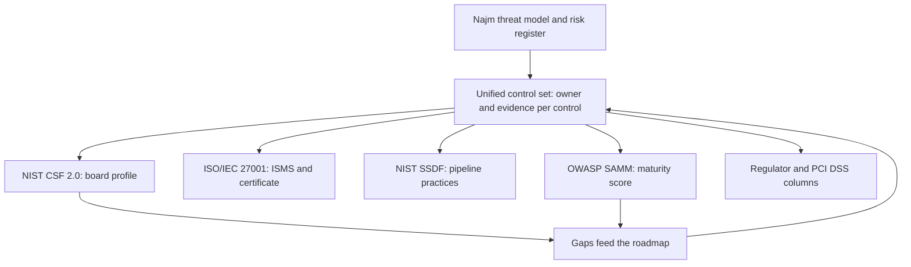
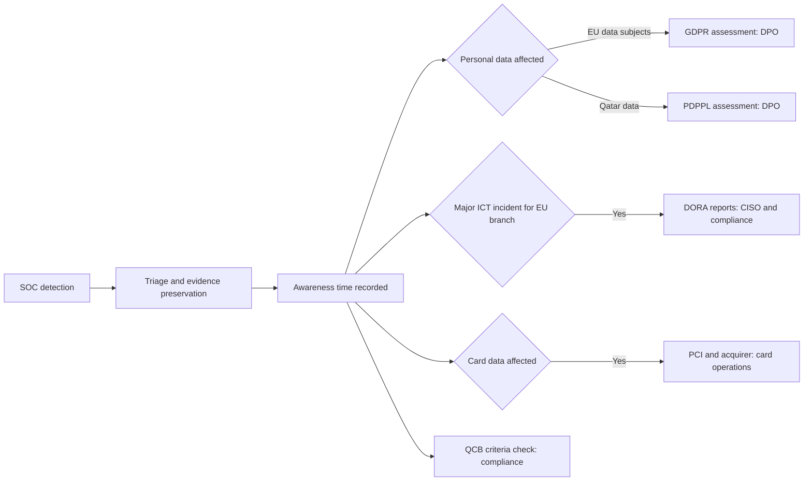
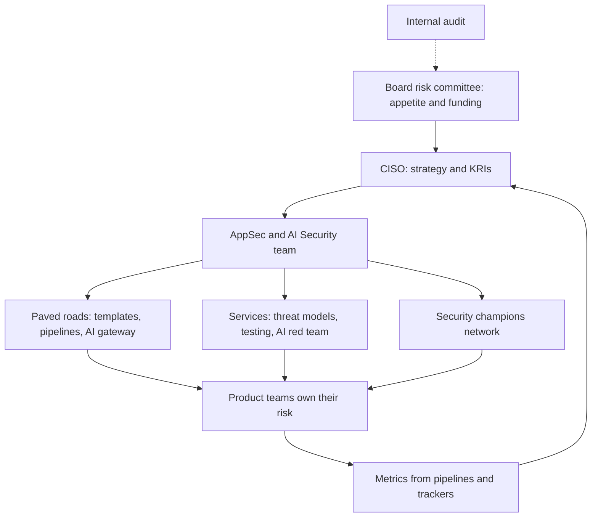

# Module 11 — Governance and leadership

*Every control in Modules 1–10 needs someone to own it, fund it, prove that it works and keep it working as the bank changes. That is governance, and it is where many capable security teams stall. They run four frameworks as four spreadsheet projects. Lawyers read the regulations, but nobody turns them into engineering requirements. And the budget is defended with a count of vulnerabilities that nobody can interpret. This module covers the leadership side of application and AI security. Lesson 11.1 explains the main frameworks (NIST CSF 2.0, ISO/IEC 27001, NIST SSDF and OWASP SAMM) and how to run them as one control set. Lesson 11.2 turns the laws that reach Najm Bank (the GDPR, Qatar's PDPPL, the EU AI Act, DORA and other financial-sector rules) into controls, evidence and incident clocks. Lesson 11.3 builds a programme that lasts: security champions, paved roads, metrics that drive decisions and a budget the board will fund. You will work with Noura and Hamad as they prepare for the audit committee, with Sara and Jassim as an SME Portal incident starts several legal clocks at once, and with Hamad and Ali as they learn why "12,481 vulnerabilities detected" is not a metric and why a bank cannot hire its way to coverage.*

> **Phases:** Govern, Plan — turning controls into an owned, measured and funded programme that satisfies auditors and regulators because it actually reduces risk.

---

# 11.1 — Frameworks: NIST CSF 2.0, ISO/IEC 27001, NIST SSDF and OWASP SAMM
*Level: 🔴 Advanced* · *Prerequisites: 1.3, 6.1* · *Phase: Govern*

## ⚡ In 60 seconds
- A **security framework** is a published, structured set of outcomes, requirements or practices. It helps you find gaps and gives you a shared language with auditors, regulators and customers. It is a map of security, not security itself.
- The four here answer different questions. **NIST CSF 2.0**: what outcomes should the whole organisation achieve? **ISO/IEC 27001**: is there a management system running security that an auditor can certify? **NIST SSDF**: which practices make software secure? **OWASP SAMM**: how mature is our software security practice, and what comes next?
- The rule that matters most: keep **one control set** with named owners and evidence, and **map** it to every framework you need. That mapping is a **crosswalk**.
- Decision cue: a customer wants a certificate → ISO/IEC 27001. The board asks "where are we and where should we be?" → CSF profiles. Engineers ask what the pipeline must do → SSDF. AppSec asks what to improve next → SAMM.
- Biggest trap: treating a certificate or a maturity score as proof of security. Frameworks check that controls exist and run; only testing shows they stop attacks.

## 🧭 Why it matters
Hamad (CISO) receives three requests in one week. The board audit committee wants to know "which framework we follow and where we stand" before the next supervisory review. A large corporate client that wants to connect to the SME Portal's API sends a 300-question security questionnaire and asks whether the platform is ISO/IEC 27001 certified. And Tariq (engineering lead), whose teams now write much of their code with AI coding agents, asks what "secure development" actually requires of his pipelines.

Ali's first plan has four workstreams, one per framework, each with its own spreadsheet. Noura (Head of Application & AI Security) picks one row from each draft. All four describe the same control: every change to the payments API is reviewed and scanned before merge. "If we maintain that control four times, we will prove it four times and improve it zero times. Write it once, give it an owner and evidence, then map it."

The public record shows why running a control matters more than wording it. In 2017 Equifax was breached through a known Apache Struts vulnerability (CVE-2017-5638) for which a fix had already been published. Every mainstream framework already required timely vulnerability management. Public investigations described a patching process that failed to find and fix the vulnerable system. The control existed on paper, not in practice.

## 📐 How it works

### 🟢 The essentials

**Vocabulary.** A **control** is a safeguard that reduces risk, such as "MFA on all admin consoles". A **framework** organises controls or outcomes. A **standard** comes from a standards body; a **certifiable** standard lets an accredited auditor check you and issue a certificate. A **maturity model** scores how well and how consistently you perform a practice.

| | NIST CSF 2.0 | ISO/IEC 27001:2022 | NIST SSDF | OWASP SAMM |
|---|---|---|---|---|
| Publisher and edition | US NIST, February 2024 | ISO and IEC, 2022, amended 2024 | NIST SP 800-218, version 1.1, February 2022 | OWASP community, version 2 |
| What it is | Outcomes for managing cyber risk | Requirements for an information security management system | Secure software development practices | Maturity model for software security |
| Certifiable? | No: you assess yourself | Yes, by accredited certification bodies | No, though used in supplier attestations | No: self- or assisted assessment |
| Najm uses it for | Board view: current and target profile | Certificate for the SME Portal and API platform | Pipeline requirements for every team | Yearly AppSec baseline and roadmap |

**NIST CSF 2.0.** The Cybersecurity Framework is a hierarchy. Six **Functions** sit at the top: **Govern (GV)**, new in 2.0, covering strategy, roles, policy, oversight and supply-chain risk; **Identify (ID)**, covering assets and risk assessment; **Protect (PR)**, covering safeguards such as access control, training and platform security; **Detect (DE)**, covering monitoring and analysis; **Respond (RS)**, covering managing and reporting incidents; and **Recover (RC)**, covering restoring operations.

Each Function splits into **Categories** (22 in total, such as PR.AA, "Identity Management, Authentication and Access Control"), and each Category into **Subcategories**, which are outcome statements. For example, PR.PS-06 says that secure software development practices are integrated and their performance is monitored throughout the life cycle. The CSF says *what* to achieve, not *how*. Version 2.0 also widened its audience from critical infrastructure to all organisations.

Two tools make the CSF useful. A **Profile** describes your posture in CSF terms: a **Current Profile** (where you are) and a **Target Profile** (where you need to be). The gap between them is your roadmap. **Tiers** (1 Partial, 2 Risk Informed, 3 Repeatable, 4 Adaptive) describe how rigorous your cyber risk governance and management are.

**ISO/IEC 27001:2022.** This standard specifies an **information security management system (ISMS)**: the policies, processes, roles and records an organisation uses to manage security risk and improve. Clauses 4 to 10 are mandatory: context and scope, leadership, planning (risk assessment and treatment), support, operation, performance evaluation (monitoring, internal audit, management review) and improvement. **Annex A** lists 93 reference controls in four themes: organisational (37), people (8), physical (14) and technological (34). Several matter directly to AppSec: 8.25 Secure development life cycle, 8.26 Application security requirements, 8.28 Secure coding, 8.29 Security testing in development and acceptance, and 8.8 Management of technical vulnerabilities. You select controls through risk treatment and justify each inclusion or exclusion in a **Statement of Applicability (SoA)**. Certification is a two-stage audit, then yearly surveillance audits and recertification every three years. ISO/IEC 27002 gives guidance on implementing each control.

**NIST SSDF (SP 800-218).** The Secure Software Development Framework groups practices into four families:
- **Prepare the Organization (PO)**: requirements, roles, toolchains, criteria for security checks (PO.4).
- **Protect the Software (PS)**: protect code from tampering, let users verify releases, archive each release.
- **Produce Well-Secured Software (PW)**: secure design, reuse of well-secured components, code review and analysis (PW.7), testing executable code (PW.8), secure defaults.
- **Respond to Vulnerabilities (RV)**: identify and confirm vulnerabilities (RV.1), fix them (RV.2), analyse root causes (RV.3).

Like the CSF, the SSDF describes outcomes rather than tools. NIST SP 800-218A (2024) adds practices for developing generative AI and dual-use foundation models, such as protecting training data and model weights.

**OWASP SAMM.** The Software Assurance Maturity Model has five **business functions**, each with three **security practices**:

| Business function | Security practices |
|---|---|
| Governance | Strategy and Metrics · Policy and Compliance · Education and Guidance |
| Design | Threat Assessment · Security Requirements · Security Architecture |
| Implementation | Secure Build · Secure Deployment · Defect Management |
| Verification | Architecture Assessment · Requirements-driven Testing · Security Testing |
| Operations | Incident Management · Environment Management · Operational Management |

Each practice has two **streams** and three maturity levels. An assessment, based on interviews and evidence, scores each practice from 0 to 3. SAMM is free and open, with a published questionnaire and toolbox.

### 🟡 Going deeper

**How the four fit together.** They are layers, not rivals. The CSF frames the bank's whole cyber risk for the board. ISO/IEC 27001 is the engine that runs, audits and improves controls, and gives outsiders a certificate. The SSDF spells out what "secure development" means inside the CSF's Protect function and ISO's control 8.25. SAMM measures how mature that practice is. Najm's threat model sits underneath them all.



**The crosswalk.** A crosswalk maps each internal control to the matching references in each framework. The internal control is the unit of work; the framework identifiers are labels on it. When a framework changes edition, you update the labels, not the control. Where official mappings exist, start from them: NIST publishes informative references that map the CSF to other standards.

**Write controls that can be tested.** A control nobody can test cannot be evidenced. It fails its audit or, worse, passes on trust. Compare:

```yaml
# Weak: an aspiration, not a control
- id: SDLC-1
  text: "Developers should write secure code."
```

```yaml
# Strong: scoped, owned, mapped and evidenced
- id: NAJM-AS-02
  text: >
    Every change merged to the main branch of a Tier 1 application
    is peer-reviewed and passes SAST, SCA and secret scanning.
  applies_to: [najm-mobile-api, sme-portal, najm-assist]
  owner: Engineering lead (Tariq)
  maps_to:
    nist_csf_2: [PR.PS-06]
    iso_27001_2022: ["8.25", "8.28", "8.29", "8.32"]
    nist_ssdf_1_1: [PO.4, PW.7, PW.8]
    owasp_samm_2: ["Secure Build", "Security Testing"]
  evidence:
    check: "merges to main without required checks, last 90 days"
    pass_if: 0
```

**Design versus operating effectiveness.** Auditors ask whether a control is **designed** to address the risk and whether it **operated** all period, for example by sampling last quarter's merges. Collect evidence automatically from the systems that run the control; screenshots taken the week before an audit prove little.

**Read the scope.** An ISO/IEC 27001 certificate covers only the scope written on it. A cloud supplier's certificate may cover its data centres but not the managed service Najm buys. Before relying on a supplier's certificate, read the scope statement, ask for the SoA or a summary, confirm the certification body is accredited and check the certificate is current.

**SAMM targets are risk choices.** Not every practice needs level 3. Threat Assessment matters a great deal now that Najm Assist is gaining tools that act on accounts; a higher Environment Management score would add little this year.

### 🔴 Expert view

**Compliance is the floor.** Frameworks distil many organisations' experience; your threat model (1.1) describes your own systems. Start from your threats and use frameworks to find blind spots, not the other way round. A Target Profile copied from a template ignores what makes Najm different, such as an LLM agent that can freeze cards.

**Prescriptive and descriptive models.** SAMM is **prescriptive**: it tells you what the next level looks like. **BSIMM** (Building Security In Maturity Model) is **descriptive**: it records activities observed in many real software security programmes. Use it to compare yourself with peers, not as a to-do list.

**Bringing AI into scope.** None of these frameworks needs replacing for AI, but their scope must widen. Models, prompts and datasets belong in the asset inventory (ID.AM); model providers and model hubs in supply-chain risk (GV.SC and ISO's supplier controls); prompt injection and data poisoning in the risk assessment (ID.RA). **ISO/IEC 42001:2023** specifies an AI management system with the same structure as ISO/IEC 27001, so the two can share internal audit and management review. NIST has also published draft work on a CSF profile for AI; check its status. *AI Governance: Zero to Hero* covers AI governance as a whole.

**Goodhart's law applies to scores.** When a SAMM score or a "percentage of controls compliant" becomes a target, teams learn to satisfy the assessor rather than reduce risk. Pair every score with a test outcome: red-team findings, the escape rate (11.3) or incident root causes.

**Keep the crosswalk alive.** At the time of writing (2026) the editions named here are current, but NIST has been working on an update to the SSDF, and certificates to the 2013 edition of ISO/IEC 27001 had to move to the 2022 edition by October 2025. Give one person the job of checking editions every year.

## 🧰 The toolkit
| Control, standard or tool | What it is and does | When to reach for it |
|---|---|---|
| **NIST CSF 2.0** | Six Functions of cyber risk outcomes, with profiles and tiers | Board reporting; organisation-wide gap analysis |
| **ISO/IEC 27001** (with ISO/IEC 27002) | Certifiable ISMS requirements plus 93 Annex A reference controls | Someone needs independent certification; running security as a managed cycle |
| **NIST SSDF** (SP 800-218; SP 800-218A for AI models) | Outcome-based secure development practices in four groups | Defining what every pipeline, team and software supplier must do |
| **OWASP SAMM** | Open maturity model: 15 practices, each scored 0 to 3 | AppSec baseline, roadmap and yearly progress check |
| **BSIMM** | Descriptive study of activities in real software security programmes | Benchmarking against peers |
| **Control crosswalk** | One internal control set mapped to many frameworks | As soon as you answer to more than one framework |
| **ISO/IEC 42001** | AI management system standard with the same structure as ISO/IEC 27001 | Extending the ISMS to AI; see the governance course |

## 🏛️ In practice at Najm Bank
Noura's team publishes **Najm Unified Control Set v1: AppSec and AI extract**. Each control has one owner and one evidence source; the framework columns are labels, checked against the official texts every year.

| ID | Control | Owner | CSF 2.0 | ISO 27001 Annex A | SSDF 1.1 | SAMM v2 | Evidence |
|---|---|---|---|---|---|---|---|
| NAJM-AS-01 | Every Tier 1 application and AI feature has a threat model, reviewed at design and on major change | Noura | ID.RA | 5.8, 8.27 | PW.1, PW.2 | Threat Assessment | Threat-model register linked to design records |
| NAJM-AS-02 | Every merge to main on a Tier 1 app is peer-reviewed and passes SAST, SCA and secret scanning | Tariq | PR.PS-06 | 8.25, 8.28, 8.29, 8.32 | PO.4, PW.7, PW.8 | Secure Build; Security Testing | Automated: merges without checks in 90 days = 0 |
| NAJM-AS-03 | Every release has a signed build and an SBOM; dependencies come only from approved registries | Tariq | GV.SC, ID.AM | 5.21, 8.25 | PS.2, PS.3, PW.4 | Secure Build | Artefact registry; signature verification log |
| NAJM-AS-04 | Critical vulnerabilities on internet-facing systems are fixed within 7 days, CISA KEV entries first | Jassim | ID.RA | 8.8 | RV.1, RV.2 | Defect Management | Vulnerability platform SLA report |
| NAJM-AS-05 | AI features pass an AI red-team gate and a tool-permission review before release | Mariam | ID.RA, PR.AA | 8.29, 5.15 | PW.8; 800-218A | Security Testing | Signed red-team report in the release record |
| NAJM-AS-06 | Developers complete role-based secure coding training each year, including the rules for AI coding agents | Noura | PR.AT | 6.3 | PO.2 | Education and Guidance | Completion by team |

**SAMM targets for the next 12 months (illustrative):** Threat Assessment 1.0 → 2.0, because Najm Assist is gaining tools that act on accounts. Secure Build 1.5 → 2.5, because AI coding agents add dependencies quickly. Defect Management 1.0 → 2.0, because SLAs exist but are not measured. Environment Management stays at 2.0: adequate for current risk.

## 🛠️ Exercises
- 🟢 Take one application you own or work on, or a deliberately vulnerable lab such as OWASP Juice Shop that you run yourself. List eight controls it has today and tag each with its CSF 2.0 Function. *Done when:* every Function has at least one control or a written "gap", and at least one Govern entry names an owner.
- 🟡 Run a light SAMM self-assessment for your own team on Threat Assessment, Secure Build, Security Testing and Defect Management, using the published SAMM questions. *Done when:* each practice has a score from 0 to 3 backed by evidence, and a target tied to a real risk.
- 🔴 Rewrite three of your team's controls in the testable YAML shape above, map them to CSF 2.0, ISO/IEC 27001 Annex A, SSDF and SAMM, and automate the evidence for one of them in your own repository's CI. *Done when:* one control produces machine-readable evidence from your own repository, and every mapping cites an identifier you checked in the official text.

## ⚠️ Mistakes and traps
- **Four frameworks, four projects.** Keep one control set with owners and evidence, and map it.
- **Treating a certificate as proof of security.** Read the scope and the SoA, and test what matters to you.
- **Untestable controls** such as "developers should code securely". Write scoped, owned statements with an evidence source.
- **Chasing the top maturity level everywhere.** Set SAMM targets per practice from your risks.
- **Copying mappings from vendors or blogs.** Check them against the official texts.
- **Leaving AI out of scope.** Add models, prompts, datasets and model providers to the inventory and risk assessment.

## 🧾 Recap
- NIST CSF 2.0 sets organisation-wide outcomes in six Functions, with Govern new in 2.0; profiles show current versus target.
- ISO/IEC 27001:2022 specifies a certifiable ISMS, with 93 Annex A controls selected through risk treatment and justified in the SoA.
- NIST SSDF lists secure development practices in four groups (PO, PS, PW, RV); SP 800-218A extends it to AI model development.
- OWASP SAMM scores 15 software security practices from 0 to 3 and shows the next step.
- Run one control set with owners and automated evidence, mapped to every framework, and judge it by tests, not scores.

## ✍️ Check yourself

**1. A corporate client asks for independent evidence that the SME Portal's API platform runs under an audited, internationally recognised information security management system. What should Najm provide?**

- A. A NIST CSF 2.0 Target Profile
- B. An ISO/IEC 27001 certificate from an accredited body, whose scope covers the SME Portal and API platform
- C. The latest OWASP SAMM scores
- D. A letter from the CISO confirming the SSDF is followed

<details><summary>Answer</summary>

**B.** ISO/IEC 27001 is the certifiable standard, and the certificate's scope must cover the system. The CSF and SAMM are self-assessed (A, C); D is a self-declaration. (🟢 The essentials; 🟡 Read the scope.)

</details>

**2. Ali drafts a control: "Developers should write secure code." What is the best improvement?**

- A. Add "and must follow OWASP guidance"
- B. Map it to more frameworks so it answers more audit questions
- C. Rewrite it as a scoped, owned, testable statement with an automated evidence source
- D. Delete it, because secure coding cannot be governed

<details><summary>Answer</summary>

**C.** A control needs scope, an owner and evidence that it operated. A is still untestable; B labels something nobody can test; D abandons a control every framework requires. (🟡 Write controls that can be tested.)

</details>

**3. What did version 2.0 of the NIST Cybersecurity Framework add that matters most to security leaders?**

- A. A certification scheme run by NIST
- B. A Govern function covering strategy, roles, policy, oversight and supply-chain risk, and an audience widened to all organisations
- C. Mandatory tools for each subcategory
- D. Maturity scores in place of profiles

<details><summary>Answer</summary>

**B.** CSF 2.0 (February 2024) added Govern and widened its scope. It is not certifiable (A), does not prescribe tools (C) and still uses profiles and tiers (D). (🟢 The essentials.)

</details>

**4. Najm's SAMM baseline shows Threat Assessment at 1.0. Hamad asks for every practice to reach level 3 by year end. What is the best response?**

- A. Agree, because level 3 everywhere is what auditors expect
- B. Ask teams to re-rate themselves at 3
- C. Drop SAMM, because maturity models are not useful
- D. Propose risk-based targets per practice, raising Threat Assessment first, and pair scores with test outcomes

<details><summary>Answer</summary>

**D.** SAMM targets are risk choices, and scores must be checked against real results. A misreads SAMM; B games the score; C discards a useful roadmap. (🟡 SAMM targets; 🔴 Goodhart's law.)

</details>

**5. Najm wants practices its engineering teams, including those fine-tuning models, can build into their pipelines. Which source fits best?**

- A. NIST SSDF (SP 800-218), with SP 800-218A for generative AI model development
- B. ISO/IEC 27001 Clause 9 on performance evaluation
- C. The CSF Implementation Tiers
- D. BSIMM, used as a mandatory checklist

<details><summary>Answer</summary>

**A.** The SSDF defines secure development practices and 800-218A extends them to AI models. B measures the ISMS; C describes rigour of risk management; D is descriptive, for benchmarking. (🟢 The essentials; 🔴 Expert view.)

</details>

## 📚 References
- NIST, The NIST Cybersecurity Framework (CSF) 2.0, February 2024 — https://www.nist.gov/cyberframework
- NIST SP 800-218, Secure Software Development Framework (SSDF) Version 1.1 — https://csrc.nist.gov/pubs/sp/800/218/final
- NIST SP 800-218A, Secure Software Development Practices for Generative AI and Dual-Use Foundation Models — https://csrc.nist.gov/pubs/sp/800/218/a/final
- NIST Cybersecurity and Privacy Reference Tool (informative references) — https://csrc.nist.gov/projects/cprt
- ISO/IEC 27001:2022, Information security management systems — Requirements — https://www.iso.org/standard/27001
- ISO/IEC 42001:2023, Artificial intelligence — Management system — https://www.iso.org/
- OWASP SAMM (Software Assurance Maturity Model) — https://owaspsamm.org/
- BSIMM — https://www.bsimm.com/
- CVE-2017-5638 (Apache Struts) — https://www.cve.org/CVERecord?id=CVE-2017-5638

---

# 11.2 — Regulation that touches security: GDPR, PDPPL, the EU AI Act and financial-sector rules
*Level: 🔴 Advanced* · *Prerequisites: 5.3, 10.2, 11.1* · *Phase: Govern, Respond*

## ⚡ In 60 seconds
- Most security law states an **outcome** (appropriate security, resilience, timely notification) and makes you **accountable**: you must show what you did and why. It rarely names a tool.
- For Najm: the **GDPR** for EU customers (Art. 32 security; Arts. 33–34 breach notification, 72 hours to the authority where feasible); Qatar's **PDPPL** (Law No. 13 of 2016); the **EU AI Act** Art. 15 for high-risk AI; **DORA** for EU financial entities; **QCB** and **NCSA** requirements; and **PCI DSS** for card data.
- The engineering move: turn each obligation into a control, an owner and evidence in the 11.1 crosswalk. Each regulation becomes another column.
- Decision cue: in an incident, the first legal question is "when did we become aware?" Several clocks may start then, each with its own threshold and recipient.
- Biggest trap: engineers deciding notifiability alone, or lawyers deciding without facts. Security brings evidence; the DPO, compliance and legal decide. This lesson is not legal advice.

## 🧭 Why it matters
Thursday, 16:40. Jassim's SOC sees unusual download volumes from the SME Portal's report export. Within an hour the team confirms that a user at one company could download other companies' invoice batches: broken access control on the export endpoint (3.3). Some invoices include names, addresses and phone numbers of sole traders in Qatar and in Germany, where Najm's Frankfurt branch serves customers.

Ali starts writing a fix. Sara (DPO) asks four questions. When did we become aware? Whose data, in which countries? Was any of it encrypted? Can we show which records were actually downloaded? Hamad asks whether this is a major ICT-related incident for the Frankfurt branch. Nobody can answer Sara's last question, because the endpoint logs only "report generated", not which records each report contained.

Regulators judge security failures against what an organisation could and should have had in place. In 2020 the UK Information Commissioner's Office fined British Airways over a 2018 attack in which customers' payment card details were skimmed from its website; the penalty notice found that appropriate security measures had not been in place. "Appropriate" is a legal word with engineering content. This lesson shows how to fill it in.

## 📐 How it works

### 🟢 The essentials

**How security law is written.** Laws on data protection and resilience share a pattern:
1. **A risk-based duty**: "appropriate technical and organisational measures", judged against the risk, the state of the art and the cost (GDPR Art. 32).
2. **Accountability**: you must show your risk assessments, tests and decisions, with reasons.
3. **Notification**: you tell the regulator, and sometimes the people affected, within a deadline.
4. **Leadership responsibility**: under DORA (Art. 5) the management body is ultimately responsible for ICT risk; NIS2 (Art. 20) sets similar duties.

**The regimes that reach Najm.** In short; *AI Governance: Zero to Hero* covers the law itself in depth.

| Regime | Reaches Najm when | Security duties | Notification |
|---|---|---|---|
| **GDPR**, Regulation (EU) 2016/679 | Processing in the context of the Frankfurt branch, and some processing about people in the EU | Art. 25 by design and by default; Art. 32 security; Art. 35 DPIA | Art. 33: authority, where feasible within 72 hours of awareness, unless unlikely to result in risk. Art. 34: individuals, if high risk |
| **Qatar PDPPL**, Law No. 13 of 2016 | Personal data processed in Qatar | Precautions against loss, damage, alteration, disclosure and unlawful access | Breaches that may cause serious damage: competent authority and people affected; timings per current guidance |
| **QCB and NCSA requirements** | Licensed by the Qatar Central Bank; national standards from the National Cyber Security Agency | QCB circulars on technology and cyber risk, and its AI guideline; national information assurance standards | As the current texts require |
| **EU AI Act**, Regulation (EU) 2024/1689 | AI used in the EU; high-risk uses include creditworthiness of natural persons (Annex III) | Art. 15 accuracy, robustness, cybersecurity; Art. 12 logging; Art. 50 chatbot transparency | Providers report serious incidents (Art. 73) |
| **DORA**, Regulation (EU) 2022/2554 | EU financial entities, including credit institutions, since 17 January 2025 | ICT risk management, resilience testing, third-party risk | Major ICT incidents: initial, intermediate and final reports |
| **PCI DSS** v4.0.1 | Card data is stored, processed or transmitted | Twelve requirements; Requirement 6 covers secure software | Per card-brand and acquirer agreements |

Whether a regime applies is a legal question. Najm's compliance team decides scope, including how DORA reaches the Frankfurt branch. Two more EU laws sit nearby. **NIS2** (Directive (EU) 2022/2555) covers banking, but DORA applies to financial entities as the sector-specific law where they overlap, so NIS2 reaches Najm mostly through suppliers. The **Cyber Resilience Act** (Regulation (EU) 2024/2847) binds manufacturers of products with digital elements, with vulnerability reporting from September 2026 and most other duties from December 2027; Najm meets it mainly as a buyer.

**From obligation to control.** Read a security clause as a list of requirements, then find or build the controls. GDPR Art. 32(1) lists, "as appropriate": pseudonymisation and encryption (5.1, 5.3); ongoing confidentiality, integrity, availability and resilience, such as tenant isolation (3.3) and segmentation (7.3); timely restoration after an incident, through tested restores (10.2); and regular testing of effectiveness, through SAST, DAST, penetration tests and AI red-teaming (6.1, 9.4). Each obligation becomes a row in a **regulatory obligations register**, linked to the unified control IDs from 11.1.

### 🟡 Going deeper

**Breach clocks.** The GDPR's 72 hours run from when the controller becomes **aware** of a personal data breach; EDPB guidance describes this as a reasonable degree of certainty that a security incident has compromised personal data. A short investigation is allowed; choosing not to look is not. Art. 33(4) allows information in phases, and Art. 33(5) requires every breach to be documented, notified or not.

Under DORA, entities classify ICT-related incidents by criteria such as clients affected, duration, data losses and critical services. For a **major** incident, the technical standards at the time of writing (2026) require an initial notification within 4 hours of classification and no later than 24 hours after awareness, an intermediate report within 72 hours of the initial one, and a final report within a month. Verify against the current standards.

One incident can start several clocks. Najm's runbook classifies once, against every regime's criteria, and runs them in parallel:



Each clock has its own start event, and the awareness time is recorded when it happens, not reconstructed later:

```python
from datetime import datetime, timedelta

# Illustrative: Compliance confirms every deadline against current texts.
def due_times(aware_at: datetime, eu_personal_data: bool,
              major_at: datetime | None = None) -> dict:
    due = {}
    if eu_personal_data:
        due["GDPR Art. 33"] = aware_at + timedelta(hours=72)
    if major_at:
        due["DORA initial"] = min(major_at + timedelta(hours=4),
                                  aware_at + timedelta(hours=24))
    return due
```

**Logs decide the size of a breach.** Because the export endpoint logged only "report generated", Najm cannot rule out any record it could reach, and must treat that wider set as exposed. Record-level security logging (10.1), with personal data minimised in the logs (5.3), turns "we cannot rule it out" into "here is what happened". Encryption pays off legally too: Art. 34(3) says individuals need not be told when the data was unintelligible to anyone unauthorised, for example because it was encrypted and the keys were not compromised.

**The EU AI Act makes AI security an explicit duty.** Art. 15 requires high-risk AI systems to achieve appropriate accuracy, robustness and cybersecurity, consistently throughout their life cycle. Art. 15(5) requires resilience against unauthorised attempts to alter a system's use, outputs or performance, and names AI-specific attacks to prevent, detect, respond to, resolve and control for, where appropriate:

| Art. 15(5) names | Najm control |
|---|---|
| Data poisoning | Data provenance; access control on training stores (8.3) |
| Model poisoning, of pre-trained components | Approved model sources; signed artefacts (6.2, 8.3) |
| Adversarial examples or model evasion | Robustness testing; monitoring for probing (8.3, 9.4) |
| Confidentiality attacks | Rate limits; extraction and membership-inference tests (8.3) |
| Model flaws | Evaluation and AI red-teaming before release (9.4) |

These duties fall mainly on the **provider**, who develops a high-risk system and places it on the market or puts it into service under its own name, as Najm would if it built its own credit-scoring model for EU applicants. Fraud detection is excluded from the Annex III creditworthiness category, so Smart Alerts is not high-risk on that ground; Najm Assist mainly carries the Art. 50 duty to tell people they are talking to an AI. The high-risk rules were due to apply to Annex III systems from 2 August 2026, and the Commission's November 2025 Digital Omnibus proposal sought to delay them; check the current status on EUR-Lex.

**DORA reaches AI vendors too.** The LLM API behind Najm Assist is an **ICT third-party service provider** in DORA's terms: it needs a register entry, Art. 30 contract terms (data locations, security, incident help, audit rights, exit) and a tested exit strategy. Run the vendor's security review and its DORA file as one process.

### 🔴 Expert view

**One incident, several definitions.** A personal data breach (GDPR), a major ICT-related incident (DORA), a serious incident (AI Act) and a card-data compromise (PCI DSS) have different definitions and thresholds. Separate assessments per regime miss deadlines. Put every criterion into one classification step in the runbook (10.2), with named decision owners and a decision log of what was known, when, and why.

**Testing regimes.** DORA requires a resilience testing programme, and **threat-led penetration testing (TLPT)** at least every three years for entities their authorities identify, building on the TIBER-EU framework. Write Mariam's AI red-team scope (9.4) so it can slot into one.

**Data residency shapes architecture.** Sending prompts containing customer data to a model hosted abroad is likely a cross-border transfer of personal data, which both the GDPR and the PDPPL address. Region pinning, redaction before the prompt and log location are legal decisions made in code. Bring Sara in at threat-modelling time (1.1).

**"Appropriate" moves with the state of the art.** MFA for administrators, prompt patching of known exploited vulnerabilities and logs good enough to scope a breach are now widely expected. Expect the same drift for AI: once defences against prompt injection and excessive agency are common, a regulator may ask why you lacked them.

## 🧰 The toolkit
| Control, standard or tool | What it is and does | When to reach for it |
|---|---|---|
| **GDPR** (Arts. 25, 32–35) | EU data protection law: security of processing, breach notification, DPIAs | Any system holding EU customers' personal data |
| **Qatar PDPPL** | Qatar's Law No. 13 of 2016 on personal data protection | Any system holding personal data processed in Qatar |
| **EU AI Act** (Art. 15) | Accuracy, robustness and cybersecurity duties for high-risk AI | Building or buying high-risk AI, such as credit scoring for EU applicants |
| **DORA** | EU rules on ICT risk, incident reporting, resilience testing and ICT third parties | EU financial operations; ICT and AI vendor contracts |
| **NIS2** | EU cybersecurity directive for essential and important entities | Assessing suppliers outside DORA's scope |
| **PCI DSS** | Card industry security standard, currently v4.0.1 | Systems that store, process or transmit card data |
| **Regulatory obligations register** | Each legal obligation mapped to systems, controls, evidence and an owner | Always; it is the regulation columns of the crosswalk |
| **Incident clock matrix** | Notification triggers, recipients, deadlines and decision owners in one table | Incident runbooks and tabletop exercises |

## 🏛️ In practice at Najm Bank
Sara, Hamad and Noura publish two artefacts, reviewed every six months with compliance.

**A. Regulatory obligations register (extract)**

| Obligation | Source | Systems | Unified controls | Evidence | Owner |
|---|---|---|---|---|---|
| Appropriate, regularly tested security of processing | GDPR Art. 32; Qatar PDPPL | All systems with personal data | NAJM-AS-02, 04, 05 | Control report; penetration-test and red-team results | Sara, with Noura |
| Accuracy, robustness and cybersecurity of high-risk AI | AI Act Art. 15 | Planned EU credit-scoring model | NAJM-AS-01, 05, plus data provenance | Robustness tests; red-team report | Dana, with Layla |
| ICT third-party register and contract terms | DORA Arts. 28–30 | LLM API, cloud platform | Vendor security review | Register entry; signed clauses; exit plan | Hamad |
| Secure software for card data | PCI DSS Req. 6 | Najm Mobile card features | NAJM-AS-02, 03, 04 | Assessment evidence pack | Tariq |

**B. Incident clock matrix (annex to the incident playbooks from 10.2)**

| Trigger | Regime | Recipient | Deadline: verify current text | Decides | Engineering supplies |
|---|---|---|---|---|---|
| Personal data breach, EU data subjects | GDPR Art. 33 | Lead supervisory authority | Where feasible 72 hours from awareness | Sara | Records and data types, encryption status, timeline |
| Likely high risk to individuals | GDPR Art. 34 | People affected | Without undue delay | Sara | Contacts for affected records only |
| Breach that may cause serious damage, Qatar data | Qatar PDPPL | Competent authority; people affected | Per current law and guidance | Sara | As above |
| Major ICT-related incident, Frankfurt branch | DORA | EU competent authority | 4 hours from classification, at most 24 from awareness; then 72 hours; then a month | Hamad | Services, clients, duration, root cause |
| Incident meeting QCB criteria | QCB circulars | Qatar Central Bank | Per current circulars | Hamad | As above |
| Card data compromise | PCI DSS, contracts | Acquirer, card brands | Per agreements | Head of card operations | Forensic scope |

Rule: Jassim, as incident commander, records the awareness time in the ticket, and Sara reviews it within an hour. Nobody deletes or overwrites logs during an incident without Jassim's approval.

## 🛠️ Exercises
- 🟢 For an application you own or work on, list the personal data it processes and the countries its users are in. Mark which regimes in this lesson plausibly apply and who decides. *Done when:* each regime has a named decision owner and a "confirm with legal" flag, and nothing is marked "does not apply" without a reason.
- 🟡 Run a paper tabletop of this lesson's SME Portal incident, from detection to the last notification decision. *Done when:* the awareness time is defined with its evidence, every clock in the matrix has a due time, and you have written the log queries that would answer "which records were downloaded?" for an application you own.
- 🔴 For an ML model or LLM feature you own, or one in a local lab, map each attack class in AI Act Art. 15(5) to a control and a test. *Done when:* data poisoning, model poisoning, adversarial examples, confidentiality attacks and model flaws each have a control, a test you have run on your own system, and a stored result.

## ⚠️ Mistakes and traps
- **Waiting for full certainty before starting the clock.** Define awareness criteria, record the time, and notify in phases if needed.
- **Engineers deciding notifiability alone, or lawyers without facts.** Engineers supply evidence; the DPO and compliance decide.
- **Logs too thin to scope a breach.** Log which records sensitive endpoints return, with personal data minimised.
- **Treating the AI Act as governance's problem.** Art. 15 sets engineering requirements.
- **Forgetting third parties.** AI model providers are ICT third parties under DORA.
- **Copying deadlines from secondary sources**, including this course. Read the current text.

## 🧾 Recap
- Security law sets risk-based duties, demands evidence, imposes notification clocks and increasingly puts the duty on the board.
- For Najm: GDPR Arts. 32–34, the Qatar PDPPL, QCB and NCSA requirements, the EU AI Act Art. 15, DORA and PCI DSS; NIS2 and the Cyber Resilience Act mostly via suppliers.
- Turn obligations into controls: a regulatory obligations register with owners and evidence.
- One incident can start several clocks; classify once, record the awareness time, and let logs decide the size of the breach.
- AI Act Art. 15(5) names data poisoning, model poisoning, adversarial examples, confidentiality attacks and model flaws.

## ✍️ Check yourself

**1. A stolen Najm laptop held a spreadsheet of EU customers' personal data. The disk was fully encrypted and the key was not with the device. Which statement is BEST?**

- A. Every customer in the file must be told within 72 hours
- B. Nothing needs to be done, because the data was encrypted
- C. The breach must be documented and assessed under Art. 33, but under Art. 34(3) individuals likely need not be told
- D. Notify only if the theft becomes public

<details><summary>Answer</summary>

**C.** Encryption with uncompromised keys is the Art. 34(3) example, but Art. 33(5) still requires documenting the breach. B skips that duty; A misreads the clocks; D has no basis. (🟡 Logs decide the size of a breach.)

</details>

**2. Dana asks what the EU AI Act requires on security for a credit-scoring model Najm would build for EU applicants. Which answer is MOST accurate?**

- A. Only a notice telling applicants that AI is used
- B. Art. 15: appropriate accuracy, robustness and cybersecurity, including resilience against poisoning, adversarial examples, confidentiality attacks and model flaws
- C. An ISO/IEC 27001 certificate for the data science platform
- D. Nothing, because the Act regulates only general-purpose models

<details><summary>Answer</summary>

**B.** Creditworthiness assessment of natural persons is an Annex III high-risk use, and Art. 15(5) names those attacks. A describes Art. 50 chatbot duties; C and D are wrong. (🟡 The EU AI Act.)

</details>

**3. Forty minutes into the SME Portal incident, what is Ali's most valuable contribution?**

- A. Contain the exposure, preserve the logs, and give Jassim and Sara the facts: when it was found, which data and countries, encryption status, what the logs show
- B. Decide no notification is needed because the users are business customers
- C. Tell nobody until the full root cause is known
- D. Clear the noisy export logs so the fix deploys cleanly

<details><summary>Answer</summary>

**A.** Engineers contain and supply evidence; the DPO and compliance decide. B is a legal call made without facts (sole traders are individuals); C lets clocks run unseen; D destroys evidence. (🔴 Expert view; 🏛️ In practice.)

</details>

**4. Najm Assist calls an external LLM API. For Najm's EU operations, how does DORA treat the API provider?**

- A. Out of scope, because only the AI Act regulates AI
- B. Only the provider has duties, under the AI Act's general-purpose AI rules
- C. Najm only needs the provider's ISO/IEC 27001 certificate
- D. As an ICT third-party service provider, needing a register entry, contract terms and a tested exit strategy

<details><summary>Answer</summary>

**D.** DORA's third-party rules cover ICT services, including AI model APIs. A and B ignore DORA; C is useful evidence but no substitute. (🟡 DORA reaches AI vendors too.)

</details>

**5. Why does it matter, legally as well as technically, that the export endpoint logged only "report generated"?**

- A. It does not; logs are optional under the GDPR
- B. Najm cannot show which records were taken, so it must treat every reachable record as possibly exposed
- C. Logging less always reduces breach obligations
- D. Regulators only look at the last 24 hours of logs

<details><summary>Answer</summary>

**B.** Evidence decides a breach's scope. A ignores accountability; C confuses minimising personal data in logs with not logging access; D is invented. (🟡 Logs decide the size of a breach.)

</details>

## 📚 References
- GDPR, Regulation (EU) 2016/679 — https://eur-lex.europa.eu/eli/reg/2016/679/oj
- European Data Protection Board, Guidelines 9/2022 on personal data breach notification under the GDPR — https://www.edpb.europa.eu/
- EU AI Act, Regulation (EU) 2024/1689 — https://eur-lex.europa.eu/eli/reg/2024/1689/oj
- DORA, Regulation (EU) 2022/2554 — https://eur-lex.europa.eu/eli/reg/2022/2554/oj
- NIS2, Directive (EU) 2022/2555 — https://eur-lex.europa.eu/eli/dir/2022/2555/oj
- Cyber Resilience Act, Regulation (EU) 2024/2847 — https://eur-lex.europa.eu/eli/reg/2024/2847/oj
- Qatar legal portal Al Meezan (Law No. 13 of 2016, PDPPL) — https://www.almeezan.qa/
- Qatar National Cyber Security Agency — https://www.ncsa.gov.qa/
- Qatar Central Bank — https://www.qcb.gov.qa/
- PCI Security Standards Council (PCI DSS) — https://www.pcisecuritystandards.org/
- UK Information Commissioner's Office (enforcement notices) — https://ico.org.uk/

---

# 11.3 — Building a security programme and culture: champions, metrics and budgets
*Level: 🔴 Advanced* · *Prerequisites: 10.3, 11.1, 11.2* · *Phase: Plan, Govern*

## ⚡ In 60 seconds
- A **security programme** is the standing system of people, roles, services, platforms, metrics and budget that keeps controls working while the organisation changes. Projects end; a programme does not.
- A small central team scales through others: **paved roads** (secure defaults built into templates, pipelines and platforms) and **security champions** (trained engineers inside each product team).
- Measure what drives decisions: coverage, speed of fixing, how many flaws escape to production, and risk against appetite. Drop vanity counts such as "vulnerabilities detected".
- Budget from risk: link each line to a named risk, the reduction it buys and the metric that will show it worked. Offer options, not one number.
- Culture is what people do when security is not in the room. Make the secure path the easy one, reward early reporting and run blameless reviews.
- Biggest trap: buying tools instead of building owners. A scanner whose findings nobody triages is a cost, not a control.

## 🧭 Why it matters
In November Hamad has twenty minutes with the board risk committee to defend next year's security budget. Last year's forty-slide deck led with "12,481 vulnerabilities detected". A board member asked whether that was good or bad, and nobody could answer. Rules such as DORA now put ICT risk on the board itself (11.2), so this year's questions will be sharper.

Noura's team has six people and supports about forty product teams. Since most of those teams adopted AI coding agents, the volume of code has grown much faster than her team can review. Ali proposes hiring ten more AppSec engineers. Noura answers: "We cannot hire our way to coverage. Every team has to own its security, and the platform has to make the secure way the default. Our job is to build that, and then prove it is working."

Public guidance agrees. CISA's Secure by Design principles, published with international partner agencies in 2023, ask software makers to take ownership of customer security outcomes, embrace radical transparency and accountability, and lead from the top: programme and culture choices, not tool purchases.

## 📐 How it works

### 🟢 The essentials

**What a programme contains.** Write each element down; the gaps show you where to start.

| Element | Question it answers | Najm example |
|---|---|---|
| Charter and mandate | What is the team for, with what authority? | Approved by the board risk committee; may block a Tier 1 release with an open critical finding |
| Scope and inventory | What do we protect? | Every application, API, AI system and pipeline, tiered by risk |
| Policies and roles | What are the rules, and who does what? | Secure development and AI coding-agent standards; a RACI across teams, champions, AppSec, SOC, DPO and AI governance |
| Services | What does the central team provide? | Threat modelling, design review, testing, AI red-teaming, training, incident support |
| Platforms | What is secure by default? | Paved roads (below) |
| Metrics, budget and roadmap | Is it working, and what next? | Dashboards, board KRIs and costed SAMM targets from 11.1 |

**Three lines.** Many banks organise risk with the Institute of Internal Auditors' **Three Lines Model**. The **first line** (product and engineering teams) owns and manages risk. The **second line** (risk management, compliance and, in many banks, the CISO's office) sets policy, advises and challenges. The **third line** (internal audit) gives the board independent assurance. Where the CISO sits varies; what matters is that system owners own their risks and someone independent checks.

**Security champions.** A champion is an engineer or tester in a product team who spends part of their time on security: answering questions, threat modelling with AppSec, triaging findings and raising problems early. A programme that works has:
- **Volunteers with manager support** and protected time agreed in advance. Unfunded time disappears at the first deadline.
- **Training and a community**: a learning path, a regular forum and quick access to AppSec experts.
- **Clear limits.** The champion multiplies the team's skill; the team lead stays accountable for the team's risk.
- **Recognition**: visible credit, career value and a voice in security standards.

OWASP SAMM's Education and Guidance practice includes building this community, and OWASP also runs a Security Champions Guide project.

**Paved roads.** A paved road, a term popularised by Netflix's engineering teams, is the supported way to build something, with security built in. Teams may leave it, but then need an approved exception. Najm's paved road includes a service template with authentication middleware and logging that redacts personal data; a CI pipeline with SAST, SCA, secret scanning, SBOMs and signed builds; secrets only from the secret manager; a model gateway with logging and guardrails plus a tool-permission framework for Najm Assist (9.2); and approved AI coding agents that run sandboxed without production credentials, whose output passes the same pipeline as human code (6.3). When much of the code is written by agents, a paved road is how security keeps up.

**Exceptions with expiry.** A **risk acceptance process** states who may accept which level of residual risk (for example the system owner for low, the CISO for high, the risk committee for critical), with a written reason, compensating controls and an expiry date. Without it, exceptions become permanent and invisible.

Put together, the operating model looks like this:



### 🟡 Going deeper

**Metrics that drive decisions.** A good security metric has an owner, a formula, an automatic data source, a target and a decision it informs. It is hard to game, or is paired with a metric that exposes gaming.

| Metric | Definition | Tells you | Gamed by, and the check |
|---|---|---|---|
| Threat-model coverage | Tier 1 apps and AI features with a current threat model ÷ all Tier 1 | Is security designed in? | Box-ticking; review a sample |
| Pipeline coverage | Tier 1 repos with required checks enforced ÷ all Tier 1 repos | Is the paved road used? | "Warn only" checks; measure enforcement |
| Fixed within SLA | Critical and high findings closed within SLA ÷ all closed | Are we fast enough? | Easy fixes first; pair with open-overdue |
| Open overdue | Count and age of open findings past SLA, CISA KEV entries first | Where is risk piling up? | Quiet severity downgrades; audit them |
| Escape rate | Findings first found in production (pen test, bug bounty, incident) ÷ all findings | Is earlier testing working? | Under-reporting; watch bounty volume |
| Phishing report rate | Staff who report a simulated phish ÷ staff targeted | Do people report early? | Watching clicks alone; track time to first report |

**Leading and lagging.** Coverage and paved-road adoption are **leading indicators**, moving before risk does; incidents and the escape rate are **lagging**. Report both. **Key risk indicators (KRIs)** are the few metrics with thresholds tied to the bank's **risk appetite**, the amount of risk the board will accept. When a KRI crosses its threshold, a named person acts.

**Survivorship in remediation metrics.** Mean time to remediate over *closed* findings improves when teams close quick fixes and leave hard ones open. Always report what is still open and overdue next to it:

```sql
-- Closed last quarter: share fixed within SLA, by team and severity
SELECT team, severity,
       COUNT(*) AS closed,
       AVG(CASE WHEN closed_at - opened_at <= sla THEN 1.0 ELSE 0 END) AS within_sla
FROM findings
WHERE closed_at >= DATE '2026-07-01' AND closed_at < DATE '2026-10-01'
  AND severity IN ('critical', 'high')
GROUP BY team, severity;

-- Still open and past SLA today: the number that time-to-fix hides
SELECT team, severity,
       COUNT(*) AS open_overdue,
       MAX(CURRENT_DATE - opened_at::date) AS oldest_days
FROM findings
WHERE closed_at IS NULL AND opened_at + sla < NOW()
GROUP BY team, severity;
```

**Reporting to the board.** Dashboards are for teams. The board needs one page: top risks against appetite with their trend, three to five KRIs, what changed, and the decisions or funding needed. Translate findings into consequences: not "312 high findings" but "two internet-facing systems carry known exploited vulnerabilities past our 7-day limit; owners and dates below".

**Building a budget case.** Start from the risk register (1.3), not vendor catalogues. For each proposal, state:
1. The risk, in business terms, such as "an agent tool is misused to move customer money".
2. The expected reduction in likelihood or impact, as a range with reasoning. **FAIR** (Factor Analysis of Information Risk, published as Open Group standards) estimates loss as ranges of frequency and magnitude; an honest, structured qualitative estimate also works.
3. The full cost, including time taken from product teams.
4. The metric that will show it worked, and what you will stop doing.

Present options (a regulatory minimum, a recommended level, an accelerated level), each with the residual risk the board accepts by choosing it. Avoid borrowed statistics: widely repeated claims that a flaw costs "100 times more" to fix in production than in design have weak original sources. Use your own incident, patching and audit data.

### 🔴 Expert view

**Culture shows in behaviour.** In a healthy culture, developers ask for threat modelling early, incidents are reported quickly (including self-inflicted ones), and postmortems are blameless (10.2) and fix the system rather than punish people. Phishing simulations are for learning, never public shaming. Punish reporting and people stop reporting, and your detection gets worse. Leaders set the tone: the "Department of No" becomes "yes, and here is the safe way to do it".

**Ownership through objectives.** Put security outcomes into product teams' own objectives, such as "no Tier 1 release with an open critical finding". Security then competes fairly with features inside the team's plan.

**AI changes the programme, not just the threat list.** With AI coding agents, people approve more code they did not write, so automated checks on the paved road matter more (6.3). AI products add services: AI red-teaming under Mariam, an AI system inventory shared with Layla's AI governance function, tool-permission reviews and model-vendor reviews that also satisfy DORA (11.2). Agree one intake: a new AI feature gets one combined security, privacy and AI-risk review with Sara and Layla, not three.

**Goodhart again.** Any metric tied to bonuses will be optimised. Use metric pairs, add spot checks, and have leaders read a sample of raw findings every month.

**Grow people, not only headcount.** Champions who want to go further are your future AppSec hires, and rotations between the SOC, red team and AppSec build well-rounded defenders. Role-based training beats one annual video; NIST SP 800-50 Rev. 1 describes how to build a learning programme.

**Maturity takes years.** Use the SAMM baseline (11.1) for a 12- to 18-month roadmap and re-assess yearly. Programmes that try to improve every practice at once usually improve none.

## 🧰 The toolkit
| Control, standard or tool | What it is and does | When to reach for it |
|---|---|---|
| **Security champions** | Trained engineers in each product team who spend protected time on security | When the central team cannot cover every team; to spread the paved road |
| **Paved roads** | Supported templates, pipelines and platforms with security built in | Scaling security with code volume, including AI-generated code |
| **Risk acceptance process** | Who may accept which residual risk, with reason, compensating controls and expiry | Any exception to a policy or an SLA |
| **Three Lines Model** (IIA) | First line owns risk, second line sets policy and challenges, third line assures independently | Designing roles, RACIs and board reporting |
| **FAIR** (Open Group) | Method for estimating cyber risk as ranges of loss frequency and magnitude | Budget cases and prioritising large investments |
| **OWASP SAMM** | Open maturity model: 15 practices, each scored 0 to 3 | Programme roadmap and yearly progress check |
| **Secure by Design** (CISA and partners) | Principles: own customer security outcomes, radical transparency, lead from the top | Framing the programme's mission with leadership |

## 🏛️ In practice at Najm Bank
Noura drafts **Najm AppSec and AI Security Programme: 2027 plan on a page**, and Hamad presents it to the board risk committee with three options.

**Mission:** every team at Najm can ship securely by default, and the board can see in five numbers whether application and AI risk is within appetite.

**Metrics and targets (illustrative figures)**

| Metric | Today | End-2027 target | Owner | Audience |
|---|---|---|---|---|
| Tier 1 apps and AI features with a current threat model | 45% | 90% | Noura | Board KRI |
| Tier 1 repos with enforced pipeline checks | 60% | 100% | Tariq | Teams |
| Critical findings fixed within 7 days | 70% | 95% | Product team leads | Board KRI |
| CISA KEV vulnerabilities past SLA on internet-facing systems | 4 | 0 | Jassim | Board KRI |
| AI features released through the AI red-team gate | 50% | 100% | Mariam | Board KRI |
| Product teams with an active champion | 15 of 40 | 36 of 40 | Noura | Board KRI |
| Escape rate | 30% | 15% | Noura | Teams |

**Budget options**

| Option | What it buys | Residual risk the board accepts |
|---|---|---|
| A. Regulatory minimum | Current team; DORA testing programme; PCI DSS assessment | Agent tool misuse and AI-generated code risks largely unaddressed; KRIs stay amber |
| B. Recommended | A, plus a champions programme with 10% protected time, an AI paved road (model gateway and tool-permission framework), two AI red-team engineers, and two overlapping scanners retired | KRIs green by end-2027, except the escape rate |
| C. Accelerated | B, plus a bug bounty for Najm Mobile and Najm Assist and a yearly external AI red-team | Faster progress; higher running cost; depends on hiring |

Each line of option B cites its risk-register entry: agent tool misuse, vulnerable dependencies in AI-generated code, or slow remediation.

**Champion role card:** about 10% of working time, agreed with the team lead; triages the team's scanner findings weekly; joins threat modelling for every Tier 1 change; attends the monthly champions forum; is the SOC's first contact in incidents affecting the team. Not accountable for the team's risk: that stays with the team lead.

## 🛠️ Exercises
- 🟢 Define three security metrics for your own team or project. For each, write the formula, the data source, the owner, the decision it informs and a paired metric that exposes gaming. *Done when:* each metric could be computed automatically, and at least one is a leading indicator.
- 🟡 Using findings from your own repositories (for example, your code host's dependency or code-scanning alerts) or from scanning a local OWASP Juice Shop instance you run, compute the share fixed within SLA and the open-overdue list, using the queries above or a spreadsheet. *Done when:* you have both numbers, the age of the oldest open finding, and a two-sentence explanation for a non-technical reader.
- 🔴 Write a one-page budget case for one programme improvement, such as a champions programme, an AI paved road or a bug bounty, with three options. *Done when:* each option names the risk addressed, its cost in people and money bands, the metric that should move and by roughly how much, what you would stop doing, and the residual risk the decision-maker accepts.

## ⚠️ Mistakes and traps
- **Vanity metrics** such as "vulnerabilities detected". Report coverage, speed, escape rate and KRIs against appetite.
- **Champions without time.** Agree protected time with managers and keep accountability with the team lead.
- **Tools without owners.** Before buying, name who triages the output and the SLA; retire tools nobody uses.
- **Security as the "Department of No".** Build paved roads and offer the safe way to do what teams need.
- **Permanent exceptions.** Every risk acceptance has an owner, compensating controls and an expiry date.
- **Budget requests built on borrowed statistics.** Use your own incident and remediation data, ranges and options.

## 🧾 Recap
- A programme is a standing system: charter, scope, policies, roles, services, platforms, metrics, budget and roadmap.
- Scale through paved roads and security champions; keep risk ownership with the first line and independent checks from audit.
- Good metrics have an owner, a formula, a data source, a target and a decision; pair them to resist gaming, and watch open-overdue alongside time-to-fix.
- Boards need one page: top risks against appetite, a few KRIs, changes and decisions. Budget cases link each option to risks, metrics and residual risk.
- Culture shows in behaviour: early reporting, blameless reviews and secure defaults that make the safe way the easy way.

## ✍️ Check yourself

**1. Last year's board slide said "12,481 vulnerabilities detected". What should replace it?**

- A. The same number, with a target to double detection
- B. Every critical finding with its CVSS score
- C. Top risks against appetite with their trend, three to five KRIs such as known exploited vulnerabilities past SLA, and the decisions needed
- D. A screenshot of the scanner dashboard

<details><summary>Answer</summary>

**C.** Boards need risk against appetite and decisions, not raw counts. A rewards finding over fixing; B and D are operational detail the board cannot act on. (🟡 Reporting to the board.)

</details>

**2. Ali proposes that each team's security champion be held accountable for every security defect the team ships. What is the best response?**

- A. Agree, because accountability motivates champions
- B. Keep accountability with the team lead; the champion is a multiplier with protected time, training and recognition
- C. Make the central AppSec team accountable instead
- D. Replace champions with another scanner

<details><summary>Answer</summary>

**B.** Risk ownership stays with the first line. A drives volunteers away; C puts accountability on the wrong line; D swaps owners for tools. (🟢 Security champions.)

</details>

**3. Over a year, mean time to remediate high findings falls from 40 to 15 days, but open high findings past SLA double. What is the most likely explanation?**

- A. Survivorship: the metric counts only closed findings, so quick fixes improved it while hard items aged
- B. The scanner is broken
- C. Attackers have become more active
- D. The SLA is too long

<details><summary>Answer</summary>

**A.** Time-to-fix over closed findings hides what stays open; pair it with open-overdue count and age. B, C and D do not explain the pattern. (🟡 Survivorship in remediation metrics.)

</details>

**4. Most of Najm's forty product teams now write code with AI coding agents, and volume has outgrown AppSec's review capacity. Which response scales best?**

- A. AppSec reviews every pull request by hand
- B. Ban AI coding agents
- C. Hire enough AppSec engineers to review all new code
- D. A paved road: approved sandboxed agents, secure service templates and a required pipeline with SAST, SCA, secret scanning and signed builds, supported by champions

<details><summary>Answer</summary>

**D.** Secure defaults and automated checks scale with volume. A and C cannot keep pace; B pushes usage out of sight. (🟢 Paved roads; 🔴 Expert view.)

</details>

**5. Which budget request gives the board the best basis for a decision?**

- A. "Industry studies show fixes cost 100 times more in production, so we need more"
- B. "Our peers spend more than we do"
- C. Three options, each tied to named risks, with full cost, the metric that will move, what is retired and the residual risk accepted
- D. A list of tools the team would like

<details><summary>Answer</summary>

**C.** Options tied to risks, metrics and residual risk support a real decision. A relies on a weakly sourced statistic; B compares spend, not risk; D starts from tools. (🟡 Building a budget case.)

</details>

## 📚 References
- CISA, Secure by Design — https://www.cisa.gov/securebydesign
- CISA, Known Exploited Vulnerabilities Catalog — https://www.cisa.gov/known-exploited-vulnerabilities-catalog
- OWASP SAMM (Education and Guidance; Strategy and Metrics) — https://owaspsamm.org/
- OWASP (Security Champions Guide project) — https://owasp.org/
- NIST, The NIST Cybersecurity Framework (CSF) 2.0, Govern function — https://www.nist.gov/cyberframework
- NIST SP 800-50 Rev. 1, Building a Cybersecurity and Privacy Learning Program; NIST SP 800-55, Measurement Guide for Information Security — https://csrc.nist.gov/
- The Institute of Internal Auditors, the Three Lines Model — https://www.theiia.org/
- The Open Group, FAIR risk taxonomy and analysis standards — https://www.opengroup.org/
