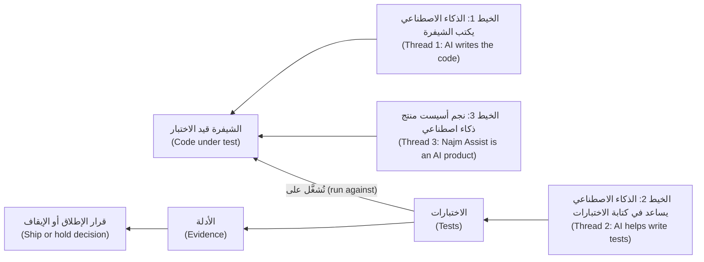
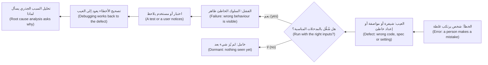
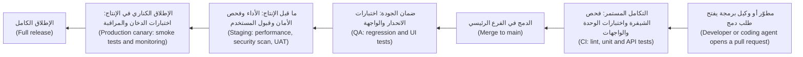

# الوحدة 0 — التوجيه (Orientation)

*قبل أن تكتب اختبارًا واحدًا (a single test) تحتاج إلى خريطة (a map). تمنحك هذه الوحدة ثلاثة أشياء. أولًا، فكرة دقيقة عن الغاية من الاختبار (what testing is for): اكتشاف العيوب (finding defects) وتزويد من يتخذون القرار بأدلة حقيقية (real evidence) عن الجودة (quality) والمخاطر (risk)، في عالم يكتب فيه الذكاء الاصطناعي (AI) جزءًا كبيرًا من الشيفرة (code)، ويساعد في كتابة الاختبارات (tests)، ويُطلق منتجات لا تتطابق إجاباتها مرتين تمامًا (never quite the same twice). ثانيًا، فهم كيف تفشل البرمجيات (how software fails): السلسلة الممتدة من الخطأ البشري (human error) إلى العيب (defect) ثم إلى الفشل (failure)، ومواضع نشأة العيوب، والكوارث التي علّمت القطاع (the disasters that taught the industry)، وكلفة اكتشاف العيب متأخرًا (what it costs to find a bug late). ثالثًا، الأشخاص والمختبر الذين ستعمل معهم في بقية الدورة: فريق هندسة الجودة (Quality Engineering) في بنك نجم (Najm Bank)، والأنظمة التي يختبرونها، ونظام عيّنة صغير (a small sample system) فيه عيوب مزروعة عمدًا (deliberately seeded bugs). ستتابع ندى (Nada)، الخريجة الجديدة (a new graduate)، وهي تتعلّم أن العلامة الخضراء ليست دليلًا (a green tick is not proof)، وراشد (Rashid) الذي يعلّمها أن تسأل هل يمكن أن يفشل الاختبار (whether a test could fail). وستنتهي بمختبر يعمل (a working lab)، وعيب واحد التقطتَه وآخر فاتك (one bug caught and one missed)، وخطة للدراسة.*

> **التركيز (Focus):** Mindset — الغاية من الاختبار (what testing is for)، وكيف تفشل البرمجيات (how software fails)، وكيف تستخدم الدورة ونظام العيّنة (how to use the course and the sample system).

---

# 0.1 — ما هو اختبار البرمجيات (What software testing is)، وما ليس هو (and what it is not): الجودة (quality) والمخاطر (risk) وتحوّل عصر الذكاء الاصطناعي (the AI-era shift)
*المستوى (Level): 🟢 مبتدئ (Beginner)* · *المتطلبات (Prerequisites): لا يوجد (none)* · *التركيز (Focus): Mindset*

## ⚡ الدرس في دقيقة (In 60 seconds)
- **اختبار البرمجيات (Software testing)** هو تقييم البرمجيات (evaluating software) لاكتشاف العيوب (defects) ولتزويد أصحاب المصلحة (stakeholders) بأدلة (evidence) عن الجودة (quality) والمخاطر (risk). إنه ينتج معلومات (information)، لا جودة، ولا يستطيع أبدًا أن يثبت أنه لم يبقَ أي عيب (can never prove that no bugs remain).
- **تصحيح الأخطاء (Debugging)** يجد سبب الفشل (a failure's cause) ويصلحه. و**ضمان الجودة (quality assurance, QA)** يخص العملية (process)، و**ضبط الجودة (quality control, QC)** يخص المنتج (product)، و**هندسة الجودة (quality engineering)** تبني الجودة داخل الفريق كله (builds quality in across the team). والاختبار (testing) نشاط واحد بينها.
- كلمة «يعمل» ("Works") ليست خاصية واحدة (not one property). يسرد المعيار ISO/IEC 25010 (2011) ثماني خصائص للجودة (eight quality characteristics)؛ فقد يكون التحويل صحيحًا (correct) لكنه بطيء (slow) أو غير آمن (insecure) أو غير قابل للاستخدام (unusable) بالعربية (in Arabic).
- ثلاثة خيوط في عصر الذكاء الاصطناعي (three AI-era threads) تمرّ عبر الدورة: اختبار شيفرة كتبها ذكاء اصطناعي (testing code an AI wrote)، واستخدام الذكاء الاصطناعي في الاختبار (using AI to test)، واختبار منتجات الذكاء الاصطناعي (testing AI products). في كل منها اسأل: *هل يمكن أن يفشل هذا الاختبار؟* ⁦(could this test fail?)⁩
- مؤشّر القرار (Decision cue): قبل أن تكتب اختبارًا (a test) أو تقبله، سمِّ الفشل الذي سيلتقطه (name the failure it would catch).
- الفخ الأكبر (Biggest trap): قراءة اللون الأخضر على أنه دليل (reading green as proof). فهو يعني «هذه الفحوص لم تجد شيئًا» ("these checks found nothing").

## 🧭 لماذا يهم (Why it matters)
في أسبوعها الثاني في بنك نجم (Najm Bank)، تراجع ندى (Nada) طلب دمج (pull request) من أحد فِرق (squads) طارق (Tariq). أضاف وكيل برمجة (coding agent) رسم التحويل الدولي (international-transfer fee) ومعه عشرة اختبارات جديدة (ten new tests). خط التكامل والتسليم المستمرين (pipeline) أخضر، وتقول التغطية (coverage) إن كل سطر جديد قد نُفِّذ (every new line ran). وتوافق ندى عليه في ست دقائق.

بعد أيام قليلة يسأل راشد (Rashid)، رئيس هندسة الجودة (Head of Quality Engineering): «ماذا أخبرتكِ العلامة الخضراء (the green tick)؟» تقول ندى إن الاختبارات تنجح (the tests pass). «وهل كانت ستفشل لو كان الرسم خاطئًا؟» لا تعرف. فيشغّلان اختباراتها العشرة على نظام العيّنة (sample system) الخاص بالدورة مع تفعيل عيب في الرسم (a fee bug switched on). تنجح العشرة. ثم يجرّبان عيوب التحويل الأربعة الأخرى (the other four transfer bugs). تنجح العشرة في كل مرة. يقول راشد: «الاختبار الذي لا يمكن أن يفشل ليس دليلًا. إنه زينة.» ⁦("A test that cannot fail is not evidence. It is decoration.")⁩

لا يشتري البنك اختبارات (tests)، بل يشتري قرارات (decisions): نُطلق أم نتريّث (ship or hold)، نُصلح الآن أم نقبل المخاطرة (fix now or accept the risk). والاختبارات هي الأدلة (the evidence) وراء هذه القرارات، والدليل قد يكون ضعيفًا (weak). وتزداد هذه المسألة أهمية الآن لأن الشيفرة تصل أسرع من بُناة (builders)، بشريين وآليين (human and AI)، يتّسمون بالطلاقة (fluent) ويخطئون أحيانًا بثقة (confidently wrong). يمنحك هذا الدرس المفردات (vocabulary)، وعادة التشكيك في العلامة الخضراء (questioning a green tick).

## 📐 كيف يعمل (How it works)

### 🟢 الأساسيات (The essentials)

**ما هو الاختبار (What testing is).** يقيّم الاختبار (testing) البرمجيات بتشغيلها (**الاختبار الديناميكي (dynamic testing)**) أو بفحصها (examining it)، كما في المراجعات (reviews) والتحليل الساكن (static analysis) (**الاختبار الساكن (static testing)**). وله مهمتان: **اكتشاف العيوب (find defects)** قبل أن يصادفها العملاء (customers)، و**تقديم الأدلة (give evidence)** عن الجودة (quality) والمخاطر (risk) إلى **أصحاب المصلحة (stakeholders)** الذين عليهم أن يقرروا: مالكو المنتج (product owners)، والمهندسون (engineers)، والعمليات (operations)، والمخاطر والامتثال (risk and compliance).

لكل اختبار موقف (situation) أي المدخلات والحالة الابتدائية (inputs and starting state)، وفعل (action)، و**مرجع النتيجة المتوقعة (test oracle)**: أي شيء يخبرك أن النتيجة صحيحة، مثل متطلب (requirement) أو مثال محسوب يدويًا (worked example) أو النسخة السابقة (the previous version) أو حكم خبير (an expert's judgement). فبلا مرجع تكون لديك عملية تشغيل (a run) لا اختبار (not a test). في `fee("3090", "QAR", "international")` القاعدة (the rule) هي 0.35% من المبلغ (the amount)، مقرَّبةً إلى الأعلى عند المنتصف (rounded half up). يدويًا، 3,090 × 0.0035 = 10.815، وتُقرَّب إلى 10.82. هذا الرقم المحسوب يدويًا (hand-worked number) هو المرجع (the oracle).

**الاختبار وما يجاوره (Testing and its neighbours).** المسمّيات الوظيفية (job titles) تطمس الفروق بين هذه الكلمات، فانظر إلى ما يفعله الناس.

| المصطلح (Term) | السؤال الذي يجيب عنه (The question it answers) | في بنك نجم (At Najm Bank) |
|---|---|---|
| **الاختبار (Testing)** | أين يختلف هذا البرنامج (this software) عمّا نحتاج إليه (what we need)؟ | تبلّغ ندى (Nada) عن فرق في الرسم قدره سنت واحد (a one-cent fee difference) |
| **تصحيح الأخطاء (Debugging)** | أين السبب (the cause)، وكيف نزيله (remove it)؟ | يتتبّعه مطوّر (developer) إلى سطر واحد (one line) |
| **ضبط الجودة (Quality control, QC)** | هل يستوفي هذا المنتج (this product) المعيار المطلوب (the bar)؟ | فحوص (checks) قبل بيئة ما قبل الإنتاج (staging) |
| **ضمان الجودة (Quality assurance, QA)** | هل تمنع طرق عملنا العيوب (defects)؟ | قواعد المراجعة (review rules)، وتعريف الإنجاز (definition of done) |
| **هندسة الجودة (Quality engineering)** | كيف نبني الجودة (quality) في كل خطوة (every step)؟ | فريق راشد: الأتمتة (automation) وخطوط التكامل والتسليم المستمرين (pipelines) |

يبيّن الاختبار أن هناك خطأً، ويجد تصحيح الأخطاء السبب. وبعد الإصلاح (a fix) يعيد **اختبار التأكيد (confirmation testing)** تشغيل الاختبار الفاشل (the failing test)، ويتحقق **اختبار الانحدار (regression testing)** من أن شيئًا آخر لم ينكسر (nothing else broke).

**التحقق والمصادقة على الملاءمة (Verification and validation).** يسأل **التحقق (verification)**: «هل نبني المنتج بشكل صحيح؟» ⁦("are we building it right?")⁩، أي هل يطابق البرنامج مواصفاته (match its specification)؟ ويسأل **المصادقة على الملاءمة (validation)**: «هل نبني المنتج الصحيح؟» ⁦("are we building the right thing?")⁩، أي هل يلبّي الاحتياجات الحقيقية (real needs)؟ قد تنجح صفحة في أحدهما وتفشل في الآخر: تنصّ المواصفات (the specification) على عرض رمز القاعدة (rule code) عند رفض التحويل (rejected transfer)، والصفحة تفعل ذلك، ومع هذا لا يتعلّم العميل (customer) شيئًا حين يقرأ `above_per_transfer_max`.

**ما لا يستطيع الاختبار فعله (What testing cannot do).** يبيّن الاختبار أن العيوب موجودة (defects are present)، لا أنها غير موجودة أبدًا (never that none remain) — وهي ملاحظة إدسخر دايكسترا (Edsger Dijkstra) وأول مبادئ الاختبار السبعة في ISTQB (the seven ISTQB testing principles). والسبب حسابي (arithmetic): في عملة واحدة ونوع واحد من التحويلات، يمكن أن تُمرَّر إلى `check_transfer` نحو 2.5 مليون مبلغ صالح (valid amounts) وخمسة ملايين قيمة محتملة لـ«ما أُرسل اليوم» ("already sent today"): أي نحو 12.5 تريليون توليفة (combinations)، قبل احتساب العملات والأنواع الأخرى. **الاختبار الاستنفادي مستحيل (Exhaustive testing is impossible)**، ولذلك فالاختبار هو أخذ عيّنات بعناية (careful sampling) (توضّح الوحدة 1 كيف يتم ذلك). والتقرير الأمين (an honest report) يقول «نظرنا هنا ووجدنا هذا» ("we looked here and found this")، لا «إنه صحيح» ("it is correct").

**الفحص مقابل الاختبار (Checking versus testing).** يفصل مايكل بولتون (Michael Bolton) وجيمس باخ (James Bach)، من مجتمع الاختبار المرتبط بالسياق (context-driven community)، بين **الفحص (check)** و**الاختبار (testing)**. الفحص يطبّق قاعدة قرار (decision rule) على ملاحظة (observation)، مثل `assert fee(...) == Decimal("10.82")`: تستطيع الآلة تشغيله، لكنه لا يؤكد إلا ما توقّعه شخص ما (what someone expected). أما الاختبار، بمعناهما، فهو العمل البشري (human work) في التعلّم عن المنتج (learning about a product) باستكشافه (exploring it)، بما في ذلك ملاحظة ما لم يكتب له أحد تأكيدًا (assertion). هذه مفردات مدرسة واحدة (one school's vocabulary) — فمنهج ISTQB (the ISTQB syllabus) لا يضع هذا الفاصل — لكنها مفيدة: فالمجموعة الآلية (automated suite) لا تسجّل إلا ما كنت تعرف أن تسأل عنه (what you already knew to ask).

### 🟡 التعمق أكثر (Going deeper)

**ماذا يعني «يعمل» (What "works" means).** يصف المعيار ISO/IEC 25010 ثماني خصائص للجودة (eight quality characteristics): **الملاءمة الوظيفية (functional suitability)** و**كفاءة الأداء (performance efficiency)** و**التوافقية (compatibility)** و**قابلية الاستخدام (usability)** و**الموثوقية (reliability)** و**الأمان (security)** و**قابلية الصيانة (maintainability)** و**قابلية النقل (portability)**. تعيد مراجعة 2023 تسمية بعضها وتوسّع بعضها الآخر، فتضيف السلامة (safety)؛ أما هذه الدورة فتستخدم أسماء 2011 المألوفة. والنموذج لا يقول ما الذي تختبره (what to test)؛ لكنه يمنعك من نسيان عائلات كاملة من الفشل (whole families of failure). عشر طرق يمكن أن يفشل بها تحويل (Ten ways a transfer can fail):

| # | ما الذي يحدث خطأً (What goes wrong) | الخاصية (Characteristic) | يُكتشف بواسطة (Found by) |
|---|---|---|---|
| 1 | يُحتسب على تحويل دولي (international transfer) بمبلغ 3,090 QAR رسمٌ قدره 10.81 لا 10.82 | الملاءمة الوظيفية (Functional suitability): الصحة (correctness) | اختبارات الوحدة (Unit tests)، الدرس 2.1 |
| 2 | يُمنع عميل (customer) أرسل اليوم (today) 49,000 QAR من إرسال 1,000 QAR، مع أن المبلغ يبلغ الحد (the limit) بالضبط | الملاءمة الوظيفية (Functional suitability): الحالات الحدّية (boundary) | تحليل القيم الحدّية (Boundary analysis)، الدرس 1.2 |
| 3 | يحصل تحويل في الساعة 16:30 بتوقيت قطر (Qatar time) على تاريخ قيمة اليوم (today's value date): فقد قُرئ وقت الإغلاق (the cut-off) بالتوقيت العالمي المنسّق (UTC) | الملاءمة الوظيفية (Functional suitability): المناطق الزمنية (time zones) | اختبارات تراعي الزمن (Time-aware tests)، الدرس 1.2 |
| 4 | يعيد التطبيق المحاولة (retries) عند اتصال غير مستقر (shaky connection) فيدفع العميل مرتين (pays twice) | الموثوقية (Reliability): تحمّل الأعطال (fault tolerance) | اختبارات خاصية عدم التكرار (Idempotency tests)، الدرس 3.1 |
| 5 | يقرأ بوب (Bob) تحويل أليس (Alice) بتخمين معرّفه (guessing its id) (BOLA) | الأمان (Security): السرّية (confidentiality) | اختبارات التفويض (Authorisation tests)، الدرس 4.2 |
| 6 | في يوم الراتب (salary day) يتباطأ إرسال الطلبات (submissions) من أقل من ثانية إلى اثنتي عشرة ثانية (twelve seconds) | كفاءة الأداء (Performance efficiency) | اختبارات الحِمل (Load tests)، الدرس 4.1 |
| 7 | يضغط مستخدم قارئ الشاشة (screen-reader user) على «إرسال» ("Send") ولا يسمع شيئًا (hears nothing) | قابلية الاستخدام (Usability): إمكانية الوصول (accessibility) | مرور بقارئ الشاشة (Screen-reader pass)، الدرس 3.3 |
| 8 | تعرض الصفحة العربية (Arabic page) رمز قاعدة بالإنجليزية (an English rule code) لا جملة يمكن التصرف بناءً عليها (a sentence to act on) | قابلية الاستخدام (Usability): الرسائل الموطَّنة (localised messages) | فحوص التوطين (Localisation checks)، الدرس 3.3 |
| 9 | يُرجع إصدار جديد من واجهة البرمجة (API version) الحقل `fee` رقمًا (a number)، بينما يتوقع إصدار التطبيق 5.1 (app version 5.1) نصًّا (a string) | التوافقية (Compatibility) | اختبارات العقد (Contract tests)، الدرس 2.2 |
| 10 | تغيير الرسم (fee change) يعني تعديل سبعة ملفات (seven files)؛ ولا تبدأ الخدمة بعد ترقية Python | قابلية الصيانة (Maintainability)؛ قابلية النقل (portability) | المراجعة (Review)، ومصفوفة التكامل المستمر (CI matrix)، الدرس 5.2 |

تعني BOLA *كسر التفويض على مستوى الكائن* (broken object-level authorisation): أي وصول مستخدم إلى بيانات مستخدم آخر ([*أمن الذكاء الاصطناعي والتطبيقات (Secure AI & Application Security)*، الدرس 3.3 — التفويض (Authorisation): كسر التحكم في الوصول (broken access control) وIDOR وتعدد المستأجرين (multi-tenancy)](../secai/index.ar.html#/3.3)). التصنيف اجتهاد (Classification is judgement): في الصف 4 يضيع المال أيضًا، لكن ما تختبره هو النجاة من إعادة المحاولات (surviving retries)، وهذا سؤال موثوقية (a reliability question). وقيمة النموذج في السؤال الذي يطرحه: *أي الصفوف سيؤذي نجم أكثر، وما الأدلة التي لدينا؟* ⁦(which rows would hurt Najm most, and what evidence do we have?)⁩

**التحوّل في عصر الذكاء الاصطناعي: ثلاثة خيوط (The AI-era shift: three threads).** يغيّر الذكاء الاصطناعي (AI) من يكتب الشيفرة (who writes the code)، ومن يكتب الاختبارات (who writes the tests)، وما هو المنتج نفسه (what the product is). تعمل هذه المقتطفات (snippets) على نظام العيّنة (sample system)، الذي يُجهَّز في الدرس 0.3؛ ولا تحتاج إلى تشغيلها الآن.



*الخيط الأول (Thread 1): اختبار شيفرة كتبها ذكاء اصطناعي (testing code that an AI wrote).* استخدمت دالة الرسم التي كتبها الوكيل (the agent's fee) أعدادًا عشرية ثنائية (binary floats)، والاختبار المكتوب انطلاقًا من الشيفرة (a test written from the code) ينسخ حسابها (copies its arithmetic):

```python
from decimal import Decimal
from najm.transfers import fee

def test_mirror():
    # Weak: the expected value is computed the way the code computes it.
    expected = Decimal(str(round(3090 * 0.0035, 2)))
    assert fee(3090, "QAR", "international") == expected

def test_oracle():
    # Strong: the expected value was worked out by hand from the fee rule.
    assert fee("3090", "QAR", "international") == Decimal("10.82")
```

عند تفعيل `NAJM_BUGS=float_fee` — وهو العيب الموجود في شيفرة الوكيل (the bug in the agent's code) — ينجح `test_mirror` ويفشل `test_oracle`: `assert Decimal('10.81') == Decimal('10.82')`. وعند إيقاف العيب تنعكس الأحكام (the verdicts swap). الاختبار المشتق من التنفيذ (a test derived from the implementation) يدافع عن العيب (defends the bug)، لذا يجب أن يأتي مرجع النتيجة المتوقعة (the oracle) من مكان آخر ([*تصميم الأنظمة لمبرمجي الفايب (System Design for Vibe Coders)*، الدرس 8.2 — الاختبارات بوصفها المواصفة التي لا يستطيع الوكيل تجاهلها (Tests as the spec the agent can't ignore)](../vibe/index.ar.html#l8-2)).

*الخيط الثاني (Thread 2): استخدام الذكاء الاصطناعي في الاختبار (using AI to test).* الاختبارات العشرة في طلب الدمج الخاص بندى (Nada's pull request) جاءت من مساعد ذكاء اصطناعي (an AI assistant) أيضًا. وهي تبدو هكذا:

```python
import pytest
from decimal import Decimal
from najm.transfers import fee

@pytest.mark.parametrize("kind", ["own", "domestic", "international"])
@pytest.mark.parametrize("amount", ["50", "1500", "30000"])
def test_fee_returns_a_decimal(kind, amount):
    result = fee(amount, "QAR", kind)
    assert result is not None
    assert isinstance(result, Decimal)
    assert result >= 0

def test_unknown_kind_raises():
    with pytest.raises(ValueError):
        fee("10", "QAR", "teleport")
```

تنجح العشرة كلها، وتنفّذ كل سطر في `fee()` يُنفَّذ في بناء عادي (a normal build). ومع تفعيل كل عيب من عيوب التحويل تظل تنجح: فهي تفحص *نوع* الإجابة و*إشارتها* (the *type* and *sign* of the answer)، ولا تفحص قيمتها أبدًا (never its value). العلاج هو قياس المساعدين (measure assistants): ازرع عيوبًا معروفة (seed known bugs) وعدّ ما تلتقطه اختباراتهم (count what their tests catch) (الدرس 6.3).

*الخيط الثالث (Thread 3): اختبار منتجات الذكاء الاصطناعي (testing AI products).* تتغيّر صياغة نجم أسيست (Najm Assist) بين تشغيل وآخر (wording changes between runs)؛ وتحاكي `FakeModel` في العيّنة ذلك بمعامل `temperature`. ويجب أن يثبّت الاختبار الحقائق لا الجملة (pin the facts, not the sentence):

```python
import pytest
from najm.assist import FakeModel, answer

def test_vacuous():
    # Weak: any non-empty text passes, including an invented answer.
    assert answer("Can I pay in bitcoin?")["text"]

@pytest.mark.parametrize("seed", range(20))
def test_grounded(seed):
    # Strong: wording may vary; the fact and its source may not.
    result = answer("What is the daily transfer limit?", FakeModel(temperature=0.8, seed=seed))
    assert "50,000 QAR" in result["text"]
    assert result["sources"][0] == "limits"

def test_silence_is_admitted():
    # Strong: when no policy applies, the assistant must say so.
    result = answer("Can I pay in bitcoin?")
    assert result["sources"] == []
    assert "can't find that" in result["text"]
```

مع `NAJM_AI_BUGS=hallucinate` يخترع المساعد رسمًا لسؤال البيتكوين (invents a fee for the bitcoin question): يظل `test_vacuous` ناجحًا، ويفشل `test_silence_is_admitted`. والمقارنة بنص حرفي (an exact-string comparison) ليست أفضل: فهي تفشل عند اختلاف غير ضار (harmless variation)، فيتجاهلها الناس. وتحوّل الوحدة 7 هذا إلى منهج (a method) ([*حوكمة الذكاء الاصطناعي (AI Governance)*، الدرس 9.3 — الاختبار والتقييم والمصادقة والفريق الأحمر (Testing, evaluation, validation and red-teaming)](../aigp/index.ar.html#/9.3) يقدّم منظور الحوكمة (the governance view)).

**ثلاث خرافات (Three myths).**

| الخرافة (Myth) | أقرب إلى الحقيقة (Closer to the truth) |
|---|---|
| «سيحلّ الذكاء الاصطناعي محل المختبِرين.» ⁦("AI will replace testers.")⁩ | يغيّر الذكاء الاصطناعي طريقة كتابة الاختبارات وتشغيلها (how tests are written and run)، لكن لا بد أن يقرر أحدٌ معنى «صحيح» (what correct means) ويحكم على الأدلة (judge the evidence)، كما أظهر كل مقتطف (each snippet showed). ولا أحد يستطيع أن يَعِد بكيفية تغيّر الأدوار (how roles will change). |
| «الاختبارات تبطّئنا.» ⁦("Tests slow us down.")⁩ | المجموعة البطيئة أو غير المستقرة (a slow or flaky suite) هي التي تفعل ذلك؛ والعلاج اختبارات أدق (sharper tests). أما غياب الاختبارات (no tests) فينقل الكلفة إلى الإنتاج (production). |
| «تغطية 100% تعني لا عيوب.» ⁦("100% coverage means no bugs.")⁩ | تقيس التغطية (coverage) الأسطر المنفَّذة (lines run) لا الأشياء المفحوصة (things checked). الاختبارات العشرة المولَّدة نفّذت كل سطر عادي من `fee()` ولم تلتقط أيًّا من العيوب الخمسة (none of five bugs). |

### 🔴 نظرة الخبير (Expert view)

**الجودة علائقية (Quality is relational).** عرّف جيرالد واينبرغ (Gerald Weinberg) الجودة بأنها «قيمة لشخص ما» ("value to some person")؛ ويضيف باخ (Bach) وبولتون (Bolton) «ممّن يُعتدّ بهم» ("who matters"). العملاء (customers) والموظفون (staff) والمدقّقون (auditors) والجهات التنظيمية (regulators) يزنون الخصائص (characteristics) بصورة مختلفة، ولذلك يبدأ ملف الجودة (a profile) بسؤال *لمن* الجودة (*whose* quality).

**مراجع النتائج قواعد استدلالية، وللدليل قوة (Oracles are heuristics, and evidence has strength).** المواصفات (Specifications) تتقادم؛ وقد يكون السلوك القديم (old behaviour) عيبًا. أما **مشكلة مرجع النتيجة (oracle problem)**، أي معرفة الجواب الصحيح دون إعادة العمل (knowing the right answer without redoing the work)، فهي خفيفة في `fee()` وشديدة في نجم أسيست (Najm Assist)، حيث تصحّ صياغات كثيرة ويخطئ بعضها خطأً دقيقًا (subtly wrong). ولا يدعم الاختبار الناجح (a passing test) الثقةَ إلا إذا كان سيفشل لو وُجد العيب (would have failed had the bug been present). اسأل عن أي تشغيل أخضر: *لو كان العيب الذي أخشاه موجودًا هنا، فهل سيكون هذا التشغيل أحمر؟* ⁦(if the bug I fear were here, would this run be red?)⁩ يؤتمت اختبار الطفرات (mutation testing) هذا السؤال (الدرسان 2.3 و6.2)؛ وتتيح العيوب المزروعة (seeded bugs) أن تطرحه يدويًا ([*تصميم الأنظمة لمبرمجي الفايب (System Design for Vibe Coders)*، الدرس 9.4 — التحقق قبل الإكمال (Verification before completion)](../vibe/index.ar.html#l9-4)).

**الاختبار اقتصادي (Testing is economic).** قيمة الاختبار هي الخسارة التي يمنعها (the loss it prevents) موزونةً بالاحتمال (weighted by likelihood)، فيتبع العمق المخاطر (depth follows risk) (الدرس 5.1). **متى لا تفعل كل هذا (When not to do all this):** نصٌّ برمجي لمرة واحدة (a one-off script) تشغّله مرة، على بيانات تستطيع فحصها بالعين (data you can inspect by eye)، يحتاج إلى نظرة (a glance)، لا إلى مجموعة اختبارات (a suite).

## 🧰 الأدوات (The toolkit)
| الأداة أو الممارسة أو التقنية (Tool, practice or technique) | ما هي وماذا تفعل (What it is and does) | متى تلجأ إليها (When to reach for it) |
|---|---|---|
| **Test oracle** — مرجع النتيجة المتوقعة | مصدر الحقيقة (the source of truth) الذي تُقارن به النتيجة: مواصفة (a spec)، أو مثال محسوب يدويًا (a worked example)، أو نسخة سابقة (a previous version)، أو لائحة تنظيمية (a regulation) | في كل اختبار تكتبه أو تراجعه (every test you write or review): من أين تأتي القيمة المتوقعة (the expected value)؟ |
| **ISO/IEC 25010 quality model** — نموذج الجودة ISO/IEC 25010 | قائمة قياسية (a standard list) من ثماني خصائص لجودة المنتج (eight product-quality characteristics) | لتحويل «إنه يعمل» ("it works") إلى قائمة تحقق من أوجه الفشل (a checklist of failures) |
| **Exploratory testing** — الاختبار الاستكشافي | التعلّم وتصميم الاختبار وتنفيذه في وقت واحد (learning, test design and execution at once)، بتوجيه من ميثاق الجلسة (a charter) | لاكتشاف ما لا يغطيه أي فحص (what no check covers) |
| **Seeded bugs** — العيوب المزروعة | عيوب تُفعَّل عمدًا (defects switched on deliberately)، مثل `NAJM_BUGS` في العيّنة | لقياس ما إذا كانت المجموعة تستطيع أن تفشل (whether a suite can fail) |
| **Risk-based testing** — الاختبار القائم على المخاطر | اختيار ما يُختبر ومدى عمقه (choosing what to test, and how deeply) بحسب الاحتمال والأثر (likelihood and impact) | لتقرير أين يُصرف الوقت (deciding where time goes) |
| **pytest** | إطار اختبار Python شائع الاستخدام (a widely used Python test framework): `assert` عادي (plain)، وتجهيزات الاختبار (fixtures)، وتحديد المعاملات (parametrisation) | اختبارات Python في هذه الدورة |

## 🏛️ عمليًا في بنك نجم (In practice at Najm Bank)
تبدأ كل ميزة في نجم بـ**ملف جودة (quality profile)**: صفحة واحدة تقول ما معنى «يعمل» ("works") بكلمات يستطيع شخصان التحقق منها بالطريقة نفسها (two people could check the same way). يملؤه راشد (Rashid) ومالك المنتج (the product owner) قبل تصميم الاختبارات (before test design). هذه مسودة التحويلات (the Transfers draft)، بأهداف توضيحية (illustrative targets).

| الخاصية (Characteristic) | ما معنى «جيد» ("good") للتحويلات (What "good" means for Transfers) | الأولوية (Priority) | أول دليل (First evidence) |
|---|---|---|---|
| الملاءمة الوظيفية (Functional suitability) | يطابق الرسم (fee) والحد (limit) ووقت الإغلاق (cut-off) وتاريخ القيمة (value date) القواعد المنشورة (published rules) لكل عملة ومبلغ | عالية (High) | أمثلة محسوبة يدويًا عند الحدود (Worked examples at boundaries) |
| كفاءة الأداء (Performance efficiency) | 95% من الطلبات (submissions) تنتهي خلال ثانية واحدة (within one second) عند ذروة يوم الراتب (salary-day peak) | عالية (High) | اختبار الحِمل (Load test) على بيئة ما قبل الإنتاج (staging) |
| التوافقية (Compatibility) | يعمل كل إصدار مدعوم من التطبيق بعد كل إصدار من واجهة البرمجة (API release) | متوسطة (Medium) | اختبارات العقد (Contract tests) |
| قابلية الاستخدام (Usability) | يمكن إرسال تحويل بأي من اللغتين (either language)، وبقارئ شاشة (screen reader)؛ وكل رفض (rejection) يقول ما العمل (what to do) | عالية (High) | جلسات استكشافية (Exploratory sessions) مع أمل (Amal) |
| الموثوقية (Reliability) | لا يُنشئ طلب أُعيدت محاولته (a retried request) تحويلًا ثانيًا أبدًا؛ ولا يُضيّع الانهيار (a crash) مالًا أبدًا | عالية (High) | اختبارات خاصية عدم التكرار (Idempotency tests) |
| الأمان (Security) | لا يقرأ أحد مال عميل آخر ولا ينقله (reads or moves another customer's money) | عالية (High) | مصفوفة التفويض (Authorisation matrix) مع نورة (Noura) |
| قابلية الصيانة (Maintainability)، وقابلية النقل (portability) | يمسّ تغيير الرسم (fee change) مكانًا واحدًا واختبارًا واحدًا؛ وتعمل الخدمة على بيئات التشغيل المدعومة (supported runtimes) | منخفضة (Low) | المراجعة (Review)، ومصفوفة التكامل المستمر (CI matrix) |

**لملء واحد منها في ثلاثين دقيقة (To fill one in, in thirty minutes):** اكتب جملة واحدة قابلة للملاحظة (one observable sentence) لكل خاصية (characteristic)، وأعد صياغتها إن أمكن أن يختلف شخصان على تحقّقها (rewrite it if two people could disagree on whether it is met)؛ رتّب كل خاصية بحسب الأولوية (rank each)؛ سمِّ أول دليل (name first evidence) لكل صف عالي الأولوية (each High row)؛ واكتب شيئًا واحدًا خارج النطاق (one thing out of scope).

## 🛠️ التمارين (Exercises)
- 🟢 **عرّف الجودة لميزة (Define quality for a feature).** اختر ميزة تعرفها، مثل صفحة تسجيل الدخول (login page) أو حجز التذاكر (ticket booking)، واملأ ملف الجودة (the profile). *يكتمل عندما (Done when):* يكون لكل صف جملة واحدة يستطيع شخصان التحقق منها بالطريقة نفسها، وتكون ثلاثة صفوف ذات أولوية عالية (High) مع سبب (a reason)، ويكون شيء واحد مكتوبًا على أنه خارج النطاق (out of scope).
- 🟡 **اذكر أنماط الفشل (List failure modes).** للميزة نفسها، اكتب اثنتي عشرة طريقة على الأقل (at least twelve ways) يمكن أن تفشل بها، تغطي ست خصائص على الأقل (at least six characteristics). قدّر الاحتمال (likelihood) والأثر (impact) من 1 إلى 5. *يكتمل عندما (Done when):* يقول كل صف كيف سنلاحظ الفشل (how we would notice) — ملاحظةً قابلة للرصد (an observation)، لا مجرد «اختبره» ("test it") — وتُرتَّب الثلاثة الأعلى بحسب الاحتمال × الأثر (likelihood × impact) مع سطر من التعليل لكل منها.
- 🔴 **جلسة استكشافية مدتها 20 دقيقة (A 20-minute exploratory session).** اختر موقعًا عامًّا أو تطبيقًا يحق لك استخدامه زائرًا عاديًّا (an ordinary visitor)، واكتب ميثاق الجلسة (a charter): «استكشف *هذه الميزة* بـ*هذا المُدخل* لاكتشاف *هذا النوع من المشكلات*.» ⁦("Explore this feature with this input to discover this kind of problem.")⁩ اضبط مؤقتًا على 20 دقيقة (a 20-minute timer). استخدمه كما يفعل أي زائر: دون ماسحات (scanners) أو نصوص برمجية (scripts) أو أحمال (load)، ودون بيانات شخصية حقيقية (real personal data)، وتوقّف عند أي خطوة تسجيل دخول أو دفع (login or payment step). اكتب ثلاث نتائج (three findings). *يكتمل عندما (Done when):* تذكر كل نتيجة أين ومتى (where and when) (الجهاز والمتصفح والوقت)، وما يصل إلى ست خطوات للتكرار (up to six repeat steps)، والمتوقع مقابل الفعلي (expected versus actual)، والخاصية المعنية ومن يتأثر (the characteristic involved and who is affected)، بحيث يستطيع زميل تكرارها (repeat it)؛ إضافةً إلى ملاحظة واحدة عن شيء غريب رأيتَه مقبولًا (something odd you judged acceptable).

## ⚠️ أخطاء وفخاخ (Mistakes and traps)
- **اعتبار اللون الأخضر دليلًا (Treating green as proof).** اسأل عمّا كانت الفحوص (the checks) قادرة على إيجاده، وأثبت ذلك بتفعيل عيب (switching a bug on).
- **ترك الشيفرة تقدّم مرجعها بنفسها (Letting the code supply its own oracle).** القيم المتوقعة المحسوبة بصيغة التنفيذ (computed with the implementation's formula) تدافع عن عيوبه. احسبها يدويًا.
- **اختبار الوظيفة وحدها (Testing only function).** تحويل صحيح لكنه بطيء أو غير مراعٍ لإمكانية الوصول أو غير آمن (slow, inaccessible or insecure) ما زال يخذل العملاء (still fails customers). استخدم الخصائص الثماني (the eight characteristics) قائمةَ تحقق (a checklist).
- **تصديق التغطية (Believing coverage).** الأسطر المنفَّذة (lines run) ليست سلوكًا جرى التحقق منه (behaviour verified). استخدم التغطية (coverage) لتجد ما لم يُختبر (what is untested)، لا لتدّعي ما اختُبر.
- **الاختبار في النهاية (Testing last).** العيوب التي تُكتشف حين تصبح الشيفرة «منتهية» ("done") تصل متأخرة وباهظة (late and expensive) (الدرس 0.2).

## 🧾 الخلاصة (Recap)
- الاختبار يقيّم البرمجيات (evaluates software) لاكتشاف العيوب (find defects) وتزويد أصحاب المصلحة (stakeholders) بأدلة عن الجودة والمخاطر (evidence about quality and risk)؛ ولا يستطيع أن يثبت أنه لم يبقَ أي عيب (prove no defects remain).
- تصحيح الأخطاء (Debugging) يُصلح، وضمان الجودة (QA) عملية (process)، وضبط الجودة (QC) منتج (product)، وهندسة الجودة (quality engineering) تبني الجودة داخل العمل (builds quality in).
- «يعمل» ("Works") يشمل ثماني خصائص في ISO/IEC 25010؛ فاسأل أيها يهم هنا (which matter here)، ولمن (and to whom).
- يحتاج الاختبار إلى مرجع نتيجة مستقل (an independent oracle)؛ أما الاختبارات المنسوخة من الشيفرة (tests copied from the code) أو التي لا تفحص شيئًا (checking nothing) فتنجح بينما الشيفرة خاطئة.
- تختزل الخيوط الثلاثة لعصر الذكاء الاصطناعي (the three AI-era threads) في سؤال واحد: هل يمكن أن يفشل هذا الاختبار؟ ⁦(could this test fail?)⁩

## ✍️ اختبر نفسك (Check yourself)

**1. يولّد مساعد (an assistant) عشرة اختبارات لـ`fee()`. تنجح كلها، وتُظهر التغطية (coverage) أن كل سطر نُفِّذ (every line ran). ماذا يترتب على ذلك؟**

- A. منطق الرسم (fee logic) جرى التحقق منه (verified)، لأن كل سطر فيه نُفِّذ
- B. المجموعة (suite) جيدة بما يكفي للدمج (good enough to merge)، لأن التغطية عالية
- C. لا يُتعلَّم الكثير (little is learned) حتى تصبح المجموعة حمراء (turns red) مع تفعيل عيب في الرسم
- D. ينبغي التخلص من الاختبارات (discarded)، لأن ذكاءً اصطناعيًا (an AI) كتبها

<details><summary>الإجابة</summary>

**C.** تُظهر التغطية (Coverage) أي الأسطر نُفِّذت، لا ما إذا كان التأكيد (an assertion) سيلاحظ قيمة خاطئة. فعِّل عيبًا وانظر هل تصبح المجموعة حمراء. الخياران A وB يعاملان التغطية كأنها دليل (treat coverage as proof)؛ والخيار D يحكم بحسب المصدر (judges by source). (🟡 التعمق أكثر (Going deeper)، الخيط الثاني (thread 2).)

</details>

**2. يفشل اختبار (a test) لأن رسم تحويل ما خاطئ. يقرأ مطوّر (a developer) الشيفرة، ويجد السطر المعيب (the faulty line)، ويغيّره. ما هذا النشاط؟**

- A. المصادقة على الملاءمة (Validation)
- B. اختبار الانحدار (Regression testing)
- C. الاختبار الساكن (Static testing)
- D. تصحيح الأخطاء (Debugging)

<details><summary>الإجابة</summary>

**D.** يحدد تصحيح الأخطاء (Debugging) سبب الفشل ويزيله؛ أما الاختبار فقد كشف الفشل فقط (only revealed the failure). وإعادة تشغيل الاختبارات بعد ذلك هي اختبار التأكيد (confirmation testing) أو اختبار الانحدار (regression testing). (🟢 الأساسيات (The essentials).)

</details>

**3. لا يعلن قارئ الشاشة (screen reader) شيئًا (announces nothing) بعد أن يضغط عميل (a customer) على «إرسال التحويل» ("Send transfer"). الرسم والرصيد صحيحان (the fee and balance are correct). أي خاصية من خصائص ISO/IEC 25010 تتأثر أساسًا (mainly affected)؟**

- A. قابلية الاستخدام (Usability)، عبر إمكانية الوصول (accessibility)
- B. الملاءمة الوظيفية (Functional suitability)، عبر الصحة (correctness)
- C. الموثوقية (Reliability)، عبر تحمّل الأعطال (fault tolerance)
- D. الأمان (Security)، عبر السرّية (confidentiality)

<details><summary>الإجابة</summary>

**A.** السؤال هو هل يستطيع من يستخدمون قارئ الشاشة (people using a screen reader) استخدام الميزة. الخيار B مغرٍ لأن المال انتقل بصورة صحيحة، لكن الإصلاح يُحكم عليه بإمكانية الوصول (accessibility). (🟡 التعمق أكثر (Going deeper).)

</details>

**4. يشغّل فريق 5,000 اختبار آلي (automated tests) وتنجح كلها. ماذا يستطيع أن يدّعي بأمانة (honestly claim)؟**

- A. لم يبقَ أي عيب، لأن 5,000 اختبار مستقل نجحت
- B. لا مخاطرة في الإصدار (the release carries no risk)، لأن شيئًا لم يفشل في الاختبار
- C. أصبح كل متطلب مُثبَتًا صحته (proven correct) بواسطة المجموعة
- D. لم تظهر أي حالات فشل في الحالات التي شُغِّلت (no failures appeared in the cases run)؛ أما الحالات الأخرى فغير مختبَرة (other cases are untested)

<details><summary>الإجابة</summary>

**D.** يبيّن الاختبار وجود العيوب (the presence of defects)، لا غيابها (not their absence). والمجموعة الناجحة (a passing suite) دليل عن المواقف التي مارستها (the situations it exercised)، فاسأل عمّا لم تغطّه. (🟢 الأساسيات (The essentials).)

</details>

**5. يفتتح نجم أسيست (Najm Assist) إجاباته (answers) بطرق مختلفة في تشغيلات مختلفة (different runs)، مع أن الحقائق متطابقة (the facts match). أي اختبار هو الأنسب (most appropriate)؟**

- A. مقارنة نص الإجابة كاملًا بنص مخزَّن (a stored string)، كلمةً بكلمة
- B. التأكيد أن الحقيقة الأساسية (the key fact) تظهر وأن وثيقة الحدود (limits document) مذكورة مصدرًا
- C. تشغيله مرة واحدة وحفظ المخرجات لقطةً (a snapshot) للمقارنة لاحقًا
- D. التأكيد فقط أن الإجابة ليست فارغة (not empty)، أيًّا كان ما تقوله

<details><summary>الإجابة</summary>

**B.** فهو يثبّت ما يجب ألا يتغير (pins what must not change)، أي الحقيقة ومصدرها (the fact and its source)، ويترك الصياغة تتنوع (letting wording vary). الخيار A يفشل عند اختلاف غير ضار (harmless variation)، والخيار D ينجح مع الإجابات المخترعة (invented answers)، والخيار C هش (brittle) مثل A. (🟡 التعمق أكثر (Going deeper)، الخيط الثالث (thread 3).)

</details>

## 📚 المراجع (References)
- ISTQB، منهج المختبِر المعتمد، المستوى التأسيسي (Certified Tester Foundation Level syllabus)، الإصدار 4.0 (2023) — https://www.istqb.org/
- ISO/IEC 25010، نموذج جودة المنتج SQuaRE (SQuaRE product quality model) (معيار مدفوع (a paid standard))
- وثائق pytest (pytest documentation) — https://docs.pytest.org/
- مبادرة الوصول إلى الويب في W3C (W3C Web Accessibility Initiative) — https://www.w3.org/WAI/
- OWASP، مشروع أهم 10 مخاطر لواجهات البرمجة (API Security Top 10 project) — https://owasp.org/
- نظام العيّنة للدورة، تحويلات نجم (Course sample system, Najm Transfers) — https://github.com/Tamoura/system-design-for-vibe-coders/tree/main/testing/sample

---

# 0.2 — كيف تفشل البرمجيات (How software fails): الأخطاء (errors) والعيوب (defects) وحالات الفشل (failures) والكوارث الشهيرة (famous disasters) واقتصاديات اكتشاف العيوب مبكرًا (the economics of finding bugs early)
*المستوى (Level): 🟢 مبتدئ (Beginner)* · *المتطلبات (Prerequisites): 0.1* · *التركيز (Focus): Mindset*

## ⚡ الدرس في دقيقة (In 60 seconds)
- يرتكب شخص **خطأً بشريًا (error)**؛ فيترك **عيبًا (defect, bug, fault)** في الشيفرة (code) أو المواصفة (specification) أو الإعداد (setting)؛ وحين يُنفَّذ العيب في الظروف المناسبة (under the right conditions) تُظهر البرمجيات **فشلًا (failure)**. ويرجع **تحليل السبب الجذري (root-cause analysis)** إلى الخطأ (the error) وإلى سبب عدم إيقاف أي شيء له (why nothing stopped it).
- قد يظل العيب خاملًا (dormant). عيب `float_fee` في العيّنة (the sample) يعطي رسمًا خاطئًا (wrong fee) في 407 من 25,000 مبلغ بالريال الكامل (whole-riyal amounts) حتى الحد الأقصى للتحويل الواحد (per-transfer maximum)، أي نحو واحد من كل 61، لذا قد تفوّته أمثلة قليلة منتقاة يدويًا (a few hand-picked examples).
- تبدأ العيوب في كل مكان (Defects start everywhere): المتطلبات (requirements)، والتصميم (design)، والشيفرة (code)، والإعدادات (configuration)، والبيانات (data)، والبيئة (environment)، والتكامل (integration).
- اكتشاف العيب مبكرًا (finding a defect earlier) يكلّف عادةً أقل. ومنحنى الكلفة الشهير (the famous cost curve) قاعدة تقريبية (a rule of thumb): اتجاهه يطابق التجربة (its direction matches experience)، أما مضاعفاته فمتنازع عليها (its multipliers are contested).
- كل عيب أفلت (every escaped bug) يستحق اختبار انحدار (regression test) وملاحظة عن السبب الجذري (a root-cause note).
- الشيفرة التي يكتبها الذكاء الاصطناعي (AI-written code) تغيّر مزيج العيوب (the mix of defects)، لا السلسلة (not the chain).

## 🧭 لماذا يهم (Why it matters)
في أول يوم اثنين من الشهر، تنبّه مهمة المطابقة (reconciliation job) في الإدارة المالية (Finance) إلى أمر صغير: فُرض على بعض التحويلات الدولية (international transfers) رسمٌ أقل بسنت واحد (one cent) من الجدول المنشور (the published table). المبلغ تافه، ومع ذلك يضع راشد (Rashid) ثلاث حقائق على السبّورة (whiteboard). البنك يحصّل من العملاء أقل من اللازم (undercharging) منذ خمسة أسابيع. والاختبارات كانت خضراء كل يوم (green every day). والسبب سطر واحد اجتاز المراجعة (passed review).

لحالات الفشل العلنية (Public failures) الشكل نفسه على نطاق أكبر. ففي عام 2012 نشرت شركة Knight Capital شيفرة جديدة (deployed new code)، ولم يصل التحديث إلى خادم واحد (one server missed the update)، فأرسل منطق قديم (old logic) أوامر غير مقصودة (unintended orders) لنحو 45 دقيقة؛ ويقدّر أمر هيئة الأوراق المالية والبورصات الأمريكية (SEC's order) الخسارة بنحو 460 مليون دولار أمريكي. ولا يُقاس العيب (A defect) بحجم الرقم الخاطئ، بل بمدة تشغيله (how long it runs)، وبمقدار ما يعتمد عليه (how much depends on it)، وبمدى صعوبة التراجع عنه (how hard it is to undo).

## 📐 كيف يعمل (How it works)

### 🟢 الأساسيات (The essentials)

**الخطأ والعيب والفشل (Error, defect, failure).** **الخطأ البشري (error)**، أو الغلطة (mistake)، فعل بشري ينتج شيئًا خاطئًا، مثل قاعدة أُسيء فهمها (a misread rule). أما **العيب (defect, bug, fault)** فهو الخلل الذي يتركه في أحد النواتج (artefact): سطر شيفرة (a line of code) أو متطلب (a requirement) أو إعداد (a setting). و**الفشل (failure)** هو السلوك الخاطئ الذي يمكنك ملاحظته (observe) حين يُنفَّذ العيب. ليس كل عيب يسبب فشلًا؛ فالخلل الذي يحتاج إلى مُدخل غير معتاد (unusual input) يبقى صامتًا (stays silent).



**مثال محلول خطوة بخطوة (A worked example, step by step).** مع تفعيل عيب `float_fee` في العيّنة (bug on)، يعطي `fee("3090", "QAR", "international")` القيمة 10.81، لكن القاعدة (the rule)، أي 0.35% مقرَّبةً إلى الأعلى عند المنتصف (rounded half up)، تعطي 10.82.

1. **الخطأ (The error).** من كتب الشيفرة، شخصًا كان أو وكيلًا (person or agent)، عامل 0.35% على أنه العدد العشري `0.0035` (the float) وافترض أن `round` تعني «التقريب إلى السنتات» ("round to cents"). وهذان خطآن (Two mistakes): المال في أعداد عشرية ثنائية (money in binary floats)، والدالة المضمَّنة `round` (the built-in) التي ترسل التعادلات التامة إلى الجار الزوجي (sends exact ties to the even neighbour) (`round(0.125, 2)` تساوي `0.12`)، لا التقريب إلى الأعلى عند المنتصف (not half up).
2. **العيب (The defect).** سطر واحد من `fee()`: يضرب `float(amount)` في العدد العشري `0.0035`، ويقيّد النتيجة (clamps the result)، ويطبّق الدالة المضمَّنة `round` على منزلتين (to two places).
3. **لماذا يظهر هنا (Why it fires here).** 3,090 × 0.0035 تساوي بالضبط 10.815، أي نصف سنت (a half cent)، وهذا ما لا تستطيع الأعداد العشرية الثنائية (binary floats) تخزينه:

```python
from decimal import Decimal

x = 3090 * 0.0035
print(x)                                      # 10.815 (what Python shows)
print(f"{Decimal(x):.20f}")                   # 10.81499999999999950262 (what is stored)
print(Decimal("3090") * Decimal("0.0035"))    # 10.8150 (exact, so half up gives 10.82)
```

4. **كم مرة (How often).** احفظ الملف باسم `fee_survey.py` في مجلد العيّنة (the sample folder) وشغّله:

```python
import os

from najm.transfers import fee

amounts = [str(a) for a in range(1, 25_001)]   # whole riyals, 1 to 25,000 (the maximum)

os.environ["NAJM_BUGS"] = ""                   # no bug: the correct fee
correct = {a: fee(a, "QAR", "international") for a in amounts}
os.environ["NAJM_BUGS"] = "float_fee"          # bug on: the same calls again
buggy = {a: fee(a, "QAR", "international") for a in amounts}

wrong = [a for a in amounts if correct[a] != buggy[a]]
print(f"{len(wrong)} of {len(amounts)} amounts get a wrong fee")
print(f"first: {wrong[0]} QAR, correct {correct[wrong[0]]}, buggy {buggy[wrong[0]]}")
```

```text
407 of 25000 amounts get a wrong fee
first: 2870 QAR, correct 10.05, buggy 10.04
```

5. **لماذا فاتت الاختباراتِ (Why tests missed it).** تختبر المجموعة الابتدائية (the starter suite) الحد الأدنى للرسم (the minimum fee) (100) والسقف (the cap) (100,000)، ولا تختبر أبدًا النطاق الذي تنطبق فيه النسبة المئوية (the band where the percentage applies) ويمكن أن يظهر فيه نصف السنت.

الدرس (The lesson): مدى وصول العيب (a defect's reach) يعتمد على المُدخلات (inputs)، لا على مدى سوء مظهر السطر (how bad the line looks). يستطيع فحص الخصائص (a property check) (الدرس 2.3) أن يجده إذا بلغ مولّده (its generator) مبالغ الريال الكاملة في نطاق النسبة المئوية؛ أما حفنة من الأمثلة (a handful of examples) فقد لا تبلغه أبدًا.

**من أين تنشأ العيوب (Where defects originate).** بعضها فقط يبدأ على هيئة زلّات كتابة في الشيفرة (typing slips in code).

| المصدر (Origin) | مثال من نجم (Najm example) |
|---|---|
| المتطلبات (Requirements) | يقول جدول الرسوم (fee table) «0.35%» لكنه لا يقول كيف يُقرَّب (how to round) |
| التصميم (Design) | مفاتيح خاصية عدم التكرار (idempotency keys) محفوظة في ذاكرة خادم واحد (one server's memory) وتُنسى عند إعادة التشغيل (forgotten on restart) |
| الشيفرة (Code) | يُفحص الحد اليومي (daily limit) بـ`>=` بدل `>` |
| الإعدادات (Configuration) | وقت الإغلاق 15:00 (the 15:00 cut-off) مضبوط على منطقة زمنية خاطئة (wrong time zone) |
| البيانات (Data) | جدول العملات (a currency table) تنقصه المنازل العشرية الثلاث للدينار الكويتي KWD (KWD's three decimals) |
| البيئة (Environment) | تعمل بيئة ما قبل الإنتاج (staging) بالتوقيت العالمي المنسّق UTC، والإنتاج (production) بتوقيت قطر (Qatar time) |
| التكامل (Integration) | يتوقع التطبيق 5.1 (App 5.1) الحقل `fee` نصًّا (a string)؛ وترسله واجهة البرمجة (the API) رقمًا (a number) |

**مستويات الاختبار (Test levels).** يسمّي ISTQB خمسة مستويات بحسب النطاق (by scope): **المكوّن (component)** (دالة واحدة، مثل `fee()`)، و**تكامل المكوّنات (component integration)** (أجزاء معًا، مثل `TransferService` ومخزنه (its store))، و**النظام (system)** (المنتج كاملًا، في بيئة ما قبل الإنتاج (staging))، و**تكامل الأنظمة (system integration)** (المنتج مع أنظمة أخرى، مثل الأنظمة المصرفية الأساسية (core banking))، و**القبول (acceptance)** (يحكم المستخدمون أو الجهة المالكة للعمل (the business) على الملاءمة (fitness)).

### 🟡 التعمق أكثر (Going deeper)

**اقتصاديات اكتشاف العيوب مبكرًا (The economics of finding bugs early).** الادعاء (The claim): كلما اكتُشف العيب متأخرًا زادت كلفته. وتحليلات باري بوم (Barry Boehm) للمشاريع الكبيرة (*Software Engineering Economics*، 1981) هي المصدر المعتاد، وتعرض شرائح العروض (slide decks) مضاعفات مرتبة. كن متشككًا فيها (Be suspicious of them): فهي تأتي من مشاريع وحقب بعينها (particular projects and eras)، وقد رأى كنت بِك (Kent Beck) في كتاب *Extreme Programming Explained* (1999) أن الاختبارات (tests) والخطوات الصغيرة (small steps) وإعادة الهيكلة (refactoring) تستطيع تسطيح المنحنى (flatten the curve). الأدلة متباينة (The evidence is mixed)، لكن الاتجاه يطابق التجربة. فعيب الرسم (the fee bug) يكلّف ثوانيَ إذا التقطه اختبار وحدة (a unit test)، وتعليقًا في المراجعة (a comment in review)، وبناءً أحمر (a red build) في التكامل المستمر (CI)، ودورة إبلاغ–إعادة إنتاج–إصلاح–إعادة اختبار (a report-reproduce-fix-retest cycle) في ضمان الجودة (QA)، وفي الإنتاج (in production) تحقيقًا واستردادات (refunds) وإصلاحًا عاجلًا (a hotfix) وأدلة تدقيق (audit evidence). كل خطوة تضيف أشخاصًا، وتفقد السياق (loses context)، وتجعل التراجع عن الضرر (damage harder to undo) أصعب. والمقايضة (The trade-off): الأبكر ليس مجانيًا (earlier is not free). الاختبارات المفصّلة (Detailed tests) على متطلبات ستتغير هدر (waste)؛ و«الإزاحة نحو اليسار» ("shift left") تعني تقديم *التغذية الراجعة* (*feedback*) مبكرًا، لا اختبار كل شيء أولًا.

**حالات فشل شهيرة (Famous failures).** الروايات مبسّطة (Accounts are simplified)؛ والأسباب الحقيقية متعددة.

| الحادثة (Incident) | العيب (The defect) | لماذا أفلت (Why it escaped) | المستوى الذي كان سيلتقطه (Level that would have caught it) |
|---|---|---|---|
| **أريان 5، الرحلة 501 (Ariane 5 flight 501)** (1996) | تحويل عدد عشري 64 بت إلى عدد صحيح 16 بت (a 64-bit float to 16-bit integer conversion) فاض (overflowed) في برمجيات التوجيه المعاد استخدامها من أريان 4 (reused Ariane 4 guidance software) | وُثق بإعادة الاستخدام (Reuse was trusted)؛ ولم تُشغَّل ببيانات رحلة أريان 5 في المحاكاة (not run with Ariane 5 flight data in simulation) (لجنة التحقيق (Inquiry Board)) | تكامل الأنظمة (System integration)، بمسار رحلة حقيقي (real flight profile) |
| **مركبة مارس كلايمت أوربيتر (Mars Climate Orbiter)** (1999) | أعطت برمجيات الأرض (Ground software) بيانات الدافعات (thruster data) بوحدة رطل-قوة ثانية (pound-force seconds)؛ وتوقعت الملاحة (navigation) نيوتن-ثانية (newton-seconds) | لم يُتحقق قط من الوحدات عبر الواجهة (units across the interface) من البداية إلى النهاية (end to end) (مجلس ناسا (NASA board)) | تكامل الأنظمة (System integration) أو اختبار عقد للواجهة (an interface contract test) |
| **ثيراك-25 (Therac-25)** (1985 إلى 1987) | حالات سباق (Race conditions) في برمجيات التحكم، مع إزالة أقفال الأمان في العتاد (hardware interlocks removed)، سببت جرعات إشعاع زائدة (radiation overdoses) | وُثق بالبرمجيات المعاد استخدامها (Reused software trusted)؛ مراجعة مستقلة قليلة (little independent review)؛ تعديلات المشغّل السريعة لم تُمارَس (fast operator edits not exercised) (ليفيسون وتيرنر (Leveson and Turner)) | اختبار النظام (System testing) بسلوك مشغّل واقعي (realistic operator behaviour) |
| **Knight Capital** (2012) | وصلت الشيفرة الجديدة (New code) إلى سبعة من ثمانية خوادم؛ وشغّل الثامن منطقًا قديمًا (old logic) أحياه مفتاح أُعيد استخدامه (a reused flag) | نشر يدوي (Manual deployment)؛ لم يتحقق شيء من أن كل خادم يشغّل إصدارًا واحدًا (every server ran one version) (أمر هيئة الأوراق المالية SEC (SEC order)) | التحقق من الإصدار (Release verification)، وإطلاق مرحلي (staged rollout) |
| **إطلاق Healthcare.gov** (2013) | فشل الموقع تحت الحِمل الحقيقي (under real load) وعبر أجزاء مقاولين كثيرين (many contractors' parts) | ضُغطت اختبارات التكامل والحِمل (Integration and load testing) في آخر الجدول (GAO وHHS) | اختبارات تكامل الأنظمة والأداء (System integration and performance tests)، تبدأ مبكرًا (started early) |
| **CrowdStrike** (يوليو 2024) | تسبب تحديث محتوى (a content update) في قراءة خارج الحدود (out-of-bounds read) في مستشعر Falcon (Falcon sensor)، فانهارت مضيفات Windows (crashing Windows hosts) | بحسب تحليل CrowdStrike (Per CrowdStrike's analysis)، فات التحقق من المحتوى (content validation) عدم التطابق (the mismatch)؛ ولا إطلاق مرحلي (no staged rollout) | تكامل المكوّنات (Component integration)؛ والإطلاق الكناري (canary rollout) |

النمط (The pattern): لا يوجد صف هو زلّة بسيطة (simple slip) كانت اختبارات الوحدة (unit tests) ستلتقطها. إنها افتراضات عند الحدود (assumptions at boundaries) (إعادة الاستخدام والوحدات والواجهات)، والتزامن (concurrency)، والإطلاق (rollout). يمكن أن يجتاز كل جزء اختباراته الخاصة بينما يفشل الكل (the whole fails). ويتناول [*السحابة وDevOps (Cloud & DevOps)*، الدرس 4.2 — استراتيجيات الإطلاق (Release strategies): التدريجي (rolling) والأزرق–الأخضر (blue-green) والكناري (canary) ومفاتيح الميزات (feature flags) والتراجع (rollback)](../cloud/index.ar.html#/4.2) دفاعات الإطلاق المرحلي (the staged-release defences) الكامنة وراء صفّي Knight وCrowdStrike.

**تجمّع العيوب والمخاطر (Defect clustering and risk).** تتجمّع العيوب (Defects cluster): عدد قليل من المكوّنات يضم عادةً حصة كبيرة، في نمط باريتو تقريبي (a rough Pareto pattern) يتفاوت توزيعه. وحيث وُجدت العيوب فهناك سيوجد المزيد. اقرن ذلك بـ**المخاطر = الاحتمال × الأثر (risk = likelihood × impact)**، على أن تُقدَّر كل منهما من 1 إلى 5. في التحويلات (Transfers)، يحصل الإرسال المكرّر (a duplicate submit) على 15 (3 × 5)، ووقت الإغلاق وتاريخ القيمة (the cut-off and value date) على 12، والتفويض (authorisation) على 10، والرسم (the fee) على 9، وتخطيط كشف الحساب (statement layout) على 2. الدرجات اجتهاد (judgement) لا قياس (not measurement)؛ وهي توجّه أعمق الاختبارات (steer the deepest tests) (الدرس 5.1).

**تحليل السبب الجذري: الأسئلة الخمسة «لماذا» (Root-cause analysis: five whys).** اسأل «لماذا» ("why") حتى تبلغ حالة يستطيع الفريق تغييرها (a condition the team can change)؛ والعدد خمسة قاعدة تقريبية (a rule of thumb). في عيب الرسم (For the fee bug):

1. لماذا فُرض على 3,090 رسم قدره 10.81 (Why was 3,090 charged 10.81)؟ استخدم الرسم أعدادًا عشرية (floats) و`round`.
2. لماذا (Why)؟ اختار المؤلف أبسط حساب (the simplest arithmetic)؛ وليس لدى الفريق قاعدة مكتوبة للمال (no written rule for money).
3. لماذا فاتت المراجعةَ (Why did review miss it)؟ بدت الشيفرة سليمة (looked right)، وكانت الاختبارات خضراء (green)، ولا تذكر قائمة التحقق (the checklist) أنواع المال (money types) قط.
4. لماذا فاتت الاختباراتِ (Why did tests miss it)؟ جاءت الحالات من قواعد الرسم (the fee rules) — الحد الأدنى (minimum) والسقف (cap) والرسم الثابت (flat) — لا من قاعدة التقريب (the rounding rule)؛ ولم تتضمن أي حالة نصف سنت (a half cent).
5. لماذا (Why)؟ قال المتطلب (The requirement) «0.35%» ولم يقل كيف يُقرَّب (how to round)، فلم يكن لدى أحد رقم يختبره.

**ضعيف مقابل قوي (Weak versus strong):** السلسلة التي تتوقف عند «ارتكب المطوّر غلطة» ("the developer made a mistake") تنتهي إلى «كن أكثر حرصًا» ("be more careful")، وهذا لا يمنع شيئًا (prevents nothing). أما هذه السلسلة فتنتهي عند متطلب غير مكتمل (an incomplete requirement)، ولا قاعدة للمال (no rule for money)، واختبارات مستمدة من القواعد بدل الحدود (tests drawn from rules instead of boundaries): أشياء تستطيع إسنادها إلى أحد. نادرًا ما يكون للحوادث الحقيقية (Real incidents) سبب خطي واحد (one linear cause)، فاعتبرها بداية ([*السحابة وDevOps (Cloud & DevOps)*، الدرس 5.3 — الحوادث ومراجعات ما بعد الحادث دون لوم (Incidents and blameless postmortems)](../cloud/index.ar.html#/5.3)).

**كل عيب أفلت يصبح اختبار انحدار (Every escaped bug becomes a regression test).** الحلقة (The loop): أعد إنتاج العيب بأصغر مثال (reproduce with the smallest example)؛ اكتب اختبارًا بمرجع نتيجة مستقل (a test with an independent oracle)؛ شاهده يفشل للسبب الصحيح (fail for the right reason)؛ أصلح؛ شاهده ينجح؛ احتفظ به (keep it). احفظ الملف باسم `tests/test_regressions.py`:

```python
from decimal import Decimal

import pytest

from najm.transfers import fee

def test_international_fee_rounds_half_a_cent_up():
    """NAJM-101: 3,090 QAR was charged 10.81. The rule is round half up, so 10.82."""
    assert fee("3090", "QAR", "international") == Decimal("10.82")

@pytest.mark.parametrize("amount, expected", [
    ("2870", "10.05"),   # 2,870 x 0.35 % = 10.045
    ("2990", "10.47"),   # 10.465
    ("3110", "10.89"),   # 10.885
])
def test_every_half_cent_fee_rounds_up(amount, expected):
    """The same bug from three more angles: the class of input, not one example."""
    assert fee(amount, "QAR", "international") == Decimal(expected)
```

ينجح على العيّنة النظيفة (the clean sample). ومع `NAJM_BUGS=float_fee` تفشل الاختبارات الأربعة كلها (all four fail)، والأول منها بـ`assert Decimal('10.81') == Decimal('10.82')`: وهذا هو السبب الصحيح (the right reason). **ضعيف مقابل قوي (Weak versus strong):** الاختبار `assert fee("3090", "QAR", "international") is not None` ينجح مع وجود العيب (passes with the bug). والاختبار الذي يعيد تقرير الجواب الخاطئ القديم (restates the old wrong answer) أسوأ: فهو يفشل يوم يصلح أحدٌ الشيفرة (the day someone fixes the code).

### 🔴 نظرة الخبير (Expert view)

**اختبارات الانحدار ذاكرة، ولها كلفة (Regression tests are memory, and they cost).** اختبر الفئة لا المثال وحده (Test the class, not just the instance): فحص الخصائص (a property check) القائل «لكل مبلغ، يساوي `fee` المرجعَ المحسوب بـDecimal» ("for every amount, fee equals the Decimal reference") يغطي الحالات الـ407 دفعة واحدة إذا بلغها مولّده (if its generator reaches them) (يقيس الدرس 2.3 ذلك). كل اختبار وعد بالصيانة (a promise to maintain). **متى لا تكتب اختبارًا (When not to write one):** لقيمة إعداد سيئة (a bad configuration value)، أضف تحققًا (a validation) أو تنبيهًا (an alert)؛ ولفجوة في المتطلبات (a requirements gap)، أصلح المتطلب وأضف مثالًا محسوبًا (a worked example)؛ ولإصلاح بيانات لمرة واحدة (a one-off data repair)، سجّله وامضِ. أتمت حين يمكن أن يعيد تغيير في الشيفرة العيبَ (when a code change could bring the bug back). وتتبّع الإفلاتات (Track escapes) (العيوب المكتشفة بعد الإصدار (defects found after release)، الدرس 5.1) اتجاهًا (as a trend)، لا هدفًا (never a target)؛ فالهدف يدفع الناس إلى التوقف عن الإبلاغ (stop reporting).

**كيف تغيّر الشيفرة التي يكتبها الذكاء الاصطناعي ملف الفشل (How AI-written code changes the failure profile).** السلسلة لم تتغير (The chain is unchanged)؛ الذي يتحول هو مصدر الأخطاء (where errors come from) ومدى إقناع النتيجة (how convincing the result looks). يكتب الوكلاء (Agents) شيفرة أكثر في اليوم، فتجد العيوب أماكن أكثر لتختبئ فيها حتى مع معدل ثابت لكل سطر (an unchanged rate per line) (لم يحسم أحد ذلك). وتختلف حالات الفشل النموذجية (Typical failures) عن حالات فشل إنسان متعب (a tired human's): منطق معقول لكنه خاطئ (plausible but wrong logic)؛ دوال أو حزم مخترعة (invented functions or packages)؛ حالات حدّية فاتت (edge cases missed) لأن الوكيل لم ير المتطلب قط؛ فحوص حُذفت أو أُضعفت بصمت (checks silently deleted or weakened)؛ واختبارات تعيد تقرير الشيفرة (tests that restate the code) (الدرس 0.1)؛ و«إصلاحات» ("fixes") تجعل الاختبار ينجح بدل أن تجعل الشيفرة صحيحة. وفي يوليو 2025 أبلغ مؤسس شركة علنًا أن وكيل برمجة (a coding agent) حذف قاعدة بيانات إنتاج (a production database) أثناء تجميد الشيفرة (a code freeze)؛ والرواية صادرة عن المعنيين بها، فتعامل معها على أنها مُبلَّغ عنها (treat it as reported). وتبني الوحدة 6 قائمة تحقق للمراجِع (a reviewer's checklist) لهذه الأنماط، بدءًا بالدرس 6.1.

## 🧰 الأدوات (The toolkit)
| الأداة أو الممارسة أو التقنية (Tool, practice or technique) | ما هي وماذا تفعل (What it is and does) | متى تلجأ إليها (When to reach for it) |
|---|---|---|
| **Five whys** — الأسئلة الخمسة «لماذا» | سؤال «لماذا» ("why") مرارًا (repeatedly) حتى تبلغ سببًا يستطيع الفريق تغييره (a cause the team can change) | بعد أي عيب أفلت (any escaped defect)، كمحاولة أولى (as a first pass) |
| **Regression test** — اختبار الانحدار | اختبار يُبقي العيب المُصلَح مُصلَحًا (keeps a fixed bug fixed)، ويُكتب ليفشل على العيب الأصلي (written to fail on the original defect) | كل إفلات (every escape) يمكن أن يعيده تغيير في الشيفرة |
| **Test levels** — مستويات الاختبار | خمسة نطاقات (Five scopes)، من دالة واحدة (one function) إلى قبول الأعمال (business acceptance) | لتقرير أين كان ينبغي التقاط العيب (where a defect should have been caught) |
| **Risk matrix** — مصفوفة المخاطر | الاحتمال في الأثر (Likelihood times impact)، يُقدَّر لكل مجال (scored per area) | لتقرير أين يذهب أعمق اختبار (where the deepest testing goes) |
| **Blameless postmortem** — مراجعة ما بعد الحادث دون لوم | مراجعة مكتوبة للحادث (a written incident review) تركّز على الظروف لا على الأشخاص (conditions, not people) | أي فشل يراه العملاء (any customer-visible failure) |

## 🏛️ عمليًا في بنك نجم (In practice at Najm Bank)
يحصل كل إفلات في نجم على **بطاقة عيب مُفلَت (escaped-defect card)** خلال يومي عمل (within two working days)، يملكها مهندس الجودة (the QE) الذي وجده. هذه بطاقة ندى (Nada) لعيب الرسم (the fee bug):

| الحقل (Field) | الإدخال (Entry) |
|---|---|
| المعرّف والعنوان (ID and title) | NAJM-101: يُقرَّب الرسم الدولي (international fee) إلى الأسفل بسنت واحد في بعض المبالغ |
| من وجده ومتى (Found by and when) | مطابقة الإدارة المالية (Finance reconciliation)، بعد خمسة أسابيع من الإصدار (release) |
| الأثر على العملاء (Customer impact) | تحصيل ناقص بسنت واحد (one-cent undercharges) في بعض التحويلات الدولية؛ ولا تحصيل زائد (no overcharges) |
| المصدر (Origin) | المتطلب (Requirement) (التقريب غير محدد (rounding unspecified)) والشيفرة (code) (حساب بأعداد عشرية (float arithmetic)) |
| السلسلة (The chain) | الخطأ (Error): معاملة المال كعدد عشري (money treated as a float). العيب (Defect): `float(amount) * 0.0035` مع `round`. الفشل (Failure): 10.81 بدل 10.82 |
| لماذا أفلت (Why it escaped) | لا اختبار في نطاق النسبة المئوية (percentage band) فيه نصف سنت؛ وقائمة المراجعة (review checklist) صامتة عن المال (silent on money) |
| المستوى الذي كان سيلتقطه (Level that would catch it) | اختبار مكوّن (Component test) بمرجع نتيجة محسوب يدويًا (a hand-worked oracle)؛ واختبار خصائص (a property test) |
| اختبار الانحدار (Regression test) | كلا الاختبارين في `tests/test_regressions.py`، مدموجان مع الإصلاح |
| إجراءات على مستوى المنظومة (Systemic actions) | إضافة «المال والتقريب» ("Money and rounding") إلى قائمة المراجعة (طارق (Tariq))؛ قاعدة التقريب وثلاثة أمثلة محسوبة في مواصفة الرسم (fee spec) (مالك المنتج (product owner))؛ اختبار خصائص (property test) (بلال (Bilal)) |

## 🛠️ التمارين (Exercises)
- 🟢 **اربط الحوادث بمستويات الاختبار (Map incidents to test levels).** اختر ثلاثًا من: Heartbleed (2014)، وعيب Pentium FDIV (1994)، وعيب الثانية الكبيسة (leap-second bug) في Cloudflare (يناير 2017)، وحادثة قاعدة بيانات GitLab (2017). اقرأ كل رواية أولية (primary account) واملأ صفًّا من جدول حالات الفشل الشهيرة (the famous-failures table). *يكتمل عندما (Done when):* يستشهد كل صف بحقيقة واحدة من المصدر (one fact from the source)، ويسمّي مستوى اختبار (a test level)، ويعطي فحصًا ملموسًا (a concrete check) (مُدخلًا ونتيجة متوقعة (input and expected result))، ويذكر ما لم يكن بوسع أي اختبار أن يلتقطه (what no test could have caught).
- 🟡 **حلّل السبب الجذري لعيب (Root-cause a bug).** اكتب نصًّا برمجيًا (script) يطبع `value_date` ليوم الاثنين 5 أكتوبر 2026 عند 10:00 و14:59 و15:00 و16:30 و18:00 بتوقيت قطر (Qatar time) (`datetime(..., tzinfo=ZoneInfo("Asia/Qatar"))`). شغّله نظيفًا (clean)، ثم مع `NAJM_BUGS=tz_cutoff`. *يكتمل عندما (Done when):* يُظهر ناتجك بالضبط أي الأوقات تختلف؛ وتتضمن سلسلة الأسئلة الخمسة «لماذا» (five-whys chain) أربع خطوات على الأقل، تسمّي الأخيرتان منها أشياء يستطيع الفريق تغييرها (things a team could change)؛ وقد صنّفت مصدر العيب (the defect's origin).
- 🔴 **حوّل عيبًا إلى اختبار انحدار (Turn a bug into a regression test).** مع `NAJM_BUGS=limit_off_by_one`، يُرفض خطأً تحويل يبلغ الحد اليومي (daily limit) بالضبط. اكتب اختبارًا يفشل على ذلك العيب وينجح على العيّنة النظيفة، إضافةً إلى ثانٍ يثبّت الجانب الآخر من الحد (pins the other side of the boundary). ثم شغّل المجموعة الابتدائية (the starter suite) واختباراتك تحت كل قيمة من قيم `NAJM_BUGS` الخمس، وسجّل أيها يُلتقط. *يكتمل عندما (Done when):* يفشل الاختبار الأول مع ظهور `daily_limit_exceeded` في ناتجه؛ وينجح الثاني بوجود العيب وبدونه؛ ويكون جدول تشغيلاتك الخمسة (five-run table) في دفتر مختبرك (lab journal).

## ⚠️ أخطاء وفخاخ (Mistakes and traps)
- **التوقف عند «الخطأ البشري» (Stopping at "human error").** فهو يسمّي شخصًا لا حالة (names a person, not a condition). واسأل «لماذا» حتى تجد شيئًا قابلًا للإصلاح (fixable).
- **الإصلاح قبل إعادة الإنتاج (Fixing before reproducing).** بلا اختبار فاشل (a failing test) لا تستطيع أن تُظهر أن الإصلاح نجح.
- **الاستشهاد بأرقام منحنى الكلفة على أنها حقائق (Quoting cost-curve numbers as fact).** «يكلّف العيب في الإنتاج أكثر بـ100 مرة» ("A bug costs 100 times more in production") شعار (a slogan). استخدم الاتجاه (the direction)، وبياناتك أنت (your own data).
- **اختبار انحدار يثبّت العَرَض (A regression test that pins the symptom).** مثال واحد لا يغطي الفئة (misses the class). أضف أمثلة مجاورة (neighbours) أو فحص خصائص (a property).
- **الاختبار عند مستوى واحد (Testing at one level).** عدم تطابق الوحدات في Mars Climate Orbiter عاش بين جزأين من البرمجيات (between two software parts). افحص حيث تلتقي المكوّنات (where components meet).

## 🧾 الخلاصة (Recap)
- يترك الخطأ (error) عيبًا (defect)؛ ولا يظهر الفشل (failure) إلا حين يُنفَّذ العيب في الظروف المناسبة، وتقرر المُدخلات (the inputs) عدد المرات.
- تنشأ العيوب في المتطلبات والتصميم والشيفرة والإعدادات والبيانات والبيئة والتكامل (requirements, design, code, configuration, data, environment and integration)، فافحص عند أكثر من مستوى واحد (more than one level).
- العيوب المتأخرة (Late defects) تكلّف أكثر في الأشخاص والسياق والضرر (people, context and damage)؛ والمضاعفات متنازع عليها، أما الاتجاه فلا.
- معظم حالات الفشل الشهيرة (Famous failures) تقع عند الحدود والتزامن والإطلاق (boundaries, concurrency and rollout).
- استخدم المخاطر (risk) لتركيز العمق، والأسئلة الخمسة «لماذا» (five whys) لبلوغ أسباب قابلة للتغيير (changeable causes)، واختبار انحدار بمرجع نتيجة مستقل (an independent-oracle regression test) لكل إفلات (every escape).

## ✍️ اختبر نفسك (Check yourself)

**1. كتب مطوّر (a developer) `float(amount) * 0.0035` معتقدًا أن الأعداد العشرية مناسبة للمال (believing floats are fine for money). ثم رأت الإدارة المالية (Finance) رسمًا قدره 10.81 بدل 10.82. أيٌّ مما يلي هو العيب (the defect)؟**

- A. اعتقاد المطوّر أن الأعداد العشرية (floats) مناسبة للمال
- B. الرسم الظاهر 10.81 في كشف الحساب (statement)
- C. الاختبار المفقود لمبالغ نصف السنت (half-cent amounts)
- D. سطر الشيفرة الذي يجري حسابًا بالأعداد العشرية (float arithmetic)

<details><summary>الإجابة</summary>

**D.** العيب (The defect) هو الخلل في الناتج (the flaw in the artefact). الخيار A هو الخطأ (error) الكامن وراءه، وB هو الفشل (failure)، وC سبب من أسباب إفلاته (a reason it escaped). (🟢 الأساسيات (The essentials).)

</details>

**2. كتبت برمجيات الأرض (ground software) بيانات الدافعات (thruster data) بوحدة رطل-قوة ثانية (pound-force seconds)، بينما قرأتها برمجيات الملاحة (navigation software) على أنها نيوتن-ثانية (newton-seconds). اجتاز كل طرف اختبارات وحداته الخاصة (its own unit tests). أي اختبار كان الأرجح أن يلتقط ذلك؟**

- A. مزيد من اختبارات الوحدة (unit tests) لحسابات الدافعات (thruster calculations) على كل جانب على حدة
- B. اختبار أداء (a performance test) لبرمجيات الملاحة
- C. فحص للبيانات الحقيقية المتبادلة بين النظامين (real data passing between the two systems)
- D. مراجعة قابلية استخدام (a usability review) لشاشات التحكم في المهمة

<details><summary>الإجابة</summary>

**C.** يقع العيب بين الجزأين (between the parts)، لذلك لا يراه إلا فحص على مستوى التكامل (an integration-level check) للبيانات المتبادلة. اختبارات الوحدة (الخيار A) نجحت أصلًا. (🟡 التعمق أكثر (Going deeper).)

</details>

**3. يقول زميل: «العيب يكلّف دائمًا بالضبط 100 ضعف لإصلاحه في الإنتاج مقارنةً بالتصميم.» ⁦("A bug always costs exactly 100 times more to fix in production than in design.")⁩ ما أفضل رد؟**

- A. أوافق: أثبتت دراسات بوم (Boehm's studies) هذه النسبة لكل المشاريع
- B. أوافق جزئيًا: الإصلاحات المتأخرة تكلّف عادةً أكثر، لكن لا نسبة ثابتة تصح (no fixed ratio holds)
- C. لا أوافق: أثبت بِك (Beck) أن العيب يكلّف الشيء نفسه متى اكتُشف
- D. أوافق جزئيًا: النسبة تصح في مشاريع الشلال (waterfall projects) لا الرشيقة (agile ones)

<details><summary>الإجابة</summary>

**B.** الإصلاحات المتأخرة (Late fixes) تشمل عادةً أشخاصًا وضررًا أكثر، لكن الأرقام تأتي من مشاريع بعينها وهي محل خلاف (disputed). الخيار A يبالغ في الأدلة (overstates the evidence)، وC يبالغ في حجة بِك عن التسطيح (Beck's flattening argument)، وD يخترع تقسيمًا (invents a split). (🟡 التعمق أكثر (Going deeper).)

</details>

**4. بعد حادثة المنطقة الزمنية (time-zone incident)، تنتهي الأسئلة الخمسة «لماذا» (five whys) لدى فريق بـ: «نسي المطوّر المناطق الزمنية.» ⁦("The developer forgot about time zones.")⁩ ما الخطأ في هذه النهاية؟**

- A. لا شيء: الخطأ البشري (human error) هو السبب الجذري الحقيقي لمعظم الحوادث
- B. ينبغي أن تتوقف عند السؤال الثاني (the second why)، لتبقى المراجعة قصيرة
- C. ينبغي أن تمضي إلى لوم المختبِر الذي فاته العيب (blame the tester)
- D. إنها تسمّي زلّة شخص، لا حالة قابلة للتغيير (a changeable condition)

<details><summary>الإجابة</summary>

**D.** «كن أكثر حرصًا» ("Be more careful") لا يمنع شيئًا. والسلسلة المفيدة (A useful chain) تنتهي عند قاعدة أو قائمة تحقق أو اختبار مفقود (a missing rule, checklist or test). الخيار C يستبدل شخصًا بشخص فقط (swaps one person for another). (🟡 التعمق أكثر (Going deeper).)

</details>

**5. أُصلح عيب الحد (The limit bug). أي اختبار انحدار هو الأقوى؟**

- A. التأكيد أن `check_transfer` يمكن استدعاؤها دون خطأ
- B. التأكيد أن 1,000 تمر وأن 1,000.01 تفشل عند إرسال 49,000 اليوم (49,000 sent today)
- C. التأكيد أن تغطية الأسطر (line coverage) لـ`check_transfer` لم تنخفض
- D. التأكيد أن تحويل 10 QAR يُقبل في يوم جديد

<details><summary>الإجابة</summary>

**B.** فهو يثبّت جانبي الحد (pins both sides of the boundary) بقيم محسوبة يدويًا (hand-worked values)، لذا يفشل إذا عاد العيب أو إذا بالغ أحد في التصحيح (over-corrects). أما البقية فتنجح مع وجود العيب. (🟡 التعمق أكثر (Going deeper).)

</details>

## 📚 المراجع (References)
- تقرير فشل رحلة أريان 5 رقم 501، تقرير لجنة التحقيق (Ariane 5 Flight 501 Failure, Report by the Inquiry Board) (1996) — https://www.esa.int/
- NASA، تقرير المرحلة الأولى لمجلس التحقيق في حادثة مركبة مارس كلايمت أوربيتر (Mars Climate Orbiter Mishap Investigation Board Phase I Report) (1999) — https://www.nasa.gov/
- Leveson and Turner، تحقيق في حوادث Therac-25 (An Investigation of the Therac-25 Accidents)، IEEE Computer (1993)
- هيئة الأوراق المالية والبورصات الأمريكية (US SEC)، الأمر الصادر ضد Knight Capital Americas LLC (2013) — https://www.sec.gov/
- مكتب المساءلة الحكومية الأمريكي (US GAO)، تقارير Healthcare.gov (2014) — https://www.gao.gov/
- CrowdStrike، تحليل السبب الجذري لتحديث محتوى Falcon (Falcon content update root cause analysis) (2024) — https://www.crowdstrike.com/
- كتاب Google SRE، ثقافة ما بعد الحادث: التعلّم من الفشل (Postmortem Culture: Learning from Failure) — https://sre.google/sre-book/postmortem-culture/
- ISTQB، منهج المختبِر المعتمد، المستوى التأسيسي (Certified Tester Foundation Level syllabus)، الإصدار 4.0 (2023) — https://www.istqb.org/

---

# 0.3 — تعرّف على فريق هندسة الجودة (Quality Engineering) في بنك نجم (Najm Bank)، وكيف تستخدم هذه الدورة (how to use this course)
*المستوى (Level): 🟢 مبتدئ (Beginner)* · *المتطلبات (Prerequisites): 0.1، 0.2* · *التركيز (Focus): Mindset*

## ⚡ الدرس في دقيقة (In 60 seconds)
- **بنك نجم خيالي (Najm Bank is fictional).** تنضم إلى فريق **هندسة الجودة (Quality Engineering, QE)**: راشد (Rashid): رئيس الفريق (head) ومرشدك (your mentor)؛ وندى (Nada): خريجة جديدة (new graduate) وزميلتك (your peer) التي ترتكب الأخطاء (makes the mistakes)؛ وبلال (Bilal): قائد SDET (SDET lead)؛ وأمل (Amal): قائدة الاختبار الاستكشافي وإمكانية الوصول (exploratory and accessibility lead).
- يختبرون تطبيق نجم للهاتف (Najm Mobile) وواجهة برمجته (its API)، وخدمة المدفوعات (the payments service)، ونجم أسيست (Najm Assist)، وخط التقارير التنظيمية (the regulatory reporting pipeline)، عبر بيئات التطوير (dev) وضمان الجودة (QA) وما قبل الإنتاج (staging) والإنتاج (production)، ببيانات اصطناعية (synthetic) أو مقنَّعة (masked)، لا ببيانات العملاء الخام (raw customer data) أبدًا.
- تتدرّب على **نظام العيّنة (sample system)** الخاص بالدورة: مجاني (free)، بلغة Python، فيه تسعة عيوب مزروعة (nine seeded bugs). أول انتصار لك (Your first win): شغّل المجموعة الابتدائية (the starter suite)، وفعّل عيبًا وشاهدها تفشل، ثم فعّل عيبًا آخر وشاهدها تنجح.
- لكل درس عشرة أجزاء (ten parts)، وسُلّم 🟢 🟡 🔴 (ladder)، وثلاثة تمارين (three exercises) فيها «يكتمل عندما» ("Done when")، ووسم تركيز (Focus tag).
- ادرس مع الذكاء الاصطناعي بأمانة (Study with AI honestly): استخدمه للشرح (to explain)، ولا تستخدمه أبدًا لإنتاج جواب لا تستطيع شرحه؛ واشرح كل اختبار تسلّمه (explain every test you submit).
- الفخ الأكبر (Biggest trap): القراءة دون تشغيل (reading without running).

## 🧭 لماذا يهم (Why it matters)
لدى راشد (Rashid) قاعدة: لا يُنهي أحد أسبوعه الأول حتى يرى مجموعة اختبارات خضراء تكذب (a green suite lie). في يوم الجمعة من أسبوعها الأول، تحصل ندى (Nada)، وقد أنهت كل القراءة، على المجموعة الابتدائية (starter suite) لنظام العيّنة (the sample system): 24 اختبارًا (24 tests)، كلها خضراء. يقول راشد: «قولي لي أي العيوب ستفوتها.» ⁦("Tell me which bugs it would miss.")⁩ تفعّل `bola`: يفشل اختبار واحد (one test fails)، كما ينبغي. وتفعّل `float_fee`: تظل الاختبارات الـ24 كلها تنجح (all 24 still pass). تصل الفكرة (The point lands): المجموعة ادعاء (a suite is a claim)، وأنت تختبر الادعاء.

في اليوم التالي تطلب من مساعد ذكاء اصطناعي (an AI assistant) العون في تمرينها الأول فتحصل على اختبار مرتب (a tidy test). يسأل راشد لماذا يفشل فقط حين يكون العيب مفعّلًا. لا تستطيع ندى الجواب. يقول: «إذن لم تختبري شيئًا. لقد نسختِ نتيجة.» ⁦("Then you have not tested anything. You have copied a result.")⁩ تلك قاعدة هذه الدورة للذكاء الاصطناعي: استخدمه لتفهم، ولا تستخدمه أبدًا لتتجاوز الفهم (never to skip understanding). يعرّفك هذا الدرس بالفريق (the team) والأنظمة (systems) والمختبر (lab)، ويمنحك أول انتصار لك (your first win)، ويوضّح كيف تدرس (how to study).

## 📐 كيف يعمل (How it works)

### 🟢 الأساسيات (The essentials)

**بنك نجم خيالي (Najm Bank is fictional).** إنه البنك الخليجي متوسط الحجم (mid-sized Gulf bank) الذي يعمل في قطر والإمارات والاتحاد الأوروبي (Qatar, the UAE and the EU)، ويُستخدم في أنحاء هذه المكتبة (library)، فتحكي دورات الأمان (security) والحوكمة (governance) والمنتج (product) أجزاءً من قصة واحدة. والبنك حالة تعليمية جيدة لأن المخاطر واضحة (the stakes are clear): يجب ألا يُفقد التحويل (lost) أو يتكرر (duplicated) أو يُقرَّب خطأً (mis-rounded) أبدًا.

**فريق هندسة الجودة (The QE team).**

| الشخص (Person) | الدور (Role) | ما يهمه (What they care about) | أين تلقاه أكثر (Where you meet them most) |
|---|---|---|---|
| **راشد (Rashid)** | رئيس هندسة الجودة (Head of Quality Engineering)؛ مرشدك (your mentor) | أدلة للقرارات (Evidence for decisions): ما نعرفه (what we know)، وما لا نعرفه | الاستراتيجية (Strategy) (الدرس 5.1)، والمشروع الختامي (capstone) |
| **ندى (Nada)** | مهندسة جودة خريجة جديدة (New graduate quality engineer)؛ زميلتك (your peer) | التعلّم السريع (Learning fast)؛ ترتكب الأخطاء التي ينبغي أن تتجنبها (makes the mistakes you should avoid) | في كل مكان (Everywhere) |
| **بلال (Bilal)** | قائد SDET (SDET lead) (مهندس تطوير برمجيات في الاختبار (software development engineer in test)) | إطار الأتمتة (The automation framework)، والتكامل المستمر (CI)، والاختبارات غير المستقرة (flaky tests) | الوحدتان 2 و3 (Modules 2 and 3)، والدرس 5.2 |
| **أمل (Amal)** | قائدة الاختبار الاستكشافي وإمكانية الوصول (Exploratory-testing and accessibility lead) | المستخدمون الحقيقيون (Real users)، والعربية من اليمين إلى اليسار (Arabic right-to-left)، وقارئات الشاشة (screen readers) | الدرسان 3.3 و5.3 |

يظهر جيران من المكتبة (Neighbours from the library) حين يمسّ عملهم الاختبار: طارق (Tariq) (قائد الهندسة (engineering lead)، وفِرق التطبيقات (app squads))، ومها (Maha) (قائدة هندسة موثوقية المواقع (SRE lead))، ونورة (Noura) (رئيسة أمن التطبيقات والذكاء الاصطناعي (Head of Application & AI Security))، ودانة (Dana) ورانيا (Rania) (نجم أسيست (Najm Assist))، وسارة (Sara) (مسؤولة حماية البيانات (Data Protection Officer)).

**الأنظمة قيد الاختبار (The systems under test).**

| النظام (System) | ما هو (What it is) | لماذا يُختبر بقوة (Why it is tested hard) |
|---|---|---|
| **تطبيق نجم للهاتف (Najm Mobile) وواجهة برمجة تطبيق نجم للهاتف (Najm Mobile API)** | تطبيق التجزئة (The retail app) (iOS وAndroid والويب (web)؛ بالإنجليزية والعربية (English and Arabic)) وواجهة البرمجة (the API) خلفه: تسجيل الدخول (login)، والحسابات (accounts)، و**التحويلات (transfers)**، والفواتير (bills)، والبطاقات (cards)، والمستفيدون (beneficiaries)، والحدود (limits) | يلمسه معظم العملاء (Most customers touch it)؛ والتحويلات (Transfers) ميزتنا الجارية (our running feature) |
| **خدمة المدفوعات (Payments service)** | تنقل المال؛ مفاتيح خاصية عدم التكرار (idempotency keys)، وأهداف تعافٍ صارمة (strict recovery targets) | يجب ألا تُضيّع تحويلًا ولا تكرره ولا تقرّبه خطأً (lose, duplicate or mis-round a transfer) |
| **نجم أسيست (Najm Assist)** | مساعد النموذج اللغوي الكبير (The LLM assistant): يجيب من وثائق السياسات (policy documents) (التوليد المعزَّز بالاسترجاع (retrieval-augmented generation, RAG))؛ ويقرأ الأرصدة (reads balances)؛ ويجمّد البطاقة (freezes a card) فقط بعد تأكيد صريح (explicit confirmation) | الإجابات تتفاوت (Answers vary)؛ وإجراء واحد يكتب (one action writes) |
| **خط التقارير التنظيمية (Regulatory reporting pipeline)** | ملفات بيانات ليلية (Nightly data files) إلى الجهة التنظيمية (the regulator)، مع فحوص جودة البيانات (data-quality checks) | البيانات الخاطئة مشكلة تنظيمية (a regulatory issue) |

نظام العيّنة في الدورة (The course's sample system)، **تحويلات نجم (Najm Transfers)**، بديل صغير (a small stand-in) للأنظمة الثلاثة الأولى: قواعد التحويل وواجهة برمجة، وصفحة ويب (a web page)، ونجم أسيست.

**البيئات (Environments).** أربع، لكل منها وظيفتها (its own job).

| البيئة (Environment) | الغرض (Purpose) | البيانات (Data) | الاختبارات المعتادة (Typical tests) |
|---|---|---|---|
| **التطوير (Dev)** | يبني المطوّرون ويجرّبون الأشياء (Developers build and try things) | اصطناعية، صغيرة (Synthetic, small) | اختبارات الوحدة (Unit) والمكوّن (component) وفحوص واجهات البرمجة السريعة (quick API checks) |
| **ضمان الجودة (QA)** | بناء مستقر لفريق هندسة الجودة (A stable build for QE)، يُحدَّث لكل مرشح للإصدار (refreshed per release candidate) | حسابات اختبار اصطناعية (Synthetic test accounts) | الانحدار (Regression) والواجهات (API) والواجهة الرسومية (UI) والاستكشافي (exploratory) |
| **ما قبل الإنتاج (Staging)** | شبيهة بالإنتاج (Production-like): الإصدارات نفسها وشكل الإعدادات نفسه (same versions and configuration shape) | مقنَّعة أو اصطناعية، بحجم الإنتاج (Masked or synthetic, production-sized) | الأداء (Performance)، وفحوص الأمان (security scans)، وتمارين المرونة (resilience drills)، واختبار قبول المستخدم (UAT, user acceptance testing)، وبروفة الإصدار (release rehearsal) |
| **الإنتاج (Production)** | العملاء الحقيقيون (Real customers) | حقيقية (Real) | اختبارات الدخان (Smoke tests) بحسابات اختبار موسومة (flagged test accounts)، والمراقبة الاصطناعية (synthetic monitoring)، ومراقبة الإصدارات الكنارية (watching canaries)؛ ولا شيء مدمِّر (nothing destructive) |

لا تشغّل أبدًا اختبارات حِمل أو أمان (load or security tests) على الإنتاج (production)، ولا على أي نظام لا تملكه (any system you do not own) أو ليس لديك إذن مكتوب باختباره (written permission to test).

**سياسة بيانات الاختبار (Test data policy).** القواعد قصيرة (The rules are short): استخدم بيانات **اصطناعية (synthetic)** افتراضيًا؛ واستخدم بيانات **مقنَّعة (masked)** (معدَّلة بلا رجعة (irreversibly altered)، مع الإبقاء على الصيغ والتوزيعات (keeping formats and distributions)) فقط حين تكون الواقعية ضرورية (realism is essential) وتكون سارة (Sara) قد اعتمدت الطريقة؛ و**لا بيانات عملاء خام أبدًا (never raw customer data)** في التطوير أو ضمان الجودة أو ما قبل الإنتاج أو أي أداة خارجية (external tool)، بما فيها مساعدو الذكاء الاصطناعي. ويشرح [*أمن الذكاء الاصطناعي والتطبيقات (Secure AI & Application Security)*، الدرس 5.3 — حماية البيانات الشخصية (Protecting personal data): التقليل (minimisation) والتسجيل (logging) وهندسة الخصوصية (privacy engineering)](../secai/index.ar.html#/5.3) الواجبات الكامنة وراءها.

**مسار التسليم (The delivery flow).** تُشغَّل الاختبارات عند كل خطوة (Tests run at every step)، وكل منها يطرح سؤالًا مختلفًا (a different question).



الفحوص السريعة تأتي مبكرًا (Fast checks come early)، والواقعية منها لاحقًا (realistic ones later). ويتناول [*السحابة وDevOps (Cloud & DevOps)*، الدرس 4.1 — التكامل المستمر (Continuous integration): خطوط التكامل والتسليم المستمرين (pipelines) والاختبارات (tests) والنواتج (artefacts) والتغذية الراجعة السريعة (fast feedback)](../cloud/index.ar.html#/4.1) خطَّ التكامل نفسه (the pipeline itself).

### 🟡 التعمق أكثر (Going deeper)

**أول انتصار لك، خطوة بخطوة (Your first win, step by step).** تحتاج إلى Python 3.11 أو أحدث (Python 3.11 or newer) وGit. أما Node 20 أو أحدث فاختياري (optional) حتى الوحدة 3. استخدم `python3` إن كان هذا هو أمرك.

```bash
git clone https://github.com/Tamoura/system-design-for-vibe-coders.git
cd system-design-for-vibe-coders/testing/sample
python -m venv .venv
source .venv/bin/activate          # Windows PowerShell: .venv\Scripts\Activate.ps1
pip install -r requirements.txt
pytest
```

يجب أن ترى `24 passed`. (على Windows، إن ذكر `ZoneInfoNotFoundError` المسار `Asia/Qatar` لاحقًا، فشغّل `pip install tzdata`.) الآن فعّل عيبًا مزروعًا (a seeded bug) بمتغير بيئة (an environment variable). في PowerShell استخدم `$env:NAJM_BUGS="bola"; pytest`، ثم `Remove-Item Env:NAJM_BUGS` بعد ذلك.

```bash
NAJM_BUGS=bola pytest
```

```text
# trimmed output
.......................F
FAILED tests/test_transfers.py::test_a_user_cannot_read_someone_elses_transfer
1 failed, 23 passed
```

هذه مجموعة اختبارات تؤدي عملها. والآن النصف الآخر (the other half).

```bash
NAJM_BUGS=float_fee pytest
```

```text
24 passed
```

المجموعة خضراء بينما البنك يحصّل أقل من اللازم (the bank undercharges) (الدرس 0.2). بدلًا من تجربة العيوب واحدًا واحدًا (rather than trying bugs one by one)، احفظ هذا الملف باسم `scoreboard.py` في مجلد العيّنة (the sample folder)؛ فهو يشغّل مجلد اختبارات (a test folder) مرة لكل عيب مزروع (once per seeded bug):

```python
import os
import subprocess
import sys

BUGS = [("NAJM_BUGS", b) for b in ["limit_off_by_one", "float_fee", "tz_cutoff", "no_idempotency", "bola"]]
BUGS += [("NAJM_AI_BUGS", b) for b in ["hallucinate", "obey_injection", "skip_confirm", "wrong_account"]]

def green(variable=None, bug=""):
    env = {**os.environ, "NAJM_BUGS": "", "NAJM_AI_BUGS": ""}
    if variable:
        env[variable] = bug
    run = subprocess.run([sys.executable, "-m", "pytest", "-q", *sys.argv[1:]], env=env, capture_output=True)
    return run.returncode == 0

assert green(), "the suite must pass with no bug switched on"
caught = 0
for variable, bug in BUGS:
    if green(variable, bug):
        print("missed", variable, bug)
    else:
        caught += 1
        print("caught", variable, bug)
print(f"{caught} of {len(BUGS)} seeded bugs caught")
```

شغّل `python scoreboard.py`. بالنسبة إلى العيّنة كما تُشحن مع هذه الدورة يجب أن ترى:

```text
missed NAJM_BUGS limit_off_by_one
missed NAJM_BUGS float_fee
missed NAJM_BUGS tz_cutoff
caught NAJM_BUGS no_idempotency
caught NAJM_BUGS bola
caught NAJM_AI_BUGS hallucinate
missed NAJM_AI_BUGS obey_injection
caught NAJM_AI_BUGS skip_confirm
missed NAJM_AI_BUGS wrong_account
4 of 9 seeded bugs caught
```

ينبغي أن تطابق أرقامك الإصدار الذي استنسخته. والآن سدّ ثغرة واحدة (close one gap). أضف `tests/test_first_win.py`:

```python
from decimal import Decimal

from najm.transfers import fee

def test_international_fee_rounds_half_a_cent_up():
    # 3,090 x 0.35 % = 10.815 exactly; round half up gives 10.82
    assert fee("3090", "QAR", "international") == Decimal("10.82")
```

ينجح على العيّنة النظيفة (passes clean) (`25 passed`). ومع `NAJM_BUGS=float_fee` يفشل بـ`assert Decimal('10.81') == Decimal('10.82')`، وتقول لوحة النتائج (the scoreboard) الآن `5 of 9`. **ضعيف مقابل قوي، مرة أخرى (Weak versus strong, again):** الاختبار الذي يفشل بـ`ImportError` «يلتقط» ("catches") كل عيب أيضًا ولا يثبت شيئًا (proves nothing). الأحمر دليل (Red counts as evidence) فقط حين يكون أحمر للسبب الصحيح (red for the right reason).

لترى المنتج (To see the product)، شغّل `uvicorn najm.api:app --port 8000`، ثم `curl http://127.0.0.1:8000/health` (توقّع `{"status":"ok"}`) وافتح `http://127.0.0.1:8000/app`. العيّنة معيبة عمدًا (deliberately buggy) وفيها رموز مزيّفة (fake tokens): شغّلها على جهازك أنت فقط (only on your own machine). وللاختبارات الاختيارية في المتصفح (the optional browser tests)، شغّل `npm install` و`npx playwright install chromium`، ثم `PYTHON=.venv/bin/python npx playwright test --config e2e/playwright.config.ts` (وفي PowerShell اضبط `$env:PYTHON=".venv\Scripts\python.exe"` أولًا).

**كيف تعمل الدورة (How the course works).**
- **عشرة أجزاء لكل درس (Ten parts per lesson)**، بالترتيب: ⚡ الدرس في دقيقة (In 60 seconds)، 🧭 لماذا يهم (Why it matters)، 📐 كيف يعمل (How it works)، 🧰 الأدوات (The toolkit)، 🏛️ عمليًا في بنك نجم (In practice at Najm Bank)، 🛠️ التمارين (Exercises)، ⚠️ أخطاء وفخاخ (Mistakes and traps)، 🧾 الخلاصة (Recap)، ✍️ اختبر نفسك (Check yourself)، 📚 المراجع (References).
- **السُّلّم (The ladder).** يصعد «كيف يعمل» ("How it works") من 🟢 *الأساسيات (The essentials)* إلى 🟡 *التعمق أكثر (Going deeper)* إلى 🔴 *نظرة الخبير (Expert view)*. وقتك ضيق (Short of time)؟ اقرأ أجزاء 🟢 أولًا.
- **التمارين (Exercises)** بثلاث درجات (three grades)، ولكل منها سطر **يكتمل عندما (Done when)** تستطيع أن تتحقق منه بنفسك.
- **فهرس الأدوات (The toolkit catalogue)** يجمع كل اسم بخط عريض (every bold name) من جداول 🧰 في صفحة واحدة، للبحث عن «ما كانت تلك الأداة؟» ⁦("what was that tool?")⁩
- **التقييم الذاتي (The self-assessment)** فحص معرفة قصير (a short knowledge check) مع قائمة بما فعلته حقًّا (a checklist of things you have really done)، فيعطي مستوى لكل وحدة ودروسًا للدراسة بعد ذلك.
- **وسوم التركيز (Focus tags)** تبيّن ما يدرّبه الدرس أساسًا: **Mindset** (التفكير في الجودة والمخاطر (thinking about quality and risk))، و**Design** (اختيار حالات الاختبار (choosing test cases))، و**Unit**، و**Integration** (أجزاء وواجهات برمجة تعمل معًا (parts and APIs working together))، و**UI**، و**Performance**، و**Security**، و**Reliability**، و**Strategy** (ماذا نختبر وبأي قدر (what to test and how much))، و**Delivery** (CI/CD والإنتاج (CI/CD and production))، و**AI** و**Career**.

**مسارات عبر الدورة (Routes through the course).** يناسب المبتدئين (newcomers) أن يمضوا مباشرة من البداية إلى النهاية (Straight through).

| إن كنت… (If you are…) | ابدأ بـ (Start with) |
|---|---|
| خريجًا جديدًا يستهدف هندسة الجودة أو SDET (A new graduate aiming at QE or SDET) | من البداية إلى النهاية (Straight through)، مع كل تمرين 🔴 |
| مختبِرًا يدويًّا ينتقل إلى الأتمتة (A manual tester moving to automation) | الوحدة 1، ثم الدروس 2.1 و3.1 و3.2 و5.2 |
| مطوّرًا أو مبرمج الفايب يتحقق من مخرجات الوكلاء (A developer or vibe coder verifying agent output) | الدروس 2.1 و2.3 و6.1 و6.2، ثم الوحدة 5 |
| متجهًا إلى عمل تقييم الذكاء الاصطناعي (Heading for AI evaluation work) | الوحدات 0 إلى 2، والدرس 6.3، والوحدة 7 |
| في المنتج أو المخاطر، لا في البرمجة (In product or risk, not coding) | الوحدتان 0 و1، والدرسان 5.1 و7.3 |

وللصورة المهنية الأوسع (For the wider career picture)، انظر [*من خريج إلى موظّف (From Graduate to Hired)*، الدرس 1.1 — خط الأساس للمبتدئ (The junior baseline): Git وقراءة الشيفرة (reading code) وتصحيح الأخطاء (debugging) والاختبار (testing) والتدوين (writing it down)](../career/index.ar.html#/1.1).

### 🔴 نظرة الخبير (Expert view)

**ادرس مع مساعدي الذكاء الاصطناعي بأمانة (Study with AI assistants honestly).** يستطيع الذكاء الاصطناعي أن يجعلك أسرع أو أن يجعلك أجوف (hollow)؛ وهذه القواعد تُبقيه الأول.
1. **استخدم الذكاء الاصطناعي للشرح (Use AI to explain).** اطلب شرحًا آخر (another explanation)، أو تشبيهًا (an analogy)، أو اختبارًا قصيرًا (a quiz)، أو نقدًا لاختبار كتبتَه بالفعل (a critique of a test you have already written).
2. **لا تستخدمه أبدًا لإنتاج جواب تمرين لا تستطيع شرحه (Never use it to produce an exercise answer you cannot explain).** اختبار الشرح العكسي (The explain-back test): أغلق المحادثة، ثم قل أي عيب يلتقطه كل اختبار، وأرِ فشله مع تفعيل ذلك العيب.
3. **اشرح كل اختبار تسلّمه (Explain every test you submit)**، في دفترك (your journal) أو لمراجِع (a reviewer) أو لمحاوِر (an interviewer). فإن لم تستطع، فاحذفه.
4. **تحقق مما يخبرك به (Verify what it tells you).** شغّل الشيفرة. فالمساعدون يخترعون خيارات ودوالّ وإصدارات (flags, functions and versions).
5. **احمِ البيانات والمال (Protect data and money).** استخدم بيانات اصطناعية فقط (only synthetic data)؛ ولا تلصق شيفرة صاحب العمل أو بيانات العملاء في أداة لم تُعتمد لك (a tool you are not approved to use). لا يلزم أبدًا مفتاح API مدفوع (No paid API key is ever required)؛ وإن جرّبت نموذجًا مستضافًا (a hosted model)، فاضبط سقفًا للإنفاق (a spending cap) أولًا.

**التوجيهات الضعيفة مقابل القوية (Weak versus strong prompts).** الضعيف (Weak): «اكتب اختبارات لـ`fee()`.» ⁦("Write tests for fee().")⁩ تتلقى اختبارات معقولة لكن قوتها مجهولة (plausible tests of unknown strength) (الدرس 0.1). القوي (Strong): «هذا اختباري لـ`fee()`. أعطني ثلاثة عيوب مختلفة سيظل ينجح معها.» ⁦("Here is my test for fee(). Give me three different bugs it would still pass.")⁩ تتلقى طريقة لمهاجمة عملك أنت (a way to attack your own work)، وتستطيع تشغيل كل جواب. **متى لا تستخدم الذكاء الاصطناعي (When not to use AI):** في بداية التمرين (at the start of an exercise) (أعطِ نفسك خمس عشرة دقيقة وحدك أولًا)، وفي الامتحان أو المقابلة (in an exam or interview)، أو حين لا تستطيع التحقق من الجواب (when you cannot verify the answer). والتزم بسياسة صاحب عملك (your employer's policy) بشأن أدوات الذكاء الاصطناعي.

**مقياس لك وللأدوات (A yardstick for you and for tools).** تقيس درجة اصطياد العيوب (The bug-catch score) أي مجموعة اختبارات، مجموعتك أو مجموعة أداة، بما تلتقطه. يستخدمها الدرس 6.3 لتقييم مساعدي اختبار الذكاء الاصطناعي (AI test assistants)، ويقدّم الدرس 2.3 اختبار الطفرات (mutation testing) الذي يؤتمت الفكرة. احتفظ بـ**دفتر مختبر (lab journal)** (مستودع Git للمخرجات والأخطاء والنواتج (outputs, mistakes and artefacts))؛ فهو يصبح ملف أعمالك (portfolio).

## 🧰 الأدوات (The toolkit)
| الأداة أو الممارسة أو التقنية (Tool, practice or technique) | ما هي وماذا تفعل (What it is and does) | متى تلجأ إليها (When to reach for it) |
|---|---|---|
| **pytest** | إطار اختبار Python (Python's test framework): `assert` عادي (plain)، وتجهيزات الاختبار (fixtures)، وتحديد المعاملات (parametrisation)، والإضافات (plugins) | كل اختبار Python هنا (Every Python test here) |
| **Playwright** | أداة Microsoft لأتمتة المتصفحات (browser automation) ومشغّل الاختبارات (test runner) لـChromium وFirefox وWebKit | الاختبارات الشاملة من البداية إلى النهاية (End-to-end) واختبارات الواجهة (UI tests) |
| **k6** | أداة Grafana لاختبار الحِمل (load-testing)؛ نصوصها بـJavaScript مع عتبات نجاح/فشل (pass/fail thresholds) | اختبارات الأداء (Performance tests) |
| **GitHub Actions** | سير عمل التكامل والتسليم المستمرين (CI/CD workflows) بصيغة YAML تعمل عند الدفع (pushes) وطلبات الدمج (pull requests) | تشغيل المجموعة عند كل تغيير (Running the suite on every change) |
| **Jira and Xray** (أمثلة (examples)) | متتبّع قضايا (An issue tracker) مع إضافة لإدارة الاختبارات (test-management add-on)؛ وTestRail وZephyr بديلان | ربط المتطلبات بالاختبارات والنتائج (Tracing requirements to tests and results) في الفرق الكبيرة (big teams) |
| **Allure** | أداة تقارير (A reporting tool) تحوّل نتائج الاختبار إلى تقرير قابل للتصفح (browsable report) | جعل النتائج مقروءة (readable) لمن لا يشغّلون المجموعة |
| **Seeded bugs** — العيوب المزروعة | عيوب تُفعَّل عمدًا (Defects switched on deliberately)، مثل `NAJM_BUGS` و`NAJM_AI_BUGS` | لقياس ما إذا كانت المجموعة تستطيع أن تفشل (whether a suite can fail) |

## 🏛️ عمليًا في بنك نجم (In practice at Najm Bank)
يُكمل كل مهندس جودة جديد **قائمة تحقق الأسبوع الأول (week-one checklist)** مع راشد (Rashid)، والإعداد أولًا (setup first). هذه نسخة ندى (Nada).

| البند (Item) | يكتمل عندما (Done when) |
|---|---|
| Python 3.11+ وGit | يطبع `python --version` و`git --version` إصدارين (print versions) |
| البيئة الافتراضية (Virtual environment) | تُظهر موجِّه الأوامر (prompt) القيمة `(.venv)` وقد انتهى `pip install -r requirements.txt` |
| تشغيل المجموعة الابتدائية (Starter suite runs) | يُظهر `pytest` نجاح 24 اختبارًا (24 passed) |
| Node 20+ وPlaywright (اختياري حتى الوحدة 3 (optional until Module 3)) | يطبع `node --version` الإصدار 20 أو أحدث؛ وينجح اختبارا المتصفح |
| رؤية مجموعة خضراء تكذب (See a green suite lie) | حُفظ تشغيل لوحة النتائج (Scoreboard run saved)؛ وتستطيع تسمية ثلاثة عيوب فاتت ولماذا (name three missed bugs and why) |
| سدّ ثغرة واحدة (Close one gap) | اختبار جديد واحد يفشل للسبب الصحيح (fails for the right reason)، في مستودع مختبرك (your lab repository) |
| إحاطة البيانات (Data briefing) (سارة (Sara)) | تستطيع أن تقول من أين تأتي بيانات الاختبار (where test data comes from) وما الذي لا يدخل أي أداة أبدًا (what never goes into a tool) |
| التعرف على الفريق (Meet the squad) | 30 دقيقة مع كل من بلال (Bilal) وأمل (Amal) |

**بطاقة المراجعة ذات الأسئلة الثلاثة (The three-questions review card)** معلّقة في غرفة فريق هندسة الجودة (QE room) وتنطبق على كل اختبار، كتبه إنسان أو ذكاء اصطناعي (human-written or AI-written). الأول، **هل يمكن أن يفشل؟** ⁦(could it fail?)⁩ (هل هناك عيب يحوّله إلى الأحمر (Is there a bug that would turn it red)؟) الثاني، **هل يفشل للسبب الصحيح؟** ⁦(does it fail for the right reason?)⁩ (تأكيد على القاعدة (An assertion on the rule)، لا خطأ في مكان آخر (not an error elsewhere).) الثالث، **هل أستطيع شرحه؟** ⁦(can I explain it?)⁩ (ما الذي يحميه (What it protects)، ولماذا هذه القيمة المتوقعة (why this expected value).)

## 🛠️ التمارين (Exercises)
- 🟢 **جهّز البيئة (Set up the environment).** اتبع خطوات أول انتصار (the first-win steps) في بيئة افتراضية جديدة (a fresh virtual environment). احفظ ناتج `python --version` و`pytest --version` و`pytest` في `lab-check.txt` داخل مستودع Git جديد، هو دفتر مختبرك (your lab journal). *يكتمل عندما (Done when):* يُظهر الملف نجاح 24 اختبارًا (24 passed)، وأعاد `curl` القيمة `{"status":"ok"}` من `/health` أثناء تشغيل `uvicorn`، وكذلك، اختياريًا (optional)، نجح اختبارا Playwright (the two Playwright tests passed).
- 🟡 **اكسر عيبًا والتقطه (Break and catch a bug).** شغّل لوحة النتائج (the scoreboard) واختر عيبًا تفوّته المجموعة الابتدائية ولم يسدّه هذا الدرس: `wrong_account` هو الأسهل (easiest): اطلب من `Agent` افتراضي (a default) رصيده وأكّد على الرد (assert on the reply)؛ و`obey_injection` هو الأصعب (hardest): ازرع وثيقة مسمومة (a poisoned document) بـ`monkeypatch` من pytest. اكتب اختبارًا واحدًا ينجح نظيفًا ويفشل مع تفعيل ذلك العيب. *يكتمل عندما (Done when):* تُظهر لوحة النتائج عيبًا واحدًا إضافيًا مُلتقَطًا عمّا قبل وتنجح المجموعة دون أي عيب مفعّل؛ ويشرح دفترك في سطرين لماذا يفشل الاختبار للسبب الصحيح (fails for the right reason).
- 🔴 **اكتب خطة تعلّمك (Write your learning plan).** اختر مسارًا من الجدول، واسرد الدروس بالترتيب مع أسبوع مستهدف لكل منها (a target week for each)، وحدّد وقت دراستك الأسبوعي (weekly study time)، وضع هدفًا واحدًا قابلًا للقياس (one measurable goal)، مثل درجة اصطياد عيوب (a bug-catch score) تبلغها بنهاية الوحدة 2. أضف قواعد استخدامك للذكاء الاصطناعي بكلماتك أنت (your AI-use rules in your own words). *يكتمل عندما (Done when):* تكون الخطة صفحة واحدة، ولكل درس تنوي إنجازه أسبوع، والهدف رقم تستطيع التحقق منه، وتقول قواعد الذكاء الاصطناعي ما ستلصقه في مساعد وما لن تلصقه (what you will and will not paste into an assistant).

## ⚠️ أخطاء وفخاخ (Mistakes and traps)
- **القراءة دون تشغيل (Reading without running).** الاختبار حرفة اليدين (a craft of the hands). أنجز كل تمرين، واكسر الأشياء عمدًا (break things on purpose).
- **اعتبار العيّنة برمجيات آمنة (Treating the sample as safe software).** إنها معيبة عمدًا (deliberately buggy)، وفيها رموز مزيّفة (fake tokens). شغّلها على localhost فقط.
- **تعديل الاختبارات لتطابق العيب (Editing the tests to match the bug).** الاختبار الأحمر مع تفعيل عيب يعمل (A test that is red with a bug on is working). أصلح الشيفرة، أو أوقف تفعيل العيب.
- **نسخ جواب ذكاء اصطناعي لا تستطيع شرحه (Copying an AI answer you cannot explain).** إنه يزيّن دفترك (decorates your journal) ولا يعلّم شيئًا. استخدم اختبار الشرح العكسي (the explain-back test).
- **تثبيت الحزم على مستوى النظام كله (Installing packages globally).** استخدم البيئة الافتراضية (the virtual environment) لتتطابق الإصدارات (so versions match).
- **تخطّي الوحدتين 0 و1 لأنك تعرف البرمجة (Skipping Modules 0 and 1 because you can code).** الدروس اللاحقة تفترض مفرداتهما وعاداتهما.

## 🧾 الخلاصة (Recap)
- بنك نجم خيالي (Najm Bank is fictional)؛ وفريق هندسة الجودة فيه (its QE team) — راشد (Rashid) وندى (Nada) وبلال (Bilal) وأمل (Amal) — يختبر تطبيق نجم للهاتف (Najm Mobile) وواجهته البرمجية (its API)، والمدفوعات (payments)، ونجم أسيست (Najm Assist)، والتقارير التنظيمية (regulatory reporting).
- للتطوير وضمان الجودة وما قبل الإنتاج والإنتاج وظائف مختلفة (Dev, QA, staging and production have different jobs)؛ وبيانات الاختبار اصطناعية أو مقنَّعة (synthetic or masked)، لا بيانات عملاء خام أبدًا (never raw customer data)؛ واختبارات الحِمل والأمان (load and security tests) تتطلب نظامًا تملكه أو إذنًا مكتوبًا (written permission).
- يتيح لك نظام العيّنة وعيوبه المزروعة (the sample system and its seeded bugs) أن ترى مجموعة تلتقط عيبًا وتفوّت آخر، وتقيس درجة اصطياد العيوب (the bug-catch score) أي مجموعة.
- لكل درس عشرة أجزاء وسُلّم ووسم تركيز (ten parts, a ladder and a Focus tag)؛ ولكل تمرين «يكتمل عندما» ("Done when").
- استخدم الذكاء الاصطناعي للشرح، لا ليحل محل الفهم (Use AI to explain, not to replace understanding)، واحتفظ بدفتر مختبر (a lab journal).

## ✍️ اختبر نفسك (Check yourself)

**1. تفعّل ندى `float_fee` فتظل المجموعة الابتدائية (the starter suite) تُظهر نجاح 24 اختبارًا (24 passed). ماذا يخبرها ذلك؟**

- A. شيفرة الرسم (fee code) صحيحة، لأن المجموعة خضراء
- B. ليس في المجموعة اختبار يستطيع رؤية هذا العيب (can see this bug)
- C. مفتاح العيب (bug switch) لا يعمل
- D. تحتاج المجموعة (suite) إلى مزيد من الاختبارات من كل نوع (more tests of every kind)

<details><summary>الإجابة</summary>

**B.** التشغيل الأخضر (A green run) دليل فقط عمّا تفحصه الاختبارات، ولا يوجد منها ما يقع حيث يمكن أن يظهر نصف السنت. الخيار A يقرأ الأخضر على أنه دليل (reads green as proof)؛ والخيار D يطلب مزيدًا من الاختبارات دون أن يقول أيها (without saying which). (🟡 التعمق أكثر (Going deeper).)

</details>

**2. يريد بلال (Bilal) تشغيل اختبار حِمل (a load test) لخدمة المدفوعات قبل إصدار كبير (a big release). أين ينبغي أن يشغّله؟**

- A. على حاسوب مطوّر محمول (a developer laptop)، لأن التشغيل فيه سريع
- B. في الإنتاج (In production)، عند الثالثة فجرًا، حين تكون الحركة أقل ما يمكن (when traffic is lowest)
- C. في بيئة ما قبل الإنتاج (In staging)، لأنها شبيهة بالإنتاج (production-like)
- D. في بيئة ضمان الجودة (In QA)، لأن ذلك البناء مستقر

<details><summary>الإجابة</summary>

**C.** لنتائج الأداء (Performance results) معنى فقط على نظام شبيه بالإنتاج، ولا يجوز أن تستهدف اختبارات الحِمل الإنتاج (must not target production). بيئة ضمان الجودة مستقرة لكنها ليست بحجم الإنتاج (not production-sized)، فأرقامها ستضلل (would mislead). (🟢 الأساسيات (The essentials).)

</details>

**3. تحتاج أمل (Amal) إلى أسماء عملاء واقعية (realistic customer names) لجلسة مع قارئ الشاشة (screen-reader session). ما الذي يناسب سياسة بيانات الاختبار (test-data policy) في نجم؟**

- A. نسخة من عملاء الإنتاج في الشهر الماضي (last month's production customers)
- B. كشوف حسابات حقيقية تُلصق في مساعد لإخفاء هويتها (anonymise them)
- C. تفاصيل بضعة عملاء، تُستخدم لهذه الجلسة فقط
- D. حسابات اصطناعية (Synthetic accounts) تُولَّد لهذا الغرض

<details><summary>الإجابة</summary>

**D.** البيانات الاصطناعية (Synthetic data) هي الافتراضية ولا تتعلق بأي شخص حقيقي. الخياران A وC يستخدمان بيانات عملاء خامًا (raw customer data)، والخيار B يرسلها إلى أداة خارجية (an external tool)، وهذا ما تمنعه السياسة (the policy forbids). (🟢 الأساسيات (The essentials).)

</details>

**4. يعطي مساعدٌ (An assistant) ندى (Nada) اختبارًا ينجح على العيّنة النظيفة. ماذا عليها أن تفعل قبل أن تسلّمه (before she submits it)؟**

- A. أن تُظهر فشله (show it failing) حين يكون عيب ذو صلة مفعّلًا (a relevant bug is on)، وأن تشرحه
- B. أن تشغّله مرتين إضافيتين لتتأكد من أنه ينجح في كل مرة (passes every time)
- C. أن تطلب من المساعد (the assistant) تأكيد أن الاختبار صحيح
- D. أن تتحقق من أنه يرفع نسبة التغطية (coverage percentage) للوحدة التي يستهدفها

<details><summary>الإجابة</summary>

**A.** الاختبار دليل فقط إذا كان يمكن أن يفشل (A test is evidence only if it can fail)، ويجب أن تكون قادرًا على شرحه. الخياران B وD لا يقولان شيئًا عن إمكان فشله، والخيار C يطلب من الأداة نفسها أن تصحح عملها بنفسها (mark its own work). (🔴 نظرة الخبير (Expert view).)

</details>

**5. ينشر متعلّم واجهة العيّنة البرمجية (the sample API) على خادم سحابي عام (a public cloud server) ليجربها أصدقاؤه. لماذا يُعدّ هذا خطأً؟**

- A. الخوادم السحابية (Cloud servers) غير قادرة على تشغيل تطبيقات الويب بلغة Python (Python web applications)
- B. العيّنة لا تعمل إلا إذا كان Playwright مثبّتًا إلى جانبها (only works when Playwright is installed alongside)
- C. إنها معيبة عمدًا (deliberately buggy) ويمكن أن تكشف بيانات
- D. الخوادم العامة لا تسمح بضبط متغيرات البيئة (environment variables)

<details><summary>الإجابة</summary>

**C.** العيوب المزروعة (The seeded bugs) ثغرات حقيقية، مثل `bola` التي تتيح لمستخدم قراءة تحويل مستخدم آخر. العيّنة للاستخدام على localhost فقط (for localhost only). والخيارات الأخرى ادعاءات خاطئة عن الاستضافة. (🟡 التعمق أكثر (Going deeper).)

</details>

## 📚 المراجع (References)
- وثائق Python، `venv` — إنشاء البيئات الافتراضية (creation of virtual environments) — https://docs.python.org/3/library/venv.html
- وثائق pytest (pytest documentation) — https://docs.pytest.org/
- وثائق Playwright (Playwright documentation) — https://playwright.dev/
- وثائق Grafana k6 (Grafana k6 documentation) — https://grafana.com/docs/k6/
- وثائق GitHub Actions (GitHub Actions documentation) — https://docs.github.com/en/actions
- نظام العيّنة للدورة، تحويلات نجم (Course sample system, Najm Transfers) — https://github.com/Tamoura/system-design-for-vibe-coders/tree/main/testing/sample
