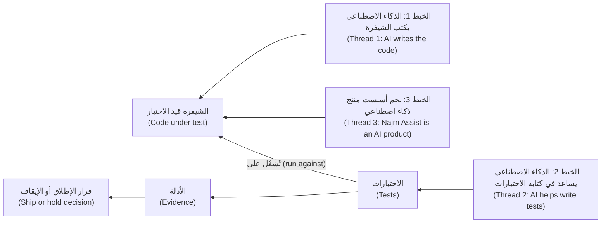
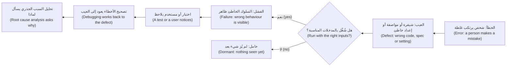
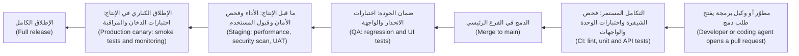

# الوحدة 0 — التوجيه (Orientation)

*قبل أن تكتب اختبارًا واحدًا تحتاج إلى خريطة. تمنحك هذه الوحدة ثلاثة أشياء. أولًا، فكرة دقيقة عن الغاية من الاختبار: اكتشاف العيوب وتزويد من يتخذون القرار بأدلة حقيقية عن الجودة والمخاطر، في عالم يكتب فيه الذكاء الاصطناعي (AI) جزءًا كبيرًا من الشيفرة، ويساعد في كتابة الاختبارات، ويُطلق منتجات لا تتطابق إجاباتها مرتين تمامًا. ثانيًا، فهم كيف تفشل البرمجيات: السلسلة الممتدة من الخطأ البشري إلى العيب (defect) ثم إلى الفشل، ومواضع نشأة العيوب، والكوارث التي علّمت القطاع، وكلفة اكتشاف العيب متأخرًا. ثالثًا، الأشخاص والمختبر الذين ستعمل معهم في بقية الدورة: فريق هندسة الجودة (Quality Engineering) في بنك نجم، والأنظمة التي يختبرونها، ونظام عيّنة صغير فيه عيوب مزروعة عمدًا. ستتابع ندى، الخريجة الجديدة، وهي تتعلّم أن العلامة الخضراء ليست دليلًا، وراشد الذي يعلّمها أن تسأل هل يمكن أن يفشل الاختبار. وستنتهي بمختبر يعمل، وعيب واحد التقطتَه وآخر فاتك، وخطة للدراسة.*

> **التركيز:** Mindset — الغاية من الاختبار، وكيف تفشل البرمجيات، وكيف تستخدم الدورة ونظام العيّنة.

---

# 0.1 — ما هو اختبار البرمجيات، وما ليس هو: الجودة والمخاطر وتحوّل عصر الذكاء الاصطناعي
*المستوى: 🟢 مبتدئ* · *المتطلبات: لا يوجد* · *التركيز: Mindset*

**بعد هذا الدرس تستطيع** كتابة ملف جودة وقائمة مرتّبة بأنماط الفشل لميزة تعرفها، مع ربط كل خطر بملاحظة تكشفه. *مدة الدراسة: قراءة نحو 15 دقيقة، وعمل تطبيقي نحو 60 دقيقة (تقدير).*

## ⚡ الدرس في دقيقة (In 60 seconds)
- **اختبار البرمجيات (Software testing)** هو تقييم البرمجيات لاكتشاف العيوب ولتزويد أصحاب المصلحة بأدلة عن الجودة والمخاطر. إنه ينتج معلومات، لا جودة، ولا يستطيع أبدًا أن يثبت أنه لم يبقَ أي عيب.
- **تصحيح الأخطاء (Debugging)** يجد سبب الفشل ويصلحه. و**ضمان الجودة (quality assurance, QA)** يخص العملية، و**ضبط الجودة (quality control, QC)** يخص المنتج، و**هندسة الجودة (quality engineering)** تبني الجودة داخل الفريق كله. والاختبار نشاط واحد بينها.
- كلمة «يعمل» ليست خاصية واحدة. يسرد المعيار ISO/IEC 25010 (2011) ثماني خصائص للجودة (وفي مراجعة 2023 تسع)؛ فقد يكون التحويل صحيحًا لكنه بطيء أو غير آمن أو غير قابل للاستخدام بالعربية.
- ثلاثة خيوط في عصر الذكاء الاصطناعي تمرّ عبر الدورة: اختبار شيفرة كتبها ذكاء اصطناعي، واستخدام الذكاء الاصطناعي في الاختبار، واختبار منتجات الذكاء الاصطناعي. في كل منها اسأل: *هل يمكن أن يفشل هذا الاختبار؟*
- مؤشّر القرار: قبل أن تكتب اختبارًا أو تقبله، سمِّ الفشل الذي سيلتقطه.
- الفخ الأكبر: قراءة اللون الأخضر على أنه دليل. فهو يعني «هذه الفحوص لم تجد شيئًا».

## 🧭 لماذا يهم
في أسبوعها الثاني في بنك نجم، تراجع ندى طلب دمج (pull request) من أحد فِرق طارق. أضاف وكيل برمجة رسم التحويل الدولي ومعه عشرة اختبارات جديدة. خط التكامل والتسليم المستمرين (pipeline) أخضر، وتقول التغطية (coverage) إن كل سطر جديد قد نُفِّذ. وتوافق ندى عليه في ست دقائق.

بعد أيام قليلة يسأل راشد، رئيس هندسة الجودة: «ماذا أخبرتكِ العلامة الخضراء؟» تقول ندى إن الاختبارات تنجح. «وهل كانت ستفشل لو كان الرسم خاطئًا؟» لا تعرف. فيشغّلان اختباراتها العشرة على نظام العيّنة الخاص بالدورة مع تفعيل عيب في الرسم. تنجح العشرة. ثم يجرّبان عيوب التحويل الأربعة الأخرى. تنجح العشرة في كل مرة. يقول راشد: «الاختبار الذي لا يمكن أن يفشل ليس دليلًا. إنه زينة.»

لا يشتري البنك اختبارات، بل يشتري قرارات: نُطلق أم نتريّث، نُصلح الآن أم نقبل المخاطرة. والاختبارات هي الأدلة وراء هذه القرارات، والدليل قد يكون ضعيفًا. وتزداد هذه المسألة أهمية الآن لأن الشيفرة تصل أسرع من بُناة، بشريين وآليين، يتّسمون بالطلاقة ويخطئون أحيانًا بثقة. يمنحك هذا الدرس المفردات، وعادة التشكيك في العلامة الخضراء.

## 📐 كيف يعمل

### 🟢 الأساسيات

**ما هو الاختبار.** يقيّم الاختبار البرمجيات بتشغيلها (**الاختبار الديناميكي (dynamic testing)**) أو بفحصها، كما في المراجعات والتحليل الساكن (static analysis) (**الاختبار الساكن (static testing)**). وله مهمتان: **اكتشاف العيوب** قبل أن يصادفها العملاء، و**تقديم الأدلة** عن الجودة والمخاطر إلى **أصحاب المصلحة** الذين عليهم أن يقرروا: مالكو المنتج، والمهندسون، والعمليات، والمخاطر والامتثال.

لكل اختبار موقف ابتدائي (المدخلات والحالة الأولى)، وفعل، و**مرجع النتيجة المتوقعة (test oracle)**: أي شيء يخبرك أن النتيجة صحيحة، مثل متطلب أو مثال محسوب يدويًا أو النسخة السابقة أو حكم خبير. فبلا مرجع تكون لديك عملية تشغيل لا اختبار. في `fee("3090", "QAR", "international")` القاعدة هي 0.35% من المبلغ، مقرَّبةً إلى الأعلى عند المنتصف (rounded half up). يدويًا، 3,090 × 0.0035 = 10.815، وتُقرَّب إلى 10.82. هذا الرقم المحسوب يدويًا هو المرجع.

**الاختبار وما يجاوره.** المسمّيات الوظيفية تطمس الفروق بين هذه الكلمات، فانظر إلى ما يفعله الناس.

| المصطلح | السؤال الذي يجيب عنه | في بنك نجم |
|---|---|---|
| **الاختبار** | أين يختلف هذا البرنامج عمّا نحتاج إليه؟ | تبلّغ ندى عن فرق في الرسم قدره سنت واحد |
| **تصحيح الأخطاء (Debugging)** | أين السبب، وكيف نزيله؟ | يتتبّعه مطوّر إلى سطر واحد |
| **ضبط الجودة (Quality control, QC)** | هل يستوفي هذا المنتج المعيار المطلوب؟ | فحوص قبل بيئة ما قبل الإنتاج (staging) |
| **ضمان الجودة (Quality assurance, QA)** | هل تمنع طرق عملنا العيوب؟ | قواعد المراجعة، وتعريف الإنجاز (definition of done) |
| **هندسة الجودة (Quality engineering)** | كيف نبني الجودة في كل خطوة؟ | فريق راشد: الأتمتة وخطوط التكامل والتسليم المستمرين |

يبيّن الاختبار أن هناك خطأً، ويجد تصحيح الأخطاء السبب. وبعد الإصلاح يعيد **اختبار التأكيد (confirmation testing)** تشغيل الاختبار الفاشل، ويتحقق **اختبار الانحدار (regression testing)** من أن شيئًا آخر لم ينكسر.

**التحقق والمصادقة على الملاءمة.** يسأل **التحقق (verification)**: «هل نبني المنتج بشكل صحيح؟»، أي هل يطابق البرنامج مواصفاته؟ ويسأل **المصادقة على الملاءمة (validation)**: «هل نبني المنتج الصحيح؟»، أي هل يلبّي الاحتياجات الحقيقية؟ قد تنجح صفحة في أحدهما وتفشل في الآخر: تنصّ المواصفات على عرض رمز القاعدة عند رفض التحويل، والصفحة تفعل ذلك، ومع هذا لا يتعلّم العميل شيئًا حين يقرأ `above_per_transfer_max`.

**ما لا يستطيع الاختبار فعله.** يبيّن الاختبار أن العيوب موجودة، لا أنها غير موجودة أبدًا — وهي ملاحظة إدسخر دايكسترا (Edsger Dijkstra) وأول مبادئ الاختبار السبعة في ISTQB. والسبب حسابي: في عملة واحدة ونوع واحد من التحويلات، يمكن أن تُمرَّر إلى `check_transfer` نحو 2.5 مليون مبلغ صالح وخمسة ملايين قيمة محتملة لـ«ما أُرسل اليوم»: أي نحو 12.5 تريليون توليفة، قبل احتساب العملات والأنواع الأخرى. **الاختبار الاستنفادي مستحيل**، ولذلك فالاختبار هو أخذ عيّنات بعناية (توضّح الوحدة 1 كيف يتم ذلك). والتقرير الأمين يقول «نظرنا هنا ووجدنا هذا»، لا «إنه صحيح».

**الفحص مقابل الاختبار.** يفصل مايكل بولتون (Michael Bolton) وجيمس باخ، من مجتمع الاختبار المرتبط بالسياق، بين **الفحص** و**الاختبار**. الفحص يطبّق قاعدة قرار على ملاحظة، مثل `assert fee(...) == Decimal("10.82")`: تستطيع الآلة تشغيله، لكنه لا يؤكد إلا ما توقّعه شخص ما. أما الاختبار، بمعناهما، فهو العمل البشري في التعلّم عن المنتج باستكشافه، بما في ذلك ملاحظة ما لم يكتب له أحد تأكيدًا (assertion). هذه مفردات مدرسة واحدة — فمنهج ISTQB لا يضع هذا الفاصل — لكنها مفيدة: فالمجموعة الآلية (automated suite) لا تسجّل إلا ما كنت تعرف أن تسأل عنه.

### 🟡 التعمق أكثر (Going deeper)

**ماذا يعني «يعمل».** يصف المعيار ISO/IEC 25010 ثماني خصائص للجودة: **الملاءمة الوظيفية (functional suitability)** و**كفاءة الأداء (performance efficiency)** و**التوافقية (compatibility)** و**قابلية الاستخدام (usability)** و**الموثوقية (reliability)** و**الأمان (security)** و**قابلية الصيانة (maintainability)** و**قابلية النقل (portability)**. وفي مراجعة 2023 تسع خصائص: تعيد تسمية بعضها وتوسّع بعضها الآخر وتضيف السلامة؛ أما هذه الدورة فتستخدم أسماء 2011 المألوفة. والنموذج لا يقول ما الذي تختبره؛ لكنه يمنعك من نسيان عائلات كاملة من الفشل. عشر طرق يمكن أن يفشل بها تحويل:

| # | ما الذي يحدث خطأً | الخاصية | يُكتشف بواسطة |
|---|---|---|---|
| 1 | يُحتسب على تحويل دولي بمبلغ 3,090 QAR رسمٌ قدره 10.81 لا 10.82 | الملاءمة الوظيفية: الصحة | اختبارات الوحدة (Unit tests)، الدرس 2.1 |
| 2 | يُمنع عميل أرسل اليوم 49,000 QAR من إرسال 1,000 QAR، مع أن المبلغ يبلغ الحد بالضبط | الملاءمة الوظيفية: الحالات الحدّية (boundary) | تحليل القيم الحدّية (Boundary analysis)، الدرس 1.2 |
| 3 | يحصل تحويل في الساعة 16:30 بتوقيت قطر على تاريخ قيمة اليوم: فقد قُرئ وقت الإغلاق بالتوقيت العالمي المنسّق (UTC) | الملاءمة الوظيفية: المناطق الزمنية | اختبارات تراعي الزمن، الدرس 1.2 |
| 4 | يعيد التطبيق المحاولة (retries) عند اتصال غير مستقر فيدفع العميل مرتين | الموثوقية: تحمّل الأعطال (fault tolerance) | اختبارات خاصية عدم التكرار، الدرس 3.1 |
| 5 | يقرأ بوب تحويل أليس بتخمين معرّفه (BOLA) | الأمان: السرّية (confidentiality) | اختبارات التفويض، الدرس 4.2 |
| 6 | في يوم الراتب يتباطأ إرسال الطلبات من أقل من ثانية إلى اثنتي عشرة ثانية | كفاءة الأداء | اختبارات الحِمل، الدرس 4.1 |
| 7 | يضغط مستخدم قارئ الشاشة على «إرسال» ولا يسمع شيئًا | قابلية الاستخدام: إمكانية الوصول (accessibility) | مرور بقارئ الشاشة، الدرس 3.3 |
| 8 | تعرض الصفحة العربية رمز قاعدة بالإنجليزية لا جملة يمكن التصرف بناءً عليها | قابلية الاستخدام: الرسائل الموطَّنة | فحوص التوطين، الدرس 3.3 |
| 9 | يُرجع إصدار جديد من واجهة البرمجة الحقل `fee` رقمًا، بينما يتوقع إصدار التطبيق 5.1 نصًّا | التوافقية | اختبارات العقد (Contract tests)، الدرس 2.2 |
| 10 | تغيير الرسم يعني تعديل سبعة ملفات؛ ولا تبدأ الخدمة بعد ترقية Python | قابلية الصيانة؛ قابلية النقل | المراجعة، ومصفوفة التكامل المستمر، الدرس 5.2 |

تعني BOLA *كسر التفويض على مستوى الكائن* (broken object-level authorisation): أي وصول مستخدم إلى بيانات مستخدم آخر ([*أمن الذكاء الاصطناعي والتطبيقات*، الدرس 3.3 — التفويض (Authorisation): كسر التحكم في الوصول (broken access control) وIDOR وتعدد المستأجرين (multi-tenancy)](../secai/index.ar.html#/3.3)). التصنيف اجتهاد: في الصف 4 يضيع المال أيضًا، لكن ما تختبره هو النجاة من إعادة المحاولات، وهذا سؤال موثوقية. وقيمة النموذج في السؤال الذي يطرحه: *أي الصفوف سيؤذي نجم أكثر، وما الأدلة التي لدينا؟*

**التحوّل في عصر الذكاء الاصطناعي: ثلاثة خيوط.** يغيّر الذكاء الاصطناعي من يكتب الشيفرة، ومن يكتب الاختبارات، وما هو المنتج نفسه. تعمل هذه المقتطفات على نظام العيّنة، الذي يُجهَّز في الدرس 0.3؛ ولا تحتاج إلى تشغيلها الآن.


```mermaid
flowchart RL
    A["الخيط 1: الذكاء الاصطناعي يكتب الشيفرة<br/>(Thread 1: AI writes the code)"] --> C["الشيفرة قيد الاختبار<br/>(Code under test)"]
    N["الخيط 3: نجم أسيست منتج ذكاء اصطناعي<br/>(Thread 3: Najm Assist is an AI product)"] --> C
    B["الخيط 2: الذكاء الاصطناعي يساعد في كتابة الاختبارات<br/>(Thread 2: AI helps write tests)"] --> T["الاختبارات<br/>(Tests)"]
    T -->|"تُشغَّل على (run against)"| C
    T --> E["الأدلة<br/>(Evidence)"]
    E --> D["قرار الإطلاق أو الإيقاف<br/>(Ship or hold decision)"]
```

*الخيط الأول: اختبار شيفرة كتبها ذكاء اصطناعي.* استخدمت دالة الرسم التي كتبها الوكيل أعدادًا عشرية ثنائية (binary floats)، والاختبار المكتوب انطلاقًا من الشيفرة ينسخ حسابها:

```python
from decimal import Decimal
from najm.transfers import fee

def test_mirror():
    # Weak: the expected value is computed the way the code computes it.
    expected = Decimal(str(round(3090 * 0.0035, 2)))
    assert fee(3090, "QAR", "international") == expected

def test_oracle():
    # Strong: the expected value was worked out by hand from the fee rule.
    assert fee("3090", "QAR", "international") == Decimal("10.82")
```

عند تفعيل `NAJM_BUGS=float_fee` — وهو العيب الموجود في شيفرة الوكيل — ينجح `test_mirror` ويفشل `test_oracle`: `assert Decimal('10.81') == Decimal('10.82')`. وعند إيقاف العيب تنعكس الأحكام. الاختبار المشتق من التنفيذ يدافع عن العيب، لذا يجب أن يأتي مرجع النتيجة المتوقعة من مكان آخر ([*تصميم الأنظمة لمبرمجي الفايب*، الدرس 8.2 — الاختبارات بوصفها المواصفة التي لا يستطيع الوكيل تجاهلها](../vibe/index.ar.html#l8-2)).

*الخيط الثاني: استخدام الذكاء الاصطناعي في الاختبار.* الاختبارات العشرة في طلب الدمج الخاص بندى جاءت من مساعد ذكاء اصطناعي أيضًا. وهي تبدو هكذا:

```python
import pytest
from decimal import Decimal
from najm.transfers import fee

@pytest.mark.parametrize("kind", ["own", "domestic", "international"])
@pytest.mark.parametrize("amount", ["50", "1500", "30000"])
def test_fee_returns_a_decimal(kind, amount):
    result = fee(amount, "QAR", kind)
    assert result is not None
    assert isinstance(result, Decimal)
    assert result >= 0

def test_unknown_kind_raises():
    with pytest.raises(ValueError):
        fee("10", "QAR", "teleport")
```

يشغّل سطرا `parametrize` الاختبار الأول مرة لكل زوج من القيم: 3 أنواع × 3 مبالغ = 9 اختبارات، ومعها الاختبار الأخير: عشرة. تنجح العشرة كلها، وتنفّذ كل سطر في `fee()` يُنفَّذ في بناء عادي. ومع تفعيل كل عيب من عيوب التحويل تظل تنجح: فهي تفحص *نوع* الإجابة و*إشارتها*، ولا تفحص قيمتها أبدًا. العلاج هو قياس المساعدين: ازرع عيوبًا معروفة وعدّ ما تلتقطه اختباراتهم (الدرس 6.3).

*الخيط الثالث: اختبار منتجات الذكاء الاصطناعي.* تتغيّر صياغة نجم أسيست بين تشغيل وآخر؛ وتحاكي `FakeModel` في العيّنة ذلك بمعامل `temperature`. ويجب أن يثبّت الاختبار الحقائق لا الجملة:

```python
import pytest
from najm.assist import FakeModel, answer

def test_vacuous():
    # Weak: any non-empty text passes, including an invented answer.
    assert answer("Can I pay in bitcoin?")["text"]

@pytest.mark.parametrize("seed", range(20))
def test_grounded(seed):
    # Strong: wording may vary; the fact and its source may not.
    result = answer("What is the daily transfer limit?", FakeModel(temperature=0.8, seed=seed))
    assert "50,000 QAR" in result["text"]
    assert result["sources"][0] == "limits"

def test_silence_is_admitted():
    # Strong: when no policy applies, the assistant must say so.
    result = answer("Can I pay in bitcoin?")
    assert result["sources"] == []
    assert "can't find that" in result["text"]
```

مع `NAJM_AI_BUGS=hallucinate` يخترع المساعد رسمًا لسؤال البيتكوين: يظل `test_vacuous` ناجحًا، ويفشل `test_silence_is_admitted`. والمقارنة بنص حرفي ليست أفضل: فهي تفشل عند اختلاف غير ضار، فيتجاهلها الناس. وتحوّل الوحدة 7 هذا إلى منهج ([*حوكمة الذكاء الاصطناعي*، الدرس 9.3 — الاختبار والتقييم والمصادقة والفريق الأحمر](../aigp/index.ar.html#/9.3) يقدّم منظور الحوكمة).

**ثلاث خرافات.**

| الخرافة | أقرب إلى الحقيقة |
|---|---|
| «سيحلّ الذكاء الاصطناعي محل المختبِرين.» | يغيّر الذكاء الاصطناعي طريقة كتابة الاختبارات وتشغيلها، لكن لا بد أن يقرر أحدٌ معنى «صحيح» ويحكم على الأدلة، كما أظهر كل مقتطف. ولا أحد يستطيع أن يَعِد بكيفية تغيّر الأدوار. |
| «الاختبارات تبطّئنا.» | المجموعة البطيئة أو غير المستقرة هي التي تفعل ذلك؛ والعلاج اختبارات أدق. أما غياب الاختبارات فينقل الكلفة إلى الإنتاج. |
| «تغطية 100% تعني لا عيوب.» | تقيس التغطية الأسطر المنفَّذة لا الأشياء المفحوصة. الاختبارات العشرة المولَّدة نفّذت كل سطر عادي من `fee()` ولم تلتقط أيًّا من العيوب الخمسة. |

### 🔴 نظرة الخبير (Expert view)

**الجودة علائقية.** عرّف جيرالد واينبرغ (Gerald Weinberg) الجودة بأنها «قيمة لشخص ما»؛ ويضيف باخ (Bach) وبولتون (Bolton) «ممّن يُعتدّ بهم». العملاء والموظفون والمدقّقون والجهات التنظيمية يزنون الخصائص بصورة مختلفة، ولذلك يبدأ ملف الجودة بسؤال *لمن* الجودة.

**مراجع النتائج قواعد استدلالية، وللدليل قوة.** المواصفات تتقادم؛ وقد يكون السلوك القديم عيبًا. أما **مشكلة مرجع النتيجة (oracle problem)**، أي معرفة الجواب الصحيح دون إعادة العمل، فهي خفيفة في `fee()` وشديدة في نجم أسيست، حيث تصحّ صياغات كثيرة ويخطئ بعضها خطأً دقيقًا. ولا يدعم الاختبار الناجح الثقةَ إلا إذا كان سيفشل لو وُجد العيب. اسأل عن أي تشغيل أخضر: *لو كان العيب الذي أخشاه موجودًا هنا، فهل سيكون هذا التشغيل أحمر؟* يؤتمت اختبار الطفرات (mutation testing) هذا السؤال (الدرسان 2.3 و6.2)؛ وتتيح العيوب المزروعة أن تطرحه يدويًا ([*تصميم الأنظمة لمبرمجي الفايب*، الدرس 9.4 — التحقق قبل الإكمال](../vibe/index.ar.html#l9-4)).

**الاختبار اقتصادي.** قيمة الاختبار هي الخسارة التي يمنعها موزونةً بالاحتمال، فيتبع العمق المخاطر (الدرس 5.1). **متى لا تفعل كل هذا:** نصٌّ برمجي لمرة واحدة تشغّله مرة، على بيانات تستطيع فحصها بالعين، يحتاج إلى نظرة، لا إلى مجموعة اختبارات.

## 🧰 الأدوات
| الأداة أو الممارسة أو التقنية | ما هي وماذا تفعل | متى تلجأ إليها |
|---|---|---|
| **Test oracle** — مرجع النتيجة المتوقعة | مصدر الحقيقة الذي تُقارن به النتيجة: مواصفة، أو مثال محسوب يدويًا، أو نسخة سابقة، أو لائحة تنظيمية | في كل اختبار تكتبه أو تراجعه: من أين تأتي القيمة المتوقعة؟ |
| **ISO/IEC 25010 quality model** — نموذج الجودة ISO/IEC 25010 | قائمة قياسية من ثماني خصائص لجودة المنتج | لتحويل «إنه يعمل» إلى قائمة تحقق من أوجه الفشل |
| **Exploratory testing** — الاختبار الاستكشافي | التعلّم وتصميم الاختبار وتنفيذه في وقت واحد، بتوجيه من ميثاق الجلسة | لاكتشاف ما لا يغطيه أي فحص |
| **Seeded bugs** — العيوب المزروعة | عيوب تُفعَّل عمدًا، مثل `NAJM_BUGS` في العيّنة | لقياس ما إذا كانت المجموعة تستطيع أن تفشل |
| **Risk-based testing** — الاختبار القائم على المخاطر | اختيار ما يُختبر ومدى عمقه بحسب الاحتمال والأثر | لتقرير أين يُصرف الوقت |
| **pytest** | إطار اختبار Python شائع الاستخدام: `assert` عادي، وتجهيزات الاختبار (fixtures)، وتحديد المعاملات (parametrisation) | اختبارات Python في هذه الدورة |

## 🏛️ عمليًا في بنك نجم
تبدأ كل ميزة في نجم بـ**ملف جودة**: صفحة واحدة تقول ما معنى «يعمل» بكلمات يستطيع شخصان التحقق منها بالطريقة نفسها. يملؤه راشد ومالك المنتج قبل تصميم الاختبارات. هذه مسودة التحويلات، بأهداف توضيحية.

| الخاصية | ما معنى «جيد» للتحويلات | الأولوية | أول دليل |
|---|---|---|---|
| الملاءمة الوظيفية | يطابق الرسم والحد ووقت الإغلاق وتاريخ القيمة القواعد المنشورة لكل عملة ومبلغ | عالية | أمثلة محسوبة يدويًا عند الحدود |
| كفاءة الأداء | 95% من الطلبات تنتهي خلال ثانية واحدة عند ذروة يوم الراتب | عالية | اختبار الحِمل (Load test) على بيئة ما قبل الإنتاج |
| التوافقية | يعمل كل إصدار مدعوم من التطبيق بعد كل إصدار من واجهة البرمجة | متوسطة | اختبارات العقد |
| قابلية الاستخدام | يمكن إرسال تحويل بأي من اللغتين، وبقارئ شاشة (screen reader)؛ وكل رفض يقول ما العمل | عالية | جلسات استكشافية مع أمل |
| الموثوقية | لا يُنشئ طلب أُعيدت محاولته تحويلًا ثانيًا أبدًا؛ ولا يُضيّع الانهيار مالًا أبدًا | عالية | اختبارات خاصية عدم التكرار |
| الأمان | لا يقرأ أحد مال عميل آخر ولا ينقله | عالية | مصفوفة التفويض (Authorisation matrix) مع نورة |
| قابلية الصيانة، وقابلية النقل | يمسّ تغيير الرسم مكانًا واحدًا واختبارًا واحدًا؛ وتعمل الخدمة على بيئات التشغيل المدعومة | منخفضة | المراجعة، ومصفوفة التكامل المستمر |

**لملء واحد منها في ثلاثين دقيقة:** اكتب جملة واحدة قابلة للملاحظة لكل خاصية، وأعد صياغتها إن أمكن أن يختلف شخصان على تحقّقها؛ رتّب كل خاصية بحسب الأولوية؛ سمِّ أول دليل لكل صف عالي الأولوية؛ واكتب شيئًا واحدًا خارج النطاق.

## 🛠️ التمارين (Exercises)
- 🟢 **عرّف الجودة لميزة.** اختر ميزة تعرفها، مثل صفحة تسجيل الدخول أو حجز التذاكر، واملأ ملف الجودة. *يكتمل عندما:* يكون لكل صف جملة واحدة يستطيع شخصان التحقق منها بالطريقة نفسها، وتكون ثلاثة صفوف ذات أولوية عالية مع سبب، ويكون شيء واحد مكتوبًا على أنه خارج النطاق.
- 🟡 **اذكر أنماط الفشل.** للميزة نفسها، اكتب اثنتي عشرة طريقة على الأقل يمكن أن تفشل بها، تغطي ست خصائص على الأقل. قدّر الاحتمال والأثر من 1 إلى 5. *يكتمل عندما:* يقول كل صف كيف سنلاحظ الفشل — ملاحظةً قابلة للرصد، لا مجرد «اختبره» — وتُرتَّب الثلاثة الأعلى بحسب الاحتمال × الأثر مع سطر من التعليل لكل منها.
- 🔴 **جلسة استكشافية مدتها 20 دقيقة.** اختر موقعًا عامًّا أو تطبيقًا يحق لك استخدامه زائرًا عاديًّا، واكتب ميثاق الجلسة: «استكشف *هذه الميزة* بـ*هذا المُدخل* لاكتشاف *هذا النوع من المشكلات*.» اضبط مؤقتًا على 20 دقيقة. استخدمه كما يفعل أي زائر: دون ماسحات (scanners) أو نصوص برمجية أو أحمال (load)، ودون بيانات شخصية حقيقية، وتوقّف عند أي خطوة تسجيل دخول أو دفع. اكتب ثلاث نتائج. *يكتمل عندما:* تذكر كل نتيجة أين ومتى (الجهاز والمتصفح والوقت)، وما يصل إلى ست خطوات للتكرار، والمتوقع مقابل الفعلي، والخاصية المعنية ومن يتأثر، بحيث يستطيع زميل تكرارها؛ إضافةً إلى ملاحظة واحدة عن شيء غريب رأيتَه مقبولًا.

## ⚠️ أخطاء وفخاخ (Mistakes and traps)
- **اعتبار اللون الأخضر دليلًا.** اسأل عمّا كانت الفحوص قادرة على إيجاده، وأثبت ذلك بتفعيل عيب.
- **ترك الشيفرة تقدّم مرجعها بنفسها.** القيم المتوقعة المحسوبة بصيغة التنفيذ تدافع عن عيوبه. احسبها يدويًا.
- **اختبار الوظيفة وحدها.** تحويل صحيح لكنه بطيء أو غير مراعٍ لإمكانية الوصول أو غير آمن ما زال يخذل العملاء. استخدم الخصائص الثماني قائمةَ تحقق.
- **تصديق التغطية.** الأسطر المنفَّذة ليست سلوكًا جرى التحقق منه. استخدم التغطية لتجد ما لم يُختبر، لا لتدّعي ما اختُبر.
- **الاختبار في النهاية.** العيوب التي تُكتشف حين تصبح الشيفرة «منتهية» تصل متأخرة وباهظة (الدرس 0.2).

## 🧾 الخلاصة (Recap)
- الاختبار يقيّم البرمجيات لاكتشاف العيوب وتزويد أصحاب المصلحة بأدلة عن الجودة والمخاطر؛ ولا يستطيع أن يثبت أنه لم يبقَ أي عيب.
- تصحيح الأخطاء يُصلح، وضمان الجودة (QA) عملية، وضبط الجودة (QC) منتج، وهندسة الجودة تبني الجودة داخل العمل.
- «يعمل» يشمل ثماني خصائص في ISO/IEC 25010؛ فاسأل أيها يهم هنا، ولمن.
- يحتاج الاختبار إلى مرجع نتيجة مستقل؛ أما الاختبارات المنسوخة من الشيفرة أو التي لا تفحص شيئًا فتنجح بينما الشيفرة خاطئة.
- تختزل الخيوط الثلاثة لعصر الذكاء الاصطناعي في سؤال واحد: هل يمكن أن يفشل هذا الاختبار؟

## ✍️ اختبر نفسك (Check yourself)

**1. يولّد مساعد عشرة اختبارات لـ`fee()`. تنجح كلها، وتُظهر التغطية (coverage) أن كل سطر نُفِّذ. ماذا يترتب على ذلك؟**

- A. منطق الرسم جرى التحقق منه، لأن كل سطر فيه نُفِّذ
- B. المجموعة جيدة بما يكفي للدمج، لأن التغطية عالية
- C. لا يُتعلَّم الكثير حتى تصبح المجموعة حمراء مع تفعيل عيب في الرسم
- D. ينبغي التخلص من الاختبارات، لأن ذكاءً اصطناعيًا كتبها

<details><summary>الإجابة</summary>

**C.** تُظهر التغطية (Coverage) أي الأسطر نُفِّذت، لا ما إذا كان التأكيد سيلاحظ قيمة خاطئة. فعِّل عيبًا وانظر هل تصبح المجموعة حمراء. الخياران A وB يعاملان التغطية كأنها دليل؛ والخيار D يحكم بحسب المصدر. (🟡 التعمق أكثر، الخيط الثاني.)

</details>

**2. يفشل اختبار لأن رسم تحويل ما خاطئ. يقرأ مطوّر الشيفرة، ويجد السطر المعيب، ويغيّره. ما هذا النشاط؟**

- A. المصادقة على الملاءمة
- B. اختبار الانحدار
- C. الاختبار الساكن
- D. تصحيح الأخطاء

<details><summary>الإجابة</summary>

**D.** يحدد تصحيح الأخطاء (Debugging) سبب الفشل ويزيله؛ أما الاختبار فقد كشف الفشل فقط. وإعادة تشغيل الاختبارات بعد ذلك هي اختبار التأكيد (confirmation testing) أو اختبار الانحدار (regression testing). (🟢 الأساسيات.)

</details>

**3. لا يعلن قارئ الشاشة (screen reader) شيئًا بعد أن يضغط عميل على «إرسال التحويل». الرسم والرصيد صحيحان. أي خاصية من خصائص ISO/IEC 25010 تتأثر أساسًا؟**

- A. قابلية الاستخدام، عبر إمكانية الوصول
- B. الملاءمة الوظيفية، عبر الصحة الوظيفية
- C. الموثوقية، عبر تحمّل الأعطال
- D. الأمان، عبر السرّية

<details><summary>الإجابة</summary>

**A.** السؤال هو هل يستطيع من يستخدمون قارئ الشاشة استخدام الميزة. الخيار B مغرٍ لأن المال انتقل بصورة صحيحة، لكن الإصلاح يُحكم عليه بإمكانية الوصول (accessibility). (🟡 التعمق أكثر.)

</details>

**4. يشغّل فريق 5,000 اختبار آلي وتنجح كلها. ماذا يستطيع أن يدّعي بأمانة؟**

- A. لم يبقَ أي عيب، لأن 5,000 اختبار مستقل نجحت
- B. لا مخاطرة في الإصدار، لأن شيئًا لم يفشل في الاختبار
- C. أصبح كل متطلب مُثبَتًا صحته بواسطة المجموعة
- D. لم تظهر أي حالات فشل في الحالات التي شُغِّلت؛ أما الحالات الأخرى فغير مختبَرة

<details><summary>الإجابة</summary>

**D.** يبيّن الاختبار وجود العيوب، لا غيابها. والمجموعة الناجحة دليل عن المواقف التي مارستها، فاسأل عمّا لم تغطّه. (🟢 الأساسيات.)

</details>

**5. يفتتح نجم أسيست إجاباته بطرق مختلفة في تشغيلات مختلفة، مع أن الحقائق متطابقة. أي اختبار هو الأنسب؟**

- A. مقارنة نص الإجابة كاملًا بنص مخزَّن، كلمةً بكلمة
- B. التأكيد أن الحقيقة الأساسية تظهر وأن وثيقة الحدود مذكورة مصدرًا
- C. تشغيله مرة واحدة وحفظ المخرجات لقطةً للمقارنة لاحقًا
- D. التأكيد فقط أن الإجابة ليست فارغة، أيًّا كان ما يقوله النموذج بالفعل

<details><summary>الإجابة</summary>

**B.** فهو يثبّت ما يجب ألا يتغير، أي الحقيقة ومصدرها، ويترك الصياغة تتنوع. الخيار A يفشل عند اختلاف غير ضار، والخيار D ينجح مع الإجابات المخترعة، والخيار C هش مثل A. (🟡 التعمق أكثر، الخيط الثالث.)

</details>

## 📚 المراجع (References)
- ISTQB، منهج المختبِر المعتمد، المستوى التأسيسي، الإصدار 4.0 (2023) — https://www.istqb.org/
- ISO/IEC 25010، نموذج جودة المنتج SQuaRE (معيار مدفوع)
- وثائق pytest (pytest documentation) — https://docs.pytest.org/
- مبادرة الوصول إلى الويب في W3C — https://www.w3.org/WAI/
- OWASP، مشروع أهم 10 مخاطر لواجهات البرمجة — https://owasp.org/
- نظام العيّنة للدورة، تحويلات نجم — https://github.com/Tamoura/system-design-for-vibe-coders/tree/main/testing/sample

---

# 0.2 — كيف تفشل البرمجيات: الأخطاء (errors) والعيوب وحالات الفشل (failures) والكوارث الشهيرة واقتصاديات اكتشاف العيوب مبكرًا
*المستوى: 🟢 مبتدئ* · *المتطلبات: 0.1* · *التركيز: Mindset*

**بعد هذا الدرس تستطيع** تتبّع عيب مزروع في نظام العيّنة من الفشل إلى سببه الجذري بسلسلة «لماذا» الخمس، وتحويله إلى اختبار انحدار يفشل حين يُفعَّل العيب وينجح من دونه. *مدة الدراسة: قراءة نحو 15 دقيقة، وعمل تطبيقي نحو 75 دقيقة (تقدير).*

## ⚡ الدرس في دقيقة (In 60 seconds)
- يرتكب شخص **خطأً بشريًا**؛ فيترك **عيبًا** في الشيفرة أو المواصفة أو الإعداد؛ وحين يُنفَّذ العيب في الظروف المناسبة تُظهر البرمجيات **فشلًا**. ويرجع **تحليل السبب الجذري (root-cause analysis)** إلى الخطأ وإلى سبب عدم إيقاف أي شيء له.
- قد يظل العيب خاملًا. عيب `float_fee` في العيّنة يعطي رسمًا خاطئًا في 407 من 25,000 مبلغ بالريال الكامل حتى الحد الأقصى للتحويل الواحد، أي نحو واحد من كل 61، لذا قد تفوّته أمثلة قليلة منتقاة يدويًا.
- تبدأ العيوب في كل مكان: المتطلبات، والتصميم، والشيفرة، والإعدادات، والبيانات، والبيئة، والتكامل (integration).
- اكتشاف العيب مبكرًا يكلّف عادةً أقل. ومنحنى الكلفة الشهير قاعدة تقريبية: اتجاهه يطابق التجربة، أما مضاعفاته فمتنازع عليها.
- كل عيب أفلت يستحق اختبار انحدار (regression test) وملاحظة عن السبب الجذري.
- الشيفرة التي يكتبها الذكاء الاصطناعي تغيّر مزيج العيوب، لا السلسلة.

## 🧭 لماذا يهم
في أول يوم اثنين من الشهر، تنبّه مهمة المطابقة في الإدارة المالية إلى أمر صغير: فُرض على بعض التحويلات الدولية رسمٌ أقل بسنت واحد من الجدول المنشور. المبلغ تافه، ومع ذلك يضع راشد ثلاث حقائق على السبّورة. البنك يحصّل من العملاء أقل من اللازم منذ خمسة أسابيع. والاختبارات كانت خضراء كل يوم. والسبب سطر واحد اجتاز المراجعة.

لحالات الفشل العلنية الشكل نفسه على نطاق أكبر. ففي عام 2012 نشرت شركة Knight Capital شيفرة جديدة، ولم يصل التحديث إلى خادم واحد، فأرسل منطق قديم أوامر غير مقصودة لنحو 45 دقيقة؛ ويقدّر أمر هيئة الأوراق المالية والبورصات الأمريكية الخسارة بنحو 460 مليون دولار أمريكي. ولا يُقاس العيب بحجم الرقم الخاطئ، بل بمدة تشغيله، وبمقدار ما يعتمد عليه، وبمدى صعوبة التراجع عنه.

## 📐 كيف يعمل

### 🟢 الأساسيات

**الخطأ والعيب والفشل.** **الخطأ البشري**، أو الغلطة، فعل بشري ينتج شيئًا خاطئًا، مثل قاعدة أُسيء فهمها. أما **العيب** فهو الخلل الذي يتركه في أحد النواتج (artefact): سطر شيفرة أو متطلب أو إعداد. و**الفشل** هو السلوك الخاطئ الذي يمكنك ملاحظته حين يُنفَّذ العيب. ليس كل عيب يسبب فشلًا؛ فالخلل الذي يحتاج إلى مُدخل غير معتاد يبقى صامتًا.


```mermaid
flowchart RL
    E["الخطأ: شخص يرتكب غلطة<br/>(Error: a person makes a mistake)"] --> D["العيب: شيفرة أو مواصفة أو إعداد خاطئ<br/>(Defect: wrong code, spec or setting)"]
    D --> X{"هل شُغِّل بالمدخلات المناسبة؟<br/>(Run with the right inputs?)"}
    X -->|"نعم (yes)"| F["الفشل: السلوك الخاطئ ظاهر<br/>(Failure: wrong behaviour is visible)"]
    X -->|"لا (no)"| Q["خامل: لم يُرَ شيء بعد<br/>(Dormant: nothing seen yet)"]
    F --> T["اختبار أو مستخدم يلاحظ<br/>(A test or a user notices)"]
    T --> B["تصحيح الأخطاء يعود إلى العيب<br/>(Debugging works back to the defect)"]
    B --> R["تحليل السبب الجذري يسأل لماذا<br/>(Root cause analysis asks why)"]
```

**مثال محلول خطوة بخطوة.** مع تفعيل عيب `float_fee` في العيّنة، يعطي `fee("3090", "QAR", "international")` القيمة 10.81، لكن القاعدة، أي 0.35% مقرَّبةً إلى الأعلى عند المنتصف، تعطي 10.82.

1. **الخطأ.** من كتب الشيفرة، شخصًا كان أو وكيلًا، عامل 0.35% على أنه العدد العشري `0.0035` وافترض أن `round` تعني «التقريب إلى السنتات». وهذان خطآن: المال في أعداد عشرية ثنائية، والدالة المضمَّنة `round` التي ترسل التعادلات التامة إلى الجار الزوجي (`round(0.125, 2)` تساوي `0.12`)، لا التقريب إلى الأعلى عند المنتصف.
2. **العيب.** سطر واحد من `fee()`: يضرب `float(amount)` في العدد العشري `0.0035`، ويقيّد النتيجة، ويطبّق الدالة المضمَّنة `round` على منزلتين.
3. **لماذا يظهر هنا.** 3,090 × 0.0035 تساوي بالضبط 10.815، أي نصف سنت، وهذا ما لا تستطيع الأعداد العشرية الثنائية تخزينه:

```python
from decimal import Decimal

x = 3090 * 0.0035
print(x)                                      # 10.815 (what Python shows)
print(f"{Decimal(x):.20f}")                   # 10.81499999999999950262 (what is stored)
print(Decimal("3090") * Decimal("0.0035"))    # 10.8150 (exact, so half up gives 10.82)
```

4. **كم مرة.** احفظ الملف باسم `fee_survey.py` في مجلد العيّنة وشغّله:

```python
import os

from najm.transfers import fee

amounts = [str(a) for a in range(1, 25_001)]   # whole riyals, 1 to 25,000 (the maximum)

os.environ["NAJM_BUGS"] = ""                   # no bug: the correct fee
correct = {a: fee(a, "QAR", "international") for a in amounts}
os.environ["NAJM_BUGS"] = "float_fee"          # bug on: the same calls again
buggy = {a: fee(a, "QAR", "international") for a in amounts}

wrong = [a for a in amounts if correct[a] != buggy[a]]
print(f"{len(wrong)} of {len(amounts)} amounts get a wrong fee")
print(f"first: {wrong[0]} QAR, correct {correct[wrong[0]]}, buggy {buggy[wrong[0]]}")
```

```text
407 of 25000 amounts get a wrong fee
first: 2870 QAR, correct 10.05, buggy 10.04
```

5. **لماذا فاتت الاختباراتِ.** تختبر المجموعة الابتدائية الحد الأدنى للرسم (100) والسقف (100,000)، ولا تختبر أبدًا النطاق الذي تنطبق فيه النسبة المئوية ويمكن أن يظهر فيه نصف السنت.

الدرس: مدى وصول العيب يعتمد على المُدخلات، لا على مدى سوء مظهر السطر. يستطيع فحص الخصائص (الدرس 2.3) أن يجده إذا بلغ مولّده مبالغ الريال الكاملة في نطاق النسبة المئوية؛ أما حفنة من الأمثلة فقد لا تبلغه أبدًا.

**من أين تنشأ العيوب.** بعضها فقط يبدأ على هيئة زلّات كتابة في الشيفرة.

| المصدر | مثال من نجم |
|---|---|
| المتطلبات | يقول جدول الرسوم «0.35%» لكنه لا يقول كيف يُقرَّب |
| التصميم | مفاتيح خاصية عدم التكرار (idempotency keys) محفوظة في ذاكرة خادم واحد وتُنسى عند إعادة التشغيل |
| الشيفرة | يُفحص الحد اليومي بـ`>=` بدل `>` |
| الإعدادات | وقت الإغلاق 15:00 مضبوط على منطقة زمنية خاطئة |
| البيانات | جدول العملات تنقصه المنازل العشرية الثلاث للدينار الكويتي KWD |
| البيئة | تعمل بيئة ما قبل الإنتاج بالتوقيت العالمي المنسّق UTC، والإنتاج بتوقيت قطر |
| التكامل | يتوقع التطبيق 5.1 الحقل `fee` نصًّا؛ وترسله واجهة البرمجة رقمًا |

**مستويات الاختبار (Test levels).** يسمّي ISTQB خمسة مستويات بحسب النطاق: **المكوّن (component)** (دالة واحدة، مثل `fee()`)، و**تكامل المكوّنات (component integration)** (أجزاء معًا، مثل `TransferService` ومخزنه)، و**النظام** (المنتج كاملًا، في بيئة ما قبل الإنتاج)، و**تكامل الأنظمة (system integration)** (المنتج مع أنظمة أخرى، مثل الأنظمة المصرفية الأساسية)، و**القبول** (يحكم المستخدمون أو الجهة المالكة للعمل على الملاءمة).

### 🟡 التعمق أكثر

**اقتصاديات اكتشاف العيوب مبكرًا.** الادعاء: كلما اكتُشف العيب متأخرًا زادت كلفته. وتحليلات باري بوم (Barry Boehm) للمشاريع الكبيرة (*Software Engineering Economics*، 1981) هي المصدر المعتاد، وتعرض شرائح العروض مضاعفات مرتبة. كن متشككًا فيها: فهي تأتي من مشاريع وحقب بعينها، وقد رأى كنت بِك (Kent Beck) في كتاب *Extreme Programming Explained* (1999) أن الاختبارات والخطوات الصغيرة وإعادة الهيكلة (refactoring) تستطيع تسطيح المنحنى. الأدلة متباينة، لكن الاتجاه يطابق التجربة. فعيب الرسم يكلّف ثوانيَ إذا التقطه اختبار وحدة، وتعليقًا في المراجعة، وبناءً أحمر في التكامل المستمر (CI)، ودورة إبلاغ–إعادة إنتاج–إصلاح–إعادة اختبار في ضمان الجودة، وفي الإنتاج تحقيقًا واستردادات وإصلاحًا عاجلًا وأدلة تدقيق. كل خطوة تضيف أشخاصًا، وتفقد السياق، وتجعل التراجع عن الضرر أصعب. والمقايضة: الأبكر ليس مجانيًا. الاختبارات المفصّلة على متطلبات ستتغير هدر؛ و«الإزاحة نحو اليسار» تعني تقديم *التغذية الراجعة* مبكرًا، لا اختبار كل شيء أولًا.

**حالات فشل شهيرة.** الروايات مبسّطة؛ والأسباب الحقيقية متعددة.

| الحادثة | العيب | لماذا أفلت | المستوى الذي كان سيلتقطه |
|---|---|---|---|
| **أريان 5، الرحلة 501** (1996) | تحويل عدد عشري 64 بت إلى عدد صحيح 16 بت فاض في برمجيات التوجيه المعاد استخدامها من أريان 4 | وُثق بإعادة الاستخدام؛ ولم تُشغَّل ببيانات رحلة أريان 5 في المحاكاة (لجنة التحقيق) | تكامل الأنظمة، بمسار رحلة حقيقي |
| **مركبة مارس كلايمت أوربيتر** (1999) | أعطت برمجيات الأرض بيانات الدافعات بوحدة رطل-قوة ثانية؛ وتوقعت الملاحة نيوتن-ثانية | لم يُتحقق قط من الوحدات عبر الواجهة من البداية إلى النهاية (مجلس ناسا) | تكامل الأنظمة أو اختبار عقد للواجهة |
| **ثيراك-25 (Therac-25)** (1985 إلى 1987) | حالات سباق (Race conditions) في برمجيات التحكم، مع إزالة أقفال الأمان في العتاد، سببت جرعات إشعاع زائدة | وُثق بالبرمجيات المعاد استخدامها؛ مراجعة مستقلة قليلة؛ تعديلات المشغّل السريعة لم تُمارَس (ليفيسون وتيرنر) | اختبار النظام بسلوك مشغّل واقعي |
| **Knight Capital** (2012) | وصلت الشيفرة الجديدة إلى سبعة من ثمانية خوادم؛ وشغّل الثامن منطقًا قديمًا أحياه مفتاح أُعيد استخدامه | نشر يدوي؛ لم يتحقق شيء من أن كل خادم يشغّل إصدارًا واحدًا (أمر هيئة الأوراق المالية SEC) | التحقق من الإصدار، وإطلاق مرحلي (staged rollout) |
| **إطلاق Healthcare.gov** (2013) | فشل الموقع تحت الحِمل الحقيقي وعبر أجزاء مقاولين كثيرين | ضُغطت اختبارات التكامل والحِمل في آخر الجدول (GAO وHHS) | اختبارات تكامل الأنظمة والأداء، تبدأ مبكرًا |
| **CrowdStrike** (يوليو 2024) | تسبب تحديث محتوى في قراءة خارج الحدود (out-of-bounds read) في مستشعر Falcon (Falcon sensor)، فانهارت مضيفات Windows | بحسب تحليل CrowdStrike، فات التحقق من المحتوى عدم التطابق؛ ولا إطلاق مرحلي | تكامل المكوّنات؛ والإطلاق الكناري |

النمط: لا يوجد صف هو زلّة بسيطة كانت اختبارات الوحدة ستلتقطها. إنها افتراضات عند الحدود (إعادة الاستخدام والوحدات والواجهات)، والتزامن (concurrency)، والإطلاق (rollout). يمكن أن يجتاز كل جزء اختباراته الخاصة بينما يفشل الكل. ويتناول [*السحابة وDevOps*، الدرس 4.2 — استراتيجيات الإطلاق: التدريجي والأزرق–الأخضر (blue-green) والكناري (canary) ومفاتيح الميزات (feature flags) والتراجع (rollback)](../cloud/index.ar.html#/4.2) دفاعات الإطلاق المرحلي الكامنة وراء صفّي Knight وCrowdStrike.

**تجمّع العيوب والمخاطر.** تتجمّع العيوب: عدد قليل من المكوّنات يضم عادةً حصة كبيرة، في نمط باريتو تقريبي يتفاوت توزيعه. وحيث وُجدت العيوب فهناك سيوجد المزيد. اقرن ذلك بـ**المخاطر = الاحتمال × الأثر (risk = likelihood × impact)**، على أن تُقدَّر كل منهما من 1 إلى 5. في التحويلات، يحصل الإرسال المكرّر على 15 (3 × 5)، ووقت الإغلاق وتاريخ القيمة على 12، والتفويض على 10، والرسم على 9، وتخطيط كشف الحساب على 2. الدرجات اجتهاد لا قياس؛ وهي توجّه أعمق الاختبارات (الدرس 5.1).

**تحليل السبب الجذري: الأسئلة الخمسة «لماذا».** اسأل «لماذا» حتى تبلغ حالة يستطيع الفريق تغييرها؛ والعدد خمسة قاعدة تقريبية. في عيب الرسم:

1. لماذا فُرض على 3,090 رسم قدره 10.81؟ استخدم الرسم أعدادًا عشرية و`round`.
2. لماذا؟ اختار المؤلف أبسط حساب؛ وليس لدى الفريق قاعدة مكتوبة للمال.
3. لماذا فاتت المراجعةَ؟ بدت الشيفرة سليمة، وكانت الاختبارات خضراء، ولا تذكر قائمة التحقق أنواع المال قط.
4. لماذا فاتت الاختباراتِ؟ جاءت الحالات من قواعد الرسم — الحد الأدنى والسقف والرسم الثابت — لا من قاعدة التقريب؛ ولم تتضمن أي حالة نصف سنت.
5. لماذا؟ قال المتطلب «0.35%» ولم يقل كيف يُقرَّب، فلم يكن لدى أحد رقم يختبره.

**ضعيف مقابل قوي:** السلسلة التي تتوقف عند «ارتكب المطوّر غلطة» تنتهي إلى «كن أكثر حرصًا»، وهذا لا يمنع شيئًا. أما هذه السلسلة فتنتهي عند متطلب غير مكتمل، ولا قاعدة للمال، واختبارات مستمدة من القواعد بدل الحدود: أشياء تستطيع إسنادها إلى أحد. نادرًا ما يكون للحوادث الحقيقية سبب خطي واحد، فاعتبرها بداية ([*السحابة وDevOps*، الدرس 5.3 — الحوادث ومراجعات ما بعد الحادث دون لوم](../cloud/index.ar.html#/5.3)).

**كل عيب أفلت يصبح اختبار انحدار.** الحلقة: أعد إنتاج العيب بأصغر مثال؛ اكتب اختبارًا بمرجع نتيجة مستقل؛ شاهده يفشل للسبب الصحيح؛ أصلح؛ شاهده ينجح؛ احتفظ به. احفظ الملف باسم `tests/test_regressions.py`:

```python
from decimal import Decimal

import pytest

from najm.transfers import fee

def test_international_fee_rounds_half_a_cent_up():
    """NAJM-101: 3,090 QAR was charged 10.81. The rule is round half up, so 10.82."""
    assert fee("3090", "QAR", "international") == Decimal("10.82")

@pytest.mark.parametrize("amount, expected", [
    ("2870", "10.05"),   # 2,870 x 0.35 % = 10.045
    ("2990", "10.47"),   # 10.465
    ("3110", "10.89"),   # 10.885
])
def test_every_half_cent_fee_rounds_up(amount, expected):
    """The same bug from three more angles: the class of input, not one example."""
    assert fee(amount, "QAR", "international") == Decimal(expected)
```

ينجح على العيّنة النظيفة. ومع `NAJM_BUGS=float_fee` تفشل الاختبارات الأربعة كلها، والأول منها بـ`assert Decimal('10.81') == Decimal('10.82')`: وهذا هو السبب الصحيح. **ضعيف مقابل قوي:** الاختبار `assert fee("3090", "QAR", "international") is not None` ينجح مع وجود العيب. والاختبار الذي يعيد تقرير الجواب الخاطئ القديم أسوأ: فهو يفشل يوم يصلح أحدٌ الشيفرة.

### 🔴 نظرة الخبير

**اختبارات الانحدار ذاكرة، ولها كلفة.** اختبر الفئة لا المثال وحده: فحص الخصائص القائل «لكل مبلغ، يساوي `fee` المرجعَ المحسوب بـDecimal» يغطي الحالات الـ407 دفعة واحدة إذا بلغها مولّده (يقيس الدرس 2.3 ذلك). كل اختبار وعد بالصيانة. **متى لا تكتب اختبارًا:** لقيمة إعداد سيئة، أضف تحققًا أو تنبيهًا؛ ولفجوة في المتطلبات، أصلح المتطلب وأضف مثالًا محسوبًا؛ ولإصلاح بيانات لمرة واحدة، سجّله وامضِ. أتمت حين يمكن أن يعيد تغيير في الشيفرة العيبَ. وتتبّع الإفلاتات (العيوب المكتشفة بعد الإصدار، الدرس 5.1) اتجاهًا، لا هدفًا؛ فالهدف يدفع الناس إلى التوقف عن الإبلاغ.

**كيف تغيّر الشيفرة التي يكتبها الذكاء الاصطناعي ملف الفشل.** السلسلة لم تتغير؛ الذي يتحول هو مصدر الأخطاء ومدى إقناع النتيجة. يكتب الوكلاء شيفرة أكثر في اليوم، فتجد العيوب أماكن أكثر لتختبئ فيها حتى مع معدل ثابت لكل سطر (لم يحسم أحد ذلك). وتختلف حالات الفشل النموذجية عن حالات فشل إنسان متعب: منطق معقول لكنه خاطئ؛ دوال أو حزم مخترعة؛ حالات حدّية فاتت لأن الوكيل لم ير المتطلب قط؛ فحوص حُذفت أو أُضعفت بصمت؛ واختبارات تعيد تقرير الشيفرة (الدرس 0.1)؛ و«إصلاحات» تجعل الاختبار ينجح بدل أن تجعل الشيفرة صحيحة. وفي يوليو 2025 أبلغ مؤسس شركة علنًا أن وكيل برمجة حذف قاعدة بيانات إنتاج أثناء تجميد الشيفرة؛ والرواية صادرة عن المعنيين بها، فتعامل معها على أنها مُبلَّغ عنها. وتبني الوحدة 6 قائمة تحقق للمراجِع لهذه الأنماط، بدءًا بالدرس 6.1.

## 🧰 الأدوات
| الأداة أو الممارسة أو التقنية | ما هي وماذا تفعل | متى تلجأ إليها |
|---|---|---|
| **Five whys** — الأسئلة الخمسة «لماذا» | سؤال «لماذا» مرارًا حتى تبلغ سببًا يستطيع الفريق تغييره | بعد أي عيب أفلت، كمحاولة أولى |
| **Regression test** — اختبار الانحدار | اختبار يُبقي العيب المُصلَح مُصلَحًا، ويُكتب ليفشل على العيب الأصلي | كل إفلات يمكن أن يعيده تغيير في الشيفرة |
| **Test levels** — مستويات الاختبار | خمسة نطاقات، من دالة واحدة إلى قبول الأعمال | لتقرير أين كان ينبغي التقاط العيب |
| **Risk matrix** — مصفوفة المخاطر | الاحتمال في الأثر، يُقدَّر لكل مجال | لتقرير أين يذهب أعمق اختبار |
| **Blameless postmortem** — مراجعة ما بعد الحادث دون لوم | مراجعة مكتوبة للحادث تركّز على الظروف لا على الأشخاص | أي فشل يراه العملاء |

## 🏛️ عمليًا في بنك نجم
يحصل كل إفلات في نجم على **بطاقة عيب مُفلَت** خلال يومي عمل، يملكها مهندس الجودة الذي وجده. هذه بطاقة ندى لعيب الرسم:

| الحقل | الإدخال |
|---|---|
| المعرّف والعنوان | NAJM-101: يُقرَّب الرسم الدولي إلى الأسفل بسنت واحد في بعض المبالغ |
| من وجده ومتى | مطابقة الإدارة المالية، بعد خمسة أسابيع من الإصدار |
| الأثر على العملاء | تحصيل ناقص بسنت واحد في بعض التحويلات الدولية؛ ولا تحصيل زائد |
| المصدر | المتطلب (التقريب غير محدد) والشيفرة (حساب بأعداد عشرية) |
| السلسلة | الخطأ: معاملة المال كعدد عشري. العيب: `float(amount) * 0.0035` مع `round`. الفشل: 10.81 بدل 10.82 |
| لماذا أفلت | لا اختبار في نطاق النسبة المئوية فيه نصف سنت؛ وقائمة المراجعة صامتة عن المال |
| المستوى الذي كان سيلتقطه | اختبار مكوّن (Component test) بمرجع نتيجة محسوب يدويًا؛ واختبار خصائص |
| اختبار الانحدار | كلا الاختبارين في `tests/test_regressions.py`، مدموجان مع الإصلاح |
| إجراءات على مستوى المنظومة | إضافة «المال والتقريب» إلى قائمة المراجعة (طارق)؛ قاعدة التقريب وثلاثة أمثلة محسوبة في مواصفة الرسم (مالك المنتج)؛ اختبار خصائص (property test) (بلال) |

## 🛠️ التمارين
- 🟢 **اربط الحوادث بمستويات الاختبار.** اختر ثلاثًا من: Heartbleed (2014)، وعيب Pentium FDIV (1994)، وعيب الثانية الكبيسة في Cloudflare (يناير 2017)، وحادثة قاعدة بيانات GitLab (2017). اقرأ كل رواية أولية واملأ صفًّا من جدول حالات الفشل الشهيرة. *يكتمل عندما:* يستشهد كل صف بحقيقة واحدة من المصدر، ويسمّي مستوى اختبار، ويعطي فحصًا ملموسًا (مُدخلًا ونتيجة متوقعة)، ويذكر ما لم يكن بوسع أي اختبار أن يلتقطه.
- 🟡 **حلّل السبب الجذري لعيب.** اكتب نصًّا برمجيًا يطبع `value_date` ليوم الاثنين 5 أكتوبر 2026 عند 10:00 و14:59 و15:00 و16:30 و18:00 بتوقيت قطر (`datetime(..., tzinfo=ZoneInfo("Asia/Qatar"))`). شغّله نظيفًا، ثم مع `NAJM_BUGS=tz_cutoff`. *يكتمل عندما:* يُظهر ناتجك بالضبط أي الأوقات تختلف؛ وتتضمن سلسلة الأسئلة الخمسة «لماذا» أربع خطوات على الأقل، تسمّي الأخيرتان منها أشياء يستطيع الفريق تغييرها؛ وقد صنّفت مصدر العيب.
- 🔴 **حوّل عيبًا إلى اختبار انحدار.** مع `NAJM_BUGS=limit_off_by_one`، يُرفض خطأً تحويل يبلغ الحد اليومي بالضبط. اكتب اختبارًا يفشل على ذلك العيب وينجح على العيّنة النظيفة، إضافةً إلى ثانٍ يثبّت الجانب الآخر من الحد. ثم شغّل المجموعة الابتدائية واختباراتك تحت كل قيمة من قيم `NAJM_BUGS` الخمس، وسجّل أيها يُلتقط. *يكتمل عندما:* يفشل الاختبار الأول مع ظهور `daily_limit_exceeded` في ناتجه؛ وينجح الثاني بوجود العيب وبدونه؛ ويكون جدول تشغيلاتك الخمسة في دفتر مختبرك.

## ⚠️ أخطاء وفخاخ
- **التوقف عند «الخطأ البشري».** فهو يسمّي شخصًا لا حالة. واسأل «لماذا» حتى تجد شيئًا قابلًا للإصلاح.
- **الإصلاح قبل إعادة الإنتاج.** بلا اختبار فاشل لا تستطيع أن تُظهر أن الإصلاح نجح.
- **الاستشهاد بأرقام منحنى الكلفة على أنها حقائق.** «يكلّف العيب في الإنتاج أكثر بـ100 مرة» شعار. استخدم الاتجاه، وبياناتك أنت.
- **اختبار انحدار يثبّت العَرَض.** مثال واحد لا يغطي الفئة. أضف أمثلة مجاورة أو فحص خصائص.
- **الاختبار عند مستوى واحد.** عدم تطابق الوحدات في Mars Climate Orbiter عاش بين جزأين من البرمجيات. افحص حيث تلتقي المكوّنات.

## 🧾 الخلاصة
- يترك الخطأ عيبًا؛ ولا يظهر الفشل إلا حين يُنفَّذ العيب في الظروف المناسبة، وتقرر المُدخلات عدد المرات.
- تنشأ العيوب في المتطلبات والتصميم والشيفرة والإعدادات والبيانات والبيئة والتكامل، فافحص عند أكثر من مستوى واحد.
- العيوب المتأخرة تكلّف أكثر في الأشخاص والسياق والضرر؛ والمضاعفات متنازع عليها، أما الاتجاه فلا.
- معظم حالات الفشل الشهيرة تقع عند الحدود والتزامن والإطلاق.
- استخدم المخاطر لتركيز العمق، والأسئلة الخمسة «لماذا» (five whys) لبلوغ أسباب قابلة للتغيير، واختبار انحدار بمرجع نتيجة مستقل لكل إفلات.

## ✍️ اختبر نفسك

**1. كتب مطوّر `float(amount) * 0.0035` معتقدًا أن الأعداد العشرية مناسبة للمال. ثم رأت الإدارة المالية رسمًا قدره 10.81 بدل 10.82. أيٌّ مما يلي هو العيب؟**

- A. اعتقاد المطوّر أن الأعداد العشرية مناسبة للمال
- B. الرسم الظاهر 10.81 في كشف الحساب
- C. الاختبار المفقود لمبالغ نصف السنت
- D. سطر الشيفرة الذي يجري حسابًا بالأعداد العشرية

<details><summary>الإجابة</summary>

**D.** العيب هو الخلل في الناتج. الخيار A هو الخطأ الكامن وراءه، وB هو الفشل، وC سبب من أسباب إفلاته. (🟢 الأساسيات.)

</details>

**2. كتبت برمجيات الأرض بيانات الدافعات بوحدة رطل-قوة ثانية، بينما قرأتها برمجيات الملاحة على أنها نيوتن-ثانية. اجتاز كل طرف اختبارات وحداته الخاصة. أي اختبار كان الأرجح أن يلتقط ذلك؟**

- A. مزيد من اختبارات الوحدة (unit tests) لحسابات الدافعات على كل جانب على حدة
- B. اختبار أداء لبرمجيات الملاحة
- C. فحص للبيانات الحقيقية المتبادلة بين النظامين
- D. مراجعة قابلية استخدام لشاشات التحكم في المهمة

<details><summary>الإجابة</summary>

**C.** يقع العيب بين الجزأين، لذلك لا يراه إلا فحص على مستوى التكامل للبيانات المتبادلة. اختبارات الوحدة (A) نجحت أصلًا. (🟡 التعمق أكثر.)

</details>

**3. يقول زميل: «العيب يكلّف دائمًا بالضبط 100 ضعف لإصلاحه في الإنتاج مقارنةً بالتصميم.» ما أفضل رد؟**

- A. أوافق: أثبتت دراسات بوم هذه النسبة في كل المشاريع
- B. أوافق جزئيًا: الإصلاح المتأخر يكلّف عادةً أكثر، لكن لا نسبة ثابتة
- C. لا أوافق: أثبت بِك أن العيب يكلّف الشيء نفسه متى اكتُشف
- D. أوافق جزئيًا: النسبة تصح في مشاريع الشلال لا في المشاريع الرشيقة

<details><summary>الإجابة</summary>

**B.** الإصلاحات المتأخرة تشمل عادةً أشخاصًا وضررًا أكثر، لكن الأرقام تأتي من مشاريع بعينها وهي محل خلاف. الخيار A يبالغ في الأدلة، وC يبالغ في حجة بِك عن التسطيح، وD يخترع تقسيمًا. (🟡 التعمق أكثر.)

</details>

**4. بعد حادثة المنطقة الزمنية، تنتهي الأسئلة الخمسة «لماذا» (five whys) لدى فريق بـ: «نسي المطوّر المناطق الزمنية.» ما الخطأ في هذه النهاية؟**

- A. لا شيء: الخطأ البشري هو السبب الجذري الحقيقي لمعظم الحوادث
- B. ينبغي أن تتوقف عند السؤال الثاني، لتبقى المراجعة قصيرة
- C. ينبغي أن تمضي إلى لوم المختبِر الذي فاته العيب
- D. إنها تسمّي زلّة شخص، لا حالة قابلة للتغيير

<details><summary>الإجابة</summary>

**D.** «كن أكثر حرصًا» لا يمنع شيئًا. والسلسلة المفيدة تنتهي عند قاعدة أو قائمة تحقق أو اختبار مفقود. الخيار C يستبدل شخصًا بشخص فقط. (🟡 التعمق أكثر.)

</details>

**5. أُصلح عيب الحد. أي اختبار انحدار هو الأقوى؟**

- A. التأكيد أن `check_transfer` يمكن استدعاؤها دون خطأ
- B. التأكيد أن 1,000 تمر وأن 1,000.01 تفشل عند إرسال 49,000 اليوم
- C. التأكيد أن تغطية الأسطر (line coverage) لـ`check_transfer` لم تنخفض
- D. التأكيد أن تحويل 10 QAR يُقبل في يوم جديد

<details><summary>الإجابة</summary>

**B.** فهو يثبّت جانبي الحد بقيم محسوبة يدويًا، لذا يفشل إذا عاد العيب أو إذا بالغ أحد في التصحيح. أما البقية فتنجح مع وجود العيب. (🟡 التعمق أكثر.)

</details>

## 📚 المراجع
- تقرير فشل رحلة أريان 5 رقم 501، تقرير لجنة التحقيق (1996)؛ ملخص وكالة الفضاء الأوروبية — https://www.esa.int/Newsroom/Press_Releases/Ariane_501_-_Presentation_of_Inquiry_Board_report
- NASA، تقرير المرحلة الأولى لمجلس التحقيق في حادثة مركبة مارس كلايمت أوربيتر (1999) — https://llis.nasa.gov/llis_lib/pdf/1009464main1_0641-mr.pdf
- Leveson and Turner، تحقيق في حوادث Therac-25، IEEE Computer (1993)
- هيئة الأوراق المالية والبورصات الأمريكية (US SEC)، الأمر الصادر ضد Knight Capital Americas LLC، الإصدار رقم 34-70694 (16 أكتوبر 2013) — https://www.sec.gov/litigation/admin/2013/34-70694.pdf
- مكتب المساءلة الحكومية الأمريكي (US GAO)، تقرير Healthcare.gov عن قصور التخطيط والرقابة، GAO-14-694 (2014) — https://www.gao.gov/products/gao-14-694
- CrowdStrike، تحليل السبب الجذري لحادثة Channel File 291 (6 أغسطس 2024) — https://www.crowdstrike.com/wp-content/uploads/2024/08/Channel-File-291-Incident-Root-Cause-Analysis-08.06.2024.pdf
- كتاب Google SRE، ثقافة ما بعد الحادث: التعلّم من الفشل — https://sre.google/sre-book/postmortem-culture/
- ISTQB، منهج المختبِر المعتمد، المستوى التأسيسي، الإصدار 4.0 (2023) — https://www.istqb.org/

---

# 0.3 — تعرّف على فريق هندسة الجودة في بنك نجم، وكيف تستخدم هذه الدورة
*المستوى: 🟢 مبتدئ* · *المتطلبات: 0.1، 0.2* · *التركيز: Mindset*

**بعد هذا الدرس تستطيع** تجهيز مختبر عيّنة بنك نجم، وتشغيل المجموعة الابتدائية حتى تنجح اختباراتها الأربعة والعشرون، وكتابة اختبار واحد يلتقط عيبًا مزروعًا تفوّته المجموعة الابتدائية. *مدة الدراسة: قراءة نحو 15 دقيقة، وعمل تطبيقي نحو 90 دقيقة (تقدير).*

## ⚡ الدرس في دقيقة (In 60 seconds)
- **بنك نجم خيالي.** تنضم إلى فريق **هندسة الجودة (Quality Engineering, QE)**: راشد: رئيس الفريق ومرشدك؛ وندى: خريجة جديدة وزميلتك التي ترتكب الأخطاء؛ وبلال: قائد SDET؛ وأمل: قائدة الاختبار الاستكشافي وإمكانية الوصول.
- يختبرون تطبيق نجم للهاتف وواجهة برمجته، وخدمة المدفوعات، ونجم أسيست، وخط التقارير التنظيمية، عبر بيئات التطوير وضمان الجودة وما قبل الإنتاج والإنتاج، ببيانات اصطناعية أو مقنَّعة (masked)، لا ببيانات العملاء الخام أبدًا.
- تتدرّب على **نظام العيّنة** الخاص بالدورة: مجاني، بلغة Python، فيه تسعة عيوب مزروعة. أول انتصار لك: شغّل المجموعة الابتدائية، وفعّل عيبًا وشاهدها تفشل، ثم فعّل عيبًا آخر وشاهدها تنجح.
- لكل درس عشرة أجزاء، وسُلّم 🟢 🟡 🔴، وثلاثة تمارين فيها «يكتمل عندما»، ووسم تركيز.
- ادرس مع الذكاء الاصطناعي بأمانة: استخدمه للشرح، ولا تستخدمه أبدًا لإنتاج جواب لا تستطيع شرحه؛ واشرح كل اختبار تسلّمه.
- الفخ الأكبر: القراءة دون تشغيل.

## 🧭 لماذا يهم
لدى راشد قاعدة: لا يُنهي أحد أسبوعه الأول حتى يرى مجموعة اختبارات خضراء تكذب. في يوم الجمعة من أسبوعها الأول، تحصل ندى، وقد أنهت كل القراءة، على المجموعة الابتدائية لنظام العيّنة: 24 اختبارًا، كلها خضراء. يقول راشد: «قولي لي أي العيوب ستفوتها.» تفعّل `bola`: يفشل اختبار واحد، كما ينبغي. وتفعّل `float_fee`: تظل الاختبارات الـ24 كلها تنجح. تصل الفكرة: المجموعة ادعاء، وأنت تختبر الادعاء.

في اليوم التالي تطلب من مساعد ذكاء اصطناعي العون في تمرينها الأول فتحصل على اختبار مرتب. يسأل راشد لماذا يفشل فقط حين يكون العيب مفعّلًا. لا تستطيع ندى الجواب. يقول: «إذن لم تختبري شيئًا. لقد نسختِ نتيجة.» تلك قاعدة هذه الدورة للذكاء الاصطناعي: استخدمه لتفهم، ولا تستخدمه أبدًا لتتجاوز الفهم. يعرّفك هذا الدرس بالفريق والأنظمة والمختبر، ويمنحك أول انتصار لك، ويوضّح كيف تدرس.

## 📐 كيف يعمل

### 🟢 الأساسيات

**بنك نجم خيالي.** إنه البنك الخليجي متوسط الحجم الذي يعمل في قطر والإمارات والاتحاد الأوروبي، ويُستخدم في أنحاء هذه المكتبة، فتحكي دورات الأمان والحوكمة والمنتج أجزاءً من قصة واحدة. والبنك حالة تعليمية جيدة لأن المخاطر واضحة: يجب ألا يُفقد التحويل أو يتكرر أو يُقرَّب خطأً أبدًا.

**فريق هندسة الجودة.**

| الشخص | الدور | ما يهمه | أين تلقاه أكثر |
|---|---|---|---|
| **راشد** | رئيس هندسة الجودة؛ مرشدك | أدلة للقرارات: ما نعرفه، وما لا نعرفه | الاستراتيجية (الدرس 5.1)، والمشروع الختامي |
| **ندى** | مهندسة جودة خريجة جديدة؛ زميلتك | التعلّم السريع؛ ترتكب الأخطاء التي ينبغي أن تتجنبها | في كل مكان |
| **بلال** | قائد SDET (مهندس تطوير برمجيات في الاختبار) | إطار الأتمتة، والتكامل المستمر، والاختبارات غير المستقرة (flaky tests) | الوحدتان 2 و3، والدرس 5.2 |
| **أمل** | قائدة الاختبار الاستكشافي وإمكانية الوصول | المستخدمون الحقيقيون، والعربية من اليمين إلى اليسار، وقارئات الشاشة (screen readers) | الدرسان 3.3 و5.3 |

يظهر جيران من المكتبة حين يمسّ عملهم الاختبار: طارق (قائد الهندسة، وفِرق التطبيقات)، ومها (قائدة هندسة موثوقية المواقع)، ونورة (رئيسة أمن التطبيقات والذكاء الاصطناعي)، ودانة ورانيا (نجم أسيست)، وسارة (مسؤولة حماية البيانات).

**الأنظمة قيد الاختبار.**

| النظام | ما هو | لماذا يُختبر بقوة |
|---|---|---|
| **تطبيق نجم للهاتف وواجهة برمجة تطبيق نجم للهاتف** | تطبيق التجزئة (iOS وAndroid والويب؛ بالإنجليزية والعربية) وواجهة البرمجة خلفه: تسجيل الدخول، والحسابات، و**التحويلات**، والفواتير، والبطاقات، والمستفيدون، والحدود | يلمسه معظم العملاء؛ والتحويلات ميزتنا الجارية |
| **خدمة المدفوعات** | تنقل المال؛ مفاتيح خاصية عدم التكرار، وأهداف تعافٍ صارمة | يجب ألا تُضيّع تحويلًا ولا تكرره ولا تقرّبه خطأً |
| **نجم أسيست** | مساعد النموذج اللغوي الكبير: يجيب من وثائق السياسات (التوليد المعزَّز بالاسترجاع)؛ ويقرأ الأرصدة؛ ويجمّد البطاقة فقط بعد تأكيد صريح | الإجابات تتفاوت؛ وإجراء واحد يكتب |
| **خط التقارير التنظيمية** | ملفات بيانات ليلية إلى الجهة التنظيمية، مع فحوص جودة البيانات | البيانات الخاطئة مشكلة تنظيمية |

نظام العيّنة في الدورة، **تحويلات نجم**، بديل صغير للأنظمة الثلاثة الأولى: قواعد التحويل وواجهة برمجة، وصفحة ويب، ونجم أسيست.

**البيئات.** أربع، لكل منها وظيفتها.

| البيئة | الغرض | البيانات | الاختبارات المعتادة |
|---|---|---|---|
| **التطوير** | يبني المطوّرون ويجرّبون الأشياء | اصطناعية، صغيرة | اختبارات الوحدة (Unit) والمكوّن وفحوص واجهات البرمجة السريعة |
| **ضمان الجودة (QA)** | بناء مستقر لفريق هندسة الجودة، يُحدَّث لكل مرشح للإصدار | حسابات اختبار اصطناعية | الانحدار (Regression) والواجهات (API) والواجهة الرسومية (UI) والاستكشافي (exploratory) |
| **ما قبل الإنتاج (Staging)** | شبيهة بالإنتاج: الإصدارات نفسها وشكل الإعدادات نفسه | مقنَّعة أو اصطناعية، بحجم الإنتاج | الأداء (Performance)، وفحوص الأمان، وتمارين المرونة، واختبار قبول المستخدم، وبروفة الإصدار |
| **الإنتاج** | العملاء الحقيقيون | حقيقية | اختبارات الدخان بحسابات اختبار موسومة، والمراقبة الاصطناعية (synthetic monitoring)، ومراقبة الإصدارات الكنارية؛ ولا شيء مدمِّر |

لا تشغّل أبدًا اختبارات حِمل أو أمان على الإنتاج، ولا على أي نظام لا تملكه أو ليس لديك إذن مكتوب باختباره.

**سياسة بيانات الاختبار.** القواعد قصيرة: استخدم بيانات **اصطناعية** افتراضيًا؛ واستخدم بيانات **مقنَّعة (masked)** (معدَّلة بلا رجعة، مع الإبقاء على الصيغ والتوزيعات) فقط حين تكون الواقعية ضرورية وتكون سارة قد اعتمدت الطريقة؛ و**لا بيانات عملاء خام أبدًا** في التطوير أو ضمان الجودة أو ما قبل الإنتاج أو أي أداة خارجية، بما فيها مساعدو الذكاء الاصطناعي. ويشرح [*أمن الذكاء الاصطناعي والتطبيقات*، الدرس 5.3 — حماية البيانات الشخصية: التقليل (minimisation) والتسجيل وهندسة الخصوصية (privacy engineering)](../secai/index.ar.html#/5.3) الواجبات الكامنة وراءها.

**مسار التسليم.** تُشغَّل الاختبارات عند كل خطوة، وكل منها يطرح سؤالًا مختلفًا.


```mermaid
flowchart RL
    A["مطوّر أو وكيل برمجة يفتح طلب دمج<br/>(Developer or coding agent opens a pull request)"] --> B["التكامل المستمر: فحص الشيفرة واختبارات الوحدة والواجهات<br/>(CI: lint, unit and API tests)"]
    B --> C["الدمج في الفرع الرئيسي<br/>(Merge to main)"]
    C --> D["ضمان الجودة: اختبارات الانحدار والواجهة<br/>(QA: regression and UI tests)"]
    D --> E["ما قبل الإنتاج: الأداء وفحص الأمان وقبول المستخدم<br/>(Staging: performance, security scan, UAT)"]
    E --> F["الإطلاق الكناري في الإنتاج: اختبارات الدخان والمراقبة<br/>(Production canary: smoke tests and monitoring)"]
    F --> G["الإطلاق الكامل<br/>(Full release)"]
```

الفحوص السريعة تأتي مبكرًا، والواقعية منها لاحقًا. ويتناول [*السحابة وDevOps*، الدرس 4.1 — التكامل المستمر: خطوط التكامل والتسليم المستمرين والاختبارات والنواتج (artefacts) والتغذية الراجعة السريعة](../cloud/index.ar.html#/4.1) خطَّ التكامل نفسه.

### 🟡 التعمق أكثر

**أول انتصار لك، خطوة بخطوة.** تحتاج إلى Python 3.11 أو أحدث وGit. أما Node 20 أو أحدث فاختياري حتى الوحدة 3. استخدم `python3` إن كان هذا هو أمرك.

```bash
git clone https://github.com/Tamoura/system-design-for-vibe-coders.git
cd system-design-for-vibe-coders/testing/sample
python -m venv .venv
source .venv/bin/activate          # Windows PowerShell: .venv\Scripts\Activate.ps1
pip install -r requirements.txt
pytest
```

يجب أن ترى `24 passed`. (على Windows، إن ذكر `ZoneInfoNotFoundError` المسار `Asia/Qatar` لاحقًا، فشغّل `pip install tzdata`.) الآن فعّل عيبًا مزروعًا بمتغير بيئة. في PowerShell استخدم `$env:NAJM_BUGS="bola"; pytest`، ثم `Remove-Item Env:NAJM_BUGS` بعد ذلك.

```bash
NAJM_BUGS=bola pytest
```

```text
# trimmed output
.......................F
FAILED tests/test_transfers.py::test_a_user_cannot_read_someone_elses_transfer
1 failed, 23 passed
```

هذه مجموعة اختبارات تؤدي عملها. والآن النصف الآخر.

```bash
NAJM_BUGS=float_fee pytest
```

```text
24 passed
```

المجموعة خضراء بينما البنك يحصّل أقل من اللازم (الدرس 0.2). بدلًا من تجربة العيوب واحدًا واحدًا، احفظ هذا الملف باسم `scoreboard.py` في مجلد العيّنة؛ فهو يشغّل مجلد اختبارات مرة لكل عيب مزروع:

```python
import os
import subprocess
import sys

BUGS = [("NAJM_BUGS", b) for b in ["limit_off_by_one", "float_fee", "tz_cutoff", "no_idempotency", "bola"]]
BUGS += [("NAJM_AI_BUGS", b) for b in ["hallucinate", "obey_injection", "skip_confirm", "wrong_account"]]

def green(variable=None, bug=""):
    env = {**os.environ, "NAJM_BUGS": "", "NAJM_AI_BUGS": ""}
    if variable:
        env[variable] = bug
    run = subprocess.run([sys.executable, "-m", "pytest", "-q", *sys.argv[1:]], env=env, capture_output=True)
    return run.returncode == 0

assert green(), "the suite must pass with no bug switched on"
caught = 0
for variable, bug in BUGS:
    if green(variable, bug):
        print("missed", variable, bug)
    else:
        caught += 1
        print("caught", variable, bug)
print(f"{caught} of {len(BUGS)} seeded bugs caught")
```

شغّل `python scoreboard.py`. بالنسبة إلى العيّنة كما تُشحن مع هذه الدورة يجب أن ترى:

```text
missed NAJM_BUGS limit_off_by_one
missed NAJM_BUGS float_fee
missed NAJM_BUGS tz_cutoff
caught NAJM_BUGS no_idempotency
caught NAJM_BUGS bola
caught NAJM_AI_BUGS hallucinate
missed NAJM_AI_BUGS obey_injection
caught NAJM_AI_BUGS skip_confirm
missed NAJM_AI_BUGS wrong_account
4 of 9 seeded bugs caught
```

ينبغي أن تطابق أرقامك الإصدار الذي استنسخته. والآن سدّ ثغرة واحدة. أضف `tests/test_first_win.py`:

```python
from decimal import Decimal

from najm.transfers import fee

def test_international_fee_rounds_half_a_cent_up():
    # 3,090 x 0.35 % = 10.815 exactly; round half up gives 10.82
    assert fee("3090", "QAR", "international") == Decimal("10.82")
```

ينجح على العيّنة النظيفة (`25 passed`). ومع `NAJM_BUGS=float_fee` يفشل بـ`assert Decimal('10.81') == Decimal('10.82')`، وتقول لوحة النتائج الآن `5 of 9`. **ضعيف مقابل قوي، مرة أخرى:** الاختبار الذي يفشل بـ`ImportError` «يلتقط» كل عيب أيضًا ولا يثبت شيئًا. الأحمر دليل فقط حين يكون أحمر للسبب الصحيح.

لترى المنتج، شغّل `uvicorn najm.api:app --port 8000`، ثم `curl http://127.0.0.1:8000/health` (توقّع `{"status":"ok"}`) وافتح `http://127.0.0.1:8000/app`. العيّنة معيبة عمدًا وفيها رموز مزيّفة: شغّلها على جهازك أنت فقط. وللاختبارات الاختيارية في المتصفح، شغّل `npm install` و`npx playwright install chromium`، ثم `PYTHON=.venv/bin/python npx playwright test --config e2e/playwright.config.ts` (وفي PowerShell اضبط `$env:PYTHON=".venv\Scripts\python.exe"` أولًا).

**كيف تعمل الدورة.**
- **عشرة أجزاء لكل درس**، بالترتيب: ⚡ الدرس في دقيقة، 🧭 لماذا يهم، 📐 كيف يعمل، 🧰 الأدوات، 🏛️ عمليًا في بنك نجم، 🛠️ التمارين، ⚠️ أخطاء وفخاخ، 🧾 الخلاصة، ✍️ اختبر نفسك، 📚 المراجع.
- **السُّلّم.** يصعد «كيف يعمل» من 🟢 *الأساسيات* إلى 🟡 *التعمق أكثر* إلى 🔴 *نظرة الخبير*. وقتك ضيق؟ اقرأ أجزاء 🟢 أولًا.
- **التمارين** بثلاث درجات، ولكل منها سطر **يكتمل عندما** تستطيع أن تتحقق منه بنفسك.
- **فهرس الأدوات** يجمع كل اسم بخط عريض من جداول 🧰 في صفحة واحدة، للبحث عن «ما كانت تلك الأداة؟»
- **التقييم الذاتي** فحص معرفة قصير مع قائمة بما فعلته حقًّا، فيعطي مستوى لكل وحدة ودروسًا للدراسة بعد ذلك.
- **وسوم التركيز** تبيّن ما يدرّبه الدرس أساسًا: **Mindset** (التفكير في الجودة والمخاطر)، و**Design** (اختيار حالات الاختبار)، و**Unit**، و**Integration** (أجزاء وواجهات برمجة تعمل معًا)، و**UI**، و**Performance**، و**Security**، و**Reliability**، و**Strategy** (ماذا نختبر وبأي قدر)، و**Delivery** (CI/CD والإنتاج)، و**AI** و**Career**.

**مسارات عبر الدورة.** يناسب المبتدئين أن يمضوا مباشرة من البداية إلى النهاية.

| إن كنت… | ابدأ بـ |
|---|---|
| خريجًا جديدًا يستهدف هندسة الجودة أو SDET | من البداية إلى النهاية، مع كل تمرين 🔴 |
| مختبِرًا يدويًّا ينتقل إلى الأتمتة | الوحدة 1، ثم الدروس 2.1 و3.1 و3.2 و5.2 |
| مطوّرًا أو مبرمج الفايب يتحقق من مخرجات الوكلاء | الدروس 2.1 و2.3 و6.1 و6.2، ثم الوحدة 5 |
| متجهًا إلى عمل تقييم الذكاء الاصطناعي | الوحدات 0 إلى 2، والدرس 6.3، والوحدة 7 |
| في المنتج أو المخاطر، لا في البرمجة | الوحدتان 0 و1، والدرسان 5.1 و7.3 |

وللصورة المهنية الأوسع، انظر [*من خريج إلى موظّف*، الدرس 1.1 — خط الأساس للمبتدئ: Git وقراءة الشيفرة وتصحيح الأخطاء والاختبار والتدوين](../career/index.ar.html#/1.1).

### 🔴 نظرة الخبير

**ادرس مع مساعدي الذكاء الاصطناعي بأمانة.** يستطيع الذكاء الاصطناعي أن يجعلك أسرع أو أن يجعلك أجوف؛ وهذه القواعد تُبقيه الأول.
1. **استخدم الذكاء الاصطناعي للشرح.** اطلب شرحًا آخر، أو تشبيهًا، أو اختبارًا قصيرًا، أو نقدًا لاختبار كتبتَه بالفعل.
2. **لا تستخدمه أبدًا لإنتاج جواب تمرين لا تستطيع شرحه.** اختبار الشرح العكسي: أغلق المحادثة، ثم قل أي عيب يلتقطه كل اختبار، وأرِ فشله مع تفعيل ذلك العيب.
3. **اشرح كل اختبار تسلّمه**، في دفترك أو لمراجِع أو لمحاوِر. فإن لم تستطع، فاحذفه.
4. **تحقق مما يخبرك به.** شغّل الشيفرة. فالمساعدون يخترعون خيارات ودوالّ وإصدارات.
5. **احمِ البيانات والمال.** استخدم بيانات اصطناعية فقط؛ ولا تلصق شيفرة صاحب العمل أو بيانات العملاء في أداة لم تُعتمد لك. لا يلزم أبدًا مفتاح API مدفوع؛ وإن جرّبت نموذجًا مستضافًا، فاضبط سقفًا للإنفاق أولًا.

**التوجيهات الضعيفة مقابل القوية.** الضعيف: «اكتب اختبارات لـ`fee()`.» تتلقى اختبارات معقولة لكن قوتها مجهولة (الدرس 0.1). القوي: «هذا اختباري لـ`fee()`. أعطني ثلاثة عيوب مختلفة سيظل ينجح معها.» تتلقى طريقة لمهاجمة عملك أنت، وتستطيع تشغيل كل جواب. **متى لا تستخدم الذكاء الاصطناعي:** في بداية التمرين (أعطِ نفسك خمس عشرة دقيقة وحدك أولًا)، وفي الامتحان أو المقابلة، أو حين لا تستطيع التحقق من الجواب. والتزم بسياسة صاحب عملك بشأن أدوات الذكاء الاصطناعي.

**مقياس لك وللأدوات.** تقيس درجة اصطياد العيوب أي مجموعة اختبارات، مجموعتك أو مجموعة أداة، بما تلتقطه. يستخدمها الدرس 6.3 لتقييم مساعدي اختبار الذكاء الاصطناعي، ويقدّم الدرس 2.3 اختبار الطفرات الذي يؤتمت الفكرة. احتفظ بـ**دفتر مختبر** (مستودع Git للمخرجات والأخطاء والنواتج)؛ فهو يصبح ملف أعمالك.

## 🧰 الأدوات
| الأداة أو الممارسة أو التقنية | ما هي وماذا تفعل | متى تلجأ إليها |
|---|---|---|
| **pytest** | إطار اختبار Python: `assert` عادي، وتجهيزات الاختبار، وتحديد المعاملات، والإضافات | كل اختبار Python هنا |
| **Playwright** | أداة Microsoft لأتمتة المتصفحات ومشغّل الاختبارات (test runner) لـChromium وFirefox وWebKit | الاختبارات الشاملة من البداية إلى النهاية (End-to-end) واختبارات الواجهة |
| **k6** | أداة Grafana لاختبار الحِمل؛ نصوصها بـJavaScript مع عتبات نجاح/فشل (pass/fail thresholds) | اختبارات الأداء |
| **GitHub Actions** | سير عمل التكامل والتسليم المستمرين (CI/CD workflows) بصيغة YAML تعمل عند الدفع وطلبات الدمج | تشغيل المجموعة عند كل تغيير |
| **Jira and Xray** (أمثلة) | متتبّع قضايا مع إضافة لإدارة الاختبارات؛ وTestRail وZephyr بديلان | ربط المتطلبات بالاختبارات والنتائج في الفرق الكبيرة |
| **Allure** | أداة تقارير تحوّل نتائج الاختبار إلى تقرير قابل للتصفح | جعل النتائج مقروءة لمن لا يشغّلون المجموعة |
| **Seeded bugs** — العيوب المزروعة | عيوب تُفعَّل عمدًا، مثل `NAJM_BUGS` و`NAJM_AI_BUGS` | لقياس ما إذا كانت المجموعة تستطيع أن تفشل |

## 🏛️ عمليًا في بنك نجم
يُكمل كل مهندس جودة جديد **قائمة تحقق الأسبوع الأول** مع راشد، والإعداد أولًا. هذه نسخة ندى.

| البند | يكتمل عندما |
|---|---|
| Python 3.11+ وGit | يطبع `python --version` و`git --version` إصدارين |
| البيئة الافتراضية | تُظهر موجِّه الأوامر (prompt) القيمة `(.venv)` وقد انتهى `pip install -r requirements.txt` |
| تشغيل المجموعة الابتدائية | يُظهر `pytest` نجاح 24 اختبارًا |
| Node 20+ وPlaywright (اختياري حتى الوحدة 3) | يطبع `node --version` الإصدار 20 أو أحدث؛ وينجح اختبارا المتصفح |
| رؤية مجموعة خضراء تكذب | حُفظ تشغيل لوحة النتائج؛ وتستطيع تسمية ثلاثة عيوب فاتت ولماذا |
| سدّ ثغرة واحدة | اختبار جديد واحد يفشل للسبب الصحيح، في مستودع مختبرك |
| إحاطة البيانات (سارة) | تستطيع أن تقول من أين تأتي بيانات الاختبار وما الذي لا يدخل أي أداة أبدًا |
| التعرف على الفريق | 30 دقيقة مع كل من بلال وأمل |

**بطاقة المراجعة ذات الأسئلة الثلاثة** معلّقة في غرفة فريق هندسة الجودة وتنطبق على كل اختبار، كتبه إنسان أو ذكاء اصطناعي. الأول، **هل يمكن أن يفشل؟** (هل هناك عيب يحوّله إلى الأحمر؟) الثاني، **هل يفشل للسبب الصحيح؟** (تأكيد على القاعدة، لا خطأ في مكان آخر.) الثالث، **هل أستطيع شرحه؟** (ما الذي يحميه، ولماذا هذه القيمة المتوقعة.)

## 🛠️ التمارين
- 🟢 **جهّز البيئة.** اتبع خطوات أول انتصار في بيئة افتراضية جديدة. احفظ ناتج `python --version` و`pytest --version` و`pytest` في `lab-check.txt` داخل مستودع Git جديد، هو دفتر مختبرك. *يكتمل عندما:* يُظهر الملف نجاح 24 اختبارًا، وأعاد `curl` القيمة `{"status":"ok"}` من `/health` أثناء تشغيل `uvicorn`، وكذلك، اختياريًا، نجح اختبارا Playwright.
- 🟡 **اكسر عيبًا والتقطه.** شغّل لوحة النتائج واختر عيبًا تفوّته المجموعة الابتدائية ولم يسدّه هذا الدرس: `wrong_account` هو الأسهل: اطلب من `Agent` افتراضي رصيده وأكّد على الرد؛ و`obey_injection` هو الأصعب: ازرع وثيقة مسمومة بـ`monkeypatch` من pytest. اكتب اختبارًا واحدًا ينجح نظيفًا ويفشل مع تفعيل ذلك العيب. *يكتمل عندما:* تُظهر لوحة النتائج عيبًا واحدًا إضافيًا مُلتقَطًا عمّا قبل وتنجح المجموعة دون أي عيب مفعّل؛ ويشرح دفترك في سطرين لماذا يفشل الاختبار للسبب الصحيح.
- 🔴 **اكتب خطة تعلّمك.** اختر مسارًا من الجدول، واسرد الدروس بالترتيب مع أسبوع مستهدف لكل منها، وحدّد وقت دراستك الأسبوعي، وضع هدفًا واحدًا قابلًا للقياس، مثل درجة اصطياد عيوب تبلغها بنهاية الوحدة 2. أضف قواعد استخدامك للذكاء الاصطناعي بكلماتك أنت. *يكتمل عندما:* تكون الخطة صفحة واحدة، ولكل درس تنوي إنجازه أسبوع، والهدف رقم تستطيع التحقق منه، وتقول قواعد الذكاء الاصطناعي ما ستلصقه في مساعد وما لن تلصقه.

## ⚠️ أخطاء وفخاخ
- **القراءة دون تشغيل.** الاختبار حرفة اليدين. أنجز كل تمرين، واكسر الأشياء عمدًا.
- **اعتبار العيّنة برمجيات آمنة.** إنها معيبة عمدًا، وفيها رموز مزيّفة. شغّلها على localhost فقط.
- **تعديل الاختبارات لتطابق العيب.** الاختبار الأحمر مع تفعيل عيب يعمل. أصلح الشيفرة، أو أوقف تفعيل العيب.
- **نسخ جواب ذكاء اصطناعي لا تستطيع شرحه.** إنه يزيّن دفترك ولا يعلّم شيئًا. استخدم اختبار الشرح العكسي.
- **تثبيت الحزم على مستوى النظام كله.** استخدم البيئة الافتراضية لتتطابق الإصدارات.
- **تخطّي الوحدتين 0 و1 لأنك تعرف البرمجة.** الدروس اللاحقة تفترض مفرداتهما وعاداتهما.

## 🧾 الخلاصة
- بنك نجم خيالي؛ وفريق هندسة الجودة فيه — راشد وندى وبلال وأمل — يختبر تطبيق نجم للهاتف وواجهته البرمجية، والمدفوعات، ونجم أسيست، والتقارير التنظيمية.
- للتطوير وضمان الجودة وما قبل الإنتاج والإنتاج وظائف مختلفة؛ وبيانات الاختبار اصطناعية أو مقنَّعة، لا بيانات عملاء خام أبدًا؛ واختبارات الحِمل والأمان تتطلب نظامًا تملكه أو إذنًا مكتوبًا.
- يتيح لك نظام العيّنة وعيوبه المزروعة أن ترى مجموعة تلتقط عيبًا وتفوّت آخر، وتقيس درجة اصطياد العيوب أي مجموعة.
- لكل درس عشرة أجزاء وسُلّم ووسم تركيز؛ ولكل تمرين «يكتمل عندما».
- استخدم الذكاء الاصطناعي للشرح، لا ليحل محل الفهم، واحتفظ بدفتر مختبر.

## ✍️ اختبر نفسك

**1. تفعّل ندى `float_fee` فتظل المجموعة الابتدائية تُظهر نجاح 24 اختبارًا. ماذا يخبرها ذلك؟**

- A. شيفرة الرسم صحيحة، لأن المجموعة خضراء
- B. ليس في المجموعة اختبار يستطيع رؤية هذا العيب
- C. مفتاح العيب لا يعمل
- D. تحتاج المجموعة إلى اختبارات أكثر من كل نوع

<details><summary>الإجابة</summary>

**B.** التشغيل الأخضر دليل فقط عمّا تفحصه الاختبارات، ولا يوجد منها ما يقع حيث يمكن أن يظهر نصف السنت. الخيار A يقرأ الأخضر على أنه دليل؛ والخيار D يطلب مزيدًا من الاختبارات دون أن يقول أيها. (🟡 التعمق أكثر.)

</details>

**2. يريد بلال تشغيل اختبار حِمل لخدمة المدفوعات قبل إصدار كبير. أين ينبغي أن يشغّله؟**

- A. على حاسوب مطوّر محمول، لأن التشغيل فيه سريع
- B. في الإنتاج، عند الثالثة فجرًا، حين تكون الحركة أقل ما يمكن
- C. في بيئة ما قبل الإنتاج، لأنها شبيهة بالإنتاج
- D. في بيئة ضمان الجودة، لأن ذلك البناء مستقر

<details><summary>الإجابة</summary>

**C.** لنتائج الأداء معنى فقط على نظام شبيه بالإنتاج، ولا يجوز أن تستهدف اختبارات الحِمل الإنتاج. بيئة ضمان الجودة مستقرة لكنها ليست بحجم الإنتاج، فأرقامها ستضلل. (🟢 الأساسيات.)

</details>

**3. تحتاج أمل إلى أسماء عملاء واقعية لجلسة مع قارئ الشاشة. ما الذي يناسب سياسة بيانات الاختبار (test-data policy) في نجم؟**

- A. نسخة من عملاء الإنتاج في الشهر الماضي
- B. كشوف حسابات حقيقية تُلصق في مساعد لإخفاء هويتها
- C. تفاصيل بضعة عملاء، تُستخدم لهذه الجلسة فقط
- D. حسابات اصطناعية تُولَّد لهذا الغرض

<details><summary>الإجابة</summary>

**D.** البيانات الاصطناعية (Synthetic data) هي الافتراضية ولا تتعلق بأي شخص حقيقي. الخياران A وC يستخدمان بيانات عملاء خامًا، والخيار B يرسلها إلى أداة خارجية، وهذا ما تمنعه السياسة. (🟢 الأساسيات.)

</details>

**4. يعطي مساعدٌ ندى اختبارًا ينجح على العيّنة النظيفة. ماذا عليها أن تفعل قبل أن تسلّمه؟**

- A. أن تُظهر فشله حين يكون عيب ذو صلة مفعّلًا، وأن تشرحه
- B. أن تشغّله مرتين إضافيتين لتتأكد من أنه ينجح في كل مرة
- C. أن تطلب من المساعد تأكيد أن الاختبار صحيح وكامل
- D. أن تتحقق من أنه يرفع نسبة التغطية للوحدة التي يستهدفها

<details><summary>الإجابة</summary>

**A.** الاختبار دليل فقط إذا كان يمكن أن يفشل، ويجب أن تكون قادرًا على شرحه. الخياران B وD لا يقولان شيئًا عن إمكان فشله، والخيار C يطلب من الأداة نفسها أن تصحح عملها بنفسها. (🔴 نظرة الخبير.)

</details>

**5. ينشر متعلّم واجهة العيّنة البرمجية على خادم سحابي عام ليجربها أصدقاؤه. لماذا يُعدّ هذا خطأً؟**

- A. الخوادم السحابية غير قادرة على تشغيل تطبيقات الويب بلغة Python
- B. العيّنة لا تعمل إلا إذا كان Playwright مثبّتًا إلى جانبها
- C. إنها معيبة عمدًا ويمكن أن تكشف بيانات
- D. الخوادم العامة لا تسمح بضبط متغيرات البيئة (environment variables)

<details><summary>الإجابة</summary>

**C.** العيوب المزروعة ثغرات حقيقية، مثل `bola` التي تتيح لمستخدم قراءة تحويل مستخدم آخر. العيّنة للاستخدام على localhost فقط. والخيارات الأخرى ادعاءات خاطئة عن الاستضافة. (🟡 التعمق أكثر.)

</details>

## 📚 المراجع
- وثائق Python، `venv` — إنشاء البيئات الافتراضية — https://docs.python.org/3/library/venv.html
- وثائق pytest — https://docs.pytest.org/
- وثائق Playwright — https://playwright.dev/
- وثائق Grafana k6 — https://grafana.com/docs/k6/
- وثائق GitHub Actions — https://docs.github.com/en/actions
- نظام العيّنة للدورة، تحويلات نجم — https://github.com/Tamoura/system-design-for-vibe-coders/tree/main/testing/sample
