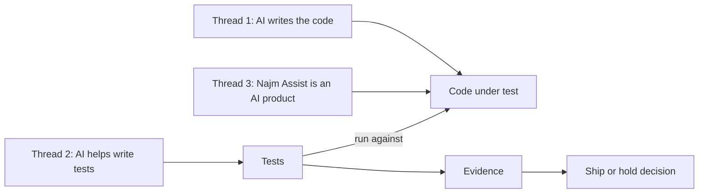
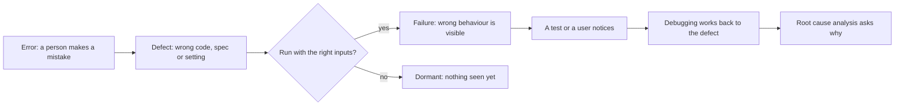
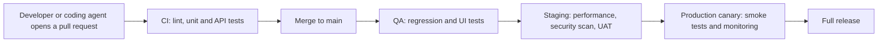

# Module 0 — Orientation

*Before you write a single test, you need a map. This module gives you three things. First, a precise idea of what testing is for: finding defects and giving the people who decide real evidence about quality and risk, in a world where AI writes much of the code, helps write the tests, and ships products whose answers are never quite the same twice. Second, an understanding of how software fails: the chain from a human error to a defect to a failure, the places defects come from, the disasters that taught the industry, and what it costs to find a bug late. Third, the people and the lab you will work with for the rest of the course: Najm Bank's Quality Engineering team, the systems they test, and a small sample system with deliberately seeded bugs. You will follow Nada, a new graduate, as she learns that a green tick is not proof, and Rashid, who teaches her to ask whether a test could fail. You will finish with a working lab, one bug caught and one missed, and a plan for how to study.*

> **Focus:** Mindset — what testing is for, how software fails, and how to use the course and the sample system.

---

# 0.1 — What software testing is, and what it is not: quality, risk and the AI-era shift
*Level: 🟢 Beginner* · *Prerequisites: none* · *Focus: Mindset*

## ⚡ In 60 seconds
- **Software testing** is evaluating software to find defects and to give stakeholders evidence about quality and risk. It produces information, not quality, and it can never prove that no bugs remain.
- **Debugging** finds a failure's cause and fixes it. **Quality assurance (QA)** is about process, **quality control (QC)** about the product, and **quality engineering** builds quality in across the team. Testing is one activity among them.
- "Works" is not one property. ISO/IEC 25010 (2011) lists eight quality characteristics; a transfer can be correct yet slow, insecure or unusable in Arabic.
- Three AI-era threads run through the course: testing code an AI wrote, using AI to test, and testing AI products. In each, ask: *could this test fail?*
- Decision cue: before you write or accept a test, name the failure it would catch.
- Biggest trap: reading green as proof. It means "these checks found nothing".

## 🧭 Why it matters
In her second week at Najm Bank, Nada reviews a pull request from one of Tariq's squads. A coding agent has added the international-transfer fee, with ten new tests. The pipeline is green and coverage says every new line ran. Nada approves it in six minutes.

A few days later Rashid, Head of Quality Engineering, asks: "What did the green tick tell you?" Nada says the tests pass. "Would they have failed if the fee were wrong?" She does not know. So they run her ten tests against the course's sample system with a fee bug switched on. Ten pass. They try the other four transfer bugs. Ten pass every time. Rashid says: "A test that cannot fail is not evidence. It is decoration."

A bank does not buy tests. It buys decisions: ship or hold, fix now or accept the risk. Tests are the evidence behind them, and evidence can be weak. That matters more now that code arrives faster from builders, human and AI, that are fluent and sometimes confidently wrong. This lesson gives you the vocabulary, and the habit of questioning a green tick.

## 📐 How it works

### 🟢 The essentials

**What testing is.** Testing evaluates software by running it (**dynamic testing**) or examining it, as in reviews and static analysis (**static testing**). It has two jobs: **find defects** before customers meet them, and **give evidence** about quality and risk to the **stakeholders** who must decide: product owners, engineers, operations, risk and compliance.

Every test has a situation (inputs and starting state), an action, and a **test oracle**: whatever tells you the result is right, such as a requirement, a worked example, the previous version or an expert's judgement. Without an oracle you have a run, not a test. For `fee("3090", "QAR", "international")` the rule is 0.35% of the amount, rounded half up. By hand, 3,090 × 0.0035 = 10.815, which rounds to 10.82. That hand-worked number is the oracle.

**Testing and its neighbours.** Job titles blur these words; look at what people do.

| Term | The question it answers | At Najm Bank |
|---|---|---|
| **Testing** | Where does this software differ from what we need? | Nada reports a one-cent fee difference |
| **Debugging** | Where is the cause, and how do we remove it? | A developer traces it to one line |
| **Quality control (QC)** | Does this product meet the bar? | Checks before staging |
| **Quality assurance (QA)** | Do our ways of working prevent defects? | Review rules, definition of done |
| **Quality engineering** | How do we build quality into every step? | Rashid's team: automation, pipelines |

Testing shows something is wrong; debugging finds why. After a fix, **confirmation testing** re-runs the failing test and **regression testing** checks nothing else broke.

**Verification and validation.** **Verification** asks "are we building it right?": does the software match its specification? **Validation** asks "are we building the right thing?": does it meet real needs? A page can pass one and fail the other: the specification says to show the rule code on a rejected transfer, and the page does, yet a customer reading `above_per_transfer_max` learns nothing.

**What testing cannot do.** Testing shows defects are present, never that none remain (Edsger Dijkstra's remark, and the first of the seven ISTQB testing principles). The reason is arithmetic. For one currency and one kind of transfer, `check_transfer` can be given about 2.5 million valid amounts and five million plausible "already sent today" values: about 12.5 trillion combinations, before other currencies and kinds. **Exhaustive testing is impossible**, so testing is careful sampling (Module 1 teaches how). An honest report says "we looked here and found this", never "it is correct".

**Checking versus testing.** Michael Bolton and James Bach, of the context-driven community, separate a **check** from **testing**. A check applies a decision rule to an observation, like `assert fee(...) == Decimal("10.82")`: a machine can run it, but it only confirms what someone expected. Testing, in their sense, is the human work of learning about a product by exploring it, including noticing what nobody wrote an assertion for. This is one school's vocabulary (the ISTQB syllabus does not draw this line), but useful: an automated suite records only what you already knew to ask.

### 🟡 Going deeper

**What "works" means.** ISO/IEC 25010 describes eight quality characteristics: **functional suitability**, **performance efficiency**, **compatibility**, **usability**, **reliability**, **security**, **maintainability** and **portability**. The 2023 revision renames and extends some (it adds safety); this course uses the familiar 2011 names. It does not say what to test; it stops you forgetting whole families of failure. Ten ways a transfer can fail:

| # | What goes wrong | Characteristic | Found by |
|---|---|---|---|
| 1 | A 3,090 QAR international transfer is charged 10.81, not 10.82 | Functional suitability (correctness) | Unit tests, lesson 2.1 |
| 2 | A customer who sent 49,000 QAR today is refused 1,000 QAR, which lands exactly on the limit | Functional suitability (boundary) | Boundary analysis, lesson 1.2 |
| 3 | A transfer at 16:30 Qatar time gets today's value date: the cut-off was read in UTC | Functional suitability (time zones) | Time-aware tests, lesson 1.2 |
| 4 | The app retries on a shaky connection and the customer pays twice | Reliability (fault tolerance) | Idempotency tests, lesson 3.1 |
| 5 | Bob reads Alice's transfer by guessing its id (BOLA) | Security (confidentiality) | Authorisation tests, lesson 4.2 |
| 6 | On salary day, submissions slow from under a second to twelve seconds | Performance efficiency | Load tests, lesson 4.1 |
| 7 | A screen-reader user taps Send and hears nothing | Usability (accessibility) | Screen-reader pass, lesson 3.3 |
| 8 | The Arabic page shows an English rule code, not a sentence to act on | Usability (localised messages) | Localisation checks, lesson 3.3 |
| 9 | A new API version returns `fee` as a number; app version 5.1 expects a string | Compatibility | Contract tests, lesson 2.2 |
| 10 | A fee change means editing seven files; the service will not start after a Python upgrade | Maintainability; portability | Review, CI matrix, lesson 5.2 |

BOLA means *broken object-level authorisation*: one user reaching another's data ([*Secure AI & Application Security*, lesson 3.3 — Authorisation: broken access control, IDOR and multi-tenancy](../secai/index.html#/3.3)). Classification is judgement: row 4 also loses money, but what you test is surviving retries, a reliability question. The model's value is the question it asks: *which rows would hurt Najm most, and what evidence do we have?*

**The AI-era shift: three threads.** AI changes who writes the code, who writes the tests, and what the product is. These snippets run against the sample system (set up in lesson 0.3); you need not run them yet.



*Thread 1: testing code that an AI wrote.* The agent's fee used binary floats, and a test written from the code copies its arithmetic:

```python
from decimal import Decimal
from najm.transfers import fee

def test_mirror():
    # Weak: the expected value is computed the way the code computes it.
    expected = Decimal(str(round(3090 * 0.0035, 2)))
    assert fee(3090, "QAR", "international") == expected

def test_oracle():
    # Strong: the expected value was worked out by hand from the fee rule.
    assert fee("3090", "QAR", "international") == Decimal("10.82")
```

With `NAJM_BUGS=float_fee` on (the bug in the agent's code), `test_mirror` passes and `test_oracle` fails: `assert Decimal('10.81') == Decimal('10.82')`. With the bug off, the verdicts swap. A test derived from the implementation defends the bug, so the oracle must come from elsewhere ([*System Design for Vibe Coders*, lesson 8.2 — Tests as the spec the agent can't ignore](../vibe/index.en.html#l8-2)).

*Thread 2: using AI to test.* The ten tests in Nada's pull request came from an AI assistant too. They look like this:

```python
import pytest
from decimal import Decimal
from najm.transfers import fee

@pytest.mark.parametrize("kind", ["own", "domestic", "international"])
@pytest.mark.parametrize("amount", ["50", "1500", "30000"])
def test_fee_returns_a_decimal(kind, amount):
    result = fee(amount, "QAR", kind)
    assert result is not None
    assert isinstance(result, Decimal)
    assert result >= 0

def test_unknown_kind_raises():
    with pytest.raises(ValueError):
        fee("10", "QAR", "teleport")
```

All ten pass and run every line of `fee()` that executes in a normal build. With each transfer bug on, they still pass: they check the *type* and *sign* of the answer, never its value. The remedy is to measure assistants: seed known bugs and count what their tests catch (lesson 6.3).

*Thread 3: testing AI products.* Najm Assist's wording changes between runs (the sample's `FakeModel` imitates this with a `temperature`). A test must pin the facts, not the sentence:

```python
import pytest
from najm.assist import FakeModel, answer

def test_vacuous():
    # Weak: any non-empty text passes, including an invented answer.
    assert answer("Can I pay in bitcoin?")["text"]

@pytest.mark.parametrize("seed", range(20))
def test_grounded(seed):
    # Strong: wording may vary; the fact and its source may not.
    result = answer("What is the daily transfer limit?", FakeModel(temperature=0.8, seed=seed))
    assert "50,000 QAR" in result["text"]
    assert result["sources"][0] == "limits"

def test_silence_is_admitted():
    # Strong: when no policy applies, the assistant must say so.
    result = answer("Can I pay in bitcoin?")
    assert result["sources"] == []
    assert "can't find that" in result["text"]
```

With `NAJM_AI_BUGS=hallucinate` the assistant invents a fee for the bitcoin question: `test_vacuous` still passes; `test_silence_is_admitted` fails. An exact-string comparison is no better: it fails on harmless variation, so people ignore it. Module 7 makes this a method ([*AI Governance*, lesson 9.3 — Testing, evaluation, validation and red-teaming](../aigp/index.html#/9.3) gives the governance view).

**Three myths.**

| Myth | Closer to the truth |
|---|---|
| "AI will replace testers." | AI changes how tests are written and run, but someone must still decide what correct means and judge the evidence, as each snippet showed. Nobody can promise how roles will change. |
| "Tests slow us down." | A slow or flaky suite does; the fix is sharper tests. No tests move the cost to production. |
| "100% coverage means no bugs." | Coverage measures lines run, not things checked. The ten generated tests ran every normal line of `fee()` and caught none of five bugs. |

### 🔴 Expert view

**Quality is relational.** Gerald Weinberg defined quality as "value to some person"; Bach and Bolton add "who matters". Customers, staff, auditors and regulators weigh the characteristics differently, so a profile starts with *whose* quality.

**Oracles are heuristics, and evidence has strength.** Specifications go stale; old behaviour may have been a bug. The **oracle problem**, knowing the right answer without redoing the work, is mild for `fee()` and severe for Najm Assist, where many wordings are right and some subtly wrong. A passing test supports confidence only if it would have failed had the bug been present. Ask of any green run: *if the bug I fear were here, would this run be red?* Mutation testing (lessons 2.3 and 6.2) automates the question; seeded bugs let you ask it by hand ([*System Design for Vibe Coders*, lesson 9.4 — Verification before completion](../vibe/index.en.html#l9-4)).

**Testing is economic.** A test's value is the loss it prevents, weighted by likelihood, so depth follows risk (lesson 5.1). **When not to do all this:** a one-off script you run once, on data you can inspect by eye, needs a glance, not a suite.

## 🧰 The toolkit
| Tool, practice or technique | What it is and does | When to reach for it |
|---|---|---|
| **Test oracle** | The source of truth a result is compared with: a spec, a worked example, a previous version, a regulation | Every test you write or review: where does the expected value come from? |
| **ISO/IEC 25010 quality model** | A standard list of eight product-quality characteristics | Turning "it works" into a checklist of failures |
| **Exploratory testing** | Learning, test design and execution at once, guided by a charter | Finding what no check covers |
| **Seeded bugs** | Defects switched on deliberately, like the sample's `NAJM_BUGS` | Measuring whether a suite can fail |
| **Risk-based testing** | Choosing what to test, and how deeply, by likelihood and impact | Deciding where time goes |
| **pytest** | A widely used Python test framework: plain `assert`, fixtures, parametrisation | This course's Python tests |

## 🏛️ In practice at Najm Bank
Every Najm feature starts with a **quality profile**: one page saying what "works" means, in words two people could check the same way. Rashid and the product owner fill it in before test design. This is the Transfers draft, with illustrative targets.

| Characteristic | What "good" means for Transfers | Priority | First evidence |
|---|---|---|---|
| Functional suitability | Fee, limit, cut-off and value date match the published rules for every currency and amount | High | Worked examples at boundaries |
| Performance efficiency | 95% of submissions finish within one second at the salary-day peak | High | Load test on staging |
| Compatibility | Every supported app version works after each API release | Medium | Contract tests |
| Usability | A transfer can be sent in either language, with a screen reader; every rejection says what to do | High | Exploratory sessions (Amal) |
| Reliability | A retried request never creates a second transfer; a crash never loses money | High | Idempotency tests |
| Security | Nobody reads or moves another customer's money | High | Authorisation matrix (Noura) |
| Maintainability, portability | A fee change touches one place and one test; the service runs on supported runtimes | Low | Review, CI matrix |

**To fill one in, in thirty minutes:** write one observable sentence per characteristic (rewrite it if two people could disagree on whether it is met); rank each; name first evidence for each High row; write one thing out of scope.

## 🛠️ Exercises
- 🟢 **Define quality for a feature.** Pick a feature you know, such as a login page or ticket booking, and fill in the profile. *Done when:* every row has one sentence two people could check the same way, three rows are High with a reason, and one thing is written down as out of scope.
- 🟡 **List failure modes.** For the same feature, write at least twelve ways it can fail, covering at least six characteristics. Score likelihood and impact from 1 to 5. *Done when:* each row says how we would notice (an observation, not just "test it"), and the top three by likelihood × impact are ranked with a line of reasoning each.
- 🔴 **A 20-minute exploratory session.** Choose a public website or app you may use as an ordinary visitor and write a charter: "Explore *this feature* with *this input* to discover *this kind of problem*." Set a 20-minute timer. Use it as any visitor would: no scanners, scripts or load, no real personal data, and stop at any login or payment step. Write up three findings. *Done when:* each gives where and when (device, browser, time), up to six repeat steps, expected versus actual, the characteristic involved and who is affected, so a colleague could repeat it; plus one note on something odd you judged acceptable.

## ⚠️ Mistakes and traps
- **Treating green as proof.** Ask what the checks could have found, and prove it by switching a bug on.
- **Letting the code supply its own oracle.** Expected values computed with the implementation's formula defend its bugs. Work them out by hand.
- **Testing only function.** A correct but slow, inaccessible or insecure transfer still fails customers. Use the eight characteristics as a checklist.
- **Believing coverage.** Lines run is not behaviour verified. Use coverage to find what is untested, not to claim what is tested.
- **Testing last.** Defects found when code is "done" arrive late and expensive (lesson 0.2).

## 🧾 Recap
- Testing evaluates software to find defects and give stakeholders evidence about quality and risk; it cannot prove no defects remain.
- Debugging repairs, QA is process, QC is product, quality engineering builds quality in.
- "Works" spans eight ISO/IEC 25010 characteristics; ask which matter here, and to whom.
- A test needs an independent oracle; tests copied from the code, or checking nothing, pass while the code is wrong.
- The three AI-era threads reduce to one question: could this test fail?

## ✍️ Check yourself

**1. An assistant generates ten tests for `fee()`. They pass, and coverage shows every line ran. What follows?**

- A. The fee logic is verified, because every line of it ran
- B. The suite is good enough to merge, since coverage is high
- C. Little is learned until the suite turns red with a fee bug on
- D. The tests should be discarded, because an AI wrote them

<details><summary>Answer</summary>

**C.** Coverage shows which lines ran, not whether an assertion would notice a wrong value. Switch a bug on and see if the suite turns red. A and B treat coverage as proof; D judges by source. (🟡 Going deeper, thread 2.)

</details>

**2. A test fails because a transfer's fee is wrong. A developer reads the code, finds the faulty line and changes it. Which activity is that?**

- A. Validation
- B. Regression testing
- C. Static testing
- D. Debugging

<details><summary>Answer</summary>

**D.** Debugging locates a failure's cause and removes it; the test only revealed the failure. Re-running tests afterwards is confirmation or regression testing. (🟢 The essentials.)

</details>

**3. A screen reader announces nothing after a customer taps "Send transfer". The fee and balance are correct. Which ISO/IEC 25010 characteristic is mainly affected?**

- A. Usability, through accessibility
- B. Functional suitability, through correctness
- C. Reliability, through fault tolerance
- D. Security, through confidentiality

<details><summary>Answer</summary>

**A.** The question is whether people using a screen reader can use the feature. B tempts because the money moved correctly, but the fix is judged on accessibility. (🟡 Going deeper.)

</details>

**4. A team runs 5,000 automated tests and every one passes. What can they honestly claim?**

- A. No defects remain, because 5,000 independent tests passed
- B. The release carries no risk, because nothing failed in testing
- C. Every requirement has now been proven correct by the suite
- D. No failures appeared in the cases run; other cases are untested

<details><summary>Answer</summary>

**D.** Testing shows the presence of defects, not their absence. A passing suite is evidence about the situations it exercised, so ask what it did not cover. (🟢 The essentials.)

</details>

**5. Najm Assist opens its answers differently on different runs, though the facts match. Which test is most appropriate?**

- A. Compare the full answer text with a stored string, word for word
- B. Assert the key fact appears and the limits document is cited
- C. Run it once and save the output as a snapshot to compare later
- D. Assert only that the answer is not empty, whatever it says

<details><summary>Answer</summary>

**B.** It pins what must not change, the fact and its source, while letting wording vary. A fails on harmless variation, D passes for invented answers, and C is as brittle as A. (🟡 Going deeper, thread 3.)

</details>

## 📚 References
- ISTQB, Certified Tester Foundation Level syllabus v4.0 (2023) — https://www.istqb.org/
- ISO/IEC 25010, SQuaRE product quality model (a paid standard)
- pytest documentation — https://docs.pytest.org/
- W3C Web Accessibility Initiative — https://www.w3.org/WAI/
- OWASP, API Security Top 10 project — https://owasp.org/
- Course sample system, Najm Transfers — https://github.com/Tamoura/system-design-for-vibe-coders/tree/main/testing/sample

---

# 0.2 — How software fails: errors, defects, failures, famous disasters and the economics of finding bugs early
*Level: 🟢 Beginner* · *Prerequisites: 0.1* · *Focus: Mindset*

## ⚡ In 60 seconds
- A person makes an **error**; it leaves a **defect** (bug, fault) in code, a specification or a setting; when the defect runs under the right conditions the software shows a **failure**. Root-cause analysis works back to the error and to why nothing stopped it.
- A defect can sit dormant. The sample's `float_fee` bug gives a wrong fee on 407 of the 25,000 whole-riyal amounts up to the per-transfer maximum, about one in 61, so a few hand-picked examples can miss it.
- Defects start everywhere: requirements, design, code, configuration, data, environment and integration.
- Finding a defect earlier usually costs less. The famous cost curve is a rule of thumb: its direction matches experience, its multipliers are contested.
- Every escaped bug earns a regression test and a root-cause note.
- AI-written code changes the mix of defects, not the chain.

## 🧭 Why it matters
On the first Monday of the month, Finance's reconciliation job flags something small: some international transfers were charged a fee one cent below the published table. The money is trivial, yet Rashid puts three facts on the whiteboard. The bank has been undercharging customers for five weeks. The tests were green every day. And the cause is one line that passed review.

Public failures have the same shape at a larger scale. In 2012 Knight Capital deployed new code, one server missed the update, and old logic sent unintended orders for about 45 minutes; the SEC's order puts the loss at roughly 460 million US dollars. A defect is measured not by the size of the wrong digit but by how long it runs, how much depends on it, and how hard it is to undo.

## 📐 How it works

### 🟢 The essentials

**Error, defect, failure.** An **error** (mistake) is a human action that produces something wrong, such as a misread rule. A **defect** (bug, fault) is the flaw it leaves in an artefact: a line of code, a requirement, a setting. A **failure** is the wrong behaviour you can observe when the defect runs. Not every defect causes a failure; a flaw that needs unusual input stays silent.



**A worked example, step by step.** With the sample's `float_fee` bug on, `fee("3090", "QAR", "international")` gives 10.81, but the rule, 0.35% rounded half up, gives 10.82.

1. **The error.** Whoever wrote the code, person or agent, treated 0.35% as the float `0.0035` and assumed `round` means "round to cents". Two mistakes: money in binary floats, and the built-in `round`, which sends exact ties to the even neighbour (`round(0.125, 2)` is `0.12`), not half up.
2. **The defect.** One line of `fee()`: it multiplies `float(amount)` by the float `0.0035`, clamps the result, and applies the built-in `round` to two places.
3. **Why it fires here.** 3,090 × 0.0035 is exactly 10.815, a half cent, which binary floats cannot store:

```python
from decimal import Decimal

x = 3090 * 0.0035
print(x)                                      # 10.815 (what Python shows)
print(f"{Decimal(x):.20f}")                   # 10.81499999999999950262 (what is stored)
print(Decimal("3090") * Decimal("0.0035"))    # 10.8150 (exact, so half up gives 10.82)
```

4. **How often.** Save as `fee_survey.py` in the sample folder and run it:

```python
import os

from najm.transfers import fee

amounts = [str(a) for a in range(1, 25_001)]   # whole riyals, 1 to 25,000 (the maximum)

os.environ["NAJM_BUGS"] = ""                   # no bug: the correct fee
correct = {a: fee(a, "QAR", "international") for a in amounts}
os.environ["NAJM_BUGS"] = "float_fee"          # bug on: the same calls again
buggy = {a: fee(a, "QAR", "international") for a in amounts}

wrong = [a for a in amounts if correct[a] != buggy[a]]
print(f"{len(wrong)} of {len(amounts)} amounts get a wrong fee")
print(f"first: {wrong[0]} QAR, correct {correct[wrong[0]]}, buggy {buggy[wrong[0]]}")
```

```text
407 of 25000 amounts get a wrong fee
first: 2870 QAR, correct 10.05, buggy 10.04
```

5. **Why tests missed it.** The starter suite tests the minimum fee (100) and the cap (100,000), never the band where the percentage applies and a half cent can occur.

The lesson: a defect's reach depends on inputs, not on how bad the line looks. A property check (lesson 2.3) can find this if its generator reaches whole-riyal amounts in the percentage band; a handful of examples may never.

**Where defects originate.** Only some begin as typing slips in code.

| Origin | Najm example |
|---|---|
| Requirements | The fee table says "0.35%" but not how to round |
| Design | Idempotency keys kept in one server's memory, forgotten on restart |
| Code | Daily limit checked with `>=` instead of `>` |
| Configuration | The 15:00 cut-off set in the wrong time zone |
| Data | A currency table missing KWD's three decimals |
| Environment | Staging runs in UTC, production in Qatar time |
| Integration | App 5.1 expects `fee` as a string; the API sends a number |

**Test levels.** ISTQB names five by scope: **component** (one function, like `fee()`), **component integration** (parts together, like `TransferService` and its store), **system** (the whole product, in staging), **system integration** (the product with other systems, like core banking) and **acceptance** (users or the business judge fitness).

### 🟡 Going deeper

**The economics of finding bugs early.** The claim: the later a defect is found, the more it costs. Barry Boehm's analyses of large projects (*Software Engineering Economics*, 1981) are the usual source, and slide decks show tidy multipliers. Be suspicious of them: they come from particular projects and eras, and Kent Beck argued in *Extreme Programming Explained* (1999) that tests, small steps and refactoring can flatten the curve. The evidence is mixed, but the direction matches experience. The fee bug costs seconds if a unit test catches it, a comment in review, a red build in CI, a report-reproduce-fix-retest cycle in QA, and in production an investigation, refunds, a hotfix and audit evidence. Each step adds people, loses context and makes damage harder to undo. The trade-off: earlier is not free. Detailed tests against requirements that will change are waste; "shift left" means moving *feedback* earlier, not testing everything first.

**Famous failures.** Accounts are simplified; real causes are several.

| Incident | The defect | Why it escaped | Level that would have caught it |
|---|---|---|---|
| **Ariane 5 flight 501** (1996) | A 64-bit float to 16-bit integer conversion overflowed in reused Ariane 4 guidance software | Reuse was trusted; not run with Ariane 5 flight data in simulation (Inquiry Board) | System integration, real flight profile |
| **Mars Climate Orbiter** (1999) | Ground software gave thruster data in pound-force seconds; navigation expected newton-seconds | The units across the interface were never verified end to end (NASA board) | System integration or an interface contract test |
| **Therac-25** (1985 to 1987) | Race conditions in the control software, with hardware interlocks removed, caused radiation overdoses | Reused software trusted; little independent review; fast operator edits not exercised (Leveson and Turner) | System testing with realistic operator behaviour |
| **Knight Capital** (2012) | New code reached seven of eight servers; the eighth ran old logic revived by a reused flag | Manual deployment; nothing checked every server ran one version (SEC order) | Release verification, staged rollout |
| **Healthcare.gov launch** (2013) | The site failed under real load and across many contractors' parts | Integration and load testing squeezed late in the schedule (GAO, HHS) | System integration and performance tests, started early |
| **CrowdStrike** (July 2024) | A content update caused an out-of-bounds read in the Falcon sensor, crashing Windows hosts | Per CrowdStrike's analysis, content validation missed the mismatch; no staged rollout | Component integration; canary rollout |

The pattern: no row is a simple slip that unit tests would have caught. They are assumptions at boundaries (reuse, units, interfaces), concurrency and rollout. Every part can pass its own tests while the whole fails. [*Cloud & DevOps*, lesson 4.2 — Release strategies: rolling, blue-green, canary, feature flags and rollback](../cloud/index.html#/4.2) covers the staged-release defences behind the Knight and CrowdStrike rows.

**Defect clustering and risk.** Defects cluster: a few components usually hold a large share, in a rough Pareto pattern whose split varies. Where bugs were found is where more will be. Pair that with **risk = likelihood × impact**, each scored 1 to 5. In Transfers, a duplicate submit scores 15 (3 × 5), the cut-off and value date 12, authorisation 10, the fee 9, and statement layout 2. The scores are judgement, not measurement; they steer the deepest tests (lesson 5.1).

**Root-cause analysis: five whys.** Ask "why?" until you reach a condition the team can change; five is a rule of thumb. For the fee bug:

1. Why was 3,090 charged 10.81? The fee used floats and `round`.
2. Why? The author chose the simplest arithmetic; the team has no written rule for money.
3. Why did review miss it? The code looked right, the tests were green, and the checklist never mentions money types.
4. Why did tests miss it? Cases came from the fee rules (minimum, cap, flat), not the rounding rule; none had a half cent.
5. Why? The requirement said "0.35%" and never said how to round, so nobody had a number to test.

**Weak versus strong:** a chain that stops at "the developer made a mistake" ends in "be more careful", which prevents nothing. This one ends at an incomplete requirement, no rule for money, and tests drawn from rules instead of boundaries: things you can assign. Real incidents rarely have one linear cause, so treat it as a start ([*Cloud & DevOps*, lesson 5.3 — Incidents and blameless postmortems](../cloud/index.html#/5.3)).

**Every escaped bug becomes a regression test.** The loop: reproduce with the smallest example; write a test with an independent oracle; watch it fail for the right reason; fix; watch it pass; keep it. Save as `tests/test_regressions.py`:

```python
from decimal import Decimal

import pytest

from najm.transfers import fee

def test_international_fee_rounds_half_a_cent_up():
    """NAJM-101: 3,090 QAR was charged 10.81. The rule is round half up, so 10.82."""
    assert fee("3090", "QAR", "international") == Decimal("10.82")

@pytest.mark.parametrize("amount, expected", [
    ("2870", "10.05"),   # 2,870 x 0.35 % = 10.045
    ("2990", "10.47"),   # 10.465
    ("3110", "10.89"),   # 10.885
])
def test_every_half_cent_fee_rounds_up(amount, expected):
    """The same bug from three more angles: the class of input, not one example."""
    assert fee(amount, "QAR", "international") == Decimal(expected)
```

It passes on the clean sample. With `NAJM_BUGS=float_fee` all four fail, the first with `assert Decimal('10.81') == Decimal('10.82')`: the right reason. **Weak versus strong:** `assert fee("3090", "QAR", "international") is not None` passes with the bug. A test that restates the old wrong answer is worse: it fails the day someone fixes the code.

### 🔴 Expert view

**Regression tests are memory, and they cost.** Test the class, not just the instance: a property check, "for every amount, `fee` equals the Decimal reference", covers all 407 at once if its generator reaches them (lesson 2.3 measures this). Each test is a promise to maintain. **When not to write one:** for a bad configuration value, add a validation or an alert; for a requirements gap, fix the requirement and add a worked example; for a one-off data repair, record it and move on. Automate when a code change could bring the bug back. Track escapes (defects found after release, lesson 5.1) as a trend, never a target; a target invites people to stop reporting.

**How AI-written code changes the failure profile.** The chain is unchanged; what shifts is where errors come from and how convincing the result looks. Agents write more code per day, so defects have more places to hide even at an unchanged rate per line (nobody has settled that). Typical failures differ from a tired human's: plausible but wrong logic; invented functions or packages; edge cases missed because the agent never saw the requirement; checks silently deleted or weakened; tests that restate the code (lesson 0.1); and "fixes" that make the test pass rather than the code correct. In July 2025 a founder publicly reported that a coding agent had deleted a production database during a code freeze; the account comes from those involved, so treat it as reported. Module 6 builds a reviewer's checklist for these patterns, starting with lesson 6.1.

## 🧰 The toolkit
| Tool, practice or technique | What it is and does | When to reach for it |
|---|---|---|
| **Five whys** | Asking "why?" repeatedly until you reach a cause the team can change | After any escaped defect, as a first pass |
| **Regression test** | A test that keeps a fixed bug fixed, written to fail on the original defect | Every escape a code change could bring back |
| **Test levels** | Five scopes, from one function to business acceptance | Deciding where a defect should have been caught |
| **Risk matrix** | Likelihood times impact, scored per area | Deciding where the deepest testing goes |
| **Blameless postmortem** | A written incident review that focuses on conditions, not people | Any customer-visible failure |

## 🏛️ In practice at Najm Bank
Every escape at Najm gets an **escaped-defect card** within two working days, owned by the QE who found it. This is Nada's card for the fee bug:

| Field | Entry |
|---|---|
| ID and title | NAJM-101: international fee rounds down one cent on some amounts |
| Found by and when | Finance reconciliation, five weeks after release |
| Customer impact | One-cent undercharges on some international transfers; no overcharges |
| Origin | Requirement (rounding unspecified) and code (float arithmetic) |
| The chain | Error: money treated as a float. Defect: `float(amount) * 0.0035` with `round`. Failure: 10.81 for 10.82 |
| Why it escaped | No test in the percentage band with a half cent; review checklist silent on money |
| Level that would catch it | Component test with a hand-worked oracle; a property test |
| Regression test | Both tests in `tests/test_regressions.py`, merged with the fix |
| Systemic actions | "Money and rounding" added to the review checklist (Tariq); rounding rule and three worked examples in the fee spec (product owner); property test (Bilal) |

## 🛠️ Exercises
- 🟢 **Map incidents to test levels.** Choose three of: Heartbleed (2014), the Pentium FDIV bug (1994), Cloudflare's leap-second bug (January 2017), GitLab's database incident (2017). Read each primary account and fill in a row of the famous-failures table. *Done when:* each row cites one fact from the source, names a test level, gives a concrete check (input and expected result), and says what no test could have caught.
- 🟡 **Root-cause a bug.** Write a script that prints `value_date` for Monday 5 October 2026 at 10:00, 14:59, 15:00, 16:30 and 18:00 Qatar time (`datetime(..., tzinfo=ZoneInfo("Asia/Qatar"))`). Run it clean, then with `NAJM_BUGS=tz_cutoff`. *Done when:* your output shows exactly which times differ; your five-whys chain has at least four steps, the last two naming things a team could change; and you have classified the defect's origin.
- 🔴 **Turn a bug into a regression test.** With `NAJM_BUGS=limit_off_by_one`, a transfer that lands exactly on the daily limit is wrongly refused. Write a test that fails on that bug and passes on the clean sample, plus a second that pins the other side of the boundary. Then run the starter suite and your tests under each of the five `NAJM_BUGS` values and record which are caught. *Done when:* the first test fails with `daily_limit_exceeded` in its output; the second passes with and without the bug; and your five-run table is in your lab journal.

## ⚠️ Mistakes and traps
- **Stopping at "human error".** It names a person, not a condition. Ask why until you find something fixable.
- **Fixing before reproducing.** Without a failing test you cannot show the fix worked.
- **Quoting cost-curve numbers as fact.** "A bug costs 100 times more in production" is a slogan. Use the direction, and your own data.
- **A regression test that pins the symptom.** One example misses the class. Add neighbours or a property.
- **Testing at one level.** Mars Climate Orbiter's units mismatch lived between two software parts. Check where components meet.

## 🧾 Recap
- An error leaves a defect; a failure appears only when the defect runs under the right conditions, and the inputs decide how often.
- Defects originate in requirements, design, code, configuration, data, environment and integration, so check at more than one level.
- Late defects cost more in people, context and damage; the multipliers are contested, the direction is not.
- Famous failures mostly sit at boundaries, concurrency and rollout.
- Use risk to focus depth, five whys to reach changeable causes, and an independent-oracle regression test for every escape.

## ✍️ Check yourself

**1. A developer wrote `float(amount) * 0.0035`, believing floats are fine for money. Finance later sees a fee of 10.81 instead of 10.82. Which of these is the defect?**

- A. The developer's belief that floats are fine for money
- B. The fee shown as 10.81 on the statement
- C. The missing test for half-cent amounts
- D. The line of code that does float arithmetic

<details><summary>Answer</summary>

**D.** The defect is the flaw in the artefact. A is the error behind it, B the failure, and C a reason it escaped. (🟢 The essentials.)

</details>

**2. Ground software wrote thruster data in pound-force seconds while navigation software read it as newton-seconds. Each side passed its own unit tests. Which test would most likely have caught it?**

- A. More unit tests of the thruster calculations on each side separately
- B. A performance test of the navigation software
- C. A check of the real data passing between the two systems
- D. A usability review of the mission control screens

<details><summary>Answer</summary>

**C.** The defect lives between the parts, so only an integration-level check of the exchanged data can see it. Unit tests (A) already passed. (🟡 Going deeper.)

</details>

**3. A colleague says: "A bug always costs exactly 100 times more to fix in production than in design." What is the best response?**

- A. Agree: Boehm's studies established that ratio for all projects
- B. Partly agree: late fixes usually cost more, but no fixed ratio holds
- C. Disagree: Beck showed a bug costs the same whenever it is found
- D. Partly agree: the ratio holds for waterfall projects, not agile ones

<details><summary>Answer</summary>

**B.** Late fixes usually involve more people and damage, but the numbers come from particular projects and are disputed. A overstates the evidence, C overstates Beck's flattening argument, D invents a split. (🟡 Going deeper.)

</details>

**4. After the time-zone incident, a team's five whys ends: "The developer forgot about time zones." What is wrong with that ending?**

- A. Nothing: human error is the true root cause of most incidents
- B. It should stop at the second why, to keep the review short
- C. It should go on to blame the tester who missed the bug
- D. It names a person's slip, not a changeable condition

<details><summary>Answer</summary>

**D.** "Be more careful" prevents nothing. A useful chain ends at a missing rule, checklist or test. C only swaps one person for another. (🟡 Going deeper.)

</details>

**5. The limit bug is fixed. Which regression test is strongest?**

- A. Assert that `check_transfer` can be called without an error
- B. Assert 1,000 passes and 1,000.01 fails at 49,000 sent today
- C. Assert that line coverage of `check_transfer` did not drop
- D. Assert that a transfer of 10 QAR is accepted on a fresh day

<details><summary>Answer</summary>

**B.** It pins both sides of the boundary with hand-worked values, so it fails if the bug returns or if someone over-corrects. The others pass with the bug. (🟡 Going deeper.)

</details>

## 📚 References
- Ariane 5 Flight 501 Failure, Report by the Inquiry Board (1996) — https://www.esa.int/
- NASA, Mars Climate Orbiter Mishap Investigation Board Phase I Report (1999) — https://www.nasa.gov/
- Leveson and Turner, An Investigation of the Therac-25 Accidents, IEEE Computer (1993)
- US SEC, order against Knight Capital Americas LLC (2013) — https://www.sec.gov/
- US GAO, Healthcare.gov reports (2014) — https://www.gao.gov/
- CrowdStrike, Falcon content update root cause analysis (2024) — https://www.crowdstrike.com/
- Google SRE book, Postmortem Culture: Learning from Failure — https://sre.google/sre-book/postmortem-culture/
- ISTQB, Certified Tester Foundation Level syllabus v4.0 (2023) — https://www.istqb.org/

---

# 0.3 — Meet Najm Bank's Quality Engineering team, and how to use this course
*Level: 🟢 Beginner* · *Prerequisites: 0.1, 0.2* · *Focus: Mindset*

## ⚡ In 60 seconds
- **Najm Bank is fictional.** You join its **Quality Engineering (QE)** team: Rashid (head, your mentor), Nada (new graduate, your peer, who makes the mistakes), Bilal (SDET lead) and Amal (exploratory and accessibility lead).
- They test Najm Mobile and its API, the payments service, Najm Assist and the regulatory reporting pipeline, across dev, QA, staging and production, with synthetic or masked data, never raw customer data.
- You practise on the course's **sample system**: free, Python, with nine seeded bugs. Your first win: run the starter suite, switch on a bug and watch it fail, then switch on another and watch it pass.
- Every lesson has ten parts, a 🟢 🟡 🔴 ladder, three exercises with "Done when", and a Focus tag.
- Study with AI honestly: use it to explain, never to produce an answer you cannot explain; explain every test you submit.
- Biggest trap: reading without running.

## 🧭 Why it matters
Rashid has a rule: nobody finishes their first week until they have seen a green suite lie. On Friday of her first week, Nada, who has done all the reading, gets the sample system's starter suite: 24 tests, all green. Rashid says, "Tell me which bugs it would miss." She switches on `bola`: one test fails, as it should. She switches on `float_fee`: all 24 still pass. The point lands: a suite is a claim, and you test the claim.

The next day she asks an AI assistant for help with her first exercise and gets a tidy test. Rashid asks why it fails only when the bug is on. Nada cannot say. "Then you have not tested anything," he says. "You have copied a result." That is this course's rule for AI: use it to understand, never to skip understanding. This lesson introduces the team, systems and lab, gets your first win, and sets out how to study.

## 📐 How it works

### 🟢 The essentials

**Najm Bank is fictional.** It is the mid-sized Gulf bank (Qatar, the UAE and the EU) used across this library, so the security, governance and product courses tell parts of one story. A bank makes a good teaching case because the stakes are clear: a transfer must never be lost, duplicated or mis-rounded.

**The QE team.**

| Person | Role | What they care about | Where you meet them most |
|---|---|---|---|
| **Rashid** | Head of Quality Engineering; your mentor | Evidence for decisions: what we know, and what we do not | Strategy (lesson 5.1), capstone |
| **Nada** | New graduate quality engineer; your peer | Learning fast; makes the mistakes you should avoid | Everywhere |
| **Bilal** | SDET lead (software development engineer in test) | The automation framework, CI, flaky tests | Modules 2 and 3, lesson 5.2 |
| **Amal** | Exploratory-testing and accessibility lead | Real users, Arabic right-to-left, screen readers | Lessons 3.3 and 5.3 |

Neighbours from the library appear when their work touches testing: Tariq (engineering lead, app squads), Maha (SRE lead), Noura (Head of Application & AI Security), Dana and Rania (Najm Assist) and Sara (Data Protection Officer).

**The systems under test.**

| System | What it is | Why it is tested hard |
|---|---|---|
| **Najm Mobile and the Najm Mobile API** | The retail app (iOS, Android, web; English and Arabic) and the API behind it: login, accounts, **transfers**, bills, cards, beneficiaries, limits | Most customers touch it; Transfers is our running feature |
| **Payments service** | Moves the money; idempotency keys, strict recovery targets | It must not lose, duplicate or mis-round a transfer |
| **Najm Assist** | The LLM assistant: answers from policy documents (retrieval-augmented generation, RAG); reads balances; freezes a card only after explicit confirmation | Answers vary; one action writes |
| **Regulatory reporting pipeline** | Nightly data files to the regulator, with data-quality checks | Wrong data is a regulatory issue |

The course's sample system, **Najm Transfers**, is a small stand-in for the first three: transfer rules and an API, a web page, and Najm Assist.

**Environments.** Four, each with its own job.

| Environment | Purpose | Data | Typical tests |
|---|---|---|---|
| **Dev** | Developers build and try things | Synthetic, small | Unit, component, quick API checks |
| **QA** | A stable build for QE, refreshed per release candidate | Synthetic test accounts | Regression, API, UI, exploratory |
| **Staging** | Production-like: same versions and configuration shape | Masked or synthetic, production-sized | Performance, security scans, resilience drills, UAT (user acceptance testing), release rehearsal |
| **Production** | Real customers | Real | Smoke tests with flagged test accounts, synthetic monitoring, watching canaries; nothing destructive |

Never run load or security tests against production, or against any system you do not own or have written permission to test.

**Test data policy.** The rules are short: use **synthetic** data by default; use **masked** data (irreversibly altered, keeping formats and distributions) only when realism is essential and Sara has approved the method; **never raw customer data** in dev, QA, staging or any external tool, AI assistants included. [*Secure AI & Application Security*, lesson 5.3 — Protecting personal data: minimisation, logging and privacy engineering](../secai/index.html#/5.3) explains the duties behind it.

**The delivery flow.** Tests run at every step, each asking a different question.



Fast checks come early, realistic ones later. [*Cloud & DevOps*, lesson 4.1 — Continuous integration: pipelines, tests, artefacts and fast feedback](../cloud/index.html#/4.1) covers the pipeline itself.

### 🟡 Going deeper

**Your first win, step by step.** You need Python 3.11 or newer and Git. Node 20 or newer is optional until Module 3. Use `python3` if that is your command.

```bash
git clone https://github.com/Tamoura/system-design-for-vibe-coders.git
cd system-design-for-vibe-coders/testing/sample
python -m venv .venv
source .venv/bin/activate          # Windows PowerShell: .venv\Scripts\Activate.ps1
pip install -r requirements.txt
pytest
```

You should see `24 passed`. (On Windows, if `ZoneInfoNotFoundError` mentions `Asia/Qatar` later, run `pip install tzdata`.) Now switch on a seeded bug with an environment variable. In PowerShell use `$env:NAJM_BUGS="bola"; pytest`, and `Remove-Item Env:NAJM_BUGS` afterwards.

```bash
NAJM_BUGS=bola pytest
```

```text
# trimmed output
.......................F
FAILED tests/test_transfers.py::test_a_user_cannot_read_someone_elses_transfer
1 failed, 23 passed
```

That is a suite doing its job. Now the other half.

```bash
NAJM_BUGS=float_fee pytest
```

```text
24 passed
```

The suite is green while the bank undercharges (lesson 0.2). Rather than trying bugs one by one, save this as `scoreboard.py` in the sample folder; it runs a test folder once per seeded bug:

```python
import os
import subprocess
import sys

BUGS = [("NAJM_BUGS", b) for b in ["limit_off_by_one", "float_fee", "tz_cutoff", "no_idempotency", "bola"]]
BUGS += [("NAJM_AI_BUGS", b) for b in ["hallucinate", "obey_injection", "skip_confirm", "wrong_account"]]

def green(variable=None, bug=""):
    env = {**os.environ, "NAJM_BUGS": "", "NAJM_AI_BUGS": ""}
    if variable:
        env[variable] = bug
    run = subprocess.run([sys.executable, "-m", "pytest", "-q", *sys.argv[1:]], env=env, capture_output=True)
    return run.returncode == 0

assert green(), "the suite must pass with no bug switched on"
caught = 0
for variable, bug in BUGS:
    if green(variable, bug):
        print("missed", variable, bug)
    else:
        caught += 1
        print("caught", variable, bug)
print(f"{caught} of {len(BUGS)} seeded bugs caught")
```

Run `python scoreboard.py`. For the sample as shipped with this course you should see:

```text
missed NAJM_BUGS limit_off_by_one
missed NAJM_BUGS float_fee
missed NAJM_BUGS tz_cutoff
caught NAJM_BUGS no_idempotency
caught NAJM_BUGS bola
caught NAJM_AI_BUGS hallucinate
missed NAJM_AI_BUGS obey_injection
caught NAJM_AI_BUGS skip_confirm
missed NAJM_AI_BUGS wrong_account
4 of 9 seeded bugs caught
```

Your numbers should match the version you cloned. Now close one gap. Add `tests/test_first_win.py`:

```python
from decimal import Decimal

from najm.transfers import fee

def test_international_fee_rounds_half_a_cent_up():
    # 3,090 x 0.35 % = 10.815 exactly; round half up gives 10.82
    assert fee("3090", "QAR", "international") == Decimal("10.82")
```

It passes clean (`25 passed`). With `NAJM_BUGS=float_fee` it fails with `assert Decimal('10.81') == Decimal('10.82')`, and the scoreboard now says `5 of 9`. **Weak versus strong, again:** a test that fails with `ImportError` also "catches" every bug and proves nothing. Red counts as evidence only when it is red for the right reason.

To see the product, run `uvicorn najm.api:app --port 8000`, then `curl http://127.0.0.1:8000/health` (expect `{"status":"ok"}`) and open `http://127.0.0.1:8000/app`. The sample is deliberately buggy with fake tokens: run it only on your own machine. For the optional browser tests, run `npm install`, `npx playwright install chromium`, then `PYTHON=.venv/bin/python npx playwright test --config e2e/playwright.config.ts` (in PowerShell, set `$env:PYTHON=".venv\Scripts\python.exe"` first).

**How the course works.**
- **Ten parts per lesson**, in order: ⚡ In 60 seconds, 🧭 Why it matters, 📐 How it works, 🧰 The toolkit, 🏛️ In practice at Najm Bank, 🛠️ Exercises, ⚠️ Mistakes and traps, 🧾 Recap, ✍️ Check yourself, 📚 References.
- **The ladder.** "How it works" climbs from 🟢 *The essentials* to 🟡 *Going deeper* to 🔴 *Expert view*. Short of time? Read the 🟢 parts first.
- **Exercises** come in three grades, each with a **Done when** line you can check yourself.
- **The toolkit catalogue** gathers every bold name from the 🧰 tables into one page, for looking up "what was that tool?".
- **The self-assessment** is a short knowledge check plus a checklist of things you have really done, giving a level per module and lessons to study next.
- **Focus tags** show what a lesson mainly trains: **Mindset** (thinking about quality and risk), **Design** (choosing test cases), **Unit**, **Integration** (parts and APIs working together), **UI**, **Performance**, **Security**, **Reliability**, **Strategy** (what to test and how much), **Delivery** (CI/CD and production), **AI** and **Career**.

**Routes through the course.** Straight through suits newcomers.

| If you are… | Start with |
|---|---|
| A new graduate aiming at QE or SDET | Straight through, every 🔴 exercise |
| A manual tester moving to automation | Module 1, then lessons 2.1, 3.1, 3.2, 5.2 |
| A developer or vibe coder verifying agent output | Lessons 2.1, 2.3, 6.1, 6.2, then Module 5 |
| Heading for AI evaluation work | Modules 0 to 2, lesson 6.3, Module 7 |
| In product or risk, not coding | Modules 0 and 1, lessons 5.1 and 7.3 |

For the wider career picture, see [*From Graduate to Hired*, lesson 1.1 — The junior baseline: Git, reading code, debugging, testing and writing it down](../career/index.html#/1.1).

### 🔴 Expert view

**Study with AI assistants honestly.** AI can make you faster or make you hollow; these rules keep it the first.
1. **Use AI to explain.** Ask for another explanation, an analogy, a quiz, or a critique of a test you have already written.
2. **Never use it to produce an exercise answer you cannot explain.** The explain-back test: close the chat, then say what bug each test catches and show it failing with that bug on.
3. **Explain every test you submit**, to your journal, a reviewer or an interviewer. If you cannot, delete it.
4. **Verify what it tells you.** Run the code. Assistants invent flags, functions and versions.
5. **Protect data and money.** Use only synthetic data; paste no employer code or customer data into a tool you are not approved to use. No paid API key is ever required; if you try a hosted model, set a spending cap first.

**Weak versus strong prompts.** Weak: "Write tests for `fee()`." You receive plausible tests of unknown strength (lesson 0.1). Strong: "Here is my test for `fee()`. Give me three different bugs it would still pass." You receive a way to attack your own work, and can run each answer. **When not to use AI:** at the start of an exercise (give it fifteen minutes alone first), in an exam or interview, or when you cannot verify the answer. Follow your employer's policy on AI tools.

**A yardstick for you and for tools.** The bug-catch score measures any suite, yours or a tool's, by what it catches. Lesson 6.3 uses it to evaluate AI test assistants, and lesson 2.3 introduces mutation testing, which automates the idea. Keep a **lab journal** (a Git repository of outputs, mistakes and artefacts); it becomes your portfolio.

## 🧰 The toolkit
| Tool, practice or technique | What it is and does | When to reach for it |
|---|---|---|
| **pytest** | Python's test framework: plain `assert`, fixtures, parametrisation, plugins | Every Python test here |
| **Playwright** | Microsoft's browser automation and test runner for Chromium, Firefox and WebKit | End-to-end and UI tests |
| **k6** | Grafana's load-testing tool; scripts in JavaScript with pass/fail thresholds | Performance tests |
| **GitHub Actions** | CI/CD workflows in YAML that run on pushes and pull requests | Running the suite on every change |
| **Jira and Xray** (examples) | An issue tracker plus a test-management add-on; TestRail and Zephyr are alternatives | Tracing requirements to tests and results in big teams |
| **Allure** | A reporting tool that turns test results into a browsable report | Making results readable to people who do not run the suite |
| **Seeded bugs** | Defects switched on deliberately, like `NAJM_BUGS` and `NAJM_AI_BUGS` | Measuring whether a suite can fail |

## 🏛️ In practice at Najm Bank
Every new QE completes the **week-one checklist** with Rashid, setup first. This is Nada's copy.

| Item | Done when |
|---|---|
| Python 3.11+ and Git | `python --version` and `git --version` print versions |
| Virtual environment | Your prompt shows `(.venv)` and `pip install -r requirements.txt` has finished |
| Starter suite runs | `pytest` shows 24 passed |
| Node 20+ and Playwright (optional until Module 3) | `node --version` prints 20 or newer; the two browser tests pass |
| See a green suite lie | Scoreboard run saved; you can name three missed bugs and why |
| Close one gap | One new test that fails for the right reason, in your lab repository |
| Data briefing (Sara) | You can say where test data comes from and what never goes into a tool |
| Meet the squad | 30 minutes each with Bilal and Amal |

**The three-questions review card** hangs in the QE room and applies to every test, human-written or AI-written. First, **could it fail?** (Is there a bug that would turn it red?) Second, **does it fail for the right reason?** (An assertion on the rule, not an error elsewhere.) Third, **can I explain it?** (What it protects, and why this expected value.)

## 🛠️ Exercises
- 🟢 **Set up the environment.** Follow the first-win steps in a fresh virtual environment. Save the output of `python --version`, `pytest --version` and `pytest` in `lab-check.txt` in a new Git repository, your lab journal. *Done when:* the file shows 24 passed, `curl` returned `{"status":"ok"}` from `/health` while `uvicorn` ran, and (optional) the two Playwright tests passed.
- 🟡 **Break and catch a bug.** Run the scoreboard and choose a bug the starter suite misses that this lesson did not close: `wrong_account` is easiest (ask a default `Agent` for its balance and assert on the reply); `obey_injection` is hardest (plant a poisoned document with pytest's `monkeypatch`). Write one test that passes clean and fails with that bug on. *Done when:* the scoreboard shows one more bug caught than before and the suite passes with no bug on; and your journal explains in two lines why the test fails for the right reason.
- 🔴 **Write your learning plan.** Choose a route from the table, list the lessons in order with a target week for each, set your weekly study time, and set one measurable goal, such as a bug-catch score you will reach by the end of Module 2. Add your AI-use rules in your own words. *Done when:* the plan is one page, every lesson you intend to do has a week, the goal is a number you can check, and the AI rules say what you will and will not paste into an assistant.

## ⚠️ Mistakes and traps
- **Reading without running.** Testing is a craft of the hands. Do every exercise, and break things on purpose.
- **Treating the sample as safe software.** It is deliberately buggy, with fake tokens. Run it on localhost only.
- **Editing the tests to match the bug.** A test that is red with a bug on is working. Fix the code, or switch the bug off.
- **Copying an AI answer you cannot explain.** It decorates your journal and teaches nothing. Use the explain-back test.
- **Installing packages globally.** Use the virtual environment so versions match.
- **Skipping Modules 0 and 1 because you can code.** Later lessons assume their vocabulary and habits.

## 🧾 Recap
- Najm Bank is fictional; its QE team (Rashid, Nada, Bilal, Amal) tests Najm Mobile and its API, payments, Najm Assist and regulatory reporting.
- Dev, QA, staging and production have different jobs; test data is synthetic or masked, never raw customer data; load and security tests need a system you own or written permission.
- The sample system and its seeded bugs let you see a suite catch one bug and miss another, and the bug-catch score measures any suite.
- Each lesson has ten parts, a ladder and a Focus tag; each exercise has a "Done when".
- Use AI to explain, not to replace understanding, and keep a lab journal.

## ✍️ Check yourself

**1. Nada switches on `float_fee` and the starter suite still shows 24 passed. What does this tell her?**

- A. The fee code is correct, because the suite is green
- B. The suite has no test that can see this bug
- C. The bug switch does not work
- D. The suite needs more tests of every kind

<details><summary>Answer</summary>

**B.** A green run is evidence only about what the tests check, and none sits where a half cent can occur. A reads green as proof; D asks for more tests without saying which. (🟡 Going deeper.)

</details>

**2. Bilal wants to run a load test of the payments service before a big release. Where should he run it?**

- A. On a developer laptop, where it is quick to run
- B. In production, at 3 a.m., when traffic is lowest
- C. In staging, because it is production-like
- D. In QA, because that build is stable

<details><summary>Answer</summary>

**C.** Performance results mean something only on a production-like system, and load tests must not target production. QA is stable but not production-sized, so its numbers would mislead. (🟢 The essentials.)

</details>

**3. Amal needs realistic customer names for a screen-reader session. What fits Najm's test-data policy?**

- A. A copy of last month's production customers
- B. Real statements pasted into an assistant to anonymise them
- C. A few customers' details, used only for this session
- D. Synthetic accounts generated for the purpose

<details><summary>Answer</summary>

**D.** Synthetic data is the default and involves no real person. A and C use raw customer data, and B sends it to an external tool, which the policy forbids. (🟢 The essentials.)

</details>

**4. An assistant gives Nada a test that passes on the clean sample. What must she do before she submits it?**

- A. Show it failing when a relevant bug is on, and explain it
- B. Run it twice more to confirm that it passes every time
- C. Ask the assistant to confirm that the test is correct
- D. Check that it raises the coverage percentage of the module it targets

<details><summary>Answer</summary>

**A.** A test is evidence only if it can fail, and you must be able to explain it. B and D say nothing about whether it can fail, and C asks the same tool to mark its own work. (🔴 Expert view.)

</details>

**5. A learner deploys the sample API on a public cloud server so friends can try it. Why is this a mistake?**

- A. Cloud servers are unable to run Python web applications
- B. The sample only works when Playwright is installed alongside
- C. It is deliberately buggy and could expose data
- D. Public servers do not allow environment variables to be set

<details><summary>Answer</summary>

**C.** The seeded bugs are real flaws, such as `bola`, which lets one user read another's transfer. The sample is for localhost only. The other options are false claims about hosting. (🟡 Going deeper.)

</details>

## 📚 References
- Python documentation, `venv` — creation of virtual environments — https://docs.python.org/3/library/venv.html
- pytest documentation — https://docs.pytest.org/
- Playwright documentation — https://playwright.dev/
- Grafana k6 documentation — https://grafana.com/docs/k6/
- GitHub Actions documentation — https://docs.github.com/en/actions
- Course sample system, Najm Transfers — https://github.com/Tamoura/system-design-for-vibe-coders/tree/main/testing/sample
