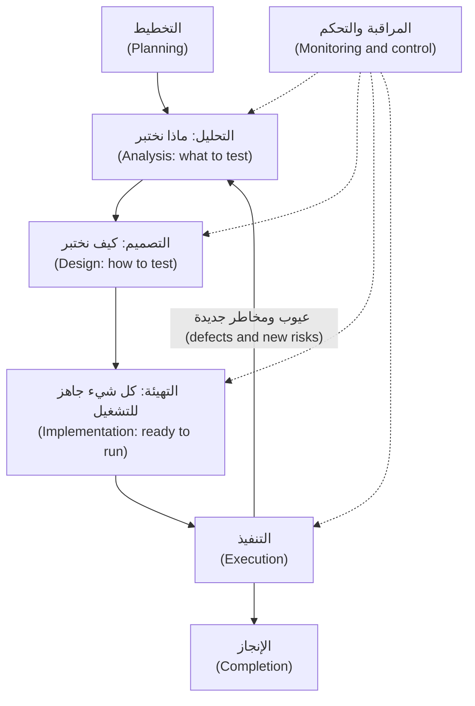
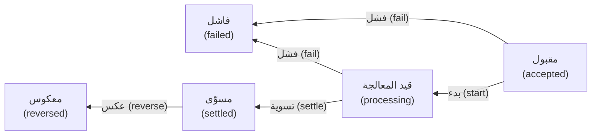
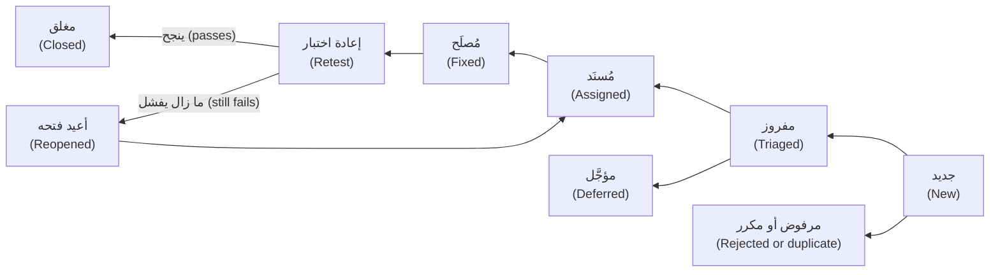

# الوحدة 1 — أسس الاختبار (Testing foundations)

*أخبرتك الوحدة 0 (Module 0) لماذا نختبر البرمجيات. وتمنحك هذه الوحدة عُدّة العمل (working kit) التي يحملها المختبِر (tester)، وهي ثلاثة أشياء ستمارسها كل يوم طوال مسيرتك المهنية. أولًا، العقلية والعملية (the mindset and the process): المبادئ السبعة (the seven principles)، والأنشطة التي يمر بها كل جهد اختبار (every test effort)، وكيف تقرر أنك اختبرت بما يكفي (tested enough). ثانيًا، تصميم الاختبار (test design): كيف تختار حفنة قليلة من الاختبارات تكشف العيوب (bugs) في فضاء هائل من المدخلات الممكنة (an astronomically large space of possible inputs). ثالثًا، التواصل (communication): كيف تقرأ المتطلب (requirement) قراءة ناقدة، وتحوّله إلى معايير قبول (acceptance criteria) وحالات اختبار (test cases)، وتكتب تقرير عيب (bug report) يستطيع المطوّر (developer) أن يتصرف بناءً عليه في دقائق. ستتابع ندى (Nada)، الخريجة الجديدة في فريق هندسة الجودة (Quality Engineering) في بنك نجم (Najm Bank)، وراشد (Rashid) يوجّهها خلال سقف التحويل اليومي (daily transfer limit) وقواعد الرسوم (fee rules) ودورة حياة التحويل (transfer lifecycle) وعيب صغير جدًا في الرسوم (one very small fee bug)، وكل ذلك على النظام النموذجي للدورة (the course's sample system). هذه التقنيات أقدم من أي أداة ذكاء اصطناعي (AI tool)، لكنها أصبحت أهم الآن، لأنها الطريقة التي تحكم بها هل يمكن لاختبار (test) كتبتَه أنت أو كتبه وكيل (agent) أن يفشل فعلًا (can actually fail).*

> **التركيز (Focus):** Mindset, Design — التفكير مثل المختبِر (thinking like a tester)، واختيار الاختبارات عن قصد (choosing tests on purpose)، والإبلاغ عمّا تجده كي يُصلَح (reporting what you find so that it gets fixed).

---

# 1.1 — عقلية المختبِر والمبادئ السبعة وعملية الاختبار (The tester's mindset, the seven principles and the test process)
*المستوى (Level): 🟢 مبتدئ (Beginner)* · *المتطلبات (Prerequisites): 0.1، 0.2* · *التركيز (Focus): Mindset*

## ⚡ الدرس في دقيقة (In 60 seconds)
- ينتج الاختبار (testing) **أدلة (evidence)**: ما الذي فحصته (what you checked)، وبمقارنته بماذا (against what)، وما الذي لم تفحصه (what you did not check).
- **الاختبار يُظهر وجود العيوب، لا غيابها أبدًا (Testing shows the presence of defects, never their absence)**، والاختبار الشامل (exhaustive testing) مستحيل. لذلك تختار اختباراتك بحسب المخاطر (by risk).
- **العقلية (mindset)** هي الفضول (curiosity) والتشكيك الصحي (healthy scepticism) والتواصل الواضح (clear communication) والتعاطف (empathy) والإبلاغ البنّاء (constructive reporting).
- لـ**عملية الاختبار (test process)** سبعة أنشطة متداخلة (seven overlapping activities). وكل اختبار يحتاج إلى **مرجع للنتيجة المتوقعة (oracle)**، أي مصدر موثوق للنتيجة المتوقعة (a trustworthy source of the expected result). لا مرجع، لا حكم (No oracle, no verdict).
- توقّف حين تصبح المخاطر المتبقية (remaining risk) مقبولة لدى من يملكها (the person who owns it)، وليس لمجرد أن «كل الاختبارات نجحت» (all the tests passed).

## 🧭 لماذا يهم (Why it matters)
في أسبوعها الأول في بنك نجم (Najm Bank)، تتسلّم ندى القصة (story) **TRF-212، سقف التحويل اليومي (the daily transfer limit)**. تفتح نسخة ضمان الجودة (QA build) من تطبيق نجم للهاتف (Najm Mobile)، وترسل أربعين تحويلًا بمبالغ مختلفة (forty transfers of different sizes)، وترى كل تحويل مقبولًا أو مرفوضًا بشكل معقول (accepted or rejected sensibly)، وتكتب في التذكرة (ticket): «تم الاختبار. يعمل.» ⁦(Tested. Works.)⁩

يطرح راشد أربعة أسئلة. *بماذا قارنتِ ما فحصتِه؟ ⁦(Against what did you check?)⁩ لو كان معطوبًا، فما الذي كنتِ سترينه مختلفًا؟ ⁦(If it were broken, what would you have seen differently?)⁩ ما الذي لم تجرّبيه؟ ⁦(What did you not try?)⁩ من الذي يقرر أننا انتهينا؟ ⁦(Who decides that we are done?)⁩* لا تستطيع ندى الإجابة عن أي منها. [النظام النموذجي للدورة (The course's sample system)](https://github.com/Tamoura/system-design-for-vibe-coders/tree/main/testing/sample) يخفي عيبًا في هذا الموضع تحديدًا: فعّل `limit_off_by_one` وسيُرفض خطأً أي تحويل يجعل إجمالي اليوم مساويًا للسقف تمامًا (exactly the limit). أربعون تحويلًا اعتياديًا (forty typical transfers) لا تلمس هذا العيب أبدًا. أما عميل يرسل آخر 1,000 QAR من حدّه المسموح (allowance) فسيصطدم به.

ندى ليست مهملة. لم يخبرها أحد أن الاختبار مسألة قرار (a decision problem): مع اختبارات ممكنة بلا حدود (unlimited possible tests) ووقت محدود (limited time)، فأيَّ قلّة منها تشغّل، وماذا تُثبت؟ ⁦(which few do you run, and what do they prove?)⁩ هذه الأسئلة الأربعة هي موضوع هذا الدرس، وهي في عصر الذكاء الاصطناعي (AI era) أهم: فالوكيل (agent) يستطيع أن يكتب قاعدة واختباراتها معًا ويعيد تشغيلًا أخضر (green run) في ثوانٍ.

## 📐 كيف يعمل (How it works)

### 🟢 الأساسيات (The essentials)

**المصطلحات (Vocabulary)** (من الدرس 0.2). **الخطأ البشري (error)** الذي يرتكبه شخص يترك **عيبًا (defect, bug)** في الشيفرة أو في مستند (in code or a document)، وقد يتسبب في **فشل (failure)**. يستثير الاختبار الديناميكي (dynamic testing) حالات الفشل، ويجد الاختبار الساكن (static testing) العيوب مباشرة (directly)، ويزيل تنقيح الأخطاء (debugging) العيب الكامن وراء الفشل.

**مبادئ الاختبار السبعة (The seven testing principles)** مأخوذة من منهج المستوى التأسيسي (Foundation syllabus) الصادر عن ISTQB (CTFL v4.0). نعرضها بكلمات بسيطة (in plain words)، ولكل منها مثال من بنك نجم (a Najm example):

1. **الاختبار يُظهر وجود العيوب لا غيابها (Testing shows the presence of defects, not their absence).** تخفّض الاختبارات الناجحة (passing tests) احتمال بقاء العيوب (the odds that bugs remain) لكنها لا تبلغ به الصفر أبدًا (never to zero). *تنجح مجموعة الاختبارات الابتدائية المؤلفة من 24 اختبارًا (the 24-test starter suite) نظيفةً، ومع ذلك يفلت ثلاثة من أصل خمسة عيوب مزروعة في التحويلات (the sample's five seeded transfer bugs) في النظام النموذجي.*
2. **الاختبار الشامل مستحيل (Exhaustive testing is impossible).** المدخلات والحالات والتوقيتات (inputs, states and timings) تتضاعف أسرع مما تستطيع أي آلة تشغيله. *في تحويلات QAR وحدها: 2,499,901 مبلغًا × 5,000,001 إجمالي «مرسَل اليوم» (sent today) × 3 أنواع (kinds) تعطي نحو 3.75 × 10^13 توليفة (combinations).*
3. **الاختبار المبكر يوفّر الوقت والمال (Early testing saves time and money).** ابدأ حين يوجد أي شيء تفحصه، ولو جملة واحدة (even a sentence). *سؤال «ما الذي يُعدّ يومًا؟» ⁦(what counts as a day?)⁩ في مراجعة القصة (story review) يكلّف حوارًا؛ وبعد الإطلاق (after launch) يكلّف إصلاحًا عاجلًا (a hotfix).*
4. **العيوب تتجمّع (Defects cluster).** عدد قليل من المكوّنات (components) يحتوي معظم العيوب. *عيوب التحويلات (Transfers) تشير مرارًا إلى التقريب والتعامل مع الوقت (rounding and time handling)، لذا يضع راشد اختبارات إضافية هناك.*
5. **الاختبارات تبلى (Tests wear out)** (مفارقة المبيد الحشري، the pesticide paradox). الاختبارات نفسها حين تُشغَّل مرة بعد مرة (run again and again) تتوقف عن إيجاد عيوب جديدة (stop finding new defects). *مجموعة من المبالغ المتوسطة (mid-range amounts) تبقى خضراء (stays green) بينما ينتظر عيب حدّي (a boundary bug).*
6. **الاختبار يعتمد على السياق (Testing is context dependent).** ما تختبره ومدى عمقه يتوقفان على ما قد يسوء ولمن (what can go wrong and for whom). *تحتاج المدفوعات (Payments) إلى كسور عشرية دقيقة ومسار تدقيق (exact decimals and an audit trail)؛ أما لافتة تسويقية (a marketing banner) فيكفيها فحص خفيف (a light check).*
7. **وهم خلو النظام من العيوب (Absence of defects is a fallacy).** النظام الذي لا عيوب معروفة فيه (A system with no known bugs) قد يظل النظام الخطأ (the wrong one). *شاشة تحويل بلا عيب لكنها لا تستطيع جدولة دفعة يوم الراتب (schedule a salary-day payment) تظل تخذل العملاء.*

**عقلية المختبِر (The tester's mindset)** خمس عادات (five habits):
- **الفضول (Curiosity):** اسأل «ماذا لو؟» من تلقاء نفسك ⁦(what if?)⁩ عن الأرقام الهندية العربية (Arabic-Indic digits)، والنقر المزدوج (the double-click)، واليوم الكبيس (the leap day).
- **التشكيك الصحي (Healthy scepticism):** لا تقبل عبارة «إنه يعمل» (it works) من عرض تجريبي (a demo) أو مطوّر أو وكيل ذكاء اصطناعي (an AI agent). أنت تشكّك في الادعاءات لا في الأشخاص، وفي اختبارك أنت أيضًا: فقد صدّقت ندى عيّناتها الأربعين (her forty samples).
- **التواصل (Communication):** أنت تحمل الأخبار السيئة (bad news). عبارة «يُرفض مبلغ 1,000.00 QAR بالضبط بعد إرسال 49,000.00» (Exactly 1,000.00 QAR is rejected after 49,000.00 sent) تصل؛ أما «شيفرة السقف عندك معطوبة» (your limit code is broken) فلا تصل.
- **التعاطف (Empathy):** مع العميل الذي يصطدم بالخطأ يوم الراتب (salary day)، ومع المطوّر الذي يقرأ تقريرك (the developer reading your report).
- **الإبلاغ البنّاء عن العيوب (Constructive defect reporting):** ما رأيته، وما توقعته ولماذا، مع الأدلة (with evidence) (الدرس 1.3).

**عملية الاختبار (The test process).** يتبع العمل سبعة أنشطة (seven activities). وهي تتداخل وتتكرر (overlap and loop).



القصة (The story): *«بصفتي عميلًا (As a customer)، أريد سقفًا يوميًا (a daily limit) حتى لا يستطيع هاتف مسروق أو زلّة كتابة (a stolen phone or a typing slip) أن تحرّك أكثر من 50,000 QAR أو AED، أو 10,000 EUR، في اليوم.»* ومعيار القبول الأول (first acceptance criterion) فيها: *«تُرفض التحويلات التي تتجاوز السقف اليومي برسالة واضحة (Transfers above the daily limit are rejected with a clear message)»*.

| النشاط (Activity) | مثال TRF-212 (TRF-212 example) |
|---|---|
| **التخطيط (Planning)** | المخاطر عالية لأن الأمر يتعلق بالمال (Risk is high). نختبر على مستوى المكوّن وواجهة البرمجة (component and API level). معيار الخروج (Exit): لا عيب حرجًا مفتوحًا، والشروط الخطرة مغطاة (risky conditions covered) |
| **التحليل (Analysis)** | قراءة القصة ونص سياسة `limits` والشيفرة؛ ومراجعة القصة (review the story)؛ وسرد شروط الاختبار (list test conditions) |
| **التصميم (Design)** | تحويل الشروط إلى حالات اختبار (cases) مع البيانات والنتائج المتوقعة (data and expected results) |
| **التهيئة (Implementation)** | كتابة اختبارات pytest، وتجهيز بيانات «المرسَل اليوم» ("sent today" data)، وربطها بالتكامل المستمر (continuous integration, CI) |
| **التنفيذ (Execution)** | التشغيل ومقارنة الفعلي بالمتوقع (compare actual with expected)، ورفع العيوب (raise defects)، وإعادة اختبار الإصلاحات (retest fixes) |
| **المراقبة والتحكم (Monitoring and control)** | «شُغّلت خمس حالات من سبع، وفشلت واحدة» (Five of seven cases run, one failed). الإجراء: إضافة حالة، أو نقل تاريخ، أو التصعيد (escalate) |
| **الإنجاز (Completion)** | الاحتفاظ بالحالات اختبارات انحدار (regression tests)، وتسجيل الأسئلة المفتوحة (log open questions)، وكتابة التقرير (write the report) |

### 🟡 التعمق أكثر (Going deeper)

**مثال محلول (Worked example): TRF-212.** *التحليل: راجع القصة قبل تشغيل أي شيفرة (Analysis: review the story before any code runs).* هذا هو **الاختبار الساكن (static testing)**: فحص ناتج عمل (work product) دون تنفيذه (without executing it). يقرأ راشد عبارة «فوق السقف اليومي» (above the daily limit) ويسأل: (1) فوقه أم عنده تمامًا (Above, or at)؟ هل يُسمح بـ 50,000.00 بالضبط (exactly 50,000.00 allowed)؟ (2) ما اليوم: منتصف ليل قطر أم 24 ساعة متحركة (Qatar midnight, or a rolling 24 hours)؟ (3) لكل عملة أم مجتمعة (Per currency or combined)؟ (4) هل تُحتسب التحويلات بين حسابات العميل نفسه (own-account transfers)؟ (5) هل تُحتسب المحاولات المرفوضة (rejected attempts)؟ (6) ما «الرسالة الواضحة» (clear message) وبأي لغة (in which language)؟ تُظهر الشيفرة إجابات اليوم (today's answers) عن 1 و3 إلى 5 (يُسمح بـ 50,000.00 بالضبط؛ والإجماليات تُحسب لكل مستخدم وعملة (per user and currency)، وتشمل كل الأنواع (every kind)، وتحتسب التحويلات المقبولة فقط (accepted transfers only))، لكن فريق المنتج (product) وحده يستطيع القول إن ذلك هو المقصود (intended). ولا تستطيع الشيفرة الإجابة عن 2، لأن إجماليها الجاري لا يُصفَّر أبدًا (its running total is never reset)، ولا عن 6، لأنها لا تعيد سوى الرمز المجرّد (the bare code) `daily_limit_exceeded`. ستة أسئلة، ولم يُشغَّل أي اختبار (Six questions, no test run).

*التصميم والتنفيذ (Design and execution).* تأتي النتائج المتوقعة (expected results) من نص سياسة `limits` لا من الشيفرة. شغّلنا الحالات على النظام النموذجي النظيف (the clean sample)، ثم مع `NAJM_BUGS=limit_off_by_one`:

| الحالة (Case) | المبلغ (Amount) | المرسَل اليوم (Sent today) | المتوقع (Expected) | مع تفعيل العيب (Bug on) |
|---|---|---|---|---|
| TC-1 | QAR 1,000.00 | 0.00 | مقبول (accepted) | مقبول (accepted) |
| TC-2 | QAR 5,000.00 | 49,000.00 | مرفوض (rejected) | مرفوض (rejected) |
| TC-3 | QAR 1,000.00 | 49,000.00 | مقبول (accepted)، الإجمالي 50,000.00 بالضبط (total exactly 50,000.00) | **مرفوض (rejected)** |
| TC-4 | QAR 1,000.01 | 49,000.00 | مرفوض (rejected) | مرفوض (rejected) |
| TC-5 | EUR 5,000.00 | 5,000.00 | مقبول (accepted)، الإجمالي 10,000.00 بالضبط (total exactly 10,000.00) | **مرفوض (rejected)** |
| TC-6 | EUR 5,000.00 | 6,000.00 | مرفوض (rejected) | مرفوض (rejected) |

حدس ندى (Nada's instinct) أنتج TC-1 وTC-2 وTC-6. وهذه تنجح على النظام المعطوب كما تنجح على النظام الصحيح، فلا تستطيع التمييز بينهما. والحالتان اللتان *يبلغ* فيهما الإجمالي السقف (meets the limit) هما وحدهما القادرتان على ذلك: اختبار ينجح مهما فعلت الشيفرة (passes whatever the code does)، مقابل اختبار يستطيع أن يفشل (one that can fail). وفي *المراقبة والتحكم (monitoring and control)* تبلّغ ندى «شُغّلت ست حالات، وفشلت اثنتان، ورُفع عيب» (six run, two failed, defect raised) ويضيف راشد زوج AED. وفي *الإنجاز (completion)* تتحول الحالات إلى اختبارات انحدار (regression tests) ويُسجَّل سؤال «ما اليوم؟» ⁦(what is a day?)⁩ ثغرةً معروفة (a known gap). ويجد الدرس 1.2 حالات مثل TC-3 عن قصد (on purpose).

**مستويات الاختبار وأنواعه (Test levels and test types).** يخبرك **المستوى (level)** بمقدار ما هو قيد الاختبار: **المكوّن (component)**، أو **تكامل المكوّنات (component integration)**، أو **النظام (system)**، أو **تكامل الأنظمة (system integration)**، أو **القبول (acceptance)**. ويخبرك **النوع (type)** بما تفحصه: **الوظيفي (functional)** (هل هو الشيء الصحيح؟ ⁦(the right thing?)⁩) أو **غير الوظيفي (non-functional)** (إلى أي درجة يؤدي جيدًا: الأداء (performance) والأمان (security) وسهولة الاستخدام (usability)). وتُشتق الاختبارات **من الصندوق الأسود (black-box)** انطلاقًا من المواصفات (specifications)، أو **من الصندوق الأبيض (white-box)** انطلاقًا من بنية الشيفرة (code structure). وبعد أي تغيير أضف **الاختبار التأكيدي (confirmation testing)** (هل أُصلح؟ ⁦(is it fixed?)⁩) و**اختبار الانحدار (regression testing)** (هل انكسر شيء آخر؟ ⁦(did anything else break?)⁩).

| المستوى (Level) | مثال وظيفي (Functional example) | مثال غير وظيفي (Non-functional example) |
|---|---|---|
| المكوّن (Component) | تقبل `check_transfer` إجمالي 50,000.00 بالضبط (accepts a total of exactly 50,000.00) | قياس أداء مصغّر (A micro-benchmark) يُبقي `check_transfer` سريعة |
| تكامل المكوّنات (Component integration) | تمرّر `TransferService` قيمة «المرسَل اليوم» الصحيحة لكل مستخدم (passes the right "sent today" per user) | المهلة (Timeout) حين يكون مخزن الحدود بطيئًا (when the limits store is slow) |
| النظام (System) | يرفض `POST /transfers` التحويل الذي يتجاوز السقف (rejects the transfer that crosses the limit) | زمن الاستجابة تحت الحِمل (Response time under load) (الدرس 4.1) |
| تكامل الأنظمة (System integration) | تتفق خدمة المدفوعات وشبكة البطاقات على المبلغ (Payments service and card network agree on the amount) | السلوك عند انقطاع الشبكة (Behaviour when the network is down) |
| القبول (Acceptance) | يؤكد فريق الامتثال أن الحدود تطابق السياسة (Compliance confirms the limits match policy) | يفهم العميل رسالة الخطأ العربية (A customer understands the Arabic error) |

**الساكن مقابل الديناميكي (Static versus dynamic).** الاختبار **الديناميكي (Dynamic)** يشغّل البرمجية. أما الاختبار **الساكن (Static)** فيفحصها دون تشغيلها: المراجعات (reviews) وأدوات **التحليل الساكن (static analysis)**، وهي اختبارات رخيصة (cheap tests). قد يكتب مطوّر متعب، أو مساعد ذكاء اصطناعي (AI assistant)، هذه المسودة (draft):

```python
from decimal import Decimal


def international_fee(amount: Decimal) -> Decimal:
    return amount * 0.0035


def describe(amount: Decimal) -> str:
    total = amount + internatonal_fee(amount)
    return "Total: " + total
```

```text
$ pip install ruff mypy
$ mypy fee_draft.py
fee_draft.py:5: error: Unsupported operand types for * ("Decimal" and "float")  [operator]
fee_draft.py:9: error: Name "internatonal_fee" is not defined; did you mean "international_fee"?  [name-defined]
Found 2 errors in 1 file (checked 1 source file)
```

تختلف الصياغة الدقيقة بحسب إصدار mypy (Exact wording varies by mypy version). ويشير الأمر `ruff check fee_draft.py` أيضًا إلى الاسم المكتوب خطأً (the misspelt name)، وبعد أن تصلحه يبلّغ mypy عن عيب ثالث: جمع سلسلة نصية (a string) مع `Decimal`. في ثوانٍ، ودون كتابة أي اختبار، وجدنا خطأً إملائيًا (a typo)، وعددًا عشريًا ثنائيًا (a binary float) حيث يحتاج المال إلى عدد عشري دقيق (a decimal) (وهو الخطأ وراء عيب `float_fee` في النظام النموذجي)، وخطأً في الأنواع (a type error). لا يستطيع التحليل الساكن أن يقول هل الرسم هو المبلغ *الصحيح* (the right amount). استخدم النوعين من الاختبار: فهما يجدان عيوبًا مختلفة (different defects).

**مراجع النتيجة المتوقعة: من أين يأتي «المتوقع» (Oracles: where "expected" comes from).** للاختبار مُدخَل (an input)، و**مرجع (oracle)** يزوّد بالنتيجة المتوقعة، و**حكم (verdict)** ينتج من مقارنة المتوقع بالفعلي (comparing expected with actual). هذا أصغر مثال مفيد بـ pytest؛ احفظه باسم `tests/test_oracle_demo.py` في نسخة من النظام النموذجي (a copy of the sample):

```python
from decimal import Decimal

from najm.transfers import fee


def test_international_fee_on_3090_qar():
    actual = fee("3090", "QAR", "international")
    expected = Decimal("10.82")   # the oracle: 3,090 x 0.35 % = 10.815, rounded half up
    assert actual == expected     # the verdict: pass if equal, fail if not


def test_a_test_with_no_oracle():
    assert fee("3090", "QAR", "international")   # weak: any non-zero fee passes
```

يشغّل pytest كل دالة اسمها `test_...`؛ وفشل التأكيد `assert` فشلٌ للاختبار (a failure). ينجح الاختباران كلاهما على النظام النموذجي النظيف (the clean sample). ومع تفعيل العيب (With the bug on) (المخرجات مختصرة، output trimmed):

```text
$ NAJM_BUGS=float_fee pytest tests/test_oracle_demo.py
F.                                                                       [100%]
E       AssertionError: assert Decimal('10.81') == Decimal('10.82')
FAILED tests/test_oracle_demo.py::test_international_fee_on_3090_qar
1 failed, 1 passed
```

الاختبار الثاني أخضر على النظام الصحيح وعلى النظام المعطوب معًا. ولمراجع النتيجة المتوقعة نقاط قوة متفاوتة (Oracles have strengths). فـ**المواصفة (specification)** أو الحساب المستقل (independent calculation) (تقول السياسة 0.35 %، بالتقريب إلى الأعلى عند المنتصف (half-up)، فالنتيجة 10.82) تكشف `float_fee`. أما **المرجع الجزئي (partial oracle)**، وهو خاصية يجب أن تتحقق (a property that must hold) («الرسم يقع دائمًا بين 10.00 و100.00»، the fee is always between 10.00 and 100.00)، فلا يكشفه، لأن 10.81 ضمن النطاق (in range). وهو رخيص حين لا توجد إجابة دقيقة (no exact answer exists)، لكنه يكشف عيوبًا أقل. أما رسالة «تُقرأ بوضوح» (reads clearly) فالمرجع فيها إنسان (a human).

### 🔴 نظرة الخبير (Expert view)

**مشكلة المرجع (The oracle problem).** المرجع في `fee` هو سياسة وآلة حاسبة (a policy and a calculator). وغالبًا يكون الأمر أصعب: ما المخرج الصحيح لترتيب نتائج البحث (a search ranking) أو لترجمة (a translation)؟ أن لا تعرف النتيجة المتوقعة (Not knowing the expected result) هو **مشكلة المرجع (the oracle problem)**. وهي لا تزول أبدًا؛ بل تعود بقوة في الوحدة 7، لأن النموذج اللغوي الكبير (LLM) لا يملك إجابة صحيحة واحدة (no single correct answer). اسأل النموذج البديل (stand-in model) الخاص بنجم أسيست (Najm Assist) سؤالًا واحدًا أربع مرات، مع تفعيل أخذ العينات (with sampling on):

```python
from najm.assist import answer, FakeModel

q = "What is the cut-off time for same-day transfers?"
for seed in range(1, 5):
    print(answer(q, FakeModel(temperature=0.8, seed=seed))["text"])
```

تعود جملة السياسة نفسها، تبدأ أحيانًا بعبارة «According to our policy:» وأحيانًا لا تبدأ بها. الوقائع نفسها لكن السلاسل النصية مختلفة (Same facts, different strings): فيرفض التأكيد `assert` القائم على المطابقة التامة (an exact-match) إجابةً صحيحة (a correct answer). ستحتاج إلى مقيِّمات (graders) تحكم على المعنى (judge meaning) (الدرس 7.1).

هناك فخ مرتبط بالشيفرة التي يكتبها الذكاء الاصطناعي (AI-written code). فإذا كتب وكيلٌ (agent) الدالة `check_transfer` واختبارها معًا، فقد تكون القيمة «المتوقعة» مجرد ما أعادته الشيفرة: **مرجع دائري (circular oracle)**. يظل ينجح حين تكون الشيفرة خاطئة. خذ المرجع من مصدر مستقل (independent). يبني [*تصميم الأنظمة لمبرمجي الفايب (System Design for Vibe Coders)*، الدرس 9.4 — التحقق قبل الإكمال (Verification before completion)](../vibe/index.ar.html#l9-4) عادة ألا تقبل «تم» (done) من دون دليل رأيتَه يفشل (evidence you have seen fail).

**متى تتوقف عن الاختبار (When to stop testing).** لا ينتهي الاختبار أبدًا؛ فهناك من يقرر أن المخاطر المتبقية (the remaining risk) مقبولة، ويجعل المختبِر هذا القرار قرارًا مستنيرًا (informed). والأسباب الوجيهة للتوقف قائمة على المخاطر وعلى الأدلة (risk-based and evidence-based): استيفاء معايير الخروج (the exit criteria are met)، وتغطية الشروط الخطرة (the risky conditions are covered)، وكون العيوب المفتوحة معروفة (open defects are known) ومقبولة كتابةً (accepted in writing) من مالك الإصدار (release owner). ونفاد الوقت سبب مشروع أيضًا (Running out of time is valid too)، إذا أبلغتَ بما لم يُختبر (what is untested) ومن قبِل بذلك. وعبارة «نجحت كل الاختبارات» (All tests passed) لا تقول شيئًا عن اختبارات لم تكتبها. مثال: «أوصي بعدم إطلاق الإصدار: فحص السقف غير مختبَر عند حدّه، ويستطيع عميل أن يصطدم به في اليوم الأول» (I recommend we do not release: the limit check is untested at its boundary, and a customer can hit it on day one).

## 🧰 الأدوات (The toolkit)
| الأداة أو الممارسة أو التقنية (Tool, practice or technique) | ما هي وماذا تفعل (What it is and does) | متى تلجأ إليها (When to reach for it) |
|---|---|---|
| **Seven testing principles** (ISTQB) | مبادئ الاختبار السبعة: سبع عبارات عن سبب عمل الاختبار على هذا النحو (Seven statements about why testing works as it does) | لتحدّي عبارة «تم الاختبار، يعمل» (tested, works) وتقدير حجم الجهد (size the effort) |
| **Requirement review** | مراجعة المتطلبات: قراءة القصة بحثًا عن الغموض والثغرات (ambiguity and gaps) قبل وجود الشيفرة | كل قصة، قبل التطوير (Every story, before development) |
| **Static analysis** (ruff, mypy) | التحليل الساكن: أدوات الفحص (linters) ومدققات الأنواع (type checkers) التي تجد العيوب دون تشغيل الشيفرة | كل إيداع (every commit)، في التكامل المستمر (in CI)، وعلى الشيفرة التي يكتبها الذكاء الاصطناعي (on AI-written code) |
| **Test oracle** | مرجع النتيجة المتوقعة: المصدر الموثوق للنتيجة المتوقعة (The trusted source of the expected result) | قبل أي اختبار: لا مرجع، لا حكم (no oracle, no verdict) |
| **Exit criteria** | معايير الخروج: شروط متفق عليها (Agreed conditions) تقول إن الاختبار كافٍ (testing is good enough) | في الخطة (In the plan)، كي يكون لسؤال «هل انتهينا؟» ⁦(are we done?)⁩ جواب |
| **pytest** | مشغّل اختبارات Python القياسي (The standard Python test runner): `assert` عادي (plain)، وتجهيزات الاختبار (fixtures)، والاختبارات المُحدَّدة بمعاملات (parametrisation) | اختبارات الوحدة وواجهات البرمجة (Unit and API tests)، وكل الأمثلة هنا |

## 🏛️ عمليًا في بنك نجم (In practice at Najm Bank)
يطلب راشد من كل فريق (squad) **بطاقة عملية الاختبار (test-process card)** لكل قصة: صفحة واحدة تثبت أن التفكير حدث (proving the thinking happened). وهذه بطاقة TRF-212.

| الحقل (Field) | TRF-212، سقف التحويل اليومي (daily transfer limit) |
|---|---|
| المخاطر والأساس (Risk and basis) | عالية (High): أموال العملاء (customer money) واهتمام الجهة التنظيمية (regulator interest). الأساس (Basis): القصة ونص سياسة `limits` و`najm/transfers.py` |
| مراجعة القصة (Story review) | 6 أسئلة: 2 منها لا تستطيع الشيفرة الإجابة عنها («اليوم» (day) والرسالة (the message))، و4 سلوكيات تحتاج إلى تأكيد (4 behaviours to confirm) |
| الشروط والمرجع (Conditions and oracle) | عند السقف بالضبط (Exactly at the limit)؛ وسنت واحد فوقه (one cent over)؛ ولكل عملة (per currency). القيم المتوقعة من نص السياسة والإجماليات المحسوبة يدويًا (hand-calculated totals)، وليس من مخرجات الشيفرة أبدًا |
| معايير الخروج (Exit criteria) | تشغيل كل الشروط؛ ولا عيب حرجًا أو رئيسيًا مفتوحًا (no open critical or major defect)؛ وإجابة الأسئلة المفتوحة أو قبولها كتابةً (answered or accepted in writing) |
| المخاطر المتبقية (Residual risk) | «إعادة ضبط اليوم غير مختبَرة لأنها غير معرَّفة» (Day reset untested because undefined)، وقد قبلها مالك المنتج (product owner) في تاريخ مذكور (on a stated date) |

## 🛠️ التمارين (Exercises)
انسخ النظام النموذجي أولًا (Copy the sample first) (`cp -r testing/sample ~/najm-sample`)، وأنشئ بيئة افتراضية (virtual environment) هناك ونفّذ `pip install -r requirements.txt`.

- 🟢 **راجع المتطلب (Review the requirement).** خذ عبارة «تُرفض التحويلات التي تتجاوز السقف اليومي برسالة واضحة» (Transfers above the daily limit are rejected with a clear message). اكتب ثمانية أسئلة على الأقل لفريق المنتج (at least eight questions for product)، ولكل سؤال إجابة مقترحة (a proposed answer) ومن ينبغي أن يقرر (who should decide). *يكتمل عندما (Done when):* تغطي القائمة «اليوم» (day)، وكل عملة على حدة أو مجتمعة (per currency or combined)، وأي الأنواع تُحتسب (which kinds count)، وحالة السقف بالضبط (exactly-at-limit)، والمحاولات المرفوضة (rejected attempts)، والرسالة؛ وتستشهد إجابتان على الأقل بالدالة أو الطريقة (function or method) في `najm/transfers.py` التي تحسم الأمر؛ وتُعلَّم واحدة منها قرارًا للمنتج لا تستطيع الشيفرة حسمه (a product decision the code cannot settle).
- 🟡 **مرجع واحد لكل دالة (One oracle per function).** لكل من `quantize` و`fee` و`check_transfer` و`value_date`، اكتب اختبار pytest واحدًا تأتي قيمته المتوقعة من خارج الشيفرة (expected value comes from outside the code) (نص سياسة في `najm/assist.py`، أو حساب يدوي (a hand calculation)، أو خاصية (a property)). شغّل المجموعة نظيفة (Run the suite clean)، ثم مع `NAJM_BUGS=float_fee` و`NAJM_BUGS=tz_cutoff`. *يكتمل عندما (Done when):* تنجح الاختبارات الأربعة جميعها على النسخة النظيفة؛ ويفشل اثنان منها على الأقل تحت العيب المناسب (under the right bug) مع ظهور المتوقع والفعلي (expected and actual visible)؛ ويعرض جدول نوع المرجع لكل اختبار (each test's oracle type) وعيبًا واحدًا لا يستطيع كشفه أبدًا (one bug it could never catch).
- 🔴 **تقرير إنجاز (A completion report).** شغّل مجموعة الاختبارات الابتدائية (starter suite) (`pytest`) خمس مرات، مرة لكل قيمة من قيم `NAJM_BUGS`، وسجّل الاختبارات التي تفشل. اكتب تقرير إنجاز (completion report) من صفحة واحدة. *يكتمل عندما (Done when):* يتضمن جدولًا من خمسة صفوف بنتائج مقيسة (measured results)، ويسمّي ثلاث مخاطر متبقية (three residual risks) بوصفها أثرًا على العملاء (customer impact)، ويوصي بالإصدار أو بعدمه مع الأدلة وما الذي سيغيّر رأيك (what would change your mind)، ويقترح الاختبارات الثلاثة التالية بحسب المخاطر (by risk)، لكل منها مرجعه (its oracle).

## ⚠️ أخطاء وفخاخ (Mistakes and traps)
- **«تم الاختبار. يعمل.» ⁦(Tested. Works.)⁩** قل ما الذي فحصته، وبمقارنته بماذا، وما الذي لم تفحصه (what you checked, against what, and what you did not).
- **اعتبار اللون الأخضر برهانًا (Treating green as proof).** الأخضر دليل فقط إذا كان الاختبار قادرًا على الفشل (could have failed). اسأل: أي عيب يحوّل هذا الاختبار إلى أحمر؟ ⁦(which bug turns this red?)⁩
- **نسخ القيم المتوقعة من المخرجات (Expected values copied from the output).** يعيد الاختبار صياغة الشيفرة (restates the code). خذ التوقعات من مواصفة (specification) أو حساب (calculation) أو شخص (a person).
- **اختبار ما بنيتَه فقط (Testing only what you built).** المؤلفون يؤكدون نيّتهم هم (confirm their own intent)؛ اطلب من شخص آخر أن يهاجمه (attack it).
- **العملية بوصفها أعمالًا ورقية (Process as paperwork).** الأنشطة السبعة طريقة تفكير (a way to think). يحتاج نص برمجي مؤقت (a throwaway script) إلى دقيقة، وتحتاج المدفوعات (Payments) إلى خطة قابلة للتدقيق (an auditable plan)؛ فقِس الجهد على المخاطر (scale to the risk).

## 🧾 الخلاصة (Recap)
- ينتج الاختبار أدلة لا ضمانات (evidence, not guarantees): يُظهر وجود العيوب، ولا يمكن أن يكون شاملًا (cannot be exhaustive)، ويُختار بحسب المخاطر والسياق (by risk and context).
- تشمل العقلية الشك في اختبارك أنت (doubting your own testing)؛ والأنشطة السبعة تتداخل وتتكرر (overlap and loop).
- المستويات (levels) (كم) والأنواع (types) (ماذا) محوران مختلفان (different axes)؛ والاختبار الساكن (static testing) يجد العيوب قبل أن يعمل أي شيء.
- لا مرجع، لا حكم (No oracle, no verdict). المرجع الدائري (circular oracle) يجعل الاختبارات التي يكتبها الذكاء الاصطناعي عديمة القيمة (worthless)؛ وتتفاقم مشكلة المرجع (the oracle problem) مع أنظمة الذكاء الاصطناعي (AI systems).
- التوقف قرار مخاطر (a risk decision) يملكه شخص مسؤول (someone accountable)، ويستنير بأدلتك (informed by your evidence).

## ✍️ اختبر نفسك (Check yourself)

**1. أرسل نص ندى البرمجي (Nada's script) 1,000 تحويل عشوائي (random transfers) إلى نسخة ضمان الجودة (QA build)؛ فتصرّفت كلها كما هو متوقع، وأبلغت ندى «لا عيوب في السقف اليومي» (no defects in the daily limit). أي مبدأ (principle) يبيّن أن التقرير يبالغ (overreaches)؟**

- A. الاختبار الشامل مستحيل (Exhaustive testing is impossible)، لذا لا يستحق أي اختبار أن يُشغَّل (no test is worth running)
- B. الاختبار يُظهر وجود العيوب لا غيابها (Testing shows the presence of defects, not their absence)
- C. الاختبار المبكر يوفّر الوقت والمال (Early testing saves time and money) في كل مشروع (on every project)
- D. العيوب تتجمّع (Defects cluster)، لذا تحتوي الشيفرة القديمة العيوب دائمًا (old code always holds the bugs)

<details><summary>الإجابة</summary>

**B.** الاختبارات الناجحة لا تثبت أبدًا خلو الشيفرة من العيوب (never prove there are no defects)، والمدخلات العشوائية نادرًا ما تصيب حالة السقف بالضبط (the exact-limit case). يسيء A فهم المبدأ 2: فهو يتعلق باختيار الاختبارات (choosing tests). (🟢 الأساسيات، The essentials).

</details>

**2. يكتب بلال اختبارات pytest لـ TRF-212، ويجهّز حسابات ضمان الجودة الاصطناعية (synthetic QA accounts)، ويربط المجموعة بالتكامل المستمر (CI). أي نشاط من أنشطة عملية الاختبار (test process activity) هذا؟**

- A. التحليل (Analysis)، لأنه يقرر ما الذي يحتاج إلى اختبار (which things need to be tested)
- B. التصميم (Design)، لأنه يحدد النتائج المتوقعة (working out the expected results)
- C. التنفيذ (Execution)، لأن المجموعة المكتملة ستعمل في التكامل المستمر (CI)
- D. التهيئة (Implementation)، لأنه يجهّز كل شيء للتشغيل (preparing everything to run)

<details><summary>الإجابة</summary>

**D.** تجهّز التهيئة (Implementation) ما يحتاجه التنفيذ (execution needs): الاختبارات والبيانات والبيئة (tests, data, environment). التحليل والتصميم يأتيان قبلها (come earlier)؛ والتنفيذ يشغّل الاختبارات المجهّزة (the prepared tests). (🟢 الأساسيات، The essentials).

</details>

**3. يكتب مساعد ذكاء اصطناعي (AI assistant) الدالة `check_transfer` واختباراتها، فيشغّل الشيفرة ويلصق كل مخرَج (output) في `assert`. تنجح كل الاختبارات. ما نقطة الضعف الرئيسية (the main weakness)؟**

- A. القيم المتوقعة جاءت من الشيفرة نفسها (came from the code)، وهذا مرجع دائري (a circular oracle)
- B. النجاح بهذه السرعة يعني أن الاختبارات لم تُشغَّل كما ينبغي (not run properly)
- C. مدقق الأنواع (type checker) كان سيرفض الشيفرة حتمًا (certainly)
- D. الاختبارات المُحدَّدة بمعاملات (Parametrised tests) أضعف دائمًا من دوال الاختبار المنفصلة (separate test functions)

<details><summary>الإجابة</summary>

**A.** التوقعات المنسوخة من مخرجات الشيفرة نفسها (Expectations copied from the code's own output) تنجح حتى لو كانت الشيفرة خاطئة (even when the code is wrong)؛ ويجب أن يكون المرجع (oracle) مستقلًا (independent). السرعة (speed) والأنواع (typing) وتنظيم الاختبارات (test layout) لا علاقة لها بذلك (unrelated). (🔴 نظرة الخبير، Expert view).

</details>

**4. قبل أن يوجد أي اختبار وحدة (unit test)، يبلّغ `mypy` أن دالة رسوم (a fee function) تضرب `Decimal` في `float`. أي نوع من الاختبار (kind of testing) وجد هذا العيب (defect)؟**

- A. الاختبار الديناميكي (Dynamic testing)، لأن أداة نُفّذت لإيجاده
- B. اختبار الانحدار (Regression testing)، لأنه يفحص شيفرة موجودة أصلًا
- C. الاختبار الساكن (Static testing)، لأن الشيفرة فُحصت دون تشغيلها
- D. اختبار القبول (Acceptance testing)، لأن النتيجة ستمنع الإصدار (block a release)

<details><summary>الإجابة</summary>

**C.** يفحص الاختبار الساكن نواتج العمل (work products) مثل الشيفرة المصدرية (source code) دون تنفيذها؛ وأدوات الفحص (linters) ومدققات الأنواع (type checkers) تحليل ساكن (static analysis). أما الانحدار والقبول فيصفان الغاية والمستوى (purpose and level). (🟡 التعمق أكثر، Going deeper).

</details>

**5. في يوم الخميس (Thursday) تنجح كل اختبارات TRF-212 المخطط لها (every planned TRF-212 test passes)، ويبقى عيب رئيسي واحد (one major defect) مفتوحًا (open)، وهو رسم خاطئ لمُدخل نادر (a wrong fee for a rare input)، وموعد الإصدار (release) يوم الجمعة (due Friday). ماذا ينبغي أن يفعل المختبِر (tester)؟**

- A. يعلّم القصة منتهية (Mark the story done)، لأن كل الاختبارات المخطط لها نجحت
- B. يقدّم لمالك المنتج (product owner) الأدلة والعيب المفتوح وتوصية (a recommendation)
- C. يمنع الإصدار بنفسه (Block the release personally)، لأن أي عيب مفتوح يجعل الشحن غير آمن
- D. يحجب التقرير حتى يُصلَح العيب (Hold the report)، تفاديًا للذعر والتأخير (alarm and delay)

<details><summary>الإجابة</summary>

**B.** التوقف قرار مخاطر (a risk decision) يملكه من يتولى المساءلة عن الإصدار (accountable for the release)؛ والمختبِر يقدّم الأدلة والأثر والتوصية (evidence, impact and a recommendation). يتجاهل A العيب، ويتخذ C قرارًا ليس من صلاحية المختبِر، ويخفي D ما يحتاج إليه صاحب القرار (hides what it needs). (🔴 نظرة الخبير، Expert view).

</details>

## 📚 المراجع (References)
- ISTQB، منهج المختبِر المعتمد، المستوى التأسيسي، الإصدار 4.0 (Certified Tester Foundation Level syllabus v4.0) — https://www.istqb.org/
- توثيق pytest (pytest documentation) — https://docs.pytest.org/
- توثيق Python (Python documentation)، وحدة `decimal` (the decimal module) — https://docs.python.org/3/library/decimal.html
- تحويلات نجم (Najm Transfers)، النظام النموذجي للدورة (the course's sample system) — https://github.com/Tamoura/system-design-for-vibe-coders/tree/main/testing/sample

---

# 1.2 — تقنيات تصميم الاختبار: تقسيم فئات التكافؤ والقيم الحدّية وجداول القرارات وانتقال الحالات والاختبار الزوجي (Test design techniques: equivalence partitions, boundaries, decision tables, state transitions and pairwise)
*المستوى (Level): 🟢 مبتدئ (Beginner)* · *المتطلبات (Prerequisites): 1.1* · *التركيز (Focus): Design*

## ⚡ الدرس في دقيقة (In 60 seconds)
- **تصميم الاختبار (Test design)** هو أن تختار، عن قصد، مجموعة صغيرة من الاختبارات القادرة على الفشل لأسباب صحيحة (can fail for the right reasons).
- **تقسيم فئات التكافؤ (Equivalence partitioning)** يختبر قيمة واحدة لكل مجموعة يعاملها النظام معاملة واحدة (per group the system treats alike)، بما فيها المجموعات غير الصالحة (invalid groups). و**تحليل القيم الحدّية (Boundary value analysis)** يختبر حواف تلك المجموعات (the edges of those groups)، حيث تعيش أخطاء الإزاحة بواحد (off-by-one bugs).
- **جداول القرارات (Decision tables)** تغطي توليفات القواعد (combinations of rules)، و**اختبارات انتقال الحالات (state-transition tests)** تغطي دورات الحياة (life cycles)، و**الاختبار الزوجي (pairwise)** يغطي مصفوفات الإعداد (configuration matrices)، و**تخمين الأخطاء (error guessing)** يغطي مزالق المال والوقت والنص (money, time and text traps).
- إشارة القرار (Decision cue): اختر التقنية بحسب *شكل* القاعدة (the shape of the rule)، ثم ازرع عيبًا (plant a bug) لتثبت أن اختبارًا ما يتحول إلى أحمر.

## 🧭 لماذا يهم (Why it matters)
يشغّل راشد مجموعة الاختبارات الابتدائية المؤلفة من 24 اختبارًا (the 24-test starter suite) خمس مرات، مرة لكل عيب مزروع (once per seeded bug). تكشف `no_idempotency` و`bola` لكنها تبقى خضراء (stays green) مع `limit_off_by_one` و`float_fee` و`tz_cutoff`. لا اختبار منها خاطئ (None of its tests is wrong)؛ لكنها تقع في وسط فضاء المدخلات (the middle of the input space)، حيث لا توجد العيوب.

لا يعالج الحجم (volume) هذه المشكلة، ولا تعالجها العشوائية (randomness). قارنّا النظام النموذجي النظيف (the clean sample) بالنسخة التي فُعّل فيها `limit_off_by_one` على 100,000 زوج عشوائي (random pairs) (موزعة بانتظام على مستوى السنت، uniform at the cent، وببذرة ثابتة، fixed seed) فوجدنا **صفر اختلافات (zero differences)**: يحتاج العيب (the bug) إلى أن يساوي `sent_today + amount` القيمة 50,000.00 بالضبط (exactly)، وهو ما يحققه زوج عشوائي مرة كل نحو خمسة ملايين محاولة (about once in five million tries)، فلا يملك 100,000 زوج سوى نحو 2 % من الاحتمال (chance) ليحتوي حتى على حالة واحدة (even one). وتصميم الاختبار هو أيضًا الطريقة التي تحكم بها على مجموعة اختبارات وكيل ذكاء اصطناعي (an AI agent's suite)، فقد تبدو مرتبة لكنها تقع في وسط النطاق (sit mid-range) ما لم تطلب الحدود (boundaries).

## 📐 كيف يعمل (How it works)

### 🟢 الأساسيات (The essentials)

تقبل الدالة `check_transfer(amount, currency, kind, sent_today)` في النظام النموذجي (the sample) مبالغ من 1.00 إلى 25,000.00 QAR أو AED (و5,000.00 EUR) بمنزلتين عشريتين على الأكثر (at most two decimals)، وتسمح لإجمالي اليوم (the day's total) أن يبلغ 50,000.00 (و10,000.00 EUR) بالضبط (exactly). ابدأ الملف `tests/test_design.py` بدالة مساعدة (a helper) تحوّل القرار (a decision) إلى سلسلة نصية واحدة (one string):

```python
from datetime import datetime
from decimal import Decimal
from zoneinfo import ZoneInfo

import pytest

from najm.transfers import TransferRejected, check_transfer, fee, value_date


def outcome(amount, currency="QAR", kind="domestic", sent_today="0"):
    """'ok', or the rejection code."""
    try:
        check_transfer(amount, currency, kind, sent_today)
        return "ok"
    except TransferRejected as e:
        return e.code
```

**تقسيم فئات التكافؤ (Equivalence partitioning, EP).** **فئة التكافؤ (equivalence partition)** مجموعة من المدخلات (a group of inputs) تقول المواصفة (specification) إن النظام يعاملها بالطريقة نفسها (treats the same way). فإذا نجحت قيمة واحدة فينبغي أن تنجح الباقية (the others should too)، ولذلك يكفي اختبار واحد لكل فئة (one test per partition is enough)، ويجب أن تشمل الفئات **غير الصالحة (invalid)**. اكتب القيمة المتوقعة (the expected value) من القواعد (from the rules) قبل تشغيل أي شيء:

```python
EP = [  # one representative per partition: amount, currency, sent today, expected
    pytest.param("0.50", "QAR", "0", "below_minimum", id="amount-below-minimum"),
    pytest.param("5000.00", "QAR", "0", "ok", id="amount-valid"),
    pytest.param("30000.00", "QAR", "0", "above_per_transfer_max", id="amount-above-max"),
    pytest.param("5000.00", "QAR", "20000", "ok", id="daily-total-under-limit"),
    pytest.param("5000.00", "QAR", "49000", "daily_limit_exceeded", id="daily-total-over-limit"),
]


@pytest.mark.parametrize("amount, currency, sent_today, expected", EP)
def test_equivalence_partitions(amount, currency, sent_today, expected):
    assert outcome(amount, currency, sent_today=sent_today) == expected
```

يشغّل `@pytest.mark.parametrize` دالة واحدة مرة لكل صف (once per row)؛ ويسمّي `id=` كل صف في التقرير (names each row in the report).

**تحليل القيم الحدّية (Boundary value analysis, BVA).** تتجمع العيوب عند حواف الفئات (edges of partitions)، كما حين يُكتب `<=` بدلًا من `<`. **الحدّ (boundary)** هو أول قيمة أو آخر قيمة في فئة مرتبة (ordered partition)؛ و**الخطوة (step)** هي أصغر فرق ذي معنى (smallest meaningful difference)، وهي 0.01 لـ QAR. يختبر تحليل **القيمتين (2-value)** الحدَّ وأقرب جار له في الفئة الأخرى (its closest neighbour in the other partition)؛ ويضيف تحليل **الثلاث قيم (3-value)** جارًا من الجهة الأخرى (a neighbour on the other side). لنفترض أن أحدهم برمج الحد الأدنى هكذا `amount == 1.00` بدلًا من `amount >= 1.00`. المجموعة ذات القيمتين {0.99, 1.00} تنجح مع الصيغتين (passes both)، فتفوتها الزلّة (the slip is missed)؛ أما المجموعة ذات الثلاث قيم {0.99, 1.00, 1.01} فتكشفها (catches it)، لأن الزلّة ترفض 1.01 خطأً (wrongly rejects). تكلّف القيم الثلاث اختبارات أكثر بنسبة 50 % (Three values cost 50 % more tests): استخدم القيمتين للمقارنات البسيطة (simple comparisons)، والثلاث حيث يكون الإخفاق مكلفًا (where a miss is costly)، كما هي الحال عادةً مع المال.

السقف اليومي (The daily limit) حدّ (a boundary) على قيمة *مشتقة* (a derived value) هي `sent_today + amount`. ولجعل الإجمالي يبلغ السقف (make the total meet the limit)، اضبط `sent_today` على السقف ناقصًا المبلغ (the limit minus the amount): 49,000.00 مرسلة (sent) زائد 1,000.00 تساوي 50,000.00 بالضبط (exactly).

```python
BOUNDARIES = [  # 3-value: the boundary and one step either side
    pytest.param("0.99", "0", "below_minimum", id="min-minus-1-cent"),
    pytest.param("1.00", "0", "ok", id="min"),
    pytest.param("1.01", "0", "ok", id="min-plus-1-cent"),
    pytest.param("1000.00", "48999.99", "ok", id="daily-limit-minus-1-cent"),
    pytest.param("1000.00", "49000.00", "ok", id="daily-limit-exactly-met"),
    pytest.param("1000.00", "49000.01", "daily_limit_exceeded", id="daily-limit-plus-1-cent"),
]


@pytest.mark.parametrize("amount, sent_today, expected", BOUNDARIES)
def test_boundaries(amount, sent_today, expected):
    assert outcome(amount, sent_today=sent_today) == expected
```

**العائد (The payoff).** تنجح الاختبارات الأحد عشر كلها (All 11 tests pass) على النظام النموذجي النظيف (the clean sample). فعّل العيب المزروع (the seeded bug) وشغّل اختبارات السقف اليومي (the daily-limit tests) (`-k daily` يختار الاختبارات التي تحتوي أسماؤها على «daily»، selects test names containing "daily"؛ المخرجات مختصرة، output trimmed):

```text
$ NAJM_BUGS=limit_off_by_one pytest tests/test_design.py -k daily
...F.                                                                    [100%]
FAILED tests/test_design.py::test_boundaries[daily-limit-exactly-met]
1 failed, 4 passed, 6 deselected
```

يفشل اختبار واحد بالضبط (Exactly one test fails): الذي *يبلغ* فيه الإجمالي السقف (meets the limit). العيب (The bug) الذي لم تكتشفه 24 اختبارًا ابتدائيًا (24 starter tests) ولا 100,000 حالة عشوائية (100,000 random cases) يكشفه اختبارٌ واحد اختير عن قصد (chosen on purpose).

### 🟡 التعمق أكثر (Going deeper)

**جداول القرارات (Decision tables).** حين تتضافر عدة شروط لتحديد النتيجة (several conditions combine to decide an outcome)، اسردها في **جدول قرارات (decision table)**، بقاعدة واحدة في كل صف (one rule per row)، واختبار واحد لكل قاعدة. قواعد الرسوم في النظام النموذجي (The sample's fee rules):

| القاعدة (Rule) | النوع (Kind) | المبلغ (Amount) | الرسم (Fee) |
|---|---|---|---|
| R1 | حسابات العميل نفسه (own) | أي مبلغ (any) | 0.00 |
| R2 | محلي (domestic) | حتى 1,000.00 شاملةً (up to and including 1,000.00) | 0.00 |
| R3 | محلي (domestic) | أكثر من 1,000.00 (over 1,000.00) | 2.00 |
| R4 | دولي (international) | 0.35 % أقل من 10.00 (under 10.00) | 10.00 (الحد الأدنى، minimum) |
| R5 | دولي (international) | 0.35 % من 10.00 إلى 100.00 (from 10.00 to 100.00) | 0.35 %، بالتقريب إلى الأعلى عند المنتصف (rounded half up) |
| R6 | دولي (international) | 0.35 % أكثر من 100.00 (over 100.00) | 100.00 (السقف، cap) |

أضف التفكير الحدّي (boundary thinking) حيث يقفز الرسم (where the fee jumps) (1,000.00 مقابل 1,000.01)، وللقاعدة R5 قيمة يهم فيها التقريب (a value where rounding matters):

```python
FEE_RULES = [  # one test per rule of the decision table
    pytest.param("500", "own", "0.00", id="R1-own-free"),
    pytest.param("1000.00", "domestic", "0.00", id="R2-domestic-1000-free"),
    pytest.param("1000.01", "domestic", "2.00", id="R3-domestic-above-1000"),
    pytest.param("100", "international", "10.00", id="R4-minimum-10"),
    pytest.param("3090", "international", "10.82", id="R5-half-up-rounding"),
    pytest.param("5000", "international", "17.50", id="R5-exact"),
    pytest.param("100000", "international", "100.00", id="R6-cap-100"),
]


@pytest.mark.parametrize("amount, kind, expected", FEE_RULES)
def test_fee_rules(amount, kind, expected):
    assert fee(amount, "QAR", kind) == Decimal(expected)
```

علّمنا بناء الجدول (building the table) شيئًا قبل تشغيل أي اختبار (before any test ran). القاعدة R6 لا يمكن بلوغها (reachable) إلا باستدعاء `fee` مباشرة (directly): فأكبر تحويل (the biggest transfer) تقبله `check_transfer`، وهو 25,000.00 QAR، يكلّف (costs) 87.50. أهي حماية للمستقبل (future-proofing) أم شيفرة ميتة (dead code)؟ سؤال لفريق المنتج (a question for product). ومع تفعيل `float_fee` (with the bug on) يفشل اختبار واحد بالضبط (exactly one test fails) هو `R5-half-up-rounding`: يجب أن تُقرَّب 10.815 إلى الأعلى عند المنتصف (round half up) إلى 10.82، لكن شيفرة العدد العشري الثنائي (the float code) تعيد 10.81. ويمرّ `R5-exact` تحت العيب (passes under the bug)، فلم يكن مبلغ مستدير (a round-number amount) ليكتشفه أبدًا.

**حين تتصادم القواعد (When rules collide).** تحويل 30,000.00 QAR مع 49,000.00 مرسلة سابقًا (already sent) يخالف الحد الأقصى للتحويل الواحد (per-transfer maximum) والسقف اليومي (daily limit) معًا. يبلّغ النظام النموذجي (The sample) عن `above_per_transfer_max`، لأنه يفحص بترتيب ثابت (a fixed order). لا يوجد متطلب (requirement) يقول أي رسالة (message) ينبغي أن تنتصر (win)، فاسأل فريق المنتج (ask product). وإلى أن يجيبوا، يكون الاختبار الذي يثبّت هذا السلوك (pins it) **اختبار توصيف (characterisation test)**: يسجّل ما تفعله الشيفرة (what the code does) لا ما ينبغي أن تفعله (what it should do).

```python
def test_two_broken_rules_report_the_per_transfer_maximum_first():
    assert outcome("30000.00", sent_today="49000") == "above_per_transfer_max"
```

**اختبار انتقال الحالات (State-transition testing).** للتحويل دورة حياة (a life cycle): مقبول (accepted)، ثم قيد المعالجة (processing)، ثم مسوّى (settled) أو فاشل (failed)؛ وقد يُعكس التحويل المسوّى (reversed). الانتقالات الصالحة (valid moves) رسم بياني صغير (a small graph)، وكل ما عداها يجب أن يُرفض. لا ينشئ النظام النموذجي سوى تحويلات `accepted`، لذا نمذجنا الباقي في وحدة خاصة بالدرس (a lesson-local module). احفظ الشيفرة التي تلي المخطط باسم `najm/lifecycle.py`:



```python
class InvalidTransition(Exception):
    pass


TRANSITIONS = {
    ("accepted", "start"): "processing",
    ("accepted", "fail"): "failed",
    ("processing", "settle"): "settled",
    ("processing", "fail"): "failed",
    ("settled", "reverse"): "reversed",
}


def apply(state, event):
    """Return the next state, or refuse the move."""
    if (state, event) not in TRANSITIONS:
        raise InvalidTransition(f"{event!r} not allowed when {state}")
    return TRANSITIONS[(state, event)]
```

يسرد **جدول الحالات (state table)** كل حالة مقابل كل حدث (every state against every event): 5 × 4 تعطي 20 خلية (cells)، 5 صالحة و15 غير صالحة. تنمو التغطية (coverage) من كل حالة إلى كل انتقال إلى كل خلية غير صالحة. وفي الخلايا غير الصالحة تختبئ أخطاء المال: فـ`reverse` ثانية ستعيد المال إلى العميل مرتين (refund the customer twice). اكتب الجدول المتوقع يدويًا (by hand)، بوصفه بيانات (as data)، في `tests/test_lifecycle.py`:

```python
from itertools import product

import pytest

from najm.lifecycle import InvalidTransition, apply

STATES = ["accepted", "processing", "settled", "failed", "reversed"]
EVENTS = ["start", "settle", "fail", "reverse"]

# The expected behaviour, written from the requirement, NOT imported from the code.
VALID = {
    ("accepted", "start"): "processing",
    ("accepted", "fail"): "failed",
    ("processing", "settle"): "settled",
    ("processing", "fail"): "failed",
    ("settled", "reverse"): "reversed",
}


@pytest.mark.parametrize("state, event", list(product(STATES, EVENTS)))   # all 20 cells
def test_every_cell_of_the_state_table(state, event):
    if (state, event) in VALID:
        assert apply(state, event) == VALID[(state, event)]
    else:
        with pytest.raises(InvalidTransition):
            apply(state, event)
```

لتعرف قيمة الاختبارات، ازرع عيبًا (plant a defect) (**طفرة (mutant)**؛ والدرس 2.3 يؤتمت هذه الفكرة) يسمح بعكس تحويل *فاشل* (lets a *failed* transfer be reversed). يفعل ذلك تجهيز اختبار تلقائي مؤقت (a temporary autouse fixture) في `tests/conftest.py`؛ احذف الملف بعد ذلك (delete the file afterwards):

```python
import pytest
from najm import lifecycle


@pytest.fixture(autouse=True)
def mutant(monkeypatch):
    monkeypatch.setitem(lifecycle.TRANSITIONS, ("failed", "reverse"), "reversed")
```

```text
$ pytest tests/test_lifecycle.py
...............F....                                                     [100%]
FAILED tests/test_lifecycle.py::test_every_cell_of_the_state_table[failed-reverse]
1 failed, 19 passed
```

لا يلاحظ سوى الخلية المرفوضة (the refused cell). فاختبار المسار السعيد (A happy-path test) (مقبول، بدء، تسوية) يمرّر الطفرة (passes the mutant)، وكذلك الاختبار الذي يقرأ توقعاته من `lifecycle.TRANSITIONS` الحية (live): فهو يفحص الجدول المطفَّر مقابل نفسه (checks the mutated table against itself)، أي المرجع الدائري (circular oracle) في الدرس 1.1. جرّبنا الاثنين (We tried both).

**الاختبار الزوجي (Pairwise testing).** تتضخم مصفوفات الإعداد (Configuration matrices explode) تضخمًا انفجاريًا. يعمل تطبيق نجم للهاتف (Najm Mobile) على 4 متصفحات (browsers) ولغتين (2 languages) و3 عملات (currencies) و3 فئات أجهزة (device classes): 4 × 2 × 3 × 3 = 72 توليفة (combinations)، و66 بدون Safari على Android. يختار **الاختبار الزوجي (Pairwise)** (كل الأزواج، all-pairs) مجموعة صغيرة يظهر فيها كل زوج من القيم من أي معاملين معًا مرة واحدة على الأقل (every pair of values from any two parameters appears together at least once). الرهان، وهو قاعدة استرشادية (a heuristic) وليس قانونًا، أن كثيرًا من حالات الفشل تتعلق بمعامل واحد أو بتفاعل بين اثنين (an interaction of two). احفظ هذا باسم `pairwise.py` بجانب `najm/`:

```python
from itertools import combinations, product

PARAMS = {
    "browser": ["Chrome", "Safari", "Firefox", "Edge"],
    "language": ["en", "ar"],
    "currency": ["QAR", "AED", "EUR"],
    "device": ["iPhone", "Android", "Desktop"],
}


def feasible(case):                      # one real-world rule: Safari does not run on Android
    return not (case["browser"] == "Safari" and case["device"] == "Android")


def combos_of(case, t):
    """Every t-way combination of parameter values that this case covers."""
    return {tuple((k, case[k]) for k in keys) for keys in combinations(case, t)}


def pairwise(params, t=2):
    cases = [dict(zip(params, values)) for values in product(*params.values())]
    cases = [case for case in cases if feasible(case)]
    todo = set().union(*(combos_of(case, t) for case in cases))
    chosen = []
    while todo:                          # greedy: take the case that covers most uncovered combinations
        best = max(cases, key=lambda case: len(combos_of(case, t) & todo))
        chosen.append(best)
        todo -= combos_of(best, t)
    return cases, chosen
```

ينتج عن تشغيل `pairwise(PARAMS)` الحالات الممكنة الـ66 (the 66 feasible cases) و**12 حالة مختارة (12 chosen ones)**، تغطي كل الأزواج الممكنة الـ52 (all 52 feasible pairs). الاثنا عشر هي الحد الأدنى (the minimum)، لأن 4 متصفحات (browsers) × 3 عملات (currencies) وحدها تحتاج 12 زوجًا مختلفًا (12 distinct pairs). وتتعامل أدوات (tools) مثل `allpairspy` وPICT من Microsoft مع القيود (constraints) والمصفوفات الأكبر (bigger matrices) (`allpairspy` أعطت 13 حالة (13 cases) وتركت زوجًا ممكنًا واحدًا (one feasible pair)، Edge مع iPhone، غير مغطى (uncovered): افحص مخرجات الأداة، check tool output).

الثمن (The price): يُظهر العدّ بـ`combos_of(case, 3)` أن الحالات الاثنتي عشرة لا تغطي سوى 46 من 97 توليفة ثلاثية ممكنة (feasible three-way combinations)، فقد يفلت عيب (can slip through) يحتاج مثلًا إلى العربية وQAR وiPhone معًا. وإذا سمّى تحليل المخاطر (risk analysis) ثلاثية خطرة (a dangerous triple)، فأضف تلك الحالة يدويًا أو ارفع القوة (the strength) `t`.

### 🔴 نظرة الخبير (Expert view)

**تخمين الأخطاء وقوائم التحقق (Error guessing and checklists).** يصمّم **تخمين الأخطاء (error guessing)** الاختبارات من خبرة بمواضع انكسار البرمجيات؛ وتتيح **قائمة التحقق (checklist)** مشاركة ما يعرفه شخص واحد. هذه محفزات نجم (Najm's prompts):

| المجال (Area) | المحفزات (Prompts) |
|---|---|
| **المال (Money)** | تقريب نصف السنت (half-cent rounding)؛ الأعداد العشرية الثنائية (floats)؛ الصفر والسالب (zero and negative)؛ منازل عشرية زائدة (extra decimals)؛ عملات بصفر أو ثلاث منازل عشرية (currencies with 0 or 3 decimals) |
| **الوقت (Time)** | موعد الإغلاق 15:00 بتوقيت قطر (cut-off 15:00 Qatar)؛ عطلة الجمعة والسبت (Friday and Saturday weekend)؛ اليوم الكبيس (leap day)؛ نهاية الشهر (month end)؛ التوقيت الصيفي في الاتحاد الأوروبي لا الخليج (EU daylight saving, not the Gulf)؛ ثانية قبل اللحظة وبعدها (a second either side) |
| **النص (Text)** | الأسماء العربية (Arabic names)؛ المدخلات الطويلة جدًا (very long input)؛ الرموز التعبيرية (emoji)؛ اللصق مع مسافة زائدة في النهاية (copy-paste with a trailing space)؛ الأرقام الهندية العربية (Arabic-Indic digits)؛ النقر المزدوج (double-click) |

تبني اختبارات الوقت (Time tests) كل لحظة في منطقة زمنية صريحة (an explicit zone):

```python
QATAR, BERLIN = ZoneInfo("Asia/Qatar"), ZoneInfo("Europe/Berlin")

TIME_CASES = [
    pytest.param(datetime(2026, 10, 5, 14, 59, 59, tzinfo=QATAR), "2026-10-05", id="one-second-before-cutoff"),
    pytest.param(datetime(2026, 10, 5, 15, 0, 0, tzinfo=QATAR), "2026-10-06", id="at-cutoff"),
    pytest.param(datetime(2028, 2, 28, 16, 0, 0, tzinfo=QATAR), "2028-02-29", id="leap-day"),
    pytest.param(datetime(2026, 12, 31, 16, 0, 0, tzinfo=QATAR), "2027-01-03", id="year-end-skips-weekend"),
    pytest.param(datetime(2026, 10, 22, 13, 30, tzinfo=BERLIN), "2026-10-22", id="berlin-summer-13-30"),
    pytest.param(datetime(2026, 10, 26, 13, 30, tzinfo=BERLIN), "2026-10-27", id="berlin-winter-13-30"),
]


@pytest.mark.parametrize("when, expected", TIME_CASES)
def test_value_date(when, expected):
    assert value_date(when).isoformat() == expected
```

الحالتان الأخيرتان هما التوقيت المحلي نفسه في برلين (the same Berlin wall-clock time) على جانبي تغيير ساعة الاتحاد الأوروبي (EU clock change) في 25 أكتوبر 2026: الساعة 13:30 هناك تساوي 14:30 في قطر قبل التغيير و15:30 بعده، والخليج لا يتغير أبدًا (never shifts)، فتنقلب النتيجة (the outcome flips). ومع تفعيل `tz_cutoff` تفشل أربع حالات من الست (four of the six fail): يقرأ العيب موعد الإغلاق (the cut-off) على أنه UTC، فيحصل كل تقديم (every submission) في يوم عمل (working day)، من الأحد إلى الخميس (Sunday to Thursday)، بين 15:00 و17:59 بتوقيت قطر (Qatar time) على التاريخ الخاطئ (the wrong date). وفي يومي الجمعة والسبت تُخفي قاعدة عطلة نهاية الأسبوع (the weekend rule) العيب، فاختر تواريخ الاختبار عن قصد (on purpose).

للنص، أضف هذا إلى الملف الابتدائي `tests/test_api.py` (الذي يعرّف `client` و`ALICE` و`BODY`). يجرّب اسمًا عربيًا (an Arabic name)، ورمزًا تعبيريًا (emoji)، ومسافة زائدة في النهاية (a trailing space)، وسلسلة طويلة جدًا (a very long string) بوصفها المستلم (the recipient):

```python
@pytest.mark.parametrize("recipient", ["محمد عبدالله", "😀😀😀", "acc-2 ", "x" * 100_000],
                         ids=["arabic-name", "emoji", "trailing-space", "very-long"])
def test_odd_recipient_text_is_a_clean_422_never_a_500(client, recipient):
    r = client.post("/transfers", json={**BODY, "to_account": recipient},
                    headers={**ALICE, "Idempotency-Key": "k"})
    assert (r.status_code, r.json()["error"]["code"]) == (422, "unknown_recipient")
```

ينجح الاختبار (It passes): لا انهيار (no crash)، ورمز خطأ مستقر (a stable error code). يقبل حقل المبلغ (The amount field) `"٥٠٠"` (أرقام هندية عربية، Arabic-Indic digits) على أنها 500 ويتسامح مع المسافات المحيطة (tolerates surrounding spaces)، لكن المستلم يرفض المسافة الزائدة في النهاية: أهذا تناقض (inconsistent)، أم مجاملة لمستخدمي العربية؟ وتنشئ الصفحة `static/transfer.html` مفتاح عدم التكرار (idempotency key) جديدًا (وهو الرمز الذي يتيح للخادم التعرف على طلب مكرر، a repeated request) عند كل إرسال، ولا تعطّل الزر أبدًا (never disables the button). في متصفح حقيقي، أرسلت نقرة مزدوجة واحدة طلبي POST بمفتاحين وخصمت من الحساب مرتين (debited the account twice). هذا تقرير عيب للدرس 1.3 واختبار شامل من البداية إلى النهاية (end-to-end test) للدرس 3.2.

## 🧰 الأدوات (The toolkit)
| الأداة أو الممارسة أو التقنية (Tool, practice or technique) | ما هي وماذا تفعل (What it is and does) | متى تلجأ إليها (When to reach for it) |
|---|---|---|
| **Equivalence partitioning** | تقسيم فئات التكافؤ: اختبار واحد لكل مجموعة من المدخلات تُعامل بالطريقة نفسها، بما فيها المجموعات غير الصالحة (invalid groups) | النطاقات والفئات والصيغ (Ranges, categories, formats) |
| **Boundary value analysis** | تحليل القيم الحدّية: يختبر حواف الفئات المرتبة، بقيمتين أو بثلاث (2-value or 3-value) | الحدود والعتبات والتواريخ (Limits, thresholds, dates) |
| **Decision table testing** | اختبار جداول القرارات: توليفات الشروط والإجراءات (Combinations of conditions and actions)، واختبار واحد لكل قاعدة | الرسوم والأهلية والتسعير (Fees, eligibility, pricing) |
| **State transition testing** | اختبار انتقال الحالات: الحالات والأحداث والانتقالات المسموحة (states, events and allowed moves)، الصالحة والمرفوضة | التحويلات والطلبات والموافقات (Transfers, orders, approvals) |
| **Pairwise testing** (PICT, allpairspy) | الاختبار الزوجي: مجموعة صغيرة تغطي كل زوج من قيم المعاملات (every pair of parameter values) | مصفوفات المتصفح والجهاز واللغة المحلية (Browser, device, locale matrices) |
| **Error guessing** | تخمين الأخطاء: اختبارات من خبرة بالأخطاء الشائعة (from experience of common faults)، تُحفظ في قوائم تحقق (kept in checklists) | بعد التقنيات الرسمية (After the formal techniques) |

## 🏛️ عمليًا في بنك نجم (In practice at Najm Bank)
ترفق الفرق (squads) **ورقة تصميم الاختبار (test-design sheet)** بكل قصة فيها قواعد (every story with rules). وهذه تغطي حدود التحويلات ورسومها (Transfers limits and fees).

| المعرّف (ID) | التقنية (Technique) | البيانات (Data) | المتوقع وفق المرجع (Expected, oracle) | الخطر المحروس (Risk guarded) |
|---|---|---|---|---|
| D-01 | تحليل القيم الحدّية بثلاث قيم (BVA 3-value) | QAR 1,000.00 بعد 48,999.99 و49,000.00 و49,000.01 | مقبول، مقبول، مرفوض (ok, ok, rejected) | خطأ الإزاحة بواحد عند السقف (Off-by-one at the limit) |
| D-02 | جدول القرارات (Decision table) | دولي (international) 3,090.00 QAR؛ محلي (domestic) 1,000.00 و1,000.01 | رسم (fee) 10.82؛ 0.00؛ 2.00 | التقريب، والفئة الخاطئة (Rounding, wrong tier) |
| D-03 | جدول الحالات (State table) | 20 خلية: 5 صالحة، 15 مرفوضة (20 cells: 5 valid, 15 refused) | وفق المتطلب (per requirement) | ردّ المال مرتين (Double refund) |
| D-04 | تخمين الأخطاء (Error guessing) | 15:00:00 بتوقيت قطر؛ 29 فبراير؛ برلين 13:30 على جانبي تغيير الساعة (Berlin 13:30 either side of the clock change)؛ نص عربي (Arabic text)؛ نقرة مزدوجة (double-click) | تواريخ القيمة وفق السياسة (value dates per policy)؛ تحويل واحد لكل نقرة (one transfer per click) | موعد الإغلاق، والانهيار، والتكرار (Cut-off, crash, duplicate) |

اسأل عن كل صف: أي عيب يحوّله إلى أحمر؟ ⁦(which bug turns it red?)⁩

## 🛠️ التمارين (Exercises)
اعمل في نسخة من النظام النموذجي (a copy of the sample)، مع ملفات الدرس في `tests/`.

- 🟢 **حدود اليورو (EUR boundaries).** يسمح EUR بمبالغ من 1.00 إلى 5,000.00 للتحويل الواحد (per transfer) و10,000.00 في اليوم (per day). اكتب حالات حدّية بثلاث قيم (3-value boundary cases) للسقفين معًا (both limits) (2,500.00 بعد إرسال 7,500.00 تبلغ السقف اليومي، reaches the daily limit) في اختبار مُحدَّد بمعاملات (a parametrised test) له معرّفات (ids)، إضافةً إلى حالات منتصف النطاق (mid-range cases) بمعرّفات تبدأ بـ`mid` (ids starting). *يكتمل عندما (Done when):* تنجح كلها على النظام النموذجي النظيف (all pass on the clean sample)؛ وفي ظل `NAJM_BUGS=limit_off_by_one` يفشل اختبار حدّي (a boundary test fails) بينما ينجح كل اختبار `mid`؛ وتشرح جملة واحدة السبب (a sentence explains why).
- 🟡 **أضف حجزًا للامتثال (Add a compliance hold).** أضف حالة (a state) `on_hold`، يُدخَل إليها (entered) من `accepted` بالحدث `hold` ويُخرَج منها (left) بـ`release` (إلى `processing`) أو `fail` (إلى `failed`)، واكتب الجدول المتوقع يدويًا (the expected table by hand). *يكتمل عندما (Done when):* تغطي الاختبارات المولَّدة (generated tests) الخلايا الـ36 كلها (all 36 cells) (6 حالات × 6 أحداث، 6 states × 6 events)، 8 صالحة (valid) و28 مرفوضة (refused)، وتنجح؛ وتؤدي طفرة (a mutant) تجعل `release` تعمل من `failed` إلى فشل تلك الخلية بالضبط (fails exactly that cell)؛ ويظل اختبار يقرأ توقعاته من `TRANSITIONS` (a test reading its expectations) يمرّر تلك الطفرة (still passes that mutant).
- 🔴 **القوة والقيود (Strength and constraints).** اكتب مدققًا مستقلًا (an independent checker) يثبت (proving) أن `pairwise(PARAMS, t)` تغطي كل توليفة ممكنة من `t` اتجاهات (every feasible t-way combination)، وشغّله لقيم t = 2 و3 و4 (توقّع 12 و33 و66 حالة، expect 12, 33 and 66 cases). أضف القاعدة (the rule) «Edge يعمل على Desktop فقط» (Edge runs only on Desktop) إلى `feasible` وشغّله مرة أخرى (run again) (حصلنا على 13 و30 و54، we got 13, 30 and 54). *يكتمل عندما (Done when):* يعرض جدول الأعداد قبل القاعدة وبعدها (the counts before and after the rule)؛ وينجح المدقق في التشغيلات الستة كلها (passes all six runs)؛ وتختار جملتان قوةً (a strength) للإصدار (for release) وأخرى للتشغيل الليلي (for nightly).

## ⚠️ أخطاء وفخاخ (Mistakes and traps)
- **قيم منتصف النطاق فقط (Only mid-range values).** المبالغ «النموذجية» (Typical) خضراء بحكم بنائها (green by construction). أضف الحد وسنتًا واحدًا على كل جانب من كل سقف (a cent either side of every limit).
- **بيانات الأرقام المستديرة (Round-number data).** لا يُثير 500 و5,000 أبدًا أخطاء التقريب (rounding bugs). استخدم 3,090.00 حيث يظهر نصف السنت (a half-cent).
- **توقعات دائرية (Circular expectations).** نسخ المخرجات إلى `assert` ينتج اختبارًا لا يستطيع الفشل (cannot fail). اكتب التوقعات من المتطلب أولًا (from the requirement first).
- **إغفال ما يجب ألا يحدث (Skipping what must not happen).** اختبر حالات الرفض والانتقالات غير المشروعة (refusals and illegal moves): ففيها تعيش أخطاء المال (money bugs).
- **الإفراط في الهندسة (Over-engineering).** يفترض تقسيم فئات التكافؤ (EP) فئةً متجانسة (a uniform partition)، ويفترض تحليل القيم الحدّية (BVA) نطاقًا مرتبًا (an ordered domain)؛ وتنفجر جداول القرارات (decision tables explode)، ويتجاهل الاختبار الزوجي (pairwise) القيود المنسية (forgotten constraints). طوِّع التقنية للمخاطر (Fit the technique to the risk).

## 🧾 الخلاصة (Recap)
- التقنية تتفوق على الحجم (Technique beats volume): فالاختبارات الـ25 المصمَّمة (the 25 designed tests) كشفت العيوب الثلاثة كلها (all three bugs) التي تفوتها الاختبارات الابتدائية الـ24 (the 24 starter tests miss)، مع أن اختبارات تقسيم فئات التكافؤ الخمسة (the 5 equivalence-partition tests) وحدها لم تكشف أيًّا منها وأن 100,000 حالة عشوائية فاتها عيب. زِن الاختبارات بالمخاطر التي تستطيع كشفها، لا بعددها (not by count).
- تختار فئات التكافؤ (equivalence partitions) قيمة واحدة لكل مجموعة؛ ويضيف تحليل القيم الحدّية (boundary analysis) الحواف (the edges).
- تكشف جداول القرارات (decision tables) أسئلة، مثل سقف رسم لا يبلغه أي تحويل صالح (a fee cap no valid transfer can reach) وأي قاعدة تنتصر (which rule wins)؛ وتختبر جداول الحالات (state tables) كل خلية مقابل جدول متوقع مستقل عن الشيفرة (independent of the code).
- خفّض الاختبار الزوجي (Pairwise) 66 إعدادًا إلى 12، فغطى كل زوج وقليلًا من الثلاثيات (few triples). ويغطي تخمين الأخطاء (error guessing) المال والوقت والنص.

## ✍️ اختبر نفسك (Check yourself)

**1. التحويل بالريال القطري (QAR) صالح من 1.00 إلى 25,000.00. أي مجموعة هي اختبار القيم الحدّية بثلاث قيم (3-value boundary test) للحد الأعلى (the upper limit)؟**

- A. 12,500.00 و25,000.00 و50,000.00
- B. 25,000.00 و25,000.01 فقط
- C. 24,999.99 و25,000.00 و25,000.01
- D. 1.00 و25,000.00 و25,000.01

<details><summary>الإجابة</summary>

**C.** مجموعة الثلاث قيم (The 3-value set) هي الحد مع جار على كل جانب (a neighbour each side)، عند الخطوة 0.01 (at the 0.01 step). B هي مجموعة القيمتين (the 2-value set)، وA بلا جيران (no neighbours)، وD يخلط الحد الأدنى (mixes in the lower boundary). (🟢 الأساسيات، The essentials).

</details>

**2. السقف اليومي (The daily limit) هو 50,000.00 QAR. تختبر ندى 49,000.00 مرسلة (sent) زائد 5,000.00 (مرفوض، rejected) و0 مرسلة زائد 5,000.00 (مقبول، accepted). يغيّر مطوّر (a developer) `>` إلى `>=` في فحص السقف (the limit check). ماذا يحدث لاختباراتها (her tests)؟**

- A. يظل كلاهما ينجح (Both still pass)، لأن أيًّا من الإجماليين ليس 50,000.00 بالضبط
- B. تفشل حالة الرفض (The rejected case fails)، لأن الفحص أصبح أشد صرامة (stricter)
- C. يفشل كلاهما (Both fail)، لأن أي تغيير في الفحص يكسرهما
- D. تفشل حالة القبول (The accepted case fails)، لأن إجماليها أقرب إلى السقف (closer to the limit)

<details><summary>الإجابة</summary>

**A.** إجمالياها، 54,000.00 و5,000.00، بعيدان عن الحافة (nowhere near the edge)؛ والإجمالي 50,000.00 بالضبط وحده يتصرف بشكل مختلف تحت `>=`. (🟢 الأساسيات، The essentials).

</details>

**3. اختبارات زميل (A teammate's tests) لدورة حياة التحويل (transfer lifecycle) تفحص فقط: مقبول (accepted)، ثم قيد المعالجة (processing)، ثم مسوّى (settled). أي ثغرة (gap) هي الأخطر على خدمة مدفوعات (payments service)؟**

- A. لا تجرّب أبدًا انتقالًا مرفوضًا (a refused move)، مثل العكس مرتين (reversing twice)
- B. تستخدم اختبارات مُحدَّدة بمعاملات (parametrised tests) بدلًا من دوال منفصلة (separate functions)
- C. لا تقيس الزمن الذي يستغرقه كل انتقال (how long each transition takes)
- D. لا تفحص ما يعرضه التحويل المسوّى (what a settled transfer displays)

<details><summary>الإجابة</summary>

**A.** لا يستطيع اختبار المسار السعيد (A happy-path test) اكتشاف السماح بانتقال غير مشروع (an illegal transition being allowed)، وعكسٌ ثانٍ سيدفع للعميل مرتين (would pay the customer twice). (🟡 التعمق أكثر، Going deeper).

</details>

**4. لدى تطبيق نجم للهاتف (Najm Mobile) 4 متصفحات (browsers) ولغتان (2 languages) و3 عملات (currencies) و3 أجهزة (devices)؛ ولا يستطيع الفريق تشغيل التوليفات الـ72 كلها (all 72 combinations). أي عبارة (statement) عن الاختبار الزوجي (pairwise testing) صحيحة؟**

- A. يضمن تغطية كل توليفة ثلاثية أيضًا (every three-way combination)
- B. يختار الحالات عشوائيًا (at random)، فتتفاوت النتائج بين التشغيلات (results vary between runs)
- C. يلغي الحاجة إلى سرد التوليفات المستحيلة (list impossible combinations)
- D. يغطي كل زوج من القيم، لكنه قد يفوّت تفاعلات أخرى (can miss other interactions)

<details><summary>الإجابة</summary>

**D.** غطت حالاتنا الاثنتا عشرة كل زوج (every pair)، لكنها غطت 46 فقط من 97 ثلاثية ممكنة (feasible triples). يسيء B وصف طريقة منهجية (a systematic method)، وC خاطئ: يجب سرد القيود (constraints must still be listed). (🟡 التعمق أكثر، Going deeper).

</details>

**5. اختبار واحد يؤكد (asserts) أن `fee("3090", "QAR", "international")` تساوي استدعاءً ثانيًا بالمعاملات نفسها (a second call with the same arguments). واختبار آخر يؤكد أن النتيجة تساوي `Decimal("10.82")` ويتحول إلى الأحمر (goes red) عند تفعيل `float_fee` (is on). ماذا يعلّمنا هذا التناقض (contrast)؟**

- A. المبالغ المستديرة (Round-number amounts) هي دائمًا أفضل بيانات اختبار (test data)
- B. أخطاء الأعداد العشرية الثنائية (Float bugs) لا يمكن إيجادها إلا بالتحليل الساكن (static analysis)
- C. التوقع المأخوذ من المتطلب (An expectation from the requirement) قد يخالف الشيفرة
- D. جداول القرارات غير ضرورية (unnecessary) حين تحسب الشيفرة الرسوم

<details><summary>الإجابة</summary>

**C.** التوقع المشتق يدويًا (A hand-derived expectation) (3,090 × 0.35 % = 10.815، بالتقريب إلى الأعلى عند المنتصف، half up، إلى 10.82) مستقل عن الشيفرة (independent of the code)، فيمكن أن يخالفها (so it can disagree)؛ أما دالة تقارَن بنفسها (a function compared with itself) فلا تفشل أبدًا (never fails). (🔴 نظرة الخبير، Expert view).

</details>

## 📚 المراجع (References)
- ISTQB، منهج المختبِر المعتمد، المستوى التأسيسي، الإصدار 4.0 (Certified Tester Foundation Level syllabus v4.0) (تقنيات الاختبار، test techniques) — https://www.istqb.org/
- توثيق pytest (pytest documentation)، تحديد الاختبارات بمعاملات (parametrising tests) — https://docs.pytest.org/
- توثيق Python (Python documentation)، الوحدات `itertools` و`zoneinfo` و`decimal` — https://docs.python.org/3/

---

# 1.3 — المتطلبات وحالات الاختبار وتقارير العيوب: من معايير القبول إلى عيب يستطيع أحدهم إصلاحه (Requirements, test cases and bug reports: from acceptance criteria to a defect someone can fix)
*المستوى (Level): 🟢 مبتدئ (Beginner)* · *المتطلبات (Prerequisites): 1.1، 1.2* · *التركيز (Focus): Design, Mindset*

## ⚡ الدرس في دقيقة (In 60 seconds)
- المتطلب (requirement) **قابل للاختبار (testable)** إذا اتفق شخصان بصورة مستقلة على النجاح أو الفشل (agree on pass or fail). وكلمات مثل «سريع» (fast) و«سهل الاستخدام» (user-friendly) و«إلخ» ⁦(etc.)⁩ علامات تحذير (warnings).
- **معايير القبول (Acceptance criteria)** تحوّل القصة إلى أمثلة بأرقام (examples with numbers). و**صيغة «المعطى/عندما/إذن» (Given/When/Then)** طريقة واضحة لكتابتها؛ ويأتي التطوير الموجَّه بالسلوك (behaviour-driven development, BDD) في الدرس 5.3.
- **حالة الاختبار (test case)** فحص مكتوب سلفًا (a scripted check)، و**قائمة التحقق (checklist)** قائمة محفزات (a list of prompts)، و**ميثاق الجلسة (charter)** مهمة للاستكشاف (a mission for exploring). و**التتبّع (traceability)** يربط المتطلب بالاختبار والعيب (links requirement, test and defect).
- تقرير العيب الذي يُصلَح (A bug report that gets fixed) له عنوان محدد (a specific title)، وبيئة (environment)، و**حد أدنى لإعادة الإنتاج (minimal reproduction)**، والمتوقع مقابل الفعلي مع المرجع (expected versus actual with the oracle)، وأدلة (evidence).
- **الخطورة (Severity)** هي الأثر (impact)؛ و**الأولوية (priority)** هي الإلحاح (urgency). وهما مختلفتان، والفرز (triage) هو الذي يقرر.
- يستطيع مساعد الذكاء الاصطناعي (AI assistant) ترتيب التقرير لكنه لا يعرف ما رأيته. لا تلصق أبدًا أسرارًا (secrets) أو بيانات عملاء (customer data) فيه.

## 🧭 لماذا يهم (Why it matters)
يحمل أول تقرير عيب كتبته ندى (Nada's first bug report) العنوان «التحويلات معطوبة؟؟» ⁦(Transfers broken??)⁩ ويقول المتن «الرسم خاطئ، أصلحوه بأقصى سرعة» (Fee is wrong, please fix ASAP) ومعه لقطة شاشة للشاشة الرئيسية (a screenshot of the home screen). يجرّب فريق طارق (Tariq's squad) تحويلًا محليًا بقيمة 1,000 QAR، فيرى الرسم صحيحًا، ويغلقه بعبارة «لا يمكن إعادة إنتاجه» (cannot reproduce) في أربع دقائق. وبعد أسبوعين تلاحظ الإدارة المالية (finance) أن بعض الرسوم الدولية (international fees) ينقصها سنت واحد. لم يكن أحد مهملًا؛ لكن التقرير لم يكن قابلًا للتنفيذ (could not be acted on).

يجلس راشد مع ندى عشر دقائق (ten minutes). يسمّي التقرير الجديد (The new report) المبلغ (the amount) (3,090.00 QAR) والنوع (the kind) (دولي، international) والرسم المتوقع (the expected fee) 10.82 والرسم الفعلي (the actual fee) 10.81 وأمرًا واحدًا يعيد إنتاج المشكلة (one command that reproduces it). ويُصلَح العيب بعد ظهر ذلك اليوم (it is fixed that afternoon). تقرير العيب منتَج (a product)، ومستخدمه هو المطوّر (the developer). وتبدأ السلسلة قبل ذلك: لا تستطيع كتابة «المتوقع 10.82» (expected 10.82) ما لم يقل المتطلب ما الذي يُتوقع (said what to expect).

## 📐 كيف يعمل (How it works)

### 🟢 الأساسيات (The essentials)

**قراءة المتطلبات قراءة ناقدة (Reading requirements critically).** يكون المتطلب **قابلًا للاختبار (testable)** إذا اتفق مختبِران، يقرآنه كلٌّ على حدة، على النجاح أو الفشل. والكلمات الغامضة (Vague words) تُسقط هذا الاختبار:

| كلمة التحذير (Warning word) | المشكلة (Problem) | إعادة صياغة قابلة للاختبار بأرقام توضيحية (Testable rewrite, example numbers) |
|---|---|---|
| «سريع» (fast) | سريع بالنسبة لمن، وبأي قياس؟ ⁦(Fast for whom, measured how?)⁩ | «95 % من استدعاءات `POST /transfers` تُجاب خلال 800 ms عند 20 طلبًا في الثانية على بيئة الاختبار (staging)» |
| «سهل الاستخدام» (user-friendly) | رأي لا فحص (An opinion, not a check) | «من بين 5 مستخدمين لأول مرة (first-time users)، يُكمل 4 على الأقل تحويلًا بين حساباتهم دون مساعدة (unaided)» |
| «إلخ» ⁦(etc.)⁩ | نطاق مخفي (Hidden scope) | اسرد البنود (List the items): «QAR وAED وEUR» |
| «السقف اليومي» (daily limit) | أي يوم؟ وأي تحويلات؟ ⁦(Which day? Which transfers?)⁩ | «التحويلات المقبولة لكل عميل وعملة (Accepted transfers per customer and currency)، من 00:00 إلى 23:59 بتوقيت قطر (Qatar time)» |

ابحث أيضًا عمّا *لم* يُقل (what is *not* said)، أي الأخطاء (errors) والحدود (limits) ومن يقرر (who decides)، واطلب مثالًا (an example). فحتى الجملة الدقيقة (a precise sentence) تخفي ثغرات (gaps). عبارة «التحويلات بين حسابات العميل نفسه مجانية» (Own-account transfers are free) لا تقول من الذي يتحقق من أن المستلم (the recipient) حسابك أنت فعلًا. في النظام النموذجي (the sample) يرسل العميل (the client) الحقل `kind`، وحين جرّبنا `own` إلى حساب عميل آخر قُبل التحويل بلا رسم (accepted with no fee).

**معايير القبول وصيغة Given/When/Then (Acceptance criteria and Given/When/Then).** **معايير القبول (Acceptance criteria)** هي الشروط التي يجب أن تستوفيها القصة لتُقبل. وأوضح صورة لها أمثلة بأرقام، تُكتب على هيئة **المعطى (Given)** (السياق، context)، و**عندما (When)** (الفعل، action)، و**إذن (Then)** (النتيجة، outcome). وهذه معايير TRF-212 بعد المراجعة في الدرس 1.1:

```gherkin
Feature: Daily transfer limit

Scenario: A transfer that makes the day's total exactly the limit is accepted
  Given Alice has sent 49,000.00 QAR today
  When she sends 1,000.00 QAR to another Najm account
  Then the transfer is accepted

Scenario: One cent over the limit is rejected
  Given Alice has sent 49,000.00 QAR today
  When she sends 1,000.01 QAR to another Najm account
  Then the transfer is rejected with the code daily_limit_exceeded
  And her balance is unchanged

Scenario: Limits are per currency
  Given Alice has sent 50,000.00 QAR today
  When she sends 100.00 EUR from her euro account
  Then the transfer is accepted
```

المعيار الجيد محدد (specific) (أرقام لا صفات، numbers, not adjectives)، ويغطي سلوكًا واحدًا (one behaviour)، ويتضمن الحالة السلبية (the negative case)، ويقول ماذا لا كيف (what, not how). Gherkin صيغة كتابة (a notation)؛ والقيمة في الحوار الذي ينتج الأمثلة، أي «الأصدقاء الثلاثة» (three amigos) في الدرس 5.3.

**حالات الاختبار وقوائم التحقق والمواثيق (Test cases, checklists and charters).** لحالة الاختبار (test case) معرّف (an ID) وهدف (an objective) وشروط مسبقة (preconditions) وخطوات (steps) وبيانات (data) ونتيجة متوقعة (an expected result) ورابط بمتطلبها (a link to its requirement). شرط واحد، وثلاث طرق لتسجيله (three ways to record it):

| الشكل (Form) | كيف يبدو (What it looks like) | متى تستخدمه (Use when) |
|---|---|---|
| **حالة الاختبار (Test case)** | TC-LIM-03: الهدف (objective)؛ الشرط المسبق (precondition)، أي إرسال 49,000.00 QAR؛ الخطوات (steps)؛ البيانات (data)، أي 1,000.00 QAR؛ المتوقع (expected)، أي مقبول والإجمالي 50,000.00؛ المتطلب TRF-212 AC1 | الفحوص الدقيقة القابلة للتكرار (Precise, repeatable checks)، والتدقيق (audits)، والأتمتة (automation) |
| **قائمة التحقق (Checklist)** | «السقف: بلوغه بالضبط، وسنت واحد فوقه، ولكل عملة، والمحاولة المرفوضة لا تُحتسب» (Limit: exactly met, one cent over, per currency, rejected attempt not counted) | المختبِرون ذوو الخبرة (Experienced testers)، والتغطية السريعة (fast coverage) |
| **ميثاق الجلسة (Charter)** | «استكشف السقف اليومي بدفعات موزعة على عملات لاكتشاف أخطاء العدّ» (Explore the daily limit with payments split across currencies to discover counting errors) لمدة 45 دقيقة (45 minutes) | المناطق المجهولة (Unknown territory)، وجلسات الاستكشاف (exploratory sessions) |

تكلّف الحالات المكتوبة سلفًا (scripts) جهدًا في كتابتها وإبقائها محدَّثة (keep current)، فلا تكتب سيناريو اختبار لميزة تتغير أسبوعيًا (do not script a feature that changes weekly)؛ فقائمة التحقق أو الميثاق أرخص (cheaper).

يربط **التتبّع (Traceability)** كل متطلب باختباراته وكل عيب بالاختبار الذي وجده: TRF-212 AC1 وTC-LIM-03 وDEF-231. وهو يجيب عن «أي المتطلبات بلا اختبار؟» ⁦(which requirements have no test?)⁩ و«ماذا يجب أن نعيد اختباره إن تغيّر هذا؟» ⁦(what must we retest if this changes?)⁩. ولّده من أسماء الاختبارات أو وسومها (test names or tags) بدلًا من صيانة جدول بيانات يدويًا (a spreadsheet by hand).

### 🟡 التعمق أكثر (Going deeper)

**تقرير عيب يُصلَح (A bug report that gets fixed).** تفشل التقارير بطرق متوقعة (fail in predictable ways): عنوان غامض (a vague title)، وغياب الخطوات (no steps)، وغياب النتيجة المتوقعة (no expected result)، وغياب الأدلة (no evidence)، وعيبان في تقرير واحد (two bugs in one). وفيما يلي تقريران عن العيب الحقيقي نفسه، وهو عيب `float_fee` في النظام النموذجي الذي يجعل رسم 3,090.00 QAR يساوي 10.81 بدلًا من 10.82. أولًا، ما رفعته ندى (what Nada filed):

```text
Title: Transfers broken??
Fee is wrong, please fix ASAP. Screenshot attached.
```

ثم النسخة بعد مراجعة راشد (after Rashid's review):

```text
Title: International fee is 0.01 QAR too low for some amounts (3,090.00 QAR charges 10.81, policy gives 10.82)
Environment: Najm Transfers sample, API run locally with uvicorn, Python 3.11, NAJM_BUGS=float_fee
Steps:
  1. NAJM_BUGS=float_fee uvicorn najm.api:app --port 8000
  2. POST /transfers with headers "Authorization: Bearer token-alice" and "Idempotency-Key: demo-1",
     body {"from_account":"acc-1","to_account":"acc-2",
     "amount":"3090.00","currency":"QAR","kind":"international"}
Expected: fee "10.82": 0.35 % of 3,090.00 is 10.815, and the fee policy rounds half up.
Actual: fee "10.81".
Evidence: response {"id":"tr-0001","status":"accepted",...,"fee":"10.81",...}
  Without the API: NAJM_BUGS=float_fee python -c "from najm.transfers import fee; print(fee('3090','QAR','international'))"
  prints 10.81; the same command without NAJM_BUGS prints 10.82.
Scope: repeatable, but depends on the amount. Of the 25,000 whole-QAR amounts from 1 to 25,000, 407 are a cent too low
  (the first is 2,870.00) and none too high. Own and domestic fees are unaffected.
Impact: customers are undercharged a cent on affected transfers; fee income will not match the published schedule.
Suspected cause (a guess): rounding done on a binary float.
Suggested severity: S2 (wrong money amount). Priority: for triage.
```

ينجح التقرير القوي (The strong report works) لأن العنوان يقول ماذا وأين وفي أي شرط (what, where and under which condition)، ولأن المرجع (the oracle)، أي السياسة (the policy)، مسمّى (is named). و**الحد الأدنى لإعادة الإنتاج (minimal reproduction)**، أي أقل الخطوات والبيانات التي ما زالت تُظهر الفشل (the smallest steps and data that still show the failure)، هو أمر `python -c` واحد؛ وتجده بإزالة الخطوات والبيانات حتى يتوقف الفشل، ثم تُعيد آخر شيء أزلته (put the last thing back). ونطاق التأثير (the scope) قيس ولم يُخمَّن، والتخمين بشأن السبب موسوم بأنه تخمين (labelled as one).

**الخطورة مقابل الأولوية (Severity versus priority).** **الخطورة (Severity)** هي مدى سوء الأثر إذا وقع العيب (how bad the effect is if the bug happens). و**الأولوية (Priority)** هي مدى سرعة إصلاحه (how soon to fix it). يقترح المختبِر الخطورة؛ ويحدد قطاع الأعمال (the business) الأولوية في الفرز (triage) انطلاقًا من الخطورة، وعدد المتأثرين (how many people are affected)، والمواعيد النهائية (deadlines)، والحلول البديلة (workarounds)، وتكلفة الإصلاح (the cost of the fix). وهما مختلفتان:

| العيب (Bug) | الخطورة (Severity) | الأولوية (Priority) | السبب (Why) |
|---|---|---|---|
| شعار بدرجة زرقاء خاطئة في الشاشة التي سيعرضها الرئيس التنفيذي غدًا (Logo in the wrong blue on the screen the CEO demos tomorrow) | منخفضة (Low) | عالية (High) | غير ضار، لكن الجميع سيراه (Harmless, but everyone will see it) |
| تعطّل التطبيق على إصدار نظام تشغيل سُحب دعمه بعد سبع خطوات غير معتادة (App crashes on a retired OS version after seven unusual steps) | عالية (High) | منخفضة (Low) | خطير، لكن يكاد لا يصل إليه أحد (Serious, but almost nobody reaches it) |
| فشل كل تحويل بعد الساعة 15:00 (Every transfer fails after 15:00) | عالية (High) | عالية (High) | لا يمكن تحريك المال، للجميع (Money cannot move, for everyone) |

**دورة الحياة والفرز (Lifecycle and triage).** ينتقل العيب بين حالات (states)؛ تسمّيها الفرق أسماء مختلفة، لكن الشكل مشترك (the shape is common).



**الفرز (Triage)** اجتماع قصير ومنتظم (a short, regular meeting) ينظر فيه فريق هندسة الجودة (QE) والتطوير والمنتج في كل تقرير جديد ويقررون: هل هو صالح (valid)، أم مكرر (a duplicate)، أم «يعمل كما صُمّم» (works as designed)؟ ما خطورته وأولويته؟ من يملكه؟ ابحث قبل أن ترفع تقريرًا (Search before you file). وإن كان مكررًا، فاربطه وأضف ما هو جديد (بيئة أخرى، أو نطاق أوسع، another environment, a wider scope) بدلًا من فتح خيط ثانٍ (a second thread). والتقرير الذي يحمل عيبين لا يمكن إغلاقه إغلاقًا سليمًا (cannot be closed cleanly)؛ فقسّمه.

**النبرة (Tone).** اكتب عن النظام لا عن الشخص (about the system, not the person). تتحول عبارة «المطوّر كسر السقف مرة أخرى» (Dev broke the limit again) إلى «تُرفض تحويلات 1,000.00 QAR بعد إرسال 49,000.00 اليوم» (Transfers of 1,000.00 QAR after 49,000.00 sent today are rejected). قدّم الوقائع والأدلة (facts and evidence)، وتجنّب اللوم والحروف الكبيرة (blame and capital letters)؛ فعبارة «لا يمكن إعادة إنتاجه» (cannot reproduce) نتيجة أيضًا. وتأتي عادة عدم اللوم (the blameless habit) من مراجعات الحوادث ([*الحوسبة السحابية وDevOps (Cloud & DevOps)*، الدرس 5.3 — الحوادث وتحليل ما بعد الحادثة دون لوم (Incidents and blameless postmortems)](../cloud/index.ar.html#/5.3)).

### 🔴 نظرة الخبير (Expert view)

**استخدام مساعد ذكاء اصطناعي في تقرير عيب (Using an AI assistant on a bug report).** يستطيع المساعدة في البنية (structure) (تطبيق قالبك، apply your template)، وإحكام الصياغة (tightening)، والترجمة الأولية بين الإنجليزية والعربية (first-draft English-Arabic translation) التي يراجعها قارئ متمكن (a fluent reader)، وتلخيص سجل طويل (summarising a long log). لكنه لا يعرف ما رأيته. تحقّق مما يلي (Check):
- **الوقائع (Facts).** يجب أن يأتي كل رقم وإصدار وخطوة من ملاحظاتك (your notes). قد تملأ النماذج الثغرات باختراعات معقولة (plausible inventions)، كبيئة لم تستخدمها أو خطوة لم تنفذها.
- **إعادة الإنتاج (The repro).** شغّل الخطوات من النص *النهائي* (final text). فالصقل (polishing) قد يغيّر خطوة.
- **المرجع (The oracle).** يجب أن تستشهد النتيجة المتوقعة بالمتطلب (cite the requirement). ولا تدع النموذج يستنتج «المتوقع» (expected) من الفعلي (from the actual).
- **ما تلصقه (What you paste).** لا تضع أبدًا بيانات العملاء (customer data) أو أرقام الحسابات (account numbers) أو الرموز (tokens) أو كلمات المرور (passwords) أو أسماء المضيفين الداخلية (internal hostnames) أو تفاصيل ثغرات لم يُعلَن عنها بعد (unreleased vulnerability details) في أداة لم يعتمدها بنكك (a tool your bank has not approved). احجب المعلومات أولًا (Redact first)، واستخدم بيانات اصطناعية (synthetic data) كـ`acc-1` في النظام النموذجي. وعيب أمني مثل `bola` يمر عبر مسار الإفصاح الأمني (the security disclosure route)، لا عبر أداة محادثة عامة (a general chat tool) ([*الذكاء الاصطناعي الآمن وأمن التطبيقات (Secure AI & Application Security)*، الدرس 10.3 — إدارة الثغرات والإفصاح ومكافآت اكتشاف الثغرات (Vulnerability management, disclosure and bug bounties)](../secai/index.ar.html#/10.3)).

أنت صاحب التقرير (You own the report). وعبارة «المساعد هو من كتبه» (The assistant wrote it) ليست جوابًا حين يجد المطوّر خطوة خاطئة. وفي عيوب ميزات الذكاء الاصطناعي (defects in AI features)، أضف ما يجعل السلوك قابلًا لإعادة الإنتاج (reproducible): إصدارات النموذج والتوجيه (model and prompt versions)، وإعدادات مثل درجة الحرارة (temperature)، والمُدخل بالضبط (the exact input)، ومعدل تكرار الحدوث (how often it happens) («3 من 10 تشغيلات»، "3 of 10 runs")، وعدة مخرجات نموذجية (several sample outputs).

**مقاييس صغيرة (Small metrics).** **معدل تسرّب العيوب (Defect escape rate)** هو العيوب المكتشفة بعد الإصدار مقسومة على كل العيوب المكتشفة (defects found after release divided by all defects found) (التعريفات تختلف؛ فدوّن تعريفك، definitions vary; write yours down). مثال بأرقام مختلقة (invented numbers): وجد فريق هندسة الجودة (QE) 46 عيبًا في الإصدار 2026.09 قبل الإطلاق، وظهرت 6 أخرى خلال 30 يومًا. معدل التسرّب 6 / 52، أي نحو 11.5 %؛ ويسمى المكمّل (the complement)، 46 / 52 أو نحو 88.5 %، أحيانًا نسبة اكتشاف العيوب (defect detection percentage). وهو كدرجة سطحي (shallow). أما كمحفّز (as a prompt) فهو مفيد: اقرأ التسرّبات الستة واحدًا واحدًا (read the six escapes one by one)، واسأل لماذا فات كل منها وأي اختبار كان سيكشفه، وأضف ذلك الاختبار. لا تصنّف المختبِرين بعدد العيوب التي رفعوها (Do not rank testers by bugs raised) (قانون غودهارت، Goodhart's law: سيرفع الناس تفاهات ويقسّمون العيوب). إشارات أفضل (Better signals): التسرّبات ذات السبب الجذري (escapes with a root cause)، والزمن حتى الإصلاح المتحقَّق منه (time to verified fix)، ومعدل إعادة الفتح (reopen rate) (المعدل المرتفع يشير إلى تقارير أو إصلاحات ضعيفة، poor reports or fixes).

## 🧰 الأدوات (The toolkit)
| الأداة أو الممارسة أو التقنية (Tool, practice or technique) | ما هي وماذا تفعل (What it is and does) | متى تلجأ إليها (When to reach for it) |
|---|---|---|
| **Acceptance criteria** | معايير القبول: شروط يجب أن تستوفيها القصة، مكتوبة أمثلةً بأرقام (examples with numbers) | كل قصة، قبل بدء التطوير (Every story, before development starts) |
| **Given/When/Then** | صيغة من ثلاثة أجزاء لسيناريو (A three-part notation for a scenario): السياق والفعل والنتيجة (context, action, outcome) | تحويل المعايير إلى أمثلة مشتركة قابلة للاختبار (shared, testable examples) |
| **Test case** | حالة الاختبار: فحص مكتوب سلفًا (A scripted check) مع شروط مسبقة وخطوات وبيانات ونتيجة متوقعة (preconditions, steps, data and expected result) | الفحوص القابلة للتكرار أو للتدقيق أو المؤتمتة (Repeatable, auditable or automated checks) |
| **Test charter** | ميثاق الجلسة (charter): مهمة محددة بزمن (A time-boxed mission) للاختبار الاستكشافي (exploratory testing) | المناطق المجهولة أو الخطرة بلا سيناريو مكتوب (Unknown or risky areas without a script) |
| **Traceability matrix** | مصفوفة التتبّع: تربط المتطلب بالاختبارات ثم بالعيوب (Links requirement to tests to defects) | أسئلة التغطية (Coverage questions)، وتحليل الأثر (impact analysis)، والتدقيق (audits) |
| **Bug report template** | قالب تقرير العيب: العنوان (title) والبيئة (environment) والخطوات (steps) والمتوقع (expected) والفعلي (actual) والأدلة (evidence) والنطاق (scope) والأثر (impact) | كل عيب؛ فهو يمنع «لا يمكن إعادة إنتاجه» (cannot reproduce) |
| **Severity and priority matrix** | مصفوفة الخطورة والأولوية: مقياس للأثر ومقياس للإلحاح، يُحددان منفصلين (Impact scale and urgency scale, set separately) | اجتماعات الفرز (Triage meetings) |

## 🏛️ عمليًا في بنك نجم (In practice at Najm Bank)
**معيار العيوب في نجم (Najm Defect Standard)** عند راشد صفحة واحدة. وهذا هو القالب الذي يتبعه كل تقرير (The template every report follows):

```text
Title:      what is wrong, where, under what condition
Build/env:  version or commit, environment, device or browser, test data, settings
            (for Najm Assist: model and prompt versions)
Steps:      numbered, minimal, with exact data
Expected:   the result, and the oracle (requirement, policy, contract)
Actual:     the result
Evidence:   log lines, response body, failing test, screenshot; never customer data
Scope:      how often; what else is or is not affected; workaround
Impact:     who is hurt, and how
Severity:   S1 to S4, proposed by the tester
```

| الخطورة، أي الأثر إن وقع (Severity, impact if it happens) | الأولوية، أي متى يُصلَح (Priority, when to fix) |
|---|---|
| **S1 حرج (Critical):** مال ضائع أو مكرر أو موجَّه خطأً (money lost, duplicated or misdirected)؛ بيانات مكشوفة (data exposed)؛ خدمة متوقفة (service down)؛ لا حل بديل (no workaround) | **P1:** أصلحه الآن؛ والإصدار أو الحدث ينتظر (the release or event waits for it) |
| **S2 رئيسي (Major):** مبلغ أو قرار خاطئ (wrong amount or decision)؛ رحلة رئيسية محجوبة (a main journey blocked)؛ يوجد حل بديل أو المتأثرون قلة (a workaround exists or few users) | **P2:** أصلحه في هذا الإصدار (fix in this release) |
| **S3 ثانوي (Minor):** وظيفة ثانوية خاطئة (a secondary function wrong)؛ حل بديل سهل (easy workaround) | **P3:** أصلحه في إصدار قادم (fix in a coming release) |
| **S4 تافه (Trivial):** شكلي أو صياغة (cosmetic or wording) | **P4:** سجل المهام المؤجلة (backlog) |

العمودان مقياسان لا أزواج (two scales, not pairs): فقد يحمل عيب شكلي S4 الأولوية P1 قبل عرض تجريبي (before a demo)؛ وقد ينتظر عيب S2 نادر الوصول عند P3. القواعد (Rules): تُحدَّد الأولوية في الفرز انطلاقًا من الخطورة والمدى (reach) والموعد النهائي والحل البديل وتكلفة الإصلاح؛ وتذهب التقارير الحساسة أمنيًا (security-sensitive reports) إلى قناة الأمن لا إلى متتبّع العيوب المفتوح (the open tracker)؛ وتُربط المكررات (duplicates are linked) ولا تُعاد فتحها.

## 🛠️ التمارين (Exercises)
استخدم نسخة نظيفة من النظام النموذجي (a clean copy of the sample) للتمرينين الأولين.

- 🟢 **معايير القبول (Acceptance criteria).** القصة: «بصفتي عميلًا، أريد أن أرى الرسم قبل أن أؤكد تحويلًا دوليًا، كي لا تكون هناك مفاجآت» (As a customer, I want to see the fee before I confirm an international transfer, so there are no surprises). اكتب خمسة سيناريوهات Given/When/Then على الأقل من قواعد الرسوم (fee rules). *يكتمل عندما (Done when):* يحمل كل سيناريو أرقامًا محددة (concrete numbers)؛ وتكون اثنتان على الأقل حالتين حدّيتين أو سلبيتين (boundary or negative cases)؛ وتستخدم واحدة الحد الأدنى 10.00 (the 10.00 minimum) وأخرى حالة تقريب نصف سنت (a half-cent rounding case) مثل 3,090.00 QAR التي تعطي 10.82؛ ولا يحتوي أي منها كلمة تحذير (warning word) من الجدول؛ وتسمّي كل واحدة مرجعها (names its oracle).
- 🟡 **تقرير من فشل حقيقي (A report from a real failure).** شغّل النظام النموذجي (Start the sample) مع `NAJM_BUGS=tz_cutoff` وابحث عن وقت تقديم (a submission time) تعيد عنده `value_date` اليوم الخاطئ (the wrong day) (السياسة، policy: من الساعة 15:00 بتوقيت قطر فصاعدًا يكون يوم العمل التالي، the next business day؛ جرّب الاثنين 5 أكتوبر 2026 الساعة 16:00). اكتب تقريرًا بكل حقل من قالب نجم (every field of the Najm template). *يكتمل عندما (Done when):* تستغرق الخطوات خمسة أسطر على الأكثر؛ ولصق إعادة الإنتاج في طرفية جديدة (a fresh terminal) يطبع التاريخ الخاطئ مع تفعيل العيب والصحيح مع إيقافه؛ ويذكر النطاق (the scope) النافذة المتأثرة (the affected window)، مقيسة بمسح يوم اثنين واحد بخطوات دقيقة واحدة (one-minute steps)، إضافة إلى ما يُظهره مسح يوم جمعة ولماذا.
- 🔴 **افرز ثمانية عيوب (Triage eight bugs).** أعطِ كل عيب خطورة (a severity) وأولوية (a priority) وسببًا في سطر واحد (a one-line reason) ومكانًا في ترتيب الإصلاح (a place in the fix order). (1) النقر المزدوج على «إرسال» (Double-tapping Send) يُقدّم تحويلين ويخصم مرتين. (2) عميل مسجَّل الدخول (A signed-in customer) يقرأ تحويل عميل آخر (another's transfer) بتغيير المعرّف (changing the id). (3) نجم أسيست (Najm Assist) يختلق رسمًا «5.00 شهريًا» (5.00 monthly) حين لا تنطبق أي سياسة. (4) الرسوم الدولية (International fees) ينقصها سنت (a cent short) في 407 من 25,000 مبلغ مؤلف من ريالات قطرية كاملة (whole-QAR amounts). (5) اسم البنك مكتوب خطأً (misspelled) في شاشة الترحيب العربية (the Arabic welcome screen)؛ وحدث الإطلاق (the launch event) بعد يومين (in two days). (6) الملف التنظيمي الليلي (The nightly regulatory file) يتخطى (skips) 3 حسابات فيها رمز تعبيري (emoji) في اسم صاحب الحساب (the holder's name)؛ والتقديم التالي (the next submission) مستحق يوم الخميس (due Thursday)، ويستطيع فريق العمليات (operations) إضافة الصفوف يدويًا (by hand). (7) على إصدار Android قديم واحد (one old Android version) يتعطل التطبيق عند التشغيل (crashes on launch) بالعربية مع أكبر حجم خط (the largest font)؛ وتغيير إعداد (a setting) يتفادى ذلك. (8) تحويل مسوّى (A settled transfer) يعرض «قيد المعالجة» (Processing) إلى أن يسحب العميل للتحديث (pulls to refresh). *يكتمل عندما (Done when):* تكتمل الصفوف الثمانية وتتبع المقاييس المكتوبة (the written scales)؛ ويصنَّف اثنان بالضبط S1 (exactly two qualify as S1)؛ ويحمل اثنان على الأقل أولوية أشد إلحاحًا مما توحي به خطورتهما (a priority more urgent than their severity suggests) وواحد على الأقل العكس (the reverse)؛ وتذكر جملة واحدة كيف حسمت التعادل (how you broke ties).

## ⚠️ أخطاء وفخاخ (Mistakes and traps)
- **كتابة ما فعلته لا ما هو خاطئ (Writing what you did, not what is wrong).** ابدأ بالعَرَض (the symptom) وبأصغر الخطوات التي تُظهره.
- **غياب النتيجة المتوقعة (No expected result).** عبارة «يبدو خاطئًا» (It looks wrong) لا يمكن فرزها. سمِّ المرجع (Name the oracle): متطلب أو سياسة أو عقد (requirement, policy or contract).
- **تجميع العيوب (Bundling bugs).** ثلاث مشكلات في تذكرة واحدة لا يمكن إغلاقها أبدًا. عيب واحد لكل تقرير (One defect per report).
- **تضخيم الخطورة (Severity inflation).** وسم كل شيء S1 يعلّم الفريق تجاهل S1. استخدم المقياس (the scale)؛ والفرز يحدد الأولوية.
- **لصق بيانات حقيقية (Pasting real data).** أسماء العملاء وأرقام الحسابات والرموز (tokens) لا مكان لها في تذكرة أو في أداة ذكاء اصطناعي. استخدم بيانات اصطناعية (synthetic data).
- **طقوس للتوافه (Ceremony for trivia).** خطأ إملائي من كلمة واحدة (A one-word typo) يحتاج تذكرة من سطر واحد، لا القالب الكامل (the full template).

## 🧾 الخلاصة (Recap)
- المتطلب القابل للاختبار (testable requirement) يتيح لشخصين الاتفاق على النجاح أو الفشل؛ أعد كتابة الكلمات الغامضة (vague words) أرقامًا وأمثلة.
- معايير القبول بصيغة Given/When/Then وحالات الاختبار وقوائم التحقق والمواثيق (acceptance criteria, test cases, checklists and charters) تسجّل الشروط نفسها بمستويات حرية مختلفة (different levels of freedom)؛ والتتبّع (traceability) يربطها بالمتطلبات والعيوب.
- لتقرير العيب الجيد (good bug report) عنوان محدد وبيئة وحد أدنى لإعادة الإنتاج (minimal reproduction) ونتيجة متوقعة مع مرجعها ونتيجة فعلية وأدلة ونطاق مقيس (measured scope).
- الخطورة (severity) أثر والأولوية (priority) إلحاح؛ والفرز (triage) يقرر، وتظل النبرة (tone) واقعية.
- يستطيع الذكاء الاصطناعي (AI) ترتيب التقرير (tidy a report)، لكنك أنت من يتحقق من كل واقعة (verify every fact) ولا تلصق أبدًا أسرارًا (secrets) أو بيانات عملاء (customer data). استخدم تسرّب العيوب (defect escapes) قائمةً باختبارات فائتة (missed tests)، لا درجة (not a score).

## ✍️ اختبر نفسك (Check yourself)

**1. تقول قصة (story): «يجب أن تُحمَّل شاشة التحويل بسرعة على الهاتف» (The transfer screen must load quickly on mobile). أي إعادة صياغة (rewrite) هي الأكثر قابلية للاختبار (most testable)؟**

- A. يجب أن تُحمَّل شاشة التحويل (transfer screen) في أقل من ثانيتين (under 2 seconds) على كل هاتف مدعوم (every supported phone)
- B. على بيئة الاختبار (staging) عبر شبكة 4G، تكون الشاشة تفاعلية (interactive) في ثانيتين (2 seconds) لـ95 % من مرات التحميل (of loads)
- C. ينبغي أن تبدو شاشة التحويل سريعة الاستجابة (responsive) للعملاء (customers) الذين يستخدمون التطبيق
- D. يجب أن تُحمَّل شاشة التحويل بسرعة لا تقل عن سرعة تطبيقات منافسينا (our competitors' apps)

<details><summary>الإجابة</summary>

**B.** تسمّي الظروف (conditions): بيئة الاختبار (staging) وشبكة 4G والتفاعلية (interactive)، وعتبة (a threshold) ونسبة من مرات التحميل (a share of loads)، فيتفق مختبِران على النجاح أو الفشل. أما A ففيه رقم لكن بلا شبكة وبلا معنى لـ«التحميل» (load) وبلا هامش تسامح (tolerance)؛ وبقية الخيارات ذاتية (subjective). (🟢 الأساسيات، The essentials).

</details>

**2. قبل يوم من عرض الرئيس التنفيذي (the CEO's demo)، تجد ندى أن الشعار (logo) في شاشة التحويل بدرجة زرقاء خاطئة (the wrong shade of blue). كل ما عداه يعمل (Everything else works). كيف ينبغي أن يصنّفه الفريق (rate it)؟**

- A. S2 وP2، لأن الرئيس التنفيذي وكثيرين غيره سيرونه (the CEO and many others will see it)
- B. S1 وP1، لأن العرض على المحك (at stake)
- C. S3 وP3، لأن التطبيق ما زال يعمل (the app still works)
- D. S4 وP1، لأنه شكلي لكنه عاجل (cosmetic but urgent)

<details><summary>الإجابة</summary>

**D.** الخطورة هي أثر العيب، وهو شكلي (cosmetic)، بينما تعكس الأولوية الموعد النهائي والظهور (deadline and visibility). تصنيفه S1 أو S2 يضخّم الخطورة (inflates severity)؛ وS3 وP3 تتجاهلان العرض. (🟡 التعمق أكثر، Going deeper).

</details>

**3. أغلق فريق طارق (Tariq's squad) تقرير «التحويلات معطوبة؟؟» ⁦(Transfers broken??)⁩ بعبارة «لا يمكن إعادة إنتاجه» (cannot reproduce). أي تغيير واحد في التقرير سيفيد أكثر؟**

- A. إعطاء المبلغ بالضبط (the exact amount)، والرسمين المتوقع والفعلي (the expected and actual fees)، وأمر لإعادة الإنتاج (a repro command)
- B. إرفاق لقطة شاشة (screenshot) للشاشة الرئيسية وصفحة إعدادات الجهاز (device settings page)
- C. رفعه إلى S1 (Raise it to S1) كي يعامله الفريق على أنه عاجل فورًا (straight away)
- D. إضافة القسم كله في نسخة التذكرة (copy the whole department into the ticket) ليراه أشخاص أكثر (more people)

<details><summary>الإجابة</summary>

**A.** يحتاج المطوّرون (developers) إلى بيانات وخطوات يستطيعون تشغيلها (data and steps they can run)؛ ومعها يمكن إعادة إنتاج التقرير (reproduced) وإصلاحه. لقطة الشاشة الرئيسية (a screenshot of the home screen) لا تُظهر شيئًا، وتضخيم الخطورة (inflating severity) يقوّض الثقة (erodes trust)، وكثرة القراء لا تضيف وقائع (facts). (🟡 التعمق أكثر، Going deeper).

</details>

**4. تلصق ندى استجابة واجهة برمجة (API response) فاشلة (failing)، فيها اسم عميل حقيقي ورقم حسابه (account number)، في محادثة ذكاء اصطناعي عامة (a public AI chat) لترتيب تقريرها (tidy her report). ما المشكلة الرئيسية (main problem)؟**

- A. قد يختصر المساعد (assistant) التقرير أكثر مما ينبغي ويحذف وقائع أساسية (key facts)
- B. أدوات الذكاء الاصطناعي (AI tools) لا تستطيع اتباع قالب تقرير عيب (bug report template) بموثوقية كافية
- C. شُورِكت بيانات عميل مع أداة خارجية غير معتمدة (an unapproved external tool)
- D. لا ينبغي أبدًا تضمين استجابات واجهة البرمجة الفاشلة (failing API responses) في تقرير عيب

<details><summary>الإجابة</summary>

**C.** يجب ألا تغادر بيانات العملاء (customer data) الأنظمة المعتمدة (approved systems)؛ احجبها (redact it)، واستخدم بيانات اصطناعية (synthetic data) وأداة معتمدة (an approved tool). الاستجابات (Responses) دليل جيد (good evidence) حين تكون نظيفة (clean)، والمساعدون (assistants) يستطيعون اتباع القوالب (templates). (🔴 نظرة الخبير، Expert view).

</details>

**5. في الإصدار (Release) 2026.09 وُجد 46 عيبًا قبل الإطلاق (46 defects found before launch) وأُبلغ عن 6 بعده (6 reported afterwards). ما الخطوة التالية الأكثر فائدة؟ ⁦(What is the most useful next step?)⁩**

- A. ترتيب المختبِرين بعدد العيوب التي رفعها كل منهم (Rank the testers by the number of defects each one raised)
- B. مراجعة كل واحد من التسرّبات الستة (Review each of the 6 escapes) بحثًا عن سببه (cause) وإضافة اختبار له
- C. الإبلاغ عن رقم الاكتشاف 88.5 % (the 88.5 % detection figure) وإغلاق الإصدار (close the release)
- D. مضاعفة عدد حالات الاختبار المخططة (Double the number of test cases) للإصدار التالي (next release)

<details><summary>الإجابة</summary>

**B.** تُظهر التسرّبات (escapes) أين فات الاختبار بالضبط (exactly where testing missed)؛ ويصبح كل منها اختبار انحدار (regression test) ودرسًا (a lesson). ترتيب الأشخاص يدعو إلى التلاعب (invites gaming)، والنسبة المئوية وحدها لا تعلّم شيئًا، ومضاعفة الاختبارات ليست مستهدفة (not targeted). (🔴 نظرة الخبير، Expert view).

</details>

## 📚 المراجع (References)
- ISTQB، منهج المختبِر المعتمد، المستوى التأسيسي، الإصدار 4.0 (Certified Tester Foundation Level syllabus v4.0) (نواتج عمل الاختبار وتقارير العيوب، test work products, defect reports) — https://www.istqb.org/
- موقع Martin Fowler (Martin Fowler's site)، بما فيه ملاحظاته عن Given-When-Then وعن الاختبار (his notes on Given-When-Then and on testing) — https://martinfowler.com/
- توثيق pytest (pytest documentation) — https://docs.pytest.org/
