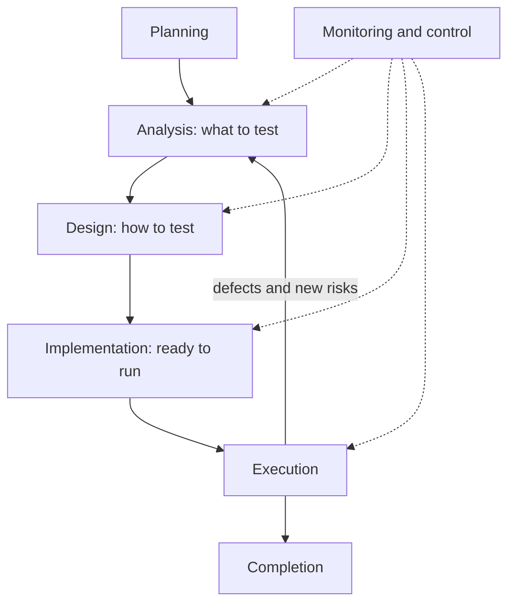
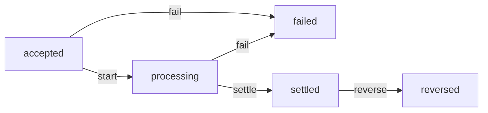
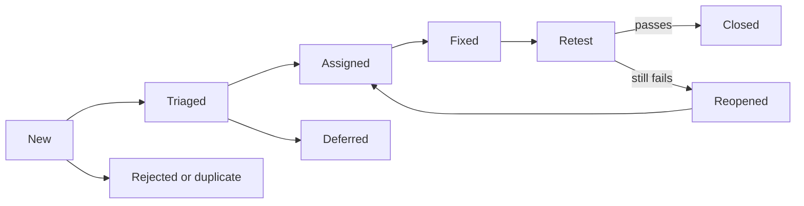

# Module 1 — Testing foundations

*Module 0 told you what testing is for. This module gives you the working kit of a tester: the three things you will do every day for the rest of your career. First, the mindset and the process: the seven principles, the activities every test effort goes through, and how to decide when you have tested enough. Second, test design: how to choose a handful of tests that find bugs in an astronomically large space of possible inputs. Third, communication: how to read a requirement critically, turn it into acceptance criteria and test cases, and write a bug report that a developer can act on in minutes. You will follow Nada, the new graduate in Najm Bank's Quality Engineering team, as Rashid coaches her through the daily transfer limit, the fee rules, the transfer lifecycle and one very small fee bug, all on the course's sample system. The techniques are older than any AI tool. They matter more now, because they are how you judge whether a test, written by you or by an agent, can actually fail.*

> **Focus:** Mindset, Design — thinking like a tester, choosing tests on purpose, and reporting what you find so that it gets fixed.

---

# 1.1 — The tester's mindset, the seven principles and the test process
*Level: 🟢 Beginner* · *Prerequisites: 0.1, 0.2* · *Focus: Mindset*

## ⚡ In 60 seconds
- Testing produces **evidence**: what you checked, against what, and what you did not check.
- **Testing shows the presence of defects, never their absence**, and exhaustive testing is impossible. So you choose tests by risk.
- The **mindset** is curiosity, healthy scepticism, clear communication, empathy and constructive reporting.
- The **test process** has seven overlapping activities. Every test needs an **oracle**, a trustworthy source of the expected result. No oracle, no verdict.
- Stop when the remaining risk is acceptable to the person who owns it, never just because "all the tests passed".

## 🧭 Why it matters
In her first week at Najm Bank, Nada gets story **TRF-212, the daily transfer limit**. She opens the QA build of Najm Mobile, sends forty transfers of different sizes, sees each one accepted or rejected sensibly, and writes in the ticket: "Tested. Works."

Rashid asks four questions. *Against what did you check? If it were broken, what would you have seen differently? What did you not try? Who decides that we are done?* Nada can answer none. [The course's sample system](https://github.com/Tamoura/system-design-for-vibe-coders/tree/main/testing/sample) hides a bug exactly here: switch on `limit_off_by_one` and a transfer that brings the day's total to exactly the limit is wrongly rejected. Forty typical transfers never touch it. A customer sending the last 1,000 QAR of their allowance will.

Nada is not careless. Nobody told her that testing is a decision problem: with unlimited possible tests and limited time, which few do you run, and what do they prove? Those four questions are this lesson, and in the AI era they matter more: an agent can write a rule and its tests together and return a green run in seconds.

## 📐 How it works

### 🟢 The essentials

**Vocabulary** (from lesson 0.2). A person's **error** leaves a **defect** (bug) in code or a document, which can cause a **failure**. Dynamic testing triggers failures, static testing finds defects directly, and debugging removes the defect behind a failure.

**The seven testing principles** come from the ISTQB Foundation syllabus (CTFL v4.0). In plain words, each with a Najm example:

1. **Testing shows the presence of defects, not their absence.** Passing tests lower the odds that bugs remain, never to zero. *The 24-test starter suite passes clean, yet three of the sample's five seeded transfer bugs get through.*
2. **Exhaustive testing is impossible.** Inputs, states and timings multiply faster than any machine can run them. *QAR transfers alone: 2,499,901 amounts × 5,000,001 "sent today" totals × 3 kinds is about 3.75 × 10^13 combinations.*
3. **Early testing saves time and money.** Start when there is anything to examine, even a sentence. *Asking "what counts as a day?" in a story review costs a conversation; after launch, a hotfix.*
4. **Defects cluster.** A few components hold most bugs. *Transfers defects keep pointing at rounding and time handling, so Rashid puts extra tests there.*
5. **Tests wear out** (the pesticide paradox). The same tests, run again and again, stop finding new defects. *A suite of mid-range amounts stays green while a boundary bug waits.*
6. **Testing is context dependent.** What to test, and how hard, depends on what can go wrong and for whom. *Payments needs exact decimals and an audit trail; a marketing banner, a light check.*
7. **Absence of defects is a fallacy.** A system with no known bugs can still be the wrong one. *A flawless transfer screen that cannot schedule a salary-day payment still fails customers.*

**The tester's mindset** is five habits:
- **Curiosity:** ask "what if?" unprompted: Arabic-Indic digits, the double-click, the leap day.
- **Healthy scepticism:** do not accept "it works" from a demo, a developer or an AI agent. You doubt claims, not people, and your own testing too: Nada believed her forty samples.
- **Communication:** you carry bad news. "Exactly 1,000.00 QAR is rejected after 49,000.00 sent" lands; "your limit code is broken" does not.
- **Empathy:** for the customer who hits the error on salary day, and for the developer reading your report.
- **Constructive defect reporting:** what you saw, what you expected and why, with evidence (lesson 1.3).

**The test process.** The work follows seven activities. They overlap and loop.



The story: *"As a customer, I want a daily limit so that a stolen phone or a typing slip cannot move more than 50,000 QAR or AED, or 10,000 EUR, in a day."* Its first acceptance criterion: *"Transfers above the daily limit are rejected with a clear message."*

| Activity | TRF-212 example |
|---|---|
| **Planning** | Risk is high (money). Test at component and API level. Exit: no critical defect open, risky conditions covered |
| **Analysis** | Read the story, the `limits` policy text and the code; review the story; list test conditions |
| **Design** | Turn conditions into cases with data and expected results |
| **Implementation** | Write the pytest tests, set up "sent today" data, hook them into CI (continuous integration) |
| **Execution** | Run, compare actual with expected, raise defects, retest fixes |
| **Monitoring and control** | "Five of seven cases run, one failed." Action: add a case, move a date, escalate |
| **Completion** | Keep the cases as regression tests, log open questions, write the report |

### 🟡 Going deeper

**Worked example: TRF-212.** *Analysis: review the story before any code runs.* This is **static testing**: examining a work product without executing it. Rashid reads "above the daily limit" and asks: (1) Above, or at? Is exactly 50,000.00 allowed? (2) What is a day: Qatar midnight, or a rolling 24 hours? (3) Per currency or combined? (4) Do own-account transfers count? (5) Do rejected attempts count? (6) What is a "clear message", in which language? The code shows today's answers to 1 and 3 to 5 (exactly 50,000.00 is allowed; totals are per user and currency, count every kind and include accepted transfers only), but only product can say that is intended. It cannot answer 2, because its running total is never reset, or 6, because it returns only the bare code `daily_limit_exceeded`. Six questions, no test run.

*Design and execution.* Expected results come from the `limits` policy text, not the code. We ran the cases on the clean sample, then with `NAJM_BUGS=limit_off_by_one`:

| Case | Amount | Sent today | Expected | Bug on |
|---|---|---|---|---|
| TC-1 | QAR 1,000.00 | 0.00 | accepted | accepted |
| TC-2 | QAR 5,000.00 | 49,000.00 | rejected | rejected |
| TC-3 | QAR 1,000.00 | 49,000.00 | accepted (total exactly 50,000.00) | **rejected** |
| TC-4 | QAR 1,000.01 | 49,000.00 | rejected | rejected |
| TC-5 | EUR 5,000.00 | 5,000.00 | accepted (total exactly 10,000.00) | **rejected** |
| TC-6 | EUR 5,000.00 | 6,000.00 | rejected | rejected |

Nada's instinct produced TC-1, TC-2 and TC-6. They pass on the broken system as well as the correct one, so they cannot tell the two apart. Only the two cases where the total *meets* the limit can: a test that passes whatever the code does, against one that can fail. For *monitoring and control*, Nada reports "six run, two failed, defect raised" and Rashid adds the AED pair. In *completion* the cases become regression tests and "what is a day?" is logged as a known gap. Lesson 1.2 finds cases like TC-3 on purpose.

**Test levels and test types.** A **level** says how much is under test: **component**, **component integration**, **system**, **system integration** or **acceptance**. A **type** says what you check: **functional** (the right thing?) or **non-functional** (how well: performance, security, usability). Tests derive **black-box** from specifications or **white-box** from code structure. After a change add **confirmation** testing (is it fixed?) and **regression** testing (did anything else break?).

| Level | Functional example | Non-functional example |
|---|---|---|
| Component | `check_transfer` accepts a total of exactly 50,000.00 | A micro-benchmark keeps `check_transfer` fast |
| Component integration | `TransferService` passes the right "sent today" per user | Timeout when the limits store is slow |
| System | `POST /transfers` rejects the transfer that crosses the limit | Response time under load (lesson 4.1) |
| System integration | Payments service and card network agree on the amount | Behaviour when the network is down |
| Acceptance | Compliance confirms the limits match policy | A customer understands the Arabic error |

**Static versus dynamic.** **Dynamic** testing runs the software. **Static** testing examines it without running it: reviews, and **static analysis** tools, which are cheap tests. A tired developer, or an AI assistant, might write this draft:

```python
from decimal import Decimal


def international_fee(amount: Decimal) -> Decimal:
    return amount * 0.0035


def describe(amount: Decimal) -> str:
    total = amount + internatonal_fee(amount)
    return "Total: " + total
```

```text
$ pip install ruff mypy
$ mypy fee_draft.py
fee_draft.py:5: error: Unsupported operand types for * ("Decimal" and "float")  [operator]
fee_draft.py:9: error: Name "internatonal_fee" is not defined; did you mean "international_fee"?  [name-defined]
Found 2 errors in 1 file (checked 1 source file)
```

Exact wording varies by mypy version. `ruff check fee_draft.py` also flags the misspelt name, and once you fix it mypy reports a third defect, a string plus a `Decimal`. In seconds, with no test written, we found a typo, a binary float where money needs a decimal (the mistake behind the sample's `float_fee` bug) and a type error. Static analysis cannot say whether a fee is the *right* amount. Use both kinds of testing: they find different defects.

**Oracles: where "expected" comes from.** A test has an input, an **oracle** that supplies the expected result, and a **verdict** from comparing expected with actual. This is the smallest useful pytest example; save it as `tests/test_oracle_demo.py` in a copy of the sample:

```python
from decimal import Decimal

from najm.transfers import fee


def test_international_fee_on_3090_qar():
    actual = fee("3090", "QAR", "international")
    expected = Decimal("10.82")   # the oracle: 3,090 x 0.35 % = 10.815, rounded half up
    assert actual == expected     # the verdict: pass if equal, fail if not


def test_a_test_with_no_oracle():
    assert fee("3090", "QAR", "international")   # weak: any non-zero fee passes
```

pytest runs every function named `test_...`; a failed `assert` is a failure. Both pass on the clean sample. With the bug on (output trimmed):

```text
$ NAJM_BUGS=float_fee pytest tests/test_oracle_demo.py
F.                                                                       [100%]
E       AssertionError: assert Decimal('10.81') == Decimal('10.82')
FAILED tests/test_oracle_demo.py::test_international_fee_on_3090_qar
1 failed, 1 passed
```

The second test is green on a correct system and a broken one. Oracles have strengths. A **specification** or independent calculation (policy says 0.35 %, half-up, so 10.82) catches `float_fee`. A **partial oracle**, a property that must hold ("the fee is always between 10.00 and 100.00"), does not: 10.81 is in range. It is cheap when no exact answer exists, but catches fewer bugs. For a message that "reads clearly", the oracle is a human.

### 🔴 Expert view

**The oracle problem.** For `fee` the oracle is a policy and a calculator. Often it is harder: what is the correct output of a search ranking or a translation? Not knowing the expected result is the **oracle problem**. It never goes away; it returns in force in Module 7, because an LLM has no single correct answer. Ask Najm Assist's stand-in model one question four times, with sampling on:

```python
from najm.assist import answer, FakeModel

q = "What is the cut-off time for same-day transfers?"
for seed in range(1, 5):
    print(answer(q, FakeModel(temperature=0.8, seed=seed))["text"])
```

The same policy sentence comes back, sometimes opening with "According to our policy:" and sometimes not. Same facts, different strings: an exact-match `assert` fails a correct answer. You will need graders that judge meaning (lesson 7.1).

A related trap sits in AI-written code. If an agent writes `check_transfer` and its test together, the "expected" value may just be what the code returned: a **circular oracle**. It keeps passing when the code is wrong. Take the oracle from somewhere independent. [*System Design for Vibe Coders*, lesson 9.4 — Verification before completion](../vibe/index.en.html#l9-4) builds the habit of never accepting "done" without evidence you have seen fail.

**When to stop testing.** Testing is never finished; someone decides the remaining risk is acceptable, and the tester makes that decision informed. Good reasons to stop are risk-based and evidence-based: the exit criteria are met, the risky conditions are covered, and open defects are known and accepted in writing by the release owner. Running out of time is valid too, if you report what is untested and who accepted that. "All tests passed" says nothing about tests you did not write. For example: "I recommend we do not release: the limit check is untested at its boundary, and a customer can hit it on day one."

## 🧰 The toolkit
| Tool, practice or technique | What it is and does | When to reach for it |
|---|---|---|
| **Seven testing principles** (ISTQB) | Seven statements about why testing works as it does | To challenge "tested, works" and size the effort |
| **Requirement review** | Reading a story for ambiguity and gaps before code exists | Every story, before development |
| **Static analysis** (ruff, mypy) | Linters and type checkers that find defects without running code | Every commit, in CI, on AI-written code |
| **Test oracle** | The trusted source of the expected result | Before any test: no oracle, no verdict |
| **Exit criteria** | Agreed conditions that say testing is good enough | In the plan, so "are we done?" has an answer |
| **pytest** | The standard Python test runner: plain `assert`, fixtures, parametrisation | Unit and API tests, and every example here |

## 🏛️ In practice at Najm Bank
Rashid asks every squad for a **test-process card** per story: one page proving the thinking happened. This is TRF-212's.

| Field | TRF-212, daily transfer limit |
|---|---|
| Risk and basis | High: customer money, regulator interest. Basis: story, `limits` policy text, `najm/transfers.py` |
| Story review | 6 questions: 2 the code cannot answer (the "day", the message); 4 behaviours to confirm |
| Conditions and oracle | Exactly at the limit; one cent over; per currency. Expected values from policy text and hand-calculated totals, never the code's output |
| Exit criteria | All conditions run; no open critical or major defect; open questions answered or accepted in writing |
| Residual risk | "Day reset untested because undefined", accepted by the product owner on a stated date |

## 🛠️ Exercises
Copy the sample first (`cp -r testing/sample ~/najm-sample`), create a virtual environment there and run `pip install -r requirements.txt`.

- 🟢 **Review the requirement.** Take "Transfers above the daily limit are rejected with a clear message." Write at least eight questions for product, each with a proposed answer and who should decide. *Done when:* the list covers "day", per currency or combined, which kinds count, exactly-at-limit, rejected attempts and the message; at least two answers cite the function or method in `najm/transfers.py` that settles them; and one is marked as a product decision the code cannot settle.
- 🟡 **One oracle per function.** For each of `quantize`, `fee`, `check_transfer` and `value_date`, write one pytest test whose expected value comes from outside the code (a policy text in `najm/assist.py`, a hand calculation or a property). Run the suite clean, then with `NAJM_BUGS=float_fee` and `NAJM_BUGS=tz_cutoff`. *Done when:* all four pass clean; at least two fail under the right bug with expected and actual visible; and a table gives each test's oracle type and one bug it could never catch.
- 🔴 **A completion report.** Run the starter suite (`pytest`) five times, once per `NAJM_BUGS` value, and record which tests fail. Write a one-page completion report. *Done when:* it has a five-row table of measured results, names three residual risks as customer impact, recommends release or not with the evidence and what would change your mind, and proposes the next three tests by risk, each with its oracle.

## ⚠️ Mistakes and traps
- **"Tested. Works."** Say what you checked, against what, and what you did not.
- **Treating green as proof.** Green is evidence only if the test could have failed. Ask: which bug turns this red?
- **Expected values copied from the output.** The test restates the code. Take expectations from a specification, a calculation or a person.
- **Testing only what you built.** Authors confirm their own intent; ask someone else to attack it.
- **Process as paperwork.** Seven activities are a way to think. A throwaway script needs a minute, Payments an auditable plan; scale to the risk.

## 🧾 Recap
- Testing yields evidence, not guarantees: it shows presence of defects, cannot be exhaustive, and is chosen by risk and context.
- The mindset includes doubting your own testing; the seven activities overlap and loop.
- Levels (how much) and types (what) are different axes; static testing finds defects before anything runs.
- No oracle, no verdict. A circular oracle makes AI-written tests worthless; the oracle problem grows with AI systems.
- Stopping is a risk decision owned by someone accountable, informed by your evidence.

## ✍️ Check yourself

**1. Nada's script sent 1,000 random transfers to the QA build; all behaved as expected, and she reported "no defects in the daily limit". Which principle shows the report overreaches?**

- A. Exhaustive testing is impossible, so no test is worth running
- B. Testing shows the presence of defects, not their absence
- C. Early testing saves time and money on every project
- D. Defects cluster, so old code always holds the bugs

<details><summary>Answer</summary>

**B.** Passing tests never prove there are no defects, and random inputs rarely hit the exact-limit case. A misreads principle 2: it is about choosing tests. (🟢 The essentials.)

</details>

**2. Bilal writes the pytest tests for TRF-212, sets up synthetic QA accounts and wires the suite into CI. Which test process activity is this?**

- A. Analysis, because he is deciding which things need to be tested
- B. Design, because he is working out the expected results
- C. Execution, because the finished suite will run in CI
- D. Implementation, because he is preparing everything to run

<details><summary>Answer</summary>

**D.** Implementation prepares what execution needs: tests, data, environment. Analysis and design come earlier; execution runs the prepared tests. (🟢 The essentials.)

</details>

**3. An AI assistant writes `check_transfer` and its tests, running the code and pasting each output into an `assert`. All tests pass. What is the main weakness?**

- A. The expected values came from the code, a circular oracle
- B. Passing so quickly means the tests were not run properly
- C. A type checker would certainly have rejected the code
- D. Parametrised tests are always weaker than separate test functions

<details><summary>Answer</summary>

**A.** Expectations copied from the code's own output pass even when the code is wrong; the oracle must be independent. Speed, typing and test layout are unrelated. (🔴 Expert view.)

</details>

**4. Before any unit test exists, `mypy` reports that a fee function multiplies a `Decimal` by a `float`. What kind of testing found the defect?**

- A. Dynamic testing, since a tool was executed to find it
- B. Regression testing, since it checks code that already exists
- C. Static testing, since the code was examined without being run
- D. Acceptance testing, since the finding would block a release

<details><summary>Answer</summary>

**C.** Static testing examines work products such as source code without executing them; linters and type checkers are static analysis. Regression and acceptance describe purpose and level. (🟡 Going deeper.)

</details>

**5. On Thursday every planned TRF-212 test passes, one major defect (a wrong fee for a rare input) is open, and release is due Friday. What should the tester do?**

- A. Mark the story done, because all planned tests passed
- B. Give the product owner the evidence, the open defect and a recommendation
- C. Block the release personally, since any open defect makes it unsafe to ship
- D. Hold the report until the defect is fixed, to avoid alarm and delay

<details><summary>Answer</summary>

**B.** Stopping is a risk decision owned by whoever is accountable for the release; the tester supplies evidence, impact and a recommendation. A ignores the defect, C takes a decision that is not the tester's, D hides what it needs. (🔴 Expert view.)

</details>

## 📚 References
- ISTQB, Certified Tester Foundation Level syllabus v4.0 — https://www.istqb.org/
- pytest documentation — https://docs.pytest.org/
- Python documentation, the `decimal` module — https://docs.python.org/3/library/decimal.html
- Najm Transfers, the course's sample system — https://github.com/Tamoura/system-design-for-vibe-coders/tree/main/testing/sample

---

# 1.2 — Test design techniques: equivalence partitions, boundaries, decision tables, state transitions and pairwise
*Level: 🟢 Beginner* · *Prerequisites: 1.1* · *Focus: Design*

## ⚡ In 60 seconds
- **Test design** is choosing, on purpose, a small set of tests that can fail for the right reasons.
- **Equivalence partitioning** tests one value per group the system treats alike, invalid groups included. **Boundary value analysis** tests the edges of those groups, where off-by-one bugs live.
- **Decision tables** cover combinations of rules, **state-transition tests** life cycles, **pairwise** testing configuration matrices, and **error guessing** money, time and text traps.
- Decision cue: pick the technique by the *shape* of the rule, then plant a bug to prove a test turns red.

## 🧭 Why it matters
Rashid runs the 24-test starter suite five times, once per seeded bug. It catches `no_idempotency` and `bola` but stays green for `limit_off_by_one`, `float_fee` and `tz_cutoff`. None of its tests is wrong; they sit in the middle of the input space, where the bugs are not.

Volume does not fix that, and neither does randomness. We compared the clean sample with `limit_off_by_one` on 100,000 random pairs (uniform at the cent, fixed seed) and found **zero differences**: the bug needs `sent_today + amount` to equal 50,000.00 exactly, which a random pair does about once in five million tries, so 100,000 pairs have only about a 2 % chance of containing even one. Test design is also how you judge an AI agent's suite, which can look tidy yet sit mid-range unless you ask for boundaries.

## 📐 How it works

### 🟢 The essentials

The sample's `check_transfer(amount, currency, kind, sent_today)` accepts 1.00 to 25,000.00 QAR or AED (5,000.00 EUR) with at most two decimals, and lets the day's total reach 50,000.00 (EUR 10,000.00) exactly. Start `tests/test_design.py` with a helper that turns a decision into one string:

```python
from datetime import datetime
from decimal import Decimal
from zoneinfo import ZoneInfo

import pytest

from najm.transfers import TransferRejected, check_transfer, fee, value_date


def outcome(amount, currency="QAR", kind="domestic", sent_today="0"):
    """'ok', or the rejection code."""
    try:
        check_transfer(amount, currency, kind, sent_today)
        return "ok"
    except TransferRejected as e:
        return e.code
```

**Equivalence partitioning (EP).** An **equivalence partition** is a group of inputs the specification says the system treats the same way. If one value works, the others should too, so one test per partition is enough, and you must include the **invalid** partitions. Write the expected value from the rules before running anything:

```python
EP = [  # one representative per partition: amount, currency, sent today, expected
    pytest.param("0.50", "QAR", "0", "below_minimum", id="amount-below-minimum"),
    pytest.param("5000.00", "QAR", "0", "ok", id="amount-valid"),
    pytest.param("30000.00", "QAR", "0", "above_per_transfer_max", id="amount-above-max"),
    pytest.param("5000.00", "QAR", "20000", "ok", id="daily-total-under-limit"),
    pytest.param("5000.00", "QAR", "49000", "daily_limit_exceeded", id="daily-total-over-limit"),
]


@pytest.mark.parametrize("amount, currency, sent_today, expected", EP)
def test_equivalence_partitions(amount, currency, sent_today, expected):
    assert outcome(amount, currency, sent_today=sent_today) == expected
```

`@pytest.mark.parametrize` runs one function once per row; `id=` names each row in the report.

**Boundary value analysis (BVA).** Bugs gather at the edges of partitions, as when `<` is written `<=`. A **boundary** is the first or last value of an ordered partition; the **step** is the smallest meaningful difference, 0.01 for QAR. **2-value** BVA tests the boundary and its closest neighbour in the other partition; **3-value** adds a neighbour on the other side. Say someone codes the minimum as `amount == 1.00` instead of `amount >= 1.00`. The 2-value set {0.99, 1.00} passes both, so the slip is missed; the 3-value set {0.99, 1.00, 1.01} catches it, because the slip wrongly rejects 1.01. Three values cost 50 % more tests: use 2-value for simple comparisons, 3-value where a miss is costly, as it usually is for money.

The daily limit is a boundary on a *derived* value, `sent_today + amount`. To make the total meet the limit, set `sent_today` to the limit minus the amount: 49,000.00 sent plus 1,000.00 is exactly 50,000.00.

```python
BOUNDARIES = [  # 3-value: the boundary and one step either side
    pytest.param("0.99", "0", "below_minimum", id="min-minus-1-cent"),
    pytest.param("1.00", "0", "ok", id="min"),
    pytest.param("1.01", "0", "ok", id="min-plus-1-cent"),
    pytest.param("1000.00", "48999.99", "ok", id="daily-limit-minus-1-cent"),
    pytest.param("1000.00", "49000.00", "ok", id="daily-limit-exactly-met"),
    pytest.param("1000.00", "49000.01", "daily_limit_exceeded", id="daily-limit-plus-1-cent"),
]


@pytest.mark.parametrize("amount, sent_today, expected", BOUNDARIES)
def test_boundaries(amount, sent_today, expected):
    assert outcome(amount, sent_today=sent_today) == expected
```

**The payoff.** All 11 tests pass on the clean sample. Switch on the seeded bug and run the daily-limit tests (`-k daily` selects test names containing "daily"; output trimmed):

```text
$ NAJM_BUGS=limit_off_by_one pytest tests/test_design.py -k daily
...F.                                                                    [100%]
FAILED tests/test_design.py::test_boundaries[daily-limit-exactly-met]
1 failed, 4 passed, 6 deselected
```

Exactly one test fails: the one where the total *meets* the limit. The bug that 24 starter tests and 100,000 random cases missed is caught by one test chosen on purpose.

### 🟡 Going deeper

**Decision tables.** When several conditions combine to decide an outcome, list them in a **decision table**, one rule per row, with one test per rule. The sample's fee rules:

| Rule | Kind | Amount | Fee |
|---|---|---|---|
| R1 | own | any | 0.00 |
| R2 | domestic | up to and including 1,000.00 | 0.00 |
| R3 | domestic | over 1,000.00 | 2.00 |
| R4 | international | 0.35 % under 10.00 | 10.00 (minimum) |
| R5 | international | 0.35 % from 10.00 to 100.00 | 0.35 %, rounded half up |
| R6 | international | 0.35 % over 100.00 | 100.00 (cap) |

Add boundary thinking where the fee jumps (1,000.00 against 1,000.01), and for R5 a value where rounding matters:

```python
FEE_RULES = [  # one test per rule of the decision table
    pytest.param("500", "own", "0.00", id="R1-own-free"),
    pytest.param("1000.00", "domestic", "0.00", id="R2-domestic-1000-free"),
    pytest.param("1000.01", "domestic", "2.00", id="R3-domestic-above-1000"),
    pytest.param("100", "international", "10.00", id="R4-minimum-10"),
    pytest.param("3090", "international", "10.82", id="R5-half-up-rounding"),
    pytest.param("5000", "international", "17.50", id="R5-exact"),
    pytest.param("100000", "international", "100.00", id="R6-cap-100"),
]


@pytest.mark.parametrize("amount, kind, expected", FEE_RULES)
def test_fee_rules(amount, kind, expected):
    assert fee(amount, "QAR", kind) == Decimal(expected)
```

Building the table taught us something before any test ran. R6 is reachable only by calling `fee` directly: the biggest transfer `check_transfer` accepts, 25,000.00 QAR, costs 87.50. Future-proofing or dead code? A question for product. With `float_fee` on, exactly one test fails, `R5-half-up-rounding`: 10.815 should round half up to 10.82, and the float code returns 10.81. `R5-exact` passes under the bug, so a round-number amount would never have found it.

**When rules collide.** 30,000.00 QAR with 49,000.00 already sent breaks both the per-transfer maximum and the daily limit. The sample reports `above_per_transfer_max`, because it checks in a fixed order. No requirement says which message should win, so ask product. Until they answer, a test that pins it is a **characterisation test**: it records what the code does, not what it should do.

```python
def test_two_broken_rules_report_the_per_transfer_maximum_first():
    assert outcome("30000.00", sent_today="49000") == "above_per_transfer_max"
```

**State-transition testing.** A transfer has a life cycle: accepted, then processing, then settled or failed; a settled one may be reversed. The valid moves are a small graph, and everything else must be refused. The sample only creates `accepted` transfers, so we model the rest in a lesson-local module. Save the code below the diagram as `najm/lifecycle.py`:



```python
class InvalidTransition(Exception):
    pass


TRANSITIONS = {
    ("accepted", "start"): "processing",
    ("accepted", "fail"): "failed",
    ("processing", "settle"): "settled",
    ("processing", "fail"): "failed",
    ("settled", "reverse"): "reversed",
}


def apply(state, event):
    """Return the next state, or refuse the move."""
    if (state, event) not in TRANSITIONS:
        raise InvalidTransition(f"{event!r} not allowed when {state}")
    return TRANSITIONS[(state, event)]
```

A **state table** lists every state against every event: 5 × 4 is 20 cells, 5 valid and 15 invalid. Coverage grows from every state to every transition to every invalid cell. Invalid cells are where money bugs hide: a second `reverse` would refund the customer twice. Write the expected table by hand, as data, in `tests/test_lifecycle.py`:

```python
from itertools import product

import pytest

from najm.lifecycle import InvalidTransition, apply

STATES = ["accepted", "processing", "settled", "failed", "reversed"]
EVENTS = ["start", "settle", "fail", "reverse"]

# The expected behaviour, written from the requirement, NOT imported from the code.
VALID = {
    ("accepted", "start"): "processing",
    ("accepted", "fail"): "failed",
    ("processing", "settle"): "settled",
    ("processing", "fail"): "failed",
    ("settled", "reverse"): "reversed",
}


@pytest.mark.parametrize("state, event", list(product(STATES, EVENTS)))   # all 20 cells
def test_every_cell_of_the_state_table(state, event):
    if (state, event) in VALID:
        assert apply(state, event) == VALID[(state, event)]
    else:
        with pytest.raises(InvalidTransition):
            apply(state, event)
```

To see what the tests are worth, plant a defect (a **mutant**; lesson 2.3 automates the idea) that lets a *failed* transfer be reversed. A temporary autouse fixture in `tests/conftest.py` does it; delete the file afterwards:

```python
import pytest
from najm import lifecycle


@pytest.fixture(autouse=True)
def mutant(monkeypatch):
    monkeypatch.setitem(lifecycle.TRANSITIONS, ("failed", "reverse"), "reversed")
```

```text
$ pytest tests/test_lifecycle.py
...............F....                                                     [100%]
FAILED tests/test_lifecycle.py::test_every_cell_of_the_state_table[failed-reverse]
1 failed, 19 passed
```

Only the refused cell notices. A happy-path test (accepted, start, settle) passes the mutant, and so does one that reads its expectations from the live `lifecycle.TRANSITIONS`: it checks the mutated table against itself, the circular oracle of lesson 1.1. We tried both.

**Pairwise testing.** Configuration matrices explode. Najm Mobile runs on 4 browsers, 2 languages, 3 currencies and 3 device classes: 4 × 2 × 3 × 3 = 72 combinations, 66 without Safari on Android. **Pairwise** (all-pairs) testing picks a small set in which every pair of values from any two parameters appears together at least once. The bet, a heuristic and not a law, is that many failures involve one parameter or an interaction of two. Save this as `pairwise.py` next to `najm/`:

```python
from itertools import combinations, product

PARAMS = {
    "browser": ["Chrome", "Safari", "Firefox", "Edge"],
    "language": ["en", "ar"],
    "currency": ["QAR", "AED", "EUR"],
    "device": ["iPhone", "Android", "Desktop"],
}


def feasible(case):                      # one real-world rule: Safari does not run on Android
    return not (case["browser"] == "Safari" and case["device"] == "Android")


def combos_of(case, t):
    """Every t-way combination of parameter values that this case covers."""
    return {tuple((k, case[k]) for k in keys) for keys in combinations(case, t)}


def pairwise(params, t=2):
    cases = [dict(zip(params, values)) for values in product(*params.values())]
    cases = [case for case in cases if feasible(case)]
    todo = set().union(*(combos_of(case, t) for case in cases))
    chosen = []
    while todo:                          # greedy: take the case that covers most uncovered combinations
        best = max(cases, key=lambda case: len(combos_of(case, t) & todo))
        chosen.append(best)
        todo -= combos_of(best, t)
    return cases, chosen
```

Running `pairwise(PARAMS)` returns the 66 feasible cases and **12 chosen ones**, covering all 52 feasible pairs. Twelve is the minimum, because 4 browsers × 3 currencies alone need 12 distinct pairs. Tools such as `allpairspy` and Microsoft's PICT handle constraints and bigger matrices (`allpairspy` gave 13 cases and left one feasible pair, Edge with iPhone, uncovered: check tool output).

The price: counting with `combos_of(case, 3)` shows the 12 cases cover only 46 of the 97 feasible three-way combinations, so a defect that needs, say, Arabic, QAR and iPhone together can slip through. If risk analysis names a dangerous triple, add that case by hand or raise the strength `t`.

### 🔴 Expert view

**Error guessing and checklists.** **Error guessing** designs tests from experience of where software breaks; a **checklist** shares what one person knows. Najm's prompts:

| Area | Prompts |
|---|---|
| **Money** | Half-cent rounding; floats; zero and negative; extra decimals; currencies with 0 or 3 decimals |
| **Time** | Cut-off 15:00 Qatar; Friday and Saturday weekend; leap day; month end; EU daylight saving (not the Gulf); a second either side |
| **Text** | Arabic names; very long input; emoji; copy-paste with a trailing space; Arabic-Indic digits; double-click |

Time tests build each moment in an explicit zone:

```python
QATAR, BERLIN = ZoneInfo("Asia/Qatar"), ZoneInfo("Europe/Berlin")

TIME_CASES = [
    pytest.param(datetime(2026, 10, 5, 14, 59, 59, tzinfo=QATAR), "2026-10-05", id="one-second-before-cutoff"),
    pytest.param(datetime(2026, 10, 5, 15, 0, 0, tzinfo=QATAR), "2026-10-06", id="at-cutoff"),
    pytest.param(datetime(2028, 2, 28, 16, 0, 0, tzinfo=QATAR), "2028-02-29", id="leap-day"),
    pytest.param(datetime(2026, 12, 31, 16, 0, 0, tzinfo=QATAR), "2027-01-03", id="year-end-skips-weekend"),
    pytest.param(datetime(2026, 10, 22, 13, 30, tzinfo=BERLIN), "2026-10-22", id="berlin-summer-13-30"),
    pytest.param(datetime(2026, 10, 26, 13, 30, tzinfo=BERLIN), "2026-10-27", id="berlin-winter-13-30"),
]


@pytest.mark.parametrize("when, expected", TIME_CASES)
def test_value_date(when, expected):
    assert value_date(when).isoformat() == expected
```

The last two cases are the same Berlin wall-clock time either side of the EU clock change on 25 October 2026: 13:30 there is 14:30 in Qatar before the change and 15:30 after it, and the Gulf never shifts, so the outcome flips. With `tz_cutoff` on, four of the six fail: the bug reads the cut-off as UTC, so on a working day (Sunday to Thursday) every submission from 15:00 to 17:59 Qatar time gets the wrong date. On Friday and Saturday the weekend rule hides the bug, so choose test dates on purpose.

For text, append this to the starter `tests/test_api.py` (it defines `client`, `ALICE` and `BODY`). It tries an Arabic name, emoji, a trailing space and a very long string as the recipient:

```python
@pytest.mark.parametrize("recipient", ["محمد عبدالله", "😀😀😀", "acc-2 ", "x" * 100_000],
                         ids=["arabic-name", "emoji", "trailing-space", "very-long"])
def test_odd_recipient_text_is_a_clean_422_never_a_500(client, recipient):
    r = client.post("/transfers", json={**BODY, "to_account": recipient},
                    headers={**ALICE, "Idempotency-Key": "k"})
    assert (r.status_code, r.json()["error"]["code"]) == (422, "unknown_recipient")
```

It passes: no crash, a stable error code. The amount field accepts `"٥٠٠"` (Arabic-Indic digits) as 500 and tolerates surrounding spaces, yet the recipient rejects a trailing space: inconsistent, or courtesy to Arabic users? And `static/transfer.html` makes a fresh idempotency key (the token that lets the server recognise a repeated request) on every submit and never disables the button. In a real browser, one double-click sent two POSTs with two keys and debited the account twice. That is a bug report for lesson 1.3 and an end-to-end test for lesson 3.2.

## 🧰 The toolkit
| Tool, practice or technique | What it is and does | When to reach for it |
|---|---|---|
| **Equivalence partitioning** | One test per group of inputs treated alike, invalid groups included | Ranges, categories, formats |
| **Boundary value analysis** | Tests the edges of ordered partitions, 2-value or 3-value | Limits, thresholds, dates |
| **Decision table testing** | Combinations of conditions and actions, one test per rule | Fees, eligibility, pricing |
| **State transition testing** | States, events and allowed moves, valid and refused | Transfers, orders, approvals |
| **Pairwise testing** (PICT, allpairspy) | A small set covering every pair of parameter values | Browser, device, locale matrices |
| **Error guessing** | Tests from experience of common faults, kept in checklists | After the formal techniques |

## 🏛️ In practice at Najm Bank
Squads attach a **test-design sheet** to every story with rules. This one covers Transfers limits and fees.

| ID | Technique | Data | Expected (oracle) | Risk guarded |
|---|---|---|---|---|
| D-01 | BVA 3-value | QAR 1,000.00 after 48,999.99, 49,000.00, 49,000.01 | ok, ok, rejected | Off-by-one at the limit |
| D-02 | Decision table | International 3,090.00 QAR; domestic 1,000.00 and 1,000.01 | fee 10.82; 0.00; 2.00 | Rounding, wrong tier |
| D-03 | State table | 20 cells: 5 valid, 15 refused | per requirement | Double refund |
| D-04 | Error guessing | 15:00:00 Qatar; 29 February; Berlin 13:30 either side of the clock change; Arabic text; double-click | value dates per policy; one transfer per click | Cut-off, crash, duplicate |

For each row, ask: which bug turns it red?

## 🛠️ Exercises
Work in a copy of the sample, with the lesson's files in `tests/`.

- 🟢 **EUR boundaries.** EUR allows 1.00 to 5,000.00 per transfer and 10,000.00 per day. Write 3-value boundary cases for both limits (2,500.00 after 7,500.00 sent reaches the daily limit) as a parametrised test with ids, plus mid-range cases with ids starting `mid`. *Done when:* all pass on the clean sample; under `NAJM_BUGS=limit_off_by_one` a boundary test fails while every `mid` test passes; and a sentence explains why.
- 🟡 **Add a compliance hold.** Add a state `on_hold`, entered from `accepted` by `hold` and left by `release` (to `processing`) or `fail` (to `failed`), and write the expected table by hand. *Done when:* generated tests cover all 36 cells (6 states × 6 events), 8 valid and 28 refused, and pass; a mutant letting `release` work from `failed` fails exactly that cell; and a test reading its expectations from `TRANSITIONS` still passes that mutant.
- 🔴 **Strength and constraints.** Write an independent checker proving that `pairwise(PARAMS, t)` covers every feasible `t`-way combination, and run it for t = 2, 3 and 4 (expect 12, 33 and 66 cases). Add the rule "Edge runs only on Desktop" to `feasible` and run again (we got 13, 30 and 54). *Done when:* a table shows the counts before and after the rule; the checker passes all six runs; and two sentences choose a strength for release and for nightly.

## ⚠️ Mistakes and traps
- **Only mid-range values.** "Typical" amounts are green by construction. Add the boundary and a cent either side of every limit.
- **Round-number data.** 500 and 5,000 never trigger rounding bugs. Use 3,090.00, where a half-cent appears.
- **Circular expectations.** Copying output into `assert` makes a test that cannot fail. Write expectations from the requirement first.
- **Skipping what must not happen.** Test refusals and illegal moves: money bugs live there.
- **Over-engineering.** EP assumes a uniform partition, BVA an ordered domain; decision tables explode, and pairwise ignores forgotten constraints. Fit the technique to the risk.

## 🧾 Recap
- Technique beats volume: the 25 designed tests caught all three bugs the 24 starter tests miss, although the 5 equivalence-partition tests alone caught none and 100,000 random cases missed one. Weigh tests by the risk they can detect, not by count.
- Equivalence partitions pick one value per group; boundary analysis adds the edges.
- Decision tables expose questions, such as a fee cap no valid transfer can reach and which rule wins; state tables test every cell against an expected table independent of the code.
- Pairwise cut 66 configurations to 12, covering every pair but few triples. Error guessing covers money, time and text.

## ✍️ Check yourself

**1. A QAR transfer is valid from 1.00 to 25,000.00. Which set is the 3-value boundary test for the upper limit?**

- A. 12,500.00, 25,000.00 and 50,000.00
- B. 25,000.00 and 25,000.01 only
- C. 24,999.99, 25,000.00 and 25,000.01
- D. 1.00, 25,000.00 and 25,000.01

<details><summary>Answer</summary>

**C.** The 3-value set is the boundary plus a neighbour each side, at the 0.01 step. B is the 2-value set, A has no neighbours, D mixes in the lower boundary. (🟢 The essentials.)

</details>

**2. The daily limit is 50,000.00 QAR. Nada tests 49,000.00 sent plus 5,000.00 (rejected) and 0 sent plus 5,000.00 (accepted). A developer changes `>` to `>=` in the limit check. What happens to her tests?**

- A. Both still pass, since neither total is exactly 50,000.00
- B. The rejected case fails, because the check is now stricter
- C. Both fail, because any change to the check breaks them
- D. The accepted case fails, as its total is closer to the limit

<details><summary>Answer</summary>

**A.** Her totals, 54,000.00 and 5,000.00, are nowhere near the edge; only a total of exactly 50,000.00 behaves differently under `>=`. (🟢 The essentials.)

</details>

**3. A teammate's tests for the transfer lifecycle check only accepted, then processing, then settled. Which gap is most dangerous for a payments service?**

- A. They never try a refused move, such as reversing twice
- B. They use parametrised tests rather than separate functions
- C. They do not time how long each transition takes
- D. They do not check what a settled transfer displays

<details><summary>Answer</summary>

**A.** A happy-path test cannot catch an illegal transition being allowed, and a second reversal would pay the customer twice. (🟡 Going deeper.)

</details>

**4. Najm Mobile has 4 browsers, 2 languages, 3 currencies and 3 devices; the team cannot run all 72 combinations. Which statement about pairwise testing is correct?**

- A. It guarantees every three-way combination is covered too
- B. It picks cases at random, so results vary between runs
- C. It removes the need to list impossible combinations
- D. It covers every pair of values, but can miss other interactions

<details><summary>Answer</summary>

**D.** Our 12 cases covered every pair but only 46 of 97 feasible triples. B misdescribes a systematic method, and C is false: constraints must still be listed. (🟡 Going deeper.)

</details>

**5. One test asserts that `fee("3090", "QAR", "international")` equals a second call with the same arguments. Another asserts the result equals `Decimal("10.82")` and goes red when `float_fee` is on. What does the contrast teach?**

- A. Round-number amounts are always the best test data
- B. Float bugs can only be found by static analysis
- C. An expectation from the requirement can disagree with the code
- D. Decision tables are unnecessary when code computes fees

<details><summary>Answer</summary>

**C.** A hand-derived expectation (3,090 × 0.35 % = 10.815, half up to 10.82) is independent of the code, so it can disagree; a function compared with itself never fails. (🔴 Expert view.)

</details>

## 📚 References
- ISTQB, Certified Tester Foundation Level syllabus v4.0 (test techniques) — https://www.istqb.org/
- pytest documentation, parametrising tests — https://docs.pytest.org/
- Python documentation, `itertools`, `zoneinfo` and `decimal` — https://docs.python.org/3/

---

# 1.3 — Requirements, test cases and bug reports: from acceptance criteria to a defect someone can fix
*Level: 🟢 Beginner* · *Prerequisites: 1.1, 1.2* · *Focus: Design, Mindset*

## ⚡ In 60 seconds
- A requirement is **testable** if two people would independently agree on pass or fail. Words like "fast", "user-friendly" and "etc." are warnings.
- **Acceptance criteria** turn a story into examples with numbers. **Given/When/Then** is a clear way to write them (behaviour-driven development, BDD, comes in lesson 5.3).
- A **test case** is a scripted check, a **checklist** a list of prompts, a **charter** a mission for exploring. **Traceability** links requirement, test and defect.
- A bug report that gets fixed has a specific title, environment, **minimal reproduction**, expected versus actual with the oracle, and evidence.
- **Severity** is impact; **priority** is urgency. They differ, and triage decides.
- An AI assistant can tidy a report but cannot know what you saw. Never paste secrets or customer data into one.

## 🧭 Why it matters
Nada's first bug report is titled "Transfers broken??". The body says "Fee is wrong, please fix ASAP" and attaches a screenshot of the home screen. Tariq's squad tries a 1,000 QAR domestic transfer, sees the right fee, and closes it "cannot reproduce" in four minutes. Two weeks later, finance notices that some international fees are a cent short. Nobody was careless; the report could not be acted on.

Rashid sits with Nada for ten minutes. The new report names the amount (3,090.00 QAR), the kind (international), the expected fee of 10.82, the actual fee of 10.81 and one command that reproduces it. It is fixed that afternoon. A bug report is a product, and its user is the developer. The chain starts earlier: you cannot write "expected 10.82" unless the requirement said what to expect.

## 📐 How it works

### 🟢 The essentials

**Reading requirements critically.** A requirement is **testable** if two testers, reading it separately, would agree on pass or fail. Vague words fail that test:

| Warning word | Problem | Testable rewrite (example numbers) |
|---|---|---|
| "fast" | Fast for whom, measured how? | "95 % of `POST /transfers` calls answer within 800 ms at 20 requests per second on staging" |
| "user-friendly" | An opinion, not a check | "Of 5 first-time users, at least 4 complete an own-account transfer unaided" |
| "etc." | Hidden scope | List the items: "QAR, AED and EUR" |
| "daily limit" | Which day? Which transfers? | "Accepted transfers per customer and currency, 00:00 to 23:59 Qatar time" |

Also look for what is *not* said (errors, limits, who decides) and ask for an example. Even a precise sentence hides gaps. "Own-account transfers are free" does not say who checks that the recipient really is yours. In the sample the client sends `kind`, and when we tried `own` to another customer's account it was accepted with no fee.

**Acceptance criteria and Given/When/Then.** **Acceptance criteria** are the conditions a story must meet to be accepted. The clearest form is examples with numbers, written as **Given** (context), **When** (action), **Then** (outcome). For TRF-212, after the review in lesson 1.1:

```gherkin
Feature: Daily transfer limit

Scenario: A transfer that makes the day's total exactly the limit is accepted
  Given Alice has sent 49,000.00 QAR today
  When she sends 1,000.00 QAR to another Najm account
  Then the transfer is accepted

Scenario: One cent over the limit is rejected
  Given Alice has sent 49,000.00 QAR today
  When she sends 1,000.01 QAR to another Najm account
  Then the transfer is rejected with the code daily_limit_exceeded
  And her balance is unchanged

Scenario: Limits are per currency
  Given Alice has sent 50,000.00 QAR today
  When she sends 100.00 EUR from her euro account
  Then the transfer is accepted
```

A good criterion is specific (numbers, not adjectives), covers one behaviour, includes the negative case, and says what, not how. Gherkin is a notation; the value is the conversation that produces the examples, the "three amigos" of lesson 5.3.

**Test cases, checklists and charters.** A test case has an ID, an objective, preconditions, steps, data, an expected result and a link to its requirement. One condition, three ways to record it:

| Form | What it looks like | Use when |
|---|---|---|
| **Test case** | TC-LIM-03: objective; precondition (49,000.00 QAR sent); steps; data (1,000.00 QAR); expected (accepted, total 50,000.00); requirement TRF-212 AC1 | Precise, repeatable checks, audits, automation |
| **Checklist** | "Limit: exactly met, one cent over, per currency, rejected attempt not counted" | Experienced testers, fast coverage |
| **Charter** | "Explore the daily limit with payments split across currencies to discover counting errors" (45 minutes) | Unknown territory, exploratory sessions |

Scripts cost effort to write and keep current, so do not script a feature that changes weekly; a checklist or charter is cheaper.

**Traceability** links each requirement to its tests and each defect to the test that found it: TRF-212 AC1, TC-LIM-03, DEF-231. It answers "which requirements have no test?" and "what must we retest if this changes?". Generate it from test names or tags rather than maintaining a spreadsheet by hand.

### 🟡 Going deeper

**A bug report that gets fixed.** Reports fail in predictable ways: a vague title, no steps, no expected result, no evidence, two bugs in one. Here are two reports of the same real defect, the sample's `float_fee` bug, which makes the fee for 3,090.00 QAR 10.81 instead of 10.82. First, what Nada filed:

```text
Title: Transfers broken??
Fee is wrong, please fix ASAP. Screenshot attached.
```

Then the version after Rashid's review:

```text
Title: International fee is 0.01 QAR too low for some amounts (3,090.00 QAR charges 10.81, policy gives 10.82)
Environment: Najm Transfers sample, API run locally with uvicorn, Python 3.11, NAJM_BUGS=float_fee
Steps:
  1. NAJM_BUGS=float_fee uvicorn najm.api:app --port 8000
  2. POST /transfers with headers "Authorization: Bearer token-alice" and "Idempotency-Key: demo-1",
     body {"from_account":"acc-1","to_account":"acc-2",
     "amount":"3090.00","currency":"QAR","kind":"international"}
Expected: fee "10.82": 0.35 % of 3,090.00 is 10.815, and the fee policy rounds half up.
Actual: fee "10.81".
Evidence: response {"id":"tr-0001","status":"accepted",...,"fee":"10.81",...}
  Without the API: NAJM_BUGS=float_fee python -c "from najm.transfers import fee; print(fee('3090','QAR','international'))"
  prints 10.81; the same command without NAJM_BUGS prints 10.82.
Scope: repeatable, but depends on the amount. Of the 25,000 whole-QAR amounts from 1 to 25,000, 407 are a cent too low
  (the first is 2,870.00) and none too high. Own and domestic fees are unaffected.
Impact: customers are undercharged a cent on affected transfers; fee income will not match the published schedule.
Suspected cause (a guess): rounding done on a binary float.
Suggested severity: S2 (wrong money amount). Priority: for triage.
```

The strong report works because the title says what, where and under which condition, and the oracle (the policy) is named. Its **minimal reproduction**, the smallest steps and data that still show the failure, is one `python -c` command; find it by removing steps and data until the failure stops, then put the last thing back. The scope was measured, not guessed, and the guess about the cause is labelled as one.

**Severity versus priority.** **Severity** is how bad the effect is if the bug happens. **Priority** is how soon to fix it. The tester proposes severity; the business sets priority in triage from severity, how many people are affected, deadlines, workarounds and the cost of the fix. They differ:

| Bug | Severity | Priority | Why |
|---|---|---|---|
| Logo in the wrong blue on the screen the CEO demos tomorrow | Low | High | Harmless, but everyone will see it |
| App crashes on a retired OS version after seven unusual steps | High | Low | Serious, but almost nobody reaches it |
| Every transfer fails after 15:00 | High | High | Money cannot move, for everyone |

**Lifecycle and triage.** A defect moves through states; teams name them differently, but the shape is common.



**Triage** is a short, regular meeting where QE, development and product look at each new report and decide: is it valid, a duplicate, or "works as designed"? What are its severity and priority? Who owns it? Search before you file. For a duplicate, link it and add what is new (another environment, a wider scope) instead of opening a second thread. One report holding two bugs cannot be closed cleanly; split it.

**Tone.** Write about the system, not the person. "Dev broke the limit again" becomes "Transfers of 1,000.00 QAR after 49,000.00 sent today are rejected." Give facts and evidence, skip blame and capital letters; "cannot reproduce" is a result too. The blameless habit comes from incident reviews ([*Cloud & DevOps*, lesson 5.3 — Incidents and blameless postmortems](../cloud/index.html#/5.3)).

### 🔴 Expert view

**Using an AI assistant on a bug report.** It can help with structure (apply your template), tightening, first-draft English-Arabic translation that a fluent reader checks, and summarising a long log. It cannot know what you saw. Check:
- **Facts.** Every number, version and step must come from your notes. Models can fill gaps with plausible inventions, such as an environment you never used or a step you never ran.
- **The repro.** Run the steps from the *final* text. Polishing can change a step.
- **The oracle.** The expected result must cite the requirement. Do not let the model infer "expected" from the actual.
- **What you paste.** Never put customer data, account numbers, tokens or passwords, internal hostnames or unreleased vulnerability details into a tool your bank has not approved. Redact first, and use synthetic data like the sample's `acc-1`. A security bug such as `bola` goes through the security disclosure route, not a general chat tool ([*Secure AI & Application Security*, lesson 10.3 — Vulnerability management, disclosure and bug bounties](../secai/index.html#/10.3)).

You own the report. "The assistant wrote it" is no answer when the developer finds a wrong step. For defects in AI features, add what makes behaviour reproducible: model and prompt versions, settings such as temperature, the exact input, how often it happens ("3 of 10 runs") and several sample outputs.

**Small metrics.** **Defect escape rate** is defects found after release divided by all defects found (definitions vary; write yours down). An example with invented numbers: QE found 46 defects in release 2026.09 before launch, and 6 more surfaced within 30 days. The escape rate is 6 / 52, about 11.5 %; the complement, 46 / 52 or about 88.5 %, is sometimes called defect detection percentage. As a score it is shallow. As a prompt it is useful: read the six escapes one by one, ask why each was missed and which test would have caught it, and add that test. Do not rank testers by bugs raised (Goodhart's law: people will file trivia and split bugs). Better signals: escapes with a root cause, time to verified fix, and reopen rate (a high one points to poor reports or fixes).

## 🧰 The toolkit
| Tool, practice or technique | What it is and does | When to reach for it |
|---|---|---|
| **Acceptance criteria** | Conditions a story must meet, written as examples with numbers | Every story, before development starts |
| **Given/When/Then** | A three-part notation for a scenario: context, action, outcome | Turning criteria into shared, testable examples |
| **Test case** | A scripted check with preconditions, steps, data and expected result | Repeatable, auditable or automated checks |
| **Test charter** | A time-boxed mission for exploratory testing | Unknown or risky areas without a script |
| **Traceability matrix** | Links requirement to tests to defects | Coverage questions, impact analysis, audits |
| **Bug report template** | Title, environment, steps, expected, actual, evidence, scope, impact | Every defect; it prevents "cannot reproduce" |
| **Severity and priority matrix** | Impact scale and urgency scale, set separately | Triage meetings |

## 🏛️ In practice at Najm Bank
Rashid's **Najm Defect Standard** is one page. The template every report follows:

```text
Title:      what is wrong, where, under what condition
Build/env:  version or commit, environment, device or browser, test data, settings
            (for Najm Assist: model and prompt versions)
Steps:      numbered, minimal, with exact data
Expected:   the result, and the oracle (requirement, policy, contract)
Actual:     the result
Evidence:   log lines, response body, failing test, screenshot; never customer data
Scope:      how often; what else is or is not affected; workaround
Impact:     who is hurt, and how
Severity:   S1 to S4, proposed by the tester
```

| Severity (impact if it happens) | Priority (when to fix) |
|---|---|
| **S1 Critical:** money lost, duplicated or misdirected; data exposed; service down; no workaround | **P1:** fix now; the release or event waits for it |
| **S2 Major:** wrong amount or decision; a main journey blocked; a workaround exists or few users | **P2:** fix in this release |
| **S3 Minor:** a secondary function wrong; easy workaround | **P3:** fix in a coming release |
| **S4 Trivial:** cosmetic or wording | **P4:** backlog |

The columns are two scales, not pairs: a cosmetic S4 can carry P1 before a demo; a rarely reached S2 can wait at P3. Rules: priority is set in triage from severity, reach, deadline, workaround and fix cost; security-sensitive reports go to the security channel, not the open tracker; duplicates are linked, not reopened.

## 🛠️ Exercises
Use a clean copy of the sample for the first two.

- 🟢 **Acceptance criteria.** Story: "As a customer, I want to see the fee before I confirm an international transfer, so there are no surprises." Write at least five Given/When/Then scenarios from the fee rules. *Done when:* every scenario has concrete numbers; at least two are boundary or negative cases; one uses the 10.00 minimum and one a half-cent rounding case such as 3,090.00 QAR giving 10.82; none contains a warning word from the table; and each names its oracle.
- 🟡 **A report from a real failure.** Start the sample with `NAJM_BUGS=tz_cutoff` and find a submission time at which `value_date` returns the wrong day (policy: from 15:00 Qatar time onward, the next business day; try Monday 5 October 2026 at 16:00). Write a report with every field of the Najm template. *Done when:* the steps take at most five lines; pasting your reproduction into a fresh terminal prints the wrong date with the bug on and the right one with it off; and the scope states the affected window, measured by scanning one Monday at one-minute steps, plus what a scan of a Friday shows and why.
- 🔴 **Triage eight bugs.** Give each a severity, a priority, a one-line reason and a place in the fix order. (1) Double-tapping Send submits two transfers and debits twice. (2) A signed-in customer reads another's transfer by changing the id. (3) Najm Assist invents a "5.00 monthly" fee when no policy matches. (4) International fees are a cent short on 407 of 25,000 whole-QAR amounts. (5) The bank's name is misspelled on the Arabic welcome screen; the launch event is in two days. (6) The nightly regulatory file skips 3 accounts with an emoji in the holder's name; the next submission is due Thursday, and operations can add the rows by hand. (7) On one old Android version the app crashes on launch in Arabic with the largest font; changing a setting avoids it. (8) A settled transfer shows "Processing" until the customer pulls to refresh. *Done when:* all eight rows are complete and follow the written scales; exactly two qualify as S1; at least two have a priority more urgent than their severity suggests and at least one the reverse; and one sentence states how you broke ties.

## ⚠️ Mistakes and traps
- **Writing what you did, not what is wrong.** Lead with the symptom and the smallest steps that show it.
- **No expected result.** "It looks wrong" cannot be triaged. Name the oracle: requirement, policy or contract.
- **Bundling bugs.** Three problems in one ticket can never be closed. One defect per report.
- **Severity inflation.** Marking everything S1 teaches the team to ignore S1. Use the scale; triage sets priority.
- **Pasting real data.** Customer names, account numbers and tokens do not belong in a ticket or an AI tool. Use synthetic data.
- **Ceremony for trivia.** A one-word typo needs a one-line ticket, not the full template.

## 🧾 Recap
- A testable requirement lets two people agree on pass or fail; rewrite vague words as numbers and examples.
- Acceptance criteria in Given/When/Then, test cases, checklists and charters record the same conditions at different levels of freedom; traceability ties them to requirements and defects.
- A good bug report has a specific title, environment, minimal reproduction, expected result with its oracle, actual result, evidence and measured scope.
- Severity is impact and priority is urgency; triage decides, and tone stays factual.
- AI can tidy a report, but you verify every fact and never paste secrets or customer data. Use defect escapes as a list of missed tests, not a score.

## ✍️ Check yourself

**1. A story says: "The transfer screen must load quickly on mobile." Which rewrite is the most testable?**

- A. The transfer screen must load in under 2 seconds on every supported phone
- B. On staging over 4G, the screen is interactive in 2 seconds for 95 % of loads
- C. The transfer screen should feel responsive to customers using the app
- D. The transfer screen must load at least as fast as our competitors' apps

<details><summary>Answer</summary>

**B.** It names the conditions (staging, 4G, interactive), a threshold and a share of loads, so two testers would agree on pass or fail. A has a number but no network, no meaning for "load" and no tolerance; the others stay subjective. (🟢 The essentials.)

</details>

**2. A day before the CEO's demo, Nada finds that the logo on the transfer screen is the wrong shade of blue. Everything else works. How should the team rate it?**

- A. S2 and P2, because the CEO and many others will see it
- B. S1 and P1, because the demo is at stake
- C. S3 and P3, since the app still works
- D. S4 and P1, since it is cosmetic but urgent

<details><summary>Answer</summary>

**D.** Severity is the impact of the defect, which is cosmetic, while priority reflects the deadline and visibility. Rating it S1 or S2 inflates severity; S3 and P3 ignore the demo. (🟡 Going deeper.)

</details>

**3. Tariq's squad closed "Transfers broken??" as "cannot reproduce". Which single change to the report would help most?**

- A. Give the exact amount, the expected and actual fees, and a repro command
- B. Attach a screenshot of the app's home screen and the device settings page
- C. Raise it to S1 so the squad treats it as urgent straight away
- D. Copy the whole department into the ticket so many more people see it

<details><summary>Answer</summary>

**A.** Developers need data and steps they can run; with those, the report can be reproduced and fixed. A screenshot of the home screen shows nothing, inflating severity erodes trust, and more readers do not add facts. (🟡 Going deeper.)

</details>

**4. Nada pastes a failing API response, with a real customer's name and account number, into a public AI chat to tidy her report. What is the main problem?**

- A. The assistant might shorten the report too much and drop key facts
- B. AI tools cannot follow a bug report template reliably enough
- C. Customer data was shared with an unapproved external tool
- D. Failing API responses should never be included in a bug report

<details><summary>Answer</summary>

**C.** Customer data must not leave approved systems; redact it, use synthetic data and an approved tool. Responses are good evidence once they are clean, and assistants can follow templates. (🔴 Expert view.)

</details>

**5. Release 2026.09 had 46 defects found before launch and 6 reported afterwards. What is the most useful next step?**

- A. Rank the testers by the number of defects each one raised
- B. Review each of the 6 escapes for cause and add a test for it
- C. Report the 88.5 % detection figure and close the release
- D. Double the number of test cases planned for the next release

<details><summary>Answer</summary>

**B.** The escapes show exactly where testing missed; each becomes a regression test and a lesson. Ranking people invites gaming, a percentage alone teaches nothing, and doubling tests is not targeted. (🔴 Expert view.)

</details>

## 📚 References
- ISTQB, Certified Tester Foundation Level syllabus v4.0 (test work products, defect reports) — https://www.istqb.org/
- Martin Fowler's site, including his notes on Given-When-Then and on testing — https://martinfowler.com/
- pytest documentation — https://docs.pytest.org/
