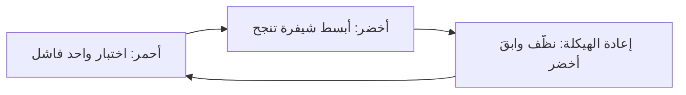
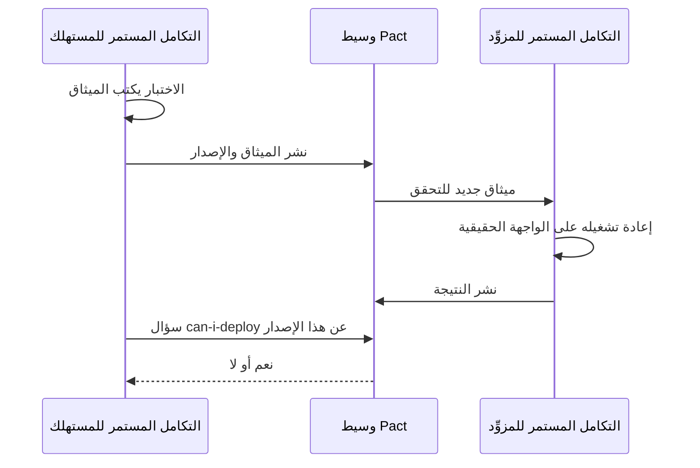
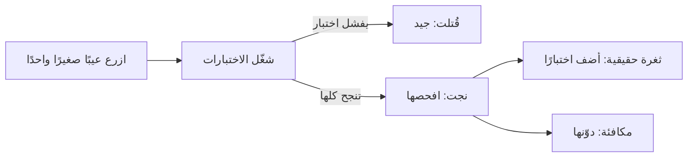

# الوحدة 2 — اختبار الشيفرة (Testing code)

*علّمتك الوحدة 1 (Module 1) كيف تقرر ما الذي تختبره (decide what to test). وتحوّل هذه الوحدة تلك القرارات إلى شيفرة (code) تعمل مع كل إيداع (commit) في بنك نجم (Najm Bank). يتناول الدرس 2.1 (Lesson 2.1) اختبارات الوحدة (unit tests)، وهي فحوص صغيرة وسريعة (small, fast checks) تجيب المطوّر (developer) في ثوانٍ، ويتناول التطوير الموجَّه بالاختبار (test-driven development, TDD)، أي عادة كتابة الاختبار الفاشل أولًا (writing the failing test first). وينتقل الدرس 2.2 إلى المواضع التي تكفّ فيها كائنات المحاكاة (mocks) عن الصدق (stop being honest): قواعد البيانات (databases) والطوابير (queues) واستدعاءات HTTP إلى الخدمات الأخرى (HTTP calls to other services) والعقود بين الفرق (the contracts between teams). ويطرح الدرس 2.3 السؤال الأهم، وهو أهم حين يكتب وكيل ذكاء اصطناعي (AI agent) اختباراتك: هل هذه الاختبارات جيدة فعلًا؟ ⁦(are these tests any good?)⁩ ستقيس مجموعة الاختبارات (suite) بتغطية الشيفرة (coverage)، وتكسر الشيفرة عمدًا (break the code on purpose) باختبار الطفرات (mutation testing)، وتدع Hypothesis تبحث عن مدخلات لم يفكر فيها أحد (inputs nobody thought of)، وتتعلم كشف الاختبارات غير المستقرة (flaky tests). كل شيء يعمل على [النظام النموذجي للدورة (the course's sample system)](https://github.com/Tamoura/system-design-for-vibe-coders/tree/main/testing/sample)، وهو تحويلات نجم (Najm Transfers)، فتشاهد كيف تلتقط كل تقنية العيوب المزروعة (seeded bugs) أو تُخطئها (catch or miss).*

> **التركيز (Focus):** Unit, Integration — كتابة اختبارات سريعة وصادقة (fast, honest tests) للشيفرة التي تملكها (the code you own)، وربطها بتبعيات حقيقية (real dependencies)، وإثبات أنها قادرة على الفشل (proving that they can fail).

---

# 2.1 — اختبار الوحدة والتطوير الموجَّه بالاختبار: التجهيز والتنفيذ والتأكيد، والبدائل الاختبارية، والتغذية الراجعة السريعة (Unit testing and TDD: arrange-act-assert, test doubles and fast feedback)
*المستوى (Level): 🟢 مبتدئ (Beginner)* · *المتطلبات (Prerequisites): 1.1* · *التركيز (Focus): Unit*

## ⚡ الدرس في دقيقة (In 60 seconds)
- يفحص **اختبار الوحدة (unit test)** سلوكًا صغيرًا واحدًا (one small behaviour) في أجزاء من الثانية (in milliseconds)، دون شبكة (network) أو قاعدة بيانات (database) أو ساعة حقيقية (real clock). ابنِه على نمط **التجهيز والتنفيذ والتأكيد (arrange, act, assert)** وسمِّه باسم القاعدة التي يحميها (name it after the rule it protects).
- استبدل فقط ما هو بطيء أو عشوائي أو خارج سيطرتك (slow, random or out of your control) **ببديل اختباري (test double)**: الكائن الشكلي (dummy) أو البديل ثابت الاستجابة (stub) أو المراقب (spy) أو كائن المحاكاة (mock) أو البديل المزيّف (fake).
- فضّل **اختبار الحالة (state testing)**، أي «ما الصحيح بعد ذلك؟» ⁦(what is true afterwards?)⁩، على **اختبار التفاعل (interaction testing)**، أي «أي استدعاءات حدثت؟» ⁦(which calls happened?)⁩. فاستبدال القاعدة المختبَرة بكائن محاكاة (Mocking away the rule under test) يُبقي الاختبار أخضر والنظام معطوبًا (the test green and the system broken).
- **التطوير الموجَّه بالاختبار (TDD)** حلقة (a loop): اختبار فاشل واحد (أحمر، red)، وأبسط شيفرة تنجح (أخضر، green)، ثم التنظيف (إعادة الهيكلة، refactor). استخدمه للقواعد التي تفهمها، لا للاستكشاف (not for exploration).
- إشارة القرار (Decision cue): سمِّ العيب الذي سيلتقطه الاختبار، وإلا فهو مجرد زينة (decoration).

## 🧭 لماذا يهم (Why it matters)
يوم الثلاثاء (On Tuesday) تفتح ندى (Nada) أول طلب دمج (pull request) لها في بنك نجم (Najm Bank): الصنف (class) `TransferDesk` الذي يرسل تحويلًا (submits a transfer) ويرسل رسالة نصية إلى العميل (texts the customer). فيه أربعة عشر اختبار وحدة (fourteen unit tests)، وكل سطر جديد مغطًّى (every new line covered). يشغّلها بلال (Bilal) وعيب `limit_off_by_one` في النظام النموذجي (the sample system) مفعَّل (switched on). تنجح الأربعة عشر كلها. يُرفض تحويل يجعل إجمالي اليوم 50,000.00 QAR بالضبط رفضًا خاطئًا (wrongly rejected)، ولا يلاحظ أي اختبار ذلك، لأن كل اختبار استبدل `TransferService` بكائن `Mock` يعيد جوابًا جاهزًا (a ready-made answer). تفحص الاختبارات أن المكتب يجري استدعاءات (makes calls). ولا واحد منها يشغّل القاعدة (runs the rule).

يطلب راشد (Rashid) من ندى أن تسمّي العيب الذي سيلتقطه كل اختبار (name the bug each test would catch). فلا تسمّي أيًّا منها. وهذا الدرس هو عُدّة الإصلاح (the repair kit): اختبارات سريعة ومقروءة وقادرة على الفشل (fast, readable and able to fail)، ومتى تستبدل متعاونًا (collaborator) ببديل مزيّف (fake)، وكيف يجعلك التطوير الموجَّه بالاختبار (TDD) ترى الاختبار يفشل أولًا (watch a test fail first). وفي عصر الذكاء الاصطناعي (AI era) يزداد هذا أهمية: فالوكيل (agent) يستطيع أن يكتب في ثوانٍ اختبارات سلسة مثقلة بكائنات المحاكاة (fluent, mock-heavy tests)، وعليك أنت أن تحكم عليها (judge them).

## 📐 كيف يعمل (How it works)

### 🟢 الأساسيات (The essentials)

**ما الوحدة (What a unit is).** الوحدة (*unit*) هي أصغر سلوك تستطيع تسميته وفحصه منفردًا (the smallest behaviour you can name and check alone): غالبًا دالة (function) مثل `fee`، وأحيانًا صنف صغير (a small class)، وليست أبدًا «ملفًا» (a file). يعمل **اختبار الوحدة (unit test)** داخل العملية نفسها (in-process)، في أجزاء من الثانية (in milliseconds)، دون شبكة (network) أو قاعدة بيانات (database) أو ساعة حقيقية (real clock) أو عشوائية (randomness).

**التجهيز والتنفيذ والتأكيد (Arrange, act, assert, AAA).** يبني *التجهيز (arrange)* المدخلات والكائنات (inputs and objects). ويستدعي *التنفيذ (act)* الشيء الواحد المختبَر (the one thing under test). ويفحص *التأكيد (assert)* النتيجة (the outcome). تنفيذان اثنان (Two acts): اختباران (two tests).

**التسمية (Naming).** اسم الاختبار (test name) هو أول ما يعرضه البناء الفاشل (a failing build). فالاسم `test_fee` لا يخبر الغريب بشيء (tells a stranger nothing)، أما `test_international_fee_is_rounded_half_up` فيسمّي القاعدة المكسورة (names the broken rule).

**FIRST.** خمس خصائص لاختبار الوحدة الجيد (Five properties of a good unit test): **سريع (Fast)** أي أجزاء من الثانية (milliseconds)، فتشغّله باستمرار (so you run it constantly)؛ و**معزول (Isolated)** فلا يحتاج اختبار إلى آخر يعمل قبله (no test needs another to run first)؛ و**قابل للتكرار (Repeatable)** بالنتيجة نفسها على أي جهاز وفي أي يوم (same result on any machine, any day)، لذا مرّر `now` من الخارج (pass now in)؛ و**ذاتي التحقق (Self-validating)** أي `assert` لا `print`؛ و**في الوقت المناسب (Timely)** أي مكتوب مع الشيفرة أو قبلها (written with or before the code).

**أساسيات pytest (pytest essentials).** يشغّل pytest الدوال المسماة `test_*` في الملفات المسماة `test_*.py`. أعلام مفيدة (Handy flags): `-q` للوضع الهادئ (quiet)، و`-k rounded` للاختيار بالاسم (select by name)، و`-x` للتوقف عند أول فشل (stop at the first failure)، و`--durations=5` لأبطأ خمسة اختبارات (slowest five). يعرض هذا الملف الميزات السبع التي تحتاجها في اليوم الأول (the seven features you need on day one).

```python
# tests/test_unit_essentials.py
from decimal import Decimal

import pytest

from najm.transfers import TransferRejected, TransferService, check_transfer, fee


def test_international_fee_is_rounded_half_up():
    amount = "3090"                                         # arrange: 3,090 x 0.35 % = 10.815
    result = fee(amount, "QAR", "international")            # act
    assert result == Decimal("10.82")                       # assert: the half goes up


@pytest.mark.parametrize("amount, expected", [
    pytest.param("1000", "0.00", id="1000-is-still-free"),
    pytest.param("1000.01", "2.00", id="just-over-pays-2"),
])
def test_domestic_fee_threshold(amount, expected):
    assert fee(amount, "QAR", "domestic") == Decimal(expected)


@pytest.fixture
def service():
    return TransferService()


def test_alice_cannot_spend_bobs_money(service):
    req = {"from_account": "acc-2", "to_account": "acc-1", "amount": "10", "currency": "QAR", "kind": "own"}
    with pytest.raises(TransferRejected, match="not_owner"):
        service.submit("alice", req, "k1")


@pytest.mark.slow                                           # `pytest -m "not slow"` skips it
def test_a_thousand_checks_stay_fast():
    for _ in range(1000):
        check_transfer("100", "QAR", "domestic")


def test_receipt_goes_to_a_temp_folder(tmp_path):
    receipt = tmp_path / "tr-1.txt"
    receipt.write_text(f"fee={fee('5000', 'QAR', 'domestic')}")
    assert receipt.read_text() == "fee=2.00"


def test_the_minimum_can_change_for_one_test(monkeypatch):
    monkeypatch.setattr("najm.transfers.MIN_TRANSFER", Decimal("50"))
    with pytest.raises(TransferRejected, match="below_minimum"):
        check_transfer("49.99", "QAR", "own")
```

سجّل الوسم (Register the marker) في `pytest.ini` (`markers = slow: tests over a second`). يعيد pytest كتابة `assert` العادي (rewrites plain assert) كي يُظهر الفشل الطرفين (a failure shows both sides). شغّل `NAJM_BUGS=float_fee pytest -k rounded` فيظهر عيب الفاصلة العائمة (float bug) في النظام النموذجي فرقًا مقروءًا (a readable diff) (مقتطعًا، trimmed):

```text
>       assert result == Decimal("10.82")
E       AssertionError: assert Decimal('10.81') == Decimal('10.82')
```

تجهيزات الاختبار (Fixtures) ومجلدات `tmp_path` وتعديلات `monkeypatch` كلها لكل اختبار على حدة (per test)، فلا يتسرب شيء (nothing leaks)؛ ويجعل `pytest.raises` الخطأ هو النتيجة المتوقعة (the expected result).

### 🟡 التعمق أكثر (Going deeper)

**البدائل الاختبارية (Test doubles).** يحل *البديل الاختباري (test double)* محل متعاون حقيقي (a real collaborator)، مثل بديل المشاهد الخطرة في السينما (a stunt double) (الأنواع الخمسة من كتاب *xUnit Test Patterns* لـ Gerard Meszaros؛ وانظر مقال Martin Fowler «Mocks Aren't Stubs»). أضف `TransferDesk` إلى النظام النموذجي (to the sample): يسأل مقيِّم المخاطر (a risk scorer)، ثم يرسل التحويل (submits)، ثم يرسل رسالة نصية (sends an SMS).

```python
# najm/desk.py
from najm.transfers import TransferRejected


class TransferDesk:
    def __init__(self, service, notifier, risk):
        self.service, self.notifier, self.risk = service, notifier, risk

    def send(self, user, req, key, now=None):
        if self.risk.score(user, req) >= 0.8:
            raise TransferRejected("held_for_review")
        transfer, created = self.service.submit(user, req, key, now)
        if created:
            self.notifier.sms(user, f"Sent {transfer['amount']} {transfer['currency']} (ref {transfer['id']})")
        return transfer
```

| البديل (Double) | ماذا يفعل (What it does) | مثال من نجم (Najm example) |
|---|---|---|
| **الكائن الشكلي (Dummy)** | يملأ معاملًا (parameter) لا يُقصد استخدامه أبدًا (never meant to be used) | كائن `object()` مجرد بدل المُخطِر (notifier): أي استخدام له يفشل بصوت عالٍ (fails loudly) |
| **البديل ثابت الاستجابة (Stub)** | يعيد إجابات جاهزة (canned answers) | يفرض `StubRisk(0.95)` حالة «خطورة عالية» (high risk) |
| **المراقب (Spy)** | يسجّل ما حدث ليفحصه المختبِر (records what happened, for you to inspect) | `SpyNotifier.sent` |
| **كائن المحاكاة (Mock)** | يحمل توقعات ويتحقق منها بنفسه (holds expectations and checks them itself) | `notifier.sms.assert_called_once()` |
| **البديل المزيّف (Fake)** | بديل يعمل فعلًا وخفيف الوزن (a working, lightweight stand-in) | `TransferService` الذي في الذاكرة (in-memory) بوصفه دفتر الحسابات (the ledger) |

يستطيع `unittest.mock.Mock` في Python أن يؤدي دور البديل ثابت الاستجابة (stub) أو المراقب (spy) أو كائن المحاكاة (mock) بحسب الاستخدام (depending on use): المهم هو الدور (the role)، لا الصنف (the class).

```python
# tests/test_doubles.py
from decimal import Decimal

import pytest

from najm.desk import TransferDesk
from najm.transfers import TransferRejected, TransferService

REQ = {"from_account": "acc-1", "to_account": "acc-2", "amount": "100.00", "currency": "QAR", "kind": "domestic"}


class StubRisk:                          # stub: a canned answer
    def __init__(self, score):
        self.value = score

    def score(self, user, req):
        return self.value


class SpyNotifier:                       # spy: records what it was asked to do
    def __init__(self):
        self.sent = []

    def sms(self, user, text):
        self.sent.append((user, text))


def test_a_held_transfer_sends_no_sms_and_moves_no_money():
    service = TransferService()                                  # a fake: a real, in-memory ledger
    desk = TransferDesk(service, object(), StubRisk(0.95))      # dummy: any object; using it raises AttributeError
    with pytest.raises(TransferRejected, match="held_for_review"):
        desk.send("alice", REQ, "k1")
    assert service.accounts["acc-1"]["balance"] == Decimal("12000.00")      # state


def test_an_accepted_transfer_texts_the_customer_once():
    spy = SpyNotifier()
    desk = TransferDesk(TransferService(), spy, StubRisk(0.1))
    desk.send("alice", REQ, "k1")
    desk.send("alice", REQ, "k1")                                # a retry with the same key
    assert spy.sent == [("alice", "Sent 100.00 QAR (ref tr-0001)")]         # interaction
```

يفحص الاختبار الأول *الحالة (state)* (الرصيد لم يتحرك، the balance did not move). ويفحص الثاني *تفاعلًا (interaction)* عبر مراقب (a spy): الوعد هو «أُخبر العميل مرة واحدة بالضبط، حتى عند إعادة المحاولة» (told exactly once, even on a retry).

**ساعة تتحكم بها (A clock you can control).** تأخذ `value_date(now)` و`submit(..., now)` الوقتَ معاملًا (take the time as a parameter). وهذا هو *الحقن (injection)*: يصبح موعد الإغلاق (cut-off) في الثالثة عصرًا (15:00) بتوقيت قطر بيانات اختبار (test data). وحين لا تستطيع تغيير التوقيع (the signature)، تجمّد `freezegun` الدالة `datetime.now()` بدلًا من ذلك (instead).

```python
# tests/test_clock.py
from datetime import datetime
from zoneinfo import ZoneInfo

import pytest
from freezegun import freeze_time

from najm.transfers import TransferService, value_date

REQ = {"from_account": "acc-1", "to_account": "acc-2", "amount": "100.00", "currency": "QAR", "kind": "domestic"}


@pytest.mark.parametrize("hour, minute, expected", [(14, 59, "2026-10-05"), (15, 0, "2026-10-06"), (15, 30, "2026-10-06")])
def test_cutoff_with_an_injected_clock(hour, minute, expected):
    now = datetime(2026, 10, 5, hour, minute, tzinfo=ZoneInfo("Asia/Qatar"))      # a Monday
    assert value_date(now).isoformat() == expected


@freeze_time("2026-10-05 12:30:00+00:00")                                         # 15:30 in Qatar
def test_cutoff_with_freezegun():
    transfer, _ = TransferService().submit("alice", REQ, "k")                     # no `now`: the service reads the clock
    assert transfer["value_date"] == "2026-10-06"
```

الحقن أبسط وأرخص بكثير (simpler and far cheaper): هنا استغرقت 1,000 استدعاء محقون (injected calls) بضعة أجزاء من الثانية (a few milliseconds)، واستغرقت 1,000 كتلة `freeze_time` نحو ثانيتين (about two seconds) (وستختلف نتائجك، yours will differ). وهو أيضًا زوج **ضعيف مقابل قوي (weak versus strong)**. يستخدم اختبار موعد الإغلاق في المجموعة الابتدائية (the starter suite's cut-off test) الساعة 10:00 بتوقيت قطر، فينجح حتى تحت `NAJM_BUGS=tz_cutoff`. أما حالتا 15:00 و15:30 فتفشلان تحته، لأن ذلك العيب يقرأ موعد الإغلاق بالتوقيت العالمي UTC: فهما قادرتان على الفشل (they can fail)، ولذلك فلهما معنى (they mean something).

**الحالة مقابل التفاعل، والإفراط في المحاكاة (State versus interaction, and over-mocking).** يؤكد *اختبار الحالة (state testing)* النتائج والتغييرات (results and changes). ويؤكد *اختبار التفاعل (interaction testing)* الاستدعاءات الموجهة إلى المتعاونين (calls to collaborators): وهو مناسب للآثار الجانبية التي تغادر نظامك (side effects that leave your system) مثل الرسالة النصية، ومحفوف بالمخاطر في غيرها، لأنه يثبّت *كيف* تعمل الشيفرة (pins how the code works). وأسوأ الحالات أن تستبدل المتعاون الذي يحمل القاعدة (replaces the collaborator that holds the rule). اختباران لوعد واحد (Two tests of one promise)، هو «آخر ريال من السقف اليومي مقبول» (the last riyal of the daily limit is accepted):

```python
# tests/test_overmocked.py
from decimal import Decimal
from unittest.mock import Mock

from najm.desk import TransferDesk
from najm.transfers import TransferService

RICH = {"acc-1": {"owner": "alice", "currency": "QAR", "balance": Decimal("100000")},
        "acc-2": {"owner": "bob", "currency": "QAR", "balance": Decimal("0")}}


class CalmRisk:
    def score(self, user, req):
        return 0.1


def own(amount):
    return {"from_account": "acc-1", "to_account": "acc-2", "amount": amount, "currency": "QAR", "kind": "own"}


def test_the_last_riyal_overmocked():                  # passes whatever the rules say
    service, notifier = Mock(), Mock()
    service.submit.return_value = ({"id": "tr-1", "amount": "1000.00", "currency": "QAR"}, True)
    TransferDesk(service, notifier, CalmRisk()).send("alice", own("1000.00"), "k")
    notifier.sms.assert_called_once()


def test_the_last_riyal_is_accepted():                 # runs the real rules
    desk = TransferDesk(TransferService(RICH), Mock(), CalmRisk())
    desk.send("alice", own("25000.00"), "k1")
    desk.send("alice", own("24000.00"), "k2")
    assert desk.send("alice", own("1000.00"), "k3")["status"] == "accepted"      # total: exactly 50,000
```

| التشغيل (Run) | الاختبار المفرط في المحاكاة (Over-mocked test) | اختبار القواعد الحقيقية (Real-rules test) |
|---|---|---|
| النظام النموذجي النظيف (Clean sample) | ينجح (passes) | ينجح (passes) |
| `NAJM_BUGS=limit_off_by_one` | **ينجح (passes)** | **يفشل (fails)** |

لا يثبت الاختبار الأول إلا أن `Mock` يعيد ما أخبرته به (returns what you told it)، ومع ذلك يبدو سليمًا في المراجعة (looks right in review). استخدم بديلًا مزيّفًا (a fake) أو الكائن الحقيقي (the real object) لكل ما يحمل قاعدة (anything holding a rule)، واحتفظ بكائنات المحاكاة (mocks) للحواف (edges) مثل الشبكة والرسائل النصية (network and SMS).

**روائح اختبار الوحدة (Unit test smells).** *المنطق داخل الاختبار (Logic in the test)* (الحلقات والمعادلة الإنتاجية، loops, the production formula) قد يخطئ بالطريقة نفسها التي تخطئ بها الشيفرة: استخدم قيمًا متوقعة حرفية (literal expected values). و*الحالة المتغيرة المشتركة (Shared mutable state)* (مثل `SERVICE` على مستوى الوحدة البرمجية، a module-level) تجعل النتائج تعتمد على الترتيب (depend on order): استخدم تجهيزًا (fixture). و*اختبار التفاصيل الخاصة (Testing private details)* (`svc._sent_today`) ينكسر عند إعادة الهيكلة (breaks on refactoring): أكّد السلوك العام (assert public behaviour). و*غياب التأكيد (No assertion)*، أو `assert result is not None`، لا يثبت إلا أن شيئًا لم ينهَر (nothing crashed). و*الإفراط في التحديد (Over-specification)* (نص الرسالة بالحرف، exact message text): أكّد `code` المستقر (assert the stable).

**ميزانيات السرعة (Speed budgets).** ميزانية نجم (Najm's budget): اختبار الوحدة أقل من 100 ms، والمجموعة (the suite) أقل من 60 ثانية على حاسوب محمول (a laptop)، وكل ما هو أبطأ يوسَم بـ`slow` (marked). يصنّف كتاب *Software Engineering at Google* الاختبارات بحسب ما يجوز لها لمسه (sizes tests by what they may touch) (الاختبار الصغير يبقى في عملية واحدة، دون شبكة أو نوم، a small test stays in one process, with no network or sleeping). وللخطوط (pipelines)، انظر [*السحابة وDevOps (Cloud & DevOps)*، الدرس 4.1 — التكامل المستمر (Continuous integration): خطوط الإنتاج (pipelines) والاختبارات (tests) والنواتج (artefacts) والتغذية الراجعة السريعة (fast feedback)](../cloud/index.ar.html#/4.1).

### 🔴 نظرة الخبير (Expert view)

**مثال تطبيقي على التطوير الموجَّه بالاختبار (TDD worked example).** يكرر *التطوير الموجَّه بالاختبار (test-driven development)* (Kent Beck، *Test-Driven Development: By Example*، 2002) حلقة في دورات صغيرة (repeats a loop in small cycles).



القصة (Story) TRF-240: *يرسل عملاء نجم بلس (Najm Plus) التحويلات المحلية مجانًا ويدفعون نصف رسم التحويل الدولي (pay half the international fee).* تبدأ ندى `najm/plus.py` هيكلًا (a skeleton) يعيد الرسم القياسي (the standard fee)، فيتعلق أول فشل بالسلوك لا باسم مفقود (about behaviour, not a missing name).

*الدورة 1، أحمر (Cycle 1, red):* يجب أن يكلّف تحويل محلي بنجم بلس بمبلغ 5,000 رسمًا قدره `0.00` (a Plus domestic transfer).

```text
E       AssertionError: assert Decimal('2.00') == Decimal('0.00')
```

*أخضر (Green):* أعد صفرًا للنوع `domestic`. *الدورة 2، أحمر (Cycle 2, red):* يجب أن يكلّف التحويل الدولي على 5,000 رسم `8.75`، أي نصف الرسم القياسي 17.50 (half of the standard).

```text
E       AssertionError: assert Decimal('17.50') == Decimal('8.75')
```

*أخضر (Green):* نصّف الرسم (halve the fee)، `quantize(fee(amount, currency, kind) / 2, currency)`. *الدورة 3، أحمر (Cycle 3, red).* يسأل راشد: هل نصّف الرسم المقرَّب (the rounded fee) 10.83، أم الرسم الدقيق (the exact one) 10.82599؟ المال يُقرَّب مرة واحدة في النهاية (Money is rounded once, at the end). تحسب ندى 3,093.14 يدويًا (by hand): نصف 10.82599 هو 5.412995، فالنتيجة 5.41.

```text
E       AssertionError: assert Decimal('5.42') == Decimal('5.41')
```

نصّفت شيفرة الدورة 2 عددًا مقرَّبًا (halved a rounded number)، و5.415 يُقرَّب إلى الأعلى فيصير 5.42، فوجد الاختبار الجديد عيبًا حقيقيًا (a real bug) في شيفرة كانت ناجحة أصلًا (code that already passed). ثم *أخضر (Green)*، ثم *إعادة الهيكلة (refactor)* بعد أن تراقبها الاختبارات الثلاثة كلها (with all three tests watching). الاختبارات، واحد لكل دورة، والشيفرة النهائية (the final code):

```python
# tests/test_plus.py
from decimal import Decimal

from najm.plus import plus_fee


def test_plus_customers_send_domestic_transfers_free():                 # cycle 1
    assert plus_fee("5000", "QAR", "domestic") == Decimal("0.00")


def test_plus_customers_pay_half_the_international_fee():               # cycle 2
    assert plus_fee("5000", "QAR", "international") == Decimal("8.75")


def test_the_half_is_taken_before_rounding_not_after():                 # cycle 3
    assert plus_fee("3093.14", "QAR", "international") == Decimal("5.41")      # not 5.42
```

```python
# najm/plus.py
from decimal import Decimal

from najm.transfers import fee, quantize

RATE, FLOOR, CAP = Decimal("0.0035"), Decimal("10"), Decimal("100")    # as in the standard fee


def plus_fee(amount, currency, kind):
    amount = Decimal(str(amount))
    if kind == "domestic":
        return quantize(0, currency)
    if kind == "international":
        standard = max(FLOOR, min(CAP, amount * RATE))      # unrounded
        return quantize(standard / 2, currency)             # rounded once, at the very end
    return fee(amount, currency, kind)
```

**أين يتألق التطوير الموجَّه بالاختبار وأين لا (Where TDD shines, and where not).** يتألق في القواعد التي تستطيع صياغتها أمثلةً (rules you can state as examples) (الرسوم والسقوف ومواعيد الإغلاق، fees, limits, cut-offs) وفي إصلاح العيوب (bug fixes): اكتب أولًا الاختبار الذي يعيد إنتاج العيب (reproduces the bug) واحتفظ به. ولا يناسب الاستكشاف (exploration) (جرّب وتعلّم وتخلَّص، ثم طوّر النسخة الحقيقية موجَّهًا بالاختبار، spike, learn, discard, then test-drive the real version)، ولا شيفرة الربط الرقيقة (thin glue code)، ولا واجهة المستخدم على مستوى البكسل (pixel-level UI)، ولا الشيفرة بلا نقاط فصل (code with no seams)، حيث تكتب أولًا اختبارات توصيفية (characterisation tests) (الدرس 2.3). ومع وكلاء البرمجة (coding agents) يصبح التطوير الموجَّه بالاختبار ضابطًا (a control): أنت تكتب الاختبار الفاشل أو تعتمده (write or approve the failing test)، والوكيل يجعله أخضر (the agent makes it green) (الدرس 6.2؛ [*تصميم الأنظمة لمبرمجي الفايب (System Design for Vibe Coders)*، الدرس 8.2 — الاختبارات بوصفها المواصفة التي لا يستطيع الوكيل تجاهلها (Tests as the spec the agent can't ignore)](../vibe/index.ar.html#l8-2)).

**الأفكار نفسها في TypeScript (The same ideas in TypeScript).** ينسّق عميل الويب في تطبيق نجم للهاتف (Najm Mobile) المال للعرض على الشاشة (formats money for the screen)؛ وداخل العميل تكون المبالغ وحدات صغرى كاملة (whole minor units) لا أعدادًا عشرية عائمة (never floats). ولدى Vitest الشكل نفسه الذي لدى pytest (has the same shape):

```typescript
// money.ts
type Currency = "QAR" | "KWD" | "JPY";
const DECIMALS: Record<Currency, number> = { QAR: 2, KWD: 3, JPY: 0 };

/** Whole minor units in, display text out: 123456 QAR becomes "1,234.56 QAR". */
export function formatMinor(minor: number, currency: Currency): string {
  if (!Number.isSafeInteger(minor) || minor < 0) throw new RangeError("non-negative whole minor units only");
  const d = DECIMALS[currency];
  const digits = String(minor).padStart(d + 1, "0");
  const whole = digits.slice(0, digits.length - d).replace(/\B(?=(\d{3})+(?!\d))/g, ",");
  return `${d > 0 ? `${whole}.${digits.slice(-d)}` : whole} ${currency}`;
}
```

```typescript
// money.test.ts
import { expect, it } from "vitest";
import { formatMinor } from "./money";

it.each([
  [123456, "QAR", "1,234.56 QAR"],
  [5, "QAR", "0.05 QAR"],
  [1234567, "KWD", "1,234.567 KWD"],
] as const)("formats %i %s as %s", (minor, currency, expected) => {
  expect(formatMinor(minor, currency)).toBe(expected);
});

it("rejects fractions and negatives instead of guessing", () => {
  expect(() => formatMinor(10.5, "QAR")).toThrow(RangeError);
  expect(() => formatMinor(-1, "QAR")).toThrow("non-negative");
});
```

شغّل `npm install -D vitest`، ثم `npx vitest run` (المخرجات مقتطعة، output trimmed):

```text
 Test Files  1 passed (1)
      Tests  4 passed (4)
```

## 🧰 الأدوات (The toolkit)
| الأداة أو الممارسة أو التقنية (Tool, practice or technique) | ما هي وماذا تفعل (What it is and does) | متى تلجأ إليها (When to reach for it) |
|---|---|---|
| **pytest** | مشغّل اختبارات Python بـ`assert` عادي وتجهيزات وتحديد معاملات ووسوم (Python runner with plain assert, fixtures, parametrize and markers) | أي اختبار وحدة أو تكامل بلغة Python (Any Python unit or integration test) |
| **Vitest** | مشغّل سريع لـ TypeScript/JavaScript بواجهة شبيهة بواجهة Jest (Fast TypeScript/JavaScript runner with a Jest-like API) | اختبارات الوحدة لشيفرة الويب وNode (Unit tests for web and Node code) |
| **Test doubles** (Meszaros) | الكائن الشكلي والبديل ثابت الاستجابة والمراقب وكائن المحاكاة والبديل المزيّف (Dummy, stub, spy, mock and fake stand-ins) | الحواف التي لا تتحكم بها: الشبكة والرسائل النصية والساعة (Edges you cannot control: network, SMS, clock) |
| **freezegun** | يجمّد `datetime.now()` للشيفرة المختبَرة (for the code under test) | قارئو الساعة الذين لا تستطيع تغييرهم (Clock readers you cannot change) |
| **Test-driven development** (Beck) | أحمر وأخضر وإعادة هيكلة في دورات صغيرة (Red, green, refactor in small cycles) | القواعد المصوغة أمثلةً وكل إصلاح لعيب (Rules stated as examples; every bug fix) |

## 🏛️ عمليًا في بنك نجم (In practice at Najm Bank)
يحوّل بلال أسئلة راشد إلى **معيار نجم لاختبار الوحدة، الإصدار 1 (Najm Unit Test Standard v1)**، وهو قائمة تحقق (a checklist) لكل طلب دمج (pull request) يخص التحويلات، سواء كتبه إنسان أو ذكاء اصطناعي (human or AI).

| # | القاعدة (Rule) | كيف يتحقق منها المراجع (How a reviewer checks it) |
|---|---|---|
| 1 | قاعدة واحدة لكل اختبار، ويحمل اسمها؛ تجهيز وتنفيذ وتأكيد (arrange, act, assert) | السطر الفاشل يشرح المشكلة وحده (The failing line explains the problem alone) |
| 2 | القيم المتوقعة قيم حرفية من مواصفة أو حساب يدوي (literals from a spec or hand calculation) | لا اختبار يعيد استخدام المعادلة (No test reuses the formula) |
| 3 | كائنات حقيقية أو بدائل مزيّفة للقواعد؛ وكائنات المحاكاة عند الحواف فقط (Real objects or fakes for rules; mocks only at the edges) | برّر كل `Mock(` في التعديلات المقترحة (Justify each Mock in the diff) |
| 4 | الساعة معامل (parameter)؛ لا `sleep` ولا شبكة ولا حالة مشتركة (shared state) | ينجح منفردًا وبأي ترتيب (Passes alone and in any order) |
| 5 | القواعد الجديدة تنال اختبارات حدّية على الجانبين (boundary tests on both sides) | اربطها بجدول الدرس 1.2 (Link the lesson 1.2 table) |
| 6 | **اكسره لتثق به (Break it to trust it):** يُظهر المؤلف الاختبار وهو يفشل مرة واحدة (the author shows the test failing once) | يلصق طلب الدمج المخرجات الحمراء (The PR pastes the red output) |
| 7 | أقل من 100 ms لكل اختبار؛ والأبطأ يوسَم `slow` (Under 100 ms per test) | `--durations=5` في مخرجات التكامل المستمر (CI output) |

## 🛠️ التمارين (Exercises)
انسخ النظام النموذجي (Copy the sample) (`cp -r testing/sample ~/najm-sample`)، وأنشئ بيئة افتراضية (virtual environment) ونفّذ `pip install -r requirements.txt freezegun`.

- 🟢 **سمِّه واكسره (Name it and break it).** اكتب ستة اختبارات مُحدَّدة بمعاملات (six parametrized tests) للدالة `fee`: محلي (domestic) عند 1000 و1000.01، ودولي (international) عند 100 و3090، وبين حساباتك (own) عند 500، والسقف (the cap) (`fee("100000", "QAR", "international")`)، ولكل منها `id` مقروء (a readable id). *يكتمل عندما (Done when):* تنص الأسماء على القاعدة (names state the rule)، ويُظهر `pytest -v` المعرّفات (the ids)، وتغيير `<=` إلى `<` في قاعدة التحويل المحلي يدويًا (by hand) يُفشل اختبارًا واحدًا بالضبط (exactly one test fail) (ثم أعدها، then restore it).
- 🟡 **بدائل وساعة (Doubles and a clock).** أضف `najm/desk.py` واختبره: المقيِّم يحتجز التحويل عند 0.8 بالضبط ولا يحتجزه عند 0.79 (holds a transfer at exactly 0.8 but not at 0.79) (بدائل ثابتة الاستجابة، stubs)، والتحويل المحتجز لا يرسل رسالة نصية (a held transfer sends no SMS) (كائن شكلي، dummy)، والمقبول يرسل واحدة (an accepted one sends one) (مراقب، spy)، وموعد الإغلاق يصمد عند 14:59 و15:00 و15:30 بتوقيت قطر (the cut-off holds) (ساعة محقونة، injected clock). *يكتمل عندما (Done when):* تكون المجموعة خضراء على النظام النموذجي النظيف (green on the clean sample)، وتفشل تحت `NAJM_BUGS=tz_cutoff`، ولا تستخدم كائن محاكاة بدل `TransferService` أبدًا (never mocks).
- 🔴 **طوّر قاعدة موجَّهًا بالاختبار، ثم اصطد الإفراط في المحاكاة (Test-drive a rule, then trap an over-mock).** طوّر TRF-241 موجَّهًا بالاختبار: «سقف نجم بلس اليومي يساوي 1.5 مثل السقف القياسي؛ أما الحد الأقصى للتحويل الواحد فلا يتغير» (the Najm Plus daily limit is 1.5 times the standard one; the per-transfer maximum is unchanged)، في ثلاث دورات أحمر–أخضر (three red-green cycles)، مع حفظ كل رسالة حمراء (saving each red message). ثم اكتب نسخة مفرطة في المحاكاة (over-mocked version) من أحد الاختبارات. *يكتمل عندما (Done when):* تقتبس ملاحظاتك ثلاث رسائل حمراء، وبعد أن تكسر قاعدتك يدويًا (`>` إلى `>=`) يظل الاختبار المفرط في المحاكاة ناجحًا بينما يفشل الاختبار الحقيقي (while the real one fails).

## ⚠️ أخطاء وفخاخ (Mistakes and traps)
- **محاكاة الشيء الذي تختبره (Mocking the thing you test).** الاختبار يثبت أن كائن المحاكاة يعمل (The test proves the mock works).
- **التأكيد على الاستدعاءات لا على النتائج (Asserting on calls, not results).** يثبّت `assert_called_with` الربط (wiring) لا الوعد (the promise).
- **قيم متوقعة منسوخة من مخرجات الشيفرة (Expected values copied from the code's output).** يعيد الاختبار صياغة التنفيذ (The test restates the implementation) (الدرس 1.1). استخدم سياسة أو حسابك الخاص (a policy or your own arithmetic).
- **ساعة حقيقية أو عشوائية أو حالة مشتركة (Real clock, randomness or shared state).** تنجح الاختبارات اليوم وتفشل يوم الجمعة (pass today, fail on Friday). احقن أو ثبّت البذرة أو أعد البناء (Inject, seed or rebuild).
- **ألّا ترى الاختبار يفشل أبدًا (Never seeing the test fail).** الاختبار الذي لم يكن أحمر قط قد لا يصير أحمر أبدًا (A test that has never been red may never go red). نفّذ خطوة الأحمر في التطوير الموجَّه بالاختبار (the TDD red step) أو بدّل مفتاح عيب مرة واحدة (flip a bug switch once).

## 🧾 الخلاصة (Recap)
- اختبار الوحدة يفحص سلوكًا واحدًا، بسرعة، بصيغة التجهيز والتنفيذ والتأكيد (arrange-act-assert)، باسم يذكر القاعدة (a name that states the rule).
- FIRST هو معيار الجودة (the quality bar)؛ والاختبار البطيء أو المعتمد على الترتيب عيب (a defect).
- كائنات حقيقية أو بدائل مزيّفة للقواعد (Real objects or fakes for rules)، وكائنات المحاكاة للحواف (mocks for edges)؛ احقن الساعة قبل أن تلجأ إلى freezegun.
- فحوص الحالة تصمد أمام إعادة الهيكلة (State checks survive refactoring)؛ وفحوص التفاعل تثبّت الربط (interaction checks pin wiring)؛ والإفراط في المحاكاة ينجح على نظام معطوب (over-mocking passes on a broken system).
- التطوير الموجَّه بالاختبار (TDD): شاهد الاختبار يفشل لسبب صحيح (for the right reason)، واكتب أصغر شيفرة، وأعد الهيكلة وأنت على الأخضر (refactor on green).

## ✍️ اختبر نفسك (Check yourself)

**1. يجب ألا يرسل التحويل المحتجز (held transfer) أي رسالة نصية. ويجب أن يعيد المقيِّم (scorer) 0.95، وأن يفشل المُخطِر (notifier) إن لُمس. أي البدائل (doubles) تناسب؟**

- A. كائن محاكاة (mock) للمقيِّم وبديل مزيّف (fake) للمُخطِر
- B. بديل ثابت الاستجابة (stub) للمقيِّم وكائن شكلي (dummy) للمُخطِر
- C. مراقب (spy) للمقيِّم وبديل ثابت الاستجابة (stub) للمُخطِر
- D. كائن شكلي (dummy) للمقيِّم وكائن محاكاة (mock) للمُخطِر

<details><summary>الإجابة</summary>

**B.** يعيد البديل ثابت الاستجابة (stub) القيمة الجاهزة 0.95 (the canned 0.95)؛ ويفشل الكائن الشكلي (dummy) بصوت عالٍ إن استُخدم (fails loudly if used)، فيثبت أنه لم تُجرَّب أي رسالة نصية. أما كائن المحاكاة (mock) أو المراقب (spy) فيسجّل الاستدعاءات (records calls). (🟡 البدائل الاختبارية، Test doubles).

</details>

**2. مع تفعيل `limit_off_by_one` ما زالت اختبارات مكتب ندى (Nada's desk tests) الأربعة عشر كلها تنجح. ما السبب الأرجح؟**

- A. لا تستطيع اختبارات الوحدة أبدًا العثور على عيوب الحدود في قواعد العمل (boundary bugs in business rules)
- B. شُغّلت المجموعة بسرعة أكبر من أن يظهر العيب في الوقت المناسب (ran too quickly)
- C. كل اختبار حاكى `TransferService` وأعاد جوابًا ثابتًا (returned a fixed answer)
- D. بقيت تغطية الأسطر (line coverage) للملف الجديد دون مئة بالمئة إجمالًا

<details><summary>الإجابة</summary>

**C.** مع محاكاة الخدمة لا تعمل قاعدة السقف (the limit rule never runs)، فلا يستطيع العيب أن يظهر. (🟡 الإفراط في المحاكاة، Over-mocking).

</details>

**3. يستدعي اختبار `submit(...)` دون `now` ويتوقع تاريخ القيمة لليوم (today's value date). ويفشل حين يعمل التكامل المستمر (CI) بعد الساعة 15:00 بتوقيت قطر. ما أفضل إصلاح؟**

- A. تمرير قيمة `now` ثابتة وتأكيد تاريخ مفحوص يدويًا (a hand-checked date)
- B. إضافة `time.sleep(2)` قبل تأكيد التاريخ
- C. إعادة تشغيل الاختبار تلقائيًا حتى ينجح في CI (Retry the test automatically)
- D. تخفيف التأكيد ليقبل أي تاريخ في أكتوبر (Loosen the assertion)

<details><summary>الإجابة</summary>

**A.** المدخل الخفي (hidden input) هو الساعة. حقنها يجعل الاختبار قابلًا للتكرار (repeatable). أما النوم وإعادة المحاولة فيخفيان التبعية (hide the dependency). (🟡 ساعة تتحكم بها، A clock you can control).

</details>

**4. في الدورة 3 من التطوير الموجَّه بالاختبار (TDD cycle 3) يفشل الاختبار الجديد بالرسالة `5.42 != 5.41`. ماذا بعد؟**

- A. تغيير القيمة المتوقعة إلى 5.42 لتصير المجموعة كلها خضراء (so the whole suite goes green)
- B. حذف الاختبار، لأن الاختبارين الأولين ينجحان أصلًا
- C. إعادة كتابة الدالة كلها قبل تشغيل أي اختبار من جديد
- D. إجراء أصغر تغيير ينجح به الاختبار، ثم إعادة الهيكلة على الأخضر (refactor on green)

<details><summary>الإجابة</summary>

**D.** الاختبار الأحمر لسبب صحيح (A red test for the right reason) يستدعي أصغر تغيير ناجح، ثم إعادة هيكلة على الأخضر. أما تعديل التوقع فيدفن عيبًا حقيقيًا (would bury a real bug). (🔴 مثال تطبيقي على التطوير الموجَّه بالاختبار، TDD worked example).

</details>

**5. يقرأ اختبار الحقل `svc._sent_today`. وبعد إعادة تسمية غير ضارة (a harmless rename) تفشل تسعة اختبارات. أي رائحة (smell) هذه؟**

- A. اختبار بلا تأكيد (An assertion-free test)
- B. حالة متغيرة مشتركة (Shared mutable state) بين اختبارات كثيرة
- C. اختبار التفاصيل الخاصة بالصنف (Testing private details of the class)
- D. منطق داخل جسم الاختبار (Logic inside the test body)

<details><summary>الإجابة</summary>

**C.** قراءة الحقول الخاصة (private fields) تكسر الاختبارات عند إعادة الهيكلة. أكّد السلوك العام (public behaviour)، مثل الرصيد أو رمز الرفض (the rejection code). (🟡 روائح اختبار الوحدة، Unit test smells).

</details>

## 📚 المراجع (References)
- توثيق pytest (pytest documentation) — https://docs.pytest.org/
- وحدة `unittest.mock` في Python (Python unittest.mock) — https://docs.python.org/3/library/unittest.mock.html
- Martin Fowler، «Mocks Aren't Stubs» — https://martinfowler.com/articles/mocksArentStubs.html
- Martin Fowler، «Test Double» — https://martinfowler.com/bliki/TestDouble.html
- Vitest — https://vitest.dev/
- *Software Engineering at Google* (2020) — https://abseil.io/resources/swe-book
- Kent Beck، *Test-Driven Development: By Example* (2002)؛ Gerard Meszaros، *xUnit Test Patterns* (2007)

---

# 2.2 — اختبار التكامل: قواعد البيانات والطوابير وبيانات الاختبار واختبارات العقد (Integration testing: databases, queues, test data and contract tests)
*المستوى (Level): 🟡 متوسط (Intermediate)* · *المتطلبات (Prerequisites): 2.1* · *التركيز (Focus): Integration*

## ⚡ الدرس في دقيقة (In 60 seconds)
- يشغّل **اختبار التكامل (integration test)** شيفرتك مقابل جار حقيقي (a real neighbour) من قاعدة بيانات أو طابور أو خدمة HTTP أو واجهة برمجة فريق آخر (database, queue, HTTP service, another team's API) ليفحص الوصلة (the join) لا المنطق (not the logic).
- كائن المحاكاة (mock) يوافق افتراضاتك (agrees with your assumptions)؛ والجار الحقيقي وحده يستطيع أن يخالفها (can disagree). اختبر حيث تنكسر الأمور (Test where they break): SQL والأنواع (types) وإعادة المحاولات (retries) والعقود (contracts).
- أبقِها سريعة ومعزولة (fast and isolated): تراجع (rollback) لكل اختبار، وبيانات فريدة (unique data)، ولا `sleep`، وساعة يمكن التحكم بها (a controllable clock).
- يفحص **اختبار العقد (contract test)** الشكل الذي اتفق عليه فريقان (the shape two teams agreed on) دون نشر الخدمتين معًا (without deploying both). وفي العقود **التي يقودها المستهلك (consumer-driven)** (Pact) يعلن المستهلك (consumer) احتياجاته ويثبتها المزوِّد (provider proves them).
- إشارة القرار (Decision cue): إن كان بإمكان عيب أن يسكن الوصلة (live in the join)، فلن يجده اختبار الوحدة (a unit test cannot find it).

## 🧭 لماذا يهم (Why it matters)
إصدار `TransferRepository` يوم الجمعة (Friday's release) فيه 300 اختبار وحدة خضراء (green unit tests)، يستبدل كل منها قاعدة البيانات بقاموس (swapping the database for a dict). وفي بيئة ضمان الجودة (In QA) يظهر إجمالي اليوم لثلاثة تحويلات بقيمة 0.10 QAR هو 0.30000000000000004، لأن مطوّرًا عرّف عمود المبلغ (the amount column) بالنوع `REAL`. ولا يستطيع كائن المحاكاة (A mock) أن يعرف ماذا تفعل قاعدة البيانات بالعدد (what a database does with a number). وفي ظهيرة اليوم نفسه يعيد التطبيق محاولة طلب POST ضاع ردّه (retries a POST whose reply was lost)، فيُخصم من العميل مرتين (the customer is debited twice).

يقول راشد (Rashid): «تقول اختبارات الوحدة إن الأجزاء صحيحة (the parts are right)؛ وتقول اختبارات التكامل إنها موصولة صوابًا (connected right).» وقد يضيف وكيل ذكاء اصطناعي (AI agent) يكتب مستودعًا (a repository) اتصالًا من نوع `MagicMock`: اسأل أين الحدّ الحقيقي (where the real boundary is).

## 📐 كيف يعمل (How it works)

### 🟢 الأساسيات (The essentials)

**لماذا لا تكفي كائنات المحاكاة (Why mocks are not enough).** يخفي كائن المحاكاة (A mock) ما يفعله الجار فعلًا (what the neighbour really does): الأنواع والقيود (types and constraints) في قاعدة البيانات، والترتيب والتوقيت (ordering and timing) في الطابور، ورموز الحالة (status codes) ومهلات الانتظار (timeouts) في خدمة HTTP، والانجراف بين الإصدارات (drift between releases) في واجهة فريق آخر. استخدم الشيء الحقيقي حيث يكون رخيصًا، وبديلًا ثابت الاستجابة (a stub) أو عقدًا (contract) حيث لا يكون.

**الهرم والكأس وخلية النحل (Pyramid, trophy, honeycomb).** يريد *هرم الاختبار (test pyramid)* (Mike Cohn؛ Martin Fowler) اختبارات وحدة كثيرة (many unit tests)، واختبارات تكامل أقل (fewer integration tests)، واختبارات شاملة من البداية إلى النهاية قليلة (few end-to-end tests). أما *الكأس (trophy)* عند Kent C. Dodds فتمنح اختبارات التكامل أكبر وزن (weights integration tests most)؛ و*خلية النحل (honeycomb)* عند Spotify، للخدمات المصغّرة (microservices)، تضع أكبر وزن على نقاط تكامل الخدمة (a service's integration points). وهي تختلف في التشديد لا في المبدأ (emphasis, not principle): اختبر حيث تعيش العيوب (test where bugs live) (انظر الدرس 5.1).

**قاعدة بيانات حقيقية بسرعة اختبار الوحدة (A real database at unit speed).** تُخزَّن المبالغ وحدات صغرى كاملة (whole minor units)، لا `REAL` أبدًا. فيما يلي المستودع (The repository)، وتجهيزات (fixtures) تمنح كل اختبار قاعدة SQLite في الذاكرة (in-memory) داخل معاملة (transaction) يُتراجع عنها بعد ذلك (rolled back afterwards)، ومُنشئ (builder) بقيم افتراضية صالحة ومعرّفات فريدة (valid defaults and unique ids) (Faker، ببذرة ثابتة، seeded):

```python
# najm/repository.py
import sqlite3
from decimal import Decimal

from najm.transfers import MINOR_UNITS

SCHEMA = """
CREATE TABLE transfers (
    id TEXT PRIMARY KEY, owner TEXT NOT NULL, idem_key TEXT NOT NULL,
    amount_minor INTEGER NOT NULL,                            -- whole minor units, never REAL
    currency TEXT NOT NULL, value_date TEXT NOT NULL,
    UNIQUE (owner, idem_key)
)"""


class DuplicateKey(Exception):
    pass


class TransferRepository:
    def __init__(self, conn: sqlite3.Connection):
        self.conn = conn

    def add(self, t: dict) -> None:
        minor = int(Decimal(t["amount"]).scaleb(MINOR_UNITS[t["currency"]]))
        try:
            self.conn.execute("INSERT INTO transfers VALUES (?, ?, ?, ?, ?, ?)",
                              (t["id"], t["owner"], t["idem_key"], minor, t["currency"], t["value_date"]))
        except sqlite3.IntegrityError as e:
            if "idem_key" in str(e):                              # a repeated id is another error
                raise DuplicateKey(t["idem_key"]) from e
            raise

    def sent_on(self, owner: str, currency: str, day: str) -> Decimal:
        (minor,) = self.conn.execute(
            "SELECT COALESCE(SUM(amount_minor), 0) FROM transfers WHERE owner = ? AND currency = ? AND value_date = ?",
            (owner, currency, day)).fetchone()
        return Decimal(minor).scaleb(-MINOR_UNITS[currency])
```

```python
# tests/conftest.py
import sqlite3

import pytest

from najm.repository import SCHEMA, TransferRepository


@pytest.fixture(scope="session")
def _database():
    db = sqlite3.connect(":memory:", isolation_level=None)   # autocommit: we choose when to BEGIN
    db.execute(SCHEMA)
    yield db
    db.close()


@pytest.fixture
def conn(_database):
    _database.execute("BEGIN")
    yield _database
    _database.execute("ROLLBACK")                            # whatever the test did is undone


@pytest.fixture
def repo(conn):
    return TransferRepository(conn)
```

```python
# tests/builders.py
from faker import Faker

fake = Faker()
Faker.seed(2026)                                             # same "random" data on every run


def a_transfer(**overrides) -> dict:
    transfer = {"id": fake.uuid4(), "owner": "alice", "idem_key": fake.uuid4(),
                "amount": "250.00", "currency": "QAR", "value_date": "2026-10-05"}
    return {**transfer, **overrides}
```

```python
# tests/test_repository.py
from decimal import Decimal

import pytest
from builders import a_transfer

from najm.repository import DuplicateKey


def test_the_daily_total_is_exact(repo):
    for _ in range(3):
        repo.add(a_transfer(amount="0.10"))
    assert repo.sent_on("alice", "QAR", "2026-10-05") == Decimal("0.30")      # float storage gives 0.30000000000000004


def test_the_database_refuses_a_repeated_idempotency_key(repo):
    repo.add(a_transfer(idem_key="k1"))
    with pytest.raises(DuplicateKey):
        repo.add(a_transfer(idem_key="k1"))
    repo.add(a_transfer(owner="bob", idem_key="k1"))                          # another customer may reuse the key
```

اختبار المجموع زوج **ضعيف مقابل قوي (weak versus strong)**. اتصال محاكى بإجمالي ثابت الاستجابة (A mocked connection with a stubbed total) ينجح أيًّا كان نظام التخزين (whatever the storage scheme). أما هذا الاختبار فيفشل أمام تصميم يوم الجمعة (Friday's design)، وهو عمود `REAL` يُملأ بـ`float(t["amount"])`: إذ يعطي `SELECT 0.1+0.1+0.1` في SQLite القيمة `0.30000000000000004`. أما تصميمنا فيخزّن وحدات صغرى كاملة في عمود `INTEGER`، والأعداد الصحيحة تُجمع جمعًا دقيقًا (integers add exactly). وهناك فخ واحد (One trap): ينكسر العزل بالتراجع (rollback isolation) حين تُثبّت الشيفرة المختبَرة التغييرات (commits). فالاختبار الذي ينفّذ `COMMIT` يترك صفه خلفه (leaves its row behind)، ويخطئ `ROLLBACK` في التجهيز (`cannot rollback - no transaction is active`)، ويرى الاختبار التالي صفًا واحدًا. احذف الصفوف بعد كل اختبار (Delete rows after each test)، أو استخدم وضع نقاط الحفظ (savepoint mode) في مكتبة ORM، حيث لا يفعل تثبيت الشيفرة (the code's commit) سوى تحرير نقطة الحفظ (only releases the savepoint).

### 🟡 التعمق أكثر (Going deeper)

**SQLite ليست PostgreSQL (SQLite is not PostgreSQL).** تناسب SQLite الفحوص السريعة للشيفرة المحايدة لهجةً (fast checks of dialect-neutral code) لكنها تختلف حيث تتأذى البنوك. *الأنواع (Types):* مرنة التنميط (loosely typed) (جاءت الجداول الصارمة في الإصدار 3.37، strict tables)، في مقابل `numeric(18, 3)` الدقيق في PostgreSQL. *التزامن (Concurrency):* كاتب واحد في كل مرة (one writer at a time)، في مقابل أقفال الصفوف (row locks) و`SELECT ... FOR UPDATE`. *القيود (Constraints):* المفاتيح الأجنبية (foreign keys) معطّلة حتى تُفعَّل لكل اتصال (off until enabled per connection).

استخدم SQLite للأغلبية الرخيصة (the cheap majority)، و**Testcontainers** (يشغّل حاوية Docker مؤقتة، it starts a throwaway Docker container) للأقفال و`numeric` والترحيلات (migrations) ولهجة SQL (dialect). هذه النسخة **غير منفَّذة هنا (not executed here)** (فهي تحتاج Docker؛ `pip install "testcontainers[postgres]" "psycopg[binary]"`)، وتختلف مسارات الاستيراد (import paths) بين إصدارات testcontainers-python.

```python
# tests/test_transfers_postgres.py
from decimal import Decimal

import psycopg
import pytest
from testcontainers.community.postgres import PostgresContainer     # older releases: testcontainers.postgres


@pytest.fixture(scope="session")
def pg():
    with PostgresContainer("postgres:16-alpine") as container:       # a real, throwaway PostgreSQL
        url = container.get_connection_url().replace("+psycopg2", "")
        with psycopg.connect(url, autocommit=True) as conn:
            conn.execute("CREATE TABLE transfers (id text PRIMARY KEY, amount numeric(18, 3) NOT NULL)")
            yield conn


@pytest.fixture
def pg_conn(pg):
    with pg.transaction(force_rollback=True):          # always rolled back
        yield pg


def test_numeric_sums_are_exact(pg_conn):
    for i in range(3):
        pg_conn.execute("INSERT INTO transfers VALUES (%s, 0.10)", (f"tr-{i}",))
    (total,) = pg_conn.execute("SELECT SUM(amount) FROM transfers").fetchone()
    assert total == Decimal("0.30")
```

**بيانات الاختبار (Test data).** يمنح *المُنشئ (builder)* كل حقل قيمة افتراضية صالحة (a valid default)، فيسمّي الاختبار ما يهم فقط: `a_transfer(amount="0.10")`. أربع استراتيجيات للعزل (isolation strategies): *التراجع لكل اختبار (roll back per test)* (الافتراضي؛ ينكسر إن ثبّتت الشيفرة التغييرات (commits) أو استخدمت اتصالات أو خيوطًا أخرى، other connections or threads)، و*الحذف أو التفريغ بعد كل اختبار (delete or truncate after each test)* (للشيفرة التي تثبّت التغييرات؛ وهو أبطأ، slower)، و*بيانات فريدة لكل اختبار (unique data per test)* (للبيئات المشتركة؛ وتترك بقايا، leaves leftovers)، و*قاعدة بيانات جديدة لكل وحدة (fresh database per module)* (الأبطأ، slowest).

ابنِ قاعدة بيانات الاختبار بتشغيل **ترحيلاتك الحقيقية (real migrations)** من الفراغ (from empty)، لا بمخطط منسوخ يدويًا (never a hand-copied schema)، وأضف اختبار ترقية (upgrade test): أنشئها بالإصدار N−1، وأدخل صفوفًا، ورحِّل إلى N، وتحقق أنها نجت (check they survive) ([*لبنات بناء SaaS (SaaS Building Blocks)*، الدرس 2.1 — طبقة البيانات: Postgres وORMs والترحيلات والبيانات الأولية (The data layer: Postgres, ORMs, migrations and seeds)](../saas/index.ar.html#/2.1)). بيانات الاختبار اصطناعية أو مقنَّعة (synthetic or masked)، لا بيانات عملاء أبدًا (never customer data)؛ و`Faker("ar_AA")` تولّد أسماء عربية (Arabic names).

**التزامن والطوابير: لا تنم وتأمل (Async and queues: never sleep and hope).** يستدعي الاختبار الضعيف `time.sleep(2)` ثم يؤكد: قصير جدًا على CI البطيء (too short on slow CI)، وبطيء جدًا في غيره (too slow elsewhere). وثلاث أدوات تحل محله. **نقطة الفصل (seam)**، وهي موضع تبديل السلوك دون تعديل الشيفرة (a place to swap behaviour without editing the code)، تتيح لك اختبار منطق المعالج (the handler's logic) بشكل متزامن (synchronously)، مع اختبار واحد متعدد الخيوط (one threaded test) للربط (wiring). و**مساعد الانتظار (waiting helper)** يستطلع الحالة حتى مهلة محددة (polls against a deadline). و**الساعة المزيّفة (fake clock)** تسجّل التأخيرات بدل الانتظار (records delays instead of waiting) (انظر اختبار إعادة المحاولة، see the retry test).

```python
# najm/worker.py
def run_worker(inbox, notifier):
    """Send each (user, text) message from the queue; stop at None."""
    while (message := inbox.get()) is not None:
        notifier.sms(*message)
```

```python
# tests/test_worker.py
import queue
import threading
import time
from types import SimpleNamespace

from najm.worker import run_worker


def wait_until(check, timeout=2.0, what="the condition"):
    deadline = time.monotonic() + timeout
    while not check():
        assert time.monotonic() < deadline, f"timed out after {timeout}s waiting for {what}"
        time.sleep(0.005)


def test_the_worker_delivers_in_order_without_a_fixed_sleep():
    inbox, sent = queue.Queue(), []
    notifier = SimpleNamespace(sms=lambda user, text: sent.append((user, text)))
    thread = threading.Thread(target=run_worker, args=(inbox, notifier), daemon=True)
    thread.start()
    for n in range(3):
        inbox.put(("alice", f"message {n}"))
    wait_until(lambda: len(sent) == 3, what="3 messages")
    inbox.put(None)                       # tell the worker to stop
    thread.join(timeout=2)
    assert [text for _, text in sent] == ["message 0", "message 1", "message 2"]
```

**حدود HTTP (HTTP boundaries).** لا تستطيع أن تجعل خدمة شريك تنقضي مهلتها عند الطلب (make a partner's service time out on demand)، فاستبدل بها بديلًا ثابت الاستجابة (stub it). تحاكي `respx` المكتبة `httpx`؛ أما WireMock فخادم مستقل (standalone server) يصلح لأي لغة (for any language).

```python
# najm/fx.py
from decimal import Decimal, InvalidOperation

import httpx


class FxUnavailable(Exception):
    pass


def rate(base_url: str, base: str, quote: str) -> Decimal:
    try:
        r = httpx.get(f"{base_url}/rates", params={"base": base, "quote": quote}, timeout=2.0)
        r.raise_for_status()
        return Decimal(str(r.json()["rate"]))                # str(): never Decimal(a float)
    except (httpx.HTTPError, KeyError, InvalidOperation, ValueError) as e:
        raise FxUnavailable(f"{base}/{quote}") from e
```

```python
# tests/test_fx.py
import httpx
import pytest
import respx

from najm.fx import FxUnavailable, rate

URL = "https://fx.najm.example"


@respx.mock
@pytest.mark.parametrize("failure", [
    pytest.param({"side_effect": httpx.ConnectTimeout}, id="timeout"),
    pytest.param({"return_value": httpx.Response(503)}, id="server-error"),
    pytest.param({"return_value": httpx.Response(200, json={"oops": 1})}, id="shape-changed"),
    pytest.param({"return_value": httpx.Response(200, json={"rate": "n/a"})}, id="garbled-rate"),
])
def test_a_broken_fx_service_becomes_one_clear_error(failure):
    respx.get(f"{URL}/rates", params={"base": "QAR", "quote": "EUR"}).mock(**failure)     # matches only this pair
    with pytest.raises(FxUnavailable):
        rate(URL, "QAR", "EUR")
```

أدوات *التسجيل وإعادة التشغيل (Record and replay)* (أشرطة بأسلوب VCR وتسجيل WireMock، VCR-style cassettes, WireMock recording) تلتقط الحركة الحقيقية (real traffic) مرة واحدة، لكن التسجيل يظل ناجحًا بعد أن يتغير المزوِّد (keeps passing after the provider changes)، وقد يحمل رموزًا (tokens) أو بيانات عملاء، ويجمّد المسار السعيد (freezes the happy path). استخدم البدائل ثابتة الاستجابة (stubs) للإخفاقات (for failures)، والعقود (contracts) للشكل (for shape).

### 🔴 نظرة الخبير (Expert view)

**العقود التي يقودها المستهلك مع Pact (Consumer-driven contracts with Pact).** الخلفية (backend) لتطبيق نجم للهاتف (Najm Mobile) وواجهة التحويلات (Transfers API) تتبعان فريقين مختلفين (different squads)؛ والفحوص الشاملة من البداية إلى النهاية (end-to-end checks) لكل إصدار بطيئة وغير مستقرة (slow and flaky). ومع **Pact** تسجّل اختبارات المستهلك احتياجاتها في ملف *ميثاق (pact)*، ويعيد المزوِّد تشغيله على الواجهة الحقيقية (replays it against the real API)، ويتتبع *وسيط (broker)* أي الإصدارات متوافقة (which versions are compatible).



يستخدم الملفان واجهة pact-python 3 (`pip install pact-python`؛ اختلف الإصدار 2.x؛ واختُبرا مع 3.4). احفظهما في جذر النظام النموذجي (the sample root)؛ وشغّل `pytest consumer_test.py` ثم `pytest provider_test.py` (قد تعكس إضافة الخلط ترتيبهما، a shuffling plugin could reverse them). يبدأ اختبار المزوِّد (The provider test) الواجهة الحقيقية ويعيد تشغيل الميثاق (replays the pact):

```python
# consumer_test.py
import httpx
from pact import Pact, match

BODY = {"from_account": "acc-1", "to_account": "acc-2", "amount": "250.00", "currency": "QAR", "kind": "domestic"}
HEADERS = {"Authorization": "Bearer token-alice", "Idempotency-Key": "key-1"}


def test_creating_a_domestic_transfer():
    pact = Pact("najm-mobile", "najm-transfers-api")
    (
        pact.upon_receiving("a domestic transfer of 250 QAR")
        .given("alice owns acc-1 and has enough money")
        .with_request("POST", "/transfers")
        .with_headers(HEADERS)
        .with_body(BODY, content_type="application/json")
        .will_respond_with(201)
        .with_body(
            {
                "id": match.str("tr-0001"),
                "status": "accepted",
                "fee": match.regex("0.00", regex=r"^\d+\.\d{2}$"),
                "value_date": match.regex("2026-10-05", regex=r"^\d{4}-\d{2}-\d{2}$"),
            },
            content_type="application/json",
        )
    )
    with pact.serve() as server:                       # a mock provider that checks the request
        reply = httpx.post(f"{server.url}/transfers", json=BODY, headers=HEADERS)
        assert reply.json()["status"] == "accepted"
    pact.write_file("pacts", overwrite=True)           # the contract, as a JSON file
```

```python
# provider_test.py
import socket
import threading
import time

import uvicorn
from pact import Verifier

from najm.api import create_app


def test_the_transfers_api_honours_the_najm_mobile_pact():
    with socket.socket() as s:                       # ask the OS for a free port
        s.bind(("localhost", 0))
        port = s.getsockname()[1]
    server = uvicorn.Server(uvicorn.Config(create_app(), host="localhost", port=port, log_level="warning"))
    thread = threading.Thread(target=server.run, daemon=True)
    thread.start()
    while not server.started:
        time.sleep(0.05)
    try:
        (
            Verifier("najm-transfers-api")
            .add_transport(url=f"http://localhost:{port}")
            .add_source("pacts/najm-mobile-najm-transfers-api.json")
            .state_handler({"alice owns acc-1 and has enough money": lambda: None})
            .verify()
        )
    finally:
        server.should_exit = True
        thread.join(timeout=5)
```

الآن ينظّف فريق المزوِّد (provider squad) `value_date` فيجعله `valueDate`. لا يفشل أي اختبار وحدة في المزوِّد (No provider unit test fails)، لأنها تختبر تصور المزوِّد نفسه لشكله (the provider's own idea of its shape). أما التحقق (The verification) فيفشل (مقتطعًا، trimmed):

```text
has a matching body (FAILED)
$ -> Actual map is missing the following keys: value_date
```

في التكامل المستمر (In CI) ينشر المستهلك الميثاق إلى وسيط (publishes the pact to a broker) (`pact-broker publish`) ويحرس `can-i-deploy` كل إصدار (gates each release). لم يُشغَّل هنا (Not run here) (لا وسيط، no broker)؛ راجع docs.pact.io لمعرفة الأعلام الحالية (current flags).

```bash
pact-broker can-i-deploy --pacticipant najm-mobile --version "$GIT_SHA" --to-environment production
```

**فحص مخطط قابل للتنفيذ (An executable schema check).** مع فريق واحد، أو واجهة برمجة عامة بمستهلكين مجهولين (a public API with unknown consumers)، يكون فحص JSON Schema (أو OpenAPI) أبسط (simpler) (`pip install jsonschema`):

```python
# tests/test_contract_schema.py
import pytest
from fastapi.testclient import TestClient
from jsonschema import ValidationError, validate

from najm.api import create_app

TRANSFER_V1 = {                                   # what Najm Mobile reads; extra provider fields are fine
    "type": "object",
    "required": ["id", "status", "fee", "value_date"],
    "properties": {
        "fee": {"type": "string", "pattern": r"^\d+\.\d{2,3}$"},        # money travels as a string, never a float
        "value_date": {"type": "string", "pattern": r"^\d{4}-\d{2}-\d{2}$"},
    },
}
BODY = {"from_account": "acc-1", "to_account": "acc-2", "amount": "250.00", "currency": "QAR", "kind": "domestic"}


def test_create_transfer_matches_the_contract():
    response = TestClient(create_app()).post(
        "/transfers", json=BODY, headers={"Authorization": "Bearer token-alice", "Idempotency-Key": "k1"})
    validate(response.json(), TRANSFER_V1)


def test_the_check_can_fail():
    drifted = {"id": "tr-0001", "status": "accepted", "fee": 0.0, "value_date": "2026-10-05"}
    with pytest.raises(ValidationError, match="0.0 is not of type 'string'"):
        validate(drifted, TRANSFER_V1)
```

يحذف المخطط `additionalProperties: false`، فيجوز للمزوِّد إضافة حقول (a tolerant reader، أي قارئ متسامح). تفحص العقود *الشكل (shape)* لا الصحة (correctness): فرسم خاطئ بالشكل الصحيح (a wrong fee of the right shape) (`10.81` بدل `10.82`، عيب `float_fee`) يجتاز أي مخطط كهذا. اقرن العقود باختبارات الخصائص (property tests) في الدرس 2.3.

**عدم التكرار وإعادة المحاولات (Idempotency and retries).** نبدأ بالرد الضائع من القصة الافتتاحية (the lost reply from the opening story): يعيد العميل المحاولة بالمفتاح نفسه (retries with the same key)، فيجب أن يعيد الخادم تقديم النتيجة لا تكرار العملية (replay, not repeat). ويسجّل `sleep` مزيّف فترة التراجع (a fake sleep records the backoff):

```python
# najm/retry.py
def post_with_retry(send, body, headers, sleep, attempts=3, delay=1.0):
    for attempt in range(attempts):
        try:
            return send(body, headers)          # the SAME headers, so the same Idempotency-Key
        except ConnectionError:
            if attempt == attempts - 1:
                raise
            sleep(delay * 2 ** attempt)
```

```python
# tests/test_retry.py
from fastapi.testclient import TestClient

from najm.api import create_app
from najm.retry import post_with_retry

BODY = {"from_account": "acc-1", "to_account": "acc-2", "amount": "250.00", "currency": "QAR", "kind": "domestic"}
HEADERS = {"Authorization": "Bearer token-alice", "Idempotency-Key": "retry-1"}


def test_a_retry_after_a_lost_reply_moves_the_money_once():
    client, delays, calls = TestClient(create_app()), [], []

    def send(body, headers):                   # every request arrives; the first reply is lost
        calls.append(1)
        response = client.post("/transfers", json=body, headers=headers)
        if len(calls) == 1:
            raise ConnectionError("reply lost")
        return response

    response = post_with_retry(send, BODY, HEADERS, sleep=delays.append)     # a fake clock: record, never wait
    assert client.get("/accounts/acc-1/balance", headers=HEADERS).json()["balance"] == "11750.00"   # debited once
    assert (delays, response.status_code) == ([1.0], 200)
```

تحت `NAJM_BUGS=no_idempotency` يروي التأكيد الأول القصة (the first assertion tells the story):

```text
E       AssertionError: assert '11500.00' == '11750.00'
```

الآن طلبان بمفتاح واحد يصلان *معًا (together)*. نادرًا ما تظهر حالات التسابق (Races) من تلقاء نفسها، لذا يفرض الاختبار واحدة: دالة `check_transfer` مُرقَّعة (patched) تجعل كل خيط (thread) ينتظر عند `Barrier` داخل `submit` حتى يكون الاثنان قد بحثا عن المفتاح (looked up the key).

```python
# tests/test_double_submit.py
import threading

import najm.transfers as transfers
from najm.transfers import TransferService

REQ = {"from_account": "acc-1", "to_account": "acc-2", "amount": "100.00", "currency": "QAR", "kind": "domestic"}


def test_the_in_memory_service_survives_a_double_submit(monkeypatch):
    service, barrier, real_check, results = TransferService(), threading.Barrier(2), transfers.check_transfer, []

    def check_after_both_lookups(*args, **kwargs):
        try:
            barrier.wait(timeout=0.5)          # hold each thread until both have looked the key up
        except threading.BrokenBarrierError:
            pass                               # a serialised service never fills the barrier
        return real_check(*args, **kwargs)

    def submit():
        results.append(service.submit("alice", REQ, "same-key"))

    monkeypatch.setattr(transfers, "check_transfer", check_after_both_lookups)
    threads = [threading.Thread(target=submit) for _ in range(2)]
    for t in threads:
        t.start()
    for t in threads:
        t.join()
    assert sorted(created for _, created in results) == [False, True]            # one transfer, not two
    assert str(service.accounts["acc-1"]["balance"]) == "11900.00"               # debited once
```

على النظام النموذجي كما شُحن (On the sample as shipped) يفشل:

```text
E       assert [True, True] == [False, True]
```

هذه نتيجة اكتُشفت (a finding)، لا عيب مزروع (not a seeded bug): تفحص `submit` المفتاح وتسجّله لاحقًا، دون شيء ذري بينهما (nothing atomic between). لا ضرر في خيط واحد (Harmless in one thread)، لكنه خصم مزدوج (a double debit) في مجمع خيوط (a thread pool). ويصلحه حجز ذري (An atomic claim) (قفل هنا، ومحدد فريد (unique constraint) في قاعدة بيانات)، ويبقى هذا الاختبار اختبار انحدار (the regression test).

## 🧰 الأدوات (The toolkit)
| الأداة أو الممارسة أو التقنية (Tool, practice or technique) | ما هي وماذا تفعل (What it is and does) | متى تلجأ إليها (When to reach for it) |
|---|---|---|
| **SQLite fixture with rollback** | قاعدة بيانات في الذاكرة داخل معاملة لكل اختبار (In-memory database in a transaction per test) | فحوص سريعة للشيفرة المحايدة لهجةً (Fast checks of dialect-neutral code) |
| **Testcontainers** | يشغّل خدمات حقيقية مثل PostgreSQL في Docker (Starts real services such as PostgreSQL in Docker) | الأقفال و`numeric` والترحيلات (Locks, migrations) |
| **Test data builders** (Faker) | دوال تعيد كائنات صالحة بمعرّفات فريدة (Functions returning valid objects with unique ids) | أي اختبار يحتاج صفوفًا (Any test needing rows) |
| **respx** | يحاكي استدعاءات `httpx` ومهلاتها وأخطاءها (Mocks calls, timeouts and errors) | أنماط فشل HTTP، وWireMock في غيرها (HTTP failure modes) |
| **Pact** | عقود يقودها المستهلك ووسيط و`can-i-deploy` (Consumer-driven contracts, broker) | الخدمات التي تملكها فرق مختلفة (Services owned by different teams) |
| **JSON Schema** (`jsonschema`) | شكل استجابة يفحصه الحاسوب آليًا (Machine-checked response shape) | فحوص المزوِّد والواجهات العامة (Provider checks, public APIs) |

## 🏛️ عمليًا في بنك نجم (In practice at Najm Bank)
ينشر بلال (Bilal) وفريق المدفوعات (Payments squad) **خطة اختبار تكامل التحويلات، الإصدار 1 (Transfers Integration Test Plan v1)**.

| المعرّف (ID) | الحد (Boundary) | الاختبار (Test) | الأداة (Tool) | التشغيل (Runs) |
|---|---|---|---|---|
| IT-1 | من المستودع إلى قاعدة البيانات (Repository to database) | مبالغ دقيقة؛ ورفض المفاتيح المكررة (Exact amounts; duplicate keys refused) | SQLite؛ وTestcontainers لكل طلب دمج (per pull request) | مع كل إيداع (Every commit) |
| IT-2 | إعادة محاولة التطبيق إلى الواجهة (App retry to API) | رد ضائع مع إعادة محاولة يخصم مرة واحدة (Lost reply plus retry debits once) | نوم مزيّف (Fake sleep) | مع كل إيداع (Every commit) |
| IT-3 | طلبان بمفتاح واحد (Two requests, one key) | تحويل واحد بالضبط (Exactly one transfer) | حاجز وخيوط (Barrier, threads) | مع كل إيداع (Every commit) |
| IT-4 | من تطبيق الهاتف إلى واجهة التحويلات (Mobile to Transfers API) | التحقق من الميثاق ونجاح `can-i-deploy` (Pact verified; passes) | وسيط Pact (Pact Broker) | قبل كل نشر (Before each deploy) |

لا يُعدّ منجزًا (is not done) أي طلب دمج (pull request) يضيف مستودعًا أو عميلًا (a repository or client) دون صف IT.

## 🛠️ التمارين (Exercises)
انسخ النظام النموذجي (Copy the sample)، وأضف ملفات هذا الدرس (this lesson's files)، ونفّذ `pip install faker respx jsonschema pytest-randomly`.

- 🟢 **مستودع تثق به (A repository you can trust).** أضف `find_by_key(owner, key)` إلى `TransferRepository` واختبره بالمُنشئ (builder) (المبلغ يعود نصًا، amount back as a string؛ والمفتاح المجهول يعطي `None`، unknown key). *يكتمل عندما (Done when):* تنجح الاختبارات في خمس تشغيلات مخلوطة الترتيب (five shuffled runs) (تفعل `pytest-randomly` ذلك افتراضيًا، by default) ويفشل تصميم يوم الجمعة ذو الفاصلة العائمة (Friday's float design) في اختبار المجموع (the sum test) (ثم أعده، then restore).
- 🟡 **عقد ثانٍ (A second contract).** اكتب JSON Schema للمسار `GET /accounts/{id}/balance`. *يكتمل عندما (Done when):* تنجح الاستجابة الحقيقية (the real response passes)، وتفشل المنجرفة (a drifted one) (`balance` عددًا) فشلًا مقروءًا (fails readably)، ويظل الحقل الإضافي ناجحًا (an extra field still passes)، وتستطيع أن تقول لماذا لا يلتقط أي مخطط (schema) قيمة خاطئة بالشكل الصحيح (a wrong value in the right shape).
- 🔴 **أغلق التسابق (Close the race).** احفظ فشل الإرسال المزدوج (the double-submit failure). في صنف فرعي (a subclass)، لفّ `submit` بـ`threading.Lock` حتى ينجح. ثم اكتب نسخة قاعدة البيانات (the database version): خيطان (two threads)، لكل منهما اتصال SQLite خاص به بملف (its own SQLite connection to a file)، يُدخلان مفتاحًا واحدًا في جدول فيه `UNIQUE (owner, idem_key)`، مع شاهد ضابط (a control) بلا القيد (without the constraint). *يكتمل عندما (Done when):* ينجح الاختبار المصلَح 20 تشغيلة متتالية (20 runs in a row)، ويقبل اختبار قاعدة البيانات إدخالًا واحدًا (the control, two) (والشاهد الضابط اثنين)، ويبيّن جدول أي قيم `NAJM_BUGS` تلتقطها اختباراتك (which your tests catch).

## ⚠️ أخطاء وفخاخ (Mistakes and traps)
- **محاكاة قاعدة البيانات «لإبقاء الاختبارات سريعة» (Mocking the database "to keep tests fast").** تخسر العيوب الكامنة في الأنواع والقيود (the bugs in types and constraints).
- **استخدام `sleep` بدل الانتظار (instead of waiting).** بطيء حين ينجح، وغير مستقر حين يفشل (Slow when it passes, flaky when it fails).
- **بيانات اختبار مشتركة (Shared test data).** تنجح الاختبارات منفردة وتفشل مجتمعة (pass alone, fail together).
- **التسجيل وإعادة التشغيل وحدهما (Record and replay alone).** تبلى الأشرطة بصمت (Cassettes go stale silently).
- **قراءة العقد الأخضر على أنه صحة (Reading a green contract as correctness).** هو يثبت الشكل لا القيمة (It proves shape, not value).

## 🧾 الخلاصة (Recap)
- اختبارات التكامل (Integration tests) تفحص الوصلات التي لا تفحصها كائنات المحاكاة: قاعدة البيانات والطابور وHTTP وواجهات الفرق الأخرى (database, queue, HTTP, other teams' APIs).
- تراجع لكل اختبار (Roll back per test)، واستخدم المُنشئات (builders) والترحيلات الحقيقية (real migrations)، واعرف أين تختلف SQLite عن PostgreSQL.
- استبدل `sleep` بنقاط الفصل (seams) والمهل (deadlines) والساعات المزيّفة (fake clocks).
- تتيح العقود التي يقودها المستهلك (Consumer-driven contracts) للفرق أن تصدر إصداراتها باستقلال (release independently)؛ وهي تثبت الشكل لا الحقيقة (shape, not truth).
- افرض حالات التسابق بالحواجز (Force races with barriers)؛ ويحكم بينها قفل أو محدد فريد (a lock or unique constraint arbitrates).

## ✍️ اختبر نفسك (Check yourself)

**1. تنجح اختبارات المستودع (Repository tests) على SQLite في الذاكرة، لكن أعمدة المال تسيء التصرف في قاعدة بيانات PostgreSQL للتجهيز (staging). ما السبب الأرجح؟**

- A. SQLite أبطأ من PostgreSQL على جداول المال الكبيرة (on large tables of money)
- B. لا تستطيع SQLite العمل داخل معاملة قاعدة بيانات (database transaction) أصلًا
- C. أخفى التنميط المرن في SQLite (SQLite's loose typing) عدم تطابق في النوع أو الدقة (a type or precision mismatch)
- D. تتجاهل PostgreSQL قيود `CHECK` افتراضيًا (by default)

<details><summary>الإجابة</summary>

**C.** تعامل SQLite نوع العمود تلميحًا (treats a column type as a hint)، فيمر عدم التطابق بصمت؛ أما `numeric(18, 3)` الصارم في PostgreSQL فيفرض الدقة (enforces precision). (🟡 SQLite ليست PostgreSQL، SQLite is not PostgreSQL).

</details>

**2. يعيد المزوِّد (provider) تسمية `value_date` إلى `valueDate`؛ وتنجح اختباراته الخاصة. ما الذي يلتقط الكسر قبل الإصدار دون نشر الخدمتين معًا؟**

- A. التحقق من ميثاق المستهلك (the consumer's pact) مقابل المزوِّد في التكامل المستمر (in CI)
- B. رفع تغطية الأسطر (line coverage) لوحدة المسلسِل (serialiser) إلى 100 بالمئة
- C. لقطة (snapshot) لأصناف النموذج الداخلي للمزوِّد (internal model classes)
- D. إضافة `time.sleep` قبل تأكيد المستهلك

<details><summary>الإجابة</summary>

**A.** يسجّل الميثاق (pact) ما يقرؤه المستهلك؛ وإعادة تشغيله على المزوِّد الحقيقي تفشل عند الحقل المفقود (fails on the missing field). (🔴 العقود التي يقودها المستهلك، Consumer-driven contracts).

</details>

**3. يستخدم اختبار عامل (worker test) الدالة `time.sleep(2)` ويفشل على مشغِّلات CI البطيئة. ما أفضل تغيير؟**

- A. رفع مدة النوم من ثانيتين إلى عشر ثوانٍ (from two seconds to ten)
- B. إعادة تشغيل الاختبار الفاشل في CI حتى ينجح تشغيل واحد (Rerun the failed test)
- C. استبدال العامل الحقيقي بكائن `Mock` في الاختبار
- D. استطلاع النتيجة المتوقعة حتى مهلة محددة (Poll for the expected result against a deadline)

<details><summary>الإجابة</summary>

**D.** يعود الاستطلاع (Polling) حين يتحقق الشرط ويفشل بوضوح عند المهلة (fails clearly at the deadline). أما النوم الأطول فيخفي عدم الاستقرار (hides the flake). (🟡 التزامن والطوابير، Async and queues).

</details>

**4. تثبّت الشيفرة المختبَرة التغييرات (commits)، فيترك التراجع لكل اختبار (rollback-per-test) صفوفًا للاختبارات اللاحقة. ماذا يفعل الفريق؟**

- A. إبقاء التراجع وتشغيل الاختبارات بترتيب ثابت (in a fixed order)
- B. حذف الجداول أو تفريغها بعد كل اختبار (Delete or truncate the tables after each test)
- C. مشاركة مجموعة صفوف واحدة بين كل الاختبارات
- D. تحويل كل اختبار إلى اتصال محاكى (a mocked connection)

<details><summary>الإجابة</summary>

**B.** لا يستطيع التراجع (A rollback) أن يلغي تثبيتًا (cannot undo a commit). والحذف أو التفريغ بعد كل اختبار يعيد العزل (restores isolation). (🟢 قاعدة بيانات حقيقية، A real database).

</details>

**5. يُظهر اختبار تداخل مفروض (forced-interleaving test) تحويلين أُنشئا من مفتاح عدم تكرار واحد (one idempotency key). ما الاستجابة الصحيحة؟**

- A. إضافة إعادة محاولة في جانب العميل (client-side retry) بتأخير أطول
- B. تقليل عدد الخيوط في الاختبار (Reduce the thread count)
- C. جعل حجز المفتاح ذريًا مع الإبقاء على الاختبار (Make claiming the key atomic, and keep the test)
- D. حذف الاختبار، لأن الحركة الحقيقية نادرًا ما تكون بهذا التزامن (rarely that concurrent)

<details><summary>الإجابة</summary>

**C.** فحص المفتاح وتسجيله خطوتان منفصلتان (separate steps): وهذا تسابق حقيقي (a real race). والحجز الذري (قفل أو محدد فريد) يغلقه؛ والاختبار يُبقيه مغلقًا (keeps it closed). (🔴 عدم التكرار وإعادة المحاولات، Idempotency and retries).

</details>

## 📚 المراجع (References)
- Testcontainers — https://testcontainers.com/
- توثيق Pact (Pact documentation)، بما فيه Pact Broker و`can-i-deploy` — https://docs.pact.io/
- وحدة `sqlite3` في Python (Python sqlite3) — https://docs.python.org/3/library/sqlite3.html
- Martin Fowler، «The Practical Test Pyramid» (Ham Vocke) — https://martinfowler.com/articles/practical-test-pyramid.html
- توثيق pytest (pytest documentation) — https://docs.pytest.org/

---

# 2.3 — هل اختباراتك جيدة؟ التغطية واختبار الطفرات والاختبار القائم على الخصائص والاختبارات غير المستقرة (Are your tests any good? Coverage, mutation testing, property-based testing and flaky tests)
*المستوى (Level): 🟡 متوسط (Intermediate)* · *المتطلبات (Prerequisites): 2.1، 2.2* · *التركيز (Focus): Unit, Strategy*

## ⚡ الدرس في دقيقة (In 60 seconds)
- مجموعة اختبارات ناجحة (A passing suite) لا تثبت إلا القليل ما لم يكن بإمكانها أن تفشل (unless it could have failed). أربع أدوات تختبر الاختبارات (test the tests): **تغطية الشيفرة (coverage)** ما الذي عمل (what ran)؛ و**اختبار الطفرات (mutation testing)** هل ستلاحظ المجموعة عيبًا مزروعًا؟ ⁦(would the suite notice a planted bug?)⁩؛ و**الاختبار القائم على الخصائص (property-based testing)** هل تصمد القاعدة على مدخلات لم تُتوقع؟ ⁦(does the rule hold on unforeseen inputs?)⁩؛ و**صيد الاختبارات غير المستقرة (flaky-test hunting)** هل يتوقف الحكم على الحظ؟ ⁦(does the verdict depend on luck?)⁩
- تكشف التغطية الشيفرة التي لم تعمل قط (finds code that never ran)، لا الشيفرة التي فُحصت (code that was checked): يمكن لمجموعة أن تشغّل كل سطر ولا تلتقط أي عيب (run every line and catch no bug).
- يزرع اختبار الطفرات (mutation testing) عيوبًا صغيرة (plants small bugs) ويعدّ كم منها تلتقطه اختباراتك؛ والطفرة الناجية (a survivor) غالبًا اختبار ناقص (a missing test).
- اختبارات الخصائص (Property tests) بجودة مولِّداتها فقط (only as good as their generators). والاختبارات غير المستقرة (Flaky tests) عيوب في المجموعة (suite bugs): أصلحها أو احجرها (quarantine) بمالك وموعد نهائي (with an owner and deadline).
- إشارة القرار (Decision cue)، لكل اختبار: **هل يمكن أن يفشل هذا، وأي عيب سيلتقط؟** ⁦(could this fail, and what bug would it catch?)⁩

## 🧭 لماذا يهم (Why it matters)
يضيف طلب الدمج الثاني لندى (Nada's second pull request) 72 اختبارًا للدالة `check_transfer`. وتقرير التغطية (coverage report) مثالي: يعمل كل سطر وكل فرع في الدالة (every line and branch of the function runs). يفعّل راشد (Rashid) العيوب الخمسة المزروعة (five seeded bugs) في النظام النموذجي واحدًا بعد الآخر (one at a time). وتنجح الاختبارات الـ72 كلها في كل مرة: فهي لا تؤكد إلا أن الدالة أعادت شيئًا أو أطلقت شيئًا (returned something or raised something). يقول: «التغطية خريطة للأماكن التي مررتَ بها (a map of where you have been)، لا للأماكن التي كنتَ فيها حذرًا (where you were careful).»

هذا قانون Goodhart (Goodhart's law): حين يصبح المقياس هدفًا يتوقف عن كونه مقياسًا جيدًا (when a measure becomes a target, it stops being a good measure). قل لوكيل برمجة (coding agent) «ارفع التغطية إلى 100%» فيستطيع أن يلبّي في دقائق، باختبارات تشغّل كل شيء ولا تتحقق من شيء (run everything and verify nothing).

## 📐 كيف يعمل (How it works)

### 🟢 الأساسيات (The essentials)

**مهارة القراءة (The reading skill).** قبل أن تثق باختبار، اسأل أربعة أسئلة (ask four things). (1) *أي عيب سيحوّل هذا الاختبار إلى الأحمر؟* ⁦(what bug would turn this red?)⁩ (2) *لو كسرتُ الشيفرة عمدًا، فأي تأكيد سيفشل؟* ⁦(if I broke the code on purpose, which assertion would fail?)⁩ (3) *هل تأتي القيمة المتوقعة من خارج الشيفرة، مثل سياسة أو حساب يدوي؟* ⁦(does the expected value come from outside the code, such as a policy or a hand calculation?)⁩ (4) *هل سينجح لو أعادت الدالة ثابتًا؟* ⁦(would it pass if the function returned a constant?)⁩ الاختبار الذي يخفق في السؤال 1 مجرد زينة (decoration).

**التغطية: الأسطر مقابل الفروع (Coverage: line versus branch).** *تغطية الأسطر (Line coverage)* هي نسبة الأسطر التي عملت (the share of lines that ran)؛ و*تغطية الفروع (branch coverage)* تسأل هل مضى كل `if` في الاتجاهين (went both ways). مع pytest-cov: `pytest --cov=najm.transfers --cov-branch --cov-report=term-missing`. وهذا «مسرح التغطية» (coverage theatre)، مبني لإرضاء هدف رقمي (built to satisfy a target):

```python
# tests/test_theatre.py
import pytest

from najm.transfers import TransferRejected, check_transfer


@pytest.mark.parametrize("amount", ["0.5", "1", "10.005", "100", "5000", "30000"])
@pytest.mark.parametrize("kind", ["own", "domestic", "international", "wire"])
@pytest.mark.parametrize("currency", ["QAR", "EUR", "USD"])
def test_check_transfer_runs(amount, currency, kind):
    try:
        assert check_transfer(amount, currency, kind, "49999") is not None
    except TransferRejected as e:
        assert e.code
```

```text
Name                Stmts   Miss Branch BrPart  Cover   Missing
najm/transfers.py     114     52     46      3    51%   45, 53, 60, 92-94, 100-104, 118-122, 128-156, ...
```

تقع الدالة `check_transfer` في الأسطر من 70 إلى 88، ولا سطر منها في عمود Missing (الأسطر الفائتة): فالدالة مغطاة بالكامل (fully covered). ومع ذلك تجتاز هذه المجموعة العيوب الخمسة المزروعة كلها (all five seeded bugs)، ومنها `limit_off_by_one` و`float_fee`، لأنها لا تؤكد إلا `is not None` أو أن للاستثناء رمزًا (an exception has a code). التأكيد الضعيف (A weak assertion) يمرّر أي سلوك (lets any behaviour through)؛ والقوي (a strong one) يثبّت قيمة مستمدة من القاعدة (pins a value from the rule).

### 🟡 التعمق أكثر (Going deeper)

**اختبار الطفرات (Mutation testing).** تنسخ أداة الطفرات (A mutation tool) شيفرتك، وتُجري تغييرًا صغيرًا واحدًا (one small change) (*طفرة (mutant)*: يصير `>` إلى `>=`، أو يتحرك ثابت (a constant shifts)، أو تتغير رسالة)، وتشغّل الاختبارات. إن فشل اختبار فالطفرة *قُتلت (killed)*؛ وإن نجحت كلها فقد *نجت (survived)*، ولن تلاحظ مجموعتك ذلك العيب. و*درجة الطفرات (mutation score)* هي المقتولة مقسومة على المجموع (killed divided by total). في Python توجد `mutmut`؛ وفي Java توجد PIT؛ وفي JavaScript وTypeScript و.NET توجد Stryker.



اضبط mutmut 3 في `pyproject.toml` (تغيّرت أسماء المفاتيح عبر إصدارات 3.x، key names changed across 3.x releases):

```toml
[tool.mutmut]
source_paths = ["najm/"]
only_mutate = ["najm/transfers.py"]
also_copy = ["pytest.ini"]       # tests run in a copy of the project
```

```bash
mutmut run 'najm.transfers.x_check_transfer*'            # only check_transfer's mutants
mutmut results | grep survived                           # survivors (--all true adds killed)
mutmut show najm.transfers.x_check_transfer__mutmut_45   # one mutant's diff
```

من دون `also_copy` تستورد الاختبارات `najm` غير المطفَّرة (the unmutated)، فتتوقف mutmut برسالة "could not find any test case for any mutant". يولّد التشغيل 60 طفرة في نحو 7 ثوانٍ (60 mutants in about 7 seconds). قارن ثلاث مجموعات (Compare three suites):

| المجموعة (Suite) | الاختبارات (Tests) | أسطر `check_transfer` المنفَّذة (Lines run) | الطفرات المقتولة (Mutants killed) | العيوب المزروعة الملتقطة (Seeded bugs caught) |
|---|---|---|---|---|
| مسرح التغطية (Coverage theatre) | 72 | 100% | 28 من 60 (47%) | لا شيء (none) |
| المجموعة الابتدائية (Starter suite) | 24 | 83% | 37 من 60 (62%) | 2 من 5 |
| الابتدائية مع اختبارات الحدود (Starter plus boundary tests) | 32 | 100% | 52 من 60 (87%) | 3 من 5 |

لا تستطيع التغطية أن تفرّق بين الصفين الأول والثالث (cannot tell rows one and three apart) (كلاهما يشغّل كل سطر)؛ أما اختبار الطفرات فيستطيع. والناجيات في المجموعة الابتدائية (The starter's survivors) قائمة مهام (a to-do list):

| الطفرة (Mutant) في تشغيلنا (our run) | التغيير (Change) | الحكم (Verdict) |
|---|---|---|
| 26، 30 | `<` إلى `<=` عند الحد الأدنى (at the minimum)؛ و`>` إلى `>=` عند الحد الأقصى (at the maximum) | ثغرة حقيقية (Real gap): القيم الحدّية غير مختبَرة (boundary values untested) |
| 40، 44، 45 | كل منها يجعل فحص السقف اليومي (daily-limit check) يستخدم `>=`: وهو عيب `limit_off_by_one` المزروع (the seeded bug) | ثغرة حقيقية (Real gap) |
| 9، 11، 13، 14، 23 إلى 25، 27 إلى 29 | يتغير رمز الرفض (A rejection code is altered) | ثغرة حقيقية (Real gap): لا تأكيد للرموز أبدًا (codes never asserted) |
| 39، 41، 42، 43 | تعديلات على سطر مفتاح العيوب في النظام النموذجي نفسه (the sample's own bug-switch line) | **مكافئة (Equivalent)**: والمفتاح مطفأ لا يتغير السلوك (with the switch off, behaviour cannot change) |
| 3، 5، 10، 12 | يتغير نص الرسالة لا الرمز (Message text changes, not the code) | مقبولة (Accepted): العقد هو `code` المستقر (the stable contract) |

*الطفرة المكافئة (equivalent mutant)* تغيّر الشيفرة لا سلوكها، فلا يستطيع أي اختبار قتلها. راجعها ودوّنها (Review and list them)، واستبعدها من الدرجة (leave them out of the score). وهذه الاختبارات تقتل الثغرات الحقيقية (kill the real gaps):

```python
# tests/test_check_transfer_rules.py
from decimal import Decimal

import pytest

from najm.transfers import TransferRejected, check_transfer


@pytest.mark.parametrize("amount, kind, sent_today, code", [
    ("10", "wire", "0", "unsupported_kind"),
    ("10.005", "own", "0", "too_many_decimals"),
    ("0.99", "own", "0", "below_minimum"),
    ("25000.01", "own", "0", "above_per_transfer_max"),
    ("10", "own", "49995", "daily_limit_exceeded"),
])
def test_each_rule_rejects_with_its_own_code(amount, kind, sent_today, code):
    with pytest.raises(TransferRejected) as e:
        check_transfer(amount, "QAR", kind, sent_today)
    assert e.value.code == code


@pytest.mark.parametrize("amount, sent_today", [
    ("1", "0"),                   # exactly the minimum
    ("25000", "0"),               # exactly the per-transfer maximum
    ("25000", "25000"),           # the day's total lands exactly on the limit: allowed
])
def test_the_boundary_itself_is_accepted(amount, sent_today):
    assert check_transfer(amount, "QAR", "own", sent_today).total == Decimal(amount)
```

تعيد إعادةُ تشغيل الأمر اختبار الناجيات (retests the survivors): 52 من 60 مقتولة (87%)، أو 52 من 56 غير مكافئة (non-equivalent) (93%). والناجيات الأربع الخاصة بالرسائل اختيار واعٍ (a conscious choice)، وصار `limit_off_by_one` ملتقطًا الآن (now caught).

*ضبط الكلفة (Cost control).* استغرقت الطفرات الـ377 كلها في `transfers.py` نحو 18 ثانية هنا مع مجموعة صغيرة (with a small suite)؛ أما المجموعات الكبيرة فتستغرق وقتًا أطول بكثير (take far longer). لذا طفِّر الشيفرة المتغيّرة فقط (mutate changed code only): اختر الطفرات بالاسم (select mutants by name)، وضيّق `only_mutate`، وشغّل الملفات التي يمسّها طلب الدمج (the files a pull request touches)، وشغّل كل شيء ليلًا (everything nightly). وتوفّر Stryker وPIT تشغيلات تزايدية (incremental runs) (راجع التوثيق الحالي، check current docs).

**الاختبار القائم على الخصائص (Property-based testing).** بدل الأمثلة، صُغ قاعدة تصدق على كل المدخلات (state a rule that holds for all inputs) ودع مكتبة تولّد مئات الحالات (generate hundreds of cases). الفكرة من QuickCheck (Claessen وHughes، 2000)؛ وفي Python توجد **Hypothesis**، وفي JavaScript وTypeScript توجد **fast-check**، وفي Java توجد jqwik. الخصائص الجيدة (Good properties): *عدم التغير بالتكرار (idempotence)* (`quantize` مرتين تساوي مرة واحدة)، و*الثوابت (invariants)* (يبقى الرسم بين 10.00 و100.00)، و*الذهاب والإياب (round trips)* (يصمد الرسم أمام JSON)، و*المراجع (oracles)* (قارن بحساب بسيط صحيح بوضوح، plain, obviously right arithmetic).

```python
# tests/test_properties.py
import json
from decimal import Decimal

from hypothesis import given, settings, strategies as st

from najm.transfers import MINOR_UNITS, check_transfer, fee, quantize

currencies = st.sampled_from(sorted(MINOR_UNITS))
anything = st.decimals(min_value=-10**6, max_value=10**6, allow_nan=False, allow_infinity=False)
amounts = st.decimals(min_value=1, max_value=25_000, places=2)
whole_amounts = st.integers(min_value=1, max_value=25_000).map(Decimal)


def exact_fee(amount):                                   # the oracle: plain Decimal arithmetic
    return quantize(max(Decimal("10"), min(Decimal("100"), amount * Decimal("0.0035"))), "QAR")


@given(anything, currencies)
def test_quantize_is_idempotent(amount, currency):
    assert quantize(quantize(amount, currency), currency) == quantize(amount, currency)


@given(amounts)
def test_international_fee_stays_between_10_and_100(amount):
    assert Decimal("10.00") <= fee(amount, "QAR", "international") <= Decimal("100.00")


@given(amounts)
def test_the_total_covers_the_amount_and_the_fee_survives_json(amount):
    decision = check_transfer(amount, "QAR", "international")
    assert decision.total == amount + decision.fee >= amount
    assert Decimal(json.loads(json.dumps(str(decision.fee)))) == decision.fee      # round trip


@given(amounts)
def test_fee_matches_exact_arithmetic_on_two_decimal_amounts(amount):
    assert fee(amount, "QAR", "international") == exact_fee(amount)


@settings(max_examples=1000)
@given(whole_amounts)
def test_fee_matches_exact_arithmetic_on_whole_amounts(amount):
    assert fee(amount, "QAR", "international") == exact_fee(amount)
```

على النظام النموذجي النظيف تنجح الخمسة كلها (all five pass). وتحت `NAJM_BUGS=float_fee` **يظل ينجح** اختبار المرجع ذو الخانتين العشريتين (the two-decimal oracle test still passes) ويفشل اختبار المبالغ الصحيحة (the whole-amount test fails) (مقتطعًا، trimmed):

```text
amount = Decimal('2990')
E       AssertionError: assert Decimal('10.46') == Decimal('10.47')
```

407 مبالغ فقط من 2,499,901 مبلغًا بخانتين عشريتين من 1.00 إلى 25,000.00 تصطدم بتعادل في التقريب (a rounding tie) تخطئ فيه الأعداد العائمة (floats get wrong)، وكل الـ407 أعداد صحيحة (whole numbers)، وهي مما يندر أن يسحبه التوليد بخانتين عشريتين (rarely draws). وفي تشغيلاتنا وجدت 100 مثال بمبالغ صحيحة العيب لنحو نصف 30 بذرة (about half of 30 seeds)، ووجدته 1,000 مثال في 20 من 20. **اختبار الخصائص الناجح بقوة مولِّده فقط (A passing property test is only as strong as its generator)**: صوّب نحو التعادلات والحدود والأطراف القصوى (aim at ties, boundaries and extremes)، وارفع `max_examples` للمال. وتقوم Hypothesis أيضًا بـ*التقليص (shrinks)*: تبسّط المدخل الفاشل ما دام يفشل، فتحصل على مثال مضاد صغير (a small counterexample) (وسيختلف مثالك، yours will differ)، وتعيد أولًا تشغيل الإخفاقات المحفوظة من `.hypothesis/` (replays saved failures).

الفكرة نفسها في TypeScript مع fast-check (`npm install -D vitest fast-check`، ثم `npx vitest run`؛ وستختلف بذرتك ومثالك المضاد، your seed and counterexample will differ):

```typescript
// fee.ts
// Float arithmetic: the TypeScript twin of the sample's float_fee bug.
export const naiveFee = (amount: number): string => (amount * 0.0035).toFixed(2);

// Integer arithmetic in cents, rounded half up.
export const exactFee = (amount: number): string => {
  const cents = Math.floor((amount * 35 + 50) / 100);
  return `${Math.floor(cents / 100)}.${String(cents % 100).padStart(2, "0")}`;
};
```

```typescript
// fee.prop.test.ts
import fc from "fast-check";
import { expect, it } from "vitest";
import { exactFee, naiveFee } from "./fee";

it("floats and integers agree on the fee for every whole amount", () => {
  fc.assert(
    fc.property(fc.integer({ min: 1, max: 25_000 }), (amount) => {
      expect(naiveFee(amount)).toBe(exactFee(amount));
    }),
    { numRuns: 1000 },
  );
});
```

```text
Property failed after 84 tests
Counterexample: [11190]
Caused by: AssertionError: expected '39.16' to be '39.17'
```

### 🔴 نظرة الخبير (Expert view)

**اختبارات اللقطة والنسخة المرجعية الذهبية والتوصيف (Snapshot, golden-master and characterisation tests).** تخزّن *النسخة المرجعية الذهبية (golden master)* المخرجات الحالية (stores current output) وتفشل حين تتغير. وللشيفرة القديمة بلا اختبارات (legacy code without tests) تكون *اختبار توصيف (characterisation test)* (Michael Feathers، *Working Effectively with Legacy Code*، 2004): تسجّل ما تفعله الشيفرة، صوابًا كان أم خطأ (right or wrong)، لتعيد الهيكلة بأمان (refactor safely).

```python
# tests/test_quote_golden.py
import os
from pathlib import Path

from najm.transfers import check_transfer

GOLDEN = Path(__file__).parent / "golden" / "quotes.txt"
CASES = [("100", "QAR", "international"), ("3090", "QAR", "international"), ("5000", "EUR", "international")]


def render():
    return "".join(f"{a:>5} {c} {k} fee={check_transfer(a, c, k).fee}\n" for a, c, k in CASES)


def test_quotes_match_the_golden_master():
    if os.environ.get("UPDATE_GOLDEN"):           # the dangerous switch
        GOLDEN.parent.mkdir(exist_ok=True)
        GOLDEN.write_text(render())
    assert render() == GOLDEN.read_text()
```

بعد تسجيلها مرة واحدة على النظام النموذجي النظيف (Recorded once on the clean sample) (`UPDATE_GOLDEN=1 pytest`) يحتوي الملف `3090 QAR international fee=10.82`. ومع تفعيل `float_fee` يفشل الاختبار بفرق (a diff) (مبسَّط، simplified):

```text
-  fee=10.82
+  fee=10.81
```

الفخ هو المفتاح (The trap is the switch): يتحول `UPDATE_GOLDEN=1 NAJM_BUGS=float_fee pytest` إلى الأخضر ويثبّت العيب جوابًا متوقعًا (pins the bug as the expected answer)، أي «حدّث اللقطات حتى تخضر» (update snapshots until green). الدفاعات (Defences): راجع فرق اللقطة كما تراجع الشيفرة (review a snapshot diff like code)، واحمِ الملفات الذهبية بـ CODEOWNERS (protect golden files)، ولا تعد التوليد أبدًا من أجل أحمر لا تستطيع تفسيره (never regenerate for a red you cannot explain).

**الاختبارات غير المستقرة (Flaky tests).** *الاختبار غير المستقر (flaky test)* ينجح ويفشل على الشيفرة نفسها (passes and fails on the same code). الأسباب والإصلاحات (Causes and fixes):

| السبب (Cause) | مثال من نجم (Najm example) | الإصلاح (Fix) |
|---|---|---|
| الوقت والتواريخ (Time and dates) | تأكيد تاريخ القيمة لليوم (Asserting today's value date) | احقن الساعة (Inject the clock) (الدرس 2.1) |
| الترتيب والحالة المشتركة (Order and shared state) | `SERVICE` على مستوى الوحدة البرمجية (module-level) | تجهيزات جديدة (Fresh fixtures)؛ وترتيب عشوائي (random order) |
| التوقيت غير المتزامن (Async timing) | `sleep(2)` | انتظر شرطًا (Wait for a condition) (الدرس 2.2) |
| العشوائية (Randomness) | بيانات مولَّدة بلا بذرة (Unseeded generated data) | ثبّت البذرة (Seed it)؛ واطبعها (print the seed) |
| الشبكة والبيئة (Network, environment) | خدمة صرف عملات حية (A live FX service) | استبدل بها بديلًا ثابت الاستجابة (Stub it)؛ وفحص مجدول واحد في بيئة تجريبية (one scheduled sandbox check) |
| التزامن (Concurrency) | سباق الإرسال المزدوج (The double-submit race) | افرض التداخل (Force the interleaving)؛ وأصلح الشيفرة (fix the code) |

*اختبار يعتمد على الوقت (A time-dependent test)* يفشل بعد الساعة 15:00 بتوقيت قطر وفي عطلات نهاية الأسبوع (at weekends). وتجميد الساعة عند ثلاث لحظات (Freezing the clock at three moments) يعيد إنتاج «عدم الاستقرار» (the "flake") عند الطلب (on demand)؛ والإصلاح هو إصلاح الدرس 2.1: احقن `now` (inject).

```python
# flaky/test_time_flaky.py
from datetime import datetime
from zoneinfo import ZoneInfo

import pytest
from freezegun import freeze_time

from najm.transfers import TransferService

REQ = {"from_account": "acc-1", "to_account": "acc-2", "amount": "100.00", "currency": "QAR", "kind": "domestic"}
QATAR = ZoneInfo("Asia/Qatar")


def test_value_date_is_today():              # flaky: depends on when you run it
    transfer, _ = TransferService().submit("alice", REQ, "k")
    assert transfer["value_date"] == datetime.now(QATAR).date().isoformat()


@pytest.mark.parametrize("utc", ["2026-10-05 07:00:00", "2026-10-05 12:30:00", "2026-10-09 07:00:00"])
def test_replayed_at_three_moments(utc):     # Monday 10:00, Monday 15:30, Friday 10:00 in Qatar
    with freeze_time(utc):
        test_value_date_is_today()
```

(من `pytest -v`)

```text
test_replayed_at_three_moments[2026-10-05 07:00:00]  PASSED
test_replayed_at_three_moments[2026-10-05 12:30:00]  FAILED  '2026-10-06' == '2026-10-05'
test_replayed_at_three_moments[2026-10-09 07:00:00]  FAILED  '2026-10-11' == '2026-10-09'
```

*اختبار يعتمد على الترتيب (An order-dependent test).* يخلط `pytest-randomly` الاختبارات ويطبع بذرته (shuffles tests and prints its seed)؛ وقد أعاد `--randomly-seed=5` إنتاج فشل في تشغيلنا (replayed a failure)، وتختلف البذور بحسب المسار والإصدار (seeds differ by path and version):

```python
# flaky/test_order_flaky.py
from najm.transfers import TransferService

REQ = {"from_account": "acc-1", "to_account": "acc-2", "amount": "100.00", "currency": "QAR", "kind": "domestic"}
SERVICE = TransferService()                  # module-level: every test below shares it


def test_1_alice_sends_100():
    assert SERVICE.submit("alice", REQ, "k1")[0]["id"] == "tr-0001"


def test_2_alice_reads_it_back():            # silently relies on test 1 having run first
    assert SERVICE.get("alice", "tr-0001")["amount"] == "100.00"
```

```text
Using --randomly-seed=5
E   najm.transfers.TransferRejected: not_found
FAILED flaky/test_order_flaky.py::test_2_alice_reads_it_back
```

في ثلاث دفعات من 20 تشغيلة عشوائية (three batches of 20 random runs) فشل نحو النصف (9 و13 و9): هذا هو **الكشف بالتشغيل المتكرر (detection by repeated runs)** (تنفع حلقة في الصدفة، a shell loop works؛ وتضيف الإضافة `pytest-repeat` الخيار `--count=50`). والإصلاح: تجهيز يبني ما يحتاجه كل اختبار (a fixture that builds what each test needs).

*السياسة (Policy).* الاختبار المشتبه بعدم استقراره (A suspected-flaky test) **يُحجر خلال يوم عمل واحد (quarantined within one working day)**: يستمر في العمل ويُبلَّغ عنه لكنه لا يستطيع منع الدمج (cannot block merges)، ويحتاج إلى مالك وتذكرة وموعد نهائي (an owner, a ticket and a deadline). وبعد الموعد النهائي يعود فيمنع الدمج (blocks again)، فيصلحه أحدهم أو يحذفه (someone fixes or deletes it). وهذا بصيغة شيفرة (As code):

```python
# flaky/conftest.py
import datetime

import pytest


def pytest_configure(config):
    config.addinivalue_line("markers", "quarantine(owner, until, issue): known flaky; xfail until the date")


def pytest_collection_modifyitems(items):
    for item in items:
        q = item.get_closest_marker("quarantine")
        if q and datetime.date.today() <= datetime.date.fromisoformat(q.kwargs["until"]):
            item.add_marker(pytest.mark.xfail(strict=False, reason=f"quarantined: {q.kwargs['issue']}, owner {q.kwargs['owner']}"))
```

```python
@pytest.mark.quarantine(owner="nada", until="2026-10-19", issue="QE-377")
def test_fx_rate_is_cached(): ...
```

*يجب الإبلاغ عن إعادة المحاولات (Retries must be reported).* تخفي إعادات التشغيل التلقائية (Automatic reruns) (`pytest-rerunfailures`، `--reruns 2`) عدم الاستقرار ما لم تقرأ التقرير (hide flakiness unless you read the report). ومع `-rR` يطبع الاختبار الذي يفشل مرة ثم ينجح (a test that fails once, then passes):

```text
RERUN test_rr.py::test_fails_on_the_first_attempt_only
PASSED test_rr.py::test_fails_on_the_first_attempt_only
========================== 1 passed, 1 rerun in 0.02s ==========================
```

إعادة التشغيل التي تحوّل الأحمر إلى أخضر تقرير عيب لا نجاح (is a defect report, not a pass): عُدّها (count it). وللاطلاع على منظور التكامل المستمر (For the CI view)، انظر [*تصميم الأنظمة لمبرمجي الفايب (System Design for Vibe Coders)*، الدرس 8.3 — الفحص التمهيدي في CI وفحص «الصبي الذي صرخ: الذئب» (CI preflight and the boy-who-cried-wolf check)](../vibe/index.ar.html#l8-3)، والدرس 5.2.

## 🧰 الأدوات (The toolkit)
| الأداة أو الممارسة أو التقنية (Tool, practice or technique) | ما هي وماذا تفعل (What it is and does) | متى تلجأ إليها (When to reach for it) |
|---|---|---|
| **pytest-cov** (coverage.py; JaCoCo, Istanbul elsewhere) | تقارير تغطية الأسطر والفروع (Line and branch coverage reports) | إيجاد الشيفرة التي لا يشغّلها أي اختبار؛ وليست هدفًا أبدًا (Finding code no test runs; never a target) |
| **Mutation testing** (mutmut, PIT, Stryker) | يزرع عيوبًا صغيرة ويعدّ كم منها تلتقطه الاختبارات (Plants small bugs, counts how many tests catch) | الشيفرة الغنية بالقواعد؛ والحكم على الاختبارات التي يكتبها الذكاء الاصطناعي (Rule-heavy code; judging AI-written tests) (الدرس 6.2) |
| **Hypothesis** | الاختبار القائم على الخصائص لـ Python مع التقليص (Property-based testing for Python, with shrinking) | المال والتواريخ والمحلِّلات وأي قاعدة يمكن صياغتها (Money, dates, parsers, any stateable rule) |
| **fast-check** | الاختبار القائم على الخصائص لـ JavaScript وTypeScript (Property-based testing for JavaScript and TypeScript) | القواعد نفسها في عميل الويب (The same rules on the web client) |
| **Golden master** (snapshot and approval tests) | يخزّن المخرجات الحالية ويقارن بها (Stores current output, diffs against it) | توصيف الشيفرة القديمة قبل إعادة هيكلتها (Characterising legacy code before refactoring) |

## 🏛️ عمليًا في بنك نجم (In practice at Najm Bank)
ينشر راشد وبلال **بوابة جودة الاختبارات في نجم، الإصدار 1 (Najm Test-Quality Gate v1)**. أول نواتجها (artefact) مصفوفة عيوب (a bug matrix) تُعاد توليدها عند تغيّر المجموعة: تبيّن كل خلية هل تصير المجموعة حمراء مع تفعيل ذلك العيب المزروع (with that seeded bug switched on) (مقيسًا على النظام النموذجي، measured on the sample).

| المجموعة (Suite) | limit_off_by_one | float_fee | tz_cutoff | no_idempotency | bola |
|---|---|---|---|---|---|
| مسرح التغطية (Coverage theatre) | ينجح (passes) | ينجح (passes) | ينجح (passes) | ينجح (passes) | ينجح (passes) |
| المجموعة الابتدائية (Starter) | ينجح (passes) | ينجح (passes) | ينجح (passes) | **يُلتقط (caught)** | **يُلتقط (caught)** |
| مع اختبارات الحدود (Plus boundary tests) | **يُلتقط (caught)** | ينجح (passes) | ينجح (passes) | **يُلتقط (caught)** | **يُلتقط (caught)** |
| مع اختبار الخصائص (Plus property test) | **يُلتقط (caught)** | **يُلتقط (caught)** | ينجح (passes) | **يُلتقط (caught)** | **يُلتقط (caught)** |
| مع اختبارات الساعة (Plus clock tests) (الدرس 2.1) | **يُلتقط (caught)** | **يُلتقط (caught)** | **يُلتقط (caught)** | **يُلتقط (caught)** | **يُلتقط (caught)** |

القواعد (The rules): (1) تُعرض التغطية للإحاطة ولا تكون هدفًا أبدًا (coverage is reported, never a target)؛ (2) تحتاج التغييرات على السقوف أو الرسوم أو التواريخ إلى درجة طفرات لا تقل عن 80% على الدوال المتغيّرة (a mutation score of at least 80%)، مع تصنيف كل ناجية (every survivor classed)؛ (3) لكل دالة مال اختبار خصائص بمرجع دقيق (a property test with an exact oracle)؛ (4) يحتاج تحديث ملف ذهبي إلى سبب مكتوب ومراجعة CODEOWNERS (a written reason and CODEOWNERS review)؛ (5) يُحجر الاختبار غير المستقر خلال يوم عمل واحد، بمالك وموعد نهائي مدته 14 يومًا (a 14-day deadline)؛ (6) يُبلَّغ عن إعادات المحاولة (retries are reported).

## 🛠️ التمارين (Exercises)
انسخ النظام النموذجي (Copy the sample) ونفّذ `pip install mutmut hypothesis pytest-cov pytest-randomly freezegun`.

- 🟢 **قِس ثم تشكّك (Measure, then be suspicious).** شغّل المجموعة الابتدائية (the starter suite) مع `--cov-branch`، ثم مع كل قيمة من `NAJM_BUGS`. *يكتمل عندما (Done when):* يبيّن جدول التغطية والعيوب الملتقطة (coverage and the bugs caught)، وتستطيع أن تشرح كيف تجتمع تغطية عالية مع صفر عيوب ملتقطة (high coverage and zero caught bugs coexist).
- 🟡 **اقتل الطفرات في `value_date` (Kill the mutants in value_date).** شغّل mutmut على `'najm.transfers.x_value_date*'`. *يكتمل عندما (Done when):* تُصنَّف كل ناجية ثغرةً حقيقية أو مكافئة أو مقبولة (real gap, equivalent or accepted)، ولكل ثغرة حقيقية اختبار، وتُعرض الدرجة قبل وبعد (reported before and after)، ويُلتقط `tz_cutoff`.
- 🔴 **اعثر على عيب بخاصية، ثم اضبط الاختبارات غير المستقرة (Find a bug with a property, then police the flakes).** اكتب خاصيتين بـ Hypothesis للدالة `value_date` (لا تقع أبدًا في عطلة نهاية الأسبوع؛ وبعد موعد الإغلاق تقع في يوم لاحق، after the cut-off, a later day) باستخدام `st.datetimes(timezones=st.just(ZoneInfo("Asia/Qatar")))`. *يكتمل عندما (Done when):* تنجح الخاصيتان على النظام النظيف (both pass clean)، وتفشل خاصية موعد الإغلاق تحت `tz_cutoff` بمثال مقلَّص تستطيع تفسيره (a shrunk example you can explain)، وقد شغّلت اختبارًا غير مستقر 20 مرة بترتيب عشوائي وحجرته (quarantined it).

## ⚠️ أخطاء وفخاخ (Mistakes and traps)
- **التغطية هدفًا (Coverage as a target).** تبلغ الفرق الرقم ولا تتحقق من شيء (hit the number and verify nothing). أبلغ عنها ولا تضع حدًا أدنى (set no threshold).
- **درجة دون قراءة الناجيات (A score without reading survivors).** القيمة في كل ناجية (The value is in each survivor).
- **مولِّد كسول (A lazy generator).** نجحت الخاصية لأنها لم تصل إلى العيب قط (never reached the bug). صوّب نحو التعادلات والحدود والأطراف القصوى (Aim at ties, boundaries and extremes).
- **تحديث اللقطات حتى تخضر (Updating snapshots until green).** لقد ثبّتَّ العيب (You pinned the bug).
- **إعادة تشغيل الاختبارات غير المستقرة بصمت (Rerunning flaky tests quietly).** النجاح بعد إعادة المحاولة تشغيل أول فاشل (A pass after a retry is a failed first run).

## 🧾 الخلاصة (Recap)
- اسأل عن كل اختبار (Ask of every test): هل يمكن أن يفشل، وأي عيب سيلتقط؟
- تُظهر التغطية الشيفرة التي لم تعمل قط، لا التي فُحصت (code that was checked)؛ ويقيس اختبار الطفرات هل تلاحظ المجموعة التغيير (notices change).
- الناجيات قائمة مهام (Survivors are a to-do list): الثغرات الحقيقية تنال اختبارات (real gaps get tests)، والطفرات المكافئة تُدوَّن (equivalent mutants are listed)، والضجيج يُقبَل (noise is accepted).
- اختبارات الخصائص (Property tests) تجد ما تفوّته الأمثلة (what examples miss)، بقدر ما تبلغه مولِّداتها (as far as their generators reach).
- النسخ المرجعية الذهبية (Golden masters) تثبّت السلوك الحالي بعيوبه (pin current behaviour, bugs included). احجر الاختبارات غير المستقرة بمالك وموعد نهائي (Quarantine flaky tests with an owner and a deadline)؛ وأبلغ عن إعادات المحاولة (report retries).

## ✍️ اختبر نفسك (Check yourself)

**1. يرفع طلب دمج (pull request) تغطية `check_transfer` من 83% إلى 100% بـ72 اختبارًا لا تؤكد إلا `result is not None`. ماذا يخبرك هذا الرقم؟**

- A. صارت الدالة محمية جيدًا من عيوب الحدود (protected against boundary bugs)
- B. عمل كل سطر، لكن لا شيء يبيّن أن السلوك فُحص (nothing shows behaviour was checked)
- C. الاختبارات بطيئة وينبغي حذفها (slow and should be removed)
- D. تغطية الفروع (Branch coverage) 100% أيضًا، فالمجموعة قوية

<details><summary>الإجابة</summary>

**B.** تقيس التغطية التنفيذ لا التحقق (measures execution, not verification)؛ والتأكيدات الضعيفة (weak assertions) تمرّر كل عيب مزروع. (🟢 التغطية، Coverage).

</details>

**2. في تشغيل mutmut على `check_transfer` نجت الطفرة 45 (تغيير `>` إلى `>=` في فحص السقف اليومي، in the daily-limit check). ماذا يعني ذلك؟**

- A. في mutmut عيب هنا، فتُتجاهل الطفرة (should be ignored)
- B. الطفرة مكافئة (equivalent)، فلا يستطيع أي اختبار كشفها أبدًا
- C. لا اختبار يصيب السقف بالضبط، فينقص اختبار حدّي (a boundary test is missing)
- D. الدالة صحيحة أصلًا للإجماليات التي تساوي السقف بالضبط (totals at exactly the limit)

<details><summary>الإجابة</summary>

**C.** يتغير السلوك حين يساوي إجمالي اليوم السقف، ولا اختبار يفحص تلك القيمة: ثغرة حقيقية (a real gap)، وهي عيب `limit_off_by_one` المزروع. (🟡 اختبار الطفرات، Mutation testing).

</details>

**3. يجتاز اختبار مرجع بـ Hypothesis على `fee` مئة مثال بخانتين عشريتين (100 two-decimal examples) تحت `float_fee`. ما الخطوة التالية الأفضل؟**

- A. الاستنتاج أن عيب الفاصلة العائمة غير ضار للمبالغ ذات الخانتين العشريتين (harmless)
- B. حذف الخاصية، لأن الأمثلة تغطيها أصلًا (examples already cover it)
- C. تشغيله مرة أخرى وقبول نتيجة خضراء ثانية (accept a second green result)
- D. توجيه المولِّد نحو المبالغ الصحيحة، حيث تقع التعادلات (Aim the generator at whole amounts)

<details><summary>الإجابة</summary>

**D.** المبالغ الفاشلة الـ407 كلها أعداد صحيحة (whole numbers)، وهي مما لا يسحبه التوليد بخانتين عشريتين تقريبًا أبدًا. الأخضر يعني أن المولِّد أخطأ العيب (the generator missed it). (🟡 الاختبار القائم على الخصائص، Property-based testing).

</details>

**4. يصير اختبار لقطة (snapshot test) أحمر بعد إعادة هيكلة بلال؛ ويُظهر الفرق (diff) أن `fee=10.82` حلّ محله `fee=10.81`. ماذا يفعل؟**

- A. يعيد توليد اللقطة، لأن إعادة الهيكلة سليمة على الأرجح (probably fine)
- B. يعامله انحدارًا (regression)، ويجد السبب ويصلح الشيفرة
- C. يعلّم الاختبار غير مستقر ويحجره (Mark the test flaky and quarantine it)
- D. يعيد تشغيله حتى ينجح (Rerun it until it passes)

<details><summary>الإجابة</summary>

**B.** يُظهر الفرق تغيّرًا حقيقيًا في السلوك (a real behaviour change) (تقريب الأعداد العائمة، float rounding)؛ وتحديث اللقطة سيثبّت العيب (would pin the bug). (🔴 اختبارات اللقطة والنسخة الذهبية، Snapshot and golden-master tests).

</details>

**5. يفشل اختبار في نحو تشغيلة من كل ثلاث؛ ويعيد خط التكامل (pipeline) محاولة الإخفاقات مرتين ويعرض «نجح» (passed). ما السياسة الصحيحة؟**

- A. إبقاء إعادات المحاولة، لأن خطًا أخضر يعني ألّا مشكلة حقيقية (no real problem)
- B. حذف الاختبار، لأن الاختبارات غير المستقرة بلا قيمة (have no value)
- C. رفع عدد إعادات المحاولة حتى لا يفشل أبدًا (until it never fails)
- D. الإبلاغ عن إعادات المحاولة وحجر الاختبار بمالك وموعد نهائي (Report the retries and quarantine the test with an owner and deadline)

<details><summary>الإجابة</summary>

**D.** تحوّل إعادات المحاولة تقرير العيب إلى نجاح (turn a defect report into a pass). أبلغ عنها، واحجر الاختبار بمالك وموعد نهائي، وأصلح السبب (fix the cause). (🔴 الاختبارات غير المستقرة، Flaky tests).

</details>

## 📚 المراجع (References)
- Hypothesis — https://hypothesis.readthedocs.io/
- توثيق pytest (pytest documentation) — https://docs.pytest.org/
- Vitest — https://vitest.dev/
- *Software Engineering at Google* (2020) — https://abseil.io/resources/swe-book
- Claessen وHughes، «QuickCheck: a lightweight tool for random testing of Haskell programs» (ICFP 2000)؛ Michael Feathers، *Working Effectively with Legacy Code* (2004)
