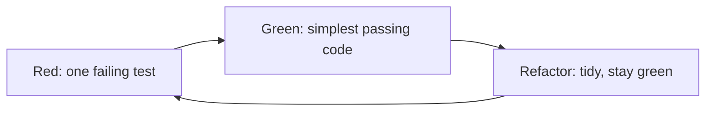
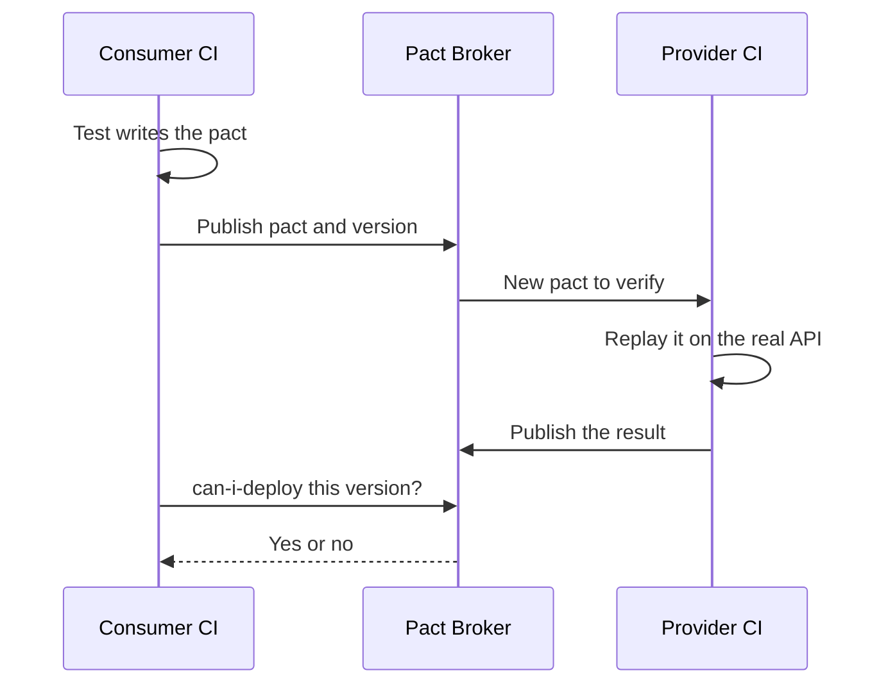
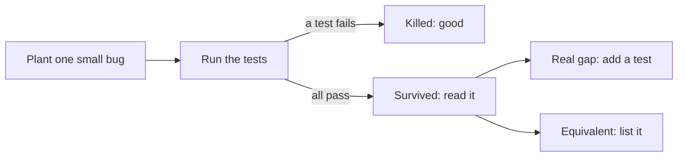

# Module 2 — Testing code

*Module 1 taught you to decide what to test. This module turns those decisions into code that runs on every commit at Najm Bank. Lesson 2.1 covers unit tests, the small, fast checks that answer a developer in seconds, and test-driven development (TDD), the habit of writing the failing test first. Lesson 2.2 moves to the places where mocks stop being honest: databases, queues, HTTP calls to other services and the contracts between teams. Lesson 2.3 asks the question that matters most, and matters more when an AI agent writes your tests: are these tests any good? You will measure a suite with coverage, break the code on purpose with mutation testing, let Hypothesis hunt for inputs nobody thought of, and learn to catch flaky tests. Everything runs against [the course's sample system](https://github.com/Tamoura/system-design-for-vibe-coders/tree/main/testing/sample), Najm Transfers, so you can watch each technique catch or miss the seeded bugs.*

> **Focus:** Unit, Integration — writing fast, honest tests for the code you own, connecting them to real dependencies, and proving that they can fail.

---

# 2.1 — Unit testing and TDD: arrange-act-assert, test doubles and fast feedback
*Level: 🟢 Beginner* · *Prerequisites: 1.1* · *Focus: Unit*

## ⚡ In 60 seconds
- A **unit test** checks one small behaviour in milliseconds, with no network, database or real clock. Build it as **arrange, act, assert** and name it after the rule it protects.
- Replace only what is slow, random or out of your control with a **test double**: dummy, stub, spy, mock or fake.
- Prefer **state testing** ("what is true afterwards?") to **interaction testing** ("which calls happened?"). Mocking away the rule under test leaves the test green and the system broken.
- **TDD** is a loop: one failing test (red), the simplest passing code (green), tidy up (refactor). Use it for rules you understand, not for exploration.
- Decision cue: name the bug a test would catch, or it is decoration.

## 🧭 Why it matters
On Tuesday Nada opens her first pull request at Najm Bank: a `TransferDesk` that submits a transfer and texts the customer. It has fourteen unit tests, with every new line covered. Bilal runs them with the sample system's `limit_off_by_one` bug switched on. All fourteen pass. A transfer that brings the day's total to exactly 50,000.00 QAR is wrongly rejected, and no test notices, because every test replaced `TransferService` with a `Mock` that returns a ready-made answer. The tests check that the desk makes calls. None runs the rule.

Rashid asks Nada to name the bug each test would catch. She names none. This lesson is the repair kit: tests that are fast, readable and able to fail, when to fake a collaborator, and how TDD makes you watch a test fail first. In the AI era this matters more: an agent can write fluent, mock-heavy tests in seconds, and you must judge them.

## 📐 How it works

### 🟢 The essentials

**What a unit is.** A *unit* is the smallest behaviour you can name and check alone: usually a function such as `fee`, sometimes a small class, never "a file". A **unit test** runs in-process, in milliseconds, with no network, database, real clock or randomness.

**Arrange, act, assert (AAA).** *Arrange* builds inputs and objects. *Act* calls the one thing under test. *Assert* checks the outcome. Two acts: two tests.

**Naming.** A test name is the first thing a failing build shows. `test_fee` tells a stranger nothing; `test_international_fee_is_rounded_half_up` names the broken rule.

**FIRST.** Five properties of a good unit test: **F**ast (milliseconds, so you run it constantly), **I**solated (no test needs another to run first), **R**epeatable (same result on any machine, any day, so pass `now` in), **S**elf-validating (`assert`, not `print`) and **T**imely (written with or before the code).

**pytest essentials.** pytest runs functions named `test_*` in files named `test_*.py`. Handy flags: `-q` (quiet), `-k rounded` (select by name), `-x` (stop at the first failure), `--durations=5` (slowest five). This file shows the seven features you need on day one.

```python
# tests/test_unit_essentials.py
from decimal import Decimal

import pytest

from najm.transfers import TransferRejected, TransferService, check_transfer, fee


def test_international_fee_is_rounded_half_up():
    amount = "3090"                                         # arrange: 3,090 x 0.35 % = 10.815
    result = fee(amount, "QAR", "international")            # act
    assert result == Decimal("10.82")                       # assert: the half goes up


@pytest.mark.parametrize("amount, expected", [
    pytest.param("1000", "0.00", id="1000-is-still-free"),
    pytest.param("1000.01", "2.00", id="just-over-pays-2"),
])
def test_domestic_fee_threshold(amount, expected):
    assert fee(amount, "QAR", "domestic") == Decimal(expected)


@pytest.fixture
def service():
    return TransferService()


def test_alice_cannot_spend_bobs_money(service):
    req = {"from_account": "acc-2", "to_account": "acc-1", "amount": "10", "currency": "QAR", "kind": "own"}
    with pytest.raises(TransferRejected, match="not_owner"):
        service.submit("alice", req, "k1")


@pytest.mark.slow                                           # `pytest -m "not slow"` skips it
def test_a_thousand_checks_stay_fast():
    for _ in range(1000):
        check_transfer("100", "QAR", "domestic")


def test_receipt_goes_to_a_temp_folder(tmp_path):
    receipt = tmp_path / "tr-1.txt"
    receipt.write_text(f"fee={fee('5000', 'QAR', 'domestic')}")
    assert receipt.read_text() == "fee=2.00"


def test_the_minimum_can_change_for_one_test(monkeypatch):
    monkeypatch.setattr("najm.transfers.MIN_TRANSFER", Decimal("50"))
    with pytest.raises(TransferRejected, match="below_minimum"):
        check_transfer("49.99", "QAR", "own")
```

Register the marker in `pytest.ini` (`markers = slow: tests over a second`). pytest rewrites plain `assert` so a failure shows both sides. Run `NAJM_BUGS=float_fee pytest -k rounded` and the sample's float bug appears as a readable diff (trimmed):

```text
>       assert result == Decimal("10.82")
E       AssertionError: assert Decimal('10.81') == Decimal('10.82')
```

Fixtures, `tmp_path` folders and `monkeypatch` edits are per test, so nothing leaks; `pytest.raises` makes an error the expected result.

### 🟡 Going deeper

**Test doubles.** A *test double* stands in for a real collaborator, like a stunt double (the five kinds are from Gerard Meszaros's *xUnit Test Patterns*; see Martin Fowler's "Mocks Aren't Stubs"). Add a `TransferDesk` to the sample: it asks a risk scorer, submits, then sends an SMS.

```python
# najm/desk.py
from najm.transfers import TransferRejected


class TransferDesk:
    def __init__(self, service, notifier, risk):
        self.service, self.notifier, self.risk = service, notifier, risk

    def send(self, user, req, key, now=None):
        if self.risk.score(user, req) >= 0.8:
            raise TransferRejected("held_for_review")
        transfer, created = self.service.submit(user, req, key, now)
        if created:
            self.notifier.sms(user, f"Sent {transfer['amount']} {transfer['currency']} (ref {transfer['id']})")
        return transfer
```

| Double | What it does | Najm example |
|---|---|---|
| **Dummy** | Fills a parameter, never meant to be used | A bare `object()` as the notifier: any use fails loudly |
| **Stub** | Returns canned answers | `StubRisk(0.95)` forces "high risk" |
| **Spy** | Records what happened, for you to inspect | `SpyNotifier.sent` |
| **Mock** | Holds expectations and checks them itself | `notifier.sms.assert_called_once()` |
| **Fake** | A working, lightweight stand-in | The in-memory `TransferService` as the ledger |

Python's `unittest.mock.Mock` can play stub, spy or mock, depending on use: the role matters, not the class.

```python
# tests/test_doubles.py
from decimal import Decimal

import pytest

from najm.desk import TransferDesk
from najm.transfers import TransferRejected, TransferService

REQ = {"from_account": "acc-1", "to_account": "acc-2", "amount": "100.00", "currency": "QAR", "kind": "domestic"}


class StubRisk:                          # stub: a canned answer
    def __init__(self, score):
        self.value = score

    def score(self, user, req):
        return self.value


class SpyNotifier:                       # spy: records what it was asked to do
    def __init__(self):
        self.sent = []

    def sms(self, user, text):
        self.sent.append((user, text))


def test_a_held_transfer_sends_no_sms_and_moves_no_money():
    service = TransferService()                                  # a fake: a real, in-memory ledger
    desk = TransferDesk(service, object(), StubRisk(0.95))      # dummy: any object; using it raises AttributeError
    with pytest.raises(TransferRejected, match="held_for_review"):
        desk.send("alice", REQ, "k1")
    assert service.accounts["acc-1"]["balance"] == Decimal("12000.00")      # state


def test_an_accepted_transfer_texts_the_customer_once():
    spy = SpyNotifier()
    desk = TransferDesk(TransferService(), spy, StubRisk(0.1))
    desk.send("alice", REQ, "k1")
    desk.send("alice", REQ, "k1")                                # a retry with the same key
    assert spy.sent == [("alice", "Sent 100.00 QAR (ref tr-0001)")]         # interaction
```

The first test checks *state* (the balance did not move). The second checks an *interaction* with a spy: "told exactly once, even on a retry" is the promise.

**A clock you can control.** `value_date(now)` and `submit(..., now)` take the time as a parameter. That is *injection*: the 15:00 Qatar cut-off becomes test data. When you cannot change the signature, `freezegun` freezes `datetime.now()` instead.

```python
# tests/test_clock.py
from datetime import datetime
from zoneinfo import ZoneInfo

import pytest
from freezegun import freeze_time

from najm.transfers import TransferService, value_date

REQ = {"from_account": "acc-1", "to_account": "acc-2", "amount": "100.00", "currency": "QAR", "kind": "domestic"}


@pytest.mark.parametrize("hour, minute, expected", [(14, 59, "2026-10-05"), (15, 0, "2026-10-06"), (15, 30, "2026-10-06")])
def test_cutoff_with_an_injected_clock(hour, minute, expected):
    now = datetime(2026, 10, 5, hour, minute, tzinfo=ZoneInfo("Asia/Qatar"))      # a Monday
    assert value_date(now).isoformat() == expected


@freeze_time("2026-10-05 12:30:00+00:00")                                         # 15:30 in Qatar
def test_cutoff_with_freezegun():
    transfer, _ = TransferService().submit("alice", REQ, "k")                     # no `now`: the service reads the clock
    assert transfer["value_date"] == "2026-10-06"
```

Injection is simpler and far cheaper: here, 1,000 injected calls took a few milliseconds and 1,000 `freeze_time` blocks about two seconds (yours will differ). It is also a **weak versus strong** pair. The starter suite's cut-off test uses 10:00 Qatar time, which passes even under `NAJM_BUGS=tz_cutoff`. The 15:00 and 15:30 cases fail under it, because that bug reads the cut-off in UTC: they can fail, so they mean something.

**State versus interaction, and over-mocking.** *State testing* asserts on results and changes. *Interaction testing* asserts on calls to collaborators: right for side effects that leave your system (an SMS), risky elsewhere, because it pins *how* the code works. The worst case replaces the collaborator that holds the rule. Two tests of one promise, "the last riyal of the daily limit is accepted":

```python
# tests/test_overmocked.py
from decimal import Decimal
from unittest.mock import Mock

from najm.desk import TransferDesk
from najm.transfers import TransferService

RICH = {"acc-1": {"owner": "alice", "currency": "QAR", "balance": Decimal("100000")},
        "acc-2": {"owner": "bob", "currency": "QAR", "balance": Decimal("0")}}


class CalmRisk:
    def score(self, user, req):
        return 0.1


def own(amount):
    return {"from_account": "acc-1", "to_account": "acc-2", "amount": amount, "currency": "QAR", "kind": "own"}


def test_the_last_riyal_overmocked():                  # passes whatever the rules say
    service, notifier = Mock(), Mock()
    service.submit.return_value = ({"id": "tr-1", "amount": "1000.00", "currency": "QAR"}, True)
    TransferDesk(service, notifier, CalmRisk()).send("alice", own("1000.00"), "k")
    notifier.sms.assert_called_once()


def test_the_last_riyal_is_accepted():                 # runs the real rules
    desk = TransferDesk(TransferService(RICH), Mock(), CalmRisk())
    desk.send("alice", own("25000.00"), "k1")
    desk.send("alice", own("24000.00"), "k2")
    assert desk.send("alice", own("1000.00"), "k3")["status"] == "accepted"      # total: exactly 50,000
```

| Run | Over-mocked test | Real-rules test |
|---|---|---|
| Clean sample | passes | passes |
| `NAJM_BUGS=limit_off_by_one` | **passes** | **fails** |

The first test proves only that `Mock` returns what you told it, yet it looks right in review. Use a fake or the real object for anything holding a rule; keep mocks for edges such as network and SMS.

**Unit test smells.** *Logic in the test* (loops, the production formula) can be wrong the same way as the code: use literal expected values. *Shared mutable state* (a module-level `SERVICE`) makes results depend on order: use a fixture. *Testing private details* (`svc._sent_today`) breaks on refactoring: assert public behaviour. *No assertion*, or `assert result is not None`, proves only that nothing crashed. *Over-specification* (exact message text): assert the stable `code`.

**Speed budgets.** Najm's budget: a unit test under 100 ms, the suite under 60 seconds on a laptop, anything slower marked `slow`. *Software Engineering at Google* sizes tests by what they may touch (a small test stays in one process, with no network or sleeping). For pipelines, see [*Cloud & DevOps*, lesson 4.1 — Continuous integration: pipelines, tests, artefacts and fast feedback](../cloud/index.html#/4.1).

### 🔴 Expert view

**TDD worked example.** *Test-driven development* (Kent Beck, *Test-Driven Development: By Example*, 2002) repeats a loop in small cycles.



Story TRF-240: *Najm Plus customers send domestic transfers free and pay half the international fee.* Nada starts `najm/plus.py` as a skeleton that returns the standard fee, so the first failure is about behaviour, not a missing name.

*Cycle 1, red:* a Plus domestic transfer of 5,000 should cost `0.00`.

```text
E       AssertionError: assert Decimal('2.00') == Decimal('0.00')
```

*Green:* return zero for `domestic`. *Cycle 2, red:* international on 5,000 should cost `8.75`, half of the standard 17.50.

```text
E       AssertionError: assert Decimal('17.50') == Decimal('8.75')
```

*Green:* halve the fee, `quantize(fee(amount, currency, kind) / 2, currency)`. *Cycle 3, red.* Rashid asks: halve the rounded fee, 10.83, or the exact one, 10.82599? Money is rounded once, at the end. Nada works 3,093.14 out by hand: half of 10.82599 is 5.412995, so 5.41.

```text
E       AssertionError: assert Decimal('5.42') == Decimal('5.41')
```

The cycle 2 code halved a rounded number, and 5.415 rounds up to 5.42, so the new test found a real bug in code that already passed. *Green*, then *refactor* with all three tests watching. The tests, one per cycle, and the final code:

```python
# tests/test_plus.py
from decimal import Decimal

from najm.plus import plus_fee


def test_plus_customers_send_domestic_transfers_free():                 # cycle 1
    assert plus_fee("5000", "QAR", "domestic") == Decimal("0.00")


def test_plus_customers_pay_half_the_international_fee():               # cycle 2
    assert plus_fee("5000", "QAR", "international") == Decimal("8.75")


def test_the_half_is_taken_before_rounding_not_after():                 # cycle 3
    assert plus_fee("3093.14", "QAR", "international") == Decimal("5.41")      # not 5.42
```

```python
# najm/plus.py
from decimal import Decimal

from najm.transfers import fee, quantize

RATE, FLOOR, CAP = Decimal("0.0035"), Decimal("10"), Decimal("100")    # as in the standard fee


def plus_fee(amount, currency, kind):
    amount = Decimal(str(amount))
    if kind == "domestic":
        return quantize(0, currency)
    if kind == "international":
        standard = max(FLOOR, min(CAP, amount * RATE))      # unrounded
        return quantize(standard / 2, currency)             # rounded once, at the very end
    return fee(amount, currency, kind)
```

**Where TDD shines, and where not.** It shines for rules you can state as examples (fees, limits, cut-offs) and for bug fixes: write the test that reproduces the bug first, and keep it. It fits badly with exploration (spike, learn, discard, then test-drive the real version), thin glue code, pixel-level UI, and code with no seams, where you first write characterisation tests (lesson 2.3). With coding agents, TDD becomes a control: you write or approve the failing test, the agent makes it green (lesson 6.2; [*System Design for Vibe Coders*, lesson 8.2 — Tests as the spec the agent can't ignore](../vibe/index.en.html#l8-2)).

**The same ideas in TypeScript.** Najm Mobile's web client formats money for the screen; inside the client, amounts are whole minor units, never floats. Vitest has the same shape as pytest:

```typescript
// money.ts
type Currency = "QAR" | "KWD" | "JPY";
const DECIMALS: Record<Currency, number> = { QAR: 2, KWD: 3, JPY: 0 };

/** Whole minor units in, display text out: 123456 QAR becomes "1,234.56 QAR". */
export function formatMinor(minor: number, currency: Currency): string {
  if (!Number.isSafeInteger(minor) || minor < 0) throw new RangeError("non-negative whole minor units only");
  const d = DECIMALS[currency];
  const digits = String(minor).padStart(d + 1, "0");
  const whole = digits.slice(0, digits.length - d).replace(/\B(?=(\d{3})+(?!\d))/g, ",");
  return `${d > 0 ? `${whole}.${digits.slice(-d)}` : whole} ${currency}`;
}
```

```typescript
// money.test.ts
import { expect, it } from "vitest";
import { formatMinor } from "./money";

it.each([
  [123456, "QAR", "1,234.56 QAR"],
  [5, "QAR", "0.05 QAR"],
  [1234567, "KWD", "1,234.567 KWD"],
] as const)("formats %i %s as %s", (minor, currency, expected) => {
  expect(formatMinor(minor, currency)).toBe(expected);
});

it("rejects fractions and negatives instead of guessing", () => {
  expect(() => formatMinor(10.5, "QAR")).toThrow(RangeError);
  expect(() => formatMinor(-1, "QAR")).toThrow("non-negative");
});
```

Run `npm install -D vitest`, then `npx vitest run` (output trimmed):

```text
 Test Files  1 passed (1)
      Tests  4 passed (4)
```

## 🧰 The toolkit
| Tool, practice or technique | What it is and does | When to reach for it |
|---|---|---|
| **pytest** | Python runner with plain `assert`, fixtures, parametrize and markers | Any Python unit or integration test |
| **Vitest** | Fast TypeScript/JavaScript runner with a Jest-like API | Unit tests for web and Node code |
| **Test doubles** (Meszaros) | Dummy, stub, spy, mock and fake stand-ins | Edges you cannot control: network, SMS, clock |
| **freezegun** | Freezes `datetime.now()` for the code under test | Clock readers you cannot change |
| **Test-driven development** (Beck) | Red, green, refactor in small cycles | Rules stated as examples; every bug fix |

## 🏛️ In practice at Najm Bank
Bilal turns Rashid's questions into **Najm Unit Test Standard v1**, a checklist for every transfers pull request, human or AI.

| # | Rule | How a reviewer checks it |
|---|---|---|
| 1 | One rule per test, named after it; arrange, act, assert | The failing line explains the problem alone |
| 2 | Expected values are literals from a spec or hand calculation | No test reuses the formula |
| 3 | Real objects or fakes for rules; mocks only at the edges | Justify each `Mock(` in the diff |
| 4 | The clock is a parameter; no `sleep`, network or shared state | Passes alone and in any order |
| 5 | New rules get boundary tests on both sides | Link the lesson 1.2 table |
| 6 | **Break it to trust it:** the author shows the test failing once | The PR pastes the red output |
| 7 | Under 100 ms per test; slower ones get `slow` | `--durations=5` in CI output |


## 🛠️ Exercises
Copy the sample (`cp -r testing/sample ~/najm-sample`), create a virtual environment and `pip install -r requirements.txt freezegun`.

- 🟢 **Name it and break it.** Write six parametrized tests for `fee`: domestic at 1000 and 1000.01, international at 100 and 3090, own at 500, and the cap (`fee("100000", "QAR", "international")`), each with a readable `id`. *Done when:* names state the rule, `pytest -v` shows the ids, and changing `<=` to `<` in the domestic rule by hand makes exactly one test fail (then restore it).
- 🟡 **Doubles and a clock.** Add `najm/desk.py` and test it: the scorer holds a transfer at exactly 0.8 but not at 0.79 (stubs), a held transfer sends no SMS (dummy), an accepted one sends one (spy), and the cut-off holds at 14:59, 15:00 and 15:30 Qatar time (injected clock). *Done when:* the suite is green on the clean sample, fails under `NAJM_BUGS=tz_cutoff`, and never mocks `TransferService`.
- 🔴 **Test-drive a rule, then trap an over-mock.** Test-drive TRF-241: "the Najm Plus daily limit is 1.5 times the standard one; the per-transfer maximum is unchanged", in three red-green cycles, saving each red message. Then write an over-mocked version of one test. *Done when:* your notes quote three red messages, and after you break your rule by hand (`>` to `>=`) the over-mocked test still passes while the real one fails.

## ⚠️ Mistakes and traps
- **Mocking the thing you test.** The test proves the mock works.
- **Asserting on calls, not results.** `assert_called_with` pins wiring, not the promise.
- **Expected values copied from the code's output.** The test restates the implementation (lesson 1.1). Use a policy or your own arithmetic.
- **Real clock, randomness or shared state.** Tests pass today, fail on Friday. Inject, seed or rebuild.
- **Never seeing the test fail.** A test that has never been red may never go red. Do the TDD red step or flip a bug switch once.

## 🧾 Recap
- A unit test checks one behaviour, fast, in arrange-act-assert form, with a name that states the rule.
- FIRST is the quality bar; a slow or order-dependent test is a defect.
- Real objects or fakes for rules, mocks for edges; inject the clock before reaching for freezegun.
- State checks survive refactoring; interaction checks pin wiring; over-mocking passes on a broken system.
- TDD: watch the test fail for the right reason, write the smallest code, refactor on green.

## ✍️ Check yourself

**1. A held transfer must send no SMS. The scorer must return 0.95, and the notifier must fail if touched. Which doubles fit?**

- A. A mock for the scorer and a fake for the notifier
- B. A stub for the scorer and a dummy for the notifier
- C. A spy for the scorer and a stub for the notifier
- D. A dummy for the scorer and a mock for the notifier

<details><summary>Answer</summary>

**B.** A stub returns the canned 0.95; a dummy fails loudly if used, proving no SMS was attempted. A mock or spy records calls. (🟡 Test doubles.)

</details>

**2. With `limit_off_by_one` on, all fourteen of Nada's desk tests still pass. Most likely reason?**

- A. Unit tests can never find boundary bugs in business rules
- B. The suite ran too quickly for the bug to show up in time
- C. Every test mocked `TransferService` and returned a fixed answer
- D. Line coverage of the new file stayed below one hundred percent overall

<details><summary>Answer</summary>

**C.** With the service mocked, the limit rule never runs, so the bug cannot show. (🟡 Over-mocking.)

</details>

**3. A test calls `submit(...)` with no `now` and expects today's value date. It fails when CI runs after 15:00 Qatar time. Best fix?**

- A. Pass a fixed `now` in and assert a hand-checked date
- B. Add `time.sleep(2)` before the date assertion runs
- C. Retry the test automatically until it passes in CI
- D. Loosen the assertion to accept any October date

<details><summary>Answer</summary>

**A.** The hidden input is the clock. Injecting it makes the test repeatable. Sleeping and retrying hide the dependency. (🟡 A clock you can control.)

</details>

**4. In TDD cycle 3 the new test fails with `5.42 != 5.41`. What next?**

- A. Change the expected value to 5.42 so the whole suite goes green
- B. Delete the test, since the first two tests already pass
- C. Rewrite the whole function before running any test again
- D. Make the smallest change that passes, then refactor on green

<details><summary>Answer</summary>

**D.** A red test for the right reason calls for the smallest passing change, then a refactor on green. Editing the expectation would bury a real bug. (🔴 TDD worked example.)

</details>

**5. A test reads `svc._sent_today`. After a harmless rename, nine tests fail. Which smell?**

- A. An assertion-free test
- B. Shared mutable state across many tests
- C. Testing private details of the class
- D. Logic inside the test body

<details><summary>Answer</summary>

**C.** Reading private fields breaks tests on refactoring. Assert public behaviour, such as the balance or the rejection code. (🟡 Unit test smells.)

</details>

## 📚 References
- pytest documentation: https://docs.pytest.org/
- Python `unittest.mock`: https://docs.python.org/3/library/unittest.mock.html
- Martin Fowler, "Mocks Aren't Stubs": https://martinfowler.com/articles/mocksArentStubs.html
- Martin Fowler, "Test Double": https://martinfowler.com/bliki/TestDouble.html
- Vitest: https://vitest.dev/
- *Software Engineering at Google* (2020): https://abseil.io/resources/swe-book
- Kent Beck, *Test-Driven Development: By Example* (2002); Gerard Meszaros, *xUnit Test Patterns* (2007)

---

# 2.2 — Integration testing: databases, queues, test data and contract tests
*Level: 🟡 Intermediate* · *Prerequisites: 2.1* · *Focus: Integration*

## ⚡ In 60 seconds
- An **integration test** runs your code against a real neighbour (database, queue, HTTP service, another team's API) to check the join, not the logic.
- A mock agrees with your assumptions; only a real neighbour can disagree. Test where they break: SQL, types, retries, contracts.
- Keep them fast and isolated: rollback per test, unique data, no `sleep`, a controllable clock.
- A **contract test** checks the shape two teams agreed on without deploying both. In **consumer-driven** contracts (Pact), the consumer states its needs and the provider proves them.
- Decision cue: if a bug could live in the join, a unit test cannot find it.

## 🧭 Why it matters
Friday's `TransferRepository` release has 300 green unit tests, each swapping the database for a dict. In QA, the daily total of three 0.10 QAR transfers reads 0.30000000000000004, because a developer declared the amount column `REAL`. A mock cannot know what a database does with a number. The same afternoon the app retries a POST whose reply was lost, and the customer is debited twice.

Rashid: "Unit tests say the parts are right; integration tests say they are connected right." An AI agent that writes a repository can add a `MagicMock` connection: ask where the real boundary is.

## 📐 How it works

### 🟢 The essentials

**Why mocks are not enough.** A mock hides what the neighbour really does: types and constraints (database), ordering and timing (queue), status codes and timeouts (HTTP service), drift between releases (another team's API). Use the real thing where cheap, a stub or contract where not.

**Pyramid, trophy, honeycomb.** The *test pyramid* (Mike Cohn; Martin Fowler) wants many unit tests, fewer integration tests, few end-to-end tests. Kent C. Dodds's *trophy* weights integration tests most; Spotify's *honeycomb*, for microservices, puts most weight on a service's integration points. They differ in emphasis, not principle: test where bugs live (see lesson 5.1).

**A real database at unit speed.** Amounts are stored as whole minor units, never `REAL`. The repository, fixtures giving each test an in-memory SQLite database inside a transaction rolled back afterwards, and a builder with valid defaults and unique ids (Faker, seeded):

```python
# najm/repository.py
import sqlite3
from decimal import Decimal

from najm.transfers import MINOR_UNITS

SCHEMA = """
CREATE TABLE transfers (
    id TEXT PRIMARY KEY, owner TEXT NOT NULL, idem_key TEXT NOT NULL,
    amount_minor INTEGER NOT NULL,                            -- whole minor units, never REAL
    currency TEXT NOT NULL, value_date TEXT NOT NULL,
    UNIQUE (owner, idem_key)
)"""


class DuplicateKey(Exception):
    pass


class TransferRepository:
    def __init__(self, conn: sqlite3.Connection):
        self.conn = conn

    def add(self, t: dict) -> None:
        minor = int(Decimal(t["amount"]).scaleb(MINOR_UNITS[t["currency"]]))
        try:
            self.conn.execute("INSERT INTO transfers VALUES (?, ?, ?, ?, ?, ?)",
                              (t["id"], t["owner"], t["idem_key"], minor, t["currency"], t["value_date"]))
        except sqlite3.IntegrityError as e:
            if "idem_key" in str(e):                              # a repeated id is another error
                raise DuplicateKey(t["idem_key"]) from e
            raise

    def sent_on(self, owner: str, currency: str, day: str) -> Decimal:
        (minor,) = self.conn.execute(
            "SELECT COALESCE(SUM(amount_minor), 0) FROM transfers WHERE owner = ? AND currency = ? AND value_date = ?",
            (owner, currency, day)).fetchone()
        return Decimal(minor).scaleb(-MINOR_UNITS[currency])
```

```python
# tests/conftest.py
import sqlite3

import pytest

from najm.repository import SCHEMA, TransferRepository


@pytest.fixture(scope="session")
def _database():
    db = sqlite3.connect(":memory:", isolation_level=None)   # autocommit: we choose when to BEGIN
    db.execute(SCHEMA)
    yield db
    db.close()


@pytest.fixture
def conn(_database):
    _database.execute("BEGIN")
    yield _database
    _database.execute("ROLLBACK")                            # whatever the test did is undone


@pytest.fixture
def repo(conn):
    return TransferRepository(conn)
```

```python
# tests/builders.py
from faker import Faker

fake = Faker()
Faker.seed(2026)                                             # same "random" data on every run


def a_transfer(**overrides) -> dict:
    transfer = {"id": fake.uuid4(), "owner": "alice", "idem_key": fake.uuid4(),
                "amount": "250.00", "currency": "QAR", "value_date": "2026-10-05"}
    return {**transfer, **overrides}
```

```python
# tests/test_repository.py
from decimal import Decimal

import pytest
from builders import a_transfer

from najm.repository import DuplicateKey


def test_the_daily_total_is_exact(repo):
    for _ in range(3):
        repo.add(a_transfer(amount="0.10"))
    assert repo.sent_on("alice", "QAR", "2026-10-05") == Decimal("0.30")      # float storage gives 0.30000000000000004


def test_the_database_refuses_a_repeated_idempotency_key(repo):
    repo.add(a_transfer(idem_key="k1"))
    with pytest.raises(DuplicateKey):
        repo.add(a_transfer(idem_key="k1"))
    repo.add(a_transfer(owner="bob", idem_key="k1"))                          # another customer may reuse the key
```

The sum test is a **weak versus strong** pair. A mocked connection with a stubbed total passes whatever the storage scheme. This test fails against Friday's design, a `REAL` column filled with `float(t["amount"])`: SQLite's `SELECT 0.1+0.1+0.1` gives `0.30000000000000004`. Ours stores whole minor units in an `INTEGER` column, and integers add exactly. One trap: rollback isolation breaks when the code under test commits. A test that runs `COMMIT` leaves its row behind, the fixture's `ROLLBACK` errors (`cannot rollback - no transaction is active`), and the next test sees one row. Delete rows after each test, or use an ORM's savepoint mode, where the code's commit only releases the savepoint.

### 🟡 Going deeper

**SQLite is not PostgreSQL.** SQLite suits fast checks of dialect-neutral code but differs where banks get hurt. *Types:* loosely typed (strict tables came in 3.37), against PostgreSQL's exact `numeric(18, 3)`. *Concurrency:* one writer at a time, against row locks and `SELECT ... FOR UPDATE`. *Constraints:* foreign keys are off until enabled per connection.

Use SQLite for the cheap majority, and **Testcontainers** (it starts a throwaway Docker container) for locks, `numeric`, migrations and dialect. This version is **not executed here** (it needs Docker; `pip install "testcontainers[postgres]" "psycopg[binary]"`), and import paths differ between testcontainers-python releases.

```python
# tests/test_transfers_postgres.py
from decimal import Decimal

import psycopg
import pytest
from testcontainers.community.postgres import PostgresContainer     # older releases: testcontainers.postgres


@pytest.fixture(scope="session")
def pg():
    with PostgresContainer("postgres:16-alpine") as container:       # a real, throwaway PostgreSQL
        url = container.get_connection_url().replace("+psycopg2", "")
        with psycopg.connect(url, autocommit=True) as conn:
            conn.execute("CREATE TABLE transfers (id text PRIMARY KEY, amount numeric(18, 3) NOT NULL)")
            yield conn


@pytest.fixture
def pg_conn(pg):
    with pg.transaction(force_rollback=True):          # always rolled back
        yield pg


def test_numeric_sums_are_exact(pg_conn):
    for i in range(3):
        pg_conn.execute("INSERT INTO transfers VALUES (%s, 0.10)", (f"tr-{i}",))
    (total,) = pg_conn.execute("SELECT SUM(amount) FROM transfers").fetchone()
    assert total == Decimal("0.30")
```

**Test data.** A *builder* gives every field a valid default, so a test names only what matters: `a_transfer(amount="0.10")`. Four isolation strategies: *roll back per test* (the default; breaks if code commits or uses other connections or threads), *delete or truncate after each test* (for code that commits; slower), *unique data per test* (for shared environments; leaves leftovers) and a *fresh database per module* (slowest).

Build the test database by running your **real migrations** from empty, never a hand-copied schema, and add an upgrade test: create it at version N−1, insert rows, migrate to N, check they survive ([*SaaS Building Blocks*, lesson 2.1 — The data layer: Postgres, ORMs, migrations and seeds](../saas/index.html#/2.1)). Test data is synthetic or masked, never customer data; `Faker("ar_AA")` makes Arabic names.

**Async and queues: never sleep and hope.** The weak test calls `time.sleep(2)` then asserts: too short on slow CI, too slow elsewhere. Three tools replace it. A **seam**, a place to swap behaviour without editing the code, lets you test the handler's logic synchronously, with one threaded test for the wiring. A **waiting helper** polls against a deadline. A **fake clock** records delays instead of waiting (see the retry test).

```python
# najm/worker.py
def run_worker(inbox, notifier):
    """Send each (user, text) message from the queue; stop at None."""
    while (message := inbox.get()) is not None:
        notifier.sms(*message)
```

```python
# tests/test_worker.py
import queue
import threading
import time
from types import SimpleNamespace

from najm.worker import run_worker


def wait_until(check, timeout=2.0, what="the condition"):
    deadline = time.monotonic() + timeout
    while not check():
        assert time.monotonic() < deadline, f"timed out after {timeout}s waiting for {what}"
        time.sleep(0.005)


def test_the_worker_delivers_in_order_without_a_fixed_sleep():
    inbox, sent = queue.Queue(), []
    notifier = SimpleNamespace(sms=lambda user, text: sent.append((user, text)))
    thread = threading.Thread(target=run_worker, args=(inbox, notifier), daemon=True)
    thread.start()
    for n in range(3):
        inbox.put(("alice", f"message {n}"))
    wait_until(lambda: len(sent) == 3, what="3 messages")
    inbox.put(None)                       # tell the worker to stop
    thread.join(timeout=2)
    assert [text for _, text in sent] == ["message 0", "message 1", "message 2"]
```

**HTTP boundaries.** You cannot make a partner's service time out on demand, so stub it. `respx` mocks `httpx`; WireMock is a standalone server for any language.

```python
# najm/fx.py
from decimal import Decimal, InvalidOperation

import httpx


class FxUnavailable(Exception):
    pass


def rate(base_url: str, base: str, quote: str) -> Decimal:
    try:
        r = httpx.get(f"{base_url}/rates", params={"base": base, "quote": quote}, timeout=2.0)
        r.raise_for_status()
        return Decimal(str(r.json()["rate"]))                # str(): never Decimal(a float)
    except (httpx.HTTPError, KeyError, InvalidOperation, ValueError) as e:
        raise FxUnavailable(f"{base}/{quote}") from e
```

```python
# tests/test_fx.py
import httpx
import pytest
import respx

from najm.fx import FxUnavailable, rate

URL = "https://fx.najm.example"


@respx.mock
@pytest.mark.parametrize("failure", [
    pytest.param({"side_effect": httpx.ConnectTimeout}, id="timeout"),
    pytest.param({"return_value": httpx.Response(503)}, id="server-error"),
    pytest.param({"return_value": httpx.Response(200, json={"oops": 1})}, id="shape-changed"),
    pytest.param({"return_value": httpx.Response(200, json={"rate": "n/a"})}, id="garbled-rate"),
])
def test_a_broken_fx_service_becomes_one_clear_error(failure):
    respx.get(f"{URL}/rates", params={"base": "QAR", "quote": "EUR"}).mock(**failure)     # matches only this pair
    with pytest.raises(FxUnavailable):
        rate(URL, "QAR", "EUR")
```

*Record and replay* tools (VCR-style cassettes, WireMock recording) capture real traffic once, but a recording keeps passing after the provider changes, can hold tokens or customer data, and freezes the happy path. Use stubs for failures, contracts for shape.

### 🔴 Expert view

**Consumer-driven contracts with Pact.** Najm Mobile's backend and the Transfers API belong to different squads; end-to-end checks of every release are slow and flaky. With **Pact**, the consumer's tests record their needs in a *pact* file, the provider replays it against the real API, and a *broker* tracks which versions are compatible.



Both files use the pact-python 3 API (`pip install pact-python`; 2.x differed; tested with 3.4). Save them in the sample root; run `pytest consumer_test.py`, then `pytest provider_test.py` (a shuffling plugin could reverse them). The provider test starts the real API and replays the pact:

```python
# consumer_test.py
import httpx
from pact import Pact, match

BODY = {"from_account": "acc-1", "to_account": "acc-2", "amount": "250.00", "currency": "QAR", "kind": "domestic"}
HEADERS = {"Authorization": "Bearer token-alice", "Idempotency-Key": "key-1"}


def test_creating_a_domestic_transfer():
    pact = Pact("najm-mobile", "najm-transfers-api")
    (
        pact.upon_receiving("a domestic transfer of 250 QAR")
        .given("alice owns acc-1 and has enough money")
        .with_request("POST", "/transfers")
        .with_headers(HEADERS)
        .with_body(BODY, content_type="application/json")
        .will_respond_with(201)
        .with_body(
            {
                "id": match.str("tr-0001"),
                "status": "accepted",
                "fee": match.regex("0.00", regex=r"^\d+\.\d{2}$"),
                "value_date": match.regex("2026-10-05", regex=r"^\d{4}-\d{2}-\d{2}$"),
            },
            content_type="application/json",
        )
    )
    with pact.serve() as server:                       # a mock provider that checks the request
        reply = httpx.post(f"{server.url}/transfers", json=BODY, headers=HEADERS)
        assert reply.json()["status"] == "accepted"
    pact.write_file("pacts", overwrite=True)           # the contract, as a JSON file
```

```python
# provider_test.py
import socket
import threading
import time

import uvicorn
from pact import Verifier

from najm.api import create_app


def test_the_transfers_api_honours_the_najm_mobile_pact():
    with socket.socket() as s:                       # ask the OS for a free port
        s.bind(("localhost", 0))
        port = s.getsockname()[1]
    server = uvicorn.Server(uvicorn.Config(create_app(), host="localhost", port=port, log_level="warning"))
    thread = threading.Thread(target=server.run, daemon=True)
    thread.start()
    while not server.started:
        time.sleep(0.05)
    try:
        (
            Verifier("najm-transfers-api")
            .add_transport(url=f"http://localhost:{port}")
            .add_source("pacts/najm-mobile-najm-transfers-api.json")
            .state_handler({"alice owns acc-1 and has enough money": lambda: None})
            .verify()
        )
    finally:
        server.should_exit = True
        thread.join(timeout=5)
```

Now the provider squad tidies `value_date` into `valueDate`. No provider unit test fails, since they test the provider's own idea of its shape. The verification does (trimmed):

```text
has a matching body (FAILED)
$ -> Actual map is missing the following keys: value_date
```

In CI the consumer publishes the pact to a broker (`pact-broker publish`) and `can-i-deploy` gates each release. Not run here (no broker); check docs.pact.io for current flags.

```bash
pact-broker can-i-deploy --pacticipant najm-mobile --version "$GIT_SHA" --to-environment production
```

**An executable schema check.** With one team, or a public API with unknown consumers, a JSON Schema (or OpenAPI) check is simpler (`pip install jsonschema`):

```python
# tests/test_contract_schema.py
import pytest
from fastapi.testclient import TestClient
from jsonschema import ValidationError, validate

from najm.api import create_app

TRANSFER_V1 = {                                   # what Najm Mobile reads; extra provider fields are fine
    "type": "object",
    "required": ["id", "status", "fee", "value_date"],
    "properties": {
        "fee": {"type": "string", "pattern": r"^\d+\.\d{2,3}$"},        # money travels as a string, never a float
        "value_date": {"type": "string", "pattern": r"^\d{4}-\d{2}-\d{2}$"},
    },
}
BODY = {"from_account": "acc-1", "to_account": "acc-2", "amount": "250.00", "currency": "QAR", "kind": "domestic"}


def test_create_transfer_matches_the_contract():
    response = TestClient(create_app()).post(
        "/transfers", json=BODY, headers={"Authorization": "Bearer token-alice", "Idempotency-Key": "k1"})
    validate(response.json(), TRANSFER_V1)


def test_the_check_can_fail():
    drifted = {"id": "tr-0001", "status": "accepted", "fee": 0.0, "value_date": "2026-10-05"}
    with pytest.raises(ValidationError, match="0.0 is not of type 'string'"):
        validate(drifted, TRANSFER_V1)
```

The schema omits `additionalProperties: false`, so the provider may add fields (a tolerant reader). Contracts check *shape*, not correctness: a wrong fee of the right shape (`10.81` for `10.82`, the `float_fee` bug) passes any such schema. Pair contracts with the property tests of lesson 2.3.

**Idempotency and retries.** First the lost reply from the opening story: the client retries with the same key, so the server must replay, not repeat. A fake `sleep` records the backoff:

```python
# najm/retry.py
def post_with_retry(send, body, headers, sleep, attempts=3, delay=1.0):
    for attempt in range(attempts):
        try:
            return send(body, headers)          # the SAME headers, so the same Idempotency-Key
        except ConnectionError:
            if attempt == attempts - 1:
                raise
            sleep(delay * 2 ** attempt)
```

```python
# tests/test_retry.py
from fastapi.testclient import TestClient

from najm.api import create_app
from najm.retry import post_with_retry

BODY = {"from_account": "acc-1", "to_account": "acc-2", "amount": "250.00", "currency": "QAR", "kind": "domestic"}
HEADERS = {"Authorization": "Bearer token-alice", "Idempotency-Key": "retry-1"}


def test_a_retry_after_a_lost_reply_moves_the_money_once():
    client, delays, calls = TestClient(create_app()), [], []

    def send(body, headers):                   # every request arrives; the first reply is lost
        calls.append(1)
        response = client.post("/transfers", json=body, headers=headers)
        if len(calls) == 1:
            raise ConnectionError("reply lost")
        return response

    response = post_with_retry(send, BODY, HEADERS, sleep=delays.append)     # a fake clock: record, never wait
    assert client.get("/accounts/acc-1/balance", headers=HEADERS).json()["balance"] == "11750.00"   # debited once
    assert (delays, response.status_code) == ([1.0], 200)
```

Under `NAJM_BUGS=no_idempotency` the first assertion tells the story:

```text
E       AssertionError: assert '11500.00' == '11750.00'
```

Now two requests with one key arriving *together*. Races rarely show by themselves, so the test forces one: a patched `check_transfer` makes each thread wait at a `Barrier` inside `submit` until both have looked up the key.

```python
# tests/test_double_submit.py
import threading

import najm.transfers as transfers
from najm.transfers import TransferService

REQ = {"from_account": "acc-1", "to_account": "acc-2", "amount": "100.00", "currency": "QAR", "kind": "domestic"}


def test_the_in_memory_service_survives_a_double_submit(monkeypatch):
    service, barrier, real_check, results = TransferService(), threading.Barrier(2), transfers.check_transfer, []

    def check_after_both_lookups(*args, **kwargs):
        try:
            barrier.wait(timeout=0.5)          # hold each thread until both have looked the key up
        except threading.BrokenBarrierError:
            pass                               # a serialised service never fills the barrier
        return real_check(*args, **kwargs)

    def submit():
        results.append(service.submit("alice", REQ, "same-key"))

    monkeypatch.setattr(transfers, "check_transfer", check_after_both_lookups)
    threads = [threading.Thread(target=submit) for _ in range(2)]
    for t in threads:
        t.start()
    for t in threads:
        t.join()
    assert sorted(created for _, created in results) == [False, True]            # one transfer, not two
    assert str(service.accounts["acc-1"]["balance"]) == "11900.00"               # debited once
```

On the sample as shipped it fails:

```text
E       assert [True, True] == [False, True]
```

That is a finding, not a seeded bug: `submit` checks the key and records it later, with nothing atomic between. Harmless in one thread, a double debit in a thread pool. An atomic claim fixes it (a lock here, a unique constraint in a database), and this test stays as the regression test.

## 🧰 The toolkit
| Tool, practice or technique | What it is and does | When to reach for it |
|---|---|---|
| **SQLite fixture with rollback** | In-memory database in a transaction per test | Fast checks of dialect-neutral code |
| **Testcontainers** | Starts real services such as PostgreSQL in Docker | Locks, `numeric`, migrations |
| **Test data builders** (Faker) | Functions returning valid objects with unique ids | Any test needing rows |
| **respx** | Mocks `httpx` calls, timeouts and errors | HTTP failure modes (WireMock elsewhere) |
| **Pact** | Consumer-driven contracts, broker, `can-i-deploy` | Services owned by different teams |
| **JSON Schema** (`jsonschema`) | Machine-checked response shape | Provider checks, public APIs |

## 🏛️ In practice at Najm Bank
Bilal and the Payments squad publish **Transfers Integration Test Plan v1**.

| ID | Boundary | Test | Tool | Runs |
|---|---|---|---|---|
| IT-1 | Repository to database | Exact amounts; duplicate keys refused | SQLite; Testcontainers per pull request | Every commit |
| IT-2 | App retry to API | Lost reply plus retry debits once | Fake sleep | Every commit |
| IT-3 | Two requests, one key | Exactly one transfer | Barrier, threads | Every commit |
| IT-4 | Mobile to Transfers API | Pact verified; `can-i-deploy` passes | Pact Broker | Before each deploy |

A pull request adding a repository or client without an IT row is not done.

## 🛠️ Exercises
Copy the sample, add this lesson's files and `pip install faker respx jsonschema pytest-randomly`.

- 🟢 **A repository you can trust.** Add `find_by_key(owner, key)` to `TransferRepository` and test it with the builder (amount back as a string; unknown key gives `None`). *Done when:* the tests pass in five shuffled runs (`pytest-randomly` does this by default) and Friday's float design fails the sum test (then restore).
- 🟡 **A second contract.** Write a JSON Schema for `GET /accounts/{id}/balance`. *Done when:* the real response passes, a drifted one (`balance` as a number) fails readably, an extra field still passes, and you can say why no schema catches a wrong value in the right shape.
- 🔴 **Close the race.** Save the double-submit failure. In a subclass, wrap `submit` in a `threading.Lock` until it passes. Then write the database version: two threads, each with its own SQLite connection to a file, inserting one key into a table with `UNIQUE (owner, idem_key)`, plus a control without the constraint. *Done when:* the fixed test passes 20 runs in a row, the database test accepts one insert (the control, two), and a table shows which `NAJM_BUGS` your tests catch.

## ⚠️ Mistakes and traps
- **Mocking the database "to keep tests fast".** You lose the bugs in types and constraints.
- **`sleep` instead of waiting.** Slow when it passes, flaky when it fails.
- **Shared test data.** Tests pass alone, fail together.
- **Record and replay alone.** Cassettes go stale silently.
- **Reading a green contract as correctness.** It proves shape, not value.

## 🧾 Recap
- Integration tests check the joins mocks cannot: database, queue, HTTP, other teams' APIs.
- Roll back per test, use builders and real migrations, and know where SQLite differs from PostgreSQL.
- Replace `sleep` with seams, deadlines and fake clocks.
- Consumer-driven contracts let teams release independently; they prove shape, not truth.
- Force races with barriers; a lock or unique constraint arbitrates.

## ✍️ Check yourself

**1. Repository tests pass on in-memory SQLite, yet money columns misbehave on the PostgreSQL staging database. Most likely cause?**

- A. SQLite is slower than PostgreSQL on large tables of money
- B. SQLite cannot run inside a database transaction at all
- C. SQLite's loose typing hid a type or precision mismatch
- D. PostgreSQL ignores `CHECK` constraints by default

<details><summary>Answer</summary>

**C.** SQLite treats a column type as a hint, so a mismatch passes silently; PostgreSQL's strict `numeric(18, 3)` enforces precision. (🟡 SQLite is not PostgreSQL.)

</details>

**2. The provider renames `value_date` to `valueDate`; its own tests pass. What catches the break before release without deploying both services?**

- A. Verifying the consumer's pact against the provider in CI
- B. Raising line coverage of the serialiser module to 100 percent
- C. A snapshot of the provider's internal model classes
- D. Adding `time.sleep` before the consumer's assertion

<details><summary>Answer</summary>

**A.** The pact records what the consumer reads; replaying it on the real provider fails on the missing field. (🔴 Consumer-driven contracts.)

</details>

**3. A worker test uses `time.sleep(2)` and fails on slow CI runners. What is the best change?**

- A. Raise the sleep from two seconds to ten seconds
- B. Rerun the failed test in CI until one run passes
- C. Replace the real worker with a `Mock` in the test
- D. Poll for the expected result against a deadline

<details><summary>Answer</summary>

**D.** Polling returns once the condition holds and fails clearly at the deadline. A longer sleep hides the flake. (🟡 Async and queues.)

</details>

**4. Code under test commits, so rollback-per-test leaves rows for later tests. What should the team do?**

- A. Keep rollback and run the tests in a fixed order
- B. Delete or truncate the tables after each test
- C. Share one set of rows between all the tests
- D. Switch every test to a mocked connection

<details><summary>Answer</summary>

**B.** A rollback cannot undo a commit. Deleting or truncating after each test restores isolation. (🟢 A real database.)

</details>

**5. A forced-interleaving test shows two transfers created from one idempotency key. Right response?**

- A. Add a client-side retry with a longer delay
- B. Reduce the thread count in the test
- C. Make claiming the key atomic, and keep the test
- D. Delete the test, since real traffic is rarely that concurrent

<details><summary>Answer</summary>

**C.** Checking and recording the key are separate steps: a real race. An atomic claim (lock or unique constraint) closes it; the test keeps it closed. (🔴 Idempotency and retries.)

</details>

## 📚 References
- Testcontainers: https://testcontainers.com/
- Pact documentation, including the Pact Broker and `can-i-deploy`: https://docs.pact.io/
- Python `sqlite3`: https://docs.python.org/3/library/sqlite3.html
- Martin Fowler, "The Practical Test Pyramid" (Ham Vocke): https://martinfowler.com/articles/practical-test-pyramid.html
- pytest documentation: https://docs.pytest.org/

---

# 2.3 — Are your tests any good? Coverage, mutation testing, property-based testing and flaky tests
*Level: 🟡 Intermediate* · *Prerequisites: 2.1, 2.2* · *Focus: Unit, Strategy*

## ⚡ In 60 seconds
- A passing suite proves little unless it could have failed. Four tools test the tests: **coverage** (what ran), **mutation testing** (would the suite notice a planted bug?), **property-based testing** (does the rule hold on unforeseen inputs?) and **flaky-test hunting** (does the verdict depend on luck?).
- Coverage finds code that never ran, not code that was checked: a suite can run every line and catch no bug.
- Mutation testing plants small bugs and counts how many your tests catch; a survivor is usually a missing test.
- Property tests are only as good as their generators. Flaky tests are suite bugs: fix or quarantine them with an owner and deadline.
- Decision cue, for every test: **could this fail, and what bug would it catch?**

## 🧭 Why it matters
Nada's second pull request adds 72 tests for `check_transfer`. The coverage report is perfect: every line and branch of the function runs. Rashid switches on the sample's five seeded bugs, one at a time. All 72 tests pass every time: they assert only that the function returned something or raised something. "Coverage is a map of where you have been," he says, "not of where you were careful."

This is Goodhart's law: when a measure becomes a target, it stops being a good measure. Tell a coding agent "raise coverage to 100%" and it can oblige in minutes, with tests that run everything and verify nothing.

## 📐 How it works

### 🟢 The essentials

**The reading skill.** Before you trust a test, ask four things. (1) *What bug would turn this red?* (2) *If I broke the code on purpose, which assertion would fail?* (3) *Does the expected value come from outside the code,* such as a policy or a hand calculation? (4) *Would it pass if the function returned a constant?* A test that fails question 1 is decoration.

**Coverage: line versus branch.** *Line coverage* is the share of lines that ran; *branch coverage* asks whether each `if` went both ways. With pytest-cov: `pytest --cov=najm.transfers --cov-branch --cov-report=term-missing`. Here is "coverage theatre", built to satisfy a target:

```python
# tests/test_theatre.py
import pytest

from najm.transfers import TransferRejected, check_transfer


@pytest.mark.parametrize("amount", ["0.5", "1", "10.005", "100", "5000", "30000"])
@pytest.mark.parametrize("kind", ["own", "domestic", "international", "wire"])
@pytest.mark.parametrize("currency", ["QAR", "EUR", "USD"])
def test_check_transfer_runs(amount, currency, kind):
    try:
        assert check_transfer(amount, currency, kind, "49999") is not None
    except TransferRejected as e:
        assert e.code
```

```text
Name                Stmts   Miss Branch BrPart  Cover   Missing
najm/transfers.py     114     52     46      3    51%   45, 53, 60, 92-94, 100-104, 118-122, 128-156, ...
```

`check_transfer` is lines 70 to 88, and none of them is in the Missing column: the function is fully covered. Yet all five seeded bugs, `limit_off_by_one` and `float_fee` included, pass this suite, because it asserts only `is not None` or that an exception has a code. A weak assertion lets any behaviour through; a strong one pins a value from the rule.

### 🟡 Going deeper

**Mutation testing.** A mutation tool copies your code, makes one small change (a *mutant*: `>` becomes `>=`, a constant shifts, a message changes) and runs the tests. If a test fails the mutant is *killed*; if all pass it *survived*, and your suite would not notice that bug. The *mutation score* is killed divided by total. Python has `mutmut`; Java has PIT; JavaScript, TypeScript and .NET have Stryker.



Configure mutmut 3 in `pyproject.toml` (key names changed across 3.x releases):

```toml
[tool.mutmut]
source_paths = ["najm/"]
only_mutate = ["najm/transfers.py"]
also_copy = ["pytest.ini"]       # tests run in a copy of the project
```

```bash
mutmut run 'najm.transfers.x_check_transfer*'            # only check_transfer's mutants
mutmut results | grep survived                           # survivors (--all true adds killed)
mutmut show najm.transfers.x_check_transfer__mutmut_45   # one mutant's diff
```

Without `also_copy` the tests import the unmutated `najm`, and mutmut stops with "could not find any test case for any mutant". The run makes 60 mutants in about 7 seconds. Compare three suites:

| Suite | Tests | Lines of `check_transfer` run | Mutants killed | Seeded bugs caught |
|---|---|---|---|---|
| Coverage theatre | 72 | 100% | 28 of 60 (47%) | none |
| Starter suite | 24 | 83% | 37 of 60 (62%) | 2 of 5 |
| Starter plus boundary tests | 32 | 100% | 52 of 60 (87%) | 3 of 5 |

Coverage cannot tell rows one and three apart (both run every line); mutation testing can. The starter's survivors are a to-do list:

| Mutant (our run) | Change | Verdict |
|---|---|---|
| 26, 30 | `<` to `<=` at the minimum; `>` to `>=` at the maximum | Real gap: boundary values untested |
| 40, 44, 45 | Each makes the daily-limit check use `>=`: the seeded `limit_off_by_one` bug | Real gap |
| 9, 11, 13, 14, 23 to 25, 27 to 29 | A rejection code is altered | Real gap: codes never asserted |
| 39, 41, 42, 43 | Edits to the sample's own bug-switch line | **Equivalent**: with the switch off, behaviour cannot change |
| 3, 5, 10, 12 | Message text changes, not the code | Accepted: the stable `code` is the contract |

An *equivalent mutant* changes the code but not its behaviour, so no test can kill it. Review and list them, and leave them out of the score. These tests kill the real gaps:

```python
# tests/test_check_transfer_rules.py
from decimal import Decimal

import pytest

from najm.transfers import TransferRejected, check_transfer


@pytest.mark.parametrize("amount, kind, sent_today, code", [
    ("10", "wire", "0", "unsupported_kind"),
    ("10.005", "own", "0", "too_many_decimals"),
    ("0.99", "own", "0", "below_minimum"),
    ("25000.01", "own", "0", "above_per_transfer_max"),
    ("10", "own", "49995", "daily_limit_exceeded"),
])
def test_each_rule_rejects_with_its_own_code(amount, kind, sent_today, code):
    with pytest.raises(TransferRejected) as e:
        check_transfer(amount, "QAR", kind, sent_today)
    assert e.value.code == code


@pytest.mark.parametrize("amount, sent_today", [
    ("1", "0"),                   # exactly the minimum
    ("25000", "0"),               # exactly the per-transfer maximum
    ("25000", "25000"),           # the day's total lands exactly on the limit: allowed
])
def test_the_boundary_itself_is_accepted(amount, sent_today):
    assert check_transfer(amount, "QAR", "own", sent_today).total == Decimal(amount)
```

Re-running the command retests the survivors: 52 of 60 killed (87%), or 52 of 56 non-equivalent (93%). The four message survivors are a conscious choice, and `limit_off_by_one` is now caught.

*Cost control.* All 377 mutants of `transfers.py` took about 18 seconds here with a small suite; large suites take far longer. So mutate changed code only: select mutants by name, narrow `only_mutate`, run the files a pull request touches, and everything nightly. Stryker and PIT offer incremental runs (check current docs).

**Property-based testing.** Instead of examples, state a rule that holds for all inputs and let a library generate hundreds of cases. The idea is QuickCheck (Claessen and Hughes, 2000); Python has **Hypothesis**, JavaScript and TypeScript **fast-check**, Java jqwik. Good properties: *idempotence* (`quantize` twice equals once), *invariants* (the fee stays within 10.00 and 100.00), *round trips* (a fee survives JSON) and *oracles* (compare with plain, obviously right arithmetic).

```python
# tests/test_properties.py
import json
from decimal import Decimal

from hypothesis import given, settings, strategies as st

from najm.transfers import MINOR_UNITS, check_transfer, fee, quantize

currencies = st.sampled_from(sorted(MINOR_UNITS))
anything = st.decimals(min_value=-10**6, max_value=10**6, allow_nan=False, allow_infinity=False)
amounts = st.decimals(min_value=1, max_value=25_000, places=2)
whole_amounts = st.integers(min_value=1, max_value=25_000).map(Decimal)


def exact_fee(amount):                                   # the oracle: plain Decimal arithmetic
    return quantize(max(Decimal("10"), min(Decimal("100"), amount * Decimal("0.0035"))), "QAR")


@given(anything, currencies)
def test_quantize_is_idempotent(amount, currency):
    assert quantize(quantize(amount, currency), currency) == quantize(amount, currency)


@given(amounts)
def test_international_fee_stays_between_10_and_100(amount):
    assert Decimal("10.00") <= fee(amount, "QAR", "international") <= Decimal("100.00")


@given(amounts)
def test_the_total_covers_the_amount_and_the_fee_survives_json(amount):
    decision = check_transfer(amount, "QAR", "international")
    assert decision.total == amount + decision.fee >= amount
    assert Decimal(json.loads(json.dumps(str(decision.fee)))) == decision.fee      # round trip


@given(amounts)
def test_fee_matches_exact_arithmetic_on_two_decimal_amounts(amount):
    assert fee(amount, "QAR", "international") == exact_fee(amount)


@settings(max_examples=1000)
@given(whole_amounts)
def test_fee_matches_exact_arithmetic_on_whole_amounts(amount):
    assert fee(amount, "QAR", "international") == exact_fee(amount)
```

On the clean sample all five pass. Under `NAJM_BUGS=float_fee`, the two-decimal oracle test **still passes** and the whole-amount test fails (trimmed):

```text
amount = Decimal('2990')
E       AssertionError: assert Decimal('10.46') == Decimal('10.47')
```

Only 407 of the 2,499,901 two-decimal amounts from 1.00 to 25,000.00 hit a rounding tie that floats get wrong, and all 407 are whole numbers, which two-decimal generation rarely draws. In our runs, 100 whole-amount examples found the bug for about half of 30 seeds, and 1,000 examples for 20 of 20. **A passing property test is only as strong as its generator**: aim at ties, boundaries and extremes, and raise `max_examples` for money. Hypothesis also *shrinks*: it simplifies a failing input while it still fails, so you get a small counterexample (yours will differ), and replays saved failures from `.hypothesis/` first.

The same idea in TypeScript with fast-check (`npm install -D vitest fast-check`, then `npx vitest run`; your seed and counterexample will differ):

```typescript
// fee.ts
// Float arithmetic: the TypeScript twin of the sample's float_fee bug.
export const naiveFee = (amount: number): string => (amount * 0.0035).toFixed(2);

// Integer arithmetic in cents, rounded half up.
export const exactFee = (amount: number): string => {
  const cents = Math.floor((amount * 35 + 50) / 100);
  return `${Math.floor(cents / 100)}.${String(cents % 100).padStart(2, "0")}`;
};
```

```typescript
// fee.prop.test.ts
import fc from "fast-check";
import { expect, it } from "vitest";
import { exactFee, naiveFee } from "./fee";

it("floats and integers agree on the fee for every whole amount", () => {
  fc.assert(
    fc.property(fc.integer({ min: 1, max: 25_000 }), (amount) => {
      expect(naiveFee(amount)).toBe(exactFee(amount));
    }),
    { numRuns: 1000 },
  );
});
```

```text
Property failed after 84 tests
Counterexample: [11190]
Caused by: AssertionError: expected '39.16' to be '39.17'
```

### 🔴 Expert view

**Snapshot, golden-master and characterisation tests.** A *golden master* stores current output and fails when it changes. For legacy code without tests it is a *characterisation test* (Michael Feathers, *Working Effectively with Legacy Code*, 2004): it records what the code does, right or wrong, so you can refactor safely.

```python
# tests/test_quote_golden.py
import os
from pathlib import Path

from najm.transfers import check_transfer

GOLDEN = Path(__file__).parent / "golden" / "quotes.txt"
CASES = [("100", "QAR", "international"), ("3090", "QAR", "international"), ("5000", "EUR", "international")]


def render():
    return "".join(f"{a:>5} {c} {k} fee={check_transfer(a, c, k).fee}\n" for a, c, k in CASES)


def test_quotes_match_the_golden_master():
    if os.environ.get("UPDATE_GOLDEN"):           # the dangerous switch
        GOLDEN.parent.mkdir(exist_ok=True)
        GOLDEN.write_text(render())
    assert render() == GOLDEN.read_text()
```

Recorded once on the clean sample (`UPDATE_GOLDEN=1 pytest`), the file holds `3090 QAR international fee=10.82`. With `float_fee` on, the test fails with a diff (simplified):

```text
-  fee=10.82
+  fee=10.81
```

The trap is the switch: `UPDATE_GOLDEN=1 NAJM_BUGS=float_fee pytest` goes green and pins the bug as the expected answer, "update snapshots until green". Defences: review a snapshot diff like code, protect golden files with CODEOWNERS, never regenerate for a red you cannot explain.

**Flaky tests.** A *flaky test* passes and fails on the same code. Causes and fixes:

| Cause | Najm example | Fix |
|---|---|---|
| Time and dates | Asserting today's value date | Inject the clock (lesson 2.1) |
| Order and shared state | A module-level `SERVICE` | Fresh fixtures; random order |
| Async timing | `sleep(2)` | Wait for a condition (lesson 2.2) |
| Randomness | Unseeded generated data | Seed it; print the seed |
| Network, environment | A live FX service | Stub it; one scheduled sandbox check |
| Concurrency | The double-submit race | Force the interleaving; fix the code |

*A time-dependent test* fails after 15:00 Qatar time and at weekends. Freezing the clock at three moments reproduces the "flake" on demand; the fix is lesson 2.1's, inject `now`:

```python
# flaky/test_time_flaky.py
from datetime import datetime
from zoneinfo import ZoneInfo

import pytest
from freezegun import freeze_time

from najm.transfers import TransferService

REQ = {"from_account": "acc-1", "to_account": "acc-2", "amount": "100.00", "currency": "QAR", "kind": "domestic"}
QATAR = ZoneInfo("Asia/Qatar")


def test_value_date_is_today():              # flaky: depends on when you run it
    transfer, _ = TransferService().submit("alice", REQ, "k")
    assert transfer["value_date"] == datetime.now(QATAR).date().isoformat()


@pytest.mark.parametrize("utc", ["2026-10-05 07:00:00", "2026-10-05 12:30:00", "2026-10-09 07:00:00"])
def test_replayed_at_three_moments(utc):     # Monday 10:00, Monday 15:30, Friday 10:00 in Qatar
    with freeze_time(utc):
        test_value_date_is_today()
```

(from `pytest -v`)

```text
test_replayed_at_three_moments[2026-10-05 07:00:00]  PASSED
test_replayed_at_three_moments[2026-10-05 12:30:00]  FAILED  '2026-10-06' == '2026-10-05'
test_replayed_at_three_moments[2026-10-09 07:00:00]  FAILED  '2026-10-11' == '2026-10-09'
```

*An order-dependent test.* `pytest-randomly` shuffles tests and prints its seed; `--randomly-seed=5` replayed a failure on our run (seeds differ by path and version):

```python
# flaky/test_order_flaky.py
from najm.transfers import TransferService

REQ = {"from_account": "acc-1", "to_account": "acc-2", "amount": "100.00", "currency": "QAR", "kind": "domestic"}
SERVICE = TransferService()                  # module-level: every test below shares it


def test_1_alice_sends_100():
    assert SERVICE.submit("alice", REQ, "k1")[0]["id"] == "tr-0001"


def test_2_alice_reads_it_back():            # silently relies on test 1 having run first
    assert SERVICE.get("alice", "tr-0001")["amount"] == "100.00"
```

```text
Using --randomly-seed=5
E   najm.transfers.TransferRejected: not_found
FAILED flaky/test_order_flaky.py::test_2_alice_reads_it_back
```

In three batches of 20 random runs, about half failed (9, 13 and 9): **detection by repeated runs** (a shell loop works; the `pytest-repeat` plugin adds `--count=50`). The fix: a fixture that builds what each test needs.

*Policy.* A suspected-flaky test is **quarantined within one working day**: it keeps running and is reported but cannot block merges, and needs an owner, a ticket and a deadline. After the deadline it blocks again, so someone fixes or deletes it. As code:

```python
# flaky/conftest.py
import datetime

import pytest


def pytest_configure(config):
    config.addinivalue_line("markers", "quarantine(owner, until, issue): known flaky; xfail until the date")


def pytest_collection_modifyitems(items):
    for item in items:
        q = item.get_closest_marker("quarantine")
        if q and datetime.date.today() <= datetime.date.fromisoformat(q.kwargs["until"]):
            item.add_marker(pytest.mark.xfail(strict=False, reason=f"quarantined: {q.kwargs['issue']}, owner {q.kwargs['owner']}"))
```

```python
@pytest.mark.quarantine(owner="nada", until="2026-10-19", issue="QE-377")
def test_fx_rate_is_cached(): ...
```

*Retries must be reported.* Automatic reruns (`pytest-rerunfailures`, `--reruns 2`) hide flakiness unless you read the report. With `-rR`, a test that fails once, then passes, prints:

```text
RERUN test_rr.py::test_fails_on_the_first_attempt_only
PASSED test_rr.py::test_fails_on_the_first_attempt_only
========================== 1 passed, 1 rerun in 0.02s ==========================
```

A rerun that turns red into green is a defect report, not a pass: count it. For the CI view, see [*System Design for Vibe Coders*, lesson 8.3 — CI preflight and the boy-who-cried-wolf check](../vibe/index.en.html#l8-3), and lesson 5.2.

## 🧰 The toolkit
| Tool, practice or technique | What it is and does | When to reach for it |
|---|---|---|
| **pytest-cov** (coverage.py; JaCoCo, Istanbul elsewhere) | Line and branch coverage reports | Finding code no test runs; never a target |
| **Mutation testing** (mutmut, PIT, Stryker) | Plants small bugs, counts how many tests catch | Rule-heavy code; judging AI-written tests (lesson 6.2) |
| **Hypothesis** | Property-based testing for Python, with shrinking | Money, dates, parsers, any stateable rule |
| **fast-check** | Property-based testing for JavaScript and TypeScript | The same rules on the web client |
| **Golden master** (snapshot and approval tests) | Stores current output, diffs against it | Characterising legacy code before refactoring |

## 🏛️ In practice at Najm Bank
Rashid and Bilal publish **Najm Test-Quality Gate v1**. Its first artefact is a bug matrix, regenerated when the suite changes: each cell says whether the suite goes red with that seeded bug switched on (measured on the sample).

| Suite | limit_off_by_one | float_fee | tz_cutoff | no_idempotency | bola |
|---|---|---|---|---|---|
| Coverage theatre | passes | passes | passes | passes | passes |
| Starter | passes | passes | passes | **caught** | **caught** |
| Plus boundary tests | **caught** | passes | passes | **caught** | **caught** |
| Plus property test | **caught** | **caught** | passes | **caught** | **caught** |
| Plus clock tests (lesson 2.1) | **caught** | **caught** | **caught** | **caught** | **caught** |

The rules: (1) coverage is reported, never a target; (2) changes to limits, fees or dates need a mutation score of at least 80% on the changed functions, every survivor classed; (3) every money function has a property test with an exact oracle; (4) updating a golden file needs a written reason and CODEOWNERS review; (5) a flaky test is quarantined within one working day, with an owner and a 14-day deadline; (6) retries are reported.

## 🛠️ Exercises
Copy the sample and run `pip install mutmut hypothesis pytest-cov pytest-randomly freezegun`.

- 🟢 **Measure, then be suspicious.** Run the starter suite with `--cov-branch`, then with each `NAJM_BUGS` value. *Done when:* a table shows coverage and the bugs caught, and you can explain how high coverage and zero caught bugs coexist.
- 🟡 **Kill the mutants in `value_date`.** Run mutmut on `'najm.transfers.x_value_date*'`. *Done when:* every survivor is classed as real gap, equivalent or accepted, each real gap has a test, the score is reported before and after, and `tz_cutoff` is caught.
- 🔴 **Find a bug with a property, then police the flakes.** Write two Hypothesis properties for `value_date` (never on a weekend; after the cut-off, a later day) using `st.datetimes(timezones=st.just(ZoneInfo("Asia/Qatar")))`. *Done when:* both pass clean, the cut-off property fails under `tz_cutoff` with a shrunk example you can explain, and you have run a flaky test 20 times in random order and quarantined it.

## ⚠️ Mistakes and traps
- **Coverage as a target.** Teams hit the number and verify nothing. Report it; set no threshold.
- **A score without reading survivors.** The value is in each survivor.
- **A lazy generator.** The property passed because it never reached the bug. Aim at ties, boundaries and extremes.
- **Updating snapshots until green.** You pinned the bug.
- **Rerunning flaky tests quietly.** A pass after a retry is a failed first run.

## 🧾 Recap
- Ask of every test: could it fail, and what bug would it catch?
- Coverage shows code that never ran, not code that was checked; mutation testing measures whether the suite notices change.
- Survivors are a to-do list: real gaps get tests, equivalent mutants are listed, noise is accepted.
- Property tests find what examples miss, as far as their generators reach.
- Golden masters pin current behaviour, bugs included. Quarantine flaky tests with an owner and a deadline; report retries.

## ✍️ Check yourself

**1. A pull request lifts coverage of `check_transfer` from 83% to 100% with 72 tests asserting only `result is not None`. What does the figure tell you?**

- A. The function is now properly protected against boundary bugs
- B. Every line ran, but nothing shows behaviour was checked
- C. The tests are slow and should be removed
- D. Branch coverage is 100% too, so the suite is strong

<details><summary>Answer</summary>

**B.** Coverage measures execution, not verification; weak assertions let every seeded bug through. (🟢 Coverage.)

</details>

**2. In a mutmut run on `check_transfer`, mutant 45 (`>` changed to `>=` in the daily-limit check) survived. What does that mean?**

- A. mutmut has a bug here, so the mutant should be ignored
- B. The mutant is equivalent, so no test could ever detect it
- C. No test hits the limit exactly, so a boundary test is missing
- D. The function is already correct for totals at exactly the limit

<details><summary>Answer</summary>

**C.** Behaviour changes when the day's total equals the limit, and no test checks that value: a real gap, and the seeded `limit_off_by_one` bug. (🟡 Mutation testing.)

</details>

**3. A Hypothesis oracle test on `fee` passes 100 two-decimal examples under `float_fee`. What is the best next step?**

- A. Conclude the float bug is harmless for two-decimal amounts
- B. Delete the property, since examples already cover it
- C. Run it once more and accept a second green result
- D. Aim the generator at whole amounts, where ties occur

<details><summary>Answer</summary>

**D.** All 407 failing amounts are whole numbers, which two-decimal generation almost never draws. Green means the generator missed it. (🟡 Property-based testing.)

</details>

**4. A snapshot test goes red after Bilal's refactor; the diff shows `fee=10.82` replaced by `fee=10.81`. What should he do?**

- A. Regenerate the snapshot, because the refactor is probably fine
- B. Treat it as a regression, find the cause and fix the code
- C. Mark the test flaky and quarantine it
- D. Rerun it until it passes

<details><summary>Answer</summary>

**B.** The diff shows a real behaviour change (float rounding); updating the snapshot would pin the bug. (🔴 Snapshot and golden-master tests.)

</details>

**5. A test fails about one run in three; the pipeline retries failures twice and shows "passed". What is the right policy?**

- A. Keep the retries, since a green pipeline means there is no real problem
- B. Delete the test, because flaky tests have no value
- C. Raise the retry count until it never fails
- D. Report the retries and quarantine the test with an owner and deadline

<details><summary>Answer</summary>

**D.** Retries turn a defect report into a pass. Report them, quarantine the test with an owner and a deadline, and fix the cause. (🔴 Flaky tests.)

</details>

## 📚 References
- Hypothesis: https://hypothesis.readthedocs.io/
- pytest documentation: https://docs.pytest.org/
- Vitest: https://vitest.dev/
- *Software Engineering at Google* (2020): https://abseil.io/resources/swe-book
- Claessen and Hughes, "QuickCheck: a lightweight tool for random testing of Haskell programs" (ICFP 2000); Michael Feathers, *Working Effectively with Legacy Code* (2004)
