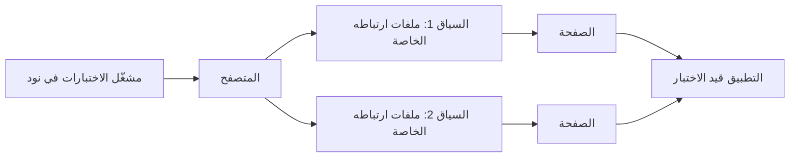

# الوحدة 3 — اختبار الواجهات (Testing interfaces)

*الواجهة (interface) هي أي مكان يلتقي فيه مستخدم أو نظام آخر ببرمجياتك (your software)، ولكل واجهة طريقتها الخاصة في الفشل (fails in its own way). اختبرت الوحدة 2 (Module 2) الشيفرة من الداخل (from the inside). أما هذه الوحدة فتختبرها من الخارج (from the outside)، كما يلتقي بها عملاء بنك نجم (Najm Bank) والبنوك الشريكة (partner banks) والمهاجمون (attackers). تبدأ بواجهة برمجة التطبيقات (API): الباب الأمامي (the front door) الذي يتشاركه تطبيق iOS وتطبيق Android وصفحة الويب (the web page) والأنظمة الشريكة (partner systems)، وفيها تختبر رموز الحالة (status codes) والمخططات (schemas) والمصادقة (authentication) والحالات السلبية (negative cases) والإرسال المزدوج المتزامن (the concurrent double-submit). ثم واجهة المستخدم على الويب (the web UI) مع اختبارات شاملة من البداية إلى النهاية (end-to-end tests) بأداة Playwright تبقى سريعة وجديرة بالثقة (fast and trustworthy). وأخيرًا الأسطح الأصعب (the harder surfaces): تطبيقات الهاتف (mobile apps) وإمكانية الوصول (accessibility) والاختلافات بين المتصفحات (cross-browser differences) والتوطين (localisation)، بما فيه التخطيط العربي من اليمين إلى اليسار (Arabic right-to-left layout). ستتابع ندى (Nada) وبلال (Bilal) وساعة واحدة من اختبار واجهات البرمجة (API testing) تكشف انهيارًا (a crash) وحالة تسابق (a race) وصيغة أخطاء غير متسقة (an inconsistent error format) في النظام النموذجي (the sample system)، ثم بلالًا مرة أخرى وهو يُبقي مجموعة اختبارات المتصفح صغيرة ومستقرة (a browser suite small and stable)، ثم أمل (Amal) وهي تجد في تدقيق الصفحة العربية (an audit of the Arabic page) ما لا يجده أي فحص آلي (no automated scan). ويسري الذكاء الاصطناعي (AI) في ذلك كله: احكم على اختبارات الواجهات والمتصفح التي يكتبها الوكيل (an agent) من خلال جدول الحالات الذي تركه فارغًا (the table of cases it left empty)، وتذكّر أن الواجهات نفسها هي ما تقودها أدوات الذكاء الاصطناعي (AI tools) حين تختبر نيابةً عنك (الدرس 6.3).*

> **التركيز (Focus):** Integration, UI — اختبار الأسطح التي يلتقي فيها الناس والأنظمة الأخرى ببرمجياتك (testing the surfaces where people and other systems meet your software)، واختيار الفحوص التي تُؤتمت والتي تُترك لإنسان (choosing which checks to automate and which to leave to a human).

---

# 3.1 — اختبار واجهات البرمجة (API testing): REST والمخططات (schemas) ورموز الحالة (status codes) والمصادقة (authentication) والحالات السلبية (negative cases)
*المستوى (Level): 🟡 متوسط (Intermediate)* · *المتطلبات (Prerequisites): 1.2، 2.1* · *التركيز (Focus): Integration, Security*

## ⚡ الدرس في دقيقة (In 60 seconds)
- **اختبار واجهة البرمجة (API test)** يرسل طلبات HTTP حقيقية (real HTTP requests) ويفحص الحالة (status) والترويسات (headers) والمحتوى (body) والآثار الجانبية (side effects). لا يحتاج إلى متصفح (browser)، فهو سريع ومستقر (fast and stable)، ويقع حيث يلتقي كل عميل (client) بالقواعد (the rules).
- صمّم لكل نقطة نهاية (per endpoint): المسار السعيد (happy path)، والتحقق من المدخلات (validation)، والحدود (boundaries)، و401، و403، وخاصية عدم التكرار (idempotency)، وصيغة الخطأ (error format)، وتحديد معدل الطلبات (rate limit)، وترقيم الصفحات (pagination).
- أكّد **العقد (contract)**: الحالة بدقة (exact status)، وشكلًا واحدًا للخطأ (one error shape)، ومخططًا صارمًا (a strict schema)، وأثر الطلب على الحالة (the effect on state).
- تولّد أداة **Schemathesis** طلبات من وثيقة OpenAPI (generates requests from the OpenAPI document) وتجد ما تفوّته الاختبارات المكتوبة يدويًا (hand-written tests).
- أكبر فخ (Biggest trap): المسار السعيد وحده (the happy path only). ساعة واحدة على النظام النموذجي (the sample) وجدت خطأ 500 وخصمًا مزدوجًا (a double debit) وأخطاءً غير متسقة (inconsistent errors).

## 🧭 لماذا يهم (Why it matters)
تبني فِرق (squads) طارق (Tariq) ثلاثة عملاء (three clients) على واجهة برمجة واحدة (one API): تطبيق iOS وتطبيق Android وصفحة الويب (the web page). وقبل أن يتكامل شريك (Before a partner integrates)، يطلب بلال (Bilal) من ندى (Nada) «ساعة من اختبار واجهة البرمجة» ("an hour of API testing") على `POST /transfers`. تكتب طلبًا واحدًا و`assert r.status_code == 201`. أخضر (Green). يسأل بلال عن الباقي (about the rest).

تُنتج الساعة التالية ثلاث نتائج لن تُظهرها أي شاشة (three findings no screen would show). مبلغ `1e30` يعيد HTTP 500. وطلبان متزامنان (two simultaneous requests) بمفتاح خاصية عدم التكرار نفسه (the same idempotency key) ينجحان كلاهما، فيُخصم الحساب مرتين (debited twice). وطلب مشوَّه (A malformed request) يحصل على `{"detail": [...]}` بينما قاعدة عمل مرفوضة (a rejected business rule) تحصل على `{"error": {"code": ...}}`، وكلاهما برمز الحالة 422، فالعميل الذي يحلّل شكلًا واحدًا يفشل مع الآخر (a client that parses one shape fails on the other). تُخفي صفحة الويب هذه العيوب (defects) خلف تحققها الخاص (its own validation)؛ أما واجهة البرمجة فلا تستطيع، لأن أي مستدعٍ (caller) يستطيع إرسال أي شيء (can send anything). ويحكم الجدول أدناه أيضًا على الاختبارات التي يكتبها الذكاء الاصطناعي (AI-written tests): فحين تطلب من مساعد «اختبارات لنقطة النهاية هذه» ("tests for this endpoint")، يعطيك مسارًا سعيدًا وحالتي تحقق (a happy path and two validation cases).

## 📐 كيف يعمل (How it works)

### 🟢 الأساسيات (The essentials)

**HTTP في شاشة واحدة (HTTP in one screen).** تكون الطريقة (method) **آمنة التكرار (idempotent)** إذا ترك تنفيذها مرتين الحالةَ نفسها التي يتركها تنفيذها مرة واحدة (leaves the same state as once): GET وPUT وDELETE كذلك، أما **POST فليست كذلك (is not)** وتحتاج إلى ترويسة `Idempotency-Key`. فئات رموز الحالة (Status classes): **2xx** نجح الطلب (worked) (200 و201)؛ **4xx** أخطأ المستدعي (the caller erred) (400 طلب مشوَّه (malformed)، و401 غير مصادَق (not authenticated)، و403 غير مسموح (not allowed)، و409 تعارض (conflict)، و422 سليم الصيغة لكنه مرفوض (well-formed but rejected)، و429 طلبات كثيرة جدًا (too many requests))؛ **5xx** فشل الخادم (the server failed). وقاعدة واحدة: **لا ينبغي لأي مُدخل من العميل أن ينتج 5xx (no client input should produce a 5xx).**

**صمّم قبل أن تكتب (Design before you type).** هذا هو تصميم `POST /transfers` باستخدام الدرس 1.2 (using lesson 1.2)؛ والعمود الأخير هو ما وجدناه (what we found).

| # | البُعد (Dimension) | مثال اختبار (Example test) | المتوقع (Expected) | على النظام النموذجي (On the sample) |
|---|---|---|---|---|
| 1 | المسار السعيد (Happy path) | ترسل أليس (Alice) 250.00 QAR | 201، ومحتوى صالح (valid body)، ورصيد (balance) أقل بمقدار 250.00 | ينجح (passes) |
| 2 | التحقق من المدخلات (Validation) | حقل ناقص (Missing field)، و`"abc"`، وثلاث خانات عشرية (three decimals) | 4xx، وشكل خطأ واحد (one error shape) | يتفاوت الشكل (shape varies) |
| 3 | الحدود (Boundaries) | 0.99 و1.00 و25,000.01، وإجمالي اليوم 50,000.00 بالضبط (day total exactly 50,000.00) | قواعد الدرس 1.2 (rules from lesson 1.2) | ينجح (passes) |
| 4 | المصادقة (Authentication) | بلا رمز (No token)، ورمز مزوَّر (forged token) | 401، ولا شيء يتغير (nothing changes) | ينجح (passes)؛ ولا ترويسة `WWW-Authenticate` |
| 5 | التفويض (Authorisation) | ينفق بوب (Bob) من acc-1؛ ويقرأ بوب تحويل أليس (Bob reads Alice's transfer) | 403 | ينجح (passes) |
| 6 | خاصية عدم التكرار (Idempotency) | المفتاح نفسه مرتين (Same key twice)؛ ومحتوى جديد (new body)؛ وطلبان معًا (two at once) | 200؛ 409؛ تحويل واحد (one transfer) | **تسابق (race): تحويلان (two transfers)** |
| 7 | صيغة الخطأ (Error format) | كل سبب للفشل (Every failure cause) | شكل واحد، ولا 5xx أبدًا (One shape, never 5xx) | **500 عند المبالغ الضخمة (huge amounts)؛ وشكلان (two shapes)** |
| 8 | تحديد معدل الطلبات (Rate limit) | 100 طلب في الثانية (100 requests in a second) | بعض ردود 429 مع `Retry-After` (Some 429 with Retry-After) | لا حد (no limit): ثغرة (a gap) |
| 9 | ترقيم الصفحات (Pagination) | نقطة نهاية قائمة مخطَّط لها (A planned list endpoint): الصفحة الأولى والأخيرة والفارغة، وحد 0 (first, last, empty page, limit 0) | ترتيب ثابت (Stable order)، بلا فجوات (no gaps) | لم تُبنَ بعد (not built yet) |

الصفوف من 6 إلى 9 هي التي تتخطاها الاختبارات المرتبة (the ones tidy tests skip). انسخ `testing/sample`، ونفّذ `pip install -r requirements.txt jsonschema schemathesis`، واحفظ الدوال المساعدة (save the helpers).

```python
# tests/conftest.py
import uuid
from decimal import Decimal

import pytest
from fastapi.testclient import TestClient

from najm.api import create_app
from najm.transfers import TransferService

ALICE = {"Authorization": "Bearer token-alice"}
BOB = {"Authorization": "Bearer token-bob"}


def world():    # fresh accounts per test, so test order never matters
    return {"acc-1": {"owner": "alice", "currency": "QAR", "balance": Decimal("100000.00")},
            "acc-2": {"owner": "bob", "currency": "QAR", "balance": Decimal("800.00")}}


@pytest.fixture
def client():   # raise_server_exceptions=False: a crash becomes the HTTP 500 a real client sees
    return TestClient(create_app(TransferService(world())), raise_server_exceptions=False)


def body(**overrides):
    return {"from_account": "acc-1", "to_account": "acc-2", "amount": "250.00",
            "currency": "QAR", "kind": "domestic", **overrides}


def post(client, who=ALICE, key=None, **overrides):   # a fresh idempotency key unless one is given
    return client.post("/transfers", json=body(**overrides),
                       headers={**who, "Idempotency-Key": key or str(uuid.uuid4())})
```

```python
# tests/test_api_status.py
import pytest

from conftest import post


@pytest.mark.parametrize("overrides, status, code", [
    ({"amount": "1.00"}, 201, None),
    ({"amount": "0.99"}, 422, "below_minimum"),
    ({"amount": "25000.01"}, 422, "above_per_transfer_max"),
    ({"amount": "10.005"}, 422, "too_many_decimals"),
    ({"currency": "USD"}, 422, "currency_mismatch"),     # acc-1 holds QAR, and that check runs first
    ({"from_account": "acc-2"}, 403, "not_owner"),        # Alice does not own acc-2
])
def test_status_and_error_code(client, overrides, status, code):
    r = post(client, **overrides)
    assert r.status_code == status
    assert r.json().get("error", {}).get("code") == code      # None for a 201


def test_a_day_total_of_exactly_50000_is_allowed(client):    # catches limit_off_by_one
    for _ in range(2):
        assert post(client, amount="25000.00").status_code == 201
    r = post(client, amount="1.00")                           # one step over
    assert (r.status_code, r.json()["error"]["code"]) == (422, "daily_limit_exceeded")
```

**ضعيف مقابل قوي (Weak versus strong).** يمرّ `assert r.status_code in (400, 422)` مع القاعدة الخاطئة ومع الإعداد الافتراضي للإطار (a framework default). أما الجدول فيثبّت الحالة (the status) ورمز `code` المستقر معًا، فيحمرّ صف واحد بالضبط حين يتغير حد واحد (so changing one limit turns exactly one row red).

**متى لا تفعل (When not to).** لا تُعِد اختبار كل قاعدة رسوم عبر HTTP (Do not re-test every fee rule through HTTP): طلب واحد لكل عائلة قواعد (one request per rule family) يثبت الربط (proves the wiring)، وتتولى اختبارات الوحدة (unit tests) (الدرس 2.1) الحساب (carry the arithmetic).

### 🟡 التعمق أكثر (Going deeper)

**افحص الشكل أولًا ثم القاعدة (Check the shape, then the rule).** قد يحمل رمز الحالة الصحيح محتوًى خاطئًا (The right status can carry a wrong body): رقمًا عشريًا بدل سلسلة نصية (a float for a string)، أو حقلًا ناقصًا (a missing field)، أو تسريب `owner` (a leaked owner). يصف **مخطط JSON (JSON Schema)** الشكل مرة واحدة (states the shape once)؛ و`additionalProperties: false` يُفشل أي حقل زائد (fails any extra field).

```python
# tests/test_api_contract.py
import pytest
from jsonschema import Draft202012Validator

from conftest import ALICE, body, post

S = {"type": "string"}
TRANSFER = {
    "type": "object", "additionalProperties": False,         # an extra field such as "owner" is a leak
    "required": ["id", "status", "from_account", "to_account", "amount", "currency", "fee", "value_date"],
    "properties": {
        "id": {"type": "string", "pattern": r"^tr-\d{4,}$"}, "status": S, "from_account": S, "to_account": S,
        "amount": {"type": "string", "pattern": r"^\d+(\.\d+)?$"},    # money travels as a string
        "currency": {"enum": ["QAR", "AED", "EUR"]},
        "fee": {"type": "string", "pattern": r"^\d+\.\d{2}$"},
        "value_date": {"type": "string", "pattern": r"^\d{4}-\d{2}-\d{2}$"},
    },
}
ERROR = {"type": "object", "required": ["error"], "additionalProperties": False,
         "properties": {"error": {"type": "object", "required": ["code", "message"]}}}


def test_weak_a_field_called_id_exists(client):
    assert "id" in post(client).json()      # passes even if fee becomes a float or "owner" leaks


def test_strong_the_shape_and_the_rule(client):
    r = post(client, amount="3090.00", kind="international")
    Draft202012Validator(TRANSFER).validate(r.json())    # raises, naming the field, if the shape is wrong
    assert r.json()["fee"] == "10.82"                    # the schema checks shape; this checks the rule
```

مع `NAJM_BUGS=float_fee` ينجح الاختبار الضعيف (the weak test passes) ويظل المخطط يتحقق (the schema still validates) (فـ`"10.81"` سليمة الصيغة (well formed))؛ ويفشل السطر الأخير: `assert '10.81' == '10.82'`. الشكل والقاعدة فحصان مختلفان (Shape and rule are different checks).

**وثيقة OpenAPI بوصفها عقدًا، وأداة Schemathesis (The OpenAPI document as a contract, and Schemathesis).** يَنشر FastAPI الوثيقة `/openapi.json` التي تسرد كل مسار ومعامل واستجابة (lists every path, parameter and response)؛ وتبني عليها العملاء والبوابات (clients and gateways). تولّد أداة **Schemathesis** (المبنية على Hypothesis، الدرس 2.3) طلبات صالحة وغير صالحة منها (generates valid and invalid requests) وتفحص كل استجابة (checks every response). شغّل النظام النموذجي بالأمر `uvicorn najm.api:app --port 8000`، ثم نفّذ:

```bash
schemathesis run http://127.0.0.1:8000/openapi.json --checks all --max-examples 50 --seed 1 \
    -H "Authorization: Bearer token-alice" -H "Idempotency-Key: st-1"
```

```text
(condensed from Schemathesis 4.30; layouts vary by version)
Undocumented HTTP status code (documented: 200, 422). Received:
  404  GET /accounts/{account_id}/balance
  404  GET /transfers/{transfer_id}
  403  POST /transfers
  400  POST /transfers   {"detail":"There was an error parsing the body"}
API rejected schema-compliant request: 422 decimal_parsing on "amount"
```

كل سطر قرار (Each line is a decision). تقول الوثيقة 200 و422، لكن الشيفرة تجيب أيضًا بـ 201 و400 و401 و403 و404 و409. وهي تصف `amount` بأنه «رقم أو سلسلة نصية» ("a number or a string")، ومع ذلك يُرفض `"abc"`. ويظهر شكل خطأ ثالث (A third error shape appears). لا تستطيع Schemathesis أن تجد *قاعدة* خاطئة (a wrong rule): فقد بنى FastAPI الوثيقة من الشيفرة (built the document from the code).

فاتت الجولة الأولى خطأ 500 (The first pass missed the 500): فمعرّفات الحسابات العشوائية (random account ids) توقفت عند `403 not_owner` قبل أي فحص للمبلغ (any amount check). يُبقي ملف الخطافات (A hooks file) بقية الحقول صالحة (keeps the other fields valid) فيُختبر المبلغ، ويعطي كل استدعاء مفتاحًا جديدًا (a fresh key) فلا توقف أخطاء 409 التشغيل. احفظه بجانب `najm/`، وضع `SCHEMATHESIS_HOOKS=najm_hooks` قبل الأمر نفسه، واحذف منه ترويسة `Idempotency-Key` (فهي تتجاوز ما في الخطاف، it overrides the hook's):

```python
# najm_hooks.py
import uuid

import schemathesis


@schemathesis.hook
def map_body(ctx, body):
    if isinstance(body, dict):
        body.update(from_account="acc-1", to_account="acc-2", currency="QAR", kind="domestic")
    return body


@schemathesis.hook
def before_call(ctx, case, **kwargs):
    case.headers = {**(case.headers or {}), "Idempotency-Key": str(uuid.uuid4())}
```

الآن تبلّغ Schemathesis عن `[500]` عند `"amount": 1.2276573252243301e+182`: يرفع `Decimal.quantize` الاستثناء `InvalidOperation` دون التقاطه (uncaught). لا يزرع النظام النموذجي هذا العيب (does not seed it)؛ لقد وجده الاختبار (testing found it).

**الاختبار السلبي (Negative testing).** حوّل النتائج إلى اختبارات دائمة (permanent tests) وثبّت صيغة الخطأ لكل سبب (pin the error format for every cause):

```python
# tests/test_api_contract.py (continued)
H = {**ALICE, "Idempotency-Key": "k-1"}
BAD_REQUESTS = {                  # cause: (expected status, request)
    "malformed json": (422, dict(content="{oops", headers={**H, "Content-Type": "application/json"})),
    "missing field": (422, dict(json={}, headers=H)),
    "wrong type": (422, dict(json=body(amount="abc"), headers=H)),
    "business rule": (422, dict(json=body(amount="0.99"), headers=H)),
    "no token": (401, dict(json=body(), headers={"Idempotency-Key": "k-1"})),
}


@pytest.mark.parametrize("cause", BAD_REQUESTS)
def test_every_error_has_one_shape(client, cause):    # MEANT TO FAIL for three causes on the sample
    status, request = BAD_REQUESTS[cause]
    r = client.post("/transfers", **request)
    assert r.status_code == status
    Draft202012Validator(ERROR).validate(r.json())


@pytest.mark.parametrize("amount", ["1e1000", 1e30])
def test_absurd_amounts_are_rejected_not_crashed(client, amount):    # MEANT TO FAIL: the sample says 500
    assert post(client, amount=amount).status_code == 422
```

```text
FAILED test_every_error_has_one_shape[malformed json]    ValidationError: 'error' is a required property
FAILED test_every_error_has_one_shape[missing field] and [wrong type]    (same)
FAILED test_absurd_amounts_are_rejected_not_crashed[1e1000]    assert 500 == 422
FAILED test_absurd_amounts_are_rejected_not_crashed[1e+30]     (same)
```

ثلاثة من الأسباب الخمسة تستخدم شكل الإطار (Three of five causes use the framework's shape). والخيار `raise_server_exceptions=False` مهم: فبشكل افتراضي يعيد عميل الاختبار (the test client) رفع الانهيار على هيئة استثناء (re-raises a crash as an exception)، مخفيًا الخطأ 500 الذي يراه العملاء (hiding the 500 customers see).

**401 و403 وترتيب الفحوص (401, 403 and the order of checks).** يعني **401** «لا أعرف من أنت» ("I do not know who you are")، وقد يحلّه تسجيل الدخول (signing in can fix it). ويعني **403** «أعرفك، والجواب لا» ("I know, and the answer is no")؛ والتطبيق الذي يعامله على أنه «انتهت الجلسة» ("session expired") يُخرج العملاء بلا داعٍ (logs customers out for nothing). ترتيب الفحوص جزء من العقد (The order of checks is part of the contract). يتحقق النظام النموذجي من المحتوى (validates the body) (422، شكل الإطار)، ثم الرمز (the token) (401)، ثم مفتاح خاصية عدم التكرار (idempotency key) (400)، ثم الملكية (ownership) (403)، ثم قواعد العمل (business rules) (422، شكل البنك)، فيحصل الطلب بلا رمز وبمحتوى فارغ على 422 لا 401. و**BOLA** (كسر التفويض على مستوى الكائن، broken object-level authorisation) هو الوصول إلى كائن مستخدم آخر بتغيير معرّف (reaching another user's object by changing an id). والاختبار الضعيف، وهو قراءة أليس (Alice) تحويلها هي، ينجح والعيب مفعّل (passes with the bug on). أما الاختبار القوي ففيه بوب (Bob) هو من يطلب (has Bob ask):

```python
# tests/test_api_security.py
from conftest import BOB, post


def test_bob_cannot_read_alices_transfer(client):
    created = post(client).json()                        # Alice's transfer
    r = client.get(f"/transfers/{created['id']}", headers=BOB)
    assert r.status_code == 403
    assert r.json()["error"]["code"] == "not_owner"
```

```text
$ NAJM_BUGS=bola pytest tests/test_api_security.py
E   assert 200 == 403          1 failed
```

يقرأ اختبار بوب في المجموعة الابتدائية (The starter's Bob test) *رصيدًا (balance)* لا يمسّه العيب أبدًا. ويضع [*أمن الذكاء الاصطناعي والتطبيقات (Secure AI & Application Security)*، الدرس 4.1 — أهم 10 مخاطر لواجهات البرمجة وفق OWASP عمليًا (The OWASP API Security Top 10 in practice)](../secai/index.ar.html#/4.1) BOLA في المرتبة الأولى (ranks BOLA first).

### 🔴 نظرة الخبير (Expert view)

**خاصية عدم التكرار والإرسال المزدوج المتزامن (Idempotency and the concurrent double-submit).** ينجح اختبار إعادة الإرسال المتتابع في المجموعة الابتدائية (The starter's sequential replay test passes). أما طلبان متزامنان فلا: فالدالة `submit()` تبحث عن المفتاح، ثم تؤدي العمل، ثم تسجّل المفتاح، ويستطيع الطلبان معًا اجتياز البحث (both can pass the look). يفرض الاختبار تبديل الخيوط (forces thread switches)، ويكرر 100 مرة، ويفحص الرصيد (checks the balance). و`xfail(strict=True)` يركن عيبًا معروفًا (parks a known defect)، ويُحمّر المجموعة في اليوم الذي يُصلَح فيه إن لم تُزَل العلامة (turns the suite red the day it is fixed without removing the mark).

```python
# tests/test_api_idempotency.py
import sys
import threading
from concurrent.futures import ThreadPoolExecutor

import pytest
from fastapi.testclient import TestClient

from conftest import ALICE, body, world
from najm.api import create_app
from najm.transfers import TransferService


def balance(client):
    return client.get("/accounts/acc-1/balance", headers=ALICE).json()["balance"]


@pytest.mark.xfail(strict=True, reason="check-then-act race in submit()")
def test_a_concurrent_double_submit_creates_one_transfer():
    old = sys.getswitchinterval()
    sys.setswitchinterval(1e-6)                          # make unlucky interleavings common, not rare
    try:
        for attempt in range(100):
            client = TestClient(create_app(TransferService(world())), raise_server_exceptions=False)
            gate = threading.Barrier(2)

            def send(_):
                gate.wait()                              # both requests leave at the same moment
                return client.post("/transfers", json=body(), headers={**ALICE, "Idempotency-Key": "same"})

            with ThreadPoolExecutor(2) as pool:
                codes = sorted(r.status_code for r in pool.map(send, range(2)))
            assert codes == [200, 201], f"attempt {attempt}: {codes}"
            assert balance(client) == "99750.00", f"attempt {attempt}: debited twice"
    finally:
        sys.setswitchinterval(old)
```

```text
$ pytest tests/test_api_idempotency.py --runxfail
FAILED test_a_concurrent_double_submit_creates_one_transfer - AssertionError: attempt 6: [201, 201]
```

تتفاوت المحاولة الفاشلة (The failing attempt varies). عند فترة التبديل العادية في Python (At Python's normal switch interval) ظهر التسابق في 1 من 900 تجربة على الأكثر (at most 1 of 900 trials)، لذا يفرضه الاختبار. القفل (A lock) يصلح عملية واحدة (one process)؛ أما الإنتاج فيشغّل عدة عمليات (production runs several)، فالإصلاح الحقيقي قيد فريد (unique constraint) على `(user, key)` ([*تصميم الأنظمة لمبرمجي الفايب (System Design for Vibe Coders)*، الدرس 2.6 — نقرتان في آن واحد: حالات التسابق والمعاملات والكتابات الآمنة للتكرار (Two clicks at once: races, transactions, and idempotent writes)](../vibe/index.ar.html#l2-6)).

**استبدل ما لا تملكه ببدائل (Mock or virtualise what you do not own).** ستستدعي التحويلات خدمة فحص العقوبات (a sanctions-screening service) لا يتحكم فيها نجم. والبديل المزيّف (A fake) الذي يقول دائمًا «سليم» ("clear") لا يختبر إلا المسار السعيد (tests only the happy path)؛ فاختبر كيف تنهار التبعية (test how the dependency breaks). ومع `httpx.MockTransport` يصبح البديل دالة Python: أعد `httpx.Response(503)` أو ارفع `httpx.ConnectTimeout`، وتأكد أن التحويل يُرفض (the transfer is refused) (**الفشل المغلق، fail closed**). يزيّف `respx` الاستدعاءات الصادرة من شيفرة تبني عميل `httpx` خاصًا بها (fakes calls from code that builds its own client)؛ و**WireMock** و**MockServer** خادمان مزيّفان قائمان بذاتهما (standalone fake servers). والبديل المزيّف الذي ينحرف عن الخدمة الحقيقية يكذب (A fake that drifts from the real service lies)، فافحص الاثنين وفق عقد واحد (check both against one contract) (الدرس 2.2).

**إدارة الإصدارات والتوافق مع الإصدارات السابقة (Versioning and backward compatibility).** يدعم نجم نسخ التطبيق القديمة أشهرًا (supports old app versions for months). إضافة حقل اختياري إلى الاستجابة (an optional response field) آمنة للعملاء الذين يتجاهلون الحقول المجهولة (clients that ignore unknown fields)؛ أما حذف حقل أو إعادة تسميته أو تغيير نوعه، أو اشتراط حقل جديد في الطلب، فيكسر العملاء القدامى (breaks old clients). احتفظ بـ**تجهيزة من العميل القديم (a fixture from the old client)**، مثل طلب بلا `kind`، وتأكد أن واجهة اليوم ما زالت تعيد 201 مع كل حقول الاستجابة القديمة (every old response field). وتسرد الأداة `oasdiff` التغييرات الكاسرة (breaking changes) بين وثيقتي OpenAPI.

**GraphQL وgRPC (GraphQL and gRPC).** لدى GraphQL نقطة نهاية واحدة يختار فيها العميل الحقول: اختبر التفويض لكل حقل على حدة (authorisation per field) (فـ BOLA يختبئ في الكائنات المتداخلة، nested objects)، وحدود العمق (depth limits)، والأخطاء في المصفوفة `errors` حتى مع HTTP 200. أما gRPC فعقد مكتوب الأنواع بـ Protocol Buffers (a typed contract): أكّد رموزًا مثل `UNAUTHENTICATED`، وحدّد المهل (set deadlines)، ولا تعِد ترقيم حقل أبدًا (never renumber a field) (يفحص ذلك `buf breaking`).

**أدوات التعاون والتكامل المستمر (Collaboration and CI tools).** تعمل مجموعات **Postman** في التكامل المستمر (CI) عبر **Newman**؛ ويحتفظ **Bruno** بالطلبات ملفاتٍ نصية بسيطة في Git (plain-text files). وقعنا في فخ مع النظام النموذجي (we hit a trap): قرأ Bruno العبارة `eq 0.00` على أنها *الرقم* 0 (the *number* 0)، لكن واجهة البرمجة ترسل السلسلة النصية `"0.00"` (the string)، فاكتب `eq "0.00"`. وتستخدم المؤسسات التي تعتمد Java أداة **REST Assured**.

```bash
bru run --env local --reporter-junit bruno-results.xml
newman run najm.postman_collection.json -e local.postman_environment.json --reporters cli,junit
```

## 🧰 الأدوات (The toolkit)
| الأداة أو الممارسة أو التقنية (Tool, practice or technique) | ما هي وماذا تفعل (What it is and does) | متى تلجأ إليها (When to reach for it) |
|---|---|---|
| **pytest with TestClient and httpx** | اختبارات Python تستدعي التطبيق داخل العملية أو عبر الشبكة (call the app in-process or over the network) | الخيار الافتراضي لواجهات Python (Default for Python APIs)؛ وتعمل مع كل طلب دمج (on every pull request) |
| **JSON Schema** — مخطط JSON | لغة معيارية لوصف شكل JSON (A standard language for the shape of JSON) | فحوص تفشل عند الحقول الزائدة أو خاطئة النوع (Checks that fail on extra or mistyped fields) |
| **OpenAPI and Schemathesis** | وصف لواجهة البرمجة (An API description)، وأداة تولّد طلبات منه (a tool that generates requests from it) | العقود بين الفرق (Contracts between teams)؛ وصيد ليلي للانهيارات والانحراف (nightly hunts for crashes and drift) |
| **Postman, Newman and Bruno** | مجموعات طلبات مع اختبارات (Request collections with tests)، ومشغّل بسطر الأوامر (a command-line runner)، وعميل مناسب لـ Git (a Git-friendly client) | الاستكشاف المشترك (Shared exploration)؛ وطلبات تعمل في التكامل المستمر (requests run in CI) |
| **httpx MockTransport and WireMock** | وسيلة نقل مزيّفة داخل العملية (An in-process fake transport)، وخادم HTTP مزيّف (a fake HTTP server) | تبعية متوقفة أو بطيئة أو خاطئة (A dependency that is down, slow or wrong) |

## 🏛️ عمليًا في بنك نجم (In practice at Najm Bank)
ينشر بلال (Bilal) **معيار نجم لاختبار واجهات البرمجة، الإصدار 1 (Najm API Test Standard v1)**، وهو قائمة تحقق من صفحة واحدة (a one-page checklist) لكل نقطة نهاية (every endpoint). الجزء أ (Part A) هو الدليل على أن المجموعة تعمل (the evidence a suite works)، كتبها إنسان أو الذكاء الاصطناعي (human- or AI-written): يفعّل راشد (Rashid) كل عيب مزروع (each seeded bug) ويجب أن يحمرّ اختباره المقابل (its mapped test must turn red).

| العيب (Defect) | الاختبار الذي يلتقطه (Test that catches it) | الحالة (Status) |
|---|---|---|
| `float_fee` | `test_strong_the_shape_and_the_rule` | التُقط (caught) |
| `limit_off_by_one` | `test_a_day_total_of_exactly_50000_is_allowed` | التُقط (caught) |
| `no_idempotency`, `bola` | اختبار إعادة الإرسال في المجموعة الابتدائية (the starter replay test)؛ `test_bob_cannot_read_alices_transfer` | التُقط (caught) |
| `tz_cutoff` | لا شيء (none): واجهة البرمجة تقرأ الساعة الحقيقية (the API reads the real clock) | ثغرة (gap)؛ تتولاها اختبارات الساعة في الدرس 2.1 (lesson 2.1's clock tests own it) |
| 500 على المبالغ الضخمة (500 on absurd amounts) | `test_absurd_amounts_are_rejected_not_crashed` | عيب مفتوح (open defect) |
| سباق خاصية عدم التكرار (Idempotency race) | `test_a_concurrent_double_submit_creates_one_transfer` | مفتوح (open)، `xfail` |
| شكلا خطأ (Two error shapes) | `test_every_error_has_one_shape` | عيب مفتوح (open defect) |

**الجزء ب: خط الإنتاج (Part B: pipeline).** مع كل طلب دمج (Every pull request): المجموعة داخل العملية (the in-process suite) في أقل من دقيقتين. ليليًا (Nightly): Schemathesis ببذرة ثابتة (with a fixed seed) على بيئة ما قبل الإنتاج (staging). وبعد كل نشر (After each deploy): فحص دخان (a smoke check).

**الجزء ج: القواعد (Part C: rules).** شكل خطأ واحد (One error shape)؛ وكل رمز حالة في وثيقة OpenAPI (every status in the OpenAPI document)؛ ومفتاح خاصية عدم التكرار على كل `POST` ينقل المال (an idempotency key on every money-moving POST)؛ ولا اختبار عشوائي موجَّه (fuzzing) دون إذن مكتوب (without written permission)؛ ولكل عيب اختبار قبل الإصلاح (every defect a test before the fix).

## 🛠️ التمارين (Exercises)
اعمل في نسخة من `testing/sample` (Work in a copy).

- 🟢 **صمّم واختبر `GET /accounts/{id}/balance` (Design and test).** اكتب جدول تصميمه (its design table)، ثم اختبارات للمسار السعيد مع مخطط (the happy path with a schema)، وبلا رمز (no token)، ورمز مزوَّر (a forged token)، وبوب (Bob) يقرأ `acc-1`، وحساب مجهول (an unknown account). *يكتمل عندما (Done when):* تنجح كلها (all pass)، وإعادة الرصيد رقمًا في نسختك (returning the balance as a number in your copy) تُفشل اختبار المخطط (fails the schema test) بينما يظل `assert "balance" in body` ينجح (still passes).
- 🟡 **أغلق ثغرات العقد (Close the contract gaps).** شغّل أمر Schemathesis الأول. في `najm/api.py`، صرّح بكل رمز حالة تعيده الشيفرة (declare every status the code returns) (`status_code=201`، ثم `responses=` لبقيتها) وأضف معالجًا لـ `RequestValidationError` يستخدم الشكل `{"error": ...}`. *يكتمل عندما (Done when):* تنخفض إخفاقات «Undocumented HTTP status code» الأربعة إلى صفر (the four failures drop to zero) ويمرّ `test_every_error_has_one_shape` لجميع الأسباب الخمسة (for all five causes).
- 🔴 **أصلح التسابق بأمانة (Fix the race, honestly).** شغّل الاختبار المتزامن (the concurrent test) مع `--runxfail` وشاهده يفشل. اقفل `submit()` في نسختك وأزل `xfail`. *يكتمل عندما (Done when):* ينجح الاختبار 20 تشغيلة متتالية (passes 20 runs in a row)، ويظل يفشل تحت `NAJM_BUGS=no_idempotency`، وتوضح ملاحظة ما الذي ينكسر مع أربع عمليات خادم (what breaks with four server processes) وتسمّي قيد قاعدة البيانات الذي يصلحه (names the database constraint that fixes it).

## ⚠️ أخطاء وفخاخ (Mistakes and traps)
- **تأكيدات الحالة وحدها (Status-only assertions).** يمرّ `assert r.ok` مع القاعدة الخاطئة (passes for the wrong rule). ثبّت الحالة (status) ورمز الخطأ `code` وشكل المحتوى (body shape).
- **الوثوق بوثيقة مولَّدة (Trusting a generated document).** ملف OpenAPI المبني من الشيفرة يتفق مع الشيفرة (agrees with the code). اكتب العقد من المتطلبات (Write the contract from requirements).
- **محاكاة الشيء قيد الاختبار (Mocking the thing under test).** زيّف ما لا تملكه فقط (Fake only what you do not own)، واختبر كيف يفشل (test how it fails).
- **زوج محظوظ واحد من الطلبات (One lucky pair of requests).** تختبئ حالات التسابق (Races hide): كرّر الاختبارات المتزامنة (repeat concurrent tests) وأكّد الأثر (assert on the effect).
- **الاختبار العشوائي لما لا تملكه (Fuzzing what you do not own).** ولّد الطلبات ضد أنظمتك أنت فقط أو بإذن مكتوب (Generate requests only against your own systems or with written permission).

## 🧾 الخلاصة (Recap)
- صمّم اختبارات واجهة البرمجة عبر تسعة أبعاد (nine dimensions)؛ والمجموعات المرتبة (tidy suites) تتخطى الأربعة الأخيرة.
- أكّد الحالة (status) ورمز الخطأ المستقر (stable error code) والمخطط الصارم (strict schema) والأثر على الحالة (effect on state)؛ وافحص الشكل والقاعدة كلًا على حدة (check shape and rule apart).
- تجد Schemathesis رموز الحالة غير الموثَّقة (undocumented statuses) والانهيارات (crashes)، لا القواعد الخاطئة (wrong rules).
- 401 تعني «من أنت» ("who are you")، و403 تعني «لست أنت» ("not you")؛ وقراءة بوب (Bob) تحويلَ أليس (Alice's transfer) تكشف BOLA.
- اختبر خاصية عدم التكرار (idempotency) بالتزامن (concurrently)، واختبر كيف تفشل التبعية (how a dependency fails).

## ✍️ اختبر نفسك (Check yourself)

**1. يرسل اختبار `amount` بقيمة "0.99" (posts) ويؤكد `r.status_code in (400, 422)`. يرفع مطوّر الحد الأدنى (the minimum) من 1.00 إلى 5.00. ماذا يحدث؟**

- A. يفشل، لأن 0.99 لم يعد غير صالح (It fails, since 0.99 is no longer invalid)
- B. يفشل، لأن رمز الخطأ تغيّر (It fails, because the error code changed)
- C. يفشل، لأن الحالة تصبح 5xx (It fails, as the status becomes a 5xx)
- D. ما زال ينجح، فيفوّته التغيير (It still passes, so it misses the change)

<details><summary>الإجابة</summary>

**D.** 0.99 غير صالح تحت الحدّين، والاختبار يقبل حالتين (accepts two statuses)، فلا شيء يحمرّ (nothing turns red). أما تثبيت الرمز (Pinning the code) واختبار 4.99 و5.00 فيكشفان ذلك. (🟢 الأساسيات، The essentials.)

</details>

**2. بعد انتهاء مهلة الجلسة (After a session timeout)، يُخرج تطبيق نجم العملاء كلما أجابت واجهة البرمجة بـ 403. أي عبارة عن 401 و403 صحيحة؟**

- A. 401 تعني معروف لكن مرفوض (known but refused)؛ و403 تعني مجهول (unknown)
- B. كلتاهما تعنيان «غير مسجّل الدخول» ("not signed in")، فيجوز للتطبيقات معاملتهما سواء
- C. 403 تعني معروف لكن مرفوض (known but refused)؛ و401 تعني مجهول (unknown)
- D. 401 لـ JSON غير الصالح (invalid JSON)، و403 لقواعد العمل المخروقة (broken business rules)

<details><summary>الإجابة</summary>

**C.** مع 401 لا يعرفك الخادم (does not know you)، فيفيد تسجيل الدخول؛ ومع 403 يعرفك، والجواب لا. (🟡 التعمق أكثر، Going deeper.)

</details>

**3. مع تفعيل `NAJM_BUGS=bola`، ينشئ اختبار ندى (Nada) تحويلًا بصفة أليس (Alice) ويقرأه بصفة أليس. ينجح. ماذا يُظهر ذلك؟**

- A. أن العيب المزروع ليس في الشيفرة (The seeded bug is not in the code)
- B. لا شيء عن التفويض على مستوى الكائن (Nothing about object-level authorisation)
- C. أن واجهة البرمجة آمنة لكل المستخدمين والتحويلات الأخرى (secure for every other user and transfer)
- D. أن العيب يعيش في طبقة قاعدة البيانات (lives in the database layer)

<details><summary>الإجابة</summary>

**B.** قراءة أليس تحويلها هي صحيحة مع العيب ودونه (true with and without the bug)؛ وحده طلب بوب (Bob) يستطيع أن يفشل. (🟡 التعمق أكثر، Going deeper.)

</details>

**4. يرسل اختبار مفتاح خاصية عدم التكرار (idempotency key) نفسه مرتين بالتتابع (in sequence) ويؤكد 201 ثم 200. ينجح دائمًا، لكن العملاء يرسلون أحيانًا مرتين في آن واحد (double-submit at once). ما أفضل خطوة تالية؟**

- A. إرسال الطلبين معًا، وتكرار ذلك مرات كثيرة، وفحص الرصيد (check the balance)
- B. إضافة فترة انتظار (a sleep) بين الاستدعاءين ليستقر الناتج (so the result is stable)
- C. حذف الاختبار، لأن نجاحه يثبت سلامة الميزة (a pass proves the feature is fine)
- D. محاكاة الخدمة (Mock the service) بحيث يعيد الاستدعاء الثاني 200 دائمًا كما هو متوقع

<details><summary>الإجابة</summary>

**A.** وحده اختبار متزامن متكرر يفحص الرصيد يستطيع رؤية حالة التسابق (a race)؛ وفترة الانتظار تزيل التداخل (a sleep removes the overlap). (🔴 نظرة الخبير، Expert view.)

</details>

**5. تبلّغ Schemathesis عن «Undocumented HTTP status code: Received 403, Documented 200, 422» على `POST /transfers`. ما القراءة الصحيحة؟**

- A. واجهة البرمجة خاطئة؛ غيّرها لتعيد 200 كي تطابق الوثيقة (to match the document)
- B. النتيجة ضجيج (noise)، لأن 403 أمر عادي
- C. الأداة معطوبة (faulty)، لأن 403 ينتج عن الملكية (follows from ownership)
- D. العقد ناقص (incomplete): صرّح بـ 403 وبقية الرموز (declare 403 and the others)

<details><summary>الإجابة</summary>

**D.** الرمز 403 صحيح؛ والوثيقة لا تخبر العملاء بما يتوقعونه (does not tell clients what to expect). ومطابقة واجهة البرمجة لها ستحذف قاعدة حقيقية (would delete a real rule). (🟡 التعمق أكثر، Going deeper.)

</details>

## 📚 المراجع (References)
- توثيق pytest (pytest documentation) — https://docs.pytest.org/
- توثيق Hypothesis، المحرك وراء Schemathesis (Hypothesis documentation, the engine behind Schemathesis) — https://hypothesis.readthedocs.io/
- مشروع OWASP لأمان واجهات البرمجة (OWASP API Security Project) — https://owasp.org/www-project-api-security/
- توثيق Pact، اختبار العقود الموجَّه بالمستهلك (Pact documentation, consumer-driven contract testing) — https://docs.pact.io/
- Martin Fowler، عن البدائل الاختبارية واختبارات العقد (on test doubles and contract tests) — https://martinfowler.com/

---

# 3.2 — اختبار واجهة الويب والاختبار الشامل من البداية إلى النهاية بأداة Playwright (Web UI and end-to-end testing with Playwright): المحدِّدات (locators) والانتظار (waiting) وكائنات الصفحة (page objects) والمجموعات المستقرة (stable suites)
*المستوى (Level): 🟡 متوسط (Intermediate)* · *المتطلبات (Prerequisites): 2.1، 3.1* · *التركيز (Focus): UI*

## ⚡ الدرس في دقيقة (In 60 seconds)
- **الاختبار الشامل من البداية إلى النهاية (end-to-end, E2E test)** يقود متصفحًا حقيقيًا (a real browser) عبر رحلة مستخدم (a user journey). يرى ما يراه العميل (sees what the customer sees) لكنه أبطأ الاختبارات (the slowest test)، فاحتفظ بقلة منها (keep a few).
- يمنح **Playwright** كل اختبار **سياق متصفح (browser context)** جديدًا، و**ينتظر تلقائيًا (auto-waits)** العناصر، ويعيد محاولة **التأكيدات المعاودة (web-first assertions)** حتى تنجح أو تنتهي المهلة (until they pass or time out).
- حدّد العناصر كما يراها المستخدم أو قارئ الشاشة (as a user or screen reader would): الدور (role) والتسمية (label) والنص (text) ومعرّف الاختبار (test id). ويأتي CSS وXPath أخيرًا (come last).
- لا تستخدم `sleep` أبدًا. انتظر شرطًا (Wait on a condition)، وامتلك بياناتك (own your data)، وسجّل الدخول عبر واجهة البرمجة (log in through the API).
- أكبر فخ (Biggest trap): مجموعة يعيد الناس تشغيلها حتى تخضرّ (a suite people re-run until green). أصلح كل اختبار غير مستقر (flaky test) أو اعزله (quarantine).

## 🧭 لماذا يهم (Why it matters)
تنقر أليس (Alice) **Send transfer** مرتين لأن الشاشة بطيئة (the screen is slow)، فيغادر حسابها 500 QAR بدل 250. اختبارات واجهة البرمجة التي كتبتها ندى (Nada's API tests) خضراء: فكل طلب كان صالحًا وحمل مفتاح خاصية عدم التكرار فريدًا (a unique idempotency key). العيب في الصفحة (The bug is in the page)، فهي تصنع مفتاحًا *جديدًا* مع كل نقرة، فيعامل الخادم النقرتين بحق على أنهما تحويلان (correctly treats two clicks as two transfers). لا يراه إلا اختبار ينقر كما ينقر الإنسان (a test that clicks like a human).

الاختبارات الشاملة (E2E tests) سهلة الخطأ أيضًا (easy to get wrong). مجموعة من 200 اختبار متصفح (200 browser tests) تستغرق 40 دقيقة وتفشل مرة كل عشر تشغيلات تعلّم الفريق أن يضغط «إعادة التشغيل» ("re-run")، فتختبئ الإخفاقات الحقيقية (real failures hide). وتخمين الخطأ في الدرس 1.2، «النقر المزدوج: تحويل واحد لكل نقرة» ("double-click: one transfer per click")، هو اختبار يكتبه هذا الدرس (a test this lesson writes). وتحكم المعايير نفسها على اختبارات المتصفح المولَّدة بالذكاء الاصطناعي (AI-generated browser tests)، التي كثيرًا ما تصل ومعها فترات انتظار ثابتة (sleeps) ومحدِّدات موضعية (positional selectors).

## 📐 كيف يعمل (How it works)

### 🟢 الأساسيات (The essentials)

**متى تستخدم الاختبار الشامل (When to use E2E).** استخدمه لـ**قلة من الرحلات الحرجة (a few critical journeys)** (تسجيل الدخول، وإرسال تحويل، وعرض رصيد: sign in, send a transfer, view a balance) ولما لا يُظهره إلا المتصفح: العرض (rendering) والنقرات (clicks) والتركيز (focus) والتوقيت الحقيقي (real timing). ولا تستخدمه للقواعد: رسم 3,090.00 QAR مكانه اختبار وحدة (a unit test) (الدرس 2.1) أو اختبار واجهة برمجة (an API test) (الدرس 3.1)، وهما يعملان في أجزاء من الثانية (milliseconds) ويفشلان بسبب واضح (fail with a clear cause).

**بنية Playwright (Playwright's architecture).** مشغّل الاختبارات (The test runner) عملية Node.js (a Node.js process). وهو يتحكم في متصفح (Chromium أو Firefox أو WebKit) يستضيف عدة **سياقات متصفح (browser contexts)**: ملفات تعريف معزولة (isolated profiles) لكل منها ملفات ارتباطه وتخزينه الخاصة (their own cookies and storage)، وإنشاؤها رخيص (cheap to create). يحصل كل اختبار على سياق وصفحة جديدين، فلا تتسرب الحالة بين الاختبارات (tests do not leak state into each other).



فكرتان تزيلان معظم عدم الاستقرار (Two ideas remove most flakiness). **الانتظار التلقائي (Auto-waiting):** قبل `click` أو `fill` أو `check`، ينتظر Playwright حتى يصبح العنصر مرئيًا ومستقرًا ومفعّلًا وغير مغطًّى (visible, stable, enabled and not covered). أما **التأكيدات المعاودة (Web-first assertions)** مثل `toBeVisible` و`toHaveText` و`toHaveValue` فتعيد المحاولة حتى تنجح أو تنتهي مهلتها (5 ثوانٍ افتراضيًا، 5 seconds by default)، بدل قراءة الصفحة مرة واحدة (instead of reading the page once).

**هيكل المشروع والإعداد (Project layout and config).** في نسخة من `testing/sample`، نفّذ `npm install` و`npm install -D @axe-core/playwright` و`npx playwright install chromium`؛ وتعيش الاختبارات في `e2e/`. استبدل ملف `e2e/playwright.config.ts` الابتدائي (the starter):

```typescript
// e2e/playwright.config.ts
import { defineConfig, devices } from '@playwright/test';

export default defineConfig({
  testDir: '.',
  fullyParallel: true,
  forbidOnly: !!process.env.CI,
  retries: process.env.CI ? 1 : 0,         // a passing retry is reported as "flaky"
  reporter: [['list'], ['html', { open: 'never' }]],
  use: { baseURL: 'http://127.0.0.1:8000', trace: 'on-first-retry' },
  projects: [
    { name: 'setup', testMatch: /auth\.setup\.ts/ },
    { name: 'chromium', use: { ...devices['Desktop Chrome'], storageState: '.auth/alice.json' }, dependencies: ['setup'] },
  ],
  webServer: {
    command: `${process.env.PYTHON ?? 'python'} -m uvicorn najm.api:app --port 8000`,
    cwd: '..',
    url: 'http://127.0.0.1:8000/health',
    reuseExistingServer: !process.env.CI,
  },
});
```

شغّل من `testing/sample`: `npx playwright test --config e2e/playwright.config.ts`. وأضف `.auth/` إلى `.gitignore`؛ فالجلسة المحفوظة بيانات اعتماد (a saved session is a credential).

**المحدِّدات: الدور أولًا (Locators: role first).** **المحدِّد (locator)** يقول كيف تجد عنصرًا في كل مرة تحتاج إليه (how to find an element each time it is needed). فضّل ما يدركه المستخدم أو قارئ الشاشة (what a user or screen reader perceives). كل خطوة إلى الأسفل أكثر هشاشة (more fragile)، والصفوف العليا تعمل أيضًا فحوص إمكانية وصول (double as accessibility checks)، لأنها تفشل إذا غابت تسمية أو دور (a label or role is missing).

| الأولوية (Priority) | المحدِّد (Locator) | الضعيف (Weak) | القوي (Strong) |
|---|---|---|---|
| 1 | الدور والاسم (Role and name) | `locator('#form > button')` | `getByRole('button', { name: 'Send transfer' })` |
| 2 | التسمية (Label) | `locator('input').nth(1)` | `getByLabel('Amount')` |
| 3 | النص (Text) | `locator('p.msg-3')` | `getByText('Transfer sent')`، للمحتوى (for content) |
| 4 | معرّف الاختبار (Test id) | `locator('div > div:nth-child(4)')` | `getByTestId('balance-card')`، متفق عليه مع المطوّرين (agreed with developers) |
| 5 | CSS أو XPath (CSS or XPath) | سلاسل طويلة أو موضعية (Long or positional chains) | قصيرة، داخل أب مستقر (inside a stable parent)، ولا تُستخدم إلا حين لا يوجد ما فوقها (only when nothing above exists) |

ينكسر النص حين يتغير النص المكتوب أو تُترجم الصفحة (Text breaks when copy changes or the page is translated)؛ وعلى `?lang=ar` استخدم الدور مع الاسم العربي (the role with the Arabic name)، أو معرّف اختبار (a test id).

**لا تستخدم النوم أبدًا (Never sleep).** اختبار ضعيف وآخر قوي لرحلة واحدة (A weak and a strong test of one journey)، يُشغَّلان على صفحة غُيّرت كما قد يغيّرها فريق (changed the way a squad might change it): حقل `Note` فوق Amount (يُحقن عبر `page.route`، فلا تُمسّ الصفحة الحقيقية، so the real page is untouched) وواجهة برمجة بطيئة (a slow API).

```typescript
// e2e/locators.spec.ts
import { test, expect, type Page } from '@playwright/test';

async function refactoredAndSlow(page: Page) {
  await page.route('**/app', async (route) => {              // a new field above Amount
    const response = await route.fetch();
    const html = (await response.text()).replace('<label for="amount">',
      '<label for="note">Note</label><input id="note" name="note"><label for="amount">');
    await route.fulfill({ response, body: html });
  });
  await page.route('**/transfers', async (route) => {        // every API call takes 1.5 seconds
    await new Promise((resolve) => setTimeout(resolve, 1500));
    await route.continue();
  });
}

test('strong: label, role and a retrying assertion', async ({ page }) => {
  await refactoredAndSlow(page);
  await page.goto('/app');
  await page.getByLabel('Amount').fill('250.00');
  await page.getByRole('button', { name: 'Send transfer' }).click();
  await expect(page.getByRole('status')).toContainText('Transfer sent');
});

test('weak: position, sleep and a single read', async ({ page }) => {    // MEANT TO FAIL
  await refactoredAndSlow(page);
  await page.goto('/app');
  await page.locator('input').nth(1).fill('250.00');         // now types into Note
  await page.locator('#form > button').click();
  await page.waitForTimeout(500);                            // hope
  expect(await page.locator('#result').innerText()).toContain('Transfer sent');
});
```

```text
  ✓  [chromium] › locators.spec.ts › strong: label, role and a retrying assertion (2.4s)
  ✘  [chromium] › locators.spec.ts › weak: position, sleep and a single read (1.0s)
    Expected substring: "Transfer sent"
    Received string:    ""
```

للاختبار الضعيف ثلاثة عيوب (The weak test has three faults): `nth(1)` يصيب المُدخل الخطأ (hits the wrong input)، وفترة النوم 500 ms تنتهي قبل استجابة تستغرق 1.5 ثانية (the sleep ends before a 1.5 s response)، و`innerText()` يقرأ مرة واحدة (reads once). ويصمد الاختبار القوي أمام التغييرين لأنه ينتظر الشروط (waits on conditions).

### 🟡 التعمق أكثر (Going deeper)

**العزل والتجهيزات وحالة التخزين (Isolation, fixtures and storage state).** يجب أن ينجح كل اختبار وحده ومتوازيًا (alone and in parallel). السياق جديد، لكن *بيانات الخادم* مشتركة (the server's data is shared): اختباران متوازيان يرسلان من `acc-1` يغيّر كل منهما رصيد الآخر، فأعطِ كل اختبار بياناته الخاصة (give each test its own data). **سجّل الدخول عبر واجهة البرمجة مرة واحدة، لا عبر شاشة الدخول في كل اختبار (Log in through the API once, not through the login screen in every test)**: يسجّل **مشروع إعداد (setup project)** الدخول، ويحفظ حالة المتصفح (ملفات تعريف الارتباط والتخزين المحلي، cookies and local storage) في ملف، وتبدأ المشاريع الأخرى منه. احتفظ باختبار دخول واحد عبر الواجهة لرحلة الدخول نفسها (one UI login test for the login journey itself). لا تحتوي صفحة النظام النموذجي على شاشة دخول، فهذا الإعداد ينوب عن واحدة (this setup stands in for one).

```typescript
// e2e/auth.setup.ts
import { test as setup, expect } from '@playwright/test';

setup('sign in as Alice through the API', async ({ page, request }) => {
  const res = await request.get('/accounts/acc-1/balance', { headers: { Authorization: 'Bearer token-alice' } });
  expect(res.ok()).toBeTruthy();
  await page.goto('/app');
  await page.evaluate(() => localStorage.setItem('token', 'token-alice'));
  await page.context().storageState({ path: '.auth/alice.json' });
});
```

**كائنات الصفحة وكائنات المكوّنات والتجهيزات (Page objects, component objects and fixtures).** **كائن الصفحة (page object)** صنف (class) يضم محدِّدات الصفحة وأفعال المستخدم (a page's locators and user actions)، فيُصلَح تغيير التسمية مرة واحدة (a changed label is fixed once). و**كائن المكوّن (component object)** يفعل الشيء نفسه لأداة تُعاد استخدامها (a reused widget)، مثل صنف `Toast` يغلّف التنبيه (wrapping the alert). أما **التجهيزات (Fixtures)** (`test.extend`) فتسلّم الاختبارات كائنًا جاهزًا وتتولى الإعداد والتفكيك (setup and teardown). أبقِ التأكيدات في الاختبارات، فيُقرأ الفشل كأنه جملة (so a failure reads like a sentence). ولاختبارين أو ثلاثة تكفي تجهيزة ودالة مساعدة (a fixture and a helper function are enough)؛ أضف الصنف حين تبدأ المحدِّدات بالتكرار (when locators start repeating).

```typescript
// e2e/fixtures.ts
import { test as base, expect, type Locator, type Page } from '@playwright/test';

export class TransferPage {
  readonly amount: Locator;
  readonly send: Locator;
  readonly status: Locator;
  readonly alert: Locator;

  constructor(readonly page: Page) {
    this.amount = page.getByLabel('Amount');
    this.send = page.getByRole('button', { name: 'Send transfer' });
    this.status = page.getByRole('status');
    this.alert = page.getByRole('alert');
  }

  async sendTransfer(amount: string) {
    await this.amount.fill(amount);
    await this.send.click();
  }
}

export const test = base.extend<{ transferPage: TransferPage }>({
  transferPage: async ({ page }, use) => {
    await page.goto('/app');
    await use(new TransferPage(page));
  },
});
export { expect };
```

**محاكاة الشبكة للحالات الحدّية (Network mocking for edge cases).** يعترض `page.route` الطلبات (intercepts requests)، فتبلغ حالات بطيئة أو خطرة إنشاؤها فعليًا (states that are slow or risky to create for real): خطأ 503، ومهلة منتهية (a timeout)، ورفضًا لتجاوز السقف اليومي (a daily-limit rejection). وتتضمن هذه الاختبارات النقر المزدوج من الدرس 1.2 (the double click from lesson 1.2).

```typescript
// e2e/journeys.spec.ts
import { test, expect } from './fixtures';

test('one click sends exactly one transfer', async ({ page, transferPage }) => {
  const posts: string[] = [];
  page.on('request', (request) => request.method() === 'POST' && posts.push(request.url()));
  await transferPage.amount.fill('10.00');
  await transferPage.send.dblclick();                        // an impatient customer
  await expect(transferPage.status).toBeVisible();
  expect(posts).toHaveLength(1);                             // MEANT TO FAIL: the page sends two
});

test('a failed request tells the customer something', async ({ page, transferPage }) => {
  await page.route('**/transfers', (route) =>
    route.fulfill({ status: 503, contentType: 'text/plain', body: 'Service Unavailable' }));
  await transferPage.sendTransfer('250.00');
  await expect(transferPage.alert).toBeVisible();            // MEANT TO FAIL: the page shows nothing
});
```

```text
  ✘  one click sends exactly one transfer     Expected length: 1   Received length: 2
  ✘  a failed request tells the customer something     Locator: getByRole('alert')   Error: element(s) not found
```

كلاهما عيب حقيقي في النظام النموذجي (Both are real sample defects): تصنع الصفحة `Idempotency-Key` جديدًا مع كل نقرة ولا تعطّل الزر أبدًا (never disables the button)، ويجعل خطأ غير JSON (a non-JSON error) نصَّها البرمجي يرمي استثناءً، فلا يرى العميل شيئًا (so the customer sees nothing). وأكدنا الأول على واجهة البرمجة (We confirmed the first against the API): نقرتان نقلتا الحساب من 12,000 إلى 11,500.

**التتبع وتنقيح الأخطاء (Tracing and debugging).** يسجّل **الأثر (trace)** لقطة من DOM قبل كل إجراء وبعده (a DOM snapshot before and after each action)، مع سجلات الشبكة ووحدة التحكم (network and console logs). يسجّل `trace: 'on-first-retry'` أثرًا حين يعيد التكامل المستمر (CI) تشغيل اختبار (استخدم `--trace on` محليًا)؛ افتحه بـ `npx playwright show-trace path/to/trace.zip`، أو تصفّح `npx playwright show-report`. أثناء التأليف (While authoring)، استخدم `npx playwright test --ui` (عرض يتيح السفر عبر الزمن، a time-travel view) و`--debug` (خطوة بخطوة، step by step) و`npx playwright codegen http://127.0.0.1:8000/app` (يسجّل النقرات محدِّداتٍ: مسودة تُهذَّب لا اختبار يُحتفظ به، a draft to tidy, not a test to keep).

**عدم استقرار الاختبارات الشاملة (E2E flakiness).**

| السبب (Cause) | العَرَض (Symptom) | الإصلاح (Fix) |
|---|---|---|
| فترات نوم ثابتة وقراءات لمرة واحدة (Fixed sleeps, one-shot reads) | ينجح محليًا ويفشل في التكامل المستمر (Passes locally, fails in CI) | تأكيدات معاودة (Web-first assertions)؛ و`expect.poll` للقيم المقروءة من واجهة البرمجة (for values read from the API) |
| بيانات مشتركة واختبارات متوازية (Shared data and parallel tests) | يفشل مع عدة عمال فقط (Fails only with several workers) | كل اختبار يملك بياناته (Each test owns its data)؛ ونسخة تطبيق لكل عامل (app instance per worker) |
| حركة وعناصر متحركة (Animation, moving elements) | «العنصر غير مستقر» ("Element is not stable") | انتظر الحالة النهائية (Wait for the end state)؛ وعطّل الحركة في إصدارات الاختبار (disable animations in test builds) |
| أطراف ثالثة وساعات حقيقية (Real third parties, clocks) | يفشل في أوقات معينة (Fails at certain times) | حاكِها (Mock them)؛ وجمّد الوقت بـ `page.clock` (freeze time) |

قِس بدل أن تخمّن (Measure instead of guessing): يعطيك `npx playwright test --repeat-each=20 locators.spec.ts` معدل فشل (a failure rate). وإعادة المحاولة التي تنجح نتيجة **غير مستقرة (flaky)** يجب الإبلاغ عنها وتملّكها لا إخفاؤها (to report and own, not hide) (يغطي الدرس 2.3 العزل، quarantine)؛ ويمكن للإصدارات الحديثة أن تُفشل التشغيل بسببها بالخيار `--fail-on-flaky-tests`.

**التوازي والتقسيم (Parallelism and sharding).** تعمل الملفات بالتوازي في عمال (parallel workers) افتراضيًا؛ والخيار `fullyParallel: true` يوازي أيضًا الاختبارات داخل الملف الواحد؛ و`--workers=N` يحدد العدد. ولتقسيم مجموعة على أجهزة التكامل المستمر (To split a suite across CI machines)، شغّل `--shard=1/3` و`2/3` و`3/3` مهامَّ منفصلة (as separate jobs)، مع مُبلِّغ `blob` (reporter) والأمر `npx playwright merge-reports` لتقرير واحد (for one report).

### 🔴 نظرة الخبير (Expert view)

**مقارنة لقطات الشاشة (Screenshot comparison).** يقارن `toHaveScreenshot` الصفحة بصورة أساس مخزّنة (compares the page with a stored baseline image).

```typescript
// e2e/visual.spec.ts
import { test, expect } from '@playwright/test';

test('the transfer form looks as designed', async ({ page }) => {
  await page.goto('/app');
  await expect(page).toHaveScreenshot('transfer-form.png', { maxDiffPixels: 100 });
});
```

```text
Error: A snapshot doesn't exist at .../visual.spec.ts-snapshots/transfer-form-chromium-linux.png, writing actual.
  (after a styling change)   19678 pixels (ratio 0.03 of all image pixels) are different.
```

يفشل التشغيل الأول ويكتب صورة الأساس (The first run fails and writes the baseline)؛ أودِعها وراجعها كما تراجع الشيفرة (commit it and review it like code). أبقِ التسامح ضئيلًا (Keep the tolerance tiny): `maxDiffPixels: 100` يسمح بقليل من وحدات البكسل المنعّمة (a few anti-aliased pixels)، بينما سمحت نسبة 0.01 بمرور زوايا الأزرار المستديرة (1,451 بكسل) في تشغيلنا. وينتهي الاسم بـ `chromium-linux` لأن الخطوط والتنعيم (fonts and anti-aliasing) تختلف بين أنظمة التشغيل، فتفشل صورة أساس من Mac على تكامل مستمر يعمل بـ Linux. أنشئ صور الأساس وحدّثها في صورة حاوية واحدة (in one container image): `docker run --rm --network=host --ipc=host -v "$PWD":/work -w /work mcr.microsoft.com/playwright:v<version>-noble npx playwright test --config e2e/playwright.config.ts --update-snapshots`، بحيث تطابق العلامة (the tag) إصدار Playwright لديك وتكون واجهة البرمجة تعمل على المضيف (the API already running on the host) (لم يُشغَّل هنا لعدم وجود Docker؛ راجع توثيق Docker في Playwright، not run here, no Docker; check Playwright's Docker docs). احذر من «حدّث اللقطات حتى يخضرّ» ("update snapshots until green"): أخفِ المناطق الديناميكية (mask dynamic areas) ولا تقبل فرقًا لم تره (never accept a diff unseen). وتقدم Percy وChromatic وApplitools مقارنة مستضافة (hosted comparison).

**فحص إمكانية الوصول (Accessibility scan).** يشغّل `@axe-core/playwright` محرك قواعد axe داخل الصفحة (runs the axe rule engine inside the page). يجد التسميات الناقصة وARIA الخاطئة والتباين المنخفض بسرعة (missing labels, bad ARIA and low contrast)، ولا يجد إلا المشكلات التي يمكن فحصها بقواعد (rule-checkable problems)؛ ويبيّن الدرس 3.3 ما يفوّته (what it misses).

```typescript
// e2e/a11y.spec.ts
import { test, expect } from '@playwright/test';
import AxeBuilder from '@axe-core/playwright';

for (const [name, url] of [['English', '/app'], ['Arabic', '/app?lang=ar']] as const) {
  test(`the ${name} page has no detectable WCAG A or AA violations`, async ({ page }) => {
    await page.goto(url);
    const results = await new AxeBuilder({ page }).withTags(['wcag2a', 'wcag2aa', 'wcag21a', 'wcag21aa', 'wcag22aa']).analyze();
    expect(results.violations).toEqual([]);
  });
}
```

**مشاريع تعدد المتصفحات (Cross-browser projects).** كل ما هنا عمل في Chromium. ولإضافة غيره، ثبّته (`npx playwright install --with-deps firefox webkit`)، وأضف مشاريع مثل `{ name: 'webkit', use: { ...devices['Desktop Safari'] } }`، واختر بـ `--project=webkit`. ومتصفح WebKit في Playwright إصدار خاص به (its own build)، قريب من Safari لكنه ليس Safari: فتأكد من سلوك iOS على جهاز حقيقي (confirm iOS behaviour on a real device) (الدرس 3.3).

**Selenium أم Cypress أم Playwright؟ ⁦(Selenium, Cypress or Playwright?)⁩** مقارنة صادقة وقت الكتابة (An honest comparison at the time of writing) (2026)؛ أعد التحقق قبل الاختيار (re-check before choosing).

| | Selenium | Cypress | Playwright |
|---|---|---|---|
| كيف يعمل (How it works) | معيار W3C WebDriver؛ يقود المتصفحات من الخارج (drives browsers from outside) | يعمل داخل المتصفح بجانب التطبيق (Runs inside the browser alongside the app) | يقود المتصفحات عبر بروتوكولاتها الخاصة (over their own protocols) |
| المتصفحات (Browsers) | كل الرئيسية، وSafari الحقيقي عبر مشغّله (All major, real Safari via its driver) | عائلة Chrome وFirefox؛ وWebKit تجريبي (experimental) | إصدارات Chromium وFirefox وWebKit (builds) |
| التشغيل المتوازي (Parallel runs) | Selenium Grid | Cypress Cloud أو إعدادك الخاص (your own setup) | مدمج ومجاني مع التقسيم (Built in, free, with sharding) |
| نقطة الضعف (Weak spot) | شيفرة تمهيدية أكثر (More boilerplate)؛ وتكتب الانتظارات بنفسك (you write the waits) | لا تبويبات متعددة (No multi-tab)؛ والنطاقات المتعددة تتطلب عناية (cross-origin needs care) | لا أجهزة iOS حقيقية (No real iOS devices)؛ ودعم Android تجريبي (experimental) |
| اخترْه حين (Pick it when) | مجموعة قديمة كبيرة (A large legacy suite)، أو مؤسسة ملتزمة بالمعايير (a standard-bound shop) | فريق واجهات أمامية يريد تغذية راجعة سريعة (A front-end team wanting fast feedback) | مجموعات جديدة (New suites)، وتعدد متصفحات (cross-browser)، وتكامل مستمر واسع النطاق (CI at scale) |

العادات أهم من الأداة (Habits matter more than the tool). وللاستعانة بالذكاء الاصطناعي في الاختبارات الشاملة (For AI help with E2E tests)، انظر الدرس 6.3.

## 🧰 الأدوات (The toolkit)
| الأداة أو الممارسة أو التقنية (Tool, practice or technique) | ما هي وماذا تفعل (What it is and does) | متى تلجأ إليها (When to reach for it) |
|---|---|---|
| **Playwright** | أداة أتمتة متصفحات ومشغّل اختبارات لـ Chromium وFirefox وWebKit (Browser automation and test runner) | مجموعات اختبار شاملة جديدة (New E2E suites)؛ وفحوص تعدد المتصفحات في التكامل المستمر (cross-browser checks in CI) |
| **Locators by role and label** — المحدِّدات بالدور والتسمية | إيجاد العناصر كما يفعل المستخدمون والتقنيات المساعدة (Finding elements as users and assistive tech do) | كل محدِّد، قبل CSS (Every selector, before CSS) |
| **Page object model** — نموذج كائن الصفحة | صنف يضم محدِّدات الصفحة وأفعالها (A class holding a page's locators and actions) | صفحات تستخدمها اختبارات كثيرة (Pages many tests use) |
| **Fixtures and storage state** — التجهيزات وحالة التخزين | إعداد لكل اختبار (Per-test setup)، وتسجيل دخول محفوظ تعيد استخدامه اختبارات كثيرة (a saved login reused by many tests) | العزل (Isolation)؛ والدخول دون شاشة الدخول (sign-in without the login screen) |
| **Trace viewer** — عارض الأثر | تسجيل بلقطات وشبكة ووحدة تحكم لكل خطوة (A recording with snapshots, network and console per step) | فشل في التكامل المستمر لا تستطيع إعادة إنتاجه (A CI failure you cannot reproduce) |
| **@axe-core/playwright** | محرك axe لإمكانية الوصول يعمل من اختبار (The axe accessibility engine run from a test) | بوابة رخيصة على كل صفحة (A cheap gate on every page) |

## 🏛️ عمليًا في بنك نجم (In practice at Najm Bank)
يحتفظ بلال (Bilal) بـ**سجل رحلات (journey register)**، وهو القائمة الوحيدة المسموح بوجودها من الاختبارات الشاملة (the only list of E2E tests allowed to exist). لا تدخل رحلة إلا إذا لم يستطع أي مستوى أدنى اختبارها (only if no lower level can test it).

| المعرّف (ID) | الرحلة (Journey) | لماذا شامل (Why E2E) | الحالة (Status) |
|---|---|---|---|
| J1 | إرسال تحويل محلي (Send a domestic transfer) | المسار الكامل، مرة واحدة (The whole path, once) | أخضر (green) |
| J2 | نقرة واحدة ترسل تحويلًا واحدًا (One click sends one transfer) | المتصفح وحده يرى النقر المزدوج (Only a browser sees the double click) | أحمر: عيب مفتوح (red: open defect) |
| J3 | الطلب الفاشل يُعلم العميل (A failed request tells the customer) | سلوك الصفحة عند الأخطاء (Page behaviour on errors) | أحمر: عيب مفتوح (red: open defect) |
| J4 | الصفحة العربية من اليمين إلى اليسار (Arabic page is right-to-left) (الدرس 3.3) | العرض والاتجاه (Rendering and direction) | أخضر (green) |
| J5 | تجتاز الصفحتان فحص axe (Both pages pass the axe scan) | رخيص وآلي (Cheap, automated) | أخضر (green) |

**القواعد (Rules).** لا `waitForTimeout`؛ ويبحث التكامل المستمر عنه بـ grep (CI greps for it). كل اختبار يملك بياناته ويسجّل الدخول عبر واجهة البرمجة (Each test owns its data and signs in through the API). إعادة محاولة واحدة في التكامل المستمر (One retry in CI)؛ والاختبار غير المستقر (flaky test) يُعزل (quarantined) خلال يوم، بمالك وموعد نهائي (with an owner and a deadline). يبقى السجل أقل من 15 رحلة: فالرحلة الجديدة تستلزم إزالة رحلة، أو سببًا (a new one needs a removed one, or a reason).

## 🛠️ التمارين (Exercises)
اعمل في نسخة من `testing/sample` مثبَّت عليها Playwright (with Playwright installed).

- 🟢 **أنقذ اختبارًا ضعيفًا (Rescue a weak test).** شغّل اختبار `weak`، ثم أعد كتابته بمحدِّدات الدور والتسمية وتأكيد معاود (a web-first assertion). *يكتمل عندما (Done when):* ينجح `--repeat-each=10` تحت الشبكة البطيئة والحقل المضاف (under the slow network and the added field)، ولا يجد `grep waitForTimeout e2e` شيئًا (finds nothing).
- 🟡 **اعثر على الخصم المزدوج (Find the double debit).** شغّل اختبار النقرة الواحدة (the one-click test) مع `--trace on`، وافتح الأثر (trace)، وارفع تقرير عيب كما في الدرس 1.3 (file a bug report). *يكتمل عندما (Done when):* يتضمن التقرير إعادة إنتاج دنيا (a minimal reproduction)، وقيمتي `Idempotency-Key` من الأثر، وإصلاحًا مقترحًا (a suggested fix).
- 🔴 **اجعله مستقرًا في التوازي (Make it stable in parallel).** اكتب اختبارين يقرأ كل منهما رصيد `acc-1` عبر واجهة البرمجة، ويرسل 250.00 ويؤكد أنه انخفض بمقدار 250.00 بالضبط؛ شغّل `--workers=4 --repeat-each=10` لتُظهر عدم الاستقرار (to show the flake). أصلحه بالتأكيد على ما يملكه كل اختبار فقط (asserting only on what each test owns) (تحويله، يُقرأ بمعرّفه، its transfer, read by id)، أو بتشغيل تطبيق لكل عامل (starting one app per worker). *يكتمل عندما (Done when):* يفشل الزوج مرة على الأقل قبل الإصلاح ولا يفشل أبدًا في 10 تكرارات بعده، وتوضح جملة لماذا كانت إعادة المحاولة ستخفيه (why a retry would have hidden it).

## ⚠️ أخطاء وفخاخ (Mistakes and traps)
- **النوم والقراءات لمرة واحدة (Sleeps and one-shot reads).** `waitForTimeout` و`innerText()` يخمّنان (guess). استخدم الانتظار التلقائي (auto-waiting) والتأكيدات المعاودة (web-first assertions).
- **CSS وXPath أولًا (CSS and XPath first).** ينكسران عند إعادة التصميم (break on redesign) ويفوّتان عيوب إمكانية الوصول (miss accessibility bugs). ابدأ من الدور والتسمية (Start at role and label).
- **كل شيء عبر الواجهة (Everything through the UI).** حساب الرسوم في المتصفح بطيء وغير واضح (Fee maths in a browser is slow and unclear). ادفع القواعد إلى الأسفل (Push rules down).
- **تسجيل الدخول عبر الشاشة في كل مرة (Logging in through the screen every time).** سجّل الدخول عبر واجهة البرمجة مرة واحدة (Sign in through the API once).
- **أعد المحاولة حتى يخضرّ، وحدّث حتى يخضرّ (Retry until green, update until green).** كلاهما يخفي العيوب (hide defects). أبلغ عن إعادات المحاولة (Report retries)؛ وراجع اللقطات (review snapshots).

## 🧾 الخلاصة (Recap)
- استخدم الاختبار الشامل (E2E) لقلة من الرحلات الحرجة وللأشياء التي لا يُظهرها إلا المتصفح، كالنقر المزدوج (the double click).
- السياقات الجديدة (Fresh contexts) والانتظار التلقائي (auto-waiting) والتأكيدات المعاودة (retrying assertions) تزيل معظم عدم الاستقرار (flakiness)، إن لم تستخدم النوم أبدًا.
- حدّد بالدور والتسمية والنص ومعرّف الاختبار، ثم CSS؛ واستخدم كائنات الصفحة (page objects) والتجهيزات (fixtures) والدخول عبر واجهة البرمجة.
- حاكِ الشبكة (Mock the network) للحالات الحدّية؛ واقرأ الآثار (traces) للتشخيص.
- امتلك بياناتك (Own your data)، وقسّم للسرعة (shard for speed)، وأبقِ لقطات الشاشة في صورة حاوية واحدة (one container image).

## ✍️ اختبر نفسك (Check yourself)

**1. أي اختبار ينتمي إلى مجموعة الاختبارات الشاملة (end-to-end suite) لا إلى مستوى أدنى؟**

- A. رسم التحويل الدولي لمبلغ 3,090.00 QAR هو 10.82 (The fee for 3,090.00 QAR international is 10.82)
- B. نقرتان على Send تنتجان تحويلًا واحدًا بالضبط (Two clicks on Send produce exactly one transfer)
- C. تحويل يتجاوز 25,000.00 QAR يعيد 422 (A transfer above 25,000.00 QAR returns 422)
- D. تعارض مفتاح خاصية عدم التكرار يعيد 409 (An idempotency key conflict returns 409)

<details><summary>الإجابة</summary>

**B.** وحده المتصفح يستطيع أن ينقر مرتين ويرى ما ترسله الصفحة؛ أما A وC وD فقواعد يفحصها اختبار وحدة أو واجهة برمجة أسرع (a unit or API test checks faster). (🟢 الأساسيات، The essentials.)

</details>

**2. يكتب اختبار في `page.locator('input').nth(1)`. يضيف فريق (a squad) حقلًا فوقه فيفشل الاختبار. ما أفضل إصلاح؟**

- A. إضافة نوم قبل الكتابة (Add a sleep before typing)
- B. تغيير الفهرس إلى 2 (Change the index to 2)
- C. استخدام `getByLabel('Amount')`
- D. إعادة الاختبار مرتين في التكامل المستمر (Retry the test twice in CI)

<details><summary>الإجابة</summary>

**C.** التسمية هي الطريقة التي يجد بها المستخدمون الحقل، وتصمد أمام تغيّر التخطيط (survives layout changes). B يكرر الخطأ، وA وD يخفيانه (hide it). (🟢 الأساسيات، The essentials.)

</details>

**3. ينقر اختبار Send، ثم ينتظر 500 ms، ثم يقرأ النتيجة مرة واحدة. ينجح محليًا ويفشل في التكامل المستمر. ما السبب الجذري (root cause)؟**

- A. التكامل المستمر يشغّل محرك متصفح مختلفًا (CI runs a different browser engine)
- B. الاختبارات تحتاج إلى مهلة عامة أطول (Tests need a longer global timeout)
- C. كائن الصفحة فيه أساليب كثيرة جدًا (The page object has too many methods)
- D. يخمّن مدة ويقرأ مرة واحدة (It guesses a duration and reads once)

<details><summary>الإجابة</summary>

**D.** النوم الثابت والقراءة لمرة واحدة يفترضان سرعة (A fixed sleep and a one-shot read assume a speed). و`await expect(...).toContainText(...)` يعيد المحاولة حتى يتحقق الشرط (retries until the condition holds). (🟢 الأساسيات، The essentials.)

</details>

**4. اختبارات بلال (Bilal) الثمانون تسجّل الدخول كلها عبر الواجهة، وتستغرق المجموعة 25 دقيقة. ما الذي يعطي أكبر تسريع وأكثره أمانًا (the biggest, safest speed-up)؟**

- A. تسجيل الدخول مرة واحدة عبر واجهة البرمجة وإعادة استخدام حالة التخزين (Sign in once through the API and reuse the storage state)
- B. تعطيل الدخول لكل الاختبارات بعلم اختبار (Disable the login for all tests with a test flag)
- C. دمج الاختبارات الثمانين في بضعة اختبارات طويلة (Merge the 80 tests into a few long ones)
- D. تشغيلها كلها في عامل واحد (Run them all in a single worker)

<details><summary>الإجابة</summary>

**A.** يزيل 80 عملية دخول بطيئة ويُبقي السياقات معزولة (keeps contexts isolated). B يتخطى المسار الحقيقي (skips the real path)، وC يخفي الأسباب (hides causes)، وD أبطأ (slower). (🟡 التعمق أكثر، Going deeper.)

</details>

**5. ينجح اختبار لقطة شاشة (screenshot test) على جهاز Mac لمطوّر ويفشل في التكامل المستمر على Linux بفروق بكسل صغيرة. ماذا ينبغي للفريق أن يفعل؟**

- A. رفع تسامح البكسل حتى ينجح (Raise the pixel tolerance until it passes)
- B. حذف صورة الأساس وترك التكامل المستمر يعيد إنشاءها (Delete the baseline and let CI recreate it)
- C. إنشاء صور الأساس وتحديثها في صورة حاوية واحدة (Create and update baselines in one container image)
- D. تشغيل اختبارات لقطات الشاشة على أجهزة Mac للمطورين فقط (Run screenshot tests only on the developers' Macs)

<details><summary>الإجابة</summary>

**C.** تختلف الخطوط والتنعيم عبر أنظمة التشغيل (Fonts and anti-aliasing differ across operating systems)، فلا بد أن تملك بيئة واحدة صور الأساس. A يخفي تغييرات حقيقية (hides real changes). (🔴 نظرة الخبير، Expert view.)

</details>

## 📚 المراجع (References)
- توثيق Playwright (Playwright documentation) — https://playwright.dev/
- Playwright، أفضل الممارسات والمحدِّدات (best practices and locators) — https://playwright.dev/docs/best-practices
- Playwright، عارض الأثر (trace viewer) — https://playwright.dev/docs/trace-viewer
- Martin Fowler، هرم الاختبار (the test pyramid) — https://martinfowler.com/bliki/TestPyramid.html
- مدونة Google للاختبار (Google Testing Blog) — https://testing.googleblog.com/

---

# 3.3 — اختبار الهاتف المحمول وإمكانية الوصول وتعدد المتصفحات والتوطين (Mobile, accessibility, cross-browser and localisation testing)، بما فيه العربية من اليمين إلى اليسار (including Arabic right-to-left)
*المستوى (Level): 🟡 متوسط (Intermediate)* · *المتطلبات (Prerequisites): 1.2، 3.2* · *التركيز (Focus): UI, Design*

## ⚡ الدرس في دقيقة (In 60 seconds)
- تضيف تطبيقات الهاتف (Mobile apps) مخاطر لا يراها أي اختبار متصفح (risks no browser test sees): المقاطعات (interruptions) والأذونات (permissions) والشبكات السيئة (bad networks) والعمليات المقتولة (killed processes) وإصدارات نظام التشغيل القديمة (old OS versions) وقواعد المتاجر (store rules). اختبر المنطق سريعًا (Test logic fast)، والواجهة أصليًا (the UI natively)، وبضع رحلات على أجهزة حقيقية (a few journeys on real devices).
- **إمكانية الوصول (Accessibility)** تتبع WCAG 2.2: قابلة للإدراك والتشغيل والفهم والمتانة (perceivable, operable, understandable, robust). الماسحات (Scanners) مثل axe تجد بعض المشكلات فقط (find only some problems)؛ والناس يجدون الباقي (people find the rest).
- **التوطين (Localisation)** أكثر من الترجمة (more than translation): الاتجاه (direction)، والنص ثنائي الاتجاه (bidirectional text)، والأرقام (digits)، والتواريخ (dates)، وصيغ الجمع (plurals)، والفرز (sorting). و**التوطين الزائف (Pseudo-localisation)** يجد النص المكتوب داخل الشيفرة مبكرًا (finds hard-coded text early).
- اختر الأجهزة من التحليلات (Choose devices from analytics)؛ وقلّص المصفوفة بالاختبار الزوجي (shrink the matrix with pairwise testing).
- أكبر فخ (Biggest trap): اعتبار «لم يجد axe شيئًا» ("axe found nothing") أو «اعتُمدت الترجمة» ("the translation was approved") دليلًا على أن العمل «انتهى» ("done").

## 🧭 لماذا يهم (Why it matters)
يطلق نجم (Najm) صفحته العربية (its Arabic page). جدول الترجمة معتمد (The translation spreadsheet is approved) وفحص axe أخضر (the axe scan is green)، ومع ذلك تجلس أمل (Amal) مع الصفحة. في عشر دقائق تجد ما لم يجده أيٌّ منهما: أسماء الحسابات تحت "من الحساب" ما زالت بالإنجليزية (still English)؛ والتحويل المرفوض يعرض `daily_limit_exceeded`؛ والعميل الذي يكتب `250,50` يتلقى كلمة "error" مجردة (a bare "error")؛ وإيصال حصة (Hessa's receipt) يعرض مستفيدًا (a beneficiary) اسمه "7 Seas Trading" على أنه "Seas Trading 7".

لا شيء من هذا غريب (None of this is exotic). يخدم نجم قطر والإمارات والاتحاد الأوروبي (Qatar, the UAE and the EU)، بالإنجليزية والعربية، على هواتف ومتصفحات عدة؛ ولكل سطح طريقته في الفشل (each surface fails differently). وقد تبدو الشاشة المترجمة آليًا أو المكتوبة بالذكاء الاصطناعي (A machine-translated or AI-written screen) سلسة وهي مع ذلك خاطئة (look fluent and still be wrong).

## 📐 كيف يعمل (How it works)

### 🟢 الأساسيات (The essentials)

**طبقات اختبار الهاتف (Mobile test layers).**

| الطبقة (Layer) | أمثلة (Examples) | تعمل على (Runs on) | استخدمها لـ (Use it for) |
|---|---|---|---|
| اختبارات وحدة المنطق (Logic unit tests) | شيفرة الرسوم والتقريب والتحقق (Fee, rounding and validation code) | حاسوب محمول، في أجزاء من الثانية (A laptop, in milliseconds) | كل قاعدة (Every rule) (الدرس 2.1) |
| اختبارات الواجهة الأصلية (Native UI tests) | **Espresso** (Android)، **XCUITest** (iOS) | محاكٍ أو جهاز (Emulator, simulator or device) | شاشة واحدة في كل مرة (One screen at a time) |
| الرحلات (Journeys) | **Appium** (WebDriver، بأي لغة، any language)، **Maestro** (تدفقات YAML، YAML flows)، **Detox** (React Native) | محاكيات، وقليل من الأجهزة الحقيقية (Emulators, a few real devices) | خمس أو ست رحلات حرجة (Five or six critical journeys) |

يُقرأ تدفق Maestro كأنه الرحلة نفسها (A Maestro flow reads like the journey) (رسم تخطيطي، والمعرّف وهمي: a sketch; the app id is fictional):

```yaml
appId: bank.najm.mobile
---
- launchApp
- tapOn: "Amount"
- inputText: "250.00"
- tapOn: "Send transfer"
- assertVisible: "Transfer sent"
```

**المحاكيات والأجهزة الحقيقية وسحابات الأجهزة (Emulators, real devices, device clouds).** المحاكيات (Emulators وsimulators) سريعة ومجانية وقابلة للبرمجة (fast, free and scriptable): استخدمها للمنطق والتخطيط ومعظم الرحلات (logic, layout and most journeys). وتُظهر الأجهزة الحقيقية (Real devices) القياسات الحيوية والإشعارات والراديوهات والبطارية وواجهات الشركات المصنِّعة والأداء الحقيقي (biometrics, push, radios, battery, manufacturer skins and true performance). و**سحابات الأجهزة (Device clouds)** (BrowserStack وSauce Labs وFirebase Test Lab وAWS Device Farm) تؤجّرها؛ توقّع طوابير وتكلفة (expect queues and cost)، واستخدم حسابات اختبار (test accounts)، ولا تستخدم بيانات العملاء أبدًا (never customer data).

**مخاطر خاصة بالهاتف (Mobile-specific risks).** كل صف فكرة اختبار (Each row is a test idea)؛ وصفوف المال تحتاج إلى فحوص خاصية عدم التكرار في الدرس 3.1 (money rows need the idempotency checks of lesson 3.1).

| الخطر (Risk) | فكرة الاختبار (Test idea) |
|---|---|
| المقاطعات والقتل (Interruptions, kills) | مكالمة أثناء التحويل، أو إنهاء التطبيق وإعادة فتحه (A call mid-transfer, or the app killed and reopened): لا تكرار ولا فقدان، وتُستعاد الحالة (no duplicate, no loss, state restored) |
| الأذونات (Permissions) | ارفض، ثم اسحب الإذن أثناء الجلسة (Deny, then revoke mid-session): شاشة واضحة، ولا انهيار (a clear screen, no crash) |
| الاتصال بالشبكة (Connectivity) | وضع الطيران (Airplane mode)، والانتقال من Wi-Fi إلى الخلوي (Wi-Fi to cellular)، ومهلة بعد Send (a timeout after Send): تعيد المحاولة استخدام مفتاح خاصية عدم التكرار نفسه (the retry reuses its idempotency key) |
| إصدارات نظام التشغيل والتحديثات (OS versions and updates) | أقدم نظام تشغيل مدعوم (Oldest supported OS)؛ والترقية من أقدم إصدار للتطبيق مع بيانات محفوظة (upgrade from the oldest app version with saved data) |
| الروابط العميقة والبطارية والتخزين (Deep links, battery, storage) | رابط تحويل أثناء تسجيل الخروج، أو رابط مشوَّه (A transfer link while logged out, or malformed)؛ وبطارية منخفضة أو تخزين ممتلئ أثناء التدفق (low battery or full storage mid-flow) |

**بوابات المتاجر والإطلاق المرحلي (Store gating and staged rollouts).** لا يمكن التراجع عن إصدار الهاتف بزر (A mobile release cannot be rolled back with a button): فالمتاجر تراجعه والمستخدمون يحدّثون متى شاؤوا (stores review it and users update when they choose). وقت الكتابة (At the time of writing) (2026)، تقدم Apple إصدارًا مرحليًا لسبعة أيام (a seven-day phased release) للتحديثات التلقائية وGoogle Play إطلاقًا مرحليًا بالنسبة المئوية (a percentage-based staged rollout)؛ ويمكن إيقاف كليهما مؤقتًا (both can be paused). البوابة (The gate): المجموعات خضراء (suites green)، وتمرير الرحلات على أقدم نظام تشغيل مدعوم وجهاز حقيقي لكل منصة (journeys passed on the oldest supported OS and a real device per platform)، ثم 1% و5% و20% و100% مع **قاعدة إيقاف (halt rule)** (الجلسات الخالية من الانهيار أو نجاح التحويلات أدنى من خط الأساس، crash-free sessions or transfer success below baseline). واحتفظ بمفتاح إيقاف من جهة الخادم للميزات الخطرة (a server-side kill switch for risky features) ([*تصميم الأنظمة لمبرمجي الفايب (System Design for Vibe Coders)*، الدرس 6.2](../vibe/index.ar.html#l6-2)).

**إمكانية الوصول: ما يطلبه المعيار (Accessibility: what the standard asks).** تجمّع **WCAG 2.2** (توصية من W3C، أكتوبر 2023: a W3C Recommendation, October 2023) معاييرها تحت أربعة مبادئ هي **POUR**: *قابلة للإدراك (perceivable)* (بدائل نصية وتباين: text alternatives, contrast)، و*قابلة للتشغيل (operable)* (لوحة المفاتيح وحجم الهدف: keyboard, target size)، و*مفهومة (understandable)* (أخطاء واضحة وسلوك متوقع: clear errors, predictable behaviour)، و*متينة (robust)* (تعمل مع التقنيات المساعدة: works with assistive technology). المعايير (Criteria) من المستوى A أو AA أو AAA؛ ويستهدف نجم المستوى AA. وأضاف الإصدار 2.2 تسعة معايير، منها حد أدنى لحجم الهدف 24 × 24 بكسل CSS (a 24 by 24 CSS pixel minimum target size). و**الفحوص الآلية (Automated checks)** مثل axe-core تجد المشكلات التي تُفحص بقواعد (rule-checkable problems): تسمية ناقصة (a missing label)، ودور ARIA خاطئ (a bad ARIA role)، وتباين منخفض (low contrast). لكنها لا تستطيع الحكم هل للنص البديل معنى (whether alt text means anything)، أو هل ترتيب التركيز منطقي (whether focus order makes sense)، أو هل رسالة الخطأ مفيدة (whether an error message helps).

| الفحص اليدوي (Manual check) | ما الذي تفعله (What to do) | ما يكشفه (Catches) |
|---|---|---|
| لوحة المفاتيح فقط (Keyboard only) | Tab وShift+Tab وEnter وSpace وEsc عبر الرحلة (through the journey) | الفخاخ (Traps)، وترتيب تركيز خاطئ (wrong focus order) |
| قارئ الشاشة (Screen reader) | NVDA أو VoiceOver على الويب (on web)؛ TalkBack أو VoiceOver على الهاتف (on mobile) | أسماء خاطئة (Wrong names)، وأخطاء صامتة (silent errors) |
| التكبير وإعادة التدفق (Zoom and reflow) | تكبير 200%؛ ونافذة عرض بعرض 320 بكسل (a 320 px viewport) | نص مقصوص (Clipped text)، وتمرير أفقي (sideways scrolling) |
| التباين (Contrast) | 4.5:1 للنص الأساسي (body text)، و3:1 للنص الكبير وعناصر التحكم (large text and controls) | الرماديات الباهتة (Pale greys) |
| ربط الخطأ (Error association) | تسبَّب في خطأ: هل هو مرتبط بالحقل ومُعلَن؟ ⁦(Cause an error: is it tied to the field and announced?)⁩ | أخطاء صامتة غير مرتبطة (Silent, unlinked errors) |

### 🟡 التعمق أكثر (Going deeper)

**تدقيق عملي لـ `/app` (A worked audit).** شغّلنا `@axe-core/playwright` (الدرس 3.2) على الصفحتين بوسمي WCAG A وAA (with the WCAG A and AA tags): **صفر مخالفات بالإنجليزية والعربية (zero violations in English and Arabic)**. وبدون المرشّح (Without the filter) يضيف axe بندين من أفضل الممارسات (two best-practice items): لا معلم `main` (no landmark)، ومحتوى خارج أي معلم (content outside any landmark). أخضر، لا منتهٍ (Green, not finished). وتضيف الفحوص اليدوية (The manual checks add):

| # | الفحص (Check) | النتيجة (Result) | WCAG |
|---|---|---|---|
| 1 | لوحة المفاتيح (Keyboard): ترتيب Tab، وEnter يرسل (Tab order, Enter sends) | نجح (Pass): من، إلى، المبلغ، العملة، الزر (from, to, amount, currency, button) | 2.1.1, 2.4.3 |
| 2 | إعادة التدفق عند 320 بكسل (Reflow at 320 px)؛ وحجم الهدف (target size)؛ والتباين (contrast) | نجح: لا تمرير أفقي (no sideways scrolling)؛ عناصر التحكم من 288 × 39 إلى 44 بكسل عند 320 (controls 288 by 39 to 44 px at 320)؛ التباين 9.1:1 و6.5:1 | 1.4.10, 2.5.8, 1.4.3 |
| 3 | نص الخطأ (Error text) | **فشل (Fail):** `daily_limit_exceeded` أو `error` فقط؛ لا شرح (no explanation) | 3.3.1, 3.3.3 |
| 4 | الخطأ مرتبط بالحقل (Error tied to field) | **فشل (Fail):** لا `aria-invalid` ولا `aria-describedby` على Amount (on Amount) | 3.3.1, 1.3.1 |
| 5 | إعلان الحالة (Status announced) | **غير متحقَّق (Unverified):** يتغير الدور والنص معًا، وقد يفوّت القارئون ذلك (which readers can miss)؛ ويحتاج إلى قارئ شاشة (needs a screen reader) | 4.1.3 |
| 6 | الصفحة العربية (Arabic page) | **فشل (Fail):** خيارات الحساب تبقى بالإنجليزية، بلا `lang` (account options stay English, with no lang) | 3.1.2 |

الصفان 1 و4 اختبارين (Rows 1 and 4 as tests) (الصف 5 يحتاج إلى شخص، row 5 needs a person):

```typescript
// e2e/audit.spec.ts
import { test, expect } from '@playwright/test';

test('keyboard only: the focus order is the visual order, and Enter sends', async ({ page }) => {
  await page.goto('/app');
  await page.getByLabel('From account').focus();
  const order: string[] = [];
  for (let i = 0; i < 4; i++) {
    await page.keyboard.press('Tab');
    order.push(await page.evaluate(() => document.activeElement?.id || document.activeElement!.tagName));
  }
  expect(order).toEqual(['to', 'amount', 'currency', 'BUTTON']);
  await page.getByLabel('Amount').fill('250.00');
  await page.keyboard.press('Enter');
  await expect(page.getByRole('status')).toContainText('Transfer sent');
});

test('an error is tied to its field', async ({ page }) => {      // MEANT TO FAIL on the sample
  await page.route('**/transfers', (route) =>
    route.fulfill({ status: 422, json: { error: { code: 'above_per_transfer_max', message: '' } } }));
  await page.goto('/app');
  await page.getByLabel('Amount').fill('25000.01');
  await page.getByRole('button', { name: 'Send transfer' }).click();
  await expect(page.getByRole('alert')).toBeVisible();
  await expect(page.getByLabel('Amount')).toHaveAttribute('aria-invalid', 'true');
});
```

**ضعيف مقابل قوي (Weak versus strong):** «صفر مخالفات axe» ("zero axe violations") يبيّن أن القواعد نجحت، لا أن العميل يستطيع إصلاح تحويل مرفوض (that a customer can fix a rejected transfer): فالصفوف من 3 إلى 6 كانت ستُشحن (would ship). الفحص النظيف حدّ أدنى (A clean scan is a floor).

**التوطين والتدويل (Localisation and internationalisation).** **التدويل (Internationalisation, i18n)** يبني البرمجيات بحيث يمكن تكييفها (builds software so it can be adapted)؛ و**التوطين (localisation, l10n)** يكيّفها مع لغة ومكان (adapts it to a language and place). و**التوطين الزائف (Pseudo-localisation)** يستبدل كتالوج الإنجليزية (the English catalogue) بنص أطول محاط بأقواس (longer, bracketed text) (في الأدوات الحقيقية بحروف مشكَّلة، in real tools, accented)، فيكشف النص الإنجليزي الذي لم يُمسّ السلاسل المكتوبة داخل الشيفرة والتخطيطات المقصوصة (hard-coded strings and clipped layouts) دون مترجم (without a translator):

```typescript
// e2e/arabic.spec.ts
import { test, expect, type Page } from '@playwright/test';

const pseudo = (s: string) => `[${s} ${'~'.repeat(Math.ceil(s.length * 0.4))}]`;   // brackets and 40% more length

test('every visible string comes from the catalogue', async ({ page }) => {   // MEANT TO FAIL on the sample
  await page.route('**/app', async (route) => {
    const response = await route.fetch();
    const html = (await response.text()).replace(/en: \{[^}]*\}/, (block) =>
      block.replace(/"([^"]*)"/g, (_, text) => `"${pseudo(text)}"`));
    await route.fulfill({ response, body: html });
  });
  await page.goto('/app');
  const plain = await page.evaluate(() => [...document.querySelectorAll('h1, label, button, option')]
    .map((el) => el.textContent!.trim()).filter((text) => !text.startsWith('[') && !/^[A-Z]{3}$/.test(text)));
  expect(plain).toEqual([]);
});
```

```text
- Expected  - 1    + Received  + 4
+ "Current account (QAR)", "Euro account (EUR)"
```

أسماء الحسابات إنجليزية مكتوبة داخل الشيفرة (The account names are hard-coded English) (رموز العملات ثابتة بحق، currency codes are legitimately constant). ويفحص النص الزائف عند 320 بكسل التمدد أيضًا (Pseudo-text at 320 px also checks expansion)؛ وهنا يتسع (here it fits).

**تخطيط RTL، بالقياس (RTL layout, checked by measuring).** تُقرأ العربية من اليمين إلى اليسار (Arabic reads right to left)، فـ**تنعكس (mirror)** التخطيطات: حواف البداية وأسهم الرجوع وأشرطة التقدم والأيقونات الاتجاهية (start edges, back arrows, progress bars and directional icons) تنقلب. ابنِ بـ `dir="rtl"` وخصائص CSS المنطقية (CSS logical properties) (`margin-inline-start`، لا `margin-left`). وتحوّل الصناديق المحيطة (Bounding boxes) «تبدو معكوسة» ("looks mirrored") إلى رقم. وتسميات النظام النموذجي بعرض كامل (The sample's labels are full width)، فقِس أين يبدأ *النص* (measure where the *text* starts):

```typescript
// e2e/arabic.spec.ts (continued)
test('the Arabic page declares its language and direction', async ({ page }) => {
  await page.goto('/app?lang=ar');
  await expect(page.locator('html')).toHaveAttribute('lang', 'ar');
  await expect(page.locator('html')).toHaveAttribute('dir', 'rtl');
  await expect(page.getByRole('heading', { level: 1 })).toHaveText('إرسال حوالة');
});

async function textEdges(page: Page, selector: string) {
  return page.locator(selector).evaluate((el) => {
    const range = document.createRange();
    range.selectNodeContents(el);
    const text = range.getBoundingClientRect(), box = el.getBoundingClientRect();
    return { gapLeft: text.left - box.left, gapRight: box.right - text.right };
  });
}

test('labels start at the right edge in Arabic and the left edge in English', async ({ page }) => {
  await page.goto('/app');
  expect((await textEdges(page, 'label[for="amount"]')).gapLeft).toBeLessThan(1);
  await page.goto('/app?lang=ar');
  expect((await textEdges(page, 'label[for="amount"]')).gapRight).toBeLessThan(1);
});
```

تلتقط التقنية نفسها CSS الفيزيائي (physical CSS): فمع `margin-right: 8px` على أيقونة، تكون الفجوة إلى تسميتها 8 بكسل بالإنجليزية و**0** بالعربية؛ بينما يُبقي `margin-inline-end` القيمة 8 في الاثنتين (keeps 8 in both).

**النص ثنائي الاتجاه (Bidirectional text).** تضع خوارزمية يونيكود لثنائية الاتجاه (The Unicode bidirectional algorithm) كل مقطع نصي بحسب أنواع حروفه (each run of text by its character types): تذهب العربية من اليمين إلى اليسار، والأرقام والكلمات اللاتينية من اليسار إلى اليمين، وتأخذ المحارف المحايدة (neutral characters) (المسافات والشرطات: spaces, hyphens) الاتجاه المحيط (the surrounding direction). واسم إنجليزي *يبدأ برقم* (starts with a digit) ينكسر:

```typescript
// e2e/arabic.spec.ts (continued)
const sentence = (name: string) =>
  `<p dir="rtl" lang="ar" style="font:20px sans-serif">تم التحويل إلى ${name} اليوم</p>`;
const NAME = '<span id="digit">7</span> <span id="word">Seas</span> Trading';

async function digitIsLeftOfWord(page: Page) {
  const digit = await page.locator('#digit').boundingBox();
  const word = await page.locator('#word').boundingBox();
  return digit!.x < word!.x;
}

test('wrapped in bdi, "7 Seas Trading" reads left to right', async ({ page }) => {
  await page.setContent(sentence(`<bdi>${NAME}</bdi>`));
  expect(await digitIsLeftOfWord(page)).toBe(true);
});

test('unwrapped, it is scrambled', async ({ page }) => {          // MEANT TO FAIL
  await page.setContent(sentence(NAME));
  expect(await digitIsLeftOfWord(page)).toBe(true);
});
```

```text
Expected: true      Received: false     (the "7" sits to the right of "Seas")
```

لفّ الأسماء والمراجع والمبالغ التي يُدخلها المستخدم (user-supplied names, references and amounts) في `<bdi>` (أو `dir="auto"`). ونستخدم `setContent` لأن صفحة النظام النموذجي لا تعرض أسماء بعد (the sample page shows no names yet).

### 🔴 نظرة الخبير (Expert view)

**الأرقام والتواريخ وصيغ الجمع والفرز (Numbers, dates, plurals and sorting).** لا تنسّق يدويًا أبدًا (Never format by hand)؛ استخدم بيانات اللغة في المنصة (the platform's locale data) (`Intl` وICU وCLDR) واختبر اللغة *والخيارات* التي تشحنها (the locale *and* options you ship). تتفاوت القيم الافتراضية (Defaults vary): في Node 22.22 (ICU 78) تنسّق `ar-QA` الأرقام بأرقام هندية عربية (Arabic-Indic digits) (`١٢٬٣٤٥٫٥٠`) لكن `ar` العادية بأرقام لاتينية (Latin digits). ثبّت نظام الترقيم في الاختبارات (Pin the numbering system in tests).

| المجال (Area) | ما الذي يسوء (What goes wrong) | الاختبار (Test) |
|---|---|---|
| الأرقام والفواصل (Digits and separators) | تقبل واجهة البرمجة `٢٥٠.٥٠` لكنها ترفض `٢٥٠٫٥٠` (الفاصلة العشرية العربية، Arabic decimal comma) و`250,50` و`1,000` بكلمة `error` مجردة (a bare error) | اكتب المبالغ كما تفعل لوحتا المفاتيح العربية والألمانية (Type amounts as Arabic and German keyboards do) |
| الهجري والميلادي (Hijri and Gregorian) | في Node 22، يوافق 9 أكتوبر 2026 يوم 28 ربيع الآخر 1448 في أم القرى و26 في التقويم المدني (In Node 22, 9 October 2026 is 28 Rabi' al-Thani 1448 in Umm al-Qura and 26 in the civil calendar) | أبقِ تواريخ القيمة ميلادية بصيغة ISO (Keep value dates Gregorian ISO)؛ ولا تنسّق الهجري إلا للعرض، مع تسمية المتغير (format Hijri only for display, naming the variant) |
| صيغ الجمع (Plurals) | منطق `n === 1` الإنجليزي يفشل مع 2 (`حوالتان`) و11 (`11 حوالة`) (English logic fails for 2 and 11) | رسالة واحدة لكل فئة في CLDR (One message per CLDR category) |
| الفرز (Sorting) | يضع `sort()` العادي `Émile` بعد `bob` و`أحمد` قبل `إبراهيم` (Plain sort misorders names) | يراجع متحدث أصلي (A native speaker) قائمة مرتبة بـ `Intl.Collator` |
| الخطوط والتشكيل (Fonts and shaping) | تتغير أشكال الحروف العربية بحسب موضعها (Arabic letters change shape by position)؛ والخط المفقود يعرض مربعات (a missing font shows boxes) | لقطات شاشة لكل نظام تشغيل (Screenshots per OS)، يراجعها قارئ (reviewed by a reader) |

للعربية ست فئات جمع في CLDR (Arabic has six CLDR plural categories): zero وone وtwo وfew وmany وother. وهذا اختبار Vitest (`npm install -D vitest`، ثم `npx vitest run unit`) يفشل في اليوم الذي يشحن فيه مترجم أقل منها (fails the day a translator ships fewer):

```typescript
// unit/plurals.test.ts
import { expect, test } from 'vitest';

const TRANSFERS: Record<string, (n: number) => string> = {
  zero: () => 'لا توجد حوالات', one: () => 'حوالة واحدة', two: () => 'حوالتان',
  few: (n) => `${n} حوالات`, many: (n) => `${n} حوالة`, other: (n) => `${n} حوالة`,
};
const label = (n: number) => TRANSFERS[new Intl.PluralRules('ar').select(n)](n);

test('every Arabic plural category has a message', () => {
  const needed = new Intl.PluralRules('ar').resolvedOptions().pluralCategories.sort();
  expect(Object.keys(TRANSFERS).sort()).toEqual(needed);          // zero, one, two, few, many, other
});

test.each([[0, 'لا توجد حوالات'], [2, 'حوالتان'], [11, '11 حوالة'], [103, '103 حوالات']])('%i', (n, expected) => {
  expect(label(n)).toBe(expected);
});
```

يؤكد متحدث أصلي (A native speaker confirms) الصياغة؛ ويحرس الاختبار البنية (the test guards the structure). المساعدون والمترجمون يكتبون عربية سلسة قد تكون خاطئة (Assistants and translators write fluent Arabic that can be wrong): هم يصوغون المسودة والناس يعتمدون (they draft, people approve).

**اختيار المصفوفة من التحليلات (Choosing the matrix from analytics).** لا تختبر كل شيء (Do not test everything). خذ **التحليلات (analytics)** (حصة الجلسات لكل منصة وإصدار ولغة وحجم نص: share of sessions per platform, version, language and text size)، وأبقِ القيم التي تغطي نحو 90% من المستخدمين، وأضف أقدم الإصدارات المدعومة وأحدثها (the oldest supported and newest versions)، ثم قلّص التوليفات بالاختبار الزوجي (shrink the combinations with pairwise testing) (الدرس 1.2). وبحصص افتراضية (With fictional shares)، يبلغ أحدث iOS (38%) وiOS السابق (21%) وأحدث Android (18%) وAndroid السابق (14%) نسبة 91%، فيصبح أقدم Android مدعوم (6%) فحصًا فصليًا على جهاز حقيقي (a quarterly real-device check). وبإعادة استخدام `pairwise()` من الدرس 1.2 (Reusing the pairwise function from lesson 1.2):

```python
# matrix.py
import pairwise                              # the file saved in lesson 1.2

pairwise.feasible = lambda case: True        # no impossible pairs here
PARAMS = {
    "platform": ["iOS newest", "iOS previous", "Android newest", "Android previous"],
    "language": ["en", "ar"],
    "text size": ["default", "largest"],
    "network": ["Wi-Fi", "slow 3G", "offline"],
}
every, chosen = pairwise.pairwise(PARAMS)
print(f"{len(every)} combinations, {len(chosen)} pairwise cases")
```

```text
48 combinations, 12 pairwise cases
```

اثنا عشر هو الحد الأدنى (Twelve is the minimum) (4 منصات × 3 شبكات). أضف يدويًا أي توليفة يسمّيها تحليل مخاطرك (Add by hand any combination your risk analysis names)، مثل العربية بأكبر حجم نص على أقدم Android (Arabic with the largest text on the oldest Android).

**تعدد المتصفحات: ما الذي يختلف (Cross-browser: what differs).** القواعد لا تتغير بتغير المتصفح؛ بل العرض والإدخال والتخزين (rendering, input and storage). اختر المتصفحات من التحليلات، كما مع الأجهزة، وشغّل الرحلات وفحوص التخطيط (journeys and layout checks) على كل منها، لا اختبارات القواعد (not rule tests). المشتبه بهم المعتادون (Usual suspects): مدخلات التاريخ (date inputs)، والتعبئة التلقائية (autofill)، ووحدات منفذ العرض خلف شريط أدوات الهاتف (viewport units behind a mobile toolbar)، وأعمار ملفات تعريف الارتباط (cookie lifetimes)، والتنزيلات (downloads)، والخطوط (fonts). واستخدمت متصفحات iPhone تاريخيًا WebKit (have historically used WebKit)، فـ Chrome هناك ليس بمحرك Chrome (is not Chrome's engine).

**اختبار قابلية الاستخدام (Usability testing).** لا توجد قائمة تحقق تبيّن أن شاشة *صحيحة* تُربك الناس (that a *correct* screen confuses people). راقب نحو خمسة مستخدمين ممثِّلين (about five representative users)، منهم متحدثون بالعربية ومستخدمو قارئات الشاشة وأصحاب الهواتف القديمة (Arabic speakers, screen-reader users and people with old phones)، وهم يجربون مهمة مثل «أرسل 250 QAR إلى بوب» ("send 250 QAR to Bob") دون مساعدة (without help) (الدرس 5.3).

## 🧰 الأدوات (The toolkit)
| الأداة أو الممارسة أو التقنية (Tool, practice or technique) | ما هي وماذا تفعل (What it is and does) | متى تلجأ إليها (When to reach for it) |
|---|---|---|
| **Appium and Maestro** | أتمتة عبر المنصات: شيفرة WebDriver وتدفقات YAML (Cross-platform automation: WebDriver code, and YAML flows) | بضع رحلات حرجة، على المحاكيات والأجهزة الحقيقية (A few critical journeys, on emulators and real devices) |
| **Espresso and XCUITest** | أطر اختبار واجهة أصلية لـ Android وiOS (Native UI test frameworks for Android and iOS) | اختبارات على مستوى الشاشة بخطافات التطبيق نفسه (Screen-level tests using the app's own hooks) |
| **Device clouds** — سحابات الأجهزة | أجهزة حقيقية مؤجَّرة (Rented real devices) (BrowserStack وSauce Labs وFirebase Test Lab) | اتساع التغطية عبر إصدارات النظام والمصنِّعين (Breadth across OS versions and makers) |
| **axe-core** | محرك قواعد لمشكلات إمكانية الوصول التي تُفحص بقواعد (A rule engine for rule-checkable accessibility problems) | بوابة آلية، لا التدقيق كله أبدًا (An automated gate, never the whole audit) |
| **Screen readers** — قارئات الشاشة | NVDA وVoiceOver وTalkBack تقرأ الواجهة بصوت مسموع (read the interface aloud) | فحوص يدوية للأسماء والإعلانات (Manual checks of names and announcements) |
| **Pseudo-localisation** — التوطين الزائف | نص أطول محاط بأقواس بدل الكتالوج (Longer, bracketed text in place of the catalogue) | إيجاد السلاسل المكتوبة داخل الشيفرة والنص المقصوص مبكرًا (Finding hard-coded strings and clipped text early) |
| **Intl and CLDR** | بيانات لغة للأرقام والتواريخ وصيغ الجمع والفرز (Locale data for numbers, dates, plurals and sorting) | كل قيمة منسَّقة، مع تثبيت اللغة في الاختبارات (Every formatted value, locale pinned in tests) |

## 🏛️ عمليًا في بنك نجم (In practice at Najm Bank)
تنشر أمل (Amal) **بوابة إصدار نجم للواجهات (Najm Release Gate for interfaces)**، وهي قائمة تحقق من صفحة واحدة (a one-page checklist) تُشغَّل قبل كل إصدار للهاتف أو الويب (before every mobile or web release).

| المجال (Area) | البوابة (Gate) | الدليل (Evidence) |
|---|---|---|
| الرحلات (Journeys) | تنجح الإرسال والرصيد والدخول على مصفوفة الحالات الاثنتي عشرة (Send, balance and login pass on the 12-case matrix) | تقرير المجموعة (Suite report) |
| الأجهزة الحقيقية (Real devices) | أقدم نظام تشغيل مدعوم، وجهاز حالي لكل منصة (Oldest supported OS, one current device per platform) | قائمة تحقق موقَّعة (Signed checklist) |
| إمكانية الوصول (Accessibility) | لا مخالفات axe من المستوى A أو AA؛ ونجاح لوحة المفاتيح وقارئ شاشة واحد (No axe A or AA violations; keyboard and one screen reader pass) | تقرير الفحص، وملاحظات التدقيق (Scan report, audit notes) |
| العربية (Arabic) | التوطين الزائف نظيف (Pseudo-localisation clean)؛ ونجاح اختبارات `dir` والانعكاس وثنائية الاتجاه (mirroring and bidi tests pass)؛ ومراجعة متحدث أصلي للنص (a native speaker reviewed the copy) | تقرير الاختبار، واسم المراجع (Test report, reviewer's name) |
| الإطلاق (Rollout) | 1% و5% و20% و100% مع توقفات (holds)؛ والإيقاف عند هبوط الجلسات الخالية من الانهيار دون خط الأساس (halt below baseline crash-free sessions) | لوحة المتابعة (Dashboard)، ومالك مسمّى (named owner) |

تذهب نتائج `/app` (صياغة الأخطاء، وربط الحقول، وأسماء الحسابات، و`250,50`) إلى الفرق في صورة تقارير عيوب (Findings go to squads as bug reports) (الدرس 1.3).

## 🛠️ التمارين (Exercises)
اعمل في نسخة من `testing/sample` مثبَّت عليها Playwright و`@axe-core/playwright` (installed).

- 🟢 **دقّق شاشة واحدة (Audit one screen).** شغّل فحص axe على `/app` و`/app?lang=ar`، ثم نفّذ فحوص لوحة المفاتيح و320 بكسل والتباين يدويًا (by hand). *يكتمل عندما (Done when):* يسرد جدول كل فحص نجاحًا أو فشلًا مع معيار WCAG الخاص به (a table lists each check as pass or fail with its WCAG criterion)، وما فاته axe وحده (what axe alone missed).
- 🟡 **وطِّن توطينًا زائفًا واعكس (Pseudo-localise and mirror).** شغّل اختباري التوطين الزائف وحافة النص (the pseudo-localisation and text-edge tests)، ثم اعرض أسماء الحسابات بالعربية على `?lang=ar` في نسختك. *يكتمل عندما (Done when):* ينجح اختبار السلاسل المكتوبة داخل الشيفرة (the hard-coded-strings test)، ويفشل اختبار حافة النص دون `dir="rtl"`.
- 🔴 **صيغ الجمع ومصفوفة (Plurals and a matrix).** اكتب اختبارات صيغ جمع لكتالوجي الإنجليزية والعربية، ثم ابنِ مصفوفة اختبار زوجي لمنتجك أنت بحصص تحليلات مختلقة (from invented analytics shares). *يكتمل عندما (Done when):* يفشل الاختبار العربي إذا حذفت رسالة `two`، وتذكر المصفوفة ما تغطيه وما تضيفه يدويًا (what it covers and what you add by hand).

## ⚠️ أخطاء وفخاخ (Mistakes and traps)
- **«axe أخضر، إذن هي متاحة.» ⁦(Axe is green, so it is accessible.)⁩** يغطي axe المشكلات التي تُفحص بقواعد (rule-checkable issues)؛ فأبقِ الفحوص اليدوية (keep manual checks).
- **ترجمة النص فقط (Translating only the text).** الاتجاه (Direction) وثنائية الاتجاه (bidi) والأرقام (digits) والتواريخ (dates) وصيغ الجمع (plurals) تفشل أيضًا.
- **CSS الفيزيائي في منتج RTL (Physical CSS in an RTL product).** `margin-left` لا ينعكس (does not mirror). استخدم الخصائص المنطقية (Use logical properties).
- **اختبار الهاتف على المحاكيات فقط (Emulator-only mobile testing).** يفوّت الراديوهات والمستشعرات والسرعة (radios, sensors and speed). أبقِ الأجهزة الحقيقية (Keep real devices).
- **مصفوفات كاملة، أو لا مصفوفات (Full matrices, or none).** اختر القيم من التحليلات (Pick values from analytics)، ثم طبّق الاختبار الزوجي (then pairwise).

## 🧾 الخلاصة (Recap)
- يحتاج الهاتف إلى اختبارات منطق (logic tests) واختبارات واجهة أصلية (native UI tests) وبضع رحلات وأجهزة حقيقية وإطلاق مرحلي (a staged rollout).
- WCAG 2.2 هي POUR بمستويات من A إلى AAA؛ ويجد axe جزءًا فقط، ويجد الناس الباقي (people find the rest).
- التوطين الزائف (Pseudo-localisation) وقياسات RTL وفحوص ثنائية الاتجاه (bidi checks) تجد ما تفوّته مراجعة الترجمة (translation review).
- استخدم `Intl` وCLDR للأرقام والتواريخ وصيغ الجمع والفرز؛ وثبّت اللغة في الاختبارات (pin the locale in tests).
- اختر الأجهزة والمتصفحات من التحليلات (Choose devices and browsers from analytics)، وقلّص بالاختبار الزوجي (shrink with pairwise)، واختبر مع مستخدمين حقيقيين (test with real users).

## ✍️ اختبر نفسك (Check yourself)

**1. يضغط عميل Send في قطار، فيفقد الإشارة، ويعيد التطبيق المحاولة عند عودة الاتصال (retries on reconnecting). أي اختبار هاتف هو الأهم لتطبيق التحويلات (Transfers)؟**

- A. إعادة المحاولة تستخدم مفتاح خاصية عدم التكرار نفسه (The retry reuses the same idempotency key)
- B. لزر إعادة المحاولة اسم يمكن الوصول إليه (The retry button has an accessible name)
- C. يعيد التطبيق التشغيل بسرعة ونظافة بعد الانهيار (The app restarts quickly and cleanly after a crash)
- D. تعمل إعادة المحاولة في الوضع الداكن (The retry works in dark mode)

<details><summary>الإجابة</summary>

**A.** إعادة المحاولة بمفتاح جديد قد تنشئ تحويلًا ثانيًا (can create a second transfer)؛ وB وC وD مهمة، لكنها لا تحمي المال (do not protect money). (🟢 الأساسيات، The essentials.)

</details>

**2. يبلّغ فحص axe للصفحة العربية عن عدم وجود مخالفات WCAG A أو AA. ماذا تستنتج؟**

- A. الصفحة تستوفي WCAG 2.2 AA (The page meets WCAG 2.2 AA)
- B. الصفحة قابلة للاستخدام بقارئ الشاشة (The page is usable with a screen reader)
- C. لم تُوجد مخالفة تُفحص بقواعد (No rule-checkable violation was found)
- D. لم تعد هناك حاجة إلى الاختبار اليدوي (Manual testing is no longer needed)

<details><summary>الإجابة</summary>

**C.** يفحص axe القواعد؛ ولا يستطيع الحكم على صياغة الأخطاء أو ترتيب التركيز أو الإعلانات (error wording, focus order or announcements). الخيارات الأخرى تدّعي أكثر (The others claim more). (🟡 التعمق أكثر، Going deeper.)

</details>

**3. يعرض إيصال نجم المستفيد "7 Seas Trading" على أنه "Seas Trading 7" في التطبيق العربي. ما السبب الأرجح والإصلاح؟**

- A. خط عربي مفقود؛ ثبّت خطًا (A missing Arabic font; install one)
- B. قيمة `lang` خاطئة؛ صحّحها (A wrong lang value; correct it)
- C. خطأ ترجمة في النص العربي؛ أعد ترجمته (A translation error in the Arabic copy; retranslate it)
- D. نص ثنائي الاتجاه غير معزول؛ لفّ الاسم في `bdi` (Unisolated bidirectional text; wrap the name in bdi)

<details><summary>الإجابة</summary>

**D.** يأخذ الرقم والمسافات اتجاه اليمين إلى اليسار المحيط (take the surrounding right-to-left direction)؛ وعزل الاسم يُبقيه وحدة واحدة من اليسار إلى اليمين (one left-to-right unit). (🟡 التعمق أكثر، Going deeper.)

</details>

**4. يشحن مترجم رسائل جمع عربية لـ `one` و`other` فقط. أي فحص يلتقط الفجوة مهما كانت الأعداد التي يعرضها التطبيق؟**

- A. التأكيد بأن الكتالوج فيه رسالة لكل فئة في `Intl.PluralRules` (Assert the catalogue has a message for every Intl.PluralRules category)
- B. اختبار الأعداد 1 و5 و100، التي تغطي المفرد والجمع في الإنجليزية (Test the counts 1, 5 and 100, which cover singular and plural in English)
- C. أن يقرأ متحدث أصلي الشاشة العربية مرة قبل كل إصدار (Have a native speaker read the Arabic screen once before each release)
- D. اعتماد صورة أساس للصفحة العربية تُظهر عددًا واحدًا (Approve a screenshot baseline of the Arabic page showing one count)

<details><summary>الإجابة</summary>

**A.** للعربية ست فئات جمع (six plural categories)، ولا يرى كل الفجوات إلا فحص على الفئات التي تبلّغ عنها اللغة (a check over the categories the locale reports). الأعداد 1 و5 و100 تصيب `one` و`few` و`other` فقط؛ والمراجع أو لقطة الشاشة لا يريان إلا الأعداد المعروضة (only the counts shown). (🔴 نظرة الخبير، Expert view.)

</details>

**5. يدعم نجم 4 منصات ولغتين وحجمي نص و3 شبكات، ولا يستطيع تشغيل كل التوليفات الـ48 (combinations). ما أفضل طريقة للاختيار؟**

- A. اختيار 12 توليفة عشوائية في كل إصدار (Pick a random 12 combinations at each release)
- B. استخدام التحليلات للقيم، ثم الاختبار الزوجي (Use analytics for the values, then pairwise)
- C. اختبار أحدث هاتف فقط، بالإنجليزية، على Wi-Fi (Test only the newest phone, in English, on Wi-Fi)
- D. اختبار كل توليفة مرة شهريًا على جهاز واحد (Test every combination once a month on a single device)

<details><summary>الإجابة</summary>

**B.** تبيّن التحليلات أي القيم مهمة؛ ويغطي الاختبار الزوجي كل زوج منها في نحو 12 حالة (covers every pair of them in about 12 cases). أما الخيارات الأخرى فتتجاهل الدليل (ignore the evidence). (🔴 نظرة الخبير، Expert view.)

</details>

## 📚 المراجع (References)
- WCAG 2.2، توصية W3C (W3C Recommendation) — https://www.w3.org/TR/WCAG22/
- مبادرة إمكانية الوصول إلى الويب في W3C (W3C Web Accessibility Initiative) — https://www.w3.org/WAI/
- Playwright، اختبار إمكانية الوصول (accessibility testing) — https://playwright.dev/docs/accessibility-testing
- Playwright، المحاكاة (emulation) — https://playwright.dev/docs/emulation
- ISTQB، المناهج والشهادات (syllabi and certifications) — https://www.istqb.org/
