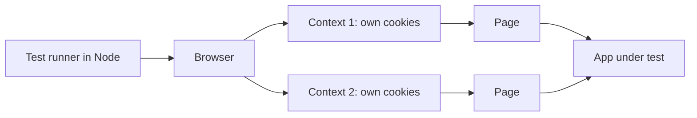

# Module 3 — Testing interfaces

*An interface is any place where a user or another system meets your software, and each one fails in its own way. Module 2 tested code from the inside. This module tests it from the outside, the way Najm Bank's customers, partner banks and attackers meet it. First comes the API: the front door that the iOS app, the Android app, the web page and partner systems all share, where you test status codes, schemas, authentication, negative cases and the concurrent double-submit. Then the web UI, with end-to-end tests in Playwright that stay fast and trustworthy. Last come the harder surfaces: mobile apps, accessibility, cross-browser differences and localisation, including Arabic right-to-left layout. You will follow Nada and Bilal as one hour of API testing finds a crash, a race and an inconsistent error format in the sample system, Bilal again as he keeps a browser suite small and stable, and Amal as an audit of the Arabic page finds what no automated scan can. AI threads run through all of it: judge the API and browser tests an agent writes by the table of cases it left empty, and remember that the same interfaces are what AI tools drive when they test for you (lesson 6.3).*

> **Focus:** Integration, UI — testing the surfaces where people and other systems meet your software, and choosing which checks to automate and which to leave to a human.

---

# 3.1 — API testing: REST, schemas, status codes, authentication and negative cases
*Level: 🟡 Intermediate* · *Prerequisites: 1.2, 2.1* · *Focus: Integration, Security*

## ⚡ In 60 seconds
- An **API test** sends real HTTP requests and checks status, headers, body and side effects. It needs no browser, so it is fast and stable, and sits where every client meets the rules.
- Design per endpoint: happy path, validation, boundaries, 401, 403, idempotency, error format, rate limit, pagination.
- Assert the **contract**: exact status, one error shape, a strict schema, the effect on state.
- **Schemathesis** generates requests from the OpenAPI document and finds what hand-written tests miss.
- Biggest trap: the happy path only. One hour on the sample found a 500, a double debit and inconsistent errors.

## 🧭 Why it matters
Tariq's squads build three clients on one API: the iOS app, the Android app and the web page. Before a partner integrates, Bilal asks Nada for "an hour of API testing" on `POST /transfers`. She writes one request and `assert r.status_code == 201`. Green. Bilal asks about the rest.

The next hour yields three findings no screen would show. An amount of `1e30` returns HTTP 500. Two simultaneous requests with the same idempotency key both succeed, and the account is debited twice. A malformed request gets `{"detail": [...]}` while a rejected business rule gets `{"error": {"code": ...}}`, both status 422, so a client that parses one shape fails on the other. A web page hides such defects behind its own validation; an API cannot, because any caller can send anything. The table below also judges AI-written tests: asked for "tests for this endpoint", an assistant gives a happy path and two validation cases.

## 📐 How it works

### 🟢 The essentials

**HTTP in one screen.** A method is **idempotent** if doing it twice leaves the same state as once: GET, PUT and DELETE are, **POST is not** and needs an `Idempotency-Key` header. Status classes: **2xx** worked (200, 201); **4xx** the caller erred (400 malformed, 401 not authenticated, 403 not allowed, 409 conflict, 422 well-formed but rejected, 429 too many requests); **5xx** the server failed. One rule: **no client input should produce a 5xx.**

**Design before you type.** This is the design for `POST /transfers`, using lesson 1.2; the last column is what we found.

| # | Dimension | Example test | Expected | On the sample |
|---|---|---|---|---|
| 1 | Happy path | Alice sends 250.00 QAR | 201, valid body, balance down 250.00 | passes |
| 2 | Validation | Missing field, `"abc"`, three decimals | 4xx, one error shape | shape varies |
| 3 | Boundaries | 0.99, 1.00, 25,000.01, day total exactly 50,000.00 | rules from lesson 1.2 | passes |
| 4 | Authentication | No token, forged token | 401, nothing changes | passes; no `WWW-Authenticate` |
| 5 | Authorisation | Bob spends from acc-1; Bob reads Alice's transfer | 403 | passes |
| 6 | Idempotency | Same key twice; new body; two at once | 200; 409; one transfer | **race: two transfers** |
| 7 | Error format | Every failure cause | One shape, never 5xx | **500 on huge amounts; two shapes** |
| 8 | Rate limit | 100 requests in a second | Some 429 with `Retry-After` | no limit: a gap |
| 9 | Pagination | A planned list endpoint: first, last, empty page, limit 0 | Stable order, no gaps | not built yet |

Rows 6 to 9 are the ones tidy tests skip. Copy `testing/sample`, run `pip install -r requirements.txt jsonschema schemathesis`, save the helpers.

```python
# tests/conftest.py
import uuid
from decimal import Decimal

import pytest
from fastapi.testclient import TestClient

from najm.api import create_app
from najm.transfers import TransferService

ALICE = {"Authorization": "Bearer token-alice"}
BOB = {"Authorization": "Bearer token-bob"}


def world():    # fresh accounts per test, so test order never matters
    return {"acc-1": {"owner": "alice", "currency": "QAR", "balance": Decimal("100000.00")},
            "acc-2": {"owner": "bob", "currency": "QAR", "balance": Decimal("800.00")}}


@pytest.fixture
def client():   # raise_server_exceptions=False: a crash becomes the HTTP 500 a real client sees
    return TestClient(create_app(TransferService(world())), raise_server_exceptions=False)


def body(**overrides):
    return {"from_account": "acc-1", "to_account": "acc-2", "amount": "250.00",
            "currency": "QAR", "kind": "domestic", **overrides}


def post(client, who=ALICE, key=None, **overrides):   # a fresh idempotency key unless one is given
    return client.post("/transfers", json=body(**overrides),
                       headers={**who, "Idempotency-Key": key or str(uuid.uuid4())})
```

```python
# tests/test_api_status.py
import pytest

from conftest import post


@pytest.mark.parametrize("overrides, status, code", [
    ({"amount": "1.00"}, 201, None),
    ({"amount": "0.99"}, 422, "below_minimum"),
    ({"amount": "25000.01"}, 422, "above_per_transfer_max"),
    ({"amount": "10.005"}, 422, "too_many_decimals"),
    ({"currency": "USD"}, 422, "currency_mismatch"),     # acc-1 holds QAR, and that check runs first
    ({"from_account": "acc-2"}, 403, "not_owner"),        # Alice does not own acc-2
])
def test_status_and_error_code(client, overrides, status, code):
    r = post(client, **overrides)
    assert r.status_code == status
    assert r.json().get("error", {}).get("code") == code      # None for a 201


def test_a_day_total_of_exactly_50000_is_allowed(client):    # catches limit_off_by_one
    for _ in range(2):
        assert post(client, amount="25000.00").status_code == 201
    r = post(client, amount="1.00")                           # one step over
    assert (r.status_code, r.json()["error"]["code"]) == (422, "daily_limit_exceeded")
```

**Weak versus strong.** `assert r.status_code in (400, 422)` passes for the wrong rule and a framework default. The table pins the status *and* the stable `code`, so changing one limit turns exactly one row red.

**When not to.** Do not re-test every fee rule through HTTP: one request per rule family proves the wiring, and unit tests (lesson 2.1) carry the arithmetic.

### 🟡 Going deeper

**Check the shape, then the rule.** The right status can carry a wrong body: a float for a string, a missing field, a leaked `owner`. A JSON Schema states the shape once; `additionalProperties: false` fails any extra field.

```python
# tests/test_api_contract.py
import pytest
from jsonschema import Draft202012Validator

from conftest import ALICE, body, post

S = {"type": "string"}
TRANSFER = {
    "type": "object", "additionalProperties": False,         # an extra field such as "owner" is a leak
    "required": ["id", "status", "from_account", "to_account", "amount", "currency", "fee", "value_date"],
    "properties": {
        "id": {"type": "string", "pattern": r"^tr-\d{4,}$"}, "status": S, "from_account": S, "to_account": S,
        "amount": {"type": "string", "pattern": r"^\d+(\.\d+)?$"},    # money travels as a string
        "currency": {"enum": ["QAR", "AED", "EUR"]},
        "fee": {"type": "string", "pattern": r"^\d+\.\d{2}$"},
        "value_date": {"type": "string", "pattern": r"^\d{4}-\d{2}-\d{2}$"},
    },
}
ERROR = {"type": "object", "required": ["error"], "additionalProperties": False,
         "properties": {"error": {"type": "object", "required": ["code", "message"]}}}


def test_weak_a_field_called_id_exists(client):
    assert "id" in post(client).json()      # passes even if fee becomes a float or "owner" leaks


def test_strong_the_shape_and_the_rule(client):
    r = post(client, amount="3090.00", kind="international")
    Draft202012Validator(TRANSFER).validate(r.json())    # raises, naming the field, if the shape is wrong
    assert r.json()["fee"] == "10.82"                    # the schema checks shape; this checks the rule
```

With `NAJM_BUGS=float_fee` the weak test passes and the schema still validates (`"10.81"` is well formed); the last line fails: `assert '10.81' == '10.82'`. Shape and rule are different checks.

**The OpenAPI document as a contract, and Schemathesis.** FastAPI publishes `/openapi.json`, listing every path, parameter and response; clients and gateways build on it. **Schemathesis** (built on Hypothesis, lesson 2.3) generates valid and invalid requests from it and checks every response. Start the sample with `uvicorn najm.api:app --port 8000`, then run:

```bash
schemathesis run http://127.0.0.1:8000/openapi.json --checks all --max-examples 50 --seed 1 \
    -H "Authorization: Bearer token-alice" -H "Idempotency-Key: st-1"
```

```text
(condensed from Schemathesis 4.30; layouts vary by version)
Undocumented HTTP status code (documented: 200, 422). Received:
  404  GET /accounts/{account_id}/balance
  404  GET /transfers/{transfer_id}
  403  POST /transfers
  400  POST /transfers   {"detail":"There was an error parsing the body"}
API rejected schema-compliant request: 422 decimal_parsing on "amount"
```

Each line is a decision. The document says 200 and 422, yet the code also answers 201, 400, 401, 403, 404 and 409. It calls `amount` "a number or a string", yet `"abc"` is refused. A third error shape appears. Schemathesis cannot find a wrong *rule*: FastAPI built the document from the code.

The first pass missed the 500: random account ids stopped at `403 not_owner` before any amount check. A hooks file keeps the other fields valid, so the amount gets tested, and gives each call a fresh key, so 409s do not stop the run. Save it beside `najm/`, put `SCHEMATHESIS_HOOKS=najm_hooks` before the same command and drop its `Idempotency-Key` header (it overrides the hook's):

```python
# najm_hooks.py
import uuid

import schemathesis


@schemathesis.hook
def map_body(ctx, body):
    if isinstance(body, dict):
        body.update(from_account="acc-1", to_account="acc-2", currency="QAR", kind="domestic")
    return body


@schemathesis.hook
def before_call(ctx, case, **kwargs):
    case.headers = {**(case.headers or {}), "Idempotency-Key": str(uuid.uuid4())}
```

Now Schemathesis reports `[500]` for `"amount": 1.2276573252243301e+182`: `Decimal.quantize` raises `InvalidOperation`, uncaught. The sample does not seed it; testing found it.

**Negative testing.** Turn findings into permanent tests and pin the error format for every cause:

```python
# tests/test_api_contract.py (continued)
H = {**ALICE, "Idempotency-Key": "k-1"}
BAD_REQUESTS = {                  # cause: (expected status, request)
    "malformed json": (422, dict(content="{oops", headers={**H, "Content-Type": "application/json"})),
    "missing field": (422, dict(json={}, headers=H)),
    "wrong type": (422, dict(json=body(amount="abc"), headers=H)),
    "business rule": (422, dict(json=body(amount="0.99"), headers=H)),
    "no token": (401, dict(json=body(), headers={"Idempotency-Key": "k-1"})),
}


@pytest.mark.parametrize("cause", BAD_REQUESTS)
def test_every_error_has_one_shape(client, cause):    # MEANT TO FAIL for three causes on the sample
    status, request = BAD_REQUESTS[cause]
    r = client.post("/transfers", **request)
    assert r.status_code == status
    Draft202012Validator(ERROR).validate(r.json())


@pytest.mark.parametrize("amount", ["1e1000", 1e30])
def test_absurd_amounts_are_rejected_not_crashed(client, amount):    # MEANT TO FAIL: the sample says 500
    assert post(client, amount=amount).status_code == 422
```

```text
FAILED test_every_error_has_one_shape[malformed json]    ValidationError: 'error' is a required property
FAILED test_every_error_has_one_shape[missing field] and [wrong type]    (same)
FAILED test_absurd_amounts_are_rejected_not_crashed[1e1000]    assert 500 == 422
FAILED test_absurd_amounts_are_rejected_not_crashed[1e+30]     (same)
```

Three of five causes use the framework's shape. `raise_server_exceptions=False` matters: by default the test client re-raises a crash as an exception, hiding the 500 customers see.

**401, 403 and the order of checks.** **401** means "I do not know who you are", and signing in can fix it. **403** means "I know, and the answer is no"; an app that treats it as "session expired" logs customers out for nothing. The order of checks is part of the contract. The sample validates the body (422, framework shape), then the token (401), idempotency key (400), ownership (403) and business rules (422, bank shape), so no token plus an empty body gets 422, not 401. **BOLA** (broken object-level authorisation) is reaching another user's object by changing an id. A weak test, Alice reading her own transfer, passes with the bug on. The strong test has Bob ask:

```python
# tests/test_api_security.py
from conftest import BOB, post


def test_bob_cannot_read_alices_transfer(client):
    created = post(client).json()                        # Alice's transfer
    r = client.get(f"/transfers/{created['id']}", headers=BOB)
    assert r.status_code == 403
    assert r.json()["error"]["code"] == "not_owner"
```

```text
$ NAJM_BUGS=bola pytest tests/test_api_security.py
E   assert 200 == 403          1 failed
```

The starter's Bob test reads a *balance*, which the bug never touches. [*Secure AI & Application Security*, lesson 4.1 — The OWASP API Security Top 10 in practice](../secai/index.html#/4.1) ranks BOLA first.

### 🔴 Expert view

**Idempotency and the concurrent double-submit.** The starter's sequential replay test passes. Two simultaneous requests do not: `submit()` looks for the key, does the work, then records the key, and both can pass the look. The test forces thread switches, repeats 100 times, and checks the balance. `xfail(strict=True)` parks a known defect, and turns the suite red the day it is fixed without removing the mark.

```python
# tests/test_api_idempotency.py
import sys
import threading
from concurrent.futures import ThreadPoolExecutor

import pytest
from fastapi.testclient import TestClient

from conftest import ALICE, body, world
from najm.api import create_app
from najm.transfers import TransferService


def balance(client):
    return client.get("/accounts/acc-1/balance", headers=ALICE).json()["balance"]


@pytest.mark.xfail(strict=True, reason="check-then-act race in submit()")
def test_a_concurrent_double_submit_creates_one_transfer():
    old = sys.getswitchinterval()
    sys.setswitchinterval(1e-6)                          # make unlucky interleavings common, not rare
    try:
        for attempt in range(100):
            client = TestClient(create_app(TransferService(world())), raise_server_exceptions=False)
            gate = threading.Barrier(2)

            def send(_):
                gate.wait()                              # both requests leave at the same moment
                return client.post("/transfers", json=body(), headers={**ALICE, "Idempotency-Key": "same"})

            with ThreadPoolExecutor(2) as pool:
                codes = sorted(r.status_code for r in pool.map(send, range(2)))
            assert codes == [200, 201], f"attempt {attempt}: {codes}"
            assert balance(client) == "99750.00", f"attempt {attempt}: debited twice"
    finally:
        sys.setswitchinterval(old)
```

```text
$ pytest tests/test_api_idempotency.py --runxfail
FAILED test_a_concurrent_double_submit_creates_one_transfer - AssertionError: attempt 6: [201, 201]
```

The failing attempt varies. At Python's normal switch interval the race showed in at most 1 of 900 trials, so the test forces it. A lock fixes one process; production runs several, so the real fix is a unique constraint on `(user, key)` ([*System Design for Vibe Coders*, lesson 2.6 — Two clicks at once: races, transactions, and idempotent writes](../vibe/index.en.html#l2-6)).

**Mock or virtualise what you do not own.** Transfers would call a sanctions-screening service Najm does not control. A fake that always says "clear" tests only the happy path; test how the dependency breaks. With `httpx.MockTransport` the fake is a Python function: return `httpx.Response(503)` or raise `httpx.ConnectTimeout`, and assert the transfer is refused (**fail closed**). `respx` fakes calls from code that builds its own `httpx` client; **WireMock** and **MockServer** are standalone fake servers. A fake that drifts from the real service lies, so check both against one contract (lesson 2.2).

**Versioning and backward compatibility.** Najm supports old app versions for months. Adding an optional response field is safe for clients that ignore unknown fields; removing, renaming or retyping one, or requiring a new request field, breaks old clients. Keep a **fixture from the old client**, such as a request without `kind`, and assert today's API still returns 201 with every old response field. `oasdiff` lists breaking changes between OpenAPI documents.

**GraphQL and gRPC.** GraphQL has one endpoint where the client picks fields: test authorisation per field (BOLA hides in nested objects), depth limits, and errors in the `errors` array even on HTTP 200. gRPC is a typed Protocol Buffers contract: assert codes such as `UNAUTHENTICATED`, set deadlines, and never renumber a field (`buf breaking` checks).

**Collaboration and CI tools.** **Postman** collections run in CI through **Newman**; **Bruno** keeps requests as plain-text files in Git. Against the sample we hit a trap: Bruno read `eq 0.00` as the *number* 0, but the API sends the string `"0.00"`, so write `eq "0.00"`. Java shops use **REST Assured**.

```bash
bru run --env local --reporter-junit bruno-results.xml
newman run najm.postman_collection.json -e local.postman_environment.json --reporters cli,junit
```

## 🧰 The toolkit
| Tool, practice or technique | What it is and does | When to reach for it |
|---|---|---|
| **pytest with TestClient and httpx** | Python tests that call the app in-process or over the network | Default for Python APIs; runs on every pull request |
| **JSON Schema** | A standard language for the shape of JSON | Checks that fail on extra or mistyped fields |
| **OpenAPI and Schemathesis** | An API description, and a tool that generates requests from it | Contracts between teams; nightly hunts for crashes and drift |
| **Postman, Newman and Bruno** | Request collections with tests, a command-line runner, and a Git-friendly client | Shared exploration; requests run in CI |
| **httpx MockTransport and WireMock** | An in-process fake transport, and a fake HTTP server | A dependency that is down, slow or wrong |

## 🏛️ In practice at Najm Bank
Bilal publishes the **Najm API Test Standard v1**, a one-page checklist for every endpoint. Part A is the evidence a suite works, human- or AI-written: Rashid switches each seeded bug on and its mapped test must turn red.

| Defect | Test that catches it | Status |
|---|---|---|
| `float_fee` | `test_strong_the_shape_and_the_rule` | caught |
| `limit_off_by_one` | `test_a_day_total_of_exactly_50000_is_allowed` | caught |
| `no_idempotency`, `bola` | the starter replay test; `test_bob_cannot_read_alices_transfer` | caught |
| `tz_cutoff` | none: the API reads the real clock | gap; lesson 2.1's clock tests own it |
| 500 on absurd amounts | `test_absurd_amounts_are_rejected_not_crashed` | open defect |
| Idempotency race | `test_a_concurrent_double_submit_creates_one_transfer` | open, `xfail` |
| Two error shapes | `test_every_error_has_one_shape` | open defect |

**Part B: pipeline.** Every pull request: the in-process suite, under two minutes. Nightly: Schemathesis with a fixed seed against staging. After each deploy: a smoke check.

**Part C: rules.** One error shape; every status in the OpenAPI document; an idempotency key on every money-moving `POST`; no fuzzing without written permission; every defect a test before the fix.

## 🛠️ Exercises
Work in a copy of `testing/sample`.

- 🟢 **Design and test `GET /accounts/{id}/balance`.** Write its design table, then tests for the happy path with a schema, no token, a forged token, Bob reading `acc-1`, and an unknown account. *Done when:* all pass, and returning the balance as a number in your copy fails the schema test while `assert "balance" in body` still passes.
- 🟡 **Close the contract gaps.** Run the first Schemathesis command. In `najm/api.py`, declare every status the code returns (`status_code=201`, then `responses=` for the rest) and add a `RequestValidationError` handler that uses the `{"error": ...}` shape. *Done when:* the four "Undocumented HTTP status code" failures drop to zero and `test_every_error_has_one_shape` passes for all five causes.
- 🔴 **Fix the race, honestly.** Run the concurrent test with `--runxfail` and watch it fail. Lock `submit()` in your copy and remove the `xfail`. *Done when:* the test passes 20 runs in a row, still fails under `NAJM_BUGS=no_idempotency`, and a note says what breaks with four server processes and names the database constraint that fixes it.

## ⚠️ Mistakes and traps
- **Status-only assertions.** `assert r.ok` passes for the wrong rule. Pin the status, error `code` and body shape.
- **Trusting a generated document.** An OpenAPI file built from the code agrees with the code. Write the contract from requirements.
- **Mocking the thing under test.** Fake only what you do not own, and test how it fails.
- **One lucky pair of requests.** Races hide: repeat concurrent tests and assert on the effect.
- **Fuzzing what you do not own.** Generate requests only against your own systems or with written permission.

## 🧾 Recap
- Design API tests across nine dimensions; tidy suites skip the last four.
- Assert status, stable error code, strict schema and effect on state; check shape and rule apart.
- Schemathesis finds undocumented statuses and crashes, not wrong rules.
- 401 means "who are you", 403 means "not you"; Bob reading Alice's transfer finds BOLA.
- Test idempotency concurrently, and test how a dependency fails.

## ✍️ Check yourself

**1. A test posts `amount` "0.99" and asserts `r.status_code in (400, 422)`. A developer raises the minimum from 1.00 to 5.00. What happens?**

- A. It fails, since 0.99 is no longer invalid
- B. It fails, because the error code changed
- C. It fails, as the status becomes a 5xx
- D. It still passes, so it misses the change

<details><summary>Answer</summary>

**D.** 0.99 is invalid under both minimums and the test accepts two statuses, so nothing turns red. Pinning the code and testing 4.99 and 5.00 would. (🟢 The essentials.)

</details>

**2. After a session timeout, the Najm app logs customers out whenever the API answers 403. Which statement about 401 and 403 is correct?**

- A. 401 means known but refused; 403 means unknown
- B. Both mean "not signed in", so apps may treat them alike
- C. 403 means known but refused; 401 means unknown
- D. 401 is for invalid JSON, and 403 for broken business rules

<details><summary>Answer</summary>

**C.** With 401 the server does not know you, so signing in helps; with 403 it does, and the answer is no. (🟡 Going deeper.)

</details>

**3. With `NAJM_BUGS=bola` on, Nada's test creates a transfer as Alice and reads it back as Alice. It passes. What does that show?**

- A. The seeded bug is not in the code
- B. Nothing about object-level authorisation
- C. The API is secure for every other user and transfer
- D. The bug lives in the database layer

<details><summary>Answer</summary>

**B.** Alice reading her own transfer is true with and without the bug; only Bob requesting it can fail. (🟡 Going deeper.)

</details>

**4. A test sends one idempotency key twice in sequence and asserts 201 then 200. It always passes, yet clients sometimes double-submit at once. What is the best next step?**

- A. Send both at once, repeat many times, and check the balance
- B. Add a sleep between the calls so the result is stable
- C. Delete the test, since a pass proves the feature is fine
- D. Mock the service so the second call always returns 200 as expected

<details><summary>Answer</summary>

**A.** Only a repeated concurrent test that checks the balance can see a race; a sleep removes the overlap. (🔴 Expert view.)

</details>

**5. Schemathesis reports "Undocumented HTTP status code: Received 403, Documented 200, 422" on `POST /transfers`. What is the right reading?**

- A. The API is wrong; change it to return 200 to match the document
- B. The finding is noise, since 403 is normal
- C. The tool is faulty, as 403 follows from ownership
- D. The contract is incomplete: declare 403 and the others

<details><summary>Answer</summary>

**D.** The 403 is right; the document does not tell clients what to expect. Matching the API to it would delete a real rule. (🟡 Going deeper.)

</details>

## 📚 References
- pytest documentation — https://docs.pytest.org/
- Hypothesis documentation, the engine behind Schemathesis — https://hypothesis.readthedocs.io/
- OWASP API Security Project — https://owasp.org/www-project-api-security/
- Pact documentation, consumer-driven contract testing — https://docs.pact.io/
- Martin Fowler, on test doubles and contract tests — https://martinfowler.com/

---

# 3.2 — Web UI and end-to-end testing with Playwright: locators, waiting, page objects and stable suites
*Level: 🟡 Intermediate* · *Prerequisites: 2.1, 3.1* · *Focus: UI*

## ⚡ In 60 seconds
- An **end-to-end (E2E) test** drives a real browser through a user journey. It sees what the customer sees but is the slowest test, so keep a few.
- **Playwright** gives each test a fresh **browser context**, **auto-waits** for elements, and retries **web-first assertions** until they pass or time out.
- Locate elements as a user or screen reader would: role, label, text, test id. CSS and XPath come last.
- Never `sleep`. Wait on a condition, own your data, and log in through the API.
- Biggest trap: a suite people re-run until green. Fix or quarantine every flaky test.

## 🧭 Why it matters
Alice taps **Send transfer** twice, because the screen is slow. 500 QAR leaves her account instead of 250. Nada's API tests are green: every request was valid and carried a unique idempotency key. The bug is in the page, which makes a *new* key on every click, so the server correctly treats two clicks as two transfers. Only a test that clicks like a human can see it.

E2E tests are also easy to get wrong. A suite of 200 browser tests that takes 40 minutes and fails one run in ten teaches the team to press "re-run", and real failures hide. Lesson 1.2's error guess "double-click: one transfer per click" is a test this lesson writes. The same standards judge AI-generated browser tests, which often arrive with sleeps and positional selectors.

## 📐 How it works

### 🟢 The essentials

**When to use E2E.** Use it for a **few critical journeys** (sign in, send a transfer, view a balance) and for what only a browser shows: rendering, clicks, focus, real timing. Do not use it for rules: the fee for 3,090.00 QAR belongs in a unit test (lesson 2.1) or an API test (lesson 3.1), which run in milliseconds and fail with a clear cause.

**Playwright's architecture.** The test runner is a Node.js process. It controls a browser (Chromium, Firefox or WebKit), which hosts many **browser contexts**: isolated profiles with their own cookies and storage, cheap to create. Each test gets a fresh context and page, so tests do not leak state into each other.



Two ideas remove most flakiness. **Auto-waiting:** before a `click`, `fill` or `check`, Playwright waits until the element is visible, stable, enabled and not covered. **Web-first assertions** such as `toBeVisible`, `toHaveText` and `toHaveValue` retry until they pass or time out (5 seconds by default), instead of reading the page once.

**Project layout and config.** In a copy of `testing/sample`, run `npm install`, `npm install -D @axe-core/playwright` and `npx playwright install chromium`; tests live in `e2e/`. Replace the starter `e2e/playwright.config.ts`:

```typescript
// e2e/playwright.config.ts
import { defineConfig, devices } from '@playwright/test';

export default defineConfig({
  testDir: '.',
  fullyParallel: true,
  forbidOnly: !!process.env.CI,
  retries: process.env.CI ? 1 : 0,         // a passing retry is reported as "flaky"
  reporter: [['list'], ['html', { open: 'never' }]],
  use: { baseURL: 'http://127.0.0.1:8000', trace: 'on-first-retry' },
  projects: [
    { name: 'setup', testMatch: /auth\.setup\.ts/ },
    { name: 'chromium', use: { ...devices['Desktop Chrome'], storageState: '.auth/alice.json' }, dependencies: ['setup'] },
  ],
  webServer: {
    command: `${process.env.PYTHON ?? 'python'} -m uvicorn najm.api:app --port 8000`,
    cwd: '..',
    url: 'http://127.0.0.1:8000/health',
    reuseExistingServer: !process.env.CI,
  },
});
```

Run from `testing/sample`: `npx playwright test --config e2e/playwright.config.ts`. Add `.auth/` to `.gitignore`; a saved session is a credential.

**Locators: role first.** A **locator** says how to find an element each time it is needed. Prefer what a user or screen reader perceives. Each step down is more fragile, and the top rows double as accessibility checks, because they fail if a label or role is missing.

| Priority | Locator | Weak | Strong |
|---|---|---|---|
| 1 | Role and name | `locator('#form > button')` | `getByRole('button', { name: 'Send transfer' })` |
| 2 | Label | `locator('input').nth(1)` | `getByLabel('Amount')` |
| 3 | Text | `locator('p.msg-3')` | `getByText('Transfer sent')`, for content |
| 4 | Test id | `locator('div > div:nth-child(4)')` | `getByTestId('balance-card')`, agreed with developers |
| 5 | CSS or XPath | Long or positional chains | Short, inside a stable parent, only when nothing above exists |

Text breaks when copy changes or the page is translated; on `?lang=ar` use the role with the Arabic name, or a test id.

**Never sleep.** A weak and a strong test of one journey, run against a page changed the way a squad might change it: a `Note` field above Amount (injected through `page.route`, so the real page is untouched) and a slow API.

```typescript
// e2e/locators.spec.ts
import { test, expect, type Page } from '@playwright/test';

async function refactoredAndSlow(page: Page) {
  await page.route('**/app', async (route) => {              // a new field above Amount
    const response = await route.fetch();
    const html = (await response.text()).replace('<label for="amount">',
      '<label for="note">Note</label><input id="note" name="note"><label for="amount">');
    await route.fulfill({ response, body: html });
  });
  await page.route('**/transfers', async (route) => {        // every API call takes 1.5 seconds
    await new Promise((resolve) => setTimeout(resolve, 1500));
    await route.continue();
  });
}

test('strong: label, role and a retrying assertion', async ({ page }) => {
  await refactoredAndSlow(page);
  await page.goto('/app');
  await page.getByLabel('Amount').fill('250.00');
  await page.getByRole('button', { name: 'Send transfer' }).click();
  await expect(page.getByRole('status')).toContainText('Transfer sent');
});

test('weak: position, sleep and a single read', async ({ page }) => {    // MEANT TO FAIL
  await refactoredAndSlow(page);
  await page.goto('/app');
  await page.locator('input').nth(1).fill('250.00');         // now types into Note
  await page.locator('#form > button').click();
  await page.waitForTimeout(500);                            // hope
  expect(await page.locator('#result').innerText()).toContain('Transfer sent');
});
```

```text
  ✓  [chromium] › locators.spec.ts › strong: label, role and a retrying assertion (2.4s)
  ✘  [chromium] › locators.spec.ts › weak: position, sleep and a single read (1.0s)
    Expected substring: "Transfer sent"
    Received string:    ""
```

The weak test has three faults: `nth(1)` hits the wrong input, the 500 ms sleep ends before a 1.5 s response, and `innerText()` reads once. The strong test survives both changes because it waits on conditions.

### 🟡 Going deeper

**Isolation, fixtures and storage state.** Each test must pass alone and in parallel. The context is fresh, but the *server's data* is shared: two parallel tests sending from `acc-1` change each other's balance, so give each test its own data. **Log in through the API once, not through the login screen in every test**: a **setup project** signs in, saves the browser state (cookies and local storage) to a file, and the other projects start from it. Keep one UI login test for the login journey itself. The sample page has no login screen, so this setup stands in for one.

```typescript
// e2e/auth.setup.ts
import { test as setup, expect } from '@playwright/test';

setup('sign in as Alice through the API', async ({ page, request }) => {
  const res = await request.get('/accounts/acc-1/balance', { headers: { Authorization: 'Bearer token-alice' } });
  expect(res.ok()).toBeTruthy();
  await page.goto('/app');
  await page.evaluate(() => localStorage.setItem('token', 'token-alice'));
  await page.context().storageState({ path: '.auth/alice.json' });
});
```

**Page objects, component objects and fixtures.** A **page object** is a class holding a page's locators and user actions, so a changed label is fixed once. A **component object** does the same for a reused widget, such as a `Toast` class wrapping the alert. **Fixtures** (`test.extend`) hand tests a ready object and handle setup and teardown. Keep assertions in the tests, so a failure reads like a sentence. For two or three tests a fixture and a helper function are enough; add the class when locators start repeating.

```typescript
// e2e/fixtures.ts
import { test as base, expect, type Locator, type Page } from '@playwright/test';

export class TransferPage {
  readonly amount: Locator;
  readonly send: Locator;
  readonly status: Locator;
  readonly alert: Locator;

  constructor(readonly page: Page) {
    this.amount = page.getByLabel('Amount');
    this.send = page.getByRole('button', { name: 'Send transfer' });
    this.status = page.getByRole('status');
    this.alert = page.getByRole('alert');
  }

  async sendTransfer(amount: string) {
    await this.amount.fill(amount);
    await this.send.click();
  }
}

export const test = base.extend<{ transferPage: TransferPage }>({
  transferPage: async ({ page }, use) => {
    await page.goto('/app');
    await use(new TransferPage(page));
  },
});
export { expect };
```

**Network mocking for edge cases.** `page.route` intercepts requests, so you can reach states that are slow or risky to create for real: a 503, a timeout, a daily-limit rejection. These tests include the double click from lesson 1.2.

```typescript
// e2e/journeys.spec.ts
import { test, expect } from './fixtures';

test('one click sends exactly one transfer', async ({ page, transferPage }) => {
  const posts: string[] = [];
  page.on('request', (request) => request.method() === 'POST' && posts.push(request.url()));
  await transferPage.amount.fill('10.00');
  await transferPage.send.dblclick();                        // an impatient customer
  await expect(transferPage.status).toBeVisible();
  expect(posts).toHaveLength(1);                             // MEANT TO FAIL: the page sends two
});

test('a failed request tells the customer something', async ({ page, transferPage }) => {
  await page.route('**/transfers', (route) =>
    route.fulfill({ status: 503, contentType: 'text/plain', body: 'Service Unavailable' }));
  await transferPage.sendTransfer('250.00');
  await expect(transferPage.alert).toBeVisible();            // MEANT TO FAIL: the page shows nothing
});
```

```text
  ✘  one click sends exactly one transfer     Expected length: 1   Received length: 2
  ✘  a failed request tells the customer something     Locator: getByRole('alert')   Error: element(s) not found
```

Both are real sample defects: the page makes a new `Idempotency-Key` per click and never disables the button, and a non-JSON error makes its script throw, so the customer sees nothing. We confirmed the first against the API: two clicks moved the account from 12,000 to 11,500.

**Tracing and debugging.** A **trace** records a DOM snapshot before and after each action, with network and console logs. `trace: 'on-first-retry'` records one when CI retries a test (use `--trace on` locally); open it with `npx playwright show-trace path/to/trace.zip`, or browse `npx playwright show-report`. While authoring, use `npx playwright test --ui` (a time-travel view), `--debug` (step by step) and `npx playwright codegen http://127.0.0.1:8000/app` (records clicks as locators: a draft to tidy, not a test to keep).

**E2E flakiness.**

| Cause | Symptom | Fix |
|---|---|---|
| Fixed sleeps, one-shot reads | Passes locally, fails in CI | Web-first assertions; `expect.poll` for values read from the API |
| Shared data and parallel tests | Fails only with several workers | Each test owns its data; app instance per worker |
| Animation, moving elements | "Element is not stable" | Wait for the end state; disable animations in test builds |
| Real third parties, clocks | Fails at certain times | Mock them; freeze time with `page.clock` |

Measure instead of guessing: `npx playwright test --repeat-each=20 locators.spec.ts` gives a failure rate. A retry that passes is a **flaky** result to report and own, not hide (lesson 2.3 covers quarantine); recent versions can fail a run on it with `--fail-on-flaky-tests`.

**Parallelism and sharding.** Files run in parallel workers by default; `fullyParallel: true` also parallelises tests inside a file; `--workers=N` sets the count. To split a suite across CI machines, run `--shard=1/3`, `2/3` and `3/3` as separate jobs, with the `blob` reporter and `npx playwright merge-reports` for one report.

### 🔴 Expert view

**Screenshot comparison.** `toHaveScreenshot` compares the page with a stored baseline image.

```typescript
// e2e/visual.spec.ts
import { test, expect } from '@playwright/test';

test('the transfer form looks as designed', async ({ page }) => {
  await page.goto('/app');
  await expect(page).toHaveScreenshot('transfer-form.png', { maxDiffPixels: 100 });
});
```

```text
Error: A snapshot doesn't exist at .../visual.spec.ts-snapshots/transfer-form-chromium-linux.png, writing actual.
  (after a styling change)   19678 pixels (ratio 0.03 of all image pixels) are different.
```

The first run fails and writes the baseline; commit it and review it like code. Keep the tolerance tiny: `maxDiffPixels: 100` allows a few anti-aliased pixels, while a ratio of 0.01 let rounded button corners (1,451 pixels) pass in our run. The name ends in `chromium-linux` because fonts and anti-aliasing differ between operating systems, so a Mac baseline fails on Linux CI. Create and update baselines in one container image: `docker run --rm --network=host --ipc=host -v "$PWD":/work -w /work mcr.microsoft.com/playwright:v<version>-noble npx playwright test --config e2e/playwright.config.ts --update-snapshots`, with the tag matching your Playwright and the API already running on the host (not run here, no Docker; check Playwright's Docker docs). Beware "update snapshots until green": mask dynamic areas and never accept a diff unseen. Percy, Chromatic and Applitools offer hosted comparison.

**Accessibility scan.** `@axe-core/playwright` runs the axe rule engine inside the page. It finds missing labels, bad ARIA and low contrast quickly, and only such rule-checkable problems; lesson 3.3 shows what it misses.

```typescript
// e2e/a11y.spec.ts
import { test, expect } from '@playwright/test';
import AxeBuilder from '@axe-core/playwright';

for (const [name, url] of [['English', '/app'], ['Arabic', '/app?lang=ar']] as const) {
  test(`the ${name} page has no detectable WCAG A or AA violations`, async ({ page }) => {
    await page.goto(url);
    const results = await new AxeBuilder({ page }).withTags(['wcag2a', 'wcag2aa', 'wcag21a', 'wcag21aa', 'wcag22aa']).analyze();
    expect(results.violations).toEqual([]);
  });
}
```

**Cross-browser projects.** Everything here ran in Chromium. To add others, install them (`npx playwright install --with-deps firefox webkit`), add projects such as `{ name: 'webkit', use: { ...devices['Desktop Safari'] } }`, and select with `--project=webkit`. Playwright's WebKit is its own build, close to Safari but not Safari: confirm iOS behaviour on a real device (lesson 3.3).

**Selenium, Cypress or Playwright?** An honest comparison at the time of writing (2026); re-check before choosing.

| | Selenium | Cypress | Playwright |
|---|---|---|---|
| How it works | W3C WebDriver standard; drives browsers from outside | Runs inside the browser alongside the app | Drives browsers over their own protocols |
| Browsers | All major, real Safari via its driver | Chrome family, Firefox; WebKit experimental | Chromium, Firefox, WebKit builds |
| Parallel runs | Selenium Grid | Cypress Cloud or your own setup | Built in, free, with sharding |
| Weak spot | More boilerplate; you write the waits | No multi-tab; cross-origin needs care | No real iOS devices; Android is experimental |
| Pick it when | A large legacy suite, or a standard-bound shop | A front-end team wanting fast feedback | New suites, cross-browser, CI at scale |

Habits matter more than the tool. For AI help with E2E tests, see lesson 6.3.

## 🧰 The toolkit
| Tool, practice or technique | What it is and does | When to reach for it |
|---|---|---|
| **Playwright** | Browser automation and test runner for Chromium, Firefox and WebKit | New E2E suites; cross-browser checks in CI |
| **Locators by role and label** | Finding elements as users and assistive tech do | Every selector, before CSS |
| **Page object model** | A class holding a page's locators and actions | Pages many tests use |
| **Fixtures and storage state** | Per-test setup, and a saved login reused by many tests | Isolation; sign-in without the login screen |
| **Trace viewer** | A recording with snapshots, network and console per step | A CI failure you cannot reproduce |
| **@axe-core/playwright** | The axe accessibility engine run from a test | A cheap gate on every page |

## 🏛️ In practice at Najm Bank
Bilal keeps a **journey register**, the only list of E2E tests allowed to exist. A journey enters only if no lower level can test it.

| ID | Journey | Why E2E | Status |
|---|---|---|---|
| J1 | Send a domestic transfer | The whole path, once | green |
| J2 | One click sends one transfer | Only a browser sees the double click | red: open defect |
| J3 | A failed request tells the customer | Page behaviour on errors | red: open defect |
| J4 | Arabic page is right-to-left (lesson 3.3) | Rendering and direction | green |
| J5 | Both pages pass the axe scan | Cheap, automated | green |

**Rules.** No `waitForTimeout`; CI greps for it. Each test owns its data and signs in through the API. One retry in CI; a flaky test is quarantined within a day, with an owner and a deadline. The register stays under 15 journeys: a new one needs a removed one, or a reason.

## 🛠️ Exercises
Work in a copy of `testing/sample` with Playwright installed.

- 🟢 **Rescue a weak test.** Run the `weak` test, then rewrite it with role and label locators and a web-first assertion. *Done when:* `--repeat-each=10` passes under the slow network and the added field, and `grep waitForTimeout e2e` finds nothing.
- 🟡 **Find the double debit.** Run the one-click test with `--trace on`, open the trace, and file a bug report as in lesson 1.3. *Done when:* the report has a minimal reproduction, the two `Idempotency-Key` values from the trace, and a suggested fix.
- 🔴 **Make it stable in parallel.** Write two tests that each read `acc-1`'s balance through the API, send 250.00 and assert it fell by exactly 250.00; run `--workers=4 --repeat-each=10` to show the flake. Fix it by asserting only on what each test owns (its transfer, read by id), or by starting one app per worker. *Done when:* the pair fails at least once before the fix and never in 10 repeats after, and a sentence explains why a retry would have hidden it.

## ⚠️ Mistakes and traps
- **Sleeps and one-shot reads.** `waitForTimeout` and `innerText()` guess. Use auto-waiting and web-first assertions.
- **CSS and XPath first.** They break on redesign and miss accessibility bugs. Start at role and label.
- **Everything through the UI.** Fee maths in a browser is slow and unclear. Push rules down.
- **Logging in through the screen every time.** Sign in through the API once.
- **Retry until green, update until green.** Both hide defects. Report retries; review snapshots.

## 🧾 Recap
- Use E2E for a few critical journeys and for what only a browser shows, like the double click.
- Fresh contexts, auto-waiting and retrying assertions remove most flakiness, if you never sleep.
- Locate by role, label, text, test id, then CSS; use page objects, fixtures and API sign-in.
- Mock the network for edge cases; read traces to diagnose.
- Own your data, shard for speed, keep screenshots in one container image.

## ✍️ Check yourself

**1. Which test belongs in the end-to-end suite rather than at a lower level?**

- A. The fee for 3,090.00 QAR international is 10.82
- B. Two clicks on Send produce exactly one transfer
- C. A transfer above 25,000.00 QAR returns 422
- D. An idempotency key conflict returns 409

<details><summary>Answer</summary>

**B.** Only a browser can click twice and see what the page sends; A, C and D are rules a unit or API test checks faster. (🟢 The essentials.)

</details>

**2. A test types into `page.locator('input').nth(1)`. A squad adds a field above it and the test fails. What is the best fix?**

- A. Add a sleep before typing
- B. Change the index to 2
- C. Use `getByLabel('Amount')`
- D. Retry the test twice in CI

<details><summary>Answer</summary>

**C.** A label is how users find the field, and it survives layout changes. B repeats the mistake, and A and D hide it. (🟢 The essentials.)

</details>

**3. A test clicks Send, waits 500 ms, then reads the result once. It passes locally and fails in CI. What is the root cause?**

- A. CI runs a different browser engine
- B. Tests need a longer global timeout
- C. The page object has too many methods
- D. It guesses a duration and reads once

<details><summary>Answer</summary>

**D.** A fixed sleep and a one-shot read assume a speed. `await expect(...).toContainText(...)` retries until the condition holds. (🟢 The essentials.)

</details>

**4. Bilal's 80 tests all sign in through the UI, and the suite takes 25 minutes. What gives the biggest, safest speed-up?**

- A. Sign in once through the API and reuse the storage state
- B. Disable the login for all tests with a test flag
- C. Merge the 80 tests into a few long ones
- D. Run them all in a single worker

<details><summary>Answer</summary>

**A.** It removes 80 slow logins and keeps contexts isolated. B skips the real path, C hides causes, and D is slower. (🟡 Going deeper.)

</details>

**5. A screenshot test passes on a developer's Mac and fails in Linux CI with tiny pixel differences. What should the team do?**

- A. Raise the pixel tolerance until it passes
- B. Delete the baseline and let CI recreate it
- C. Create and update baselines in one container image
- D. Run screenshot tests only on the developers' Macs

<details><summary>Answer</summary>

**C.** Fonts and anti-aliasing differ across operating systems, so one environment must own the baselines. A hides real changes. (🔴 Expert view.)

</details>

## 📚 References
- Playwright documentation — https://playwright.dev/
- Playwright, best practices and locators — https://playwright.dev/docs/best-practices
- Playwright, trace viewer — https://playwright.dev/docs/trace-viewer
- Martin Fowler, the test pyramid — https://martinfowler.com/bliki/TestPyramid.html
- Google Testing Blog — https://testing.googleblog.com/

---

# 3.3 — Mobile, accessibility, cross-browser and localisation testing, including Arabic right-to-left
*Level: 🟡 Intermediate* · *Prerequisites: 1.2, 3.2* · *Focus: UI, Design*

## ⚡ In 60 seconds
- Mobile apps add risks no browser test sees: interruptions, permissions, bad networks, killed processes, old OS versions and store rules. Test logic fast, the UI natively, a few journeys on real devices.
- **Accessibility** follows WCAG 2.2: perceivable, operable, understandable, robust. Scanners such as axe find only some problems; people find the rest.
- **Localisation** is more than translation: direction, bidirectional text, digits, dates, plurals, sorting. **Pseudo-localisation** finds hard-coded text early.
- Choose devices from analytics; shrink the matrix with pairwise testing.
- Biggest trap: "axe found nothing" or "the translation was approved" taken as "done".

## 🧭 Why it matters
Najm launches its Arabic page. The translation spreadsheet is approved and the axe scan is green, yet Amal sits down with the page. In ten minutes she finds what neither could: the account names under "من الحساب" are still English; a rejected transfer shows `daily_limit_exceeded`; a customer typing `250,50` gets a bare "error"; and Hessa's receipt shows a beneficiary called "7 Seas Trading" as "Seas Trading 7".

None of this is exotic. Najm serves Qatar, the UAE and the EU, in English and Arabic, on phones and several browsers; each surface fails differently. A machine-translated or AI-written screen can look fluent and still be wrong.

## 📐 How it works

### 🟢 The essentials

**Mobile test layers.**

| Layer | Examples | Runs on | Use it for |
|---|---|---|---|
| Logic unit tests | Fee, rounding and validation code | A laptop, in milliseconds | Every rule (lesson 2.1) |
| Native UI tests | **Espresso** (Android), **XCUITest** (iOS) | Emulator, simulator or device | One screen at a time |
| Journeys | **Appium** (WebDriver, any language), **Maestro** (YAML flows), **Detox** (React Native) | Emulators, a few real devices | Five or six critical journeys |

A Maestro flow reads like the journey (a sketch; the app id is fictional):

```yaml
appId: bank.najm.mobile
---
- launchApp
- tapOn: "Amount"
- inputText: "250.00"
- tapOn: "Send transfer"
- assertVisible: "Transfer sent"
```

**Emulators, real devices, device clouds.** Emulators and simulators are fast, free and scriptable: use them for logic, layout and most journeys. Real devices show biometrics, push, radios, battery, manufacturer skins and true performance. **Device clouds** (BrowserStack, Sauce Labs, Firebase Test Lab, AWS Device Farm) rent them; expect queues and cost, and use test accounts, never customer data.

**Mobile-specific risks.** Each row is a test idea; money rows need the idempotency checks of lesson 3.1.

| Risk | Test idea |
|---|---|
| Interruptions, kills | A call mid-transfer, or the app killed and reopened: no duplicate, no loss, state restored |
| Permissions | Deny, then revoke mid-session: a clear screen, no crash |
| Connectivity | Airplane mode, Wi-Fi to cellular, a timeout after Send: the retry reuses its idempotency key |
| OS versions and updates | Oldest supported OS; upgrade from the oldest app version with saved data |
| Deep links, battery, storage | A transfer link while logged out, or malformed; low battery or full storage mid-flow |

**Store gating and staged rollouts.** A mobile release cannot be rolled back with a button: stores review it and users update when they choose. At the time of writing (2026), Apple offers a seven-day phased release for automatic updates and Google Play a percentage-based staged rollout; both can be paused. The gate: suites green, journeys passed on the oldest supported OS and a real device per platform, then 1%, 5%, 20%, 100% with a **halt rule** (crash-free sessions or transfer success below baseline). Keep a server-side kill switch for risky features ([*System Design for Vibe Coders*, lesson 6.2](../vibe/index.en.html#l6-2)).

**Accessibility: what the standard asks.** **WCAG 2.2** (a W3C Recommendation, October 2023) groups its criteria under four principles, **POUR**: *perceivable* (text alternatives, contrast), *operable* (keyboard, target size), *understandable* (clear errors, predictable behaviour) and *robust* (works with assistive technology). Criteria are level A, AA or AAA; Najm targets AA. Version 2.2 added nine, including a 24 by 24 CSS pixel minimum target size. **Automated checks** such as axe-core find rule-checkable problems: a missing label, a bad ARIA role, low contrast. They cannot judge whether alt text means anything, whether focus order makes sense, or whether an error message helps.

| Manual check | What to do | Catches |
|---|---|---|
| Keyboard only | Tab, Shift+Tab, Enter, Space, Esc through the journey | Traps, wrong focus order |
| Screen reader | NVDA or VoiceOver on web; TalkBack or VoiceOver on mobile | Wrong names, silent errors |
| Zoom and reflow | 200% zoom; a 320 px viewport | Clipped text, sideways scrolling |
| Contrast | 4.5:1 for body text, 3:1 for large text and controls | Pale greys |
| Error association | Cause an error: is it tied to the field and announced? | Silent, unlinked errors |

### 🟡 Going deeper

**A worked audit of `/app`.** We ran `@axe-core/playwright` (lesson 3.2) on both pages with the WCAG A and AA tags: **zero violations in English and Arabic**. Without the filter axe adds two best-practice items: no `main` landmark, and content outside any landmark. Green, not finished. The manual checks add:

| # | Check | Result | WCAG |
|---|---|---|---|
| 1 | Keyboard: Tab order, Enter sends | Pass: from, to, amount, currency, button | 2.1.1, 2.4.3 |
| 2 | Reflow at 320 px; target size; contrast | Pass: no sideways scrolling; controls 288 by 39 to 44 px at 320; contrast 9.1:1 and 6.5:1 | 1.4.10, 2.5.8, 1.4.3 |
| 3 | Error text | **Fail:** `daily_limit_exceeded` or just `error`; no explanation | 3.3.1, 3.3.3 |
| 4 | Error tied to field | **Fail:** no `aria-invalid` or `aria-describedby` on Amount | 3.3.1, 1.3.1 |
| 5 | Status announced | **Unverified:** role and text change together, which readers can miss; needs a screen reader | 4.1.3 |
| 6 | Arabic page | **Fail:** account options stay English, with no `lang` | 3.1.2 |

Rows 1 and 4 as tests (row 5 needs a person):

```typescript
// e2e/audit.spec.ts
import { test, expect } from '@playwright/test';

test('keyboard only: the focus order is the visual order, and Enter sends', async ({ page }) => {
  await page.goto('/app');
  await page.getByLabel('From account').focus();
  const order: string[] = [];
  for (let i = 0; i < 4; i++) {
    await page.keyboard.press('Tab');
    order.push(await page.evaluate(() => document.activeElement?.id || document.activeElement!.tagName));
  }
  expect(order).toEqual(['to', 'amount', 'currency', 'BUTTON']);
  await page.getByLabel('Amount').fill('250.00');
  await page.keyboard.press('Enter');
  await expect(page.getByRole('status')).toContainText('Transfer sent');
});

test('an error is tied to its field', async ({ page }) => {      // MEANT TO FAIL on the sample
  await page.route('**/transfers', (route) =>
    route.fulfill({ status: 422, json: { error: { code: 'above_per_transfer_max', message: '' } } }));
  await page.goto('/app');
  await page.getByLabel('Amount').fill('25000.01');
  await page.getByRole('button', { name: 'Send transfer' }).click();
  await expect(page.getByRole('alert')).toBeVisible();
  await expect(page.getByLabel('Amount')).toHaveAttribute('aria-invalid', 'true');
});
```

**Weak versus strong:** "zero axe violations" shows the rules passed, not that a customer can fix a rejected transfer: rows 3 to 6 would ship. A clean scan is a floor.

**Localisation and internationalisation.** **Internationalisation (i18n)** builds software so it can be adapted; **localisation (l10n)** adapts it to a language and place. **Pseudo-localisation** swaps the English catalogue for longer, bracketed (in real tools, accented) text, so untouched English reveals hard-coded strings and clipped layouts without a translator:

```typescript
// e2e/arabic.spec.ts
import { test, expect, type Page } from '@playwright/test';

const pseudo = (s: string) => `[${s} ${'~'.repeat(Math.ceil(s.length * 0.4))}]`;   // brackets and 40% more length

test('every visible string comes from the catalogue', async ({ page }) => {   // MEANT TO FAIL on the sample
  await page.route('**/app', async (route) => {
    const response = await route.fetch();
    const html = (await response.text()).replace(/en: \{[^}]*\}/, (block) =>
      block.replace(/"([^"]*)"/g, (_, text) => `"${pseudo(text)}"`));
    await route.fulfill({ response, body: html });
  });
  await page.goto('/app');
  const plain = await page.evaluate(() => [...document.querySelectorAll('h1, label, button, option')]
    .map((el) => el.textContent!.trim()).filter((text) => !text.startsWith('[') && !/^[A-Z]{3}$/.test(text)));
  expect(plain).toEqual([]);
});
```

```text
- Expected  - 1    + Received  + 4
+ "Current account (QAR)", "Euro account (EUR)"
```

The account names are hard-coded English (currency codes are legitimately constant). Pseudo-text at 320 px also checks expansion; here it fits.

**RTL layout, checked by measuring.** Arabic reads right to left, so layouts **mirror**: start edges, back arrows, progress bars and directional icons flip. Build with `dir="rtl"` and CSS logical properties (`margin-inline-start`, not `margin-left`). Bounding boxes turn "looks mirrored" into a number. The sample's labels are full width, so measure where the *text* starts:

```typescript
// e2e/arabic.spec.ts (continued)
test('the Arabic page declares its language and direction', async ({ page }) => {
  await page.goto('/app?lang=ar');
  await expect(page.locator('html')).toHaveAttribute('lang', 'ar');
  await expect(page.locator('html')).toHaveAttribute('dir', 'rtl');
  await expect(page.getByRole('heading', { level: 1 })).toHaveText('إرسال حوالة');
});

async function textEdges(page: Page, selector: string) {
  return page.locator(selector).evaluate((el) => {
    const range = document.createRange();
    range.selectNodeContents(el);
    const text = range.getBoundingClientRect(), box = el.getBoundingClientRect();
    return { gapLeft: text.left - box.left, gapRight: box.right - text.right };
  });
}

test('labels start at the right edge in Arabic and the left edge in English', async ({ page }) => {
  await page.goto('/app');
  expect((await textEdges(page, 'label[for="amount"]')).gapLeft).toBeLessThan(1);
  await page.goto('/app?lang=ar');
  expect((await textEdges(page, 'label[for="amount"]')).gapRight).toBeLessThan(1);
});
```

The same technique catches physical CSS: with `margin-right: 8px` on an icon, the gap to its label is 8 px in English and **0** in Arabic; `margin-inline-end` keeps 8 in both.

**Bidirectional text.** The Unicode bidirectional algorithm places each run of text by its character types: Arabic goes right to left, digits and Latin words left to right, and neutral characters (spaces, hyphens) take the surrounding direction. An English name that *starts with a digit* breaks:

```typescript
// e2e/arabic.spec.ts (continued)
const sentence = (name: string) =>
  `<p dir="rtl" lang="ar" style="font:20px sans-serif">تم التحويل إلى ${name} اليوم</p>`;
const NAME = '<span id="digit">7</span> <span id="word">Seas</span> Trading';

async function digitIsLeftOfWord(page: Page) {
  const digit = await page.locator('#digit').boundingBox();
  const word = await page.locator('#word').boundingBox();
  return digit!.x < word!.x;
}

test('wrapped in bdi, "7 Seas Trading" reads left to right', async ({ page }) => {
  await page.setContent(sentence(`<bdi>${NAME}</bdi>`));
  expect(await digitIsLeftOfWord(page)).toBe(true);
});

test('unwrapped, it is scrambled', async ({ page }) => {          // MEANT TO FAIL
  await page.setContent(sentence(NAME));
  expect(await digitIsLeftOfWord(page)).toBe(true);
});
```

```text
Expected: true      Received: false     (the "7" sits to the right of "Seas")
```

Wrap user-supplied names, references and amounts in `<bdi>` (or `dir="auto"`). `setContent` is used because the sample page shows no names yet.

### 🔴 Expert view

**Numbers, dates, plurals and sorting.** Never format by hand; use the platform's locale data (`Intl`, ICU, CLDR) and test the locale *and* options you ship. Defaults vary: in Node 22.22 (ICU 78) `ar-QA` formats numbers with Arabic-Indic digits (`١٢٬٣٤٥٫٥٠`) but plain `ar` with Latin digits. Pin the numbering system in tests.

| Area | What goes wrong | Test |
|---|---|---|
| Digits and separators | The API accepts `٢٥٠.٥٠` but refuses `٢٥٠٫٥٠` (Arabic decimal comma), `250,50` and `1,000` with a bare `error` | Type amounts as Arabic and German keyboards do |
| Hijri and Gregorian | In Node 22, 9 October 2026 is 28 Rabi' al-Thani 1448 in Umm al-Qura and 26 in the civil calendar | Keep value dates Gregorian ISO; format Hijri only for display, naming the variant |
| Plurals | English `n === 1` logic fails for 2 (`حوالتان`) and 11 (`11 حوالة`) | One message per CLDR category |
| Sorting | Plain `sort()` puts `Émile` after `bob` and `أحمد` before `إبراهيم` | A native speaker reviews a list sorted with `Intl.Collator` |
| Fonts and shaping | Arabic letters change shape by position; a missing font shows boxes | Screenshots per OS, reviewed by a reader |

Arabic has six CLDR plural categories: zero, one, two, few, many and other. This Vitest test (`npm install -D vitest`, then `npx vitest run unit`) fails the day a translator ships fewer:

```typescript
// unit/plurals.test.ts
import { expect, test } from 'vitest';

const TRANSFERS: Record<string, (n: number) => string> = {
  zero: () => 'لا توجد حوالات', one: () => 'حوالة واحدة', two: () => 'حوالتان',
  few: (n) => `${n} حوالات`, many: (n) => `${n} حوالة`, other: (n) => `${n} حوالة`,
};
const label = (n: number) => TRANSFERS[new Intl.PluralRules('ar').select(n)](n);

test('every Arabic plural category has a message', () => {
  const needed = new Intl.PluralRules('ar').resolvedOptions().pluralCategories.sort();
  expect(Object.keys(TRANSFERS).sort()).toEqual(needed);          // zero, one, two, few, many, other
});

test.each([[0, 'لا توجد حوالات'], [2, 'حوالتان'], [11, '11 حوالة'], [103, '103 حوالات']])('%i', (n, expected) => {
  expect(label(n)).toBe(expected);
});
```

A native speaker confirms the wording; the test guards the structure. Assistants and translators write fluent Arabic that can be wrong: they draft, people approve.

**Choosing the matrix from analytics.** Do not test everything. Take **analytics** (share of sessions per platform, version, language and text size), keep the values covering about 90% of users, add the oldest supported and newest versions, then shrink the combinations with pairwise testing (lesson 1.2). With fictional shares, the newest iOS (38%), the previous iOS (21%), the newest Android (18%) and the previous Android (14%) reach 91%, so the oldest supported Android (6%) becomes a quarterly real-device check. Reusing `pairwise()` from lesson 1.2:

```python
# matrix.py
import pairwise                              # the file saved in lesson 1.2

pairwise.feasible = lambda case: True        # no impossible pairs here
PARAMS = {
    "platform": ["iOS newest", "iOS previous", "Android newest", "Android previous"],
    "language": ["en", "ar"],
    "text size": ["default", "largest"],
    "network": ["Wi-Fi", "slow 3G", "offline"],
}
every, chosen = pairwise.pairwise(PARAMS)
print(f"{len(every)} combinations, {len(chosen)} pairwise cases")
```

```text
48 combinations, 12 pairwise cases
```

Twelve is the minimum (4 platforms times 3 networks). Add by hand any combination your risk analysis names, such as Arabic with the largest text on the oldest Android.

**Cross-browser: what differs.** Rules do not change by browser; rendering, input and storage do. Pick browsers from analytics, as for devices, and run journeys and layout checks on each, not rule tests. Usual suspects: date inputs, autofill, viewport units behind a mobile toolbar, cookie lifetimes, downloads, fonts. iPhone browsers have historically used WebKit, so Chrome there is not Chrome's engine.

**Usability testing.** No checklist shows that a *correct* screen confuses people. Watch about five representative users, including Arabic speakers, screen-reader users and people with old phones, try a task such as "send 250 QAR to Bob" without help (lesson 5.3).

## 🧰 The toolkit
| Tool, practice or technique | What it is and does | When to reach for it |
|---|---|---|
| **Appium and Maestro** | Cross-platform automation: WebDriver code, and YAML flows | A few critical journeys, on emulators and real devices |
| **Espresso and XCUITest** | Native UI test frameworks for Android and iOS | Screen-level tests using the app's own hooks |
| **Device clouds** | Rented real devices (BrowserStack, Sauce Labs, Firebase Test Lab) | Breadth across OS versions and makers |
| **axe-core** | A rule engine for rule-checkable accessibility problems | An automated gate, never the whole audit |
| **Screen readers** | NVDA, VoiceOver and TalkBack read the interface aloud | Manual checks of names and announcements |
| **Pseudo-localisation** | Longer, bracketed text in place of the catalogue | Finding hard-coded strings and clipped text early |
| **Intl and CLDR** | Locale data for numbers, dates, plurals and sorting | Every formatted value, locale pinned in tests |

## 🏛️ In practice at Najm Bank
Amal publishes the **Najm Release Gate for interfaces**, a one-page checklist run before every mobile or web release.

| Area | Gate | Evidence |
|---|---|---|
| Journeys | Send, balance and login pass on the 12-case matrix | Suite report |
| Real devices | Oldest supported OS, one current device per platform | Signed checklist |
| Accessibility | No axe A or AA violations; keyboard and one screen reader pass | Scan report, audit notes |
| Arabic | Pseudo-localisation clean; `dir`, mirroring and bidi tests pass; a native speaker reviewed the copy | Test report, reviewer's name |
| Rollout | 1%, 5%, 20%, 100% with holds; halt below baseline crash-free sessions | Dashboard, named owner |

Findings from `/app` (error wording, field association, account names, `250,50`) go to squads as bug reports (lesson 1.3).

## 🛠️ Exercises
Work in a copy of `testing/sample` with Playwright and `@axe-core/playwright` installed.

- 🟢 **Audit one screen.** Run the axe scan on `/app` and `/app?lang=ar`, then do the keyboard, 320 px and contrast checks by hand. *Done when:* a table lists each check as pass or fail with its WCAG criterion, and what axe alone missed.
- 🟡 **Pseudo-localise and mirror.** Run the pseudo-localisation and text-edge tests, then show account names in Arabic on `?lang=ar` in your copy. *Done when:* the hard-coded-strings test passes, and the text-edge test fails without `dir="rtl"`.
- 🔴 **Plurals and a matrix.** Write plural tests for English and Arabic catalogues, then build a pairwise matrix for your own product from invented analytics shares. *Done when:* the Arabic test fails if you delete the `two` message, and the matrix says what it covers and what you add by hand.

## ⚠️ Mistakes and traps
- **"Axe is green, so it is accessible."** Axe covers rule-checkable issues; keep manual checks.
- **Translating only the text.** Direction, bidi, digits, dates and plurals fail too.
- **Physical CSS in an RTL product.** `margin-left` does not mirror. Use logical properties.
- **Emulator-only mobile testing.** It misses radios, sensors and speed. Keep real devices.
- **Full matrices, or none.** Pick values from analytics, then pairwise.

## 🧾 Recap
- Mobile needs logic tests, native UI tests, a few journeys, real devices and a staged rollout.
- WCAG 2.2 is POUR at levels A to AAA; axe finds only part, people find the rest.
- Pseudo-localisation, RTL measurements and bidi checks find what translation review misses.
- Use `Intl` and CLDR for digits, dates, plurals and sorting; pin the locale in tests.
- Choose devices and browsers from analytics, shrink with pairwise, test with real users.

## ✍️ Check yourself

**1. A customer taps Send on a train, loses signal, and the app retries on reconnecting. Which mobile test matters most for Transfers?**

- A. The retry reuses the same idempotency key
- B. The retry button has an accessible name
- C. The app restarts quickly and cleanly after a crash
- D. The retry works in dark mode

<details><summary>Answer</summary>

**A.** A retry with a new key can create a second transfer; B, C and D matter, but do not protect money. (🟢 The essentials.)

</details>

**2. An axe scan of the Arabic page reports no WCAG A or AA violations. What can you conclude?**

- A. The page meets WCAG 2.2 AA
- B. The page is usable with a screen reader
- C. No rule-checkable violation was found
- D. Manual testing is no longer needed

<details><summary>Answer</summary>

**C.** Axe checks rules; it cannot judge error wording, focus order or announcements. The others claim more. (🟡 Going deeper.)

</details>

**3. A Najm receipt shows the beneficiary "7 Seas Trading" as "Seas Trading 7" in the Arabic app. What is the most likely cause and fix?**

- A. A missing Arabic font; install one
- B. A wrong `lang` value; correct it
- C. A translation error in the Arabic copy; retranslate it
- D. Unisolated bidirectional text; wrap the name in `bdi`

<details><summary>Answer</summary>

**D.** The digit and spaces take the surrounding right-to-left direction; isolating the name keeps it one left-to-right unit. (🟡 Going deeper.)

</details>

**4. A translator ships Arabic plural messages for `one` and `other` only. Which check catches the gap whatever counts the app shows?**

- A. Assert the catalogue has a message for every `Intl.PluralRules` category
- B. Test the counts 1, 5 and 100, which cover singular and plural in English
- C. Have a native speaker read the Arabic screen once before each release
- D. Approve a screenshot baseline of the Arabic page showing one count

<details><summary>Answer</summary>

**A.** Arabic has six plural categories, and only a check over the categories the locale reports sees every gap. Counts 1, 5 and 100 hit just `one`, `few` and `other`; a reviewer or screenshot sees only the counts shown. (🔴 Expert view.)

</details>

**5. Najm supports 4 platforms, 2 languages, 2 text sizes and 3 networks, and cannot run all 48 combinations. What is the best way to choose?**

- A. Pick a random 12 combinations at each release
- B. Use analytics for the values, then pairwise
- C. Test only the newest phone, in English, on Wi-Fi
- D. Test every combination once a month on a single device

<details><summary>Answer</summary>

**B.** Analytics show which values matter; pairwise covers every pair of them in about 12 cases. The others ignore the evidence. (🔴 Expert view.)

</details>

## 📚 References
- WCAG 2.2, W3C Recommendation — https://www.w3.org/TR/WCAG22/
- W3C Web Accessibility Initiative — https://www.w3.org/WAI/
- Playwright, accessibility testing — https://playwright.dev/docs/accessibility-testing
- Playwright, emulation — https://playwright.dev/docs/emulation
- ISTQB, syllabi and certifications — https://www.istqb.org/
