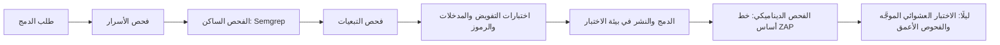
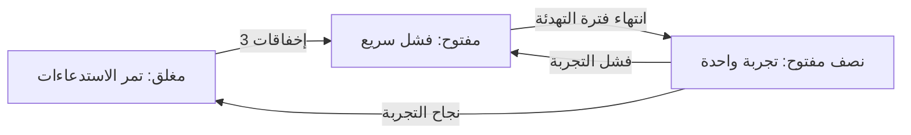

# الوحدة 4 — اختبار خصائص الجودة (Testing the qualities)

*يمكن لميزة (feature) أن تجتاز كل اختبار وظيفي (functional test) ومع ذلك تخذل من يستخدمونها (still fail the people who use it): الشاشة التي تستغرق ست ثوانٍ يوم الراتب (the screen that takes six seconds on payday)، والتحويل الذي يستطيع عميل آخر قراءته (the transfer another customer can read)، وإعادة المحاولة التي تخصم مرتين (the retry that debits twice)، والنسخة الاحتياطية التي لا يستطيع أحد استعادتها (the backup nobody can restore). هذه هي خصائص الجودة (quality characteristics)، وتسميها المواصفة ISO/IEC 25010 كفاءة الأداء (performance efficiency) والأمان (security) والموثوقية (reliability) وغيرها، ولا يشعر بها العملاء إلا حين تفشل (only when they fail). تعلّمك هذه الوحدة كيف تختبرها في بنك نجم (Najm Bank). يأتي الأداء (performance) أولًا: اختبارات الحِمل (load) والضغط (stress) والتحمّل الطويل (soak) والذروة المفاجئة (spike)، والنسب المئوية (percentiles) وأهداف مستوى الخدمة (service level objectives)، والمطبّات التي تجعل اختبار الحِمل يكذب (the pitfalls that make a load test lie). ثم الأمان (security) من مقعد المختبِر (from a tester's chair): مصفوفات التفويض (authorisation matrices) والمدخلات العدائية (hostile input) واختبارات الرموز (token tests) وتحديد المعدل (rate-limit tests) وأدوات الفحص في خط التكامل (scanners in a pipeline) والاختبار العشوائي الموجَّه (fuzzing)، وكلها موجَّهة إلى النظام النموذجي للدورة (the course's sample system) ولا شيء سواه (nothing else). وأخيرًا الموثوقية (reliability) والبيانات (data): حقن الأعطال (fault injection) وإعادة المحاولة (retries) وقواطع الدائرة (circuit breakers) وتجارب الفوضى (chaos experiments) وتمارين الاستعادة (restore drills) والترحيلات الآمنة (safe migrations) وفحوص جودة البيانات (data-quality checks) لخط التقارير التنظيمية (regulatory reporting pipeline). ستتابع ندى (Nada) وهي تتعلم من اختبار حِمل في سطر واحد (a one-line load test) ما يخفيه المتوسط (what an average hides)، ومن فحص نظيف (a clean scan) يفوته ما يجده اختبار بمستخدمين اثنين (a two-user test)، ومن رد ضائع (a lost reply) يكشف خصمًا مزدوجًا (a double debit). ويسري الذكاء الاصطناعي (AI) في الدروس الثلاثة: يكتب الوكلاء (agents) شيفرة تعمل لكنها تتوسع وتفوّض وتعيد المحاولة بصورة سيئة (works yet scales, authorises and retries badly)، وسؤال «هل يمكن أن يفشل هذا الاختبار؟» ⁦(could this test fail?)⁩ يُبقي الوكيل والاختبارات صادقين (keeps both the agent and the tests honest).*

> **التركيز (Focus):** Performance, Security, Reliability — اختبار الخصائص التي لا يشعر بها المستخدمون إلا حين تفشل (testing the qualities that users feel only when they fail): ما مدى سرعة النظام وثباته تحت الحِمل (how fast and how steady the system is under load)، ومن يحق له فعل ماذا ببيانات من (who may do what to whose data)، وما الذي ينجو من عطل (a fault) أو نشر سيئ (a bad deploy) أو استعادة (a restore).

---

# 4.1 — اختبار الأداء: الحِمل والضغط والتحمّل الطويل والذروة المفاجئة، والنسب المئوية وأهداف مستوى الخدمة (Performance testing: load, stress, soak and spike, percentiles and SLOs)
*المستوى (Level): 🟡 متوسط (Intermediate)* · *المتطلبات (Prerequisites): 2.1، 3.1* · *التركيز (Focus): Performance*

## ⚡ الدرس في دقيقة (In 60 seconds)
- يطرح **اختبار الأداء (performance test)** سؤالًا واحدًا عن السرعة أو السعة (speed or capacity) تحت حِمل معلن (a stated load): «هل ينتهي 95 % من طلبات الرصيد خلال 300 ms عند حركة يوم الراتب؟» ⁦(Do 95 % of balance requests finish within 300 ms at payday traffic?)⁩ لا رقم، لا اختبار ⁦(No number, no test.)⁩
- اختر النوع بحسب السؤال (Pick the type by the question): **الدخان (smoke)** أو **الحِمل (load)** أو **الضغط (stress)** أو **الذروة المفاجئة (spike)** أو **التحمّل الطويل (soak)**.
- أبلِغ عن **النسب المئوية (percentiles)** والإنتاجية (throughput) ومعدل الأخطاء (error rate) والتشبّع (saturation)؛ فالمتوسط (an average) يُخفي العملاء الذين يعانون (hides the customers who suffer).
- أكبر فخ (Biggest trap): اختبار يكذب (a test that lies) — الإغفال المنسَّق (coordinated omission) والبدايات الباردة (cold starts) ومولِّد حِمل مثقل (an overloaded generator) وبيانات ضئيلة (tiny data).
- اختبر الأنظمة التي تملكها وحدها (Test only systems you own).

## 🧭 لماذا يهم (Why it matters)
قبل يوم الراتب (Before payday) يكون أول اختبار أداء (performance test) لندى (Nada) خمسين مستخدمًا افتراضيًا (50 virtual users) يستدعون `GET /health` مدة دقيقة من حاسوبها المحمول (from her laptop). المتوسط 4 ms: «الأداء سليم» (performance OK). يسأل راشد (Rashid) أي نقطة نهاية (endpoint) يستخدمها العملاء، وما معدل الوصول (arrival rate) يوم الراتب، وكم تبلغ قيمة p99. لا تستطيع ندى الإجابة عن أي منها (can answer none).

بعد أسبوعين (Two weeks later) تستجيب شاشة كشف الحساب الجديدة (the new statement screen) خلال 80 ms في بيئة ضمان الجودة (QA)، لكن قيمة p99 في الإنتاج (production) تتجاوز ست ثوانٍ يوم الراتب: فهي تنفّذ استعلامًا واحدًا لكل صف (one query per row)، وتحتوي بيئة QA على 20 تحويلًا لكل عميل بينما يحتوي الإنتاج على الآلاف (holds thousands).

## 📐 كيف يعمل (How it works)

### 🟢 الأساسيات (The essentials)

**أنواع اختبار الأداء (Types of performance test).**

| النوع (Type) | السؤال الذي يجيب عنه (The question it answers) | شكل الحِمل (Shape of the load) |
|---|---|---|
| **الدخان (Smoke)** | هل يعمل السكربت ويستجيب النظام؟ ⁦(Does the script work and the system answer?)⁩ | بضعة مستخدمين (A few users)، 30 s، مع كل طلب دمج (every pull request) |
| **الحِمل (Load)** | هل يتحقق الهدف عند الحركة المتوقعة؟ ⁦(Is the target met at expected traffic?)⁩ | ذروة متوقعة ثابتة (Steady expected peak)، من 10 إلى 30 دقيقة (10 to 30 min) |
| **الضغط (Stress)** | أين الحد، وما الذي ينكسر أولًا؟ ⁦(Where is the limit; what breaks first?)⁩ | ارفع الحِمل تدريجيًا (Ramp up) حتى تتجاوز الأخطاء أو زمن الاستجابة (latency) الخط (cross the line) |
| **الذروة المفاجئة (Spike)** | هل ننجو من اندفاع مفاجئ ونتعافى؟ ⁦(Do we survive a sudden surge and recover?)⁩ | أضعاف الحِمل المعتاد لدقائق (Several times normal for minutes) |
| **التحمّل الطويل (Soak)** | هل يبقى سليمًا لساعات (stay healthy for hours)، مثل التسرّبات (leaks) وامتلاء الأقراص (full disks)؟ | حِمل عادي (Normal load)، من 4 إلى 24 ساعة (4 to 24 hours) |

**الأهداف وأهداف مستوى الخدمة (Goals and SLOs).** يسمّي الهدف القابل للاختبار (A testable goal) المقياس (metric) والنسبة المئوية (percentile) والحِمل (load) والرقم (number): «p95 للمسار `GET /accounts/{id}/balance` أقل من 300 ms وp99 أقل من 800 ms عند 100 طلب في الثانية (100 requests per second)، والأخطاء أقل من 1 %» (errors under 1 %). **مؤشر مستوى الخدمة (service level indicator, SLI)** هو ما تقيسه، و**هدف مستوى الخدمة (service level objective, SLO)** هو الغاية (the target)؛ ويحوّله الاختبار إلى **عتبة (threshold)** نجاح أو فشل (pass/fail)، بالصرامة نفسها المعتمدة في الإنتاج (as strict as production's) ([*السحابة وDevOps (Cloud & DevOps)*، الدرس 5.2 — أهداف مستوى الخدمة وميزانيات الأخطاء والتنبيه والمناوبة التي يمكن للناس تحمّلها (SLOs, error budgets, alerting and on-call that people can sustain)](../cloud/index.ar.html#/5.2)).

**نسب مئوية لا متوسطات (Percentiles, not averages).** **p99** هو الزمن الذي يساويه أو يقل عنه 99 % من الطلبات (the time 99 % of requests are at or below). من بين 1,000 طلب (Of 1,000 requests) يستغرق 980 منها 100 ms ويستغرق 20 طلبًا 5 ثوانٍ. المتوسط (The mean) 198 ms وp95 يساوي 100 ms، وكلاهما «سليم» (healthy)؛ أما p99 فيبلغ 5,000 ms، أي أنه عند 100 طلب في الثانية ينتظر عميلان كل ثانية خمس ثوانٍ (two customers every second wait five seconds). لا تحسب متوسط النسب المئوية عبر الخوادم (Never average percentiles across servers)؛ بل ادمج العيّنات (merge the samples). اقرأ زمن الاستجابة (latency) إلى جانب **الإنتاجية (throughput)** و**معدل الأخطاء (error rate)** و**التشبّع (saturation)**، أي مدى امتلاء المعالج (CPU) أو مجمّع الاتصالات (pool) أو الطابور (queue)؛ فالخادم الذي يرد بـ`500` خلال 2 ms يبدو سريعًا (looks fast).

```text
Weak:   assert mean_latency < 200 ms               # passes on the data above
Strong: assert p99 < 800 ms and error_rate < 1 %   # fails on the same data
```

### 🟡 التعمق أكثر (Going deeper)

**نمذجة عبء العمل (Workload modelling).** في **النموذج المغلق (closed model)** ترسل مجموعة ثابتة من المستخدمين الافتراضيين (a fixed set of virtual users) كل واحد منهم طلبًا، وينتظر، ويتوقف، ويكرر؛ وحين يبطؤ النظام يبطؤ المستخدمون معه، فيخفّف الاختبار ضغطه في اللحظة التي ينبغي أن يزيده فيها (eases off just when it should push). أما في **النموذج المفتوح (open model)** فتصل الطلبات بمعدل محدد سواء انتهت الطلبات السابقة أم لا (whether or not earlier ones finished)، كما يفعل الجمهور، فيجعل البطء العمل يتراكم في الطابور (makes work queue). تطبيق نجم للهاتف (Najm Mobile) مفتوح النموذج. **زمن التفكير (Think time)** هو التوقف حين يقرأ الشخص الشاشة؛ وبدونه يضرب 100 مستخدم افتراضي النظام بقوة أكبر بكثير مما يفعله 100 شخص (far harder than 100 people would). خذ معدل الوصول (arrival rate) ومزيج الطلبات (request mix) لأكثر ساعة ازدحامًا من سجلات الإنتاج (production logs)، وأضف هامشًا احتياطيًا (headroom)، واستخدم بيانات مقنَّعة (masked) على شكل بيانات الإنتاج (production-shaped).

**مولّد حِمل يمكنك قراءته (A load generator you can read).** يقيس هذا المولّد ذو النموذج المفتوح (open-model generator) (`asyncio` و`httpx`) زمن كل طلب منذ بدايته *المقصودة* (intended start)، ويُسقط فترة الإحماء (drops a warm-up)، ويخرج برمز غير صفري (exits non-zero) عند خرق هدف مستوى الخدمة (when the SLO is breached). احفظه باسم `perf/loadtest.py` في نسخة من `testing/sample`.

```python
# perf/loadtest.py
import asyncio, math, sys, time

import httpx

A = {"Authorization": "Bearer token-alice"}
BODY = {"from_account": "acc-1", "to_account": "acc-2", "amount": "1.00", "currency": "QAR", "kind": "domestic"}


def pct(values, p):                                    # nearest-rank percentile
    s = sorted(values)
    return s[max(0, math.ceil(p / 100 * len(s)) - 1)]


async def visit(client, i, intended, out):
    sent = time.perf_counter()
    try:
        if i % 5:                                      # four balance checks for every transfer
            r = await client.get("/accounts/acc-1/balance", headers=A)
        else:
            r = await client.post("/transfers", json=BODY, headers={**A, "Idempotency-Key": f"load-{i}"})
        ok = r.status_code in (200, 201)
    except httpx.HTTPError:
        ok = False
    done = time.perf_counter()    # timed from the INTENDED start, as the customer lived it; lag: how late we were
    out.append(dict(ok=ok, intended=done - intended, lag=sent - intended))


async def run(rate, seconds, warmup=3):
    out, tasks = [], []
    async with httpx.AsyncClient(base_url="http://127.0.0.1:8000", timeout=10,
                                 limits=httpx.Limits(max_connections=500)) as client:   # the pool must not be the cap
        t0 = time.perf_counter()
        for i in range(rate * (warmup + seconds)):
            intended = t0 + i / rate                   # open model: the schedule ignores replies
            await asyncio.sleep(max(0, intended - time.perf_counter()))
            sink = [] if i < rate * warmup else out    # warm-up requests are sent, then dropped
            tasks.append(asyncio.create_task(visit(client, i, intended, sink)))
        await asyncio.gather(*tasks)
    return out


if __name__ == "__main__":
    rate, seconds = int(sys.argv[1]), int(sys.argv[2])
    out = asyncio.run(run(rate, seconds))
    ms = lambda key, p: 1000 * pct([r[key] for r in out], p)
    errors = sum(not r["ok"] for r in out) / len(out)
    print(f"requests={len(out)} errors={errors:.2%} target={rate}/s")
    for key in ("intended", "lag"):
        print(f"{key:>9}: p50={ms(key, 50):7.1f} p95={ms(key, 95):7.1f} p99={ms(key, 99):7.1f} ms")
    mean = sum(r["intended"] for r in out) / len(out)
    print(f"Little's Law: {rate}/s x {1000 * mean:.1f} ms = {rate * mean:.1f} requests in flight")
    ok = ms("intended", 95) <= 100 and ms("intended", 99) <= 250 and errors <= 0.01      # the SLO
    print("SLO:", "PASS" if ok else "FAIL")
    sys.exit(0 if ok else 1)
```

شغّل واجهة البرمجة (Start the API) (`uvicorn najm.api:app --port 8000`)، ثم نفّذ `python perf/loadtest.py 200 15`. على حاسوب محمول (On a laptop) — وستختلف نتائجك (yours will differ):

```text
requests=3000 errors=0.00% target=200/s
 intended: p50=    3.7 p95=    5.8 p99=   10.0 ms
      lag: p50=    0.8 p95=    1.2 p99=    2.1 ms
Little's Law: 200/s x 4.0 ms = 0.8 requests in flight
SLO: PASS
```

**قانون ليتل ونقطة الانكسار (Little's Law and the knee).** في نظام مستقر (stable system) **L = λW**: عدد الطلبات داخل النظام (L) يساوي معدل الوصول (arrival rate, λ) مضروبًا في الزمن الذي يقضيه كل طلب هناك (W). ويضع القانون نفسه سقفًا (sets a ceiling): 6 اتصالات بقاعدة البيانات (database connections)، يُحتجز كل منها 30 ms، تُنهي 6 / 0.03 = 200 طلب في الثانية على الأكثر (at most). احفظ هذا الغلاف (wrapper) باسم `pooled_app.py`، وشغّله بالأمر `uvicorn pooled_app:app --port 8000`، ثم امسح المعدلات بالتدريج (sweep the rate).

```python
# pooled_app.py: the sample API behind a pretend database pool
import asyncio, os

from najm.api import create_app

POOL = int(os.getenv("POOL", "4"))
app, slots = create_app(), asyncio.Semaphore(POOL)    # POOL connections...


@app.middleware("http")
async def pretend_database(request, call_next):
    async with slots:
        await asyncio.sleep(0.04)                      # ...each held for 40 ms
        return await call_next(request)
```

عند 40 و80 طلبًا في الثانية بقيت قيمة p95 قرب 48 ms، مع نحو 1.9 و3.7 طلب قيد التنفيذ (requests in flight) — ويتسع المجمّع لأربعة (the pool holds 4). وعند 100 في الثانية قفزت p50 من نحو 46 ms إلى أكثر من ثانية، مع أكثر من مئة طلب قيد التنفيذ. لا عيب في الشيفرة (Nothing is wrong with the code)؛ فالمجمّع (pool) لا يستطيع إنهاء ما يصل إليه، فيتزايد الانتظار ما دام الاختبار يعمل (waiting grows as long as the test runs). دون **نقطة الانكسار (knee)** يبقى زمن الاستجابة (latency) ثابتًا، وفوقها ينفجر: يجدها اختبار الضغط (a stress test)، ويثبت اختبار الحِمل (a load test) أنك تبقى بعيدًا عنها (stay clear of it).

**مطبّات تجعل الأرقام تكذب (Pitfalls that make numbers lie).**
- **الإغفال المنسَّق (Coordinated omission)** (مصطلح Gil Tene، Gil Tene's term). تنتظر الأداة ذات الحلقة المغلقة (A closed-loop tool) ردًا بطيئًا قبل إرسال الطلب التالي، فلا تسجّل أبدًا الطلبات التي *كان ينبغي* أن تخرج أثناء التجمّد (during the stall). تخيّل خدمة ترد عادة خلال 10 ms ثم تتجمّد ثانيتين (freezes for two seconds)، وعميلًا يخطط لطلب كل 20 ms مدة 8 s. فإذا قِيس الزمن من لحظة الإرسال (Timed from the send) كان طلب واحد من كل 400 بطيئًا، وقيمة p99 تساوي 10 ms؛ وإذا قِيس من اللحظة المخططة (timed from the planned moment) كما عاشها العملاء، انتظر نحو 200 طلب، وقيمة p99 قرابة ثانيتين، لأن العميل يحتاج إلى نحو 200 طلب ليلحق بالجدول (to catch up). يحاكيه التمرين 🟡 (Exercise 🟡 simulates it). يقيس مولّدنا من الخطة (times from the plan)؛ وتبدأ منفّذات معدل الوصول (arrival-rate executors) في k6 التكرارات (iterations) على ساعة وتبلّغ عمّا لم تستطع بدءه باسم `dropped_iterations`.
- **ذواكر تخزين مؤقت باردة وJIT والمجمّعات (Cold caches, JIT, pools).** تصادف الطلبات الأولى ذواكر تخزين مؤقت فارغة (empty caches) واتصالات لم تُفتح بعد (unopened connections). أسقط فترة إحماء (Drop a warm-up).
- **المولِّد بوصفه عنق الزجاجة (The generator as bottleneck).** على حاسوب محمول واحد عمل النظام النموذجي بسلاسة عند 400 طلب في الثانية (ran cleanly at 400 requests per second)، لكن عند 600 تجاوز `lag` ثلاث ثوانٍ: لم تستطع الأداة الإرسال في موعدها (could not send on schedule)، فوصفت الأرقام الأداة نفسها (the numbers described the tool). راقب `lag` (في k6: `dropped_iterations`) والمعالج (CPU).
- **بيانات غير واقعية (Unrealistic data).** عشرون صفًا لكل عميل (Twenty rows per customer) تُخفي مشكلة N+1 (hides N+1)؛ وحساب ساخن واحد (one hot account) يُخفي إخفاقات الذاكرة المؤقتة (cache misses).
- **بيئات مشتركة (Shared environments).** إذا شغّل فريق آخر دفعة (a batch) على بيئة QA في منتصف الاختبار، فقد قسْتَ مهمته هو (you measured their job).

**الاختبار نفسه في k6 (The same test in k6).** k6 (من Grafana Labs) برنامج مكتوب بلغة Go يشغّل سكربت الاختبار الذي تكتبه بلغة JavaScript، ومعه العتبات (thresholds) والسيناريوهات (scenarios) مدمجة؛ وهو ليس Node.js، فواجهات Node البرمجية (Node APIs) غير متاحة. يتبع هذا السكربت توثيق الأداة (follows its documentation) و**لم يُنفَّذ** (was not executed)؛ شغّله أولًا بحجم اختبار الدخان (at smoke size).

```javascript
// perf/k6/transfers.js
// Smoke: k6 run perf/k6/transfers.js   Nightly: add -e BASE_URL=... -e RATE=50 -e DURATION=20m
import http from 'k6/http';
import { sleep } from 'k6';

const BASE = __ENV.BASE_URL || 'http://127.0.0.1:8000';
const AUTH = { Authorization: 'Bearer token-alice' };
const rate = Number(__ENV.RATE || 5);

export const options = {
  scenarios: {
    steady: { executor: 'constant-arrival-rate', exec: 'visit', rate, timeUnit: '1s',   // an OPEN model
              duration: __ENV.DURATION || '30s', preAllocatedVUs: rate * 3, maxVUs: rate * 6 },  // VUs: Little's Law
  },
  thresholds: {                                          // the SLO; k6 exits non-zero if one is crossed
    'http_req_duration{endpoint:balance}': ['p(95)<300', 'p(99)<800'],
    'http_req_duration{endpoint:transfer}': ['p(95)<500', 'p(99)<1200'],
    http_req_failed: ['rate<0.01', { threshold: 'rate<0.05', abortOnFail: true, delayAbortEval: '30s' }],
  },
};

export function visit() {
  http.get(`${BASE}/accounts/acc-1/balance`, { headers: AUTH, tags: { endpoint: 'balance' } });
  sleep(1 + Math.random() * 3);                          // think time: the customer reads the screen
  if (Math.random() < 0.2) {
    const body = JSON.stringify({ from_account: 'acc-1', to_account: 'acc-2', amount: '1.00', currency: 'QAR', kind: 'domestic' });
    const headers = { ...AUTH, 'Content-Type': 'application/json', 'Idempotency-Key': `${__VU}-${__ITER}-${Date.now()}` };
    http.post(`${BASE}/transfers`, body, { headers, tags: { endpoint: 'transfer' } });
  }
}
```

ذروة الـ4× الليلية (The nightly 4× spike) سيناريو ثانٍ بمنفّذ `ramping-arrival-rate`؛ حدّد حجم `maxVUs` بقانون ليتل (size by Little's Law): فـ4× المعدل عند نحو 2.6 s لكل تكرار (per iteration) تحتاج إلى نحو 10× المعدل من المستخدمين الافتراضيين (VUs).

### 🔴 نظرة الخبير (Expert view)

**قراءة النتائج (Reading results).** ثق بالتشغيل قبل أرقامه (Trust the run before its numbers): هل `lag` صغير، ومعالج المولِّد حرّ (the generator's CPU free)، والأخطاء قرب الصفر (errors near zero)، وفترة الإحماء مُسقَطة (the warm-up dropped)، والبيانات واقعية (the data realistic)؟ عندها فقط قارن p95 وp99 بهدف مستوى الخدمة (SLO) وابحث عن نقطة الانكسار (the knee) وأول مورد يتشبّع (the first saturated resource)، وفي اختبار التحمّل الطويل (in a soak) عن الانجراف (drift).

**اختبارات الأداء في التكامل المستمر (Performance tests in CI).** تشغّل مهمة الدخان (The smoke job) الواجهة وتنفّذ `python perf/loadtest.py 20 10`؛ فتلتقط التراجعات بمقدار 10 أضعاف (10× regressions) لا بنسبة 10 % (not 10 % ones). وتشغّل المهمة الليلية (The nightly job) ملف k6 على بيئة ما قبل الإنتاج (staging). المشغِّلات المشتركة (Shared runners) كثيرة الضجيج (noisy): قارن بخط أساس (baseline) من المهمة نفسها.

**ميزانيات أداء الويب (Web performance budgets).** مؤشرات **Core Web Vitals** من Google، التي تُقاس عند النسبة المئوية الخامسة والسبعين (75th percentile) لتحميلات الصفحات الحقيقية (real page loads)، هي **LCP** (Largest Contentful Paint)، والجيد 2.5 s أو أقل (good is 2.5 s or less)، و**INP** (Interaction to Next Paint)، الذي حلّ محل First Input Delay في مارس 2024 (in March 2024)، والجيد 200 ms أو أقل، و**CLS** (Cumulative Layout Shift)، والجيد 0.1 أو أقل. يدقّق **Lighthouse** صفحةً في بيئة مخبرية (audits a page in a lab)؛ وتدقيق تحميل الصفحة القياسي (a standard page-load audit) لا يتضمن تفاعلات (no interactions)، فلا يستطيع قياس INP ويبلّغ عن Total Blocking Time بديلًا عنه (as a proxy). ويفرض Lighthouse CI الميزانيات في خط التكامل (asserts budgets in a pipeline) — ولم يُشغَّل هنا (not run here)؛ وفي Chromium يستطيع Playwright قراءة LCP وCLS عبر `PerformanceObserver`. في صفحة `/app` من النظام النموذجي كانت LCP أقل من 100 ms، فلا يمكن لميزانية 2,500 ms أن تفشل أبدًا: فميزانية المختبر (a lab budget) هي *إنذار انحدار (regression alarm)* بقيمة تبلغ عدة أضعاف قيمة اليوم (several times today's value) — واستخدمنا 500 ms (we used 500 ms). ودفع شعار (banner) بارتفاع 600 px حُقن متأخرًا بـ300 ms قيمة CLS إلى 0.112 وأفشل ميزانية 0.1 (التمرين 🟢، exercise 🟢).

**كشف مشكلة N+1 في قاعدة البيانات بعدّ الاستعلامات (Database N+1 detection by counting queries).** تقرأ N+1 قائمةً ثم تنفّذ استعلامًا إضافيًا لكل صف (An N+1 reads a list, then runs one more query per row). على الحاسوب المحمول يستغرق كل استعلام 0.1 ms فينجح اختبار التوقيت (a timing test passes)؛ أما في الإنتاج فكل استعلام رحلة ذهاب وإياب عبر الشبكة (a network round trip). عُدَّ العبارات (Count statements)، وأكّد ألا يزيد العدد بزيادة حجم الصفحة (assert the count does not grow with page size). تُظهر `set_trace_callback` في SQLite كل عبارة (shows each one)، وفي Django يوجد `assertNumQueries`.

```python
# tests/test_statement.py
import sqlite3

import pytest


def make_db(rows):
    db = sqlite3.connect(":memory:")
    db.executescript("CREATE TABLE people (id INTEGER PRIMARY KEY, name TEXT);"
                     "CREATE TABLE transfers (id INTEGER PRIMARY KEY, person_id INTEGER);")
    for i in range(1, rows + 1):
        db.execute("INSERT INTO people VALUES (?, ?)", (i, f"Recipient {i}"))
        db.execute("INSERT INTO transfers (person_id) VALUES (?)", (i,))
    return db


def slow(db, n):                      # one query for the list, then one per row
    rows = db.execute("SELECT id, person_id FROM transfers ORDER BY id DESC LIMIT ?", (n,)).fetchall()
    return [(t, db.execute("SELECT name FROM people WHERE id = ?", (p,)).fetchone()[0]) for t, p in rows]


def fast(db, n):                      # one JOIN
    return db.execute("SELECT t.id, p.name FROM transfers t JOIN people p ON p.id = t.person_id "
                      "ORDER BY t.id DESC LIMIT ?", (n,)).fetchall()


def queries(fn, n):
    db, seen = make_db(60), []
    db.set_trace_callback(lambda sql: seen.append(sql) if sql.startswith("SELECT") else None)
    assert len(fn(db, n)) == n
    return len(seen)


@pytest.mark.parametrize("fn", [slow, fast])
def test_weak_right_rows(fn):         # passes for both: SQLite in memory is quick
    assert len(fn(make_db(60), 50)) == 50


@pytest.mark.parametrize("fn", [slow, fast])
def test_strong_query_count_does_not_grow_with_page_size(fn):    # MEANT TO FAIL for slow
    assert queries(fn, 50) == queries(fn, 5)
```

```text
FAILED tests/test_statement.py::test_strong_query_count_does_not_grow_with_page_size[slow]
E       assert 51 == 6
```

**ملاحظات عصر الذكاء الاصطناعي (AI-era notes).** يكتب وكلاء البرمجة (Coding agents) شيفرة تعمل لكنها تتوسع بصورة سيئة (works and scales badly): استعلامات N+1، وقوائم غير محدودة (unbounded lists)، وقفل محتجز عبر استدعاء شبكي (a lock held across a network call). اطلب عدد الاستعلامات (query count) وp95 تحت حِمل معياري (under standard load)، لا «إنها تعمل» (it works). وتميل سكربتات الحِمل التي يكتبها الذكاء الاصطناعي (AI-written load scripts) إلى النموذج المغلق ونقطة نهاية واحدة وبلا زمن تفكير (closed-model, one endpoint, no think time). وتضيف ميزات النماذج اللغوية الكبيرة (LLM features) **زمن أول رمز (time to first token)** و**الرموز في الثانية (tokens per second)** وتكلفة الطلب (cost per request) — يضبطها الدرس 7.1 (lesson 7.1 gates them)؛ ضع سقفًا للإنفاق أولًا (set a spending cap first). لا تحمّل إلا أنظمة تملكها أو يحق لك اختبارها كتابةً (own or may test in writing): فمن غير ذلك يكون الحِمل هجومًا (load is an attack).

## 🧰 الأدوات (The toolkit)
| الأداة أو الممارسة أو التقنية (Tool, practice or technique) | ما هي وماذا تفعل (What it is and does) | متى تلجأ إليها (When to reach for it) |
|---|---|---|
| **k6** (Grafana Labs) | سكربتات JavaScript وعتبات وسيناريوهات (JavaScript scripts, thresholds, scenarios) | اختبارات حِمل الواجهات في التكامل المستمر (API load tests in CI) |
| **Locust** | سلوك بلغة Python العادية (Plain-Python behaviour)؛ حِمل أقل لكل عملية (less load per process) | فرق Python (Python teams)؛ التدفقات المعقدة (complex flows) |
| **Apache JMeter** | واجهة رسومية (GUI) وبروتوكولات كثيرة (many protocols)؛ يصعب مراجعة خطط XML (XML plans are hard to review) | البيئات القائمة (Existing estates)؛ ما ليس HTTP (non-HTTP) |
| **Gatling** | كفء، على منصة JVM (Efficient, JVM stack) — و**Artillery** أخف ويستخدم YAML (lighter, YAML) | حِمل مرتفع بأجهزة قليلة (High load, few machines) |
| **Percentile thresholds** | هدف مستوى الخدمة نجاحًا أو فشلًا (An SLO as pass or fail): p95 وp99 والأخطاء (errors) | كل اختبار أداء (Every performance test) |
| **Little's Law** | L = λW: ما قيد التنفيذ = المعدل × الزمن (in flight = rate × time) | تحديد حجم المستخدمين الافتراضيين والمجمّعات (Sizing virtual users, pools) |
| **Lighthouse and Core Web Vitals** | تدقيقات مخبرية (Lab audits)؛ وLCP وINP وCLS الميدانية (field) | الصفحات التي لها ميزانية (Pages with a budget) |
| **Query counting** | تأكيد عدد العبارات لكل طلب (Assert statements per request) | التقاط N+1 قبل الإنتاج (Catching N+1 before production) |

## 🏛️ عمليًا في بنك نجم (In practice at Najm Bank)
ينشر بلال (Bilal) ومها (Maha) **خطة اختبار الأداء في نجم، الإصدار 1 (Najm Performance Test Plan v1)**، وهي قالب (a template) يُكمله كل اختبار قبل تشغيله (completes before it runs). وهذه خطة التحويلات (The Transfers plan):

| الحقل (Field) | التحويلات، صباح يوم الراتب (Transfers, payday morning) |
|---|---|
| السؤال والبيئة (Question, environment) | هل نحقق هدف مستوى الخدمة عند الذروة المتوقعة، وأين نقطة الانكسار؟ ⁦(Do we meet the SLO at expected peak, and where is the knee?)⁩ بيئة ما قبل الإنتاج (Staging) محجوزة (booked)؛ نسخة مقنَّعة (masked copy) بمليوني حساب (2 million accounts) |
| عبء العمل (Workload) | نموذج مفتوح (Open model)؛ 80 % رصيد (balance) و15 % كشف حساب (statement) و5 % تحويل (transfer)؛ زمن التفكير (think time) من 1 إلى 4 s |
| ملف الحِمل (Load profile) | إحماء 3 دقائق (3 min warm-up)، و20 دقيقة عند الذروة (20 min at peak)؛ ويضيف الاختبار الليلي ذروة مفاجئة 4× (nightly adds a 4× spike) |
| النجاح والإيقاف (Pass and stop) | p95 ≤ 300 ms وp99 ≤ 800 ms والأخطاء < 1 %؛ يُجهَض الاختبار (abort) إذا تجاوزت الأخطاء 5 % بعد أول 30 s |

تعمل اختبارات الدخان (Smoke) وعدّ الاستعلامات (query-count tests) مع كل طلب دمج (pull request)، وملف k6 ليليًا (nightly)، واختبار تحمّل طويل (soak) لأربع ساعات قبل الإصدارات (before releases).

## 🛠️ التمارين (Exercises)
اعمل في نسخة من `testing/sample` (Work in a copy).

- 🟢 **ميزانية لصفحة (Budget a page).** اكتب اختبار Playwright للمسار `/app` يجمع LCP وCLS بكائنات `PerformanceObserver` تُعدّ في `page.addInitScript` (set up in)، ويكرر الفحص بـ`expect.poll` حتى تصير LCP أكبر من الصفر (polls until LCP is above zero)، ويؤكد أن LCP أقل من 500 ms وأن CLS أقل من 0.1. ثم استخدم `page.route('**/app', …)` لحقن عنصر `div` ارتفاعه 600 px بعد 300 ms من التحميل (inject a 600 px div 300 ms after load). *يكتمل عندما (Done when):* تنجح الصفحة العادية (the plain page passes) وتفشل صفحة الشعار بسبب CLS (the banner page fails on CLS).
- 🟡 **ابحث عن نقطة الانكسار (Find the knee).** شغّل `pooled_app.py`، وتنبّأ بأقصى معدل له بقانون ليتل (predict its maximum rate with Little's Law)، وامسح المولِّد بخطوات من 10 حتى تتضاعف p95 (until p95 doubles). ثم حاكِ التجمّد لثانيتين بساعة محاكاة (simulate the two-second freeze with a simulated clock) مع قياس الزمن بالطريقتين (timing it both ways). *يكتمل عندما (Done when):* يقع التنبؤ في حدود 15 % من نقطة الانكسار المقيسة (within 15 % of the measured knee) وتختلف قيمتا p99 لديك كما هو موصوف (differ as described).
- 🔴 **حارس داخل العملية (Guard in process).** اكتب اختبار pytest يرسل 300 طلب إلى كل من `/health` ونقطة نهاية الرصيد (balance endpoint) عبر `httpx.ASGITransport(app=create_app())`، ويُسقط فترة إحماء (drops a warm-up)، ويؤكد أن كل حالة تساوي 200 (every status is 200)، ويشترط أن تكون p95 للرصيد أقل من الأكبر بين 5 ms وخمسة أضعاف p95 لنقطة الصحة (the larger of 5 ms and five times the health p95). *يكتمل عندما (Done when):* ينجح في 10 تشغيلات نظيفة (10 clean runs) ويفشل بعد أن تضيف نومًا قدره 20 ms (a 20 ms sleep) إلى نقطة نهاية الرصيد في نسختك.

## ⚠️ أخطاء وفخاخ (Mistakes and traps)
- **المتوسطات وحدها (Averages only).** أخفى متوسط 198 ms قيمة p99 بلغت 5 s (hid a 5 s p99). اجعل البوابة (Gate) على p95 وp99 والأخطاء (errors).
- **زمن الاستجابة دون الأخطاء (Latency without errors).** ردود `500` الفورية تبدو سريعة (look quick). افحص رموز الحالة (Check statuses).
- **حلقة مغلقة لخدمة عامة (A closed loop for a public service).** استخدم معدلات الوصول (Use arrival rates).
- **بيانات ضئيلة (Tiny data).** عشرون صفًا تُخفي N+1 (Twenty rows hide N+1). استخدم بيانات مقنَّعة على شكل بيانات الإنتاج (production-shaped, masked data).
- **الإفراط في الاختبار (Over-testing).** صفحة يستخدمها خمسة موظفين (A page five staff use) تحتاج اختبار عدّ استعلامات (a query-count test) لا اختبار حِمل (not a load test).

## 🧾 الخلاصة (Recap)
- اختبار الأداء (performance test) سؤال برقم (a question with a number): النوع (type) والحِمل (load) وعتبة هدف مستوى الخدمة (SLO threshold).
- تصف النسب المئوية (Percentiles) والإنتاجية (throughput) والأخطاء (errors) والتشبّع (saturation) أي تشغيل (describe a run)؛ أما المتوسط (the mean) فيُخفي العملاء (hides customers).
- يحدد قانون ليتل (Little's Law)، أي L = λW، أحجام المجمّعات (pools) والمستخدمين الافتراضيين (virtual users) ويتنبأ بنقطة الانكسار (the knee).
- لا تثق بتشغيل (Distrust a run) حتى تُفحص تأخّر المولِّد (generator lag) والأخطاء (errors) والإحماء (warm-up) والبيانات (data).

## ✍️ اختبر نفسك (Check yourself)

**1. يبلّغ اختبار حِمل (A load test) عن متوسط 120 ms و«كل شيء أخضر» (all green). وقيمة p99 تساوي 4 ثوانٍ. ما القراءة الصحيحة؟ ⁦(What is the correct reading?)⁩**

- A. ينتظر طلب واحد على الأقل من كل مئة أربع ثوانٍ أو أكثر (At least one request in a hundred waits four seconds or longer)
- B. المتوسط خاطئ (The mean is wrong)، لأن المتوسطات لا يمكن قياسها بموثوقية (averages cannot be measured reliably)
- C. النظام سليم (The system is healthy)، لأن المتوسط ضمن هدف مستوى الخدمة (SLO) بهامش واسع (well inside)
- D. قيمة p99 شاذة (an outlier) ويمكن تجاهلها بأمان (can safely be ignored)

<details><summary>الإجابة</summary>

**A.** ينتهي 99 % من الطلبات خلال p99 (finish within the p99)، فينتظر أبطأ 1 % أربع ثوانٍ أو أكثر؛ والمتوسط المنخفض (a low mean) يُخفيهم. (🟢 الأساسيات، The essentials).

</details>

**2. يشغّل سكربت بلال (Bilal's script) مئة مستخدم افتراضي (100 virtual users) على واجهة نجم في بيئة ما قبل الإنتاج (staging API)، ويرسل كل منهم طلبه التالي حين يصل الرد السابق (when the last reply arrives). تتجمّد الخدمة عشر ثوانٍ (freezes for ten seconds). ماذا يُسجَّل؟ ⁦(What is recorded?)⁩**

- A. صورة عادلة (A fair picture)، لأن كل طلب أُرسل قد سُجّل (every request that was sent is recorded)
- B. بضع عيّنات بطيئة (A few slow samples)، ولا شيء للطلبات التي لم تُرسَل أصلًا (none for requests never sent)
- C. آلاف الطلبات الفاشلة (Thousands of failed requests) التي ترفع p99 إلى عنان السماء (sky-high)
- D. لا شيء، لأنه يتوقف عند أول رد بطيء (it aborts on the first slow reply)

<details><summary>الإجابة</summary>

**B.** ينتظر كل مستخدم رده العالق ولا يرسل شيئًا جديدًا (sends nothing new): إنه الإغفال المنسَّق (coordinated omission). (🟡 التعمق أكثر، Going deeper).

</details>

**3. لدى خدمة 8 اتصالات بقاعدة البيانات (8 database connections)، ويحتجز كل طلب اتصالًا 50 ms. ما أعلى إنتاجية مستقرة لها تقريبًا (highest steady throughput) مهما بلغت سرعة المعالج؟ ⁦(Roughly what is its highest steady throughput, however fast the CPU?)⁩**

- A. نحو 400 طلب في الثانية (About 400 requests per second)
- B. نحو 160 طلبًا في الثانية (About 160 requests per second)
- C. نحو 8 طلبات في الثانية (About 8 requests per second)
- D. نحو 20 طلبًا في الثانية (About 20 requests per second)

<details><summary>الإجابة</summary>

**B.** 8 اتصالات / 0.05 s = 160 في الثانية (8 connections / 0.05 s = 160 per second) وفق قانون ليتل (Little's Law). (🟡 التعمق أكثر، Going deeper).

</details>

**4. نقطة نهاية كشوف الحساب (A statements endpoint) سريعة في بيئة QA لكنها بطيئة في الإنتاج، حيث لدى العملاء آلاف التحويلات. تنفّذ استعلامًا واحدًا لكل صف (one query per row). أي اختبار يلتقط ذلك؟ ⁦(Which test catches this?)⁩**

- A. اختبار توقيت يفشل إذا استغرقت نقطة النهاية أكثر من ثانية في QA (A timing test that fails if the endpoint takes over a second in QA)
- B. اختبار وحدة (A unit test) يفحص الصفوف المعادة (checks the returned rows)
- C. اختبار يؤكد أن عدد الاستعلامات يبقى ثابتًا مع نمو حجم الصفحة (the query count stays flat as page size grows)
- D. اختبار دخان (A smoke test) يرسل طلبًا واحدًا ويتوقع 200 (sends one request and expects a 200)

<details><summary>الإجابة</summary>

**C.** على بيانات QA الضئيلة (On tiny QA data) يُخفي التوقيت مشكلة N+1؛ أما عدّ العبارات عند حجمي صفحة مختلفين فيكشفها (counting statements at two page sizes exposes it). (🔴 نظرة الخبير، Expert view).

</details>

**5. يخطئ اختبار حِمل ليلي على بيئة ما قبل الإنتاج المشتركة (A nightly load test on shared staging) عتبة p95 بنسبة 12 %، وكان تصدير بيانات لفريق آخر يعمل في النافذة نفسها (another team's data export ran in the same window). ماذا ينبغي أن تفعل ندى أولًا؟ ⁦(What should Nada do first?)⁩**

- A. ترفع العتبة بنسبة 15 % ليصير التشغيل الليلي أخضر (Raise the threshold by 15 %)
- B. تعيد التشغيل حتى ينجح وتحتفظ بأفضل نتيجة (Rerun until it passes and keep the best result)
- C. تفتح عيبًا (defect) ضد فريق التحويلات فورًا (against the Transfers team at once)
- D. تعيد التشغيل في نافذة هادئة لترى هل يتكرر الإخفاق (Rerun in a quiet window to see whether the miss repeats)

<details><summary>الإجابة</summary>

**D.** قد تفسّر مهمة منافسة الإخفاق (A competing job can explain the miss)؛ فكرّر التشغيل بدونها قبل أن تلوم الشيفرة أو تخفف البوابة (loosening the gate). (🟡 التعمق أكثر، Going deeper).

</details>

## 📚 المراجع (References)
- توثيق Grafana k6 (Grafana k6 documentation) — https://grafana.com/docs/k6/latest/
- Apache JMeter — https://jmeter.apache.org/
- موارد Google SRE حول أهداف مستوى الخدمة (Google SRE resources on service level objectives) — https://sre.google/
- وحدتا `asyncio` و`sqlite3` في Python (Python asyncio and sqlite3) — https://docs.python.org/3/
- توثيق Playwright (Playwright documentation) — https://playwright.dev/
- J. D. C. Little, "A Proof for the Queuing Formula: L = λW", *Operations Research*, 1961
- Gil Tene, "How NOT to Measure Latency" (محاضرة في مؤتمر، conference talk)

---

# 4.2 — اختبار الأمان للمختبِرين: OWASP وSAST وDAST وفحص التبعيات والاختبار العشوائي الموجَّه واختبارات التفويض (Security testing for testers: OWASP, SAST, DAST, dependency scanning, fuzzing and authorisation tests)
*المستوى (Level): 🟡 متوسط (Intermediate)* · *المتطلبات (Prerequisites): 3.1، 4.1* · *التركيز (Focus): Security*

## ⚡ الدرس في دقيقة (In 60 seconds)
- يضيف المختبِرون ما لا تستطيعه أدوات الفحص (Testers add what scanners cannot): **حالات إساءة الاستخدام (abuse cases)** و**مصفوفات التفويض (authorisation matrices)** — من يحق له فعل ماذا ببيانات من (who may do what to whose data) — والمدخلات العدائية والمولَّدة (hostile and generated input)، واختبار انحدار (regression test) لكل ثغرة (vulnerability).
- يقرأ **الفحص الساكن للشيفرة (SAST)** الشيفرة (reads code)، ويقرأ **تحليل مكوّنات الطرف الثالث (SCA)** التبعيات (dependencies)، ويهاجم **الفحص الديناميكي للتطبيق (DAST)** تطبيقًا يعمل (attacks a running app)، ويغذّي **الاختبار العشوائي الموجَّه (fuzzing)** مدخلات مولَّدة (feeds generated input)؛ وكلٌّ منها يرى شيئًا مختلفًا (each sees something different).
- أفضل ساعة تقضيها هي في اختبار تفويض (an authorisation test): فكسر التحكم في الوصول (broken access control) هو الأول في OWASP Top 10 (طبعة 2021، 2021 edition).
- تقدّم أدوات الفحص (Scanners) خيوطًا لا أحكامًا (leads, not verdicts): امنع الدمج عند النتائج الجديدة عالية الثقة (block on new, high-confidence findings)، وافرز الباقي (triage the rest).
- أكبر فخ (Biggest trap): «كانت أداة الفحص خضراء، فالنظام آمن» (the scanner was green, so it is secure).
- النطاق والإذن الكتابي أولًا (Scope and written permission first)؛ وهنا لا تهاجم إلا النظام النموذجي (attack only the sample system) على جهازك الخاص (on your own machine).

## 🧭 لماذا يهم (Why it matters)
تشغّل ندى (Nada) فحص OWASP ZAP الأساسي (OWASP ZAP baseline scan) على واجهة التحويلات (Transfers API) وتبلّغ بأنه «لا نتائج» (no findings). يسأل بلال (Bilal): «هل سبق أن طلبتِ تحويل أليس برمز بوب؟» ⁦(Did you ever ask for Alice's transfer with Bob's token?)⁩ لم تفعل. لا تعرف أداة الفحص أن `tr-0001` يخص أليس (belongs to Alice)، فالعيب الذي يقرأ فيه أي مستخدم مسجَّل الدخول (any signed-in user) أي تحويل غير مرئي لها (invisible to it). لا يستطيع أن يفشل إلا اختبار يعرف من يملك ماذا (Only a test that knows who owns what can fail).

## 📐 كيف يعمل (How it works)

### 🟢 الأساسيات (The essentials)

**ما يضيفه المختبِرون (What testers add).** يسأل المطوّرون كيف ينبغي أن تعمل الميزة (how a feature should work)؛ ويسأل المهاجمون كيف يجعلونها تسيء التصرف (how to make it misbehave). ويكتب المختبِرون القائمة الثانية على هيئة **حالات إساءة استخدام (abuse cases)** («بصفتي بوب أغيّر المعرّف في الرابط»، as Bob I change the id in the URL؛ و«بصفتي سكربتًا أعيد إرسال تحويل مُلتقَط»، as a script I replay a captured transfer)، ويحوّلون كل واحدة إلى اختبار يجب أن يفشل بأمان (must fail safely)، ويحتفظون به اختبار انحدار (regression test). كما يملكون ما لا تستطيع أي أداة فحص إنتاجه: الجواب المتوقع لكل دور وكل كائن (the expected answer for every role and object).

**قائمة OWASP Top 10 مصدرًا لأفكار الاختبار (The OWASP Top 10 as a source of test ideas).** قائمة OWASP Top 10 قائمة واسعة الاستخدام بمخاطر الويب (a widely used list of web risks). هذه أسماء طبعة 2021؛ وقد تكون هناك طبعة أحدث وقت قراءتك (a newer edition may be current)، فراجع owasp.org وأبقِ المنهج (keep the method): فكرة اختبار واحدة لكل فئة (one test idea per category).

| الفئة (Category) | فكرة اختبار على التحويلات (A test idea on Transfers) |
|---|---|
| A01 كسر التحكم في الوصول (Broken Access Control) | يقرأ بوب تحويل أليس أو يرسل من `acc-1` (reads Alice's transfer or sends from acc-1)؛ غيّر كل معرّف في كل رابط (change every id in every URL) |
| A02 إخفاقات التشفير (Cryptographic Failures) | هل يمكن الوصول عبر HTTP العادي؟ ⁦(Reachable over plain HTTP?)⁩ رموز أو أرقام حسابات في السجلات ونصوص الأخطاء؟ ⁦(Tokens or account numbers in logs and error text?)⁩ |
| A03 الحقن (Injection) | علامات اقتباس ووسوم ونصوص ضخمة في كل حقل (Quotes, markup and oversize strings in every field)؛ وSQL مبني من نصوص (SQL built from strings) |
| A04 التصميم غير الآمن (Insecure Design) | أعد إرسال طلب مُلتقَط (Replay a captured request)؛ وأطلق طلبين متطابقين في سباق (race two identical ones)؛ وقسّم تحويلًا يتجاوز الحد (split a limit-busting transfer) |
| A05 سوء إعداد الأمان (Security Misconfiguration) | صفحات التصحيح (Debug pages) وبيانات الاعتماد الافتراضية (default credentials) ووثائق API المفتوحة في الإنتاج (open API docs in production) والترويسات الناقصة (missing headers) |
| A06 المكوّنات الضعيفة والقديمة (Vulnerable and Outdated Components) | فحص التبعيات في كل بناء (Dependency scan on every build)؛ وهل الحزمة التي اقترحها الذكاء الاصطناعي موجودة فعلًا؟ ⁦(does a package an AI suggested really exist?)⁩ |
| A07 إخفاقات تحديد الهوية والمصادقة (Identification and Authentication Failures) | رموز منتهية ومزوَّرة وموجَّهة لجمهور خاطئ (Expired, forged and wrong-audience tokens)؛ وحدود معدل على تسجيل الدخول (rate limits on login) |
| A08 إخفاقات سلامة البرمجيات والبيانات (Software and Data Integrity Failures) | رموز عُبث بها (Tampered tokens) ونواتج وتحديثات غير موقَّعة (unsigned artefacts and updates) |
| A09 إخفاقات التسجيل والمراقبة الأمنية (Security Logging and Monitoring Failures) | التحويل المرفوض يترك سجل تدقيق (A refused transfer leaves an audit record)، دون الرمز فيه (without the token in it) |
| A10 تزوير الطلبات من جهة الخادم (Server-Side Request Forgery) | أي ميزة تجلب رابطًا يقدّمه المستخدم (Any feature that fetches a user-supplied URL) — ولا واحدة في النظام النموذجي (none in the sample) |

**قائمتا تحقق (Two checklists).** يسرد **معيار OWASP للتحقق من أمان التطبيقات (OWASP Application Security Verification Standard, ASVS)** متطلبات أمنية على ثلاثة مستويات تحقق (three verification levels): استخدمه لتقرر ما معنى «آمن بما يكفي» (secure enough). ويصف **دليل OWASP لاختبار أمان الويب (OWASP Web Security Testing Guide, WSTG)** كيف تُختبر كل منطقة، من المصادقة (authentication) إلى منطق العمل (business logic): استخدمه لتصميم الاختبارات (to design tests).

**النطاق والإذن (Scope and permission).** اختبار الأمان دون تفويض هجوم (Security testing without authorisation is an attack). اختبر فقط الأنظمة التي تملكها أو لديك **إذن كتابي (written permission)** باختبارها، ضمن نطاق ونافذة متفق عليهما (an agreed scope and window)، وببيانات اصطناعية (synthetic data). كل مثال هنا يستهدف النظام النموذجي للدورة على جهازك الخاص (targets the course's sample system on your own machine).

### 🟡 التعمق أكثر (Going deeper)

**مصفوفة تفويض (An authorisation matrix).** اسرد كل دور مقابل كل كائن (every role against every object) واكتب الجواب المتوقع من *المتطلب* (requirement) قبل قراءة الشيفرة. الاختبار الضعيف (The weak test) هو أن تقرأ أليس تحويلها هي: فينجح والعيب قائم (it passes with the bug on). أما المصفوفة فتختبر كل خلية (tests every cell)، فلا يجد العيب مكانًا يختبئ فيه (nowhere to hide) ([*أمن الذكاء الاصطناعي والتطبيقات (Secure AI & Application Security)*، الدرس 3.3 — التفويض (Authorisation): كسر التحكم في الوصول (broken access control) وIDOR وتعدد المستأجرين (multi-tenancy)](../secai/index.ar.html#/3.3)). احفظها في نسخة من `testing/sample`:

```python
# tests/test_authz_matrix.py
import uuid

import pytest
from fastapi.testclient import TestClient

from najm.api import create_app

TOKEN = {"anonymous": None, "forged": "token-mallory", "alice": "token-alice", "bob": "token-bob"}


def send(source, target):
    return {"from_account": source, "to_account": target, "amount": "10.00", "currency": "QAR", "kind": "domestic"}


def call(client, who, method, path, body=None):
    headers = {"Idempotency-Key": str(uuid.uuid4())}
    if TOKEN[who]:
        headers["Authorization"] = f"Bearer {TOKEN[who]}"
    return client.request(method, path, json=body, headers=headers)


# Expected statuses come from "customers see and use only their own money". Columns: anonymous, forged, alice, bob.
MATRIX = {
    "alice's balance":  (("GET", "/accounts/acc-1/balance", None), [401, 401, 200, 403]),
    "bob's balance":    (("GET", "/accounts/acc-2/balance", None), [401, 401, 403, 200]),
    "alice's transfer": (("GET", "/transfers/tr-0001", None), [401, 401, 200, 403]),
    "bob's transfer":   (("GET", "/transfers/tr-0002", None), [401, 401, 403, 200]),
    "send from acc-1":  (("POST", "/transfers", send("acc-1", "acc-2")), [401, 401, 201, 403]),
    "send from acc-2":  (("POST", "/transfers", send("acc-2", "acc-1")), [401, 401, 403, 201]),
}
CASES = [pytest.param(who, *request, expected, id=f"{who}-{name}")
         for name, (request, column) in MATRIX.items() for who, expected in zip(TOKEN, column)]


@pytest.fixture
def client():                           # fresh app; tr-0001 is Alice's transfer, tr-0002 is Bob's
    c = TestClient(create_app(), raise_server_exceptions=False)
    assert call(c, "alice", "POST", "/transfers", send("acc-1", "acc-2")).status_code == 201
    assert call(c, "bob", "POST", "/transfers", send("acc-2", "acc-1")).status_code == 201
    return c


@pytest.mark.parametrize("who, method, path, body, expected", CASES)
def test_who_may_do_what(client, who, method, path, body, expected):
    assert call(client, who, method, path, body).status_code == expected


def test_every_route_has_a_row(client):          # a new endpoint turns this red until someone decides
    assert set(client.app.openapi()["paths"]) == {"/accounts/{account_id}/balance", "/transfers/{transfer_id}",
                                                  "/transfers", "/health", "/app"}
```

تنجح الحالات الخمس والعشرون كلها (All 25 cases pass) على النظام النموذجي النظيف (on the clean sample). ومع العيب المزروع (With the seeded bug) تفشل بالضبط قراءتا المستخدمَين المتبادلتان (exactly the two cross-user reads fail):

```text
$ NAJM_BUGS=bola pytest tests/test_authz_matrix.py
FAILED test_who_may_do_what[bob-alice's transfer]
FAILED test_who_may_do_what[alice-bob's transfer]
2 failed, 23 passed
```

يبقى سؤال تصميمي واحد (One design question remains): إعادة `403` لتحويل شخص آخر لكن `404` لتحويل غير موجود تتيح لأي أحد عدّ التحويلات بالمعرّفات المتسلسلة (lets anyone count transfers by sequential id). أما إعادة `404` في الحالتين فقرار منتج (a product decision) لا عيب تلقائي (not an automatic bug).

**مدخلات عدائية، بأمان (Hostile input, safely).** أرسل نصوصًا خاملة (inert strings) لا تهم إلا الشيفرة التي تسيء التعامل مع المدخلات (code that mishandles input)، حقلًا واحدًا في كل مرة (one field at a time)، وأكّد رفضًا نظيفًا (assert a clean refusal). استخدم عميلًا يبلّغ عن الانهيارات بوصفها الخطأ `500` الذي سيراه العميل (reports crashes as the 500 a customer would see):

```python
# tests/test_input_validation.py
import uuid

import pytest
from fastapi.testclient import TestClient

from najm.api import create_app

GOOD = {"from_account": "acc-1", "to_account": "acc-2", "amount": "10.00", "currency": "QAR", "kind": "domestic"}
HOSTILE = {"sql quote": "x' OR '1'='1", "markup": "<script>alert(1)</script>", "traversal": "../../etc/passwd",
           "nul byte": "acc-1\x00", "newline": "acc-1\r\nX-Injected: yes", "long": "A" * 10_000, "rtl": "‮acc-1"}
client = TestClient(create_app(), raise_server_exceptions=False)


def post(**overrides):
    headers = {"Authorization": "Bearer token-alice", "Idempotency-Key": str(uuid.uuid4())}
    return client.post("/transfers", json={**GOOD, **overrides}, headers=headers)


@pytest.mark.parametrize("field", ["from_account", "to_account", "currency", "kind", "amount"])
@pytest.mark.parametrize("payload", HOSTILE.values(), ids=HOSTILE.keys())
def test_hostile_input_is_refused_cleanly(field, payload):
    r = post(**{field: payload})
    assert 400 <= r.status_code < 500                              # refused: never accepted, never a crash
    assert "Traceback" not in r.text                               # and no stack trace leaks


def test_markup_is_not_echoed_back():                              # MEANT TO FAIL on the sample
    assert "<script>" not in post(kind=HOSTILE["markup"]).text
```

تنجح حالات الرفض الخمس والثلاثون (The 35 refusal cases pass)؛ ويفشل الاختبار الأخير، وهو نتيجة حقيقية منخفضة الخطورة (a real low-severity finding): يُردَّد `kind` في رسالة الخطأ (is echoed into the error message) (`unsupported_kind: <script>alert(1)</script>`). لا ضرر منه في JSON، لكن عميلًا يعرض الرسائل بوصفها HTML سينفّذه (would run it)؛ والإصلاح (the fix): لا مدخلات خام في الرسائل (no raw input in messages). وفي SQL اختبر وحدة الشيفرة التي تبني الاستعلامات (unit-test the code that builds queries): يجب أن يعيد `"acc-1' OR '1'='1"` صفر صفوف (must return no rows)، وهو ما يفشل فيه استعلام مبني بـf-string وينجح فيه الاستعلام المحدَّد المعاملات (a parameterised one) (`WHERE from_account = ?`)؛ وتجد القاعدة الساكنة (a static rule) النمط في وقت أبكر (finds the pattern earlier) (أدناه، below).

**الرموز والجلسات (Tokens and sessions).** الرموز المزيفة في النظام النموذجي لا تنتهي أبدًا (never expire)، لذا اختبر المُتحقِّق (the verifier) الذي يتصدر واجهة حقيقية (fronts a real API). يستخدم هذا المُتحقِّق PyJWT (`pip install pyjwt`) ويثبّت الخوارزمية والمُصدِر والجمهور والمطالبات المطلوبة (pins algorithm, issuer, audience and required claims).

```python
# tokens.py
import jwt   # PyJWT

KEY, ISSUER, AUDIENCE = "test-only-signing-key-0123456789abcdef", "najm-login", "najm-mobile-api"


def verify(token):
    return jwt.decode(token, KEY, algorithms=["HS256"], issuer=ISSUER, audience=AUDIENCE,
                      options={"require": ["exp", "iss", "aud", "sub"]})
```

```python
# tests/test_tokens.py
import time

import jwt
import pytest

from tokens import AUDIENCE, ISSUER, KEY, verify


def make(key=KEY, algorithm="HS256", **changes):
    claims = {"sub": "alice", "iss": ISSUER, "aud": AUDIENCE, "exp": int(time.time()) + 300, **changes}
    return jwt.encode({k: v for k, v in claims.items() if v is not None}, key, algorithm=algorithm)


def test_a_good_token_is_accepted():
    assert verify(make())["sub"] == "alice"


# Each bad token must fail for ITS OWN reason; `raises(jwt.InvalidTokenError)` would also pass an
# "expired" token that was really rejected for a typo in its signature.
BAD = {
    "expired": (make(exp=int(time.time()) - 60), jwt.ExpiredSignatureError),
    "wrong audience": (make(aud="najm-partner-api"), jwt.InvalidAudienceError),
    "wrong issuer": (make(iss="evil-login"), jwt.InvalidIssuerError),
    "forged signature": (make(key="another-signing-key-0123456789abcdef"), jwt.InvalidSignatureError),
    "alg none": (make(key=None, algorithm="none"), jwt.InvalidAlgorithmError),
    "never expires": (make(exp=None), jwt.MissingRequiredClaimError),
    "garbage": ("not-a-token", jwt.DecodeError),
}


@pytest.mark.parametrize("token, reason", BAD.values(), ids=BAD.keys())
def test_bad_tokens_are_refused_for_the_right_reason(token, reason):
    with pytest.raises(reason):
        verify(token)


def test_a_payload_swapped_onto_alices_signature_is_refused():
    header, _, signature = make().split(".")
    with pytest.raises(jwt.InvalidSignatureError):
        verify(f"{header}.{make(sub='bob').split('.')[1]}.{signature}")
```

تنجح الاختبارات التسعة كلها (All nine pass). ثم استبدلنا `verify` «مؤقتة» (a "temporary" verify) خيارها الوحيد `{"verify_signature": False}`: فشل سبعة من التسعة، ومنها الرمز المزوَّر والرمز المعبوث به (the forged and the tampered token) — إذ تتخطى PyJWT حينئذ فحوص الانتهاء والجمهور والمُصدِر أيضًا (skips expiry, audience and issuer checks too). كل فشل يحتاج اختباره الخاص (Each failure needs its own test).

**حدود المعدل (Rate limits).** اختبر الضابط لا الفكرة (Test the control, not the idea). لنفترض 10 تحويلات في الدقيقة لكل عميل (10 transfers a minute per customer): الطلب الحادي عشر `POST /transfers` يحصل على `429` مع ترويسة `Retry-After` وشكل الخطأ المعتاد (the usual error shape)؛ ولا يتأثر بوب (Bob is unaffected) حين تُحدَّد أليس؛ وتغيير `X-Forwarded-For` لا يعيد ضبط العدّاد (does not reset the counter)؛ وبعد الانتظار المعلن تستطيع أليس الإرسال من جديد (can send again) — احقن ساعة ولا تنم أبدًا (inject a clock, never sleep)؛ والطلبات المرفوضة لا تحرّك أي مال (move no money). لا يملك النظام النموذجي محدِّدًا للمعدل (has no limiter): التمرين 🔴.

**الاختبار العشوائي الموجَّه (Fuzzing).** تغذّي **أداة الاختبار العشوائي (fuzzer)** برنامجًا بكميات كبيرة من مدخلات مولَّدة، كثيرًا ما تكون مشوَّهة (generated, often malformed input)، وتراقب الانهيارات (watches for crashes). والاختبار القائم على الخصائص (Property-based testing) اختبار عشوائي موجَّه ودود (friendly fuzzing): تولّد Hypothesis (الدرس 2.3، lesson 2.3) أجسام JSON والخاصية هي «لا جسم يُفشل الخادم» (no body makes the server fail).

```python
# tests/test_fuzz_transfers.py
import uuid

from fastapi.testclient import TestClient
from hypothesis import given, settings, strategies as st

from najm.api import create_app

client = TestClient(create_app(), raise_server_exceptions=False)
scalars = st.none() | st.booleans() | st.integers() | st.floats(allow_nan=False, allow_infinity=False) | st.text()
json_values = scalars | st.lists(scalars, max_size=3) | st.dictionaries(st.text(max_size=8), scalars, max_size=3)
bodies = st.builds(      # a valid body with ONE field replaced by any JSON value at all
    lambda field, value: {"from_account": "acc-1", "to_account": "acc-2", "amount": "10.00",
                          "currency": "QAR", "kind": "domestic", field: value},
    st.sampled_from(["from_account", "to_account", "amount", "currency", "kind"]), json_values)


@settings(max_examples=1000, deadline=None)
@given(body=bodies)
def test_no_request_body_makes_the_server_fail(body):          # MEANT TO FAIL on the sample
    r = client.post("/transfers", json=body, headers={"Authorization": "Bearer token-alice",
                                                      "Idempotency-Key": str(uuid.uuid4())})
    assert r.status_code < 500, f"server error for {body!r}"
```

```text
AssertionError: server error for {'from_account': 'acc-1', 'to_account': 'acc-2', 'amount': 1e+26, 'currency': 'QAR', 'kind': 'domestic'}
```

قلّصت Hypothesis الانهيار إلى أصغر مبلغ فاشل (shrank the crash to the smallest failing amount)، وهو 10^26 (قد يُطبع `1e+26` أو عددًا صحيحًا): فـ`Decimal.quantize` ترفع استثناء `InvalidOperation` غير ملتقط (an uncaught)، لأن النتيجة تحتاج إلى أكثر من 28 خانة الافتراضية (more than the default 28 digits). وجد الدرس 3.1 العيب نفسه بأداة Schemathesis (found the same defect). أصلحه ليعيد `422`، ثم ثبّت الجسم المقلَّص (pin the shrunk body) بـ`@example(...)` ليعمل في كل مرة (so it runs every time). أما أدوات الاختبار العشوائي **الموجَّهة بالتغطية (Coverage-guided)** فتطفّر المدخلات التي تبلغ شيفرة جديدة (mutate the inputs that reach new code): **libFuzzer** و**AFL++** للغتَي C وC++، و**Atheris** للغة Python، و**Jazzer** لمنصة JVM؛ وكثيرًا ما تعمل ساعات ضد محلِّل (against a parser). اختبر عشوائيًا ما تملكه فقط (Fuzz only what you own).

### 🔴 نظرة الخبير (Expert view)

**أدوات الفحص في خط التكامل (Scanners in a pipeline).** تجيب كل أداة عن سؤال مختلف (answers a different question)، فاستخدم عدة أدوات، مبكرًا وبكلفة قليلة (early and cheaply).



يقرأ **الفحص الساكن للشيفرة (SAST)** — أي التحليل الساكن (static analysis) — المصدر (reads source) ([*أمن الذكاء الاصطناعي والتطبيقات (Secure AI & Application Security)*، الدرس 6.1 — دورة حياة تطوير آمنة (A secure development life cycle): المتطلبات والمراجعة والاختبار — SAST وDAST وSCA (requirements, review and testing, SAST, DAST, SCA)](../secai/index.ar.html#/6.1)). وقاعدة **Semgrep** مخصصة (A custom rule) تكلّف أسطرًا قليلة؛ وهذه تُبلّغ عن SQL مبني بـf-string، ويخرج الأمر `semgrep scan --config rules.yml --error .` برمز غير صفري عند وجود نتيجة (exits non-zero on a finding)، كما يحتاج خط التكامل (as a pipeline needs). على ملف `unsafe.py` فيه استعلام كهذا (with such a query) (مختصرًا، abridged):

```yaml
# rules.yml
rules:
  - id: najm-sql-built-with-fstring
    languages: [python]
    severity: ERROR
    message: SQL text is built with an f-string; pass values as parameters instead.
    pattern: $CUR.execute(f"...", ...)
```

```text
unsafe.py
   najm-sql-built-with-fstring
          SQL text is built with an f-string; pass values as parameters instead.
            5┆ return conn.execute(f"SELECT id FROM transfers WHERE from_account = '{account}'").fetchall()
Ran 1 rule on 1 file: 1 finding.
```

يفحص **تحليل مكوّنات الطرف الثالث (SCA)** — أي تحليل تركيب البرمجيات (software composition analysis) — التبعيات مقابل قواعد بيانات الثغرات المعروفة (known-vulnerability databases): `pip-audit -r requirements.txt` و`npm audit`. وقت الكتابة لم يُبلّغ أي منهما عن شيء في النظام النموذجي (reported nothing on the sample) (`No known vulnerabilities found` و`found 0 vulnerabilities`)؛ وتتغير النتائج مع ظهور النشرات الأمنية (as advisories appear)، فشغّلهما في كل بناء (on every build). ويبحث **فحص الأسرار (Secret scanning)** — gitleaks أو TruffleHog أو فحص الأسرار في GitHub مع حماية الدفع (push protection) — في الإيداعات (commits) عن المفاتيح والرموز. ويهاجم **الفحص الديناميكي للتطبيق (DAST)** — أي التحليل الديناميكي (dynamic analysis) — تطبيقًا يعمل من الخارج (from outside). وفحص ZAP الأساسي (The ZAP baseline scan) سلبي (passive): يزحف نحو دقيقة (spiders for about a minute) وهو آمن في خط التكامل، ضد نشر الاختبار الخاص بك فقط (against your own test deployment only) (لم يُنفَّذ هنا، not executed here؛ ويعمل `--network host` على Linux):

```bash
docker run --rm --network host -v "$PWD:/zap/wrk:rw" -t ghcr.io/zaproxy/zaproxy:stable \
    zap-baseline.py -t http://127.0.0.1:8000 -r zap-report.html
```

يجد الزحف (Spidering) القليل في واجهة JSON، فوجّه الفحص الأساسي أيضًا إلى `/app`؛ ويختبر `zap-api-scan.py -f openapi` الواجهة نفسها ويمكنه الهجوم النشط (attack actively): بترتيب مسبق فقط (by arrangement only).

**التعامل مع النتائج (Handling findings).** امنع الدمج عند النتائج الجديدة عالية الثقة (Block the merge on new, high-confidence findings)، وافتح تذكرة (ticket) للباقي مع مالك (an owner)، ولا تكتم إيجابية كاذبة (suppress a false positive) إلا بسبب مكتوب (a written reason). ولكل ثغرة مؤكَّدة أضف **اختبار انحدار أمني (security regression test)** يحمل اسم التذكرة (named after the ticket) (`test_sec_142_bob_cannot_read_alices_transfer`)، يُكتب ليفشل أولًا ثم يُصلَح (written to fail first, then fixed).

**الإبلاغ عن الخطورة (Reporting severity).** أبلِغ عن النتيجة كما تبلّغ عن عيب (Report a finding like a bug) (الدرس 1.3)، مع الأثر ومن يستطيع استغلالها (impact and who can exploit it). الخطورة (Severity)، أي مدى السوء (how bad)، ليست الأولوية (priority)، أي مدى الاستعجال (how soon). و**CVSS** هو نظام التقييم الشائع (the common scoring scheme) ([*أمن الذكاء الاصطناعي والتطبيقات (Secure AI & Application Security)*، الدرس 1.3 — تقييم المخاطر وترتيب أولوياتها (Rating and prioritising risk): الاحتمال والأثر وCVSS (likelihood, impact and CVSS)](../secai/index.ar.html#/1.3)).

**ملاحظات عصر الذكاء الاصطناعي (AI-era notes).** يجتاز وكلاء البرمجة (Coding agents) اختبارات المسار السعيد (happy-path tests) مع تخطي فحوص التفويض (skipping authorisation checks)، ويبنون SQL من نصوص (build SQL from strings)، وأحيانًا يقترحون حزمًا غير موجودة (packages that do not exist)؛ ويستطيع المهاجمون تسجيل هذه الأسماء، وهو خطر يُعرف على نطاق واسع بـ«slopsquatting» (widely called). وتلتقط هذه المشكلات المصفوفةُ وأدواتُ الفحص وفحصٌ يتأكد أن كل تبعية حقيقية (every dependency is real) ([*أمن الذكاء الاصطناعي والتطبيقات (Secure AI & Application Security)*، الدرس 6.3 — تأمين الشيفرة المولَّدة بالذكاء الاصطناعي (Securing AI-generated code): ما الذي يخطئ فيه وكلاء البرمجة (what coding agents get wrong)](../secai/index.ar.html#/6.3)). يستطيع الذكاء الاصطناعي العصف الذهني لحالات إساءة الاستخدام (brainstorm abuse cases)، لكن اكتب العمود المتوقع من المتطلبات، لا من الشيفرة أبدًا (never from the code)؛ ولا تلصق أسرارًا أو بيانات حقيقية في أدوات الذكاء الاصطناعي (never paste secrets or real data into AI tools). اختبارات حقن التوجيه (Prompt-injection tests) لميزات النماذج اللغوية الكبيرة (LLM features): الدرسان 7.2 و7.3 و[*أمن الذكاء الاصطناعي والتطبيقات (Secure AI & Application Security)*، الدرس 9.4 — الفريق الأحمر للذكاء الاصطناعي وتقييم الأمان (AI red-teaming and security evaluation)](../secai/index.ar.html#/9.4).

## 🧰 الأدوات (The toolkit)
| الأداة أو الممارسة أو التقنية (Tool, practice or technique) | ما هي وماذا تفعل (What it is and does) | متى تلجأ إليها (When to reach for it) |
|---|---|---|
| **Authorisation matrix** | الأدوار × الكائنات × الحالة المتوقعة، تُكتب من المتطلبات (Roles × objects × expected status, written from requirements) | كل ميزة فيها بيانات مملوكة (Every feature with owned data) |
| **OWASP Top 10, ASVS and WSTG** | قائمة مخاطر ومعيار متطلبات ودليل اختبار (Risk list, requirements standard, testing guide) | تخطيط ما سيُختبر (Planning what to test) |
| **Semgrep** | تحليل ساكن بقواعد مخصصة (Static analysis with custom rules) | طلبات الدمج؛ وأنماط العيوب الخاصة بالفريق (Pull requests; team-specific bug patterns) |
| **pip-audit and npm audit** | فحوص التبعيات مقابل النشرات المعروفة (Dependency scans against known advisories) | كل بناء (Every build) |
| **Secret scanning** | يجد المفاتيح والرموز في الشيفرة والسجل التاريخي (Finds keys and tokens in code and history) | قبل الإيداع وفي التكامل المستمر (Pre-commit and CI) |
| **OWASP ZAP** | وكيل DAST مفتوح المصدر وأداة فحص (Open-source DAST proxy and scanner) | خط أساس سلبي في التكامل المستمر؛ وفحوص أعمق بترتيب مسبق (Passive baseline in CI; deeper scans by arrangement) |
| **Hypothesis as a fuzzer** | أجسام JSON مولَّدة تُقلَّص إلى أصغر فشل (Generated JSON bodies, shrunk to the smallest failure) | أي حد مدخلات تملكه (Any input boundary you own) |
| **Coverage-guided fuzzers** | libFuzzer وAFL++ وAtheris وJazzer | المحلِّلات والشيفرة الأصلية (Parsers and native code) |

## 🏛️ عمليًا في بنك نجم (In practice at Najm Bank)
يتفق فريق نورة (Noura) وفريق هندسة الجودة (Quality Engineering) على **بوابة اختبار الأمان للميزة في نجم (Najm Security Test Gate for a Feature)**. قبل أن تُشحن الميزة (Before a feature ships): مصفوفة تفويض لكل مسار (an authorisation matrix for every route)، واختبارات المدخلات العدائية والرموز (hostile-input and token tests)، وفحوص SAST وSCA والأسرار خضراء أو مفروزة (green or triaged)، وخط أساس ZAP على نشر الاختبار (a ZAP baseline on the test deployment)، واختبار عشوائي موجَّه لكل حد مدخلات (a fuzz test per input boundary). وتستخدم كل نتيجة هذا القالب (Each finding uses this template):

| الحقل (Field) | مثال (Example) |
|---|---|
| العنوان والموقع (Title, location) | رسالة الخطأ تردّد المدخل الخام (Error message echoes raw input)؛ `POST /transfers`، الحقل `kind` |
| الدليل (Evidence) | الاختبار `test_markup_is_not_echoed_back`؛ وجسم الاستجابة (response body) |
| الأثر ومن (Impact, who) | يعمل سكربت إذا عرض عميل الرسالة بوصفها HTML (Script runs if a client renders the message as HTML)؛ أي مستدعٍ (any caller) |
| الخطورة (Severity)، CVSS إن قُيِّمت (if scored) | منخفضة (Low)؛ وتحدد نورة المالك وموعد الإصلاح (owner and fix-by date set by Noura) |
| اختبار الانحدار (Regression test) | يُضاف، ويحمل اسم التذكرة (Added, named after the ticket) |

## 🛠️ التمارين (Exercises)
استخدم نسختك الخاصة فقط من `testing/sample` (Use only your own copy).

- 🟢 **وسّع المصفوفة (Widen the matrix).** أضف صفوفًا لـ`GET /accounts/acc-3/balance` ولإرسال من `acc-3` (حساب أليس باليورو، Alice's EUR account)، مع كتابة التوقعات أولًا (with expectations written first) (امنح `send` عملة، give send a currency). *يكتمل عندما (Done when):* ينجح النظام النموذجي النظيف (the clean sample passes) ويظل `NAJM_BUGS=bola` يُفشل خليتين بالضبط (still fails exactly two cells).
- 🟡 **اختبر عشوائيًا، وأصلح، وثبّت (Fuzz, fix, pin).** شغّل اختبار الاختبار العشوائي الموجَّه (the fuzz test)، وأصلح `check_transfer` ليعيد المبالغ العبثية `422` (absurd amounts)، وثبّت الجسم المقلَّص بـ`@example`. لا يكفي نقل فحص الحد الأقصى إلى البداية (Moving the maximum check first is not enough): إذ تجد Hypothesis حينئذ `-1e+26`. وأوقف أيضًا ترديد `kind` (stop kind being echoed). *يكتمل عندما (Done when):* ينجح الاختبار العشوائي الموجَّه (the fuzz test) و`test_markup_is_not_echoed_back`، ويفشل كلاهما من جديد على الشيفرة الأصلية (both fail again on the original code).
- 🔴 **ابنِ حدّ معدل ثم اكسره (Build and break a rate limit).** في نسختك أضف وسيطًا (middleware) يسمح بعشرة `POST /transfers` لكل رمز حامل (bearer token) في الدقيقة، بساعة قابلة للحقن (with an injectable clock)، واكتب الاختبارات الخمسة من فقرة حدود المعدل (the five tests from the rate-limit paragraph). *يكتمل عندما (Done when):* تنجح كلها (all pass)، ويؤدي ربط الحد بـ`X-Forwarded-For` (keying the limit on) إلى فشل اختبارين على الأقل (at least two fail).

## ⚠️ أخطاء وفخاخ (Mistakes and traps)
- **«كانت أداة الفحص خضراء» (The scanner was green).** لا تعرف أدوات الفحص قواعد عملك (business rules). أضف المصفوفة (Add the matrix).
- **الاختبار بصفة المالك فقط (Testing only as the owner).** قراءة أليس لبيانات أليس لا تثبت شيئًا (proves nothing). استخدم مستخدمًا ثانيًا (Use a second user).
- **`raises(AnyError)`.** الرمز المرفوض لسبب خاطئ (A token rejected for the wrong reason) يظل ينجح. أكّد الخطأ المحدد (Assert the specific error).
- **قيم متوقعة منسوخة من الشيفرة (Expected values copied from the code).** حينئذ تتفق المصفوفة مع العيب (agrees with the bug). اكتبها من المتطلبات (Write them from requirements).
- **فحص ما لا تملكه (Scanning what you do not own).** احصل على إذن كتابي (Get written permission)، أو توقف (or stop).

## 🧾 الخلاصة (Recap)
- يضيف المختبِرون حالات إساءة الاستخدام (abuse cases) ومصفوفات التفويض (authorisation matrices) والمدخلات العدائية والمولَّدة (hostile and generated input) واختبار انحدار لكل ثغرة (a regression test per vulnerability).
- تعطي OWASP Top 10 الأفكار (gives ideas)، ويعطي ASVS المتطلبات (requirements)، ويعطي WSTG المنهج (method).
- يرى كل من SAST وSCA وفحص الأسرار (secret scanning) وDAST والاختبار العشوائي الموجَّه (fuzzing) شيئًا مختلفًا (each see something different)؛ افرز النتائج (triage) ولا تكتفِ بعدّها (do not just count).
- اختبر الرموز (tokens) فشلًا واحدًا في كل مرة (one failure at a time)، وحدود المعدل (rate limits) بوصفها سلوكًا (as behaviour). الإذن والنطاق (Permission and scope) يأتيان أولًا.

## ✍️ اختبر نفسك (Check yourself)

**1. يبلّغ فحص ZAP الأساسي (ZAP baseline scan) الذي أجرته ندى لواجهة التحويلات بلا نتائج، ومع ذلك يستطيع بوب قراءة تحويلات أليس. لماذا فاته الفحص، وما الذي يجدها؟ ⁦(Why did the scan miss it, and what finds it?)⁩**

- A. كان الفحص قصيرًا جدًا (too short)؛ وفحص أطول سيجدها (a longer scan would find it)
- B. لا يمكنه أن يعرف من يملك ماذا (It cannot know who owns what)؛ أما اختبار تفويض بمستخدمين اثنين (a two-user authorisation test) فيستطيع
- C. تفحص الأداة الواجهة الأمامية فقط (only checks the front end)؛ وسيجدها اختبار متصفح (a browser test)
- D. العيب في تبعية (in a dependency)؛ وسيجده فحص SCA

<details><summary>الإجابة</summary>

**B.** الملكية قاعدة عمل (Ownership is a business rule)، فلا يستطيع أن يفشل إلا اختبار بمستخدمَين ومالكين معروفين (two users and known owners). (🟡 التعمق أكثر، Going deeper).

</details>

**2. يرسل اختبار رمزًا منتهي الصلاحية (an expired token) ويؤكد `pytest.raises(jwt.InvalidTokenError)`. وينجح مع أن رمز الاختبار وُقِّع بمفتاح خاطئ (signed with the wrong key). أي تغيير يثبت أن فحص الانتهاء قد عمل؟ ⁦(Which change proves the expiry check ran?)⁩**

- A. احذف الاختبار، لأن مكتبة الرموز مُختبَرة أصلًا (the token library is already tested)
- B. وقّع كل رمز اختبار بالمفتاح الصحيح (Sign every test token with the right key) وأبقِ التأكيد (keep the assertion)
- C. أكّد فقط أنه لم تعد أي بيانات في الاستجابة (no data came back in the response)
- D. أكّد `jwt.ExpiredSignatureError` لا الخطأ العام (not the generic error)

<details><summary>الإجابة</summary>

**D.** يغطي `InvalidTokenError` كل فشل (covers every failure)، فيرضيه المفتاح الخاطئ؛ أما الخطأ المحدد (the specific error) فيثبت أن فحص الانتهاء عمل. (🟡 التعمق أكثر، Going deeper).

</details>

**3. تُبلّغ Semgrep عن 40 نتيجة في مستودع قديم (a legacy repository)، منها اثنتان نمطان جديدان لحقن SQL (new SQL-injection patterns) في طلب الدمج هذا. ما السياسة المعقولة؟ ⁦(What is the sensible policy?)⁩**

- A. امنع الدمج بسبب النتائج الجديدة عالية الثقة (Block on the new high-confidence findings)؛ وافتح تذاكر للباقي (ticket the rest)
- B. امنع كل دمج حتى تُصلَح الأربعون كلها (until all 40 are fixed)
- C. عطّل القاعدة (Disable the rule)، لأن النتائج القديمة تجعلها كثيرة الضجيج (make it noisy)
- D. ادمج الآن ودع فحص DAST الليلي يلتقط المشكلات الحقيقية (catch real problems)

<details><summary>الإجابة</summary>

**A.** منع الدمج بسبب النتائج الجديدة عالية الثقة وحدها (Blocking only new, high-confidence findings) يُبقي البوابة موثوقة (keeps the gate trusted) بينما يتقلص المتراكم (while the backlog shrinks). (🔴 نظرة الخبير، Expert view).

</details>

**4. تُفشل Hypothesis اختبارًا عشوائيًا موجَّهًا (a fuzz test) وتقلّص الجسم (shrinks the body) إلى `amount: 1e+26` الذي يعيد HTTP 500. ماذا ينبغي أن يفعل المختبِر بعد ذلك؟ ⁦(What should the tester do next?)⁩**

- A. لفّ نقطة النهاية بحيث يعيد كل خطأ 200 بجسم فارغ (every error returns 200 with an empty body)
- B. ارفع عدد الأمثلة تحسبًا لأن يكون الفشل صدفة (in case the failure was a fluke)
- C. أصلحه ليعيد 422، وثبّت الجسم بـ`@example`، وأعد التشغيل (rerun)
- D. علّم الاختبار بوصفه متوقَّع الفشل (expected to fail) وامضِ

<details><summary>الإجابة</summary>

**C.** المثال المضاد المقلَّص (A shrunk counterexample) إعادة إنتاج دنيا (a minimal reproduction): أصلحه ثم ثبّته ليعمل في كل مرة. (🔴 نظرة الخبير، Expert view).

</details>

**5. يقترح زميل فحص ZAP نشطًا كاملًا (a full ZAP active scan) لبيئة ما قبل الإنتاج (staging environment) الخاصة بفريق آخر (another squad's) مساء الجمعة، «لأنها بيئة اختبار فقط» (because it is only staging). ما الذي يجب أن يحدث أولًا؟ ⁦(What must happen first?)⁩**

- A. شغّله بشدة أقل كي لا يلاحظ أحد (at lower intensity so nobody notices)
- B. احصل على إذن كتابي (Get written permission) واتفقوا على النطاق والنافذة (agree the scope and window)
- C. شغّله من حاسوب شخصي كي لا تُنسب الحركة إلى فريق هندسة الجودة (not traced to QE)
- D. أخبر الفريق عبر المحادثة بعد بدء الفحص (once the scan has started)

<details><summary>الإجابة</summary>

**B.** الأنظمة التي ليست لك تحتاج إلى تفويض ونطاق محدد ونافذة متفق عليها (authorisation, a defined scope and an agreed window)؛ أما A وC وD فتتجاوز الإذن أو تخفي النشاط (skip permission or hide the activity). (🟢 الأساسيات، The essentials).

</details>

## 📚 المراجع (References)
- OWASP Top 10 وASVS ودليل اختبار أمان الويب (Web Security Testing Guide) — https://owasp.org/
- OWASP ZAP — https://www.zaproxy.org/
- توثيق Hypothesis (Hypothesis documentation) — https://hypothesis.readthedocs.io/
- توثيق pytest (pytest documentation) — https://docs.pytest.org/
- توثيق GitHub عن فحص الأسرار وحماية الدفع (GitHub documentation on secret scanning and push protection) — https://docs.github.com/

---

# 4.3 — اختبار الموثوقية والبيانات: تجارب المرونة والنسخ الاحتياطية والترحيلات وجودة البيانات (Reliability and data testing: resilience experiments, backups, migrations and data quality)
*المستوى (Level): 🟡 متوسط (Intermediate)* · *المتطلبات (Prerequisites): 2.2، 4.1* · *التركيز (Focus): Reliability, Integration*

## ⚡ الدرس في دقيقة (In 60 seconds)
- تسأل اختبارات الموثوقية (Reliability tests) «ماذا يحدث حين يسوء شيء؟» ⁦(what happens when something goes wrong?)⁩: تبطؤ تبعية أو تتعطل (a dependency is slow or down)، أو يضيع رد (a reply is lost)، أو يتكرر طلب (a request repeats)، أو تلزم استعادة (a restore is needed).
- ابدأ بـ**جدول أنماط الفشل (failure-mode table)**: قرّر السلوك المتوقع (decide the expected behaviour)، ثم احقن العطل (inject the fault) وافحصه.
- تحتاج إعادة المحاولة (Retries) إلى حد وتراجع أسي (backoff) وتشويش عشوائي (jitter) ومفتاح عدم التكرار (idempotency key)؛ و**قواطع الدائرة (circuit breakers)** تفشل بسرعة (fail fast). اختبر كليهما ببدائل مزيّفة مبرمجة بسيناريو (scripted fakes).
- النسخة الاحتياطية (backup) ليست نسخة احتياطية حتى تُستعاد (until it has been restored).
- الترحيلات (Migrations) هي **توسيع (expand) ثم إعادة تعبئة (backfill) ثم انكماش (contract)**؛ تمرّن عليها على بيانات بشكل بيانات الإنتاج (rehearse them on production-shaped data).
- فحوص جودة البيانات (Data-quality checks) اختبارات SQL؛ أثبت أن كلًا منها يستطيع الفشل (show that each can fail).

## 🧭 لماذا يهم (Why it matters)
يوم الخميس (On a Thursday) تبطؤ خدمة فحص العقوبات (the sanctions-screening service) التي تستدعيها المدفوعات (Payments). تعيد المدفوعات المحاولة فورًا، بلا حد، من كل حاوية (pod)، فتتحول تبعية بطيئة إلى تبعية مغمورة (a slow dependency becomes a flooded one)؛ والأسوأ أن بعض الخصومات تنجح بينما تنتهي مهلة ردودها (some debits succeed while their replies time out)، فتخصم إعادات المحاولة مرة أخرى. لم يختبر أحد «البطء» (slow) أو «التعطل» (down) أو «ضياع الرد» (reply lost).

في يناير 2017 (In January 2017) فقدت GitLab عدة ساعات من تغييرات قاعدة بيانات الإنتاج (several hours of production database changes) حين حذف مهندس بيانات من خادم قاعدة بيانات خاطئ (removed data on the wrong database server)؛ وذكر تقرير ما بعد الحادثة المنشور (its published post-mortem) أن أيًّا من تقنيات النسخ الاحتياطي والتكرار لديها لم يكن يعمل بموثوقية (none of its backup and replication techniques was working reliably). كانت النسخ الاحتياطية موجودة؛ لكن الاستعادة لم تكن مُثبتة (restores had not been proved).

## 📐 كيف يعمل (How it works)

### 🟢 الأساسيات (The essentials)

**التفكير بأنماط الفشل (Failure-mode thinking).** اسأل عن كل خطوة وكل تبعية: بطيئة، معطلة، جواب خاطئ، نجاح جزئي، تكرار، خارج الترتيب؟ ⁦(slow, down, wrong answer, partial success, duplicate, out of order?)⁩ اكتب السلوك المتوقع أولًا (Write the expected behaviour first):

| الفشل (Failure) | السلوك المتوقع (Expected behaviour) |
|---|---|
| انتهاء مهلة الفحص (Screening times out) | أعد المحاولة بضع مرات مع التراجع الأسي (Retry a few times with backoff)، ثم ارفض: **أغلق عند الفشل (fail closed)**، ولا تقبل أبدًا ما لم يُفحص (never accept unscreened) |
| تعطل الفحص دقائق (Screening down for minutes) | توقف عن استدعائه (Stop calling it)؛ وافشل بسرعة (fail fast) برسالة واضحة (a clear message) |
| نجاح الخصم وضياع الرد (Debit succeeds, reply lost) | تعيد المحاولة استخدام مفتاح عدم التكرار (The retry reuses the idempotency key): خصم واحد (one debit) |
| استعادة قاعدة البيانات (Database restored) | تتطابق الأرصدة (Balances reconcile)؛ وفقدان البيانات ضمن الهدف (data loss within the target) |

**حقن الأعطال (Fault injection)** يجعل الفشل يحدث عمدًا (on purpose). في اختبارات الوحدة والمكوّنات (unit and component tests) استخدم **تبعية مزيّفة تتبع سيناريو (fake dependency that follows a script)** («معطلة، معطلة، سليمة»، down, down, ok) وساعة مزيّفة (a fake clock)، فلا ينام شيء (so nothing sleeps). وفي اختبارات التكامل (integration tests) استخدم **Toxiproxy**، وهو وكيل TCP (a TCP proxy) يضيف زمن استجابة أو مهلات أو إعادات ضبط (adds latency, timeouts or resets) بين خدمتك وتبعية حقيقية (a real dependency).

إعادة محاولة بتراجع أسي (exponential backoff) و**تشويش كامل (full jitter)** — أي انتظار عشوائي حتى حد التراجع (a random wait up to the backoff) كي لا تعيد الحاويات المحاولة في خطوة واحدة (so pods do not retry in step) — وقاطع دائرة (a circuit breaker)، وكلاهما يأخذ النوم والساعة معاملين (taking sleep and clock as arguments):

```python
# resilience.py
import random
import time


class DependencyDown(Exception):
    """A timeout or a 503: worth retrying. A refusal such as a 422 is a different error and is never retried."""


class CircuitOpen(Exception):
    """The breaker is open: we did not even try."""


def retry(call, attempts=4, base=0.1, cap=2.0, sleep=time.sleep, rng=random.random):
    for n in range(attempts):
        try:
            return call()
        except DependencyDown:
            if n == attempts - 1:
                raise                                   # out of attempts: the caller decides
            sleep(rng() * min(cap, base * 2 ** n))      # exponential backoff with full jitter


class CircuitBreaker:
    def __init__(self, threshold=3, cooldown=30.0, clock=time.monotonic):
        self.threshold, self.cooldown, self.clock = threshold, cooldown, clock
        self.failures, self.opened_at = 0, None

    def call(self, fn):
        if self.opened_at is not None and self.clock() - self.opened_at < self.cooldown:
            raise CircuitOpen                           # open: fail fast, leave the dependency alone
        try:
            result = fn()                               # closed, or half-open: one trial call
        except DependencyDown:
            self.failures += 1
            if self.failures >= self.threshold or self.opened_at is not None:
                self.opened_at = self.clock()           # (re)open
            raise
        self.failures, self.opened_at = 0, None         # success closes it
        return result
```



تقود الاختبارات كليهما ببديل مزيّف مبرمج بسيناريو (a scripted fake). ويستخدم الأخير `TransferService` الحقيقية: يُنجَز العمل (the work is done)، ويضيع الرد (the reply is lost)، ويعيد العميل المحاولة بالمفتاح نفسه (retries with the same key).

```python
# tests/test_resilience.py
from decimal import Decimal

import pytest

from najm.transfers import TransferService
from resilience import CircuitBreaker, CircuitOpen, DependencyDown, retry


class Flaky:
    """A fake dependency that follows a script: 'down' raises, anything else works."""

    def __init__(self, *script):
        self.script, self.calls = list(script), 0

    def __call__(self):
        step = self.script[self.calls] if self.calls < len(self.script) else "ok"
        self.calls += 1
        if step == "down":
            raise DependencyDown("503")
        return step


def test_retry_recovers_and_waits_longer_each_time():
    dependency, waits = Flaky("down", "down"), []
    assert retry(dependency, sleep=waits.append, rng=lambda: 1.0) == "ok"     # rng=1.0: the longest wait
    assert (dependency.calls, waits) == (3, [0.1, 0.2])                       # 0.1 * 2**n


def test_retry_gives_up_and_never_loops_forever():
    dependency, waits = Flaky(*["down"] * 99), []
    with pytest.raises(DependencyDown):
        retry(dependency, attempts=4, sleep=waits.append)
    assert (dependency.calls, len(waits)) == (4, 3)                           # no wait after the last try


def test_retry_does_not_repeat_a_refusal():
    def refused():
        raise ValueError("422: below_minimum")
    with pytest.raises(ValueError):
        retry(refused, sleep=lambda s: pytest.fail("must not wait"))


def test_breaker_opens_fails_fast_then_recovers():
    now, dependency = [0.0], Flaky("down", "down", "down")
    breaker = CircuitBreaker(threshold=3, cooldown=30, clock=lambda: now[0])
    for _ in range(3):
        with pytest.raises(DependencyDown):
            breaker.call(dependency)
    with pytest.raises(CircuitOpen):
        breaker.call(dependency)
    assert dependency.calls == 3                                              # the open breaker sent nothing
    now[0] = 31.0                                                             # cool-down over: one trial call
    assert breaker.call(dependency) == "ok" and breaker.opened_at is None


def test_a_lost_reply_does_not_charge_twice():
    service, replies_to_lose = TransferService(), [1]
    req = {"from_account": "acc-1", "to_account": "acc-2", "amount": "10.00", "currency": "QAR", "kind": "domestic"}

    def submit_then_lose_the_reply():
        result = service.submit("alice", req, "key-1")                        # the work IS done...
        if replies_to_lose[0]:
            replies_to_lose[0] -= 1
            raise DependencyDown("timeout")                                   # ...but the reply never arrives
        return result

    retry(submit_then_lose_the_reply, sleep=lambda s: None)
    assert service.accounts["acc-1"]["balance"] == Decimal("11990.00")        # debited once, not twice
```

تنجح الاختبارات الخمسة كلها (All five pass). ومع `NAJM_BUGS=no_idempotency` يفشل الأخير (`assert Decimal('11980.00') == Decimal('11990.00')`): إذ خصمت إعادة المحاولة مرتين (the retry charged twice). **الضعيف مقابل القوي (Weak versus strong):** الشيفرة التي يكتبها وكيل `while True: try: return call() except Exception: pass` تنجح في اختبار «يتعافى بعد فشل واحد» (recovers after one failure) لكنها تفشل في الاختبارين الأولين هنا، إذ لا انتظار ولا حد (no waits, no limit)؛ وفي اختبار الرفض (the refusal test) تعيد محاولة الخطأ 422 إلى الأبد (forever).

### 🟡 التعمق أكثر (Going deeper)

**تجارب الفوضى (Chaos experiments).** تحقن **هندسة الفوضى (chaos engineering)** أعطالًا حقيقية في نظام حي بصورة مضبوطة (injects real failures into a live system under control)؛ وقد شاعت بها Netflix مع Chaos Monkey نحو 2011 (popularised it around 2011). التجربة فرضية لا استعراض (a hypothesis, not a stunt): عرّف **الحالة المستقرة (steady state)** بمقياس (نجاح التحويلات فوق 99.9 %)؛ واذكر الفرضية («إذا مات أحد حاويات الفحص يبقى النجاح فوق 99.9 %»، if one screening pod dies, success stays above 99.9 %)؛ وقيّد **نطاق الأثر (blast radius)** (بيئة ما قبل الإنتاج أو 1 % من الحركة، staging, or 1 % of traffic)؛ وحدّد **شروط الإيقاف (abort conditions)** («أوقف إذا نزل النجاح دون 99 % مدة دقيقتين»، stop if success is below 99 % for two minutes)؛ ثم شغّل وراقب وأصلح (run, observe, fix). و**يوم اختبار الأعطال (game day)** تمرين فريق على التجارب والاستجابة (a team rehearsal of experiments and response). ومن الأدوات **Chaos Mesh** و**LitmusChaos** (لـKubernetes) و**AWS Fault Injection Service**؛ وتحتاج إلى مراقبة موثوقة أولًا (trusted monitoring first) ([*السحابة وDevOps (Cloud & DevOps)*، الدرس 5.1 — القياس عن بُعد (Telemetry): السجلات (logs) والمقاييس (metrics) والتتبعات (traces) وOpenTelemetry](../cloud/index.ar.html#/5.1)).

**تمارين النسخ الاحتياطي والاستعادة (Backup and restore drills).** يستعيد التمرين (A drill) إلى مكان نظيف (into a clean place) ويثبت النتيجة: فحص السلامة (integrity check)، وأعداد الصفوف والمجاميع مقارنةً بالمصدر (row counts and totals against the source)، ومدى حداثة أحدث سجل — أي **نقطة الاسترداد (recovery point, RPO)** — والزمن الذي استغرقته الاستعادة — أي **زمن الاسترداد (recovery time, RTO)**. وفي وضع سجل الكتابة المسبقة (write-ahead-log mode) في SQLite تبقى الإيداعات الحديثة في ملف جانبي حتى نقطة تفتيش (checkpoint)، فنسخ ملف قاعدة البيانات وحده يعطي نسخة احتياطية «موجودة» لكنها فارغة (a backup that "exists" but is empty) — وقد تجري قاعدة أكبر نقطة تفتيش فتنجح بالحظ (may checkpoint and pass by luck):

```python
# tests/test_restore.py
import os
import shutil
import sqlite3

import pytest


def make_live(path):
    live = sqlite3.connect(path)
    live.execute("PRAGMA journal_mode=WAL")                  # recent commits wait in a side file
    live.execute("CREATE TABLE ledger (id INTEGER PRIMARY KEY, amount_minor INTEGER NOT NULL)")
    live.executemany("INSERT INTO ledger (amount_minor) VALUES (?)", [(i * 100,) for i in range(1, 501)])
    live.commit()
    return live


def copy_the_file(live, src, dst):                           # looks like a backup; is not one while the database is open
    shutil.copyfile(src, dst)


def engine_backup(live, src, dst):                           # SQLite's own online backup
    target = sqlite3.connect(dst)
    live.backup(target)
    target.close()


def restore_drill(path):                                     # open the backup as if it were production
    restored = sqlite3.connect(path)
    assert restored.execute("PRAGMA integrity_check").fetchone() == ("ok",)
    return restored.execute("SELECT COUNT(*), SUM(amount_minor) FROM ledger").fetchone()


@pytest.mark.parametrize("backup", [copy_the_file, engine_backup])
def test_the_restore_matches_the_source(tmp_path, backup):           # MEANT TO FAIL for copy_the_file
    live = make_live(str(tmp_path / "live.db"))
    expected = live.execute("SELECT COUNT(*), SUM(amount_minor) FROM ledger").fetchone()
    backup(live, str(tmp_path / "live.db"), str(tmp_path / "b.db"))
    assert os.path.getsize(tmp_path / "b.db") > 0                    # WEAK: passes for both versions
    assert restore_drill(str(tmp_path / "b.db")) == expected         # STRONG: rows AND total, not just "it opens"
```

```text
FAILED tests/test_restore.py::test_the_restore_matches_the_source[copy_the_file] - sqlite3.OperationalError: no such table: ledger
```

يقول فحص السلامة وحده `ok` على ذلك الملف الفارغ: فالسلامة (integrity) ليست الاكتمال (completeness). انظر [*تصميم الأنظمة لمبرمجي الفايب (System Design for Vibe Coders)*، الدرس 2.3 — النسخ الاحتياطية: ماذا تنسخ، لا مجرد هل نُسخ (Backups: what, not just whether)](../vibe/index.ar.html#l2-3) و[*السحابة وDevOps (Cloud & DevOps)*، الدرس 6.1 — التوسع والمرونة: التحجيم التلقائي والمناطق المتعددة والنسخ الاحتياطية والتعافي من الكوارث (Scaling and resilience: autoscaling, multi-zone, backups and disaster recovery)](../cloud/index.ar.html#/6.1).

### 🔴 نظرة الخبير (Expert view)

**اختبار الترحيل (Migration testing).** غيّر المخطط (schema) على خطوات. **التوسيع (Expand)**: أضف العمود الجديد قابلًا للقيمة الفارغة (nullable) كي تظل الشيفرة القديمة تعمل (so old code keeps working). **إعادة التعبئة (Backfill)**: املأه؛ وانشر شيفرة تكتب في الاثنين (deploy code that writes both). **الانكماش (Contract)**: أسقط العمود القديم متى لم تبقَ شيفرة قديمة (once no old code is left). وتفحص الاختبارات الشيفرتين القديمة والجديدة مقابل المخطط الوسيط (the in-between schema) والبيانات وطريق العودة (the way back). ينقل هذا المثال `amount` (نص، text) إلى `amount_minor` (عدد صحيح، integer):

```python
# tests/test_migration.py
import sqlite3
from decimal import Decimal

import pytest


def old_code_insert(db, amount):                   # version N knows nothing about amount_minor
    db.execute("INSERT INTO transfers (amount, currency) VALUES (?, 'QAR')", (amount,))


def schema_v1():
    db = sqlite3.connect(":memory:")
    db.execute("CREATE TABLE transfers (id INTEGER PRIMARY KEY, amount TEXT NOT NULL, currency TEXT NOT NULL)")
    for amount in ["250.00", "250", "250.5", "0.01"]:           # formats real tables contain
        old_code_insert(db, amount)
    return db


def expand(db):                                    # 1. add the column; nothing breaks
    db.execute("ALTER TABLE transfers ADD COLUMN amount_minor INTEGER")


def backfill(db):                                  # 2. fill it exactly, refusing data it cannot convert
    for row_id, amount in db.execute("SELECT id, amount FROM transfers WHERE amount_minor IS NULL").fetchall():
        minor = Decimal(amount).scaleb(2)
        if minor != minor.to_integral_value():
            raise ValueError(f"transfer {row_id}: {amount!r} has more than 2 decimals")
        db.execute("UPDATE transfers SET amount_minor = ? WHERE id = ?", (int(minor), row_id))
# 3. deploy code that writes both.  4. contract: ALTER TABLE ... DROP COLUMN amount, once no old code runs.


def new_code_read(db, row_id):                     # version N+1: new column first, old column for old rows
    amount, minor = db.execute("SELECT amount, amount_minor FROM transfers WHERE id = ?", (row_id,)).fetchone()
    return Decimal(minor).scaleb(-2) if minor is not None else Decimal(amount)


def test_old_code_still_works_on_the_expanded_schema():
    db = schema_v1()
    expand(db)
    old_code_insert(db, "10.00")                   # an old instance, still running mid-deploy
    assert new_code_read(db, 5) == Decimal("10.00")


def test_backfill_converts_every_row_exactly():
    db = schema_v1()
    expand(db)
    backfill(db)
    for amount, minor in db.execute("SELECT amount, amount_minor FROM transfers"):
        assert Decimal(minor) == Decimal(amount) * 100         # checked with Decimal, not the migration's method


def test_backfill_refuses_data_it_would_round():
    db = schema_v1()
    old_code_insert(db, "10.005")
    expand(db)
    with pytest.raises(ValueError, match="more than 2 decimals"):
        backfill(db)


def test_rollback_loses_nothing():
    db = schema_v1()
    before = db.execute("SELECT * FROM transfers ORDER BY id").fetchall()
    expand(db)
    backfill(db)
    db.execute("ALTER TABLE transfers DROP COLUMN amount_minor")      # needs SQLite 3.35 or newer
    assert db.execute("SELECT * FROM transfers ORDER BY id").fetchall() == before
```

تتضمن البيانات `"250"` و`"250.5"` عمدًا (on purpose). فإعادة تعبئة «بسيطة» (A "simple" backfill)، `CAST(REPLACE(amount, '.', '') AS INTEGER)`، تنجح على بيانات تطوير مرتبة (tidy dev data) وتحوّل `"250"` بصمت إلى 250 وحدة صغرى (250 minor units)، أي 2.50 QAR؛ وهنا يفشل اختبار التحويل الدقيق (the exact-conversion test) (`assert Decimal('250') == (Decimal('250') * 100)`). ولهذا **تُجرَّب الترحيلات مسبقًا على نسخة مقنَّعة بحجم الإنتاج وشكله** (rehearsed on a production-sized, production-shaped, masked copy): تجد الصفوف الشاذة (the odd rows) ومدة القفل (the lock time) والمدة الإجمالية (the duration) قبل أن يجدها العملاء، ويُختبر التراجع (the rollback) ولا يُفترض (tested, not assumed).

**اختبارات جودة البيانات هي SQL (Data-quality tests are SQL).** يعيد كل فحص الصفوف المخالفة (returns the offending rows)؛ وصفر صفوف يعني النجاح (zero rows passes). وتنفّذ أدوات مثل اختبارات dbt وGreat Expectations وSoda الفكرة نفسها ([*هندسة البيانات والتحليلات (Data Engineering & Analytics)*، الدرس 3.2 — جودة البيانات (Data quality): الاختبارات (tests) والعقود (contracts) وقابلية الرصد (observability)](../data/index.ar.html#/3.2)). ويحتاج خط التقارير التنظيمية في نجم (Najm's regulatory reporting pipeline) إلى الاكتمال (completeness) — كل حساب مُبلَّغ عنه (every account reported) — ومجاميع تتطابق مع دفتر الأستاذ (totals that reconcile with the ledger)، وقائمة أعمدة مستقرة (a stable column list) (قارن `PRAGMA table_info` بالمخطط المتفق عليه، the agreed schema). والفحص الذي لا يستطيع الفشل لا يحمي شيئًا (protects nothing)، فاقرن كلًا منها بطريقة تفسد بها بيانات نظيفة (a way to ruin clean data):

```python
# tests/test_data_quality.py
import sqlite3

import pytest

DAY = "2026-10-08"
SCHEMA = """CREATE TABLE accounts (id TEXT PRIMARY KEY);
CREATE TABLE ledger (id INTEGER PRIMARY KEY, account_id TEXT, kind TEXT, amount_minor INTEGER, booked_at TEXT);
CREATE TABLE balances (account_id TEXT PRIMARY KEY, balance_minor INTEGER NOT NULL);
CREATE TABLE reg_report (report_date TEXT, account_id TEXT, balance_minor INTEGER);"""
CHECKS = {   # name: (SQL returning offending rows, a way to ruin clean data that this check must notice)
    "not null": ("SELECT id FROM ledger WHERE account_id IS NULL", "UPDATE ledger SET account_id = NULL"),
    "unique": ("SELECT account_id FROM reg_report WHERE report_date = :day GROUP BY account_id HAVING COUNT(*) > 1",
               "INSERT INTO reg_report VALUES ('2026-10-08', 'acc-1', 0)"),
    "accepted values": ("SELECT id FROM ledger WHERE kind NOT IN ('transfer', 'fee', 'reversal')",
                        "UPDATE ledger SET kind = 'oops'"),
    "relationship": ("SELECT l.id FROM ledger l LEFT JOIN accounts a ON a.id = l.account_id "
                     "WHERE l.account_id IS NOT NULL AND a.id IS NULL", "UPDATE ledger SET account_id = 'acc-99'"),
    "freshness": ("SELECT 'stale' WHERE COALESCE((SELECT MAX(booked_at) FROM ledger), '') < :day",
                  "UPDATE ledger SET booked_at = '2026-10-06'"),
    "volume": ("SELECT 'empty' WHERE (SELECT COUNT(*) FROM ledger) = 0", "DELETE FROM ledger"),
    "reconciliation": ("SELECT account_id FROM balances b WHERE balance_minor != "
                       "COALESCE((SELECT SUM(amount_minor) FROM ledger WHERE account_id = b.account_id), 0)",
                       "UPDATE balances SET balance_minor = balance_minor + 1 WHERE account_id = 'acc-2'"),
    "completeness": ("SELECT account_id FROM balances WHERE account_id NOT IN "
                     "(SELECT account_id FROM reg_report WHERE report_date = :day)", "DELETE FROM reg_report WHERE account_id = 'acc-2'"),
    "totals": ("SELECT 'differs' WHERE (SELECT SUM(balance_minor) FROM reg_report WHERE report_date = :day) != "
               "(SELECT SUM(balance_minor) FROM balances)", "UPDATE reg_report SET balance_minor = balance_minor - 100 WHERE account_id = 'acc-1'"),
}


def clean_db():
    db = sqlite3.connect(":memory:")
    db.executescript(SCHEMA)
    db.executemany("INSERT INTO accounts VALUES (?)", [("acc-1",), ("acc-2",)])
    db.executemany("INSERT INTO ledger (account_id, kind, amount_minor, booked_at) VALUES (?, 'transfer', ?, ?)",
                   [("acc-1", 1_200_000, DAY), ("acc-1", -25_000, DAY), ("acc-2", 80_000, DAY)])
    db.executemany("INSERT INTO balances VALUES (?, ?)", [("acc-1", 1_175_000), ("acc-2", 80_000)])
    db.executemany("INSERT INTO reg_report VALUES (?, ?, ?)", [(DAY, "acc-1", 1_175_000), (DAY, "acc-2", 80_000)])
    return db


def failing(db):
    return {name for name, (sql, _) in CHECKS.items() if db.execute(sql, {"day": DAY}).fetchall()}


def test_clean_data_passes_every_check():
    assert failing(clean_db()) == set()


@pytest.mark.parametrize("name", CHECKS)
def test_each_check_can_fail(name):                # a check that cannot fail protects nothing
    db = clean_db()
    db.execute(CHECKS[name][1])
    assert name in failing(db)
```

جرّب `DELETE FROM ledger` يدويًا (by hand): تظل `not null` و`accepted values` و`relationship` تنجح، لأن الجدول الفارغ لا صفوف سيئة فيه (an empty table has no bad rows) (أما `unique` و`completeness` و`totals` فلا تقرأ دفتر الأستاذ أصلًا، never read the ledger). وحدها `volume` و`freshness` و`reconciliation` تلاحظ (notice).

**بيانات الاختبار والخصوصية (Test data and privacy).** بيانات الاختبار (Test data) اصطناعية أو مقنَّعة، لا بيانات عملاء خام أبدًا (never raw customer data). تصنع **Faker** أشخاصًا مزيفين قابلين للتكرار (repeatable fake people): `Faker("ar_AA")` مع `fake.seed_instance(2026)` تعطيان الأسماء العربية نفسها في كل تشغيل (the same Arabic names every run). و**الإخفاء (Masking)** يستبدل القيم الحقيقية باتساق (replaces real values consistently)، مثلًا بتجزئة مفتاحية (a keyed hash)، فتبقى الوصلات والصيغ (joins and formats survive) لكن لا يمكن إعادة بناء الأصل دون المفتاح (without the key). أبقِ نسخ الإنتاج بعيدًا عن الحواسيب المحمولة وخارج أدوات الذكاء الاصطناعي (off laptops and out of AI tools) ([*أمن الذكاء الاصطناعي والتطبيقات (Secure AI & Application Security)*، الدرس 5.3 — حماية البيانات الشخصية (Protecting personal data): التقليل (minimisation) والتسجيل (logging) وهندسة الخصوصية (privacy engineering)](../secai/index.ar.html#/5.3)).

**التنظيم (Regulation).** يسري قانون المرونة التشغيلية الرقمية في الاتحاد الأوروبي (the EU's Digital Operational Resilience Act, DORA) — اللائحة 2022/2554 (Regulation 2022/2554)، ولا علاقة له بمقاييس DevOps (unrelated to the DevOps metrics) — منذ يناير 2025 (since January 2025)، وهو يشترط، بحسب قراءتنا (as we read it)، اختبارات المرونة (resilience testing)، ومنها اختبار الاختراق الموجَّه بالتهديدات (threat-led penetration testing) للجهات المحددة (designated entities). وتملك إدارة الامتثال (Compliance) التفسير (owns the interpretation).

**ملاحظات عصر الذكاء الاصطناعي (AI-era notes).** يضيف الوكلاء (Agents) إعادات محاولة بلا تراجع أسي أو حدود أو مفاتيح عدم تكرار (retries without backoff, limits or idempotency keys)، ويكتبون ترحيلات تُسقط الأعمدة في خطوة واحدة (drop columns in one step)؛ وهذه الاختبارات تلتقط الأمرين (catch both). واختبر أيضًا المسارات المتدهورة لميزات الذكاء الاصطناعي (AI features' degraded paths): فحين يعيد الاسترجاع (retrieval) لا شيء (العيب المزروع `hallucinate`، the seeded bug)، يجب أن يقول نجم أسيست (Najm Assist) ذلك، لا أن يخترع سياسة (not invent a policy) (الدرس 7.2).

## 🧰 الأدوات (The toolkit)
| الأداة أو الممارسة أو التقنية (Tool, practice or technique) | ما هي وماذا تفعل (What it is and does) | متى تلجأ إليها (When to reach for it) |
|---|---|---|
| **Scripted fake and fake clock** | تبعية تتبع سيناريو؛ وزمن تتحكم فيه (A dependency that follows a script; time you control) | اختبارات إعادة المحاولة والقاطع (Retry and breaker tests) |
| **Toxiproxy** | وكيل TCP يحقن زمن استجابة ومهلات وإعادات ضبط (TCP proxy that injects latency, timeouts, resets) | اختبارات التكامل مع تبعيات حقيقية (Integration tests with real dependencies) |
| **Chaos experiment** | فرضية وحالة مستقرة ونطاق أثر وإيقاف (Hypothesis, steady state, blast radius, abort) — Chaos Mesh وLitmusChaos وAWS FIS | إثبات المرونة (Proving resilience)؛ وبيئة ما قبل الإنتاج أولًا (staging first) |
| **Restore drill** | استعد وطابق وقِس الزمن (Restore, reconcile, time) | كل نسخة احتياطية، وفق جدول (Every backup, on a schedule) |
| **Expand and contract** | تغيير مخطط متوافق مع الإصدارات السابقة على خطوات (Backward-compatible schema change in steps) | تغييرات يصادفها نشر متدرج (Changes a rolling deploy meets) |
| **SQL data-quality checks** | استعلامات تعيد الصفوف المخالفة (Queries returning offending rows) | خطوط المعالجة والتقارير (Pipelines and reports) |
| **dbt tests, Great Expectations, Soda** | اختبارات بيانات تصريحية ومراقبة (Declarative data tests and monitoring) | مستودعات البيانات وخطوط المعالجة (Warehouse and pipeline estates) |
| **Faker and masking** | بيانات مزيفة ببذرة؛ وأقنعة مفتاحية (Seeded fake data; keyed masks) | كل البيانات خارج الإنتاج (All non-production data) |

## 🏛️ عمليًا في بنك نجم (In practice at Najm Bank)
تحتفظ مها (Maha) وراشد (Rashid) بـ**سجل اختبار المرونة في نجم (Najm Resilience Test Register)**: صف واحد لكل نمط فشل (one row per failure mode)، لا يُحذف أبدًا (never deleted)؛ وكل حادثة إنتاج (production incident) تضيف صفًا واختبارًا.

| الحقل (Field) | مثال: تبعية الفحص (Example: screening dependency) |
|---|---|
| نمط الفشل والمالك (Failure mode, owner) | الفحص بطيء أو معطل (Screening slow or down)؛ فريق المدفوعات (Payments squad) |
| السلوك المتوقع (Expected behaviour) | إعادة محاولة بتراجع أسي وتشويش (Retry with backoff and jitter)؛ ويُفتح القاطع (breaker opens)؛ وتُرفض التحويلات ولا تُقبل دون فحص (transfers refused, never unscreened) |
| الاختبارات (Tests) | اختبارات البدائل المبرمجة مع كل طلب دمج (Scripted-fake tests on every pull request)؛ واختبار زمن استجابة Toxiproxy ليليًا (nightly) |
| بطاقة الفوضى (Chaos card) | أطفئ إحدى حاويات الفحص في بيئة ما قبل الإنتاج (Kill one screening pod in staging)؛ الحالة المستقرة فوق 99.9 % (steady state)؛ والإيقاف دون 99 % لمدة دقيقتين (abort below 99 % for 2 min) |
| سجل التمرين (Drill record) | آخر تمرين استعادة (Last restore drill): التاريخ، ونقطة الاسترداد، وزمن الاسترداد، ومن وقّع (date, recovery point, recovery time, who signed) |

## 🛠️ التمارين (Exercises)
اعمل في نسخة من `testing/sample` (Work in a copy).

- 🟢 **اكسر إعادة المحاولة عمدًا (Break the retry on purpose).** أجرِ ثلاثة تغييرات من سطر واحد على `retry` (three one-line changes): أزل `cap`، وأزل التشويش (jitter)، وأعد المحاولة عند كل `Exception`. *يكتمل عندما (Done when):* يُفشل كل تغيير اختبارًا (each change fails a test)، أو تكون قد كتبت الاختبار الناقص (the missing test).
- 🟡 **قِس زمن استعادة (Time a restore).** كبّر دفتر الأستاذ (Grow the ledger) إلى 200,000 صف بعمود `booked_at`، وانسخه احتياطيًا بـ`engine_backup`، وقِس زمن `restore_drill`، وتحقق أن أحدث سجل عمره أقل من 15 دقيقة (the newest record is under 15 minutes old). اضبط `PRAGMA wal_autocheckpoint=0` في `make_live`، وإلا نجح نسخ الملف الكبير بالحظ (passes by luck). *يكتمل عندما (Done when):* ينجح التمرين مع `engine_backup`، ويفشل مع `copy_the_file`، ويُسجَّل زمن الاستعادة (the restore time is recorded).
- 🔴 **تمرّن على ترحيل (Rehearse a migration).** ولّد 200,000 صف ببذرة ثابتة (seeded rows) تشمل صيغًا شاذة (odd formats)، ونفّذ `expand` و`backfill` على دفعات من 10,000 مع قياس الزمن (in batches of 10,000, timing it). *يكتمل عندما (Done when):* يتطابق كل صف (every row reconciles)، ويوقف صفٌّ سيئ متعمَّد التشغيل برسالة واضحة (one deliberately bad row stops the run with a clear message)، ويظل اختبار التراجع (the rollback test) ينجح.

## ⚠️ أخطاء وفخاخ (Mistakes and traps)
- **بديل مزيّف ينجح دائمًا (A fake that always succeeds).** يختبر المسار السعيد مرتين (tests the happy path twice). اكتب سيناريو الإخفاقات (Script the failures).
- **إعادة المحاولة بلا مفتاح (Retrying without a key).** قد يتكرر طلب POST المعاد (A retried POST may duplicate). استخدم مفاتيح عدم التكرار (Use idempotency keys).
- **نسخة احتياطية لم يستعدها أحد (A backup nobody restored).** تمرّن على استعادتها وطابِق (Drill it and reconcile).
- **فوضى بلا شروط إيقاف (Chaos without abort conditions).** ذلك انقطاع خدمة بخطوات إضافية (an outage with extra steps).

## 🧾 الخلاصة (Recap)
- اكتب جدول أنماط الفشل (failure-mode table) أولًا، ثم احقن كل عطل ببديل مزيّف مبرمج (inject each fault with a scripted fake).
- أعد المحاولة بحد وتراجع أسي وتشويش وعدم تكرار (limit, backoff, jitter and idempotency)؛ وافتح الدائرة لتفشل بسرعة (open the circuit to fail fast).
- يفحص تمرين الاستعادة (restore drill) الاكتمال (completeness) ونقطة الاسترداد (recovery point) وزمن الاسترداد (recovery time).
- توسيع وإعادة تعبئة وانكماش (Expand, backfill, contract)؛ واختبر الشيفرتين القديمة والجديدة مقابل المخططين (both schemas) وطريق العودة (the way back).
- ثق بفحص جودة البيانات (data-quality check) متى جعلته يفشل (once you have made it fail).

## ✍️ اختبر نفسك (Check yourself)

**1. تعيد المدفوعات محاولة استدعاء العقوبات (a sanctions call) الذي انتهت مهلته فورًا وبلا حد، من كل حاوية (pod). ما الذي ينبغي أن يتغير؟ ⁦(What should change?)⁩**

- A. ارفع المهلة كي نادرًا ما يفشل الاستدعاء (Raise the timeout)
- B. أعد المحاولة عند كل استثناء، ومنه الرفض (refusals included)
- C. حدّد عدد المحاولات (Cap attempts) وأضف تراجعًا أسيًا بتشويش (jittered backoff) وقاطعًا (a breaker)
- D. أسقط إعادة المحاولة واقبل التحويلات حين يبطؤ الفحص (accept transfers when screening is slow)

<details><summary>الإجابة</summary>

**C.** التراجع الأسي المحدود بالتشويش (Capped, jittered backoff) يتفادى عاصفة إعادة المحاولة (a retry storm) ويحمي القاطع التبعية (protects the dependency). (🟢 الأساسيات، The essentials).

</details>

**2. يخصم تحويل الحساب لكن مهلة الرد تنتهي ويعيد العميل المحاولة. أي ميزة تجعل إعادة المحاولة آمنة؟ ⁦(Which feature makes the retry safe?)⁩**

- A. مفتاح عدم التكرار (An idempotency key) على الطلب
- B. تراجع أسي أطول (A longer backoff) قبل كل محاولة
- C. قاطع دائرة (A circuit breaker) يلفّ استدعاء الخصم
- D. مجمّع اتصالات قاعدة بيانات (database connection pool) أكبر

<details><summary>الإجابة</summary>

**A.** يتيح المفتاح للخدمة أن تتعرف على التكرار (recognise a repeat). (🟢 الأساسيات، The essentials).

</details>

**3. تبلّغ مهمة النسخ الاحتياطي الليلية بالنجاح وحجم الملف 4 MB. ما الذي يثبت أن النسخة قابلة للاستخدام؟ ⁦(What proves the backup is usable?)⁩**

- A. حجم الملف يطابق نسخة الأمس (matches yesterday's backup)
- B. تخرج مهمة النسخ برمز صفر (exits with code zero)
- C. يؤكد مزوّد التخزين (the storage provider) اكتمال الرفع (the upload finished)
- D. استعادة نظيفة تطابق مجاميعها المصدر (A clean restore whose totals match the source)

<details><summary>الإجابة</summary>

**D.** وحدها الاستعادة مع المطابقة (a restore plus reconciliation) تبيّن الاكتمال (completeness). (🟡 التعمق أكثر، Going deeper).

</details>

**4. يجب على فريق طارق (Tariq's squad) استبدال `amount` (نص، text) بـ`amount_minor` (عدد صحيح، integer) أثناء عمليات النشر المتدرجة (rolling deploys). أي خطة هي الأكثر أمانًا؟ ⁦(Which plan is safest?)⁩**

- A. أعد تسمية العمود وانشر الشيفرة الجديدة في نافذة الإصدار نفسها (in the same release window)
- B. أضف عمودًا يقبل الفراغ (a nullable column)، وأعد التعبئة (backfill)، وبدّل الشيفرة (switch code)، وأسقط القديم أخيرًا (drop the old one last)
- C. أسقط `amount` أولًا كي لا تستخدمه أي شيفرة بالخطأ (by mistake)
- D. حدّد وقت توقف (downtime) وتجاوز التمرين المسبق (skip the rehearsal)

<details><summary>الإجابة</summary>

**B.** تعمل الشيفرتان القديمة والجديدة جنبًا إلى جنب أثناء النشر المتدرج (side by side during a rolling deploy)، ويُبقي نمط التوسيع وإعادة التعبئة والانكماش (expand-backfill-contract) كلتيهما تعمل. (🔴 نظرة الخبير، Expert view).

</details>

**5. فحص قيم فارغة (A null check) على معرّفات حسابات دفتر الأستاذ ينجح دائمًا. وبعد عيب في المنبع (an upstream bug) صار الدفتر فارغًا. لماذا نجح، وما الإصلاح؟ ⁦(Why did it pass, and what is the fix?)⁩**

- A. يتجاهل الفحص القيم الفارغة (ignores nulls)؛ أضف فحص تفرّد (a unique check) أيضًا
- B. عمل مبكرًا جدًا في الليل (too early in the night)؛ انقله إلى وقت أبعد (move it later)
- C. الجدول الفارغ لا صفوف سيئة فيه (An empty table has no bad rows)؛ أضف فحص حجم (a volume check) وأثبت أنه يستطيع الفشل (prove it can fail)
- D. الفحص صحيح (The check is correct)؛ والدفتر الفارغ مشكلة منبع (an upstream problem) لا مسألة جودة (not a quality issue)

<details><summary>الإجابة</summary>

**C.** الفحص الذي يعدّ الصفوف المخالفة (counts offending rows) ينجح نجاحًا فارغًا (passes vacuously) على جدول فارغ. (🔴 نظرة الخبير، Expert view).

</details>

## 📚 المراجع (References)
- موارد Google SRE (الإخفاقات المتسلسلة واختبار الموثوقية، cascading failures, testing for reliability) — https://sre.google/
- وحدة `sqlite3` في Python (واجهة النسخ الاحتياطي، backup API) — https://docs.python.org/3/library/sqlite3.html
- لائحة الاتحاد الأوروبي 2022/2554 المعروفة بـ DORA (EU Regulation 2022/2554, DORA) — https://eur-lex.europa.eu/
- GitLab، «Postmortem of database outage of January 31» (2017) — https://about.gitlab.com/blog/
- مبادئ هندسة الفوضى (Principles of Chaos Engineering) على principlesofchaos.org، وملف README الخاص بـ Toxiproxy على GitHub
