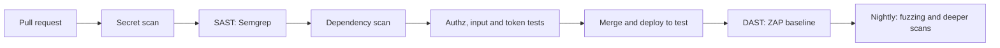
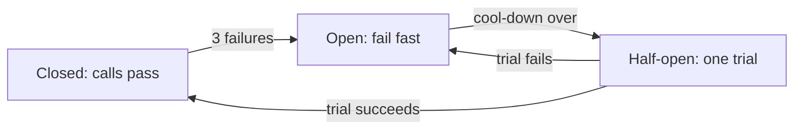

# Module 4 — Testing the qualities

*A feature can pass every functional test and still fail the people who use it: the screen that takes six seconds on payday, the transfer another customer can read, the retry that debits twice, the backup nobody can restore. These are quality characteristics (ISO/IEC 25010 calls them performance efficiency, security, reliability and more), and customers feel them only when they fail. This module teaches how to test them at Najm Bank. First comes performance: load, stress, soak and spike tests, percentiles and service level objectives, and the pitfalls that make a load test lie. Then security from a tester's chair: authorisation matrices, hostile input, token and rate-limit tests, scanners in a pipeline, and fuzzing, all aimed at the course's sample system and nothing else. Last, reliability and data: fault injection, retries and circuit breakers, chaos experiments, restore drills, safe migrations and data-quality checks for the regulatory reporting pipeline. You will follow Nada as a one-line load test teaches her what an average hides, as a clean scan misses what a two-user test finds, and as a lost reply reveals a double debit. AI runs through all three lessons: agents write code that works yet scales, authorises and retries badly, and asking "could this test fail?" keeps both the agent and the tests honest.*

> **Focus:** Performance, Security, Reliability — testing the qualities that users feel only when they fail: how fast and how steady the system is under load, who may do what to whose data, and what survives a fault, a bad deploy or a restore.

---

# 4.1 — Performance testing: load, stress, soak and spike, percentiles and SLOs
*Level: 🟡 Intermediate* · *Prerequisites: 2.1, 3.1* · *Focus: Performance*

## ⚡ In 60 seconds
- A **performance test** asks one question about speed or capacity under a stated load: "Do 95 % of balance requests finish within 300 ms at payday traffic?" No number, no test.
- Pick the type by the question: **smoke**, **load**, **stress**, **spike** or **soak**.
- Report **percentiles**, throughput, error rate and saturation; an average hides the customers who suffer.
- Biggest trap: a test that lies (coordinated omission, cold starts, an overloaded generator, tiny data).
- Test only systems you own.

## 🧭 Why it matters
Before payday, Nada's first performance test is 50 virtual users calling `GET /health` for a minute from her laptop. Average 4 ms: "performance OK". Rashid asks which endpoint customers use, what the payday arrival rate is, and what the p99 is. Nada can answer none.

Two weeks later the new statement screen answers in 80 ms in QA, but on payday its production p99 passes six seconds: it runs one query per row, and QA holds 20 transfers per customer where production holds thousands.

## 📐 How it works

### 🟢 The essentials

**Types of performance test.**

| Type | The question it answers | Shape of the load |
|---|---|---|
| **Smoke** | Does the script work and the system answer? | A few users, 30 s, every pull request |
| **Load** | Is the target met at expected traffic? | Steady expected peak, 10 to 30 min |
| **Stress** | Where is the limit; what breaks first? | Ramp up until errors or latency cross the line |
| **Spike** | Do we survive a sudden surge and recover? | Several times normal for minutes |
| **Soak** | Does it stay healthy for hours (leaks, full disks)? | Normal load, 4 to 24 hours |

**Goals and SLOs.** A testable goal names a metric, percentile, load and number: "p95 of `GET /accounts/{id}/balance` under 300 ms and p99 under 800 ms at 100 requests per second, errors under 1 %". The **SLI** (service level indicator) is what you measure, the **SLO** (objective) the target; the test makes it a pass/fail **threshold**, as strict as production's ([*Cloud & DevOps*, lesson 5.2 — SLOs, error budgets, alerting and on-call that people can sustain](../cloud/index.html#/5.2)).

**Percentiles, not averages.** The **p99** is the time 99 % of requests are at or below. Of 1,000 requests, 980 take 100 ms and 20 take 5 seconds. The mean is 198 ms and p95 is 100 ms, both "healthy"; p99 is 5,000 ms, so at 100 requests per second two customers every second wait five seconds. Never average percentiles across servers; merge the samples. Read latency beside **throughput**, **error rate** and **saturation** (how full the CPU, pool or queue is): a server answering `500` in 2 ms looks fast.

```text
Weak:   assert mean_latency < 200 ms               # passes on the data above
Strong: assert p99 < 800 ms and error_rate < 1 %   # fails on the same data
```

### 🟡 Going deeper

**Workload modelling.** In a **closed model** a fixed set of virtual users each send a request, wait, pause and repeat; when the system slows, the users slow with it, so the test eases off just when it should push. In an **open model** requests arrive at a set rate whether or not earlier ones finished, as the public's do, so slowness makes work queue. Najm Mobile is open. **Think time** is the pause while a person reads the screen; without it 100 virtual users hit the system far harder than 100 people would. Take the busiest hour's arrival rate and request mix from production logs, add headroom, and use production-shaped, masked data.

**A load generator you can read.** This open-model generator (`asyncio` and `httpx`) times each request from its *intended* start, drops a warm-up and exits non-zero when the SLO is breached. Save it as `perf/loadtest.py` in a copy of `testing/sample`.

```python
# perf/loadtest.py
import asyncio, math, sys, time

import httpx

A = {"Authorization": "Bearer token-alice"}
BODY = {"from_account": "acc-1", "to_account": "acc-2", "amount": "1.00", "currency": "QAR", "kind": "domestic"}


def pct(values, p):                                    # nearest-rank percentile
    s = sorted(values)
    return s[max(0, math.ceil(p / 100 * len(s)) - 1)]


async def visit(client, i, intended, out):
    sent = time.perf_counter()
    try:
        if i % 5:                                      # four balance checks for every transfer
            r = await client.get("/accounts/acc-1/balance", headers=A)
        else:
            r = await client.post("/transfers", json=BODY, headers={**A, "Idempotency-Key": f"load-{i}"})
        ok = r.status_code in (200, 201)
    except httpx.HTTPError:
        ok = False
    done = time.perf_counter()    # timed from the INTENDED start, as the customer lived it; lag: how late we were
    out.append(dict(ok=ok, intended=done - intended, lag=sent - intended))


async def run(rate, seconds, warmup=3):
    out, tasks = [], []
    async with httpx.AsyncClient(base_url="http://127.0.0.1:8000", timeout=10,
                                 limits=httpx.Limits(max_connections=500)) as client:   # the pool must not be the cap
        t0 = time.perf_counter()
        for i in range(rate * (warmup + seconds)):
            intended = t0 + i / rate                   # open model: the schedule ignores replies
            await asyncio.sleep(max(0, intended - time.perf_counter()))
            sink = [] if i < rate * warmup else out    # warm-up requests are sent, then dropped
            tasks.append(asyncio.create_task(visit(client, i, intended, sink)))
        await asyncio.gather(*tasks)
    return out


if __name__ == "__main__":
    rate, seconds = int(sys.argv[1]), int(sys.argv[2])
    out = asyncio.run(run(rate, seconds))
    ms = lambda key, p: 1000 * pct([r[key] for r in out], p)
    errors = sum(not r["ok"] for r in out) / len(out)
    print(f"requests={len(out)} errors={errors:.2%} target={rate}/s")
    for key in ("intended", "lag"):
        print(f"{key:>9}: p50={ms(key, 50):7.1f} p95={ms(key, 95):7.1f} p99={ms(key, 99):7.1f} ms")
    mean = sum(r["intended"] for r in out) / len(out)
    print(f"Little's Law: {rate}/s x {1000 * mean:.1f} ms = {rate * mean:.1f} requests in flight")
    ok = ms("intended", 95) <= 100 and ms("intended", 99) <= 250 and errors <= 0.01      # the SLO
    print("SLO:", "PASS" if ok else "FAIL")
    sys.exit(0 if ok else 1)
```

Start the API (`uvicorn najm.api:app --port 8000`), run `python perf/loadtest.py 200 15`. On a laptop (yours will differ):

```text
requests=3000 errors=0.00% target=200/s
 intended: p50=    3.7 p95=    5.8 p99=   10.0 ms
      lag: p50=    0.8 p95=    1.2 p99=    2.1 ms
Little's Law: 200/s x 4.0 ms = 0.8 requests in flight
SLO: PASS
```

**Little's Law and the knee.** For a stable system **L = λW**: requests in the system (L) equal the arrival rate (λ) times the time each spends there (W). The same law sets a ceiling: 6 database connections, each held 30 ms, finish at most 6 / 0.03 = 200 requests per second. Save this wrapper as `pooled_app.py`, serve it with `uvicorn pooled_app:app --port 8000`, and sweep the rate.

```python
# pooled_app.py: the sample API behind a pretend database pool
import asyncio, os

from najm.api import create_app

POOL = int(os.getenv("POOL", "4"))
app, slots = create_app(), asyncio.Semaphore(POOL)    # POOL connections...


@app.middleware("http")
async def pretend_database(request, call_next):
    async with slots:
        await asyncio.sleep(0.04)                      # ...each held for 40 ms
        return await call_next(request)
```

At 40 and 80 requests per second p95 stayed near 48 ms, with about 1.9 and 3.7 requests in flight (the pool holds 4). At 100 per second p50 jumped from about 46 ms to over a second, with over a hundred requests in flight. Nothing is wrong with the code; the pool cannot finish what arrives, so waiting grows as long as the test runs. Below the **knee** latency is flat, above it latency explodes: a stress test finds it, a load test proves you stay clear of it.

**Pitfalls that make numbers lie.**
- **Coordinated omission** (Gil Tene's term). A closed-loop tool waits for a slow reply before sending the next request, so it never records the requests that *should* have gone out during the stall. Picture a service that normally replies in 10 ms and freezes for two seconds, and a client that plans a request every 20 ms for 8 s. Timed from the send, one request in 400 is slow (p99 10 ms); timed from the planned moment, as customers lived it, about 200 waited (p99 nearly two seconds), because the client needs about 200 requests to catch up. Exercise 🟡 simulates it. Our generator times from the plan; k6's arrival-rate executors start iterations on a clock and report the ones they could not start as `dropped_iterations`.
- **Cold caches, JIT, pools.** Early requests meet empty caches and unopened connections. Drop a warm-up.
- **The generator as bottleneck.** On one laptop the sample ran cleanly at 400 requests per second, but at 600 `lag` passed three seconds: the tool could not send on schedule, so the numbers described the tool. Watch `lag` (k6: `dropped_iterations`) and CPU.
- **Unrealistic data.** Twenty rows per customer hides N+1; one hot account hides cache misses.
- **Shared environments.** If another team runs a batch on QA mid-test, you measured their job.

**The same test in k6.** k6 (Grafana Labs) is a Go program that runs your JavaScript test script, with thresholds and scenarios built in; it is not Node.js, so Node APIs are missing. This script follows its documentation and **was not executed**; run it at smoke size first.

```javascript
// perf/k6/transfers.js
// Smoke: k6 run perf/k6/transfers.js   Nightly: add -e BASE_URL=... -e RATE=50 -e DURATION=20m
import http from 'k6/http';
import { sleep } from 'k6';

const BASE = __ENV.BASE_URL || 'http://127.0.0.1:8000';
const AUTH = { Authorization: 'Bearer token-alice' };
const rate = Number(__ENV.RATE || 5);

export const options = {
  scenarios: {
    steady: { executor: 'constant-arrival-rate', exec: 'visit', rate, timeUnit: '1s',   // an OPEN model
              duration: __ENV.DURATION || '30s', preAllocatedVUs: rate * 3, maxVUs: rate * 6 },  // VUs: Little's Law
  },
  thresholds: {                                          // the SLO; k6 exits non-zero if one is crossed
    'http_req_duration{endpoint:balance}': ['p(95)<300', 'p(99)<800'],
    'http_req_duration{endpoint:transfer}': ['p(95)<500', 'p(99)<1200'],
    http_req_failed: ['rate<0.01', { threshold: 'rate<0.05', abortOnFail: true, delayAbortEval: '30s' }],
  },
};

export function visit() {
  http.get(`${BASE}/accounts/acc-1/balance`, { headers: AUTH, tags: { endpoint: 'balance' } });
  sleep(1 + Math.random() * 3);                          // think time: the customer reads the screen
  if (Math.random() < 0.2) {
    const body = JSON.stringify({ from_account: 'acc-1', to_account: 'acc-2', amount: '1.00', currency: 'QAR', kind: 'domestic' });
    const headers = { ...AUTH, 'Content-Type': 'application/json', 'Idempotency-Key': `${__VU}-${__ITER}-${Date.now()}` };
    http.post(`${BASE}/transfers`, body, { headers, tags: { endpoint: 'transfer' } });
  }
}
```

The nightly 4× spike is a second scenario with the `ramping-arrival-rate` executor; size its `maxVUs` by Little's Law (4× the rate at about 2.6 s per iteration needs about 10× the rate in VUs).

### 🔴 Expert view

**Reading results.** Trust the run before its numbers: is `lag` small, the generator's CPU free, are errors near zero, the warm-up dropped, the data realistic? Only then compare p95 and p99 with the SLO and look for the knee, the first saturated resource and, in a soak, drift.

**Performance tests in CI.** The smoke job starts the API and runs `python perf/loadtest.py 20 10`; it catches 10× regressions, not 10 % ones. The nightly job runs the k6 profile against staging. Shared runners are noisy: compare with a baseline from the same job.

**Web performance budgets.** Google's **Core Web Vitals**, judged at the 75th percentile of real page loads, are **LCP** (Largest Contentful Paint, good is 2.5 s or less), **INP** (Interaction to Next Paint, which replaced First Input Delay in March 2024, good is 200 ms or less) and **CLS** (Cumulative Layout Shift, good is 0.1 or less). **Lighthouse** audits a page in a lab; a standard page-load audit has no interactions, so it cannot measure INP and reports Total Blocking Time as a proxy. Lighthouse CI asserts budgets in a pipeline (not run here); in Chromium, Playwright can read LCP and CLS through `PerformanceObserver`. On the sample's `/app` page LCP was under 100 ms, so a 2,500 ms budget could never fail: a lab budget is a *regression alarm* several times today's value (we used 500 ms). A 600 px banner injected 300 ms late pushed CLS to 0.112 and failed the 0.1 budget (exercise 🟢).

**Database N+1 detection by counting queries.** An N+1 reads a list, then runs one more query per row. On a laptop each statement takes 0.1 ms, so a timing test passes; in production each is a network round trip. Count statements, and assert the count does not grow with page size. SQLite's `set_trace_callback` shows each one; Django has `assertNumQueries`.

```python
# tests/test_statement.py
import sqlite3

import pytest


def make_db(rows):
    db = sqlite3.connect(":memory:")
    db.executescript("CREATE TABLE people (id INTEGER PRIMARY KEY, name TEXT);"
                     "CREATE TABLE transfers (id INTEGER PRIMARY KEY, person_id INTEGER);")
    for i in range(1, rows + 1):
        db.execute("INSERT INTO people VALUES (?, ?)", (i, f"Recipient {i}"))
        db.execute("INSERT INTO transfers (person_id) VALUES (?)", (i,))
    return db


def slow(db, n):                      # one query for the list, then one per row
    rows = db.execute("SELECT id, person_id FROM transfers ORDER BY id DESC LIMIT ?", (n,)).fetchall()
    return [(t, db.execute("SELECT name FROM people WHERE id = ?", (p,)).fetchone()[0]) for t, p in rows]


def fast(db, n):                      # one JOIN
    return db.execute("SELECT t.id, p.name FROM transfers t JOIN people p ON p.id = t.person_id "
                      "ORDER BY t.id DESC LIMIT ?", (n,)).fetchall()


def queries(fn, n):
    db, seen = make_db(60), []
    db.set_trace_callback(lambda sql: seen.append(sql) if sql.startswith("SELECT") else None)
    assert len(fn(db, n)) == n
    return len(seen)


@pytest.mark.parametrize("fn", [slow, fast])
def test_weak_right_rows(fn):         # passes for both: SQLite in memory is quick
    assert len(fn(make_db(60), 50)) == 50


@pytest.mark.parametrize("fn", [slow, fast])
def test_strong_query_count_does_not_grow_with_page_size(fn):    # MEANT TO FAIL for slow
    assert queries(fn, 50) == queries(fn, 5)
```

```text
FAILED tests/test_statement.py::test_strong_query_count_does_not_grow_with_page_size[slow]
E       assert 51 == 6
```

**AI-era notes.** Coding agents write code that works and scales badly: N+1 queries, unbounded lists, a lock held across a network call. Ask for the query count and p95 under standard load, not "it works". AI-written load scripts tend to be closed-model, one endpoint, no think time. LLM features add **time to first token**, **tokens per second** and cost per request (lesson 7.1 gates them; set a spending cap first). Load only systems you own or may test in writing: elsewhere, load is an attack.


## 🧰 The toolkit
| Tool, practice or technique | What it is and does | When to reach for it |
|---|---|---|
| **k6** (Grafana Labs) | JavaScript scripts, thresholds, scenarios | API load tests in CI |
| **Locust** | Plain-Python behaviour; less load per process | Python teams; complex flows |
| **Apache JMeter** | GUI, many protocols; XML plans are hard to review | Existing estates; non-HTTP |
| **Gatling** | Efficient, JVM stack (**Artillery**: lighter, YAML) | High load, few machines |
| **Percentile thresholds** | An SLO as pass or fail: p95, p99, errors | Every performance test |
| **Little's Law** | L = λW: in flight = rate × time | Sizing virtual users, pools |
| **Lighthouse and Core Web Vitals** | Lab audits; field LCP, INP, CLS | Pages with a budget |
| **Query counting** | Assert statements per request | Catching N+1 before production |

## 🏛️ In practice at Najm Bank
Bilal and Maha publish the **Najm Performance Test Plan v1**, a template each test completes before it runs. The Transfers plan:

| Field | Transfers, payday morning |
|---|---|
| Question, environment | Do we meet the SLO at expected peak, and where is the knee? Staging, booked; masked copy, 2 million accounts |
| Workload | Open model; 80 % balance, 15 % statement, 5 % transfer; think time 1 to 4 s |
| Load profile | 3 min warm-up, 20 min at peak; nightly adds a 4× spike |
| Pass and stop | p95 ≤ 300 ms, p99 ≤ 800 ms, errors < 1 %; abort if errors pass 5 % after the first 30 s |

Smoke and query-count tests run on every pull request, the k6 profile nightly, a four-hour soak before releases.

## 🛠️ Exercises
Work in a copy of `testing/sample`.

- 🟢 **Budget a page.** Write a Playwright test for `/app` that collects LCP and CLS with `PerformanceObserver`s set up in `page.addInitScript`, polls with `expect.poll` until LCP is above zero, and asserts LCP under 500 ms and CLS under 0.1. Then use `page.route('**/app', …)` to inject a 600 px `div` 300 ms after load. *Done when:* the plain page passes and the banner page fails on CLS.
- 🟡 **Find the knee.** Run `pooled_app.py`, predict its maximum rate with Little's Law, and sweep the generator in steps of 10 until p95 doubles. Then simulate the two-second freeze with a simulated clock, timing it both ways. *Done when:* the prediction is within 15 % of the measured knee and your two p99s differ as described.
- 🔴 **Guard in process.** Write a pytest that sends 300 requests each to `/health` and the balance endpoint through `httpx.ASGITransport(app=create_app())`, drops a warm-up, asserts every status is 200, and requires the balance p95 under the larger of 5 ms and five times the health p95. *Done when:* it passes 10 clean runs and fails after you add a 20 ms sleep to the balance endpoint in your copy.

## ⚠️ Mistakes and traps
- **Averages only.** A 198 ms mean hid a 5 s p99. Gate on p95, p99 and errors.
- **Latency without errors.** Fast `500`s look quick. Check statuses.
- **A closed loop for a public service.** Use arrival rates.
- **Tiny data.** Twenty rows hide N+1. Use production-shaped, masked data.
- **Over-testing.** A page five staff use needs a query-count test, not a load test.

## 🧾 Recap
- A performance test is a question with a number: type, load, SLO threshold.
- Percentiles, throughput, errors and saturation describe a run; the mean hides customers.
- Little's Law (L = λW) sizes pools and virtual users and predicts the knee.
- Distrust a run until generator lag, errors, warm-up and data are checked.

## ✍️ Check yourself

**1. A load test reports a mean of 120 ms and "all green". The p99 is 4 seconds. What is the correct reading?**

- A. At least one request in a hundred waits four seconds or longer
- B. The mean is wrong, because averages cannot be measured reliably
- C. The system is healthy, because the mean is well inside the SLO
- D. The p99 is an outlier and can safely be ignored

<details><summary>Answer</summary>

**A.** 99 % of requests finish within the p99, so the slowest 1 % wait four seconds or more; a low mean hides them. (🟢 The essentials.)

</details>

**2. Bilal's script runs 100 virtual users against Najm's staging API, each sending its next request when the last reply arrives. The service freezes for ten seconds. What is recorded?**

- A. A fair picture, because every request that was sent is recorded
- B. A few slow samples, and none for requests never sent
- C. Thousands of failed requests that push the p99 sky-high
- D. Nothing, because it aborts on the first slow reply

<details><summary>Answer</summary>

**B.** Each user waits for its stuck reply and sends nothing new: coordinated omission. (🟡 Going deeper.)

</details>

**3. A service has 8 database connections, and each request holds one for 50 ms. Roughly what is its highest steady throughput, however fast the CPU?**

- A. About 400 requests per second
- B. About 160 requests per second
- C. About 8 requests per second
- D. About 20 requests per second

<details><summary>Answer</summary>

**B.** 8 connections / 0.05 s = 160 per second (Little's Law). (🟡 Going deeper.)

</details>

**4. A statements endpoint is fast in QA but slow in production, where customers have thousands of transfers. It runs one query per row. Which test catches this?**

- A. A timing test that fails if the endpoint takes over a second in QA
- B. A unit test that checks the returned rows
- C. A test that the query count stays flat as page size grows
- D. A smoke test that sends one request and expects a 200

<details><summary>Answer</summary>

**C.** On tiny QA data timing hides N+1; counting statements at two page sizes exposes it. (🔴 Expert view.)

</details>

**5. A nightly load test on shared staging misses its p95 threshold by 12 %, and another team's data export ran in the same window. What should Nada do first?**

- A. Raise the threshold by 15 % so the nightly run goes green
- B. Rerun until it passes and keep the best result
- C. Open a defect against the Transfers team at once
- D. Rerun in a quiet window to see whether the miss repeats

<details><summary>Answer</summary>

**D.** A competing job can explain the miss; repeat the run without it before blaming code or loosening the gate. (🟡 Going deeper.)

</details>

## 📚 References
- Grafana k6 documentation — https://grafana.com/docs/k6/latest/
- Apache JMeter — https://jmeter.apache.org/
- Google SRE resources on service level objectives — https://sre.google/
- Python `asyncio` and `sqlite3` — https://docs.python.org/3/
- Playwright documentation — https://playwright.dev/
- J. D. C. Little, "A Proof for the Queuing Formula: L = λW", *Operations Research*, 1961
- Gil Tene, "How NOT to Measure Latency" (conference talk)

---

# 4.2 — Security testing for testers: OWASP, SAST, DAST, dependency scanning, fuzzing and authorisation tests
*Level: 🟡 Intermediate* · *Prerequisites: 3.1, 4.1* · *Focus: Security*

## ⚡ In 60 seconds
- Testers add what scanners cannot: **abuse cases**, **authorisation matrices** (who may do what to whose data), hostile and generated input, and a regression test for every vulnerability.
- **SAST** reads code, **SCA** reads dependencies, **DAST** attacks a running app, **fuzzing** feeds generated input; each sees something different.
- The best hour is an authorisation test: broken access control is first in the OWASP Top 10 (2021 edition).
- Scanners give leads, not verdicts: block on new, high-confidence findings; triage the rest.
- Biggest trap: "the scanner was green, so it is secure".
- Scope and written permission first; here, attack only the sample system, on your own machine.

## 🧭 Why it matters
Nada runs the OWASP ZAP baseline scan on the Transfers API and reports "no findings". Bilal asks: "Did you ever ask for Alice's transfer with Bob's token?" She did not. The scanner has no idea that `tr-0001` belongs to Alice, so a flaw where any signed-in user reads any transfer is invisible to it. Only a test that knows who owns what can fail.

## 📐 How it works

### 🟢 The essentials

**What testers add.** Developers ask how a feature should work; attackers ask how to make it misbehave. Testers write the second list as **abuse cases** ("as Bob I change the id in the URL", "as a script I replay a captured transfer"), turn each into a test that must fail safely, and keep it as a regression test. They also own what no scanner can produce: the expected answer for every role and object.

**The OWASP Top 10 as a source of test ideas.** The OWASP Top 10 is a widely used list of web risks. These are the 2021 names; a newer edition may be current when you read this, so check owasp.org and keep the method: one test idea per category.

| Category | A test idea on Transfers |
|---|---|
| A01 Broken Access Control | Bob reads Alice's transfer or sends from `acc-1`; change every id in every URL |
| A02 Cryptographic Failures | Reachable over plain HTTP? Tokens or account numbers in logs and error text? |
| A03 Injection | Quotes, markup and oversize strings in every field; SQL built from strings |
| A04 Insecure Design | Replay a captured request; race two identical ones; split a limit-busting transfer |
| A05 Security Misconfiguration | Debug pages, default credentials, open API docs in production, missing headers |
| A06 Vulnerable and Outdated Components | Dependency scan on every build; does a package an AI suggested really exist? |
| A07 Identification and Authentication Failures | Expired, forged and wrong-audience tokens; rate limits on login |
| A08 Software and Data Integrity Failures | Tampered tokens, unsigned artefacts and updates |
| A09 Security Logging and Monitoring Failures | A refused transfer leaves an audit record, without the token in it |
| A10 Server-Side Request Forgery | Any feature that fetches a user-supplied URL (none in the sample) |

**Two checklists.** The **OWASP Application Security Verification Standard (ASVS)** lists security requirements at three verification levels: use it to decide what "secure enough" means. The **OWASP Web Security Testing Guide (WSTG)** describes how to test each area, from authentication to business logic: use it to design tests.

**Scope and permission.** Security testing without authorisation is an attack. Test only systems you own or have **written permission** to test, inside an agreed scope and window, with synthetic data. Every example here targets the course's sample system on your own machine.

### 🟡 Going deeper

**An authorisation matrix.** List every role against every object and write the expected answer from the *requirement*, before reading the code. The weak test is Alice reading her own transfer: it passes with the bug on. The matrix tests every cell, so the bug has nowhere to hide ([*Secure AI & Application Security*, lesson 3.3 — Authorisation: broken access control, IDOR and multi-tenancy](../secai/index.html#/3.3)). Save it in a copy of `testing/sample`:

```python
# tests/test_authz_matrix.py
import uuid

import pytest
from fastapi.testclient import TestClient

from najm.api import create_app

TOKEN = {"anonymous": None, "forged": "token-mallory", "alice": "token-alice", "bob": "token-bob"}


def send(source, target):
    return {"from_account": source, "to_account": target, "amount": "10.00", "currency": "QAR", "kind": "domestic"}


def call(client, who, method, path, body=None):
    headers = {"Idempotency-Key": str(uuid.uuid4())}
    if TOKEN[who]:
        headers["Authorization"] = f"Bearer {TOKEN[who]}"
    return client.request(method, path, json=body, headers=headers)


# Expected statuses come from "customers see and use only their own money". Columns: anonymous, forged, alice, bob.
MATRIX = {
    "alice's balance":  (("GET", "/accounts/acc-1/balance", None), [401, 401, 200, 403]),
    "bob's balance":    (("GET", "/accounts/acc-2/balance", None), [401, 401, 403, 200]),
    "alice's transfer": (("GET", "/transfers/tr-0001", None), [401, 401, 200, 403]),
    "bob's transfer":   (("GET", "/transfers/tr-0002", None), [401, 401, 403, 200]),
    "send from acc-1":  (("POST", "/transfers", send("acc-1", "acc-2")), [401, 401, 201, 403]),
    "send from acc-2":  (("POST", "/transfers", send("acc-2", "acc-1")), [401, 401, 403, 201]),
}
CASES = [pytest.param(who, *request, expected, id=f"{who}-{name}")
         for name, (request, column) in MATRIX.items() for who, expected in zip(TOKEN, column)]


@pytest.fixture
def client():                           # fresh app; tr-0001 is Alice's transfer, tr-0002 is Bob's
    c = TestClient(create_app(), raise_server_exceptions=False)
    assert call(c, "alice", "POST", "/transfers", send("acc-1", "acc-2")).status_code == 201
    assert call(c, "bob", "POST", "/transfers", send("acc-2", "acc-1")).status_code == 201
    return c


@pytest.mark.parametrize("who, method, path, body, expected", CASES)
def test_who_may_do_what(client, who, method, path, body, expected):
    assert call(client, who, method, path, body).status_code == expected


def test_every_route_has_a_row(client):          # a new endpoint turns this red until someone decides
    assert set(client.app.openapi()["paths"]) == {"/accounts/{account_id}/balance", "/transfers/{transfer_id}",
                                                  "/transfers", "/health", "/app"}
```

All 25 cases pass on the clean sample. With the seeded bug, exactly the two cross-user reads fail:

```text
$ NAJM_BUGS=bola pytest tests/test_authz_matrix.py
FAILED test_who_may_do_what[bob-alice's transfer]
FAILED test_who_may_do_what[alice-bob's transfer]
2 failed, 23 passed
```

One design question remains: `403` for someone else's transfer but `404` for a missing one lets anyone count transfers by sequential id. Returning `404` for both is a product decision, not an automatic bug.

**Hostile input, safely.** Send inert strings that only matter to code that mishandles input, one field at a time, and assert a clean refusal. Use a client that reports crashes as the `500` a customer would see:

```python
# tests/test_input_validation.py
import uuid

import pytest
from fastapi.testclient import TestClient

from najm.api import create_app

GOOD = {"from_account": "acc-1", "to_account": "acc-2", "amount": "10.00", "currency": "QAR", "kind": "domestic"}
HOSTILE = {"sql quote": "x' OR '1'='1", "markup": "<script>alert(1)</script>", "traversal": "../../etc/passwd",
           "nul byte": "acc-1\x00", "newline": "acc-1\r\nX-Injected: yes", "long": "A" * 10_000, "rtl": "‮acc-1"}
client = TestClient(create_app(), raise_server_exceptions=False)


def post(**overrides):
    headers = {"Authorization": "Bearer token-alice", "Idempotency-Key": str(uuid.uuid4())}
    return client.post("/transfers", json={**GOOD, **overrides}, headers=headers)


@pytest.mark.parametrize("field", ["from_account", "to_account", "currency", "kind", "amount"])
@pytest.mark.parametrize("payload", HOSTILE.values(), ids=HOSTILE.keys())
def test_hostile_input_is_refused_cleanly(field, payload):
    r = post(**{field: payload})
    assert 400 <= r.status_code < 500                              # refused: never accepted, never a crash
    assert "Traceback" not in r.text                               # and no stack trace leaks


def test_markup_is_not_echoed_back():                              # MEANT TO FAIL on the sample
    assert "<script>" not in post(kind=HOSTILE["markup"]).text
```

The 35 refusal cases pass; the last test fails, a real low-severity finding: `kind` is echoed into the error message (`unsupported_kind: <script>alert(1)</script>`). Harmless in JSON, but a client rendering messages as HTML would run it; the fix: no raw input in messages. For SQL, unit-test the code that builds queries: `"acc-1' OR '1'='1"` must return no rows, which an f-string query fails and a parameterised one (`WHERE from_account = ?`) passes; a static rule finds the pattern earlier (below).

**Tokens and sessions.** The sample's fake tokens never expire, so test the verifier that fronts a real API. This one uses PyJWT (`pip install pyjwt`) and pins algorithm, issuer, audience and required claims.

```python
# tokens.py
import jwt   # PyJWT

KEY, ISSUER, AUDIENCE = "test-only-signing-key-0123456789abcdef", "najm-login", "najm-mobile-api"


def verify(token):
    return jwt.decode(token, KEY, algorithms=["HS256"], issuer=ISSUER, audience=AUDIENCE,
                      options={"require": ["exp", "iss", "aud", "sub"]})
```

```python
# tests/test_tokens.py
import time

import jwt
import pytest

from tokens import AUDIENCE, ISSUER, KEY, verify


def make(key=KEY, algorithm="HS256", **changes):
    claims = {"sub": "alice", "iss": ISSUER, "aud": AUDIENCE, "exp": int(time.time()) + 300, **changes}
    return jwt.encode({k: v for k, v in claims.items() if v is not None}, key, algorithm=algorithm)


def test_a_good_token_is_accepted():
    assert verify(make())["sub"] == "alice"


# Each bad token must fail for ITS OWN reason; `raises(jwt.InvalidTokenError)` would also pass an
# "expired" token that was really rejected for a typo in its signature.
BAD = {
    "expired": (make(exp=int(time.time()) - 60), jwt.ExpiredSignatureError),
    "wrong audience": (make(aud="najm-partner-api"), jwt.InvalidAudienceError),
    "wrong issuer": (make(iss="evil-login"), jwt.InvalidIssuerError),
    "forged signature": (make(key="another-signing-key-0123456789abcdef"), jwt.InvalidSignatureError),
    "alg none": (make(key=None, algorithm="none"), jwt.InvalidAlgorithmError),
    "never expires": (make(exp=None), jwt.MissingRequiredClaimError),
    "garbage": ("not-a-token", jwt.DecodeError),
}


@pytest.mark.parametrize("token, reason", BAD.values(), ids=BAD.keys())
def test_bad_tokens_are_refused_for_the_right_reason(token, reason):
    with pytest.raises(reason):
        verify(token)


def test_a_payload_swapped_onto_alices_signature_is_refused():
    header, _, signature = make().split(".")
    with pytest.raises(jwt.InvalidSignatureError):
        verify(f"{header}.{make(sub='bob').split('.')[1]}.{signature}")
```

All nine pass. We then swapped in a "temporary" `verify` whose only option is `{"verify_signature": False}`: seven of the nine failed, including the forged and the tampered token (PyJWT then skips expiry, audience and issuer checks too). Each failure needs its own test.

**Rate limits.** Test the control, not the idea. For 10 transfers a minute per customer: the 11th `POST /transfers` gets `429` with a `Retry-After` header and the usual error shape; Bob is unaffected when Alice is limited; changing `X-Forwarded-For` does not reset the counter; after the stated wait Alice can send again (inject a clock, never sleep); refused requests move no money. The sample has no limiter: exercise 🔴.

**Fuzzing.** A **fuzzer** feeds a program large amounts of generated, often malformed input and watches for crashes. Property-based testing is friendly fuzzing: Hypothesis (lesson 2.3) generates JSON bodies and the property is "no body makes the server fail".

```python
# tests/test_fuzz_transfers.py
import uuid

from fastapi.testclient import TestClient
from hypothesis import given, settings, strategies as st

from najm.api import create_app

client = TestClient(create_app(), raise_server_exceptions=False)
scalars = st.none() | st.booleans() | st.integers() | st.floats(allow_nan=False, allow_infinity=False) | st.text()
json_values = scalars | st.lists(scalars, max_size=3) | st.dictionaries(st.text(max_size=8), scalars, max_size=3)
bodies = st.builds(      # a valid body with ONE field replaced by any JSON value at all
    lambda field, value: {"from_account": "acc-1", "to_account": "acc-2", "amount": "10.00",
                          "currency": "QAR", "kind": "domestic", field: value},
    st.sampled_from(["from_account", "to_account", "amount", "currency", "kind"]), json_values)


@settings(max_examples=1000, deadline=None)
@given(body=bodies)
def test_no_request_body_makes_the_server_fail(body):          # MEANT TO FAIL on the sample
    r = client.post("/transfers", json=body, headers={"Authorization": "Bearer token-alice",
                                                      "Idempotency-Key": str(uuid.uuid4())})
    assert r.status_code < 500, f"server error for {body!r}"
```

```text
AssertionError: server error for {'from_account': 'acc-1', 'to_account': 'acc-2', 'amount': 1e+26, 'currency': 'QAR', 'kind': 'domestic'}
```

Hypothesis shrank the crash to the smallest failing amount, 10^26 (it may print as `1e+26` or an integer): `Decimal.quantize` raises an uncaught `InvalidOperation`, because the result needs more than the default 28 digits. Lesson 3.1 found the same defect with Schemathesis. Fix it to return `422`, then pin the shrunk body with `@example(...)` so it runs every time. **Coverage-guided** fuzzers mutate the inputs that reach new code: **libFuzzer** and **AFL++** for C and C++, **Atheris** for Python, **Jazzer** for the JVM; they often run for hours against a parser. Fuzz only what you own.

### 🔴 Expert view

**Scanners in a pipeline.** Each tool answers a different question, so use several, early and cheaply.



**SAST** (static analysis) reads source ([*Secure AI & Application Security*, lesson 6.1 — A secure development life cycle: requirements, review and testing (SAST, DAST, SCA)](../secai/index.html#/6.1)). A custom **Semgrep** rule costs a few lines; this one flags SQL built with an f-string, and `semgrep scan --config rules.yml --error .` exits non-zero on a finding, as a pipeline needs. On an `unsafe.py` with such a query (abridged):

```yaml
# rules.yml
rules:
  - id: najm-sql-built-with-fstring
    languages: [python]
    severity: ERROR
    message: SQL text is built with an f-string; pass values as parameters instead.
    pattern: $CUR.execute(f"...", ...)
```

```text
unsafe.py
   najm-sql-built-with-fstring
          SQL text is built with an f-string; pass values as parameters instead.
            5┆ return conn.execute(f"SELECT id FROM transfers WHERE from_account = '{account}'").fetchall()
Ran 1 rule on 1 file: 1 finding.
```

**SCA** (software composition analysis) checks dependencies against known-vulnerability databases: `pip-audit -r requirements.txt` and `npm audit`. At the time of writing both reported nothing on the sample (`No known vulnerabilities found`, `found 0 vulnerabilities`); results change as advisories appear, so run them on every build. **Secret scanning** (gitleaks, TruffleHog, or GitHub's secret scanning with push protection) searches commits for keys and tokens. **DAST** (dynamic analysis) attacks a running app from outside. The ZAP baseline scan is passive: it spiders for about a minute and is safe in a pipeline, against your own test deployment only (not executed here; `--network host` works on Linux):

```bash
docker run --rm --network host -v "$PWD:/zap/wrk:rw" -t ghcr.io/zaproxy/zaproxy:stable \
    zap-baseline.py -t http://127.0.0.1:8000 -r zap-report.html
```

Spidering finds little in a JSON API, so also aim the baseline at `/app`; `zap-api-scan.py -f openapi` tests the API itself and can attack actively: by arrangement only.

**Handling findings.** Block the merge on new, high-confidence findings, ticket the rest with an owner, and suppress a false positive only with a written reason. For every confirmed vulnerability add a **security regression test** named after the ticket (`test_sec_142_bob_cannot_read_alices_transfer`), written to fail first, then fixed.

**Reporting severity.** Report a finding like a bug (lesson 1.3), plus impact and who can exploit it. Severity (how bad) is not priority (how soon). **CVSS** is the common scoring scheme ([*Secure AI & Application Security*, lesson 1.3 — Rating and prioritising risk: likelihood, impact and CVSS](../secai/index.html#/1.3)).

**AI-era notes.** Coding agents pass happy-path tests while skipping authorisation checks, build SQL from strings, and sometimes suggest packages that do not exist; attackers can register such names, a risk widely called "slopsquatting". The matrix, the scanners and a check that every dependency is real catch these ([*Secure AI & Application Security*, lesson 6.3 — Securing AI-generated code: what coding agents get wrong](../secai/index.html#/6.3)). AI can brainstorm abuse cases, but write the expected column from requirements, never from the code; never paste secrets or real data into AI tools. Prompt-injection tests for LLM features: lessons 7.2, 7.3 and [*Secure AI & Application Security*, lesson 9.4 — AI red-teaming and security evaluation](../secai/index.html#/9.4).

## 🧰 The toolkit
| Tool, practice or technique | What it is and does | When to reach for it |
|---|---|---|
| **Authorisation matrix** | Roles × objects × expected status, written from requirements | Every feature with owned data |
| **OWASP Top 10, ASVS and WSTG** | Risk list, requirements standard, testing guide | Planning what to test |
| **Semgrep** | Static analysis with custom rules | Pull requests; team-specific bug patterns |
| **pip-audit and npm audit** | Dependency scans against known advisories | Every build |
| **Secret scanning** | Finds keys and tokens in code and history | Pre-commit and CI |
| **OWASP ZAP** | Open-source DAST proxy and scanner | Passive baseline in CI; deeper scans by arrangement |
| **Hypothesis as a fuzzer** | Generated JSON bodies, shrunk to the smallest failure | Any input boundary you own |
| **Coverage-guided fuzzers** | libFuzzer, AFL++, Atheris, Jazzer | Parsers and native code |

## 🏛️ In practice at Najm Bank
Noura's team and QE agree the **Najm Security Test Gate for a Feature**. Before a feature ships: an authorisation matrix for every route, hostile-input and token tests, SAST, SCA and secret scans green or triaged, a ZAP baseline on the test deployment, and a fuzz test per input boundary. Each finding uses this template:

| Field | Example |
|---|---|
| Title, location | Error message echoes raw input; `POST /transfers`, field `kind` |
| Evidence | The test `test_markup_is_not_echoed_back`; response body |
| Impact, who | Script runs if a client renders the message as HTML; any caller |
| Severity (CVSS, if scored) | Low; owner and fix-by date set by Noura |
| Regression test | Added, named after the ticket |

## 🛠️ Exercises
Use only your own copy of `testing/sample`.

- 🟢 **Widen the matrix.** Add rows for `GET /accounts/acc-3/balance` and a send from `acc-3` (Alice's EUR account), with expectations written first (give `send` a currency). *Done when:* the clean sample passes and `NAJM_BUGS=bola` still fails exactly two cells.
- 🟡 **Fuzz, fix, pin.** Run the fuzz test, fix `check_transfer` so absurd amounts return `422`, and pin the shrunk body with `@example`. Moving the maximum check first is not enough: Hypothesis then finds `-1e+26`. Also stop `kind` being echoed. *Done when:* the fuzz test and `test_markup_is_not_echoed_back` pass, and both fail again on the original code.
- 🔴 **Build and break a rate limit.** In your copy, add middleware that allows 10 `POST /transfers` per bearer token per minute, with an injectable clock, and write the five tests from the rate-limit paragraph. *Done when:* all pass, and keying the limit on `X-Forwarded-For` makes at least two fail.

## ⚠️ Mistakes and traps
- **"The scanner was green."** Scanners do not know your business rules. Add the matrix.
- **Testing only as the owner.** Alice reading Alice's data proves nothing. Use a second user.
- **`raises(AnyError)`.** A token rejected for the wrong reason still passes. Assert the specific error.
- **Expected values copied from the code.** The matrix then agrees with the bug. Write them from requirements.
- **Scanning what you do not own.** Get written permission, or stop.

## 🧾 Recap
- Testers add abuse cases, authorisation matrices, hostile and generated input, and a regression test per vulnerability.
- The OWASP Top 10 gives ideas, ASVS requirements and the WSTG method.
- SAST, SCA, secret scanning, DAST and fuzzing each see something different; triage, do not just count.
- Test tokens one failure at a time, and rate limits as behaviour. Permission and scope come first.

## ✍️ Check yourself

**1. Nada's ZAP baseline scan of the Transfers API reports no findings, yet Bob can read Alice's transfers. Why did the scan miss it, and what finds it?**

- A. The scan was too short; a longer scan would find it
- B. It cannot know who owns what; a two-user authorisation test can
- C. The scanner only checks the front end; a browser test would find it
- D. The flaw is in a dependency; an SCA scan would find it

<details><summary>Answer</summary>

**B.** Ownership is a business rule, so only a test with two users and known owners can fail. (🟡 Going deeper.)

</details>

**2. A test sends an expired token and asserts `pytest.raises(jwt.InvalidTokenError)`. It passes even though the test token was signed with the wrong key. Which change proves the expiry check ran?**

- A. Delete the test, because the token library is already tested
- B. Sign every test token with the right key and keep the assertion
- C. Assert only that no data came back in the response
- D. Assert `jwt.ExpiredSignatureError`, not the generic error

<details><summary>Answer</summary>

**D.** `InvalidTokenError` covers every failure, so the wrong key satisfies it; the specific error proves the expiry check ran. (🟡 Going deeper.)

</details>

**3. Semgrep flags 40 findings in a legacy repository, 2 of them new SQL-injection patterns in this pull request. What is the sensible policy?**

- A. Block on the new high-confidence findings; ticket the rest
- B. Block every merge until all 40 are fixed
- C. Disable the rule, since legacy findings make it noisy
- D. Merge now and let the nightly DAST scan catch real problems

<details><summary>Answer</summary>

**A.** Blocking only new, high-confidence findings keeps the gate trusted while the backlog shrinks. (🔴 Expert view.)

</details>

**4. Hypothesis fails a fuzz test and shrinks the body to `amount: 1e+26`, which returns HTTP 500. What should the tester do next?**

- A. Wrap the endpoint so every error returns 200 with an empty body
- B. Raise the number of examples in case the failure was a fluke
- C. Fix it to return 422, pin the body with `@example`, and rerun
- D. Mark the test as expected to fail and move on

<details><summary>Answer</summary>

**C.** A shrunk counterexample is a minimal reproduction: fix it, then pin it so it runs every time. (🔴 Expert view.)

</details>

**5. A colleague suggests a full ZAP active scan of another squad's staging environment on Friday evening, "because it is only staging". What must happen first?**

- A. Run it at lower intensity so nobody notices
- B. Get written permission, and agree the scope and window
- C. Run it from a personal laptop so the traffic is not traced to QE
- D. Tell the squad by chat once the scan has started

<details><summary>Answer</summary>

**B.** Systems that are not yours need authorisation, a defined scope and an agreed window; A, C and D skip permission or hide the activity. (🟢 The essentials.)

</details>

## 📚 References
- OWASP Top 10, ASVS and Web Security Testing Guide — https://owasp.org/
- OWASP ZAP — https://www.zaproxy.org/
- Hypothesis documentation — https://hypothesis.readthedocs.io/
- pytest documentation — https://docs.pytest.org/
- GitHub documentation on secret scanning and push protection — https://docs.github.com/

---

# 4.3 — Reliability and data testing: resilience experiments, backups, migrations and data quality
*Level: 🟡 Intermediate* · *Prerequisites: 2.2, 4.1* · *Focus: Reliability, Integration*

## ⚡ In 60 seconds
- Reliability tests ask "what happens when something goes wrong?": a dependency is slow or down, a reply is lost, a request repeats, a restore is needed.
- Start with a **failure-mode table**: decide the expected behaviour, then inject the fault and check it.
- Retries need a limit, backoff, jitter and an idempotency key; **circuit breakers** fail fast. Test both with scripted fakes.
- A backup is not a backup until it has been restored.
- Migrations are **expand, backfill, contract**; rehearse them on production-shaped data.
- Data-quality checks are SQL tests; show that each can fail.

## 🧭 Why it matters
On a Thursday the sanctions-screening service Payments calls slows down. Payments retries at once, without a limit, from every pod, so a slow dependency becomes a flooded one; worse, some debits succeed while their replies time out, and the retries debit again. Nobody had tested "slow", "down" or "reply lost".

In January 2017 GitLab lost several hours of production database changes when an engineer removed data on the wrong database server; its published post-mortem said none of its backup and replication techniques was working reliably. Backups existed; restores had not been proved.

## 📐 How it works

### 🟢 The essentials

**Failure-mode thinking.** For every step and dependency ask: slow, down, wrong answer, partial success, duplicate, out of order? Write the expected behaviour first:

| Failure | Expected behaviour |
|---|---|
| Screening times out | Retry a few times with backoff, then refuse: **fail closed**, never accept unscreened |
| Screening down for minutes | Stop calling it; fail fast with a clear message |
| Debit succeeds, reply lost | The retry reuses the idempotency key: one debit |
| Database restored | Balances reconcile; data loss within the target |

**Fault injection** makes the failure happen on purpose. In unit and component tests, use a **fake dependency that follows a script** ("down, down, ok") and a fake clock, so nothing sleeps. In integration tests use **Toxiproxy**, a TCP proxy that adds latency, timeouts or resets between your service and a real dependency.

A retry with exponential backoff and **full jitter** (a random wait up to the backoff, so pods do not retry in step) and a circuit breaker, both taking sleep and clock as arguments:

```python
# resilience.py
import random
import time


class DependencyDown(Exception):
    """A timeout or a 503: worth retrying. A refusal such as a 422 is a different error and is never retried."""


class CircuitOpen(Exception):
    """The breaker is open: we did not even try."""


def retry(call, attempts=4, base=0.1, cap=2.0, sleep=time.sleep, rng=random.random):
    for n in range(attempts):
        try:
            return call()
        except DependencyDown:
            if n == attempts - 1:
                raise                                   # out of attempts: the caller decides
            sleep(rng() * min(cap, base * 2 ** n))      # exponential backoff with full jitter


class CircuitBreaker:
    def __init__(self, threshold=3, cooldown=30.0, clock=time.monotonic):
        self.threshold, self.cooldown, self.clock = threshold, cooldown, clock
        self.failures, self.opened_at = 0, None

    def call(self, fn):
        if self.opened_at is not None and self.clock() - self.opened_at < self.cooldown:
            raise CircuitOpen                           # open: fail fast, leave the dependency alone
        try:
            result = fn()                               # closed, or half-open: one trial call
        except DependencyDown:
            self.failures += 1
            if self.failures >= self.threshold or self.opened_at is not None:
                self.opened_at = self.clock()           # (re)open
            raise
        self.failures, self.opened_at = 0, None         # success closes it
        return result
```



The tests drive both with a scripted fake. The last one uses the real `TransferService`: the work is done, the reply is lost, the client retries with the same key.

```python
# tests/test_resilience.py
from decimal import Decimal

import pytest

from najm.transfers import TransferService
from resilience import CircuitBreaker, CircuitOpen, DependencyDown, retry


class Flaky:
    """A fake dependency that follows a script: 'down' raises, anything else works."""

    def __init__(self, *script):
        self.script, self.calls = list(script), 0

    def __call__(self):
        step = self.script[self.calls] if self.calls < len(self.script) else "ok"
        self.calls += 1
        if step == "down":
            raise DependencyDown("503")
        return step


def test_retry_recovers_and_waits_longer_each_time():
    dependency, waits = Flaky("down", "down"), []
    assert retry(dependency, sleep=waits.append, rng=lambda: 1.0) == "ok"     # rng=1.0: the longest wait
    assert (dependency.calls, waits) == (3, [0.1, 0.2])                       # 0.1 * 2**n


def test_retry_gives_up_and_never_loops_forever():
    dependency, waits = Flaky(*["down"] * 99), []
    with pytest.raises(DependencyDown):
        retry(dependency, attempts=4, sleep=waits.append)
    assert (dependency.calls, len(waits)) == (4, 3)                           # no wait after the last try


def test_retry_does_not_repeat_a_refusal():
    def refused():
        raise ValueError("422: below_minimum")
    with pytest.raises(ValueError):
        retry(refused, sleep=lambda s: pytest.fail("must not wait"))


def test_breaker_opens_fails_fast_then_recovers():
    now, dependency = [0.0], Flaky("down", "down", "down")
    breaker = CircuitBreaker(threshold=3, cooldown=30, clock=lambda: now[0])
    for _ in range(3):
        with pytest.raises(DependencyDown):
            breaker.call(dependency)
    with pytest.raises(CircuitOpen):
        breaker.call(dependency)
    assert dependency.calls == 3                                              # the open breaker sent nothing
    now[0] = 31.0                                                             # cool-down over: one trial call
    assert breaker.call(dependency) == "ok" and breaker.opened_at is None


def test_a_lost_reply_does_not_charge_twice():
    service, replies_to_lose = TransferService(), [1]
    req = {"from_account": "acc-1", "to_account": "acc-2", "amount": "10.00", "currency": "QAR", "kind": "domestic"}

    def submit_then_lose_the_reply():
        result = service.submit("alice", req, "key-1")                        # the work IS done...
        if replies_to_lose[0]:
            replies_to_lose[0] -= 1
            raise DependencyDown("timeout")                                   # ...but the reply never arrives
        return result

    retry(submit_then_lose_the_reply, sleep=lambda s: None)
    assert service.accounts["acc-1"]["balance"] == Decimal("11990.00")        # debited once, not twice
```

All five pass. With `NAJM_BUGS=no_idempotency` the last fails (`assert Decimal('11980.00') == Decimal('11990.00')`): the retry charged twice. **Weak versus strong:** an agent-written `while True: try: return call() except Exception: pass` passes a "recovers after one failure" test but fails the first two tests here (no waits, no limit); on the refusal test it retries a 422 forever.

### 🟡 Going deeper

**Chaos experiments.** **Chaos engineering** injects real failures into a live system under control; Netflix popularised it with Chaos Monkey around 2011. An experiment is a hypothesis, not a stunt: define the **steady state** with a metric (transfer success above 99.9 %); state the hypothesis ("if one screening pod dies, success stays above 99.9 %"); limit the **blast radius** (staging, or 1 % of traffic); set **abort conditions** ("stop if success is below 99 % for two minutes"); run, observe, fix. A **game day** is a team rehearsal of experiments and response. Tools include **Chaos Mesh** and **LitmusChaos** (Kubernetes) and **AWS Fault Injection Service**; you need trusted monitoring first ([*Cloud & DevOps*, lesson 5.1 — Telemetry: logs, metrics, traces and OpenTelemetry](../cloud/index.html#/5.1)).

**Backup and restore drills.** A drill restores into a clean place and proves the result: integrity check, row counts and totals against the source, how new the newest record is (the **recovery point**, RPO) and how long the restore took (the **recovery time**, RTO). In SQLite's write-ahead-log mode recent commits sit in a side file until a checkpoint, so copying only the database file gives a backup that "exists" but is empty (a bigger database may checkpoint and pass by luck):

```python
# tests/test_restore.py
import os
import shutil
import sqlite3

import pytest


def make_live(path):
    live = sqlite3.connect(path)
    live.execute("PRAGMA journal_mode=WAL")                  # recent commits wait in a side file
    live.execute("CREATE TABLE ledger (id INTEGER PRIMARY KEY, amount_minor INTEGER NOT NULL)")
    live.executemany("INSERT INTO ledger (amount_minor) VALUES (?)", [(i * 100,) for i in range(1, 501)])
    live.commit()
    return live


def copy_the_file(live, src, dst):                           # looks like a backup; is not one while the database is open
    shutil.copyfile(src, dst)


def engine_backup(live, src, dst):                           # SQLite's own online backup
    target = sqlite3.connect(dst)
    live.backup(target)
    target.close()


def restore_drill(path):                                     # open the backup as if it were production
    restored = sqlite3.connect(path)
    assert restored.execute("PRAGMA integrity_check").fetchone() == ("ok",)
    return restored.execute("SELECT COUNT(*), SUM(amount_minor) FROM ledger").fetchone()


@pytest.mark.parametrize("backup", [copy_the_file, engine_backup])
def test_the_restore_matches_the_source(tmp_path, backup):           # MEANT TO FAIL for copy_the_file
    live = make_live(str(tmp_path / "live.db"))
    expected = live.execute("SELECT COUNT(*), SUM(amount_minor) FROM ledger").fetchone()
    backup(live, str(tmp_path / "live.db"), str(tmp_path / "b.db"))
    assert os.path.getsize(tmp_path / "b.db") > 0                    # WEAK: passes for both versions
    assert restore_drill(str(tmp_path / "b.db")) == expected         # STRONG: rows AND total, not just "it opens"
```

```text
FAILED tests/test_restore.py::test_the_restore_matches_the_source[copy_the_file] - sqlite3.OperationalError: no such table: ledger
```

The integrity check alone says `ok` on that empty file: integrity is not completeness. See [*System Design for Vibe Coders*, lesson 2.3 — Backups: what, not just whether](../vibe/index.en.html#l2-3) and [*Cloud & DevOps*, lesson 6.1 — Scaling and resilience: autoscaling, multi-zone, backups and disaster recovery](../cloud/index.html#/6.1).

### 🔴 Expert view

**Migration testing.** Change a schema in steps. **Expand**: add the new column, nullable, so old code keeps working. **Backfill**: fill it in; deploy code that writes both. **Contract**: drop the old column once no old code is left. The tests check old and new code against the in-between schema, the data, and the way back. This moves `amount` (text) to `amount_minor` (integer):

```python
# tests/test_migration.py
import sqlite3
from decimal import Decimal

import pytest


def old_code_insert(db, amount):                   # version N knows nothing about amount_minor
    db.execute("INSERT INTO transfers (amount, currency) VALUES (?, 'QAR')", (amount,))


def schema_v1():
    db = sqlite3.connect(":memory:")
    db.execute("CREATE TABLE transfers (id INTEGER PRIMARY KEY, amount TEXT NOT NULL, currency TEXT NOT NULL)")
    for amount in ["250.00", "250", "250.5", "0.01"]:           # formats real tables contain
        old_code_insert(db, amount)
    return db


def expand(db):                                    # 1. add the column; nothing breaks
    db.execute("ALTER TABLE transfers ADD COLUMN amount_minor INTEGER")


def backfill(db):                                  # 2. fill it exactly, refusing data it cannot convert
    for row_id, amount in db.execute("SELECT id, amount FROM transfers WHERE amount_minor IS NULL").fetchall():
        minor = Decimal(amount).scaleb(2)
        if minor != minor.to_integral_value():
            raise ValueError(f"transfer {row_id}: {amount!r} has more than 2 decimals")
        db.execute("UPDATE transfers SET amount_minor = ? WHERE id = ?", (int(minor), row_id))
# 3. deploy code that writes both.  4. contract: ALTER TABLE ... DROP COLUMN amount, once no old code runs.


def new_code_read(db, row_id):                     # version N+1: new column first, old column for old rows
    amount, minor = db.execute("SELECT amount, amount_minor FROM transfers WHERE id = ?", (row_id,)).fetchone()
    return Decimal(minor).scaleb(-2) if minor is not None else Decimal(amount)


def test_old_code_still_works_on_the_expanded_schema():
    db = schema_v1()
    expand(db)
    old_code_insert(db, "10.00")                   # an old instance, still running mid-deploy
    assert new_code_read(db, 5) == Decimal("10.00")


def test_backfill_converts_every_row_exactly():
    db = schema_v1()
    expand(db)
    backfill(db)
    for amount, minor in db.execute("SELECT amount, amount_minor FROM transfers"):
        assert Decimal(minor) == Decimal(amount) * 100         # checked with Decimal, not the migration's method


def test_backfill_refuses_data_it_would_round():
    db = schema_v1()
    old_code_insert(db, "10.005")
    expand(db)
    with pytest.raises(ValueError, match="more than 2 decimals"):
        backfill(db)


def test_rollback_loses_nothing():
    db = schema_v1()
    before = db.execute("SELECT * FROM transfers ORDER BY id").fetchall()
    expand(db)
    backfill(db)
    db.execute("ALTER TABLE transfers DROP COLUMN amount_minor")      # needs SQLite 3.35 or newer
    assert db.execute("SELECT * FROM transfers ORDER BY id").fetchall() == before
```

The data includes `"250"` and `"250.5"` on purpose. A "simple" backfill, `CAST(REPLACE(amount, '.', '') AS INTEGER)`, passes on tidy dev data and silently turns `"250"` into 250 minor units, which is 2.50 QAR; here the exact-conversion test fails (`assert Decimal('250') == (Decimal('250') * 100)`). That is why migrations are **rehearsed on a production-sized, production-shaped (masked) copy**: it finds the odd rows, the lock time and the duration before customers do, and the rollback is tested, not assumed.

**Data-quality tests are SQL.** Each check returns the offending rows; zero rows passes. Tools such as dbt tests, Great Expectations and Soda run the same idea ([*Data Engineering & Analytics*, lesson 3.2 — Data quality: tests, contracts and observability](../data/index.html#/3.2)). Najm's regulatory reporting pipeline needs completeness (every account reported), totals that reconcile with the ledger, and a stable column list (compare `PRAGMA table_info` with the agreed schema). A check that cannot fail protects nothing, so pair each with a way to ruin clean data:

```python
# tests/test_data_quality.py
import sqlite3

import pytest

DAY = "2026-10-08"
SCHEMA = """CREATE TABLE accounts (id TEXT PRIMARY KEY);
CREATE TABLE ledger (id INTEGER PRIMARY KEY, account_id TEXT, kind TEXT, amount_minor INTEGER, booked_at TEXT);
CREATE TABLE balances (account_id TEXT PRIMARY KEY, balance_minor INTEGER NOT NULL);
CREATE TABLE reg_report (report_date TEXT, account_id TEXT, balance_minor INTEGER);"""
CHECKS = {   # name: (SQL returning offending rows, a way to ruin clean data that this check must notice)
    "not null": ("SELECT id FROM ledger WHERE account_id IS NULL", "UPDATE ledger SET account_id = NULL"),
    "unique": ("SELECT account_id FROM reg_report WHERE report_date = :day GROUP BY account_id HAVING COUNT(*) > 1",
               "INSERT INTO reg_report VALUES ('2026-10-08', 'acc-1', 0)"),
    "accepted values": ("SELECT id FROM ledger WHERE kind NOT IN ('transfer', 'fee', 'reversal')",
                        "UPDATE ledger SET kind = 'oops'"),
    "relationship": ("SELECT l.id FROM ledger l LEFT JOIN accounts a ON a.id = l.account_id "
                     "WHERE l.account_id IS NOT NULL AND a.id IS NULL", "UPDATE ledger SET account_id = 'acc-99'"),
    "freshness": ("SELECT 'stale' WHERE COALESCE((SELECT MAX(booked_at) FROM ledger), '') < :day",
                  "UPDATE ledger SET booked_at = '2026-10-06'"),
    "volume": ("SELECT 'empty' WHERE (SELECT COUNT(*) FROM ledger) = 0", "DELETE FROM ledger"),
    "reconciliation": ("SELECT account_id FROM balances b WHERE balance_minor != "
                       "COALESCE((SELECT SUM(amount_minor) FROM ledger WHERE account_id = b.account_id), 0)",
                       "UPDATE balances SET balance_minor = balance_minor + 1 WHERE account_id = 'acc-2'"),
    "completeness": ("SELECT account_id FROM balances WHERE account_id NOT IN "
                     "(SELECT account_id FROM reg_report WHERE report_date = :day)", "DELETE FROM reg_report WHERE account_id = 'acc-2'"),
    "totals": ("SELECT 'differs' WHERE (SELECT SUM(balance_minor) FROM reg_report WHERE report_date = :day) != "
               "(SELECT SUM(balance_minor) FROM balances)", "UPDATE reg_report SET balance_minor = balance_minor - 100 WHERE account_id = 'acc-1'"),
}


def clean_db():
    db = sqlite3.connect(":memory:")
    db.executescript(SCHEMA)
    db.executemany("INSERT INTO accounts VALUES (?)", [("acc-1",), ("acc-2",)])
    db.executemany("INSERT INTO ledger (account_id, kind, amount_minor, booked_at) VALUES (?, 'transfer', ?, ?)",
                   [("acc-1", 1_200_000, DAY), ("acc-1", -25_000, DAY), ("acc-2", 80_000, DAY)])
    db.executemany("INSERT INTO balances VALUES (?, ?)", [("acc-1", 1_175_000), ("acc-2", 80_000)])
    db.executemany("INSERT INTO reg_report VALUES (?, ?, ?)", [(DAY, "acc-1", 1_175_000), (DAY, "acc-2", 80_000)])
    return db


def failing(db):
    return {name for name, (sql, _) in CHECKS.items() if db.execute(sql, {"day": DAY}).fetchall()}


def test_clean_data_passes_every_check():
    assert failing(clean_db()) == set()


@pytest.mark.parametrize("name", CHECKS)
def test_each_check_can_fail(name):                # a check that cannot fail protects nothing
    db = clean_db()
    db.execute(CHECKS[name][1])
    assert name in failing(db)
```

Try `DELETE FROM ledger` by hand: `not null`, `accepted values` and `relationship` still pass, because an empty table has no bad rows (`unique`, `completeness` and `totals` never read the ledger). Only `volume`, `freshness` and `reconciliation` notice.

**Test data and privacy.** Test data is synthetic or masked, never raw customer data. **Faker** makes repeatable fake people: `Faker("ar_AA")` plus `fake.seed_instance(2026)` gives the same Arabic names every run. **Masking** replaces real values consistently, e.g. with a keyed hash, so joins and formats survive but the original cannot be rebuilt without the key. Keep production copies off laptops and out of AI tools ([*Secure AI & Application Security*, lesson 5.3 — Protecting personal data: minimisation, logging and privacy engineering](../secai/index.html#/5.3)).

**Regulation.** The EU's Digital Operational Resilience Act (DORA, Regulation 2022/2554; unrelated to the DevOps metrics) has applied since January 2025 and, as we read it, requires resilience testing, including threat-led penetration testing for designated entities. Compliance owns the interpretation.

**AI-era notes.** Agents add retries without backoff, limits or idempotency keys, and write migrations that drop columns in one step; these tests catch both. Test AI features' degraded paths too: when retrieval returns nothing (the `hallucinate` seeded bug), Najm Assist must say so, not invent a policy (lesson 7.2).

## 🧰 The toolkit
| Tool, practice or technique | What it is and does | When to reach for it |
|---|---|---|
| **Scripted fake and fake clock** | A dependency that follows a script; time you control | Retry and breaker tests |
| **Toxiproxy** | TCP proxy that injects latency, timeouts, resets | Integration tests with real dependencies |
| **Chaos experiment** | Hypothesis, steady state, blast radius, abort (Chaos Mesh, LitmusChaos, AWS FIS) | Proving resilience; staging first |
| **Restore drill** | Restore, reconcile, time | Every backup, on a schedule |
| **Expand and contract** | Backward-compatible schema change in steps | Changes a rolling deploy meets |
| **SQL data-quality checks** | Queries returning offending rows | Pipelines and reports |
| **dbt tests, Great Expectations, Soda** | Declarative data tests and monitoring | Warehouse and pipeline estates |
| **Faker and masking** | Seeded fake data; keyed masks | All non-production data |

## 🏛️ In practice at Najm Bank
Maha and Rashid keep the **Najm Resilience Test Register**: one row per failure mode, never deleted; every production incident adds a row and a test.

| Field | Example: screening dependency |
|---|---|
| Failure mode, owner | Screening slow or down; Payments squad |
| Expected behaviour | Retry with backoff and jitter; breaker opens; transfers refused, never unscreened |
| Tests | Scripted-fake tests on every pull request; Toxiproxy latency test nightly |
| Chaos card | Kill one screening pod in staging; steady state above 99.9 %; abort below 99 % for 2 min |
| Drill record | Last restore drill: date, recovery point, recovery time, who signed |

## 🛠️ Exercises
Work in a copy of `testing/sample`.

- 🟢 **Break the retry on purpose.** Make three one-line changes to `retry`: remove the `cap`, remove the jitter, retry on every `Exception`. *Done when:* each change fails a test, or you have written the missing test.
- 🟡 **Time a restore.** Grow the ledger to 200,000 rows with a `booked_at` column, back it up with `engine_backup`, time `restore_drill`, and check the newest record is under 15 minutes old. Set `PRAGMA wal_autocheckpoint=0` in `make_live`, or the big file copy passes by luck. *Done when:* the drill passes for `engine_backup`, fails for `copy_the_file`, and the restore time is recorded.
- 🔴 **Rehearse a migration.** Generate 200,000 seeded rows, including odd formats, and run `expand` and `backfill` in batches of 10,000, timing it. *Done when:* every row reconciles, one deliberately bad row stops the run with a clear message, and the rollback test still passes.

## ⚠️ Mistakes and traps
- **A fake that always succeeds.** It tests the happy path twice. Script the failures.
- **Retrying without a key.** A retried POST may duplicate. Use idempotency keys.
- **A backup nobody restored.** Drill it and reconcile.
- **Chaos without abort conditions.** That is an outage with extra steps.

## 🧾 Recap
- Write the failure-mode table first, then inject each fault with a scripted fake.
- Retry with a limit, backoff, jitter and idempotency; open the circuit to fail fast.
- A restore drill checks completeness, recovery point and recovery time.
- Expand, backfill, contract; test old and new code against both schemas, and the way back.
- Trust a data-quality check once you have made it fail.

## ✍️ Check yourself

**1. Payments retries a timed-out sanctions call at once and without limit, from every pod. What should change?**

- A. Raise the timeout so the call rarely fails
- B. Retry on every exception, refusals included
- C. Cap attempts, add jittered backoff and a breaker
- D. Drop retries and accept transfers when screening is slow

<details><summary>Answer</summary>

**C.** Capped, jittered backoff avoids a retry storm and the breaker protects the dependency. (🟢 The essentials.)

</details>

**2. A transfer debits the account, but the reply times out and the client retries. Which feature makes the retry safe?**

- A. An idempotency key on the request
- B. A longer backoff before each retry attempt
- C. A circuit breaker wrapped around the debit call
- D. A bigger database connection pool

<details><summary>Answer</summary>

**A.** The key lets the service recognise a repeat. (🟢 The essentials.)

</details>

**3. The nightly backup job reports success and the file is 4 MB. What proves the backup is usable?**

- A. The file size matches yesterday's backup
- B. The backup job exits with code zero
- C. The storage provider confirms the upload finished
- D. A clean restore whose totals match the source

<details><summary>Answer</summary>

**D.** Only a restore plus reconciliation shows completeness. (🟡 Going deeper.)

</details>

**4. Tariq's squad must replace `amount` (text) with `amount_minor` (integer) during rolling deploys. Which plan is safest?**

- A. Rename the column and deploy the new code in the same release window
- B. Add a nullable column, backfill, switch code, drop the old one last
- C. Drop `amount` first, so that no code can use it by mistake
- D. Schedule downtime and skip the rehearsal

<details><summary>Answer</summary>

**B.** Old and new code run side by side during a rolling deploy, and expand-backfill-contract keeps both working. (🔴 Expert view.)

</details>

**5. A null check on ledger account ids always passes. After an upstream bug the ledger is empty. Why did it pass, and what is the fix?**

- A. The check ignores nulls; add a unique check as well
- B. It ran too early in the night; move it later
- C. An empty table has no bad rows; add a volume check and prove it can fail
- D. The check is correct; an empty ledger is an upstream problem, not a quality issue

<details><summary>Answer</summary>

**C.** A check that counts offending rows passes vacuously on an empty table. (🔴 Expert view.)

</details>

## 📚 References
- Google SRE resources (cascading failures, testing for reliability) — https://sre.google/
- Python `sqlite3` (backup API) — https://docs.python.org/3/library/sqlite3.html
- Regulation (EU) 2022/2554, DORA — https://eur-lex.europa.eu/
- GitLab, "Postmortem of database outage of January 31" (2017) — https://about.gitlab.com/blog/
- Principles of Chaos Engineering (principlesofchaos.org) and the Toxiproxy README on GitHub
