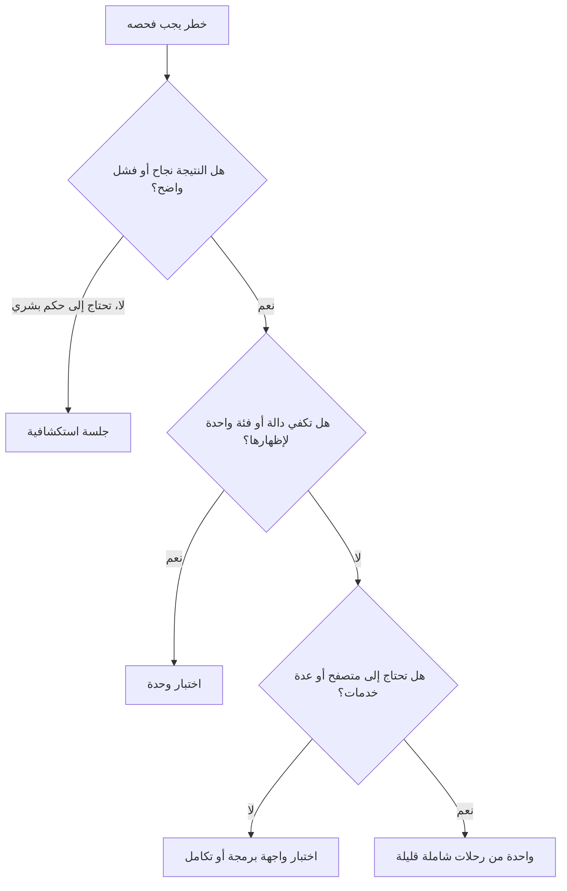
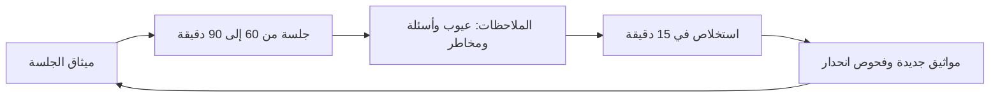

# الوحدة 5 — الاستراتيجية والتسليم (Strategy and delivery)

*زوّدت الوحدات من 2 إلى 4 (Modules 2 to 4) فريق هندسة الجودة (Quality Engineering) في بنك نجم (Najm Bank) بتقنيات اختبار الشيفرة (testing code) والواجهات (interfaces) والخصائص النوعية (qualities). وتجيب هذه الوحدة عن الأسئلة التي تعلو أي اختبار منفرد (any single test): ما مقدار الاختبار الكافي (how much testing is enough)، وفي أي موضع من عملية التسليم (the delivery process) يجب أن يعمل كل فحص (each check)، وكيف يعمل المختبِرون (testers) مع من يبنون المنتج ومن يستخدمونه (the people who build and use the product). يحوّل الدرس 5.1 المخاطر (risk) إلى استراتيجية اختبار (test strategy) وشكل للمجموعة (a suite shape) وقليل من المقاييس الصادقة (a few honest metrics)، ويبيّن لماذا يُعدّ هدف التغطية (a coverage target) فخًا (a trap). ويربط الدرس 5.2 تلك الاختبارات بخط أنابيب سريع (a fast pipeline)، ويضبط الاختبارات غير المستقرة (polices flaky tests)، ويمدّ الاختبار إلى الإنتاج (extends testing into production) بمفاتيح الميزات (feature flags) والإطلاقات الكنارية (canaries) والفحوص الاصطناعية (synthetic checks). ويتناول الدرس 5.3 الجانب البشري (the human side): جلسات استكشافية (exploratory sessions) تجد ما لا تستطيع السكربتات (scripts) التنبؤ به، وجودة الفريق بأكمله (whole-team quality) في فرق أجايل (agile squads)، والتطوير الموجَّه بالسلوك (BDD) والأمثلة المشتركة (shared examples) التي تجعله مجديًا، وكيف تؤثر في المطورين دون سلطة (influence developers without authority). ستتابع راشد (Rashid) وبلال (Bilal) وأمل (Amal) وندى (Nada) على [النظام النموذجي للدورة (the course's sample system)](https://github.com/Tamoura/system-design-for-vibe-coders/tree/main/testing/sample). وخيط الذكاء الاصطناعي (The AI thread): يضاعف الوكلاء (agents) الشيفرة والاختبارات التي عليك الحكم عليها، لذا تشمل الاستراتيجية الآن سياسة للاثنين (a policy for both)، وخط الأنابيب (the pipeline) هو الموضع الذي تُفرَض فيه تلك السياسة (where that policy is enforced).*

> **التركيز (Focus):** Strategy, Delivery — تقرير ما يُختبر وبأي قدر (deciding what to test and how much)، وربط الاختبارات بخط الأنابيب والإنتاج (wiring tests into the pipeline and production)، والعمل مع من يبنون المنتج ومن يستخدمونه (working with the people who build and use the product).

---

# 5.1 — استراتيجية الاختبار والتخطيط (Test strategy and planning): الاختبار القائم على المخاطر (risk-based testing) وهرم الاختبار (the test pyramid) ومقاييس الجودة (quality metrics)
*المستوى (Level): 🟡 متوسط (Intermediate)* · *المتطلبات (Prerequisites): 1.1، 2.3، 3.2* · *التركيز (Focus): Strategy*

## ⚡ الدرس في دقيقة (In 60 seconds)
- **استراتيجية الاختبار (test strategy)** هي النهج الدائم (the standing approach): ما الذي تختبره (what you test)، وعلى أي مستوى (at which level)، ومن يملكه (who owns it). أما **خطة الاختبار (test plan)** فتطبّقها على إصدار واحد (one release). اجعل الاستراتيجية في صفحة واحدة (a page).
- **الاختبار القائم على المخاطر (risk-based testing)** يقيّم المجالات بحاصل ضرب الاحتمال في الأثر (likelihood × impact) من 1 إلى 5 لكل منهما؛ وتحدد الدرجة العمق (the score sets the depth). استثناء واحد (One override): الأثر الكارثي (a catastrophic impact) لا يكون «خفيفًا» ("light") أبدًا.
- شكّل المجموعة (suite) بحسب أماكن وجود العيوب (where bugs live): هرم الاختبار (the pyramid) افتراضيًا. أما **مخروط الآيس كريم (ice-cream cone)**، أي اختبارات واجهة مستخدم بطيئة في معظمها (mostly slow UI tests)، فهو النمط المضاد (the anti-pattern).
- قِس النتائج (outcomes) — العيوب المتسرّبة (escaped defects) وزمن الحصول على التغذية الراجعة (time to feedback) ومعدل عدم الاستقرار (flake rate) — لا النشاط (activity) كعدد الاختبارات (test counts) وأهداف التغطية (coverage targets). والمقياس الذي يتحول إلى هدف يُتلاعب به (A measure turned into a target gets gamed).
- في عصر الذكاء الاصطناعي (the AI era) أضف سياسة للشيفرة والاختبارات التي يكتبها الوكلاء (agent-written code and tests)، وبوابات تقييم آلي (eval gates) لميزات الذكاء الاصطناعي (AI features).

## 🧭 لماذا يهم (Why it matters)
يطلب راشد (Rashid) من ندى (Nada) «استراتيجية الاختبار» ("the test strategy") لعمل التحويلات (Transfers) في الربع القادم (next quarter's work). تعود بـ 38 صفحة ومخطط غانت (a Gantt chart). لا يقرؤها أي فريق (No squad reads it). وفي ذلك الشهر، في قصة مُختلقة (in an invented story)، يجتاز الإصدار 2026.09 بوابته (passes its gate) بـ 1,800 اختبار وتغطية أسطر (line coverage) بنسبة 90%، لأن البوابة كانت هدف تغطية (a coverage target) وملأها وكيل (an agent) باختبارات لا تؤكد شيئًا (tests that assert nothing). وفي الإنتاج (In production) تؤدي إعادة المحاولة (a retry) بعد ضياع الرد (a lost reply) إلى خصم بعض العملاء مرتين (debits some customers twice). الإرسال المزدوج (Duplicate submit) هو أخطر أجزاء التحويلات (the riskiest part)، ولم يختبره أحد (nobody tested it).

أسئلة راشد هي الاستراتيجية نفسها (Rashid's questions are the strategy). ما الأشياء الخمسة التي يجب ألا تنكسر أبدًا (Which five things must never break)؟ وأين يوجد أول فحص لكل منها (Where does the first check for each live)؟ وكم من الوقت يمضي قبل أن نعلم بدمج سيئ (How soon will we know about a bad merge)؟ وما الذي اخترنا ألا نختبره، ومن قبِل بذلك (What are we choosing not to test, and who accepted that)؟ يتيح الوكلاء (Agents) للفرق فتح طلبات دمج (pull requests) أكثر مما تستطيع هندسة الجودة (QE) قراءته، لذا يجب أن تقول الاستراتيجية ما الذي يستحق الثقة (what earns trust).

## 📐 كيف يعمل (How it works)

### 🟢 الأساسيات (The essentials)

**الاستراتيجية مقابل الخطة (Strategy versus plan).** تجيب الاستراتيجية (strategy) عن سؤال «كيف نختبر هنا عمومًا؟» ("how do we test here, in general?")، وتشمل: قواعد المخاطر والعمق (risk and depth rules)، والمستويات والمالكين (levels and owners)، والبيئات والبيانات (environments and data)، وقواعد الأتمتة (automation rules)، والمقاييس (metrics)، وسياسة الذكاء الاصطناعي (AI policy). وتُراجَع كل ربع سنة (reviewed each quarter)، مثل: «تحصل المجالات العميقة على ميثاق جلسة في كل إصدار» ("Deep areas get a charter every release"). وتجيب الخطة (plan) عن «ماذا نختبر في هذا الإصدار، ومتى؟» ("what do we test for this release, and when?")، وتشمل: النطاق (scope)، والجدول الزمني (schedule)، والأشخاص (people)، ومخاطر هذا الإصدار (this release's risks). وتُكتب لكل إصدار (written per release): «يغيّر الإصدار 2026.10 شيفرة موعد الإغلاق (the cut-off code)، لذا تشغّل أمل (Amal) ميثاق موعد الإغلاق يوم الثلاثاء» ("2026.10 changes the cut-off code, so Amal runs the cut-off charter on Tuesday").

**الاختبار القائم على المخاطر (Risk-based testing).** لا يمكنك اختبار كل شيء (You cannot test everything) (المبدأ 2، الدرس 1.1: principle 2, lesson 1.1)، فأنفق الجهد حيث يؤلم الفشل (spend effort where failure hurts). **الخطر = الاحتمال × الأثر (Risk = likelihood × impact)**: ما مدى احتمال وجود عيب هنا (how likely is a defect here)، وما مدى سوء الأمر إن تسرّب (how bad if it escapes)؟ تقيّم ندى وراشد مجالات التحويلات (the Transfers areas) مع الفريق (the squad)، لكل عامل من 1 إلى 5 (each factor from 1 to 5). ويحوّل سكربت (a script) الدرجات إلى عمق (depth)، فالقاعدة مكتوبة لا مزاج (the rule is written down, not a mood).

```python
# risk.py
RISKS = [   # (area, likelihood 1-5, impact 1-5), scored by the squad and QE in refinement
    ("Duplicate submit and retries", 3, 5),
    ("Cut-off, time zone and value date", 4, 3),
    ("Daily and per-transfer limits", 3, 4),
    ("Authorisation: own accounts only", 2, 5),
    ("Fee calculation and rounding", 3, 3),
    ("Arabic right-to-left transfer form", 3, 3),
    ("Notification text", 3, 2),
    ("Recovery after a crash mid-transfer", 1, 5),
    ("Statement PDF layout", 2, 1),
]


def depth(likelihood: int, impact: int) -> str:
    score = likelihood * impact
    if score >= 10 or impact == 5:        # override: a catastrophic impact is never "light"
        return "Deep"
    if score >= 7:
        return "Standard"
    return "Light" if score >= 3 else "Smoke"


if __name__ == "__main__":
    for area, l, i in sorted(RISKS, key=lambda r: -r[1] * r[2]):
        print(f"{l * i:>3}  {depth(l, i):<8} {area}")
```

```text
 15  Deep     Duplicate submit and retries
 12  Deep     Cut-off, time zone and value date
 12  Deep     Daily and per-transfer limits
 10  Deep     Authorisation: own accounts only
  9  Standard Fee calculation and rounding
  9  Standard Arabic right-to-left transfer form
  6  Light    Notification text
  5  Deep     Recovery after a crash mid-transfer
  2  Smoke    Statement PDF layout
```

يحصل الإرسال المزدوج (Duplicate submit) على 15 (3 × 5)، وهي الأعلى (the top). أما التعافي من الانهيار (Crash recovery) فيحصل على 5 فقط لأنه نادر (rare)، لكن أثره 5، فيرفعه الاستثناء (the override) إلى «عميق» (Deep)؛ وبدونه تُخفي عملية الضرب الكوارث النادرة (multiplication hides rare disasters). يعني **عميق (Deep)**: اختبارات الحدود (boundary tests) واختبارات الخصائص (property tests)، ومصفوفة حالات سلبية وتفويض لواجهة البرمجة (an API negative and authorisation matrix)، ورحلة شاملة واحدة (one end-to-end journey)، وميثاق جلسة استكشافية (an exploratory charter) في كل إصدار، وبوابة درجة الطفرات (a mutation score gate) على الشيفرة المتغيّرة (changed code) (الدرس 2.3: lesson 2.3)، وتنبيه في الإنتاج (a production alert). و**قياسي (Standard)**: اختبارات وحدة للقواعد (unit tests for the rules)، وحالات واجهة برمجة للمسار السعيد والأخطاء (API happy and error cases)، ومرور استكشافي (an exploratory pass) حين يتغير المجال. و**خفيف (Light)**: بضعة اختبارات وحدة (a few unit tests) مع اختبارات دخان لواجهة البرمجة (API smoke tests). و**دخان (Smoke)**: فحص واحد عند الإصدار (one check at release) دون صيانة (no upkeep).

**ضعيف مقابل قوي (Weak versus strong).** ضعيف (Weak): «حزمة الانحدار (Regression pack): 600 حالة شاملة (end-to-end cases) على كل تغيير، بما فيها تخطيط كشف الحساب (statement layout)». بطيئة، ومتساوية لكل شيء (equal for everything)، وعمياء عن أكبر خطر (blind to the top risk). قوي (Strong): يحصل الإرسال المزدوج على اختبار وحدة (a unit test)، واختبار واجهة برمجة للإرسال المزدوج (an API test for the double submit)، واختبار خصائص (a property test)، وميثاق جلسة (a charter)، وتنبيه عند تحويلين متطابقين خلال دقيقة (an alert on two identical transfers within a minute). **متى لا تفعل (When not to):** تغيير نص من سطر واحد (a one-line copy change) لا يحتاج إلى سجل (no register). التقييم اجتهاد (Scoring is judgement): أن يقيّم شخصان كلٌّ على حدة ثم يتجادلان حول الفجوات (arguing about gaps) هو القيمة نفسها، والنموذج الموزون (a weighted model) دقة زائفة (false precision).

**الهرم والكأس والخلية (Pyramid, trophy, honeycomb).** أشكال للتركيز (Shapes of emphasis) لا قوانين (not laws). يريد **الهرم (pyramid)** (Mike Cohn؛ Martin Fowler) اختبارات وحدة كثيرة (many unit tests)، واختبارات تكامل أقل (fewer integration tests)، واختبارات شاملة قليلة (few end-to-end tests)؛ ويناسب الأنظمة الخلفية الغنية بالقواعد (rule-heavy back ends) كالرسوم والسقوف (fees and limits). أما **كأس الجوائز (trophy)** عند Kent C. Dodds و**الخلية (honeycomb)** عند Spotify فتضعان أكبر ثقل على اختبارات التكامل: الكأس للواجهات الأمامية (front ends) حيث تتعاون المكوّنات (components cooperate)، والخلية للخدمات الصغيرة الكثيرة (many small services). وكلها تقول: اختبر حيث يعيش العيب (test where the bug lives)، وبأرخص ما تستطيع (as cheaply as you can). والنمط المضاد (anti-pattern) هو **مخروط الآيس كريم (ice-cream cone)**: قليل من اختبارات الوحدة تحت جبل من اختبارات واجهة المستخدم البطيئة (a mountain of slow UI tests).



كل مستوى يحتاج إلى مالك وإلا تعفّن (Every level needs an owner, or it rots). اختبارات الوحدة والتكامل (Unit and integration tests): المطورون، على إطار عمل بلال (on Bilal's framework). اختبارات العقد (Contract tests): فريقا المستهلك والمزوِّد (the consumer and provider squads)، وتتحكم في النشر (gating deploys). الاختبار الشامل (End-to-end): يحتفظ فريق بلال بإطار العمل (keeps the framework)، وتملك الفرق رحلاتها (own their journeys). الاستكشافي (Exploratory): أمل مع الفريق كله (the whole team) (الدرس 5.3). فحوص الإنتاج (Production checks): فريق SRE بقيادة مها (Maha's SRE team) مع هندسة الجودة (QE) (الدرس 5.2).

### 🟡 التعمق أكثر (Going deeper)

**معايير الدخول والخروج وتعريف الإنجاز (Entry and exit criteria, definition of done).** تحدد **معايير الدخول (entry criteria)** متى يجوز أن يبدأ الاختبار: البناء في بيئة ضمان الجودة (build in QA)، واختبار الدخان أخضر (smoke green)، والبيانات محمّلة (data loaded). وتحدد **معايير الخروج (exit criteria)** متى يجوز أن يتوقف، على هيئة دليل لا موعد (as evidence, not a date): لا عيب مفتوح من الدرجة Sev1 أو Sev2 ما لم يقبله مالك مسمّى كتابةً (a named owner accepts it in writing)؛ وكل مجال عميق أخضر على هذا البناء (every Deep area green on this build)؛ والتراجع مجرَّب (rollback rehearsed). أما **تعريف الإنجاز (definition of done)** فهو الفكرة نفسها لحكاية مستخدم واحدة (one story): مراجَعة (reviewed)، واختبارات تفشل بدون التغيير (tests that fail without the change)، وسجلات وتنبيهات مضافة (logs and alerts added)، والعربية وإمكانية الوصول (accessibility) مفحوصتان إذا تغيرت الشاشة.

**البيئات والبيانات (Environments and data).** تضيف الاستراتيجية قواعد تمنع تعفّن البيئات الأربع في الدرس 0.3 (lesson 0.3's four environments): تعكس بيئة ما قبل الإنتاج (staging) إصدارات الإنتاج وإعداداته (production's versions and configuration)؛ وتُحجز بيئة ضمان الجودة (QA is booked) لأن فريقين على بناء واحد يسببان تشغيلات غير مستقرة (two squads on one build cause flaky runs)؛ والبيانات اصطناعية أو مقنَّعة (synthetic or masked) بموافقة سارة (Sara's approval)، ولا تدخل أبدًا أداة ذكاء اصطناعي خارجية (an external AI tool).

**استراتيجية الأتمتة (Automation strategy).** أتمِت ما هو مستقر وعالي المخاطر وحتمي ويُشغَّل كثيرًا (stable, high-risk, deterministic and run often). واترك الأعمال لمرة واحدة (one-offs)، والشاشات التي تتغير أسبوعيًا (screens that change weekly)، وأحكام التقدير (judgement calls) مثل «هل يبدو هذا جديرًا بالثقة؟» ("does this feel trustworthy?"). واحسب العائد (Count the return): فحص يدوي مدته 20 دقيقة يُشغَّل مرتين أسبوعيًا يكلّف 40 دقيقة أسبوعيًا (a 20-minute manual check run twice a week costs 40 minutes a week). وتستغرق أتمتته 3 ساعات (Automating it takes 3 hours) مع نحو 15 دقيقة شهريًا من الصيانة (about 15 minutes a month of upkeep)، فيوفّر نحو 36 دقيقة أسبوعيًا ويسترد كلفته في خمسة أسابيع (pays back in five weeks)، ما لم يُعَد تصميم الشاشة الشهر القادم (unless the screen is redesigned next month).

**مقاييس تفيد ومقاييس تضلّل (Metrics that help, metrics that mislead).**

| المقياس (Measure) | السؤال الذي يجيب عنه (Question it answers) | احذر (Watch out for) |
|---|---|---|
| **معدل تسرّب العيوب (Defect escape rate)** | من بين عيوب إصدار ما (Of a release's defects)، ما نصيب ما وجده العملاء أولًا (what share did customers find first)؟ التسرّبات ÷ (ما وُجد قبل الإطلاق + التسرّبات) في نافذة ثابتة مثل 30 يومًا (a fixed window such as 30 days): 2 ÷ (23 + 2) = 8% | اتجاه لا هدف (A trend, never a target): الأهداف تجعل الناس يتوقفون عن التسجيل (targets make people stop logging) |
| **زمن الحصول على التغذية الراجعة (Time to feedback)** | كم يمضي من الدفع (push) إلى نجاح أو فشل موثوق (a trusted pass or fail)؟ p50 وp95 لفحوص طلب الدمج (of pull-request checks) | المتوسطات تُخفي الذيل البطيء (Averages hide the slow tail) |
| **معدل عدم الاستقرار (Flake rate)** | ما نصيب تشغيلات التكامل المستمر (CI runs) التي احمرّت ثم اخضرّت على الالتزام نفسه (went red, then green, on the same commit)؟ | إعادة المحاولة تخفيه (Retries hide it)؛ فاحسبها (count them) (الدرس 5.2) |
| **MTTD وMTTR** | متوسط زمن اكتشاف العطل (Mean time to detect a fault)؛ ومتوسط زمن استعادة الخدمة (mean time to restore service) | المتوسطات تُخفي الذيول الطويلة (Means hide long tails) |

الأربعة الكلاسيكية في برنامج أبحاث DORA (The DORA research programme's classic four) هي: تكرار النشر (deployment frequency)، وزمن الانتظار للتغييرات (lead time for changes)، ومعدل فشل التغييرات (change failure rate) أي نسبة عمليات النشر التي احتاجت إلى إصلاح أو تراجع (the share of deployments needing a fix or rollback)، وزمن استعادة الخدمة (time to restore service)؛ وتصقل التقارير الحديثة الأسماء، فراجع dora.dev. أما عدد الاختبارات (Test counts) و«العيوب المكتشفة لكل مختبِر» ("bugs found per tester") ومعدل النجاح (pass rate) وأهداف التغطية الخام (raw coverage targets) فهي مقاييس شكلية (vanity metrics). و**قانون غودهارت (Goodhart's law)** بصياغة Marilyn Strathern: حين يصبح المقياس هدفًا، يكف عن أن يكون مقياسًا جيدًا (when a measure becomes a target, it ceases to be a good measure). وهذه القصة مصغّرة على النظام النموذجي (that story in miniature on the sample): وكيل طُلب منه بلوغ الهدف يكتب هذا «المعزِّز» (booster):

```python
# tests/test_booster.py -- written to hit a coverage target. It asserts nothing.
from datetime import datetime
from zoneinfo import ZoneInfo

from najm.transfers import TransferRejected, TransferService, check_transfer, value_date

REQ = {"from_account": "acc-1", "to_account": "acc-2", "amount": "100.00", "currency": "QAR", "kind": "domestic"}


def test_coverage_booster():
    for amount, kind, sent in [("5000", "domestic", "0"), ("90", "international", "0"), ("30000", "own", "0"),
                               ("0.5", "own", "0"), ("100", "own", "49950"), ("10.005", "own", "0"), ("10", "wire", "0")]:
        try:
            check_transfer(amount, "QAR", kind, sent)
        except TransferRejected:
            pass
    value_date(datetime(2026, 10, 5, 16, tzinfo=ZoneInfo("Asia/Qatar")))
    svc = TransferService()
    svc.submit("alice", REQ, "k1")
    svc.submit("alice", REQ, "k1")
```

وفي مقابله، ثلاثة اختبارات دقيقة (three exact tests):

```python
# tests/test_strong.py
from decimal import Decimal

import pytest

from najm.transfers import TransferRejected, check_transfer, fee


def test_international_fee_rounds_half_up():
    assert fee("3090", "QAR", "international") == Decimal("10.82")


def test_a_day_total_of_exactly_the_limit_is_allowed():
    assert check_transfer("1000", "QAR", "domestic", sent_today="49000").total == Decimal("1000.00")


def test_a_day_total_just_over_the_limit_is_refused():
    with pytest.raises(TransferRejected) as e:
        check_transfer("1000.01", "QAR", "domestic", sent_today="49000")
    assert e.value.code == "daily_limit_exceeded"
```

قياسًا لكل ملف (Measured per file) بالأمر `pytest tests/test_booster.py --cov=najm.transfers --cov-branch`، ثم مع تفعيل كل عيب من العيوب الخمسة في `NAJM_BUGS` على حدة (with each of the five on):

| المجموعة (Suite) | الاختبارات (Tests) | التغطية (Coverage) | العيوب المزروعة المكتشفة من 5 (Seeded bugs caught, of 5) |
|---|---|---|---|
| المعزِّز أعلاه (The booster above) | 1 | 74% | 0 |
| الاختبارات الثلاثة الدقيقة (The three exact tests) | 3 | 43% | 2 (`float_fee`, `limit_off_by_one`) |

```text
# trimmed output
$ NAJM_BUGS=float_fee pytest tests/test_booster.py tests/test_strong.py
E       AssertionError: assert Decimal('10.81') == Decimal('10.82')
FAILED tests/test_strong.py::test_international_fee_rounds_half_up
1 failed, 3 passed
```

سجّل المعزِّز رقمًا أعلى ولم يكتشف شيئًا (scored higher and caught nothing)؛ وسجّلت ثلاثة اختبارات صغيرة رقمًا أقل واكتشفت عيبين (caught two bugs). ولا تكفي أي من المجموعتين (Neither suite is enough): فالإخفاقات الثلاثة (`tz_cutoff` و`no_idempotency` و`bola`) تقع كلها في مجالات عميقة (Deep areas)، فيدل السجل (the register) على موضع الاختبارات التالية. تجد التغطية (Coverage) الشيفرة التي لا يشغّلها أي اختبار (code no test runs)؛ وليست هدفًا أبدًا (never a goal). اقرنها بدرجة الطفرات (Pair it with the mutation score) (الدرس 2.3).

**الإبلاغ عن الجودة (Reporting quality).** يريد أصحاب المصلحة (Stakeholders) قرارًا لا سجلًّا (a decision, not a log). تضم لوحة المتابعة ذات الصفحة الواحدة (The one-page dashboard) خمس كتل: عنوانًا رئيسيًا (a headline) — أصدِر أو أصدِر بشروط أو أوقف (ship, ship with conditions or hold) — مع الأسباب والمالك (reasons and an owner)؛ وأربعة أرقام للنتائج مع اتجاهاتها (four outcome numbers with trends): معدل التسرّب (escape rate) ومعدل فشل التغييرات (change failure rate) وp95 لزمن الحصول على التغذية الراجعة (p95 time to feedback) ومعدل عدم الاستقرار (flake rate)؛ وخريطة مخاطر (a risk map) يكون فيها كل مجال عميق أو قياسي أخضر أو كهرمانيًا أو أحمر بحسب الدليل (green, amber or red by evidence)؛ وعيوب Sev1 وSev2 المفتوحة بحسب العمر (open Sev1 and Sev2 by age)، مع المخاطر المقبولة وتواريخ انتهائها (accepted risks and expiry dates)؛ وما **لم** يُختبر (what was not tested). ضعيف (Weak): «اجتاز 1,812 اختبارًا (100%)» ("1,812 tests passed (100%)"). قوي (Strong): «أربعة مجالات عميقة خضراء، وواحد كهرماني (لم يُجرَّب موعد الإغلاق مساء الجمعة)؛ وعيبان Sev2 مفتوحان لهما مالكان؛ وآخر معدل تسرّب 8%» ("Four Deep areas green, one amber (cut-off not exercised on a Friday evening); two Sev2 open with owners; last escape rate 8%"). الثاني يمكن فحصه ومعارضته (can be checked and challenged)، لذا يمكن الوثوق به (can be trusted).

### 🔴 نظرة الخبير (Expert view)

**السياق المنظَّم (Regulated context).** على البنك أن يوثّق الاختبار وضبط التغيير (evidence testing and change control): أي متطلب (which requirement)، وأي اختبار (which test)، وأي بناء (which build)، وأي نتيجة (what result)، ومن اعتمد (who approved). تحصل الفرق التي تبدأ بالشيفرة (Code-first teams) على **التتبّع (traceability)** بكلفة زهيدة بوسم الاختبارات بمعرّفات المتطلبات (tagging tests with requirement IDs):

```python
# conftest.py. Needs "junit_family = xunit1" in pytest.ini (xunit2 warns) and a declared "req" marker
import pytest


@pytest.fixture(autouse=True)
def requirement(request, record_property):
    marker = request.node.get_closest_marker("req")
    if marker:
        record_property("requirement", marker.args[0])    # appears as a <property> in the JUnit XML
```

علّم اختبارًا بـ `@pytest.mark.req("TRF-212")`، وشغّل `pytest --junitxml=report.xml`، فيربط ملف XML المتطلب بالنتيجة (links requirement and result). ويتضمن معيار **PCI DSS** (الإصدار 4.x وقت الكتابة: version 4.x at the time of writing) متطلبات عن اختبار التغييرات قبل الإنتاج (testing changes before production) وفحص الثغرات (vulnerability scanning) واختبار الاختراق (penetration testing). أما **قانون DORA الأوروبي (The EU's DORA)**، أي قانون المرونة التشغيلية الرقمية (the Digital Operational Resilience Act) (اللائحة (EU) 2022/2554)، فيسري منذ يناير 2025 (applies from January 2025) ويشمل اختبار المرونة (resilience testing)، مع اختبار اختراق موجَّه بالتهديدات (threat-led penetration testing) للجهات المهمة (significant entities). تملك إدارة الامتثال (Compliance) الربط بالبنود (the mapping to clauses)؛ وتوفر هندسة الجودة (QE) الأدلة (the evidence).

**إضافات عصر الذكاء الاصطناعي (AI-era additions).** ثلاث قواعد تمهّد للوحدتين 6 و7 (previewing Modules 6 and 7). **الشيفرة التي يكتبها الوكلاء (Code written by agents)** شيفرة جديدة غير مراجَعة (new, unreviewed code): فروق صغيرة (small diffs)، ودرجة احتمال أعلى (a higher likelihood score) في المجالات العميقة إلى أن يقول الدليل غير ذلك ([*تصميم الأنظمة لمبرمجي الفايب (System Design for Vibe Coders)*، الدرس 9.4 — التحقق قبل الإكمال (Verification before completion)](../vibe/index.ar.html#l9-4)). و**الاختبارات التي يكتبها الوكلاء (Tests written by agents)** يملكها إنسان (owned by a human)، وتُراجَع منفصلةً عن الشيفرة التي تغطيها (reviewed separately from the code they cover)، ويُحكم عليها بقدرتها على الفشل (judged by whether they can fail) (الدرسان 6.1 و6.2). و**ميزة الذكاء الاصطناعي (AI feature)** مثل نجم أسيست (Najm Assist) لا تُطلق إلا بعد اجتياز **بوابة التقييم الآلي (eval gate)**: مجموعة مرجعية (a golden set) وعتبات (thresholds) وفحص انحدار في التكامل المستمر (a regression check in CI) (الدرس 7.1؛ انظر [*إدارة منتجات الذكاء الاصطناعي (AI Product Management)*، الدرس 6.1 — جودة يمكنك قياسها (Quality you can measure): المقاييس (metrics) والمجموعات المرجعية (golden sets) وتحليل الأخطاء (error analysis)](../aipm/index.ar.html#/6.1)).

## 🧰 الأدوات (The toolkit)
| الأداة أو الممارسة أو التقنية (Tool, practice or technique) | ما هي وماذا تفعل (What it is and does) | متى تلجأ إليها (When to reach for it) |
|---|---|---|
| **Risk-based testing** — الاختبار القائم على المخاطر | يقيّم المجالات (Scores areas) بحاصل ضرب الاحتمال في الأثر (likelihood × impact) ويحدد عمق الاختبار بحسب الدرجة (sets test depth by score) | في كل جلسة تنقيح (Every refinement)؛ ولتقرير وجهة ساعة الاختبار التالية (deciding where the next test hour goes) |
| **Test pyramid** (Mike Cohn؛ Martin Fowler) — هرم الاختبار | اختبارات وحدة كثيرة (Many unit tests)، واختبارات تكامل أقل (fewer integration tests)، واختبارات شاملة قليلة (few end-to-end tests) | الشكل الافتراضي (The default shape)؛ وتشخيص مجموعة بطيئة هشة (diagnosing a slow, brittle suite) |
| **Testing trophy and honeycomb** — كأس الاختبار والخلية | أشكال تعطي وزنًا لاختبارات التكامل (Shapes that weight integration tests) (Kent C. Dodds؛ Spotify) | شيفرة الواجهات الأمامية (Front-end code)، أو خدمات صغيرة كثيرة (many small services) |
| **Definition of done** — تعريف الإنجاز | قائمة تحقق مشتركة (A shared checklist) تجعل الحكاية منجزة (makes a story finished)، والاختبارات ضمنها (tests included) | كل فريق وكل حكاية (Every team, every story) |
| **DORA metrics** — مقاييس DORA | مقاييس التسليم (Delivery measures) مثل زمن الانتظار للتغييرات (lead time) ومعدل فشل التغييرات (change failure rate) | لإظهار ما إذا كانت السرعة والجودة ترتفعان معًا (Showing whether speed and quality rise together) |
| **Test management tools** (Xray, Zephyr, TestRail, Azure DevOps Test Plans) — أدوات إدارة الاختبار | تخزّن الحالات (Store cases)، وتربط المتطلبات (link requirements)، وتحفظ الأدلة (keep evidence)؛ والخطر أن تصير مصدر حقيقة ثانيًا ينجرف (a second source of truth that drifts)، فغذِّها بنتائج التكامل المستمر (feed in CI results) وأعطِ كل حالة مالكًا (give every case an owner) | مسارات التدقيق (Audit trails) والمجموعات اليدوية الكبيرة (large manual suites) |

## 🏛️ عمليًا في بنك نجم (In practice at Najm Bank)
ينشر راشد (Rashid) وقادة الفرق (the squad leads) **استراتيجية اختبار نجم، الإصدار 1 (Najm Test Strategy v1)**: صفحة واحدة (one page)، تُراجَع كل ربع سنة وبعد كل Sev1 أو Sev2 (reviewed each quarter and after every Sev1 or Sev2). الأرقام نقاط بداية قابلة للتعديل (starting points to adjust).

| القسم (Section) | ما يقوله (What it says) |
|---|---|
| الغرض (Purpose) | لا تضيع التحويلات (Transfers) ولا تتكرر ولا تُقرَّب خطأً (never lost, duplicated or mis-rounded)؛ ولا يخترع نجم أسيست (Najm Assist) سياسة أبدًا (never invents policy)؛ والإصدار كثيرًا، مع الأدلة (release often, with evidence) |
| المخاطر والعمق (Risk and depth) | السجل في `risk.py` (the register)، يُعاد تقييمه كل ربع سنة (re-scored each quarter). عميق (Deep): الإرسال المزدوج (duplicate submit)، وموعد الإغلاق (cut-off)، والسقوف (limits)، والتفويض (authorisation)، والتعافي من الانهيار (crash recovery) |
| المستويات والمالكون (Levels and owners) | كما سبق (As above). الرحلات الشاملة (End-to-end journeys): 15 كحد أقصى (at most 15) |
| البيئات والبيانات (Environments, data) | التطوير والجودة وما قبل الإنتاج والإنتاج (Dev, QA, staging, production). بيانات اصطناعية (Synthetic data)؛ ولا شيء منها في أدوات ذكاء اصطناعي خارجية (none in external AI tools) |
| الدخول والخروج (Entry, exit) | الدخول (Entry): البناء في بيئة الجودة والدخان أخضر (build in QA, smoke green). الخروج (Exit): لا Sev1 أو Sev2 مفتوح دون قبول مسمّى (without a named acceptance)؛ وللمجالات العميقة أدلة (Deep areas have evidence) |
| الأتمتة (Automation) | المستقر وعالي المخاطر ومتكرر التشغيل (Stable, high-risk, frequent)؛ ومالك لكل اختبار (an owner per test)؛ وتُحجر الاختبارات غير المستقرة (flaky tests quarantined) خلال يوم عمل واحد (in one working day)، بموعد نهائي 14 يومًا (14-day deadline) |
| المقاييس (Metrics) | اتجاه معدل التسرّب (Escape rate trend)، وp95 لزمن الحصول على التغذية الراجعة (time to feedback) والهدف 10 دقائق (target 10 minutes)، ومعدل عدم الاستقرار مع حساب إعادات المحاولة (flake rate with retries counted)، وMTTR. تُبلَّغ التغطية ولا تُستهدف (Coverage reported, not targeted). ولا تُستخدم أبدًا لترتيب الأشخاص (Never used to rank people) |
| سياسة الذكاء الاصطناعي (AI policy) | يملك البشر الاختبارات التي يكتبها الوكلاء (Humans own agent-written tests)؛ ودرجة طفرات لا تقل عن 80% (at least 80% mutation score) على شيفرة المال والسقوف والتواريخ المتغيّرة (changed money, limit and date code)؛ وتجتاز ميزات الذكاء الاصطناعي بوابة تقييم آلي (AI features pass an eval gate) |
| الإبلاغ والفجوات (Reporting, gaps) | لوحة المتابعة ذات الكتل الخمس (The five-block dashboard) في كل إصدار، مع الفجوات المقبولة (accepted gaps) والمالكين وتواريخ الانتهاء (owners and expiry dates) |

## 🛠️ التمارين (Exercises)
انسخ `testing/sample` واستخدم البيئة الافتراضية (the venv) من الدرس 0.3 (lesson 0.3) (فـ`pytest-cov` موجودة أصلًا في `requirements.txt`).

- 🟢 اختر ميزة تعرفها (Pick a feature you know) — تسجيل دخول أو نموذج حجز (a login, a booking form) — وقيّم ثمانية مجالات على الأقل (score at least eight areas) في `risk.py`. *يكتمل عندما (Done when):* يكون لكل مجال عمق (every area has a depth)، وتسمّي الثلاثة الأعلى مستوى أول فحص لكل منها (your top three name the level of their first check)، ويُرفع صف واحد إلى «عميق» بالاستثناء (one row is lifted to Deep by the override).
- 🟡 أعد إنتاج جدول غودهارت (Reproduce the Goodhart table). اكتب معزِّزًا بلا تأكيدات (a no-assertion booster) لـ`najm/transfers.py`، وقِسه وحده (measure it alone) بالأمر `pytest tests/test_booster.py --cov=najm.transfers --cov-branch`، وشغّله تحت كل عيب من عيوب `NAJM_BUGS` الخمسة، واحدًا في كل مرة (one at a time). ثم أضف ثلاثة اختبارات دقيقة (three exact tests) وكرّر. *يكتمل عندما (Done when):* يكون لديك التغطية والعيوب المكتشفة للمجموعتين (coverage and bugs caught for both suites)، مع جملتين عن سبب كون الرقم الأعلى هو المجموعة الأسوأ (why the higher number was the worse suite).
- 🔴 اكتب استراتيجية من صفحة واحدة (Write a one-page strategy) بأقل من 400 كلمة للنظام النموذجي (for the sample system)، أي التحويلات (Transfers) ونجم أسيست (Najm Assist)، مع جدول يربط العيوب المزروعة التسعة كلها (all nine seeded bugs) — خمسة في `NAJM_BUGS` وأربعة في `NAJM_AI_BUGS` — بالمستوى الذي ينبغي أن يلتقط كلًّا منها (the level that should catch each)، وبما إذا كانت مجموعتك تلتقطه فعلًا. *يكتمل عندما (Done when):* يكون لكل عيب مستوى وإجابة بنعم أو لا (a yes or no)، ويتغير سطر واحد من الاستراتيجية بسبب «لا» (one line of the strategy changed because of a "no")، ويكون لكل مستوى مالك (every level has an owner).

## ⚠️ أخطاء وفخاخ (Mistakes and traps)
- **استراتيجية لا يقرؤها أحد (A strategy nobody reads).** اكتب صفحة واحدة بمالكين وأرقام (Write one page with owners and numbers).
- **جهد متساوٍ في كل مكان (Equal effort everywhere).** يحصل تخطيط كشف الحساب (The statement layout) على مجموعة الإرسال المزدوج نفسها (duplicate submit's suite). دع الدرجة تقرر (Let the score decide).
- **هدف تغطية أو عدد اختبارات (A coverage or test-count target).** يرتفع الرقم وتنخفض الحماية (The number rises and protection falls). احكم على المجموعات بالعيوب المزروعة (seeded bugs) ودرجات الطفرات (mutation scores).
- **ترتيب الأشخاص بعدد العيوب المكتشفة (Ranking people by bugs found).** يشتري عيوبًا تافهة ومكررة (It buys trivial and duplicate bugs). استخدم نتائج الفريق (team outcomes).
- **DORA مرتان (Two DORAs).** مقاييس البحث وقانون المرونة الأوروبي (The research metrics and the EU's resilience act) يتشاركان اختصارًا (share an acronym) ولا شيء غيره.

## 🧾 الخلاصة (Recap)
- الاستراتيجية هي النهج الدائم في صفحة واحدة (the standing one-page approach)؛ والخطة تطبّقها على إصدار واحد (applies it to one release).
- الخطر = الاحتمال × الأثر (Risk = likelihood × impact) يحدد العمق (sets depth)، مع استثناء للأثر الكارثي (an override for catastrophic impact).
- ضع كل فحص في أرخص مستوى يستطيع إظهار الخطر (the cheapest level that can show the risk)، وأعطِ كل مستوى مالكًا (give each level an owner)، وتجنّب مخروط الآيس كريم (avoid the ice-cream cone).
- اخرج بناءً على الدليل (Exit on evidence)، وأتمِت بحسب العائد (automate by return)، وقِس النتائج (measure outcomes)، وأبلغ عمّا لم يُختبر (report what was not tested).
- للذكاء الاصطناعي، أضف سياسة للشيفرة والاختبارات التي يكتبها الوكلاء (a policy for agent-written code and tests)، وبوابات تقييم آلي (eval gates) لميزات الذكاء الاصطناعي.

## ✍️ اختبر نفسك (Check yourself)

**1. يحصل التعافي من الانهيار أثناء تحويل (Crash recovery during a transfer) على احتمال 1 وأثر 5 (likelihood 1 and impact 5)، أي درجة 5. يريد الفريق (the squad) اختبارًا «خفيفًا» ("light"). ماذا تقول الاستراتيجية (the strategy)؟**

- A. خفيف (Light)، لأن الدرجة 5 أدنى من نطاق «قياسي» (below the Standard band)
- B. عميق (Deep)، لأن الاستثناء (the override) يرفع أي أثر قدره 5 إلى «عميق» (any impact of 5)
- C. دخان (Smoke)، لأن فشلًا نادرًا إلى هذا الحد لا يستحق مجموعة اختبارات (not worth a suite)
- D. قياسي (Standard)، كحل وسط بين الفريق والقاعدة (a compromise between the squad and the rule)

<details><summary>الإجابة</summary>

**B.** يوجد الاستثناء لأن الضرب يخفي الكوارث النادرة (multiplication hides rare disasters). أما A وC وD فتترك الدرجة أو الندرة (the score or rarity) تقرر. (🟢 الاختبار القائم على المخاطر، Risk-based testing.)

</details>

**2. للإصدار 2026.09 تغطية أسطر (line coverage) بنسبة 90% وقد اجتاز بوابته (passes its gate)، ومع ذلك تصل تحويلات مكررة (duplicate transfers) إلى العملاء. ما أفضل قراءة لذلك؟**

- A. أداة التغطية معطوبة (The coverage tool is broken) وتحتاج إلى استبدال
- B. يجب أن تبلغ التغطية 95% قبل الوثوق بالبوابة (before the gate is trusted)
- C. لم يكتب الفريق اختبارات وحدة كافية (not enough unit tests)
- D. التغطية تُظهر ما شُغِّل لا ما فُحِص (Coverage shows what ran, not what was checked)

<details><summary>الإجابة</summary>

**D.** يستدعي الهدف (A target) اختبارات تشغّل الشيفرة ولا تؤكد شيئًا (run code and assert nothing). أما A وB فتُبقيان الهدف (keep the target)؛ وC تعدّ الاختبارات لا الفحوص (counts tests, not checks). (🟡 المقاييس، Metrics.)

</details>

**3. لدى فريق الهاتف (The mobile squad) 40 اختبار وحدة (unit tests) و15 اختبار واجهة برمجة (API tests) و600 اختبار واجهة مستخدم (UI tests). يستغرق خط الأنابيب (The pipeline) 55 دقيقة ويفشل عشوائيًا (fails randomly). ما أفضل خطوة أولى؟**

- A. نقل فحوص القواعد التي لا تحتاج إلى شاشة إلى مستوى اختبارات واجهة البرمجة (Move the rule checks that need no screen down to API tests)
- B. إضافة عمال تنفيذ أكثر (more workers) ليكتمل 600 اختبار واجهة أسرع بكثير
- C. إعادة تشغيل اختبارات الواجهة الفاشلة تلقائيًا حتى يخضر البناء (Rerun failed UI tests automatically)
- D. حذف أقدم اختبارات الواجهة للوصول إلى رقم مستدير (Delete the oldest UI tests to reach a round number)

<details><summary>الإجابة</summary>

**A.** هذا مخروط آيس كريم (An ice-cream cone): نقل الفحوص إلى الأسفل يجعلها أسرع وأثبت (faster and steadier). أما B فتعالج العَرَض (treats the symptom)، وC تُخفي الاختبارات غير المستقرة (hides flakes)، وD تحذف بحسب العمر (deletes by age). (🟢 الهرم والكأس والخلية، Pyramid, trophy, honeycomb.)

</details>

**4. يقترح مدير مكافأة للمختبِر الذي يسجّل أكبر عدد من العيوب (the tester who files the most bugs). ما النتيجة المرجّحة؟**

- A. اكتشاف عيوب حقيقية أكثر، لأن المختبِرين يحفرون بجدّ أكبر من أجل المكافأة (dig harder for the bonus)
- B. جودة أعلى إجمالًا، لأن المختبِرين صاروا محفَّزين كما ينبغي (properly motivated)
- C. حشو (Padding): تقارير تافهة ومكررة كثيرة (many trivial and duplicate reports)، فيرتفع العدد
- D. يرفض المطورون التقارير جملةً (reject reports outright)، فيقل ما يُسجَّل من عيوب

<details><summary>الإجابة</summary>

**C.** حين يصبح عدد العيوب هو الهدف (Once bug count is the target)، يحسّن الناس العدد نفسه (people optimise the count). أما A وB فتفترضان أنه يبقى صادقًا (assume it stays honest)؛ وD تناقض الحافز (contradicts the incentive). (🔴 المقاييس، Metrics.)

</details>

**5. يغيّر طلب دمج كتبه وكيل (An agent's pull request) شيفرة السقف اليومي واختباراتها (the daily-limit code and its tests). ماذا ينبغي أن تشترط الاستراتيجية؟**

- A. ادمجه إذا كانت المجموعة خضراء (if the suite is green)، لأن الوكيل حدّث الاختبارات
- B. ارفضه، لأن على الوكلاء ألا يلمسوا أي ملف اختبار أبدًا (must never touch any test file)
- C. اقبله إذا بلغت تغطية الأسطر في الأسطر المتغيرة 90% على الأقل (line coverage on the changed lines)
- D. راجع تغييرات الاختبار على حدة وافحص درجة الطفرات (Review the test changes separately and check the mutation score)

<details><summary>الإجابة</summary>

**D.** قد يُضعف الوكيل اختبارًا ليطابق شيفرته (weaken a test to match its code)؛ وتُظهر درجة الطفرات (the mutation score) ما إذا كانت الاختبارات قادرة على الفشل (can fail). A يثق بالوكيل (trusts the agent)، وB يحظر ممارسة مفيدة (bans a useful practice)، وC يستخدم تغطية يستطيع اختبار فارغ ملأها (coverage an empty test can fill). (🔴 إضافات عصر الذكاء الاصطناعي، AI-era additions.)

</details>

## 📚 المراجع (References)
- منهج ISTQB لمستوى المختبِر المعتمد الأساسي (ISTQB Certified Tester Foundation Level syllabus) (الإصدار v4.0، 2023): [istqb.org](https://www.istqb.org/)
- مذكرة Martin Fowler عن TestPyramid ومقال Ham Vocke «The Practical Test Pyramid»، كلاهما على [martinfowler.com](https://martinfowler.com/)
- مدونة Google Testing Blog، عن حدود الاختبارات الشاملة (on the limits of end-to-end tests): [testing.googleblog.com](https://testing.googleblog.com/)
- كتاب *Software Engineering at Google* (2020): [abseil.io/resources/swe-book](https://abseil.io/resources/swe-book)
- برنامج أبحاث DORA (DORA research programme): [dora.dev](https://dora.dev/)
- اللائحة الأوروبية (EU) 2022/2554 بشأن المرونة التشغيلية الرقمية (EU Regulation on digital operational resilience): [eur-lex.europa.eu](https://eur-lex.europa.eu/)
- توثيق pytest (pytest documentation): [docs.pytest.org](https://docs.pytest.org/)

---

# 5.2 — الاختبار في التكامل والتسليم المستمرين وفي الإنتاج (Testing in CI/CD and in production): خطوط أنابيب سريعة (fast pipelines) وسياسة الاختبارات غير المستقرة (flaky-test policy) ومفاتيح الميزات (feature flags) والإطلاقات الكنارية (canaries) والمراقبة الاصطناعية (synthetic monitoring)
*المستوى (Level): 🟡 متوسط (Intermediate)* · *المتطلبات (Prerequisites): 2.3، 3.2، 5.1* · *التركيز (Focus): Delivery, Reliability*

## ⚡ الدرس في دقيقة (In 60 seconds)
- يرتّب **خط الأنابيب (pipeline)** الفحوص بحسب كلفتها (orders checks by cost): الرخيصة السريعة أولًا (cheap and fast first)، والبطيئة الواسعة لاحقًا (slow and broad later). وتجيب كل مرحلة (stage) عن سؤال واحد (one question).
- حدّد **ميزانية للتغذية الراجعة (feedback budget)** ودافع عنها. ميزانية نجم (Najm's): 95% من فحوص طلبات الدمج (pull-request checks) تنتهي خلال 10 دقائق. خزّن مؤقتًا (Cache) ووازِ (parallelise) وقسّم إلى شرائح (shard) قبل شراء أجهزة أكبر (buying bigger machines).
- **الاختبار غير المستقر (flaky test)** ينجح ويفشل على الشيفرة نفسها (passes and fails on the same code). اكتشفه (Detect)، واحجره (quarantine) بمالك وموعد نهائي (with an owner and a deadline)، وأصلحه (fix it)، وأبلغ عن كل إعادة محاولة (report every retry).
- **الإزاحة نحو اليمين (Shift-right)** تضيف أدلة من الحركة الحقيقية (evidence from real traffic): مفاتيح الميزات (flags) والإطلاقات الكنارية (canaries) والفحوص الاصطناعية (synthetic checks) والتتبّعات (traces). ولا تحل أبدًا محل الاختبار قبل الإنتاج (pre-production testing)، وتحتاج إلى مفتاح إيقاف (kill switch).
- أكبر فخ (Biggest trap): إسكات اختبار «غير مستقر» ("flaky") وهو في الحقيقة حالة تسابق (a race condition).

## 🧭 لماذا يهم (Why it matters)
يستغرق خط أنابيب بلال (Bilal's pipeline) لواجهة برمجة تطبيق نجم للهاتف (Najm Mobile API) 31 دقيقة. ويفشل اختبار شامل واحد (One end-to-end test)، «النقر المزدوج على إرسال ينشئ تحويلًا واحدًا» ("double-tapping Send creates one transfer")، في نحو تشغيل واحد من كل ستة (about one run in six). يضغط المطورون إعادة التشغيل (press re-run)، ويعيد خط الأنابيب محاولة الفشل مرتين (retries failures twice)، فينتهي أخضر (ends green). والاختبار ليس غير مستقر: إنه يجد التسابق الحقيقي (the real race) الذي يطارده الدرس 3.1 (that lesson 3.1 hunts)، أي طلبين متزامنين (two simultaneous requests) بمفتاح خاصية عدم التكرار نفسه (one idempotency key). وبعد ثلاثة أسابيع، في هذه القصة المُختلقة (in this invented story)، يترك نشرٌ بعض العملاء مخصومًا منهم مرتين (a deploy leaves a few customers debited twice). ولا يوجد في الإنتاج إطلاق كناري ولا فحص اصطناعي (no canary or synthetic check)، فتكون الإشارة الأولى مكالمة هاتفية (a phone call).

## 📐 كيف يعمل (How it works)

### 🟢 الأساسيات (The essentials)

**المراحل (Stages).** تجيب كل مرحلة عن سؤال واحد (answers one question)، حيث تكون فحوصها أرخص ما يمكن (where its checks are cheapest).

| المرحلة (Stage) | السؤال (Question) | الفحوص المعتادة (Typical checks) |
|---|---|---|
| قبل الالتزام (Pre-commit) | هل كسرت الأساسيات؟ ⁦(Did I break the basics?)⁩ | التنسيق (Format) والتدقيق الساكن (lint) واختبارات الوحدة القريبة (nearby unit tests) |
| طلب الدمج (Pull request) | هل الدمج آمن؟ ⁦(Safe to merge?)⁩ | اختبارات الوحدة والواجهة والعقد (Unit, API, contract) وعمليات الفحص (scans) وبضع رحلات دخان (a few smoke journeys) |
| الدمج (Merge) | هل ما زال `main` يعمل؟ ⁦(Does main still work?)⁩ | بناء مرة واحدة (Build once)، ونشر على بيئة الجودة (deploy to QA)، والرحلات (journeys) |
| ليلي (Nightly) | هل يتعفّن شيء؟ ⁦(Is anything rotting?)⁩ | مجموعات طويلة (Long suites) وتكرارات بترتيب عشوائي (random-order repeats) |
| قبل الإصدار (Pre-release) | هل نحن جاهزون؟ ⁦(Are we ready?)⁩ | الأداء (Performance) والأمان (security) وتجربة التراجع (rollback rehearsal) وقبول المستخدم (UAT) |
| بعد النشر (Post-deploy) | هل هبط بسلام؟ ⁦(Did it land safely?)⁩ | الدخان (Smoke) وتحليل الكناري (canary analysis) والفحوص الاصطناعية (synthetic checks) |

**ميزانيات التغذية الراجعة (Feedback budgets).** الفحوص البطيئة تُتخطّى (Slow checks get skipped)، لذا اكتب الميزانية (write the budget down) (نجم: 95% من فحوص طلبات الدمج خلال 10 دقائق: Najm: 95% of pull-request checks within 10 minutes)، وارسم p95 بيانيًا (graph the p95)، وحين يكسرها فحص جديد فانقل شيئًا (move something): إلى مهام متوازية (parallel jobs)، أو بعد الدمج (after the merge)، أو إلى الليل (overnight). يتناول [*السحابة وDevOps (Cloud & DevOps)*، الدرس 4.1 — التكامل المستمر (Continuous integration): خطوط الأنابيب (pipelines) والاختبارات (tests) والنواتج (artefacts) والتغذية الراجعة السريعة (fast feedback)](../cloud/index.ar.html#/4.1) الآلياتِ (the mechanics)؛ ويقدّم [*تصميم الأنظمة لمبرمجي الفايب (System Design for Vibe Coders)*، الدرس 8.3 — الفحص التمهيدي في CI وفحص «الصبي الذي صرخ: الذئب» (CI preflight and the boy-who-cried-wolf check)](../vibe/index.ar.html#l8-3) نسخة البنّاء المنفرد (the solo-builder version).

**التوازي والتقسيم إلى شرائح والتخزين المؤقت (Parallelism, sharding, caching).** ثلاث رافعات (Three levers)، الأرخص أولًا (cheapest first): خزّن التبعيات مؤقتًا (cache dependencies)؛ وشغّل بالتوازي على جهاز واحد (run in parallel on one machine) (`pytest -n auto` مع pytest-xdist، وعمال Playwright: Playwright workers)؛ وقسّم المجموعة عبر الأجهزة إلى **شرائح (shards)**. **متى لا تفعل (When not to):** مجموعة تعمل في دقيقتين لا تكسب كثيرًا (gains little)، لأن كل شريحة تكرر الإعداد (every shard repeats the set-up). واختبارا المتصفح في النظام النموذجي (The sample's two browser tests) لا يبرران ثلاث شرائح (would not justify three shards) — فالثالثة الفارغة تنجح ببساطة (the empty third simply passes) — لذا اقرأ الأرقام بوصفها قالبًا (read the numbers as a template). يشغّل سير العمل هذا (This workflow)، لمستودع يحوي نسخة من النظام النموذجي (for a repository holding a copy of the sample)، Python في أربع شرائح وPlaywright في ثلاث. ومهمة `gate` هي الفحص الوحيد الذي تشترطه حماية الفروع (branch protection requires)، فلا يكسر تغيير اسم شريحة شيئًا (renaming a shard breaks nothing). ادمج تقارير blob المنزَّلة (Merge the downloaded blob reports) لاحقًا بالأمر `npx playwright merge-reports --reporter html ./all-blob-reports`.

```yaml
# .github/workflows/ci.yml   (lint with actionlint; action major versions move on)
name: ci
on:
  pull_request:
  push:
    branches: [main]

permissions:
  contents: read

jobs:
  python:
    name: python, shard ${{ matrix.shard }} of 4
    runs-on: ubuntu-latest
    timeout-minutes: 10
    strategy:
      fail-fast: false            # every shard reports
      matrix:
        shard: [1, 2, 3, 4]
    steps:
      - uses: actions/checkout@v4
      - uses: actions/setup-python@v5
        with:
          python-version: "3.12"
          cache: pip
      - run: pip install -r requirements.txt pytest-xdist
      - run: pytest -n auto --shard ${{ matrix.shard }}/4 --durations=5

  e2e:
    name: playwright, shard ${{ matrix.shard }} of 3
    runs-on: ubuntu-latest
    timeout-minutes: 15
    strategy:
      fail-fast: false
      matrix:
        shard: [1, 2, 3]
    steps:
      - uses: actions/checkout@v4
      - uses: actions/setup-python@v5
        with:
          python-version: "3.12"
          cache: pip
      - run: pip install -r requirements.txt
      - uses: actions/setup-node@v4
        with:
          node-version: 22
          cache: npm              # needs a committed package-lock.json
      - run: npm ci
      - run: npx playwright install --with-deps chromium
      - run: npx playwright test --config e2e/playwright.config.ts --shard=${{ matrix.shard }}/3 --reporter=blob
      - uses: actions/upload-artifact@v4
        if: ${{ !cancelled() }}
        with:
          name: blob-report-${{ matrix.shard }}
          path: blob-report

  gate:
    needs: [python, e2e]
    if: ${{ always() }}
    runs-on: ubuntu-latest
    steps:
      - run: test "${{ needs.python.result }}" = "success" && test "${{ needs.e2e.result }}" = "success"
```

يوفّر Playwright خيار `--shard` مدمجًا (has built in)؛ أما pytest فلا، لذا تحتاج مهمة Python إلى بضعة أسطر (a few lines). وعلى 24 اختبارًا في النظام النموذجي (the sample's 24 tests) تعطي شرائح من 8 و6 و6 و4 تغطي المجموعة معًا مرة واحدة بالضبط (cover the suite exactly once):

```python
# conftest.py (repository root)
import zlib


def pytest_addoption(parser):
    parser.addoption("--shard", default=None)       # for example 2/4


def pytest_collection_modifyitems(config, items):
    spec = config.getoption("--shard")
    if not spec:
        return
    index, total = (int(part) for part in spec.split("/"))
    keep, drop = [], []
    for item in items:
        (keep if zlib.crc32(item.nodeid.encode()) % total == index - 1 else drop).append(item)
    config.hook.pytest_deselected(items=drop)
    items[:] = keep
```

**ضعيف مقابل قوي (Weak versus strong).** ضعيف (Weak): `hash(item.nodeid) % total`. تجعل Python تجزئات النصوص عشوائية لكل عملية (randomises string hashes per process)، فتختلف مهام الشرائح المنفصلة (separate shard jobs disagree): قد يقع اختبار في شريحتين وآخر في لا شيء (a test can land in two shards and another in none)، بينما يبقى كل شيء أخضر (everything stays green). قوي (Strong): تجزئة مستقرة (a stable hash)، مع فحص يتأكد أن معرّفات اختبارات الشرائح مجتمعةً تساوي المجموعة الكاملة (the shards' test IDs together equal the full suite) (التمرين 🟢).

### 🟡 التعمق أكثر (Going deeper)

**اختيار الاختبارات (Test selection).** إذا ظلت المجموعة بطيئة جدًا (still too slow)، فشغّل فقط ما يمكن أن يتأثر بالتغيير (only what a change can affect). يشغّل خيار `--only-changed` في Playwright ملفات الاختبار التي تغيّرت منذ مرجع Git (test files changed since a Git ref)، بما فيها المواصفات التي تستورد ملفًا متغيرًا (specs that import a changed file). ولدى pytest إضافات مثل `pytest-testmon`. قد يفوّت الاختيار الإعداد والتوصيل (Selection can miss configuration and wiring)، لذا يشغّل أي تغيير غير مرتبط بخريطة كل شيء (an unmapped change runs everything)، وتظل المجموعة الكاملة تعمل ليليًا (the full suite still runs nightly).

**سياسة الاختبارات غير المستقرة (Flaky-test policy).** **الاكتشاف (Detect)**: عُدّ الاختبارات التي تحمرّ ثم تخضر (count tests that go red then green) (يعلّمها Playwright بـ `flaky` لكنه يخرج بالرمز 0؛ و`--fail-on-flaky-tests` يجعلها تفشل: makes them fail)، واستخدم `--repeat-each` على المشتبه بهم (on suspects). **الحجر (Quarantine)** خلال يوم عمل واحد (within one working day): ضع على الاختبار الوسم `@quarantine`، وشغّله في مهمة غير حاجبة (a non-blocking job) (`--grep @quarantine`)، واستبعده من المهمة الحاجبة (the blocking job) (`--grep-invert @quarantine`)، وسجّل مالكًا وتذكرة وموعدًا نهائيًا مدته 14 يومًا (an owner, a ticket and a 14-day deadline) (الدرس 2.3). **الإصلاح (Fix)**: حين يمر الموعد النهائي (when the deadline passes)، يعود الاختبار إلى الحجب أو يُحذف (blocks again or is deleted). يقرأ هذا السكربت تقرير JSON من Playwright والسجل (the register)، ويفشل عند انقضاء موعد نهائي (fails when a deadline has passed):

```python
# tools/flake_gate.py   usage: python tools/flake_gate.py results.json quarantine.json
# quarantine.json: [{"test": "...", "owner": "nada", "issue": "QE-377", "until": "2026-10-02"}]
import datetime
import json
import sys


def flaky(suite):
    for spec in suite.get("specs", []):
        for test in spec["tests"]:
            if test["status"] == "flaky":          # failed, then passed on retry
                yield spec["title"]
    for child in suite.get("suites", []):
        yield from flaky(child)


results, register = (json.load(open(path)) for path in sys.argv[1:3])
titles = [title for suite in results["suites"] for title in flaky(suite)]
stats = results["stats"]
print(f"retried green: {len(titles)} of {stats['expected'] + stats['unexpected'] + stats['flaky']} tests", titles)
late = [e for e in register if datetime.date.fromisoformat(e["until"]) < datetime.date.today()]
for e in late:
    print(f"quarantine expired: {e['test']} (owner {e['owner']}, {e['issue']}, due {e['until']})")
sys.exit(1 if late else 0)
```

```text
retried green: 1 of 1 tests ['exchange rate banner appears @quarantine']
quarantine expired: exchange rate banner appears @quarantine (owner nada, QE-377, due 2026-10-02)
```

يبقى رمز الخروج 1 حتى يُصلح أحدٌ الاختبار أو يجدد الحجر في تغيير مراجَع (until someone fixes the test or renews the quarantine in a reviewed change). اسأل أولًا هل الاختبار غير مستقر أم على حق (First ask whether the test is flaky or right): كان اختبار بلال (Bilal's) على حق.

**البيئات المؤقتة ومحاكاة الخدمات (Ephemeral environments and service virtualisation).** **البيئة المؤقتة (ephemeral environment)** نسخة قصيرة العمر من النظام لطلب دمج واحد (a short-lived copy of the system for one pull request): لا طابور على بيئة الجودة (no QA queue)، لكن مع الكلفة (cost) ووقت التشغيل (start-up time) وتهيئة البيانات (data seeding). و**محاكاة الخدمات (service virtualisation)** تستبدل التبعيات التي لا تستطيع أو لا يجب أن تستدعيها (dependencies you cannot or should not call) — شبكة بطاقات (a card network)، ومزوِّد صرف عملات (an FX provider)، وبوابة رسائل SMS (an SMS gateway)؛ ويعيد WireMock وMockServer تشغيل سلوك مُعدّ سلفًا (replay stubbed behaviour)، بما فيه الردود البطيئة وأخطاء 500 (slow replies and 500s). والخدمة الافتراضية توافق افتراضاتك (A virtual service agrees with your assumptions)، فأبقها صادقة باختبارات العقد (keep it honest with contract tests) (الدرس 2.2).

**بوابات النشر (Deployment gates).** **بوابة العقد (contract gate)**: يفشل الأمر `pact-broker can-i-deploy --pacticipant najm-mobile --version "$GIT_SHA" --to-environment production` إذا لم تُتحقَّق العقود مقابل ما يشغّله الإنتاج (fails if the contracts are not verified against what production runs) (ويحتاج إلى Pact Broker). و**اختبارات الدخان (Smoke tests)** بعد كل نشر: بضعة فحوص للقراءة فقط (a few read-only checks)، مثل رصيد عميل اصطناعي (a synthetic customer's balance). ضعيف (Weak): `GET /health` يعيد 200، وهذا ينجح بينما ما زالت النسخة القديمة تخدم (while the old version still serves). قوي (Strong): يقارن أيضًا بين SHA البناء وSHA المنشور (compares the build SHA with the deployed one) (طلب قابلية اختبار: a testability request، الدرس 5.3). و**بوابة SLO (SLO gate)**: لا تُرقِّ الإصدار ما دامت ميزانية الأخطاء تحترق (do not promote while the error budget is burning) ([*السحابة وDevOps (Cloud & DevOps)*، الدرس 5.2 — أهداف مستوى الخدمة وميزانيات الأخطاء والتنبيه ومناوبة يستطيع الناس تحمّلها (SLOs, error budgets, alerting and on-call that people can sustain)](../cloud/index.ar.html#/5.2)).

### 🔴 نظرة الخبير (Expert view)

**مفاتيح الميزات (Feature flags).** **مفتاح الميزة (feature flag)** يفصل نشر الشيفرة عن إطلاق السلوك (separates deploying code from releasing a behaviour). OpenFeature واجهة مفتوحة محايدة للموردين لتقييم المفاتيح (an open, vendor-neutral flag-evaluation API) مع حزم SDK بعدة لغات (SDKs in several languages). القواعد (Rules): اختبر الحالتين (test both states)، لأن مسار الإيقاف هو ما تتراجع إليه (the off path is what you roll back to)؛ واجعل افتراضي الشيفرة القيمة التي تستطيع العيش معها حين تتعطل خدمة المفاتيح (make the code default the value you can live with when the flag service is down) — وهي لمفتاح الإيقاف في هذه الميزة القائمة التشغيل (for this existing feature's kill switch, on) — واختبر مزوِّدًا لا يعرف شيئًا (test a provider that knows nothing)؛ وأزل المفاتيح بعد اكتمال الإطلاق (remove flags once rolled out)؛ واختبر المفاتيح المتفاعلة أزواجًا (test interacting flags in pairs) (الدرس 1.2)، لا كل تركيبة (not every combination). يعمل هذا على النظام النموذجي بحزمة Python SDK (اختُبر بالإصدار 0.10.0 وقد تتغير الأسماء بين الإصدارات: tested with version 0.10.0; names can change between releases):

```python
# tests/test_flags.py   (pip install openfeature-sdk)
import pytest
from openfeature import api
from openfeature.provider.in_memory_provider import InMemoryFlag, InMemoryProvider

from najm.transfers import TransferRejected, check_transfer


def check_with_switch(amount, currency, kind):
    if kind == "international" and not api.get_client().get_boolean_value("international-transfers", True):
        raise TransferRejected("temporarily_unavailable")
    return check_transfer(amount, currency, kind)


@pytest.mark.parametrize("variant, allowed", [("on", True), ("off", False)])
def test_the_kill_switch_in_both_states(variant, allowed):
    api.set_provider(InMemoryProvider({"international-transfers": InMemoryFlag(variant, {"on": True, "off": False})}))
    if allowed:
        assert str(check_with_switch("3090", "QAR", "international").fee) == "10.82"
    else:
        with pytest.raises(TransferRejected):
            check_with_switch("3090", "QAR", "international")


def test_a_provider_that_knows_nothing_gets_the_code_default():
    api.set_provider(InMemoryProvider({}))          # flag service down, or flag never created
    assert str(check_with_switch("3090", "QAR", "international").fee) == "10.82"
```

**تحليل الإطلاق الكناري (Canary analysis).** يرسل **الكناري (canary)** حصة صغيرة من الحركة الحقيقية إلى النسخة الجديدة (a small share of real traffic to the new version) ويقارنها بالنسخة المستقرة في النافذة الزمنية نفسها (compares it with the stable one over the same window). تؤتمت Argo Rollouts وFlagger وKayenta ذلك. وتتسع الفكرة لدالة واحدة (The idea fits in a function)، وسطرها الأول هو الأهم (its first line matters most):

```python
# canary.py
def canary_verdict(baseline, canary, min_requests=1500, extra_error_rate=0.002, max_p95_ratio=1.2):
    """Arguments are dicts with requests, errors and p95_ms. Returns wait, rollback or promote."""
    if canary["requests"] < min_requests:
        return "wait"                      # a quiet canary has proved nothing
    base_rate = baseline["errors"] / baseline["requests"]
    canary_rate = canary["errors"] / canary["requests"]
    if canary_rate > base_rate + extra_error_rate:
        return "rollback"
    if canary["p95_ms"] > baseline["p95_ms"] * max_p95_ratio:
        return "rollback"
    return "promote"
```

مقابل نسخة مستقرة بـ 40,000 طلب و40 خطأ (معدل 0.10%) وp95 قدره 310 ms (Against a stable version with 40,000 requests, 40 errors and p95 of 310 ms):

| طلبات الكناري (Canary requests) | الأخطاء (Errors) | p95 | الحكم (Verdict) |
|---|---|---|---|
| 2,000 | 2 | 320 ms | ترقية (promote) |
| 2,000 | 12، أي معدل 0.60% (a 0.60% rate) | 315 ms | تراجع (rollback) |
| 2,000 | 2 | 480 ms | تراجع (rollback) |
| 200 | 0 | 300 ms | انتظار (wait) |

الصف الأخير هو الدرس (The last row is the lesson). مع صفر أخطاء في n من الطلبات (With zero errors in n requests)، يكون الحد الأعلى التقريبي بثقة 95% لمعدل الخطأ الحقيقي هو 3/n (a rough 95% upper bound on the true error rate is 3/n) — «قاعدة الثلاثة» (the "rule of three"). وعند 200 طلب يساوي ذلك 1.5%، أي خمسة عشر ضعف معدل النسخة المستقرة (fifteen times the stable rate)، فمئتا طلب نظيفة لا تثبت شيئًا (a clean 200 proves nothing)؛ وعند 1,500 يساوي 0.2%، ومنه جاءت القيمة الافتراضية (where the default comes from). احذف أول `if` فيعيد الصف الأخير `promote`. أما الأدوات الحقيقية فتستخدم إحصاءً سليمًا (Real tools use proper statistics).

**المراقبة الاصطناعية (Synthetic monitoring).** يشغّل **الفحص الاصطناعي (synthetic check)** رحلة مكتوبة بسكربت ضد الإنتاج وفق جدول زمني (a scripted journey against production on a schedule) وينبّه عند الفشل (alerts on failure)، فتسمع قبل العملاء (you hear before customers do). وهو رحلة الدرس 3.2 (lesson 3.2's journey) بثلاثة فروق: يعمل باستمرار (runs continuously)، ويأتي عنوان URL الخاص به من الإعداد بلا قيمة افتراضية (its URL comes from configuration with no default) — فالقيمة المفقودة تفشل بصخب بدل اختبار نظام خاطئ (a missing value fails loudly instead of testing the wrong system) — ويستخدم عميلًا اصطناعيًا مخصصًا (a dedicated synthetic customer). جدوِله بمُشغِّل `schedule` في GitHub Actions (قد تبدأ التشغيلات متأخرة: runs can start late)، أو بمنتج مراقبة (a monitoring product)، أو بمهمة CronJob.

```typescript
// synthetic/transfer.spec.ts
import { test, expect } from '@playwright/test';

test('a synthetic customer can send 1.00 QAR', async ({ page }) => {
  await page.goto('/app');
  await page.getByLabel('Amount').fill('1.00');
  await page.getByRole('button', { name: 'Send transfer' }).click();
  await expect(page.getByRole('status')).toContainText('Transfer sent', { timeout: 8_000 });   // the journey's time budget
});
```

يضبط إعداده `baseURL: process.env.BASE_URL`، ومحاولة إعادة واحدة يُبلَّغ عنها (one retry that is reported)، و`trace: 'retain-on-failure'`، وترويسة `x-synthetic-check`، فتستطيع السجلات ولوحات المتابعة تمييزه عن العملاء (logs and dashboards can tell it from customers). شغّله على نسختك من النظام النموذجي بـ `BASE_URL=http://127.0.0.1:8000`؛ فهو ينقل 1.00 QAR بالضبط (it moves exactly 1.00 QAR). وفي الإنتاج هذا مال حقيقي (real money)، فيحتاج إلى زوج حسابات اصطناعي (a synthetic account pair)، وسقف يومي (a daily cap)، واستبعاد من الملفات التنظيمية وكشوف الحساب (exclusion from regulatory files and statements)، وموافقة إدارة الامتثال (Compliance) وسارة (Sara).

**التصحيح القائم على الرصد (Observability-driven debugging).** ينبغي أن يقول الفحص الفاشل السبب (A failing check should say why): احتفظ بتتبّع Playwright (keep the Playwright trace)، وسمِّ SHA البناء (name the build SHA)، وأرسل ترويسة W3C `traceparent` ليرتبط تتبّع الخلفية (so the backend trace links up) ([*السحابة وDevOps (Cloud & DevOps)*، الدرس 5.1 — القياس عن بُعد (Telemetry): السجلات (logs) والمقاييس (metrics) والتتبّعات (traces) وOpenTelemetry](../cloud/index.ar.html#/5.1)).

**الاختبار في الإنتاج بأمان (Testing in production, safely).** الإزاحة نحو اليمين (Shift-right) تجربة مضبوطة (a controlled experiment)، لا رخصة لتخطي بيئة ما قبل الإنتاج (not a licence to skip staging). **الإطلاق المظلم (Dark launch)**: انشر الشيفرة وهي مطفأة وجرّبها مع الموظفين (deploy code switched off and exercise it with staff). **حركة الظل (Shadow traffic)**: اعكس الطلبات الحقيقية إلى النسخة الجديدة (mirror real requests to the new version)، وقارن الإجابات وتجاهل ردودها (compare answers and discard its replies)؛ اعكس القراءات وعروض الأسعار ولا تعكس الكتابات أبدًا (mirror reads and quotes, never writes). **حسابات الاختبار (Test accounts)**: موسومة ومسقّفة ومستبعدة من التقارير (flagged, capped, excluded from reports). **مفتاح الإيقاف (Kill switch)**: مفتاح بمالك مسمّى (a flag with a named owner)، يُتمرَّن عليه كل ربع سنة (drilled each quarter)؛ والمفتاح الذي لم يُختبر أمنية لا أكثر (an untested one is a hope).

**اختبارات التراجع (Rollback tests).** التراجع نشرٌ للنسخة السابقة (A rollback is a deploy of the previous version)، فتمرَّن عليه (rehearse it): في بيئة ما قبل الإنتاج (staging) انشر N، وأنشئ بيانات، وانشر N-1، وشغّل اختبارات الدخان (smoke tests) واقرأ ما كتبته N (read what N wrote). تحقق من بقاء الترحيلات (migrations) والقيم الافتراضية للمفاتيح (flag defaults) وصيغ الرسائل (message formats) متوافقة ([*السحابة وDevOps (Cloud & DevOps)*، الدرس 4.2 — استراتيجيات الإطلاق (Release strategies): التدريجي (rolling) والأزرق–الأخضر (blue-green) والكناري (canary) ومفاتيح الميزات (feature flags) والتراجع (rollback)](../cloud/index.ar.html#/4.2)؛ [*تصميم الأنظمة لمبرمجي الفايب (System Design for Vibe Coders)*، الدرس 4.4 — التراجع وبيئة ما قبل الإنتاج وبوابات الإصدار (Rollback, staging, and release gates)](../vibe/index.ar.html#l4-4)).

**ملاحظة عصر الذكاء الاصطناعي (AI-era note).** يفتح الوكلاء (Agents) طلبات دمج أكثر (more pull requests)، فيزداد وزن زمن التغذية الراجعة (feedback time matters more). وقد يعدّل وكيل طُلب منه «اجعل التكامل المستمر أخضر» ("make CI green") سير العمل أو الاختبارات (edit the workflow or tests): ضع كليهما تحت مراجعة CODEOWNERS (CODEOWNERS review).

## 🧰 الأدوات (The toolkit)
| الأداة أو الممارسة أو التقنية (Tool, practice or technique) | ما هي وماذا تفعل (What it is and does) | متى تلجأ إليها (When to reach for it) |
|---|---|---|
| **GitHub Actions** | تكامل مستمر (CI) بصيغة YAML: مهام المصفوفة (matrix jobs) والتخزين المؤقت (caching) والنواتج (artefacts) والجدولة (schedules) | سير العمل أعلاه (The workflow above)؛ ومجاني للمستودعات العامة وقت الكتابة (free for public repositories at the time of writing) |
| **pytest-xdist and Playwright sharding** | عمال متوازون على جهاز واحد (Parallel workers on one machine)؛ و`--shard=x/y` وتقارير blob عبر الأجهزة (blob reports across machines) | مجموعة تتجاوز قدرة عامل واحد (A suite that outgrows one worker) |
| **Flaky-test quarantine** — حجر الاختبارات غير المستقرة | سجل بمالك وتذكرة وموعد نهائي (A register with owner, ticket and deadline) | اختبار ينجح ويفشل على الشيفرة نفسها (A test that passes and fails on the same code) |
| **OpenFeature** | واجهة محايدة للموردين لتقييم مفاتيح الميزات (A vendor-neutral API for evaluating feature flags) | مفاتيح الإيقاف (Kill switches) والإطلاقات التدريجية (gradual releases) |
| **Canary analysis** (Argo Rollouts, Flagger) — تحليل الإطلاق الكناري | يقارن حركة النسخة الجديدة بالمستقرة (Compares new-version traffic with the stable one) | كل إصدار إنتاجي لخدمة مزدحمة (Every production release of a busy service) |
| **Synthetic monitoring** — المراقبة الاصطناعية | رحلة مجدولة مكتوبة بسكربت ضد الإنتاج (A scheduled, scripted journey against production) | أن تسمع أولًا بعطل رحلة (Hearing about a broken journey first) |

## 🏛️ عمليًا في بنك نجم (In practice at Najm Bank)
ينشر بلال (Bilal) ومها (Maha) **بوابات اختبار الإصدار في نجم، الإصدار 1 (Najm Release Test Gates v1)**، وهي جدول يطبقه كل خط أنابيب (a table every pipeline implements). الميزانيات نقاط بداية (starting points).

| البوابة (Gate) | أين (Where) | ما تحجبه (Blocks) | الميزانية (Budget) | المالك (Owner) |
|---|---|---|---|---|
| التدقيق الساكن (Lint) والوحدة (unit) والواجهة (API) والعقد (contract) وفحص الحجر (quarantine check) | طلب الدمج (Pull request) | الدمج (Merge) | 10 دقائق عند p95 (10 min at p95) | الفريق (Squad) |
| الرحلات الشاملة (End-to-end journeys) — 15 كحد أقصى (at most 15) | بيئة الجودة بعد الدمج (QA, after merge) | بيئة ما قبل الإنتاج (Staging) | 20 دقيقة (20 min) | الفريق وبلال (Squad, Bilal) |
| الأداء والأمان وتجربة التراجع (Performance, security, rollback rehearsal) | ما قبل الإنتاج (Staging) | الإصدار (Release) | بحسب الجدول (As scheduled) | مها ونورة وهندسة الجودة (Maha, Noura, QE) |
| `can-i-deploy` واختبارات الدخان (smoke tests) | حول كل نشر (Around each deploy) | الطرح (Rollout) | 5 دقائق (5 min) | الفريق (Squad) |
| حكم الكناري (Canary verdict) | 5% ثم 25% من الحركة (5% then 25% of traffic) | الطرح الكامل (Full rollout) | 30 دقيقة لكل خطوة (30 min per step) | مها (Maha) |
| رحلة التحويل الاصطناعية (Synthetic transfer journey) | الإنتاج كل 15 دقيقة (Production, every 15 minutes) | ينبّه عند فشلين (Pages on two failures) | 8 ثوانٍ (8 s) | مها وهندسة الجودة (Maha, QE) |

لا إعادة محاولة لخط الأنابيب كله (No whole-pipeline retries). ومحاولة إعادة واحدة يُبلَّغ عنها لاختبارات المتصفح (One reported retry for browser tests). وتُحجر الاختبارات غير المستقرة (Flaky tests are quarantined) خلال يوم عمل واحد، بموعد نهائي 14 يومًا (14-day deadline). ولكل بوابة مالك ومسار طوارئ مسجَّل (a logged break-glass path).

## 🛠️ التمارين (Exercises)
انسخ `testing/sample` ونفّذ `pip install pytest-xdist`.

- 🟢 أضف خطّاف التقسيم (Add the shard hook) إلى `conftest.py` وشغّل `pytest --shard i/4 --collect-only -q -o addopts=""` للقيم `i` من 1 إلى 4. *يكتمل عندما (Done when):* تساوي القوائم الأربع مجتمعةً القائمة غير المقسّمة دون تكرار أي اختبار (the four lists together equal the unsharded list with no test twice)، ويجعل استبدال `zlib.crc32(...)` بـ`hash(...)` التشغيلات تحت قيمتين من `PYTHONHASHSEED` تختلف فيما بينها (disagree).
- 🟡 أضف اختبار Playwright غير مستقر عمدًا (a deliberately flaky Playwright test) — يفشل حين `testInfo.retry === 0` — موسومًا بـ `@quarantine`. شغّل المجموعة بـ `--grep-invert @quarantine`. ثم شغّل مهمة الحجر (the quarantine job) (`--grep @quarantine --retries=1 --reporter=json`، مع `PLAYWRIGHT_JSON_OUTPUT_NAME=results.json`؛ ويقع الملف بجانب ملف الإعداد: the file lands next to the config file) وسلّم التقرير وإدخالًا منتهيًا في السجل (an expired register entry) إلى بوابة عدم الاستقرار (the flake gate). *يكتمل عندما (Done when):* تتجاهل المهمة الحاجبة الاختبار (the blocking run ignores the test)، وتسمّي البوابة الاختبار المعاد ومدخل السجل المنتهي وتخرج بالرمز 1، ويجعل موعدٌ نهائي في المستقبل (a future deadline) البوابةَ تخرج بالرمز 0.
- 🔴 حاكِ حركة الظل (Simulate shadow traffic). شغّل نسختين من النظام النموذجي، الثانية بـ `NAJM_BUGS=float_fee`، واكتب سكربتًا يرسل التحويلات الدولية نفسها إلى النسختين (posts the same international transfers to both) (`token-alice`، ومفتاح `Idempotency-Key` جديد لكل طلب: a fresh key each) ويقارن الرسوم (compares fees). *يكتمل عندما (Done when):* يبلّغ عن 10.82 مقابل 10.81 لمبلغ 3,090.00 QAR وعن `same` لمبلغ 100.00، وتشرح جملة واحدة لماذا يعكس الظل الحقيقي عروض الأسعار لا عمليات الإرسال (why a real shadow mirrors quotes, not submits).

## ⚠️ أخطاء وفخاخ (Mistakes and traps)
- **أعد المحاولة حتى يخضر (Retry until green).** يتحول تقرير العيب إلى نجاح ويُشحن التسابق (A defect report becomes a pass and the race ships). أبلغ عن إعادات المحاولة (Report retries)؛ واحجر الاختبار بمالك وموعد نهائي (quarantine with an owner and a deadline).
- **شرائح تُسقط اختبارات (Shards that drop tests).** تجزئة غير مستقرة تترك اختبارات بلا تشغيل (An unstable hash leaves tests unrun). استخدم تجزئة مستقرة وافحص التغطية (check coverage).
- **كل شيء على كل طلب دمج (Everything on every pull request).** يجمّع الناس تغييراتهم (People batch changes). حدّد ميزانية (Set a budget)؛ وانقل المجموعات البطيئة إلى وقت لاحق (move slow suites later).
- **الوثوق بكناري هادئ (Trusting a quiet canary).** مئتا طلب نظيفة لا تثبت شيئًا (A clean 200 requests proves nothing). اشترط حدًّا أدنى من الأدلة (Require minimum evidence).

## 🧾 الخلاصة (Recap)
- رتّب خط الأنابيب بحسب الكلفة (Order the pipeline by cost)، وأعطِ كل مرحلة سؤالًا واحدًا (one question)، ودافع عن ميزانية مكتوبة للتغذية الراجعة (a written feedback budget).
- خزّن مؤقتًا ووازِ وقسّم إلى شرائح واختر الاختبارات (Cache, parallelise, shard and select)؛ وأبقِ قاعدة شرائح مستقرة (a stable shard rule) وتشغيلًا كاملًا ليليًا (a full run nightly).
- احجر الاختبارات غير المستقرة بمالك وموعد نهائي (Quarantine flaky tests with an owner and deadline)، وأبلغ عن إعادات المحاولة، واسأل أولًا هل الاختبار على حق (whether the test is right).
- البوابات توقف البناءات السيئة (Gates stop bad builds)؛ أما مفاتيح الميزات والإطلاقات الكنارية والفحوص الاصطناعية فتحد من الضرر وتكشفه بعد النشر (limit and reveal damage after deploy).
- تمرَّن على التراجع ومفتاح الإيقاف قبل أن تحتاج إليهما (Rehearse the rollback and the kill switch before you need them).

## ✍️ اختبر نفسك (Check yourself)

**1. يفشل اختبار متصفح في نحو تشغيل واحد من كل ستة (one run in six) ويعيد خط الأنابيب (the pipeline) محاولته مرتين، فيخضر البناء. ما أفضل استجابة؟**

- A. إبقاء إعادات المحاولة (Keep the retries)، لأن خط الأنابيب ينتهي ناجحًا
- B. رفع إعادات المحاولة إلى ثلاث ليخضر البناء أكثر (so the build turns green more often)
- C. حذف الاختبار، لأن الاختبارات المتقطعة تهدر وقت الجميع (intermittent tests waste everyone's time)
- D. الإبلاغ عن إعادات المحاولة والبحث عن تسابق حقيقي (look for a real race) قبل الحجر (before quarantining)

<details><summary>الإجابة</summary>

**D.** تُخفي إعادة المحاولة تقرير عيب (Retries hide a defect report)، وقد يكون الفشل المتقطع تسابقًا حقيقيًا (an intermittent failure may be a real race). أما A وB فتواصلان الإخفاء (keep hiding it)؛ وC تتخلص من اختبار قد يكون على حق (discards a test that may be right). (🟡 سياسة الاختبارات غير المستقرة، Flaky-test policy.)

</details>

**2. يستخدم خطّاف تقسيم في pytest (A pytest sharding hook) العبارة `hash(item.nodeid) % total`. ما الخطر؟**

- A. تختلف التجزئات من عملية إلى أخرى (Hashes differ per process)، فقد يعمل اختبار مرتين أو لا يعمل أبدًا
- B. قد يكون الباقي سالبًا (The remainder can be negative)، فلا تحصل بعض الاختبارات على شريحة
- C. تتكدس الاختبارات البطيئة كلها في شريحة واحدة (Slow tests all pile into one shard)، فتطول تلك المهمة كثيرًا
- D. التجزئة المدمجة بطيئة جدًا (far too slow) على مجموعة كبيرة

<details><summary>الإجابة</summary>

**A.** تجعل Python تجزئات النصوص عشوائية لكل عملية (randomises string hashes per process)، فقد تختلف الشرائح وتبقى اختبارات بلا تشغيل بصمت (silently go unrun). وتصلحه تجزئة مستقرة (A stable hash) مثل `zlib.crc32`. (🟢 التوازي والتقسيم إلى شرائح والتخزين المؤقت، Parallelism, sharding, caching.)

</details>

**3. قدّم كناري (A canary) 200 طلب بلا أخطاء؛ ومعدل الخطأ في النسخة المستقرة 0.10%. ماذا ينبغي أن يعيد الحَكَم (the judge)؟**

- A. ترقية (Promote)، لأن الكناري لا يُظهر أي أخطاء على الإطلاق (no errors at all)
- B. تراجع (Rollback)، لأنه لا يوجد ما يقارَن به (nothing to compare it with)
- C. انتظار (Wait)، لأن 200 طلب دليل قليل جدًا للحكم (too little evidence to judge)
- D. ترقية (Promote)، لأن شيئًا لم يُقَس مقابل زمن الاستجابة (latency)

<details><summary>الإجابة</summary>

**C.** صفر أخطاء في 200 طلب (Zero errors in 200 requests) لا يحد المعدل الحقيقي إلا قرب 1.5%، أعلى بكثير من 0.10%. أما A وD فتقبلان دليلًا ضعيفًا (accept thin evidence)؛ وB تعاقب تشغيلًا نظيفًا (punishes a clean run). (🔴 تحليل الإطلاق الكناري، Canary analysis.)

</details>

**4. يريد نجم اختبار محرك رسوم جديد (a new fee engine) على حركة حقيقية دون تعريض العملاء للخطر. ما أكثر الخيارات أمانًا؟**

- A. عكس طلبات إرسال التحويلات الحقيقية إلى المحرك الجديد والاحتفاظ بالنتائج (keep results)
- B. عكس عروض أسعار الرسوم (mirror fee quotes)، وتجاهل ردود المحرك الجديد ومقارنتها
- C. اختباره في بيئة ما قبل الإنتاج فقط، لأن الإنتاج محفوف بالمخاطر (too risky)
- D. تحويل كل الحركة إلى المحرك الجديد ومراقبة معدل الأخطاء (watch the error rate)

<details><summary>الإجابة</summary>

**B.** تعكس حركة الظل (Shadow traffic) الطلبات للقراءة فقط (read-only requests) وتقارن الإجابات، فلا يتأثر عميل. أما A فتعكس الكتابات (mirrors writes)، وC تتخلى عن الأدلة الحقيقية (forgoes real evidence)، وD إصدار كامل (a full release). (🔴 الاختبار في الإنتاج بأمان، Testing in production, safely.)

</details>

**5. اختبار الدخان الوحيد في بوابة النشر (A deploy gate's only smoke test) هو `GET /health` الذي يعيد 200. لماذا قد ينجح بينما فشل الإصدار؟**

- A. قد تظل النسخة القديمة تخدم (the old version may still be serving)، لذا افحص البناء أيضًا (check the build too)
- B. لا تعيد نقاط الصحة (Health endpoints) 200 أبدًا أثناء تشغيل النشر
- C. يجب أن تستعلم اختبارات الدخان دائمًا عن قاعدة البيانات مباشرة (query the database directly)
- D. اختبار دخان واحد بطيء جدًا دائمًا ليعمل بوابة (always too slow to work as a gate)

<details><summary>الإجابة</summary>

**A.** يقول `/health` إن شيئًا يعمل لا أي بناء (not which build). ومقارنة SHA البناء العامل بالمنشور (Comparing the running build SHA with the deployed one) تُظهر أن الإصدار هبط فعلًا (the release landed). (🟡 بوابات النشر، Deployment gates.)

</details>

## 📚 المراجع (References)
- توثيق Playwright عن التقسيم وإعادة المحاولة والمُبلِّغين وCI (documentation on sharding, retries, reporters and CI): [playwright.dev](https://playwright.dev/docs/test-sharding)
- توثيق GitHub Actions (GitHub Actions documentation): [docs.github.com](https://docs.github.com/en/actions)
- توثيق pytest، بما فيه خطّافات `conftest.py` (pytest documentation, including hooks): [docs.pytest.org](https://docs.pytest.org/)
- توثيق Pact، بما فيه can-i-deploy (Pact documentation): [docs.pact.io](https://docs.pact.io/)
- موارد Google SRE عن إطلاق الكناري (Google SRE resources on canarying releases): [sre.google](https://sre.google/)

---

# 5.3 — الاختبار الاستكشافي والفرق الرشيقة والتطوير الموجَّه بالسلوك (Exploratory testing, agile teams and BDD): العمل مع المطورين ومالكي المنتج والمستخدمين (working with developers, product owners and users)
*المستوى (Level): 🟡 متوسط (Intermediate)* · *المتطلبات (Prerequisites): 1.3، 5.1* · *التركيز (Focus): Strategy, Design*

## ⚡ الدرس في دقيقة (In 60 seconds)
- **الاختبار الاستكشافي (exploratory testing)** هو التعلّم وتصميم الاختبار وتنفيذه في آن واحد (simultaneous learning, test design and execution). يجد ما لا تستطيع السكربتات (scripts) التنبؤ به، وهو نشاط ماهر ومخطَّط (a skilled, planned activity) لا نقر عشوائي (not random clicking).
- خطّط له بـ**ميثاق جلسة (charter)** (مهمة: a mission)، وإطار زمني محدد (a time box) من 60 إلى 90 دقيقة، وملاحظات (notes)، واستخلاص (a debrief). وهذه هي **إدارة الاختبار القائمة على الجلسات (session-based test management)**.
- في فرق أجايل (agile teams) الجودة عمل الفريق كله (whole-team work): محادثة **الأصدقاء الثلاثة (three amigos)** قبل كتابة الشيفرة، ومختبِرون في جلسات التنقيح (refinement) والتخطيط (planning)، وتعريف مشترك للجاهزية والإنجاز (a shared definition of ready and done).
- قيمة **التطوير الموجَّه بالسلوك (BDD)** في الأمثلة المشتركة (the shared examples) والمحادثة التي تجدها؛ أما Gherkin وأدواته فاختيارية (optional). و**رسم الأمثلة (example mapping)** يدير تلك المحادثة في 25 دقيقة.
- يكسب المختبِرون التأثير دون سلطة (influence without authority) بتقديم الأدلة (evidence) والطلبات الصغيرة (small asks) وطلبات قابلية الاختبار (testability requests): سجلات ومعرّفات ومفاتيح تبديل وواجهات برمجة (logs, ids, toggles, APIs).
- أكبر فخ (Biggest trap): كتابة Gherkin منفردًا بعد الشيفرة (writing Gherkin alone, after the code) وتسمية ذلك BDD.

## 🧭 لماذا يهم (Why it matters)
قبل الإصدار بيومين (Two days before a release)، تمنح أمل (Amal) ندى (Nada) جلسة من 90 دقيقة على صفحة التحويلات (the Transfers page): «استكشفي النموذج بمبالغ غريبة ونقرات متكررة» ("Explore the form with awkward amounts and repeated taps"). المجموعة المكتوبة بسكربت (The scripted suite) خضراء. وفي غضون ساعة تجد ندى أن نقرة مزدوجة على إرسال (a double-click on Send) تنشئ تحويلين، وأن `1e30` يترك الصفحة صامتة (leaves the page silent)، وأن العملاء يرون رموزًا خامًا (raw codes) مثل `currency_mismatch`. وكلها حقيقية في النظام النموذجي (real in the sample system)، ولم يطرح أي سكربت هذه الأسئلة (no script asked those questions).

وفي الأسبوع السابق، فجوة مختلفة (a different gap). كتبت ندى Gherkin وحدها (alone)، من الحكاية (from the story)، بعد أن أنهى المطور عمله. وكان مالك المنتج (The product owner) يقصد «يُسمح بـ 50,000.00 بالضبط» ("exactly 50,000.00 is allowed")؛ أما المطور، الذي لم يُسأل قط، فقد برمج «50,000.00 كثير جدًا» ("50,000.00 is too much"). وهذا هو العيب المزروع `limit_off_by_one` (the seeded bug)، وكانت محادثة من 25 دقيقة عن مثال واحد (a 25-minute conversation about one example) ستمنعه. يتناول هذا الدرس الأمرين: إيجاد ما لم يفكر فيه أحد (finding what nobody thought of)، وتحقيق الفهم المشترك (the shared understanding) قبل وجود الشيفرة (before the code exists).

## 📐 كيف يعمل (How it works)

### 🟢 الأساسيات (The essentials)

**الاختبار الاستكشافي (Exploratory testing)** هو أن يتعلم المختبِر عن المنتج وهو يصمم الاختبارات وينفذها (learning about the product while designing and running tests)، وكل نتيجة توجّه التالية (each result steering the next). تفحص السكربتات ما تعرفه أصلًا (Scripts check what you already know)؛ ويقول مفارقة المبيد (the pesticide paradox) (المبدأ 5، الدرس 1.1: principle 5, lesson 1.1) إنها تبلى (wear out). ويتفوق الاستكشاف على السكربتات في الميزة الجديدة (a new feature)، والمتطلبات غير الواضحة (unclear requirements)، وقابلية الاستخدام (usability)، والبحث بعد حادثة (hunting after an incident)، وكل ما يكون السؤال فيه «ما الذي قد يسوء؟» ("what could go wrong?"). وتتفوق السكربتات في الفحوص المستقرة المتكررة القابلة للإعادة (stable, frequent, repeatable checks). استخدم الاثنين. ضعيف (Weak): «انقر في النموذج ساعة» ("Click around the form for an hour"). قوي (Strong): ميثاق جلسة وإطار زمني وملاحظات واستخلاص (a charter, a time box, notes and a debrief).

**المواثيق والجلسات (Charters and sessions).** يصوغ **ميثاق الجلسة (charter)** المهمة (states the mission): *استكشف X باستخدام Y لتكتشف Z* (*Explore X with Y to discover Z*) (Elisabeth Hendrickson، *Explore It!*، 2013). وتغلّفه **إدارة الاختبار القائمة على الجلسات (Session-based test management)** (Jonathan وJames Bach) ببنية (wraps it in structure): ميثاق واحد، وجلسة واحدة غير منقطعة (one uninterrupted session) من 60 إلى 90 دقيقة، وملاحظات في ثلاث سلال (notes in three buckets) كما في ورقة الجلسة عند آل Bach (the Bachs' session sheet): العيوب (bugs)، والقضايا (issues) مثل الأسئلة والمخاطر (questions and risks)، والملاحظات أو الأفكار لوقت لاحق (notes or ideas for later)؛ ثم استخلاص قصير مع قائد (a short debrief with a lead). تصبح الجلسات، لا ساعات الاختبار الغامضة (not hours of vague testing)، الوحدة التي تخطط لها وتبلّغ عنها (the unit you plan and report). ميثاق ضعيف (Weak charter): «اختبر صفحة التحويل» ("Test the transfer page"). قوي (Strong): «استكشف حقل المبلغ بقيم غريبة لتكتشف أيها تقبله الصفحة أو ترفضه أو تتجاهله» ("Explore the amount field with awkward values to discover which ones the page accepts, rejects or ignores").



**القواعد الاستدلالية والجولات (Heuristics and tours).** **القاعدة الاستدلالية (heuristic)** مُحفِّز يساعد لا قاعدة تضمن (a prompt that helps, not a rule that guarantees). ويسرد **SFDIPOT** لدى James Bach سبعة عناصر للمنتج ينبغي تنويعها (seven product elements to vary):

| الحرف (Letter) | اسأل (Ask) | مثال التحويلات (Transfers example) |
|---|---|---|
| البنية (Structure) | مم يتكوّن؟ ⁦(What is it made of?)⁩ | الصفحة (The page)، وواجهة البرمجة (the API)، ودفتر الأستاذ (the ledger) |
| الوظيفة (Function) | ماذا يفعل؟ ⁦(What does it do?)⁩ | الإرسال والإعادة والرفض (Send, replay, reject) |
| البيانات (Data) | ماذا يعالج؟ ⁦(What does it process?)⁩ | الصفر (Zero)، و1e30، والأرقام الهندية العربية (Arabic-Indic digits)، واسم طويل (a long name) |
| الواجهات (Interfaces) | كيف يتصل؟ ⁦(How does it connect?)⁩ | المتصفح بواجهة البرمجة (Browser to API)؛ والتطبيق بخدمة الإشعارات (app to notification service) |
| المنصة (Platform) | على ماذا يعمل؟ ⁦(What does it run on?)⁩ | iOS وAndroid وChrome؛ وشبكة بطيئة (a slow network) |
| العمليات (Operations) | كيف يُستخدم فعلًا؟ ⁦(How is it really used?)⁩ | عميل متعب في قطار (A tired customer on a train) ينقر نقرتين (double-tapping) |
| الزمن (Time) | متى وبأي ترتيب؟ ⁦(When, in what order?)⁩ | قبل الساعة 15:00 وبعدها (Before and after 15:00)، ويوم جمعة (a Friday)، وانتهاء مهلة الجلسة (a session timeout) |

**الجولات (Tours)** تطبّق موضوعًا (apply a theme). تنشئ جولة **CRUD** كل شيء وتقرؤه وتحدّثه وتحذفه (creates, reads, updates and deletes each thing) — مستفيدًا (a beneficiary) أو سقفًا (a limit). وتعيد جولة **الحدود (boundaries)** زيارة حواف الدرس 1.2 (lesson 1.2's edges). وتقتل جولة **المقاطعات (interruptions)** التطبيق في منتصف الإرسال (kills the app mid-submit)، وتبدّل الشبكة (switches network)، وتستقبل مكالمة (takes a call)، وتغيّر الساعة (changes the clock). وجولات James Whittaker مصدر لمزيد منها (a source of more)؛ فتتبع «جولة المال» (the "money tour") الميزات التي تدرّ المال (follows the features that earn money). دوّن ملاحظات وأنت تمضي (Keep notes as you go): ما فعلته (what you did) وما رأيته (what you saw) وعلامة استفهام لكل ما هو غريب (a question mark for anything odd). ثم يسأل الاستخلاص (A debrief) ما الذي غُطّي وما الذي لم يُغطَّ وما المحفوف بالمخاطر وما العمل التالي (what was covered, what was not, what is risky and what to do next)؛ والاختصار التذكيري (mnemonic) عند Jonathan Bach هو PROOF: الماضي والنتائج والعقبات والتوقعات والمشاعر (past, results, obstacles, outlook, feelings).

### 🟡 التعمق أكثر (Going deeper)

**الاختبار في أجايل (Agile testing).** تصنّف **الأرباع (quadrants)** (Brian Marick؛ Lisa Crispin وJanet Gregory، *Agile Testing*، 2009) الاختبارات بحسب الغرض (sort tests by purpose).

| | يدعم الفريق (Supports the team) | ينتقد المنتج (Critiques the product) |
|---|---|---|
| **موجَّه للأعمال (Business-facing)** | Q2: أمثلة (examples) واختبارات الحكايات (story tests) وسيناريوهات BDD | Q3: جلسات استكشافية (exploratory sessions) وقابلية الاستخدام (usability) وUAT |
| **موجَّه للتقنية (Technology-facing)** | Q1: اختبارات الوحدة والمكوّنات (unit and component tests) | Q4: الأداء (performance) والأمان (security) والموثوقية (reliability) |

يغطي الفريق السليم الأرباع الأربعة (A healthy team covers all four). ويميل مخروط الآيس كريم (An ice-cream cone) (الدرس 5.1) إلى ثقل Q2 وخفة Q1 (Q2-heavy and Q1-light).

**جودة الفريق كله (Whole-team quality).** الجودة ملك كل من يبني (Quality belongs to everyone who builds). و**الأصدقاء الثلاثة (three amigos)** هم مالك منتج ومطور ومختبِر (a product owner, a developer and a tester) يلتقون قبل بناء الحكاية ليتفقوا على معناها (agree what it means): القواعد (rules) والأمثلة (examples) والأسئلة (questions). تكون الحكاية **جاهزة (ready)** (تعريف الجاهزية: definition of ready) حين يكون لكل قاعدة مثال ولا يعوق تقدمها سؤال مفتوح (no open question blocks it)؛ وتكون **منجزة (done)** (الدرس 5.1) حين توجد اختباراتها وتنجح. والمختبِر في **جلسة التنقيح (refinement)** يسأل «كيف سنعرف؟» ("how will we know?")، ويرصد القواعد الناقصة (spots missing rules) ويقترح أمثلة؛ وفي **التخطيط (planning)** يقدّر حجم عمل الاختبار وقابلية الاختبار (sizes the test and testability work)؛ وفي **الاجتماعات الاستعادية (retrospectives)** يجلب أرقام التسرّبات والاختبارات غير المستقرة (the escapes and flaky-test numbers).

**التطوير الموجَّه بالسلوك (BDD).** **التطوير الموجَّه بالسلوك (Behaviour-driven development)** (Dan North، 2006) يصف السلوك أمثلةً بلغة العمل (describes behaviour as examples in the language of the business)، Given/When/Then، بصيغة تسمى Gherkin. وتشغّل Cucumber وbehave وpytest-bdd وReqnroll السيناريوهات بوصفها اختبارات (run the scenarios as tests). وهذه سقوف التحويل من الدرس 1.3 (the transfer limits from lesson 1.3) والملف الذي يشغّلها (`pip install pytest-bdd`؛ اختُبر بالإصدار 9.0: tested with version 9.0):

```gherkin
# tests/features/transfer_limits.feature
Feature: Transfer limits
  Exactly at a limit is allowed. A transfer that would break a limit is refused before any money moves.

  Scenario Outline: A transfer is checked against the limits
    Given a customer who has already sent <sent_today> QAR today
    When she sends <amount> QAR to another customer in Qatar
    Then the transfer is <outcome>

    Examples: the daily limit is 50,000.00 QAR and one transfer may be at most 25,000.00 QAR
      | sent_today | amount    | outcome                                                |
      | 49,000.00  | 1,000.00  | accepted                                               |
      | 25,000.00  | 25,000.00 | accepted                                               |
      | 49,000.00  | 1,000.01  | refused because it is over the daily limit             |
      | 0.00       | 25,000.01 | refused because it is over the single-transfer maximum |
```

```python
# tests/test_transfer_limits.py
from decimal import Decimal

import pytest
from pytest_bdd import given, parsers, scenarios, then, when

from najm.transfers import TransferRejected, check_transfer

scenarios("features/transfer_limits.feature")

REFUSALS = {                                    # business wording -> the rules engine's stable code
    "refused because it is over the daily limit": "daily_limit_exceeded",
    "refused because it is over the single-transfer maximum": "above_per_transfer_max",
}


def money(text: str) -> Decimal:
    return Decimal(text.replace(",", ""))


@pytest.fixture
def outcome():
    return {}


@given(parsers.parse("a customer who has already sent {sent_today} QAR today"), target_fixture="sent_today")
def _sent_today(sent_today):
    return money(sent_today)


@when(parsers.parse("she sends {amount} QAR to another customer in Qatar"))
def _sends(amount, sent_today, outcome):
    try:
        check_transfer(money(amount), "QAR", "domestic", sent_today)
        outcome["result"] = "accepted"
    except TransferRejected as rejected:
        outcome["result"] = rejected.code


@then(parsers.parse("the transfer is {expected}"))
def _is(expected, outcome):
    assert outcome["result"] == REFUSALS.get(expected, expected)
```

على النظام النموذجي النظيف (On the clean sample)، يبلّغ `pytest tests/test_transfer_limits.py` عن `4 passed`. ومع تفعيل العيب المزروع (With the seeded bug on)، يفشل سيناريوان لسبب وجيه (fail for the right reason)، هما اللذان يقعان تمامًا على حد (sit exactly on a limit):

```text
$ NAJM_BUGS=limit_off_by_one pytest tests/test_transfer_limits.py
E       AssertionError: assert 'daily_limit_exceeded' == 'accepted'
FAILED tests/test_transfer_limits.py::test_a_transfer_is_checked_against_the_limits[49,000.00-1,000.00-accepted]
FAILED tests/test_transfer_limits.py::test_a_transfer_is_checked_against_the_limits[25,000.00-25,000.00-accepted]
2 failed, 2 passed
```

**ضعيف مقابل قوي (Weak versus strong).** تروي السيناريوهات الضعيفة (Weak scenarios) الشاشة (narrate the screen): *Given I open "/app"; And I type "1000.01" in "Amount"; Then I see "daily_limit_exceeded"*. وهي تنكسر حين يتغير التخطيط (break when the layout changes) ولا تقول شيئًا عن القاعدة (say nothing about the rule). أما القوية (Strong ones) فتصوغ أمثلة القاعدة بكلمات العمل (state the rule's examples in business words)، كما سبق، وتترك لشيفرة الخطوات (step code) تقرير كيفية تشغيلها (وحدة أو واجهة برمجة أو متصفح: unit, API or browser).

**النقد الصريح (The honest critique).** قيمة BDD في الأمثلة المشتركة والمحادثة التي تجدها (the shared examples and the conversation that finds them). والأداة طبقة (The tool is a layer): فالصفوف الأربعة نفسها اختبار `pytest.mark.parametrize` من نحو خمسة عشر سطرًا بلا Gherkin. لا تدفع ثمن الطبقة الإضافية إلا إذا كان أشخاص من خارج الهندسة يقرؤون ملفات الميزات ويحررونها (read and edit the feature files). وإذا كان المختبِرون وحدهم يكتبونها فلديك إطار اختبار أبطأ وأغرب (a slower, odder test framework). وتتعفّن السيناريوهات أيضًا حين لا يملكها أحد (Scenarios also rot when nobody owns them).

**رسم الأمثلة (Example mapping)** (Matt Wynne) تمرين بالبطاقات من 25 دقيقة للأصدقاء الثلاثة (a 25-minute card exercise for the three amigos). توقف حين تتكدس البطاقات الحمراء (the red cards pile up): الحكاية غير جاهزة (the story is not ready).

| البطاقة (Card) | المحتوى للسقف اليومي (Content for the daily limit) |
|---|---|
| الحكاية (Story) — صفراء (yellow) | يستطيع العميل الإرسال حتى السقف اليومي (A customer can send up to the daily limit) |
| القاعدة (Rule) — زرقاء (blue) | 50,000.00 QAR كحد أقصى عبر كل التحويلات اليوم (At most 50,000.00 QAR across all transfers today) |
| الأمثلة (Examples) — خضراء (green) | أُرسل 49,000.00، ثم 1,000.00: مقبول (accepted)؛ ثم 1,000.01: مرفوض (refused) |
| الأسئلة (Questions) — حمراء (red) | هل يُسمح بـ 50,000.00 بالضبط؟ ⁦(Is exactly 50,000.00 allowed?)⁩ هل تُحتسب التحويلات بين حسابات العميل نفسه؟ ⁦(Do own-account transfers count?)⁩ هل يُحتسب التحويل المرفوض؟ ⁦(Does a refused transfer count?)⁩ |

البطاقة الحمراء الأولى هي ما فاتته حكاية ندى (the one Nada's story missed)؛ وجوابها يصبح المثال الأخضر أعلاه (becomes the green example above). و**التطوير الموجَّه باختبارات القبول (ATDD)** (acceptance test-driven development) يكتب اختبارات القبول من الأمثلة المتفق عليها قبل الشيفرة (writes acceptance tests from the agreed examples before the code)، فيصبح «المنجَز» قابلًا للفحص ("done" is checkable).

### 🔴 نظرة الخبير (Expert view)

**ما وراء الفريق (Beyond the team).** يضع كل نشاط من هذه الأنشطة المنتج أمام أشخاص مختلفين لسبب مختلف (puts the product in front of different people for a different reason).

| النشاط (Activity) | من ومتى (Who, and when) | ما يقدمه (What it gives) | الحد (Limit) |
|---|---|---|---|
| **اختبار قبول المستخدم (UAT)** (user acceptance testing) | مستخدمو الأعمال قبل الإصدار (Business users, before release) | يؤكد أن المنتج يناسب العمل (Confirms the product fits the work) | ليس مكانًا لاكتشاف العيوب الأساسية (Not the place to find basic bugs) |
| **الاختبار التجريبي (Beta)** | مجموعة صغيرة من العملاء الحقيقيين (A small group of real customers) | أجهزة وعادات وبيانات حقيقية (Real devices, habits and data) | تغذية راجعة بطيئة (Slow feedback)؛ ويحتاج إلى وسيلة للإبلاغ (needs a way to report) |
| **استخدام المنتج داخليًا (Dogfooding)** | يستخدم الموظفون التطبيق قبل إصداره على حساباتهم (Staff use the pre-release app on their own accounts) | الاستخدام اليومي يكشف الاحتكاك (Daily use finds friction) | الموظفون ليسوا عملاء نموذجيين (Staff are not typical customers) |
| **جلسة صيد العيوب الجماعية (Bug bash)** | الفريق كله، ساعة إلى ساعتين، مع مواثيق (The whole team, 1 to 2 hours, with charters) | أعين كثيرة (Many eyes) وزوايا جديدة (fresh angles) وملكية مشتركة (shared ownership) | التكرار (Duplicates)؛ والفرز لاحقًا (triage afterwards) |
| **جلسة قابلية الاستخدام (Usability session)** | نحو 5 مستخدمين، واحدًا في كل مرة، بمهام (5 or so users, one at a time, with tasks) | تُظهر أين يتعثر الناس فعلًا (Shows where people really get stuck) | تحتاج إلى مساعدة مصمم (Needs a designer's help) |

قاعدة Nielsen التقريبية (Nielsen's rule of thumb) أن نحو خمسة مستخدمين يكشفون معظم مشكلات قابلية الاستخدام في جولة واحدة (about five users reveal most usability problems in a round)؛ فعاملها كقاعدة استدلالية (treat it as a heuristic)، وأجرِ عدة جولات صغيرة بدل جولة كبيرة واحدة (run several small rounds rather than one big one).

**العمل مع المطورين (Working with developers).** **العمل الثنائي (Pairing)**: اجلس مع مطور لاختبار أو جلسة (sit with a developer for a test or a session)؛ يرى شيفرته بعيني مستخدم (see their code through a user's eyes)، وتتعلم أنت التصميم (you learn the design). **مراجعة الاختبارات (Reviewing tests)**: اقرأ التأكيد أولًا (read the assertion first)، واسأل «أي عيب سيلتقطه هذا؟» ("what bug would this catch?")، واطلب أن تراه يفشل (ask to see it fail) (الدرس 2.3)؛ وطبّق ذلك بصرامة مضاعفة على الاختبارات التي يكتبها الوكلاء (apply it twice as hard to agent-written tests). **طلبات قابلية الاختبار (Testability requests)** تجعل الاختبار أرخص للجميع: إصدار البناء في `/health` (a build version)، ومعرّفات الارتباط في السجلات والأخطاء (correlation ids in logs and errors)، وتسميات ثابتة وصالحة للوصول (stable accessible labels)، وطريقة لتهيئة البيانات عبر واجهة برمجة (a way to set up data through an API)، وطريقة لتجميد الساعة (a way to freeze the clock)، ومفاتيح لضبط الحالة (flags to set state)، وبذور حتمية (deterministic seeds). اطلب في تذكرة (Ask in a ticket): ما تحتاج إليه (what you need)، وما يتيحه لك اختباره (what it lets you test)، وما يحدث بدونه (what happens without it). و**التأثير دون سلطة (Influence without authority)** يتكون من الأدلة (evidence) — إعادة إنتاج وعاقبة على العمل لا «هذا خطأ» (a reproduction and a business consequence, not "this is wrong") — والطلبات الصغيرة (small asks)، والنتائج المرئية (visible results)، ونسبة الفضل إلى المطورين على اختباراتهم (credit to developers for their tests)، وقبول المخاطر من مالك مسمّى بدل الفيتو (risk acceptance by a named owner in place of a veto). الحارس يُتجاوَز (A gatekeeper gets bypassed)؛ والشريك يُدعى (a partner gets invited).

**ملاحظة عصر الذكاء الاصطناعي (AI-era note).** يستطيع مساعد (An assistant) صياغة مواثيق وأفكار اختبار من حكاية (draft charters and test ideas from a story)، ويبيّن الدرس 6.3 كيف يفشل وأين (how and where it fails)؛ لكنه لا يستطيع إدارة محادثة الأصدقاء الثلاثة (hold the three amigos conversation) ولا تقرير الأفكار التي تستحق 90 دقيقة (decide which ideas deserve 90 minutes). استخدمه لإعداد أسئلة للناس لا ليحل محلهم (to prepare questions for the people, not to replace them).

## 🧰 الأدوات (The toolkit)
| الأداة أو الممارسة أو التقنية (Tool, practice or technique) | ما هي وماذا تفعل (What it is and does) | متى تلجأ إليها (When to reach for it) |
|---|---|---|
| **Exploratory testing** — الاختبار الاستكشافي | التعلّم وتصميم الاختبار وتنفيذه في آن واحد (Simultaneous learning, test design and execution)، موجَّهًا بما تجده (steered by what you find) | الميزات الجديدة (New features)، والمتطلبات غير الواضحة (unclear requirements)، وبعد الحوادث (after incidents) |
| **Session-based test management** (Jonathan and James Bach) — إدارة الاختبار القائمة على الجلسات | ميثاق (Charter)، وجلسة بإطار زمني (time-boxed session)، وملاحظات (notes)، واستخلاص (debrief) | جعل العمل الاستكشافي قابلًا للتخطيط والإبلاغ (Making exploratory work plannable and reportable) |
| **SFDIPOT** (James Bach) | اختصار تذكيري (A mnemonic) لسبعة عناصر للمنتج ينبغي تنويعها (seven product elements to vary) | حين تنفد الأفكار (Stuck for ideas)؛ ومراجعة تغطية ميثاق (reviewing a charter's coverage) |
| **Three amigos** — الأصدقاء الثلاثة | يتفق مالك المنتج والمطور والمختبِر على القواعد والأمثلة قبل كتابة الشيفرة (Product owner, developer and tester agree rules and examples before coding) | كل حكاية فيها قاعدة عمل (Every story with a business rule) |
| **Example mapping** (Matt Wynne) — رسم الأمثلة | بطاقات للحكاية والقواعد والأمثلة والأسئلة (Cards for story, rules, examples and questions) | تنقيح حكاية غير جاهزة (Refinement of a story that is not ready) |
| **pytest-bdd** (also behave, Cucumber, Reqnroll) | يشغّل سيناريوهات Gherkin بوصفها اختبارات (Runs Gherkin scenarios as tests) | حين سيقرأ أهل الأعمال السيناريوهات ويحررونها (When business people will read and edit the scenarios) |
| **Bug bash** — جلسة صيد العيوب الجماعية | حدث اختبار على مستوى الفريق بإطار زمني محدد (A time-boxed team-wide testing event) | قبل إصدار رئيسي (Before a major release)؛ وبناء الملكية المشتركة (building shared ownership) |

## 🏛️ عمليًا في بنك نجم (In practice at Najm Bank)
تنشر أمل (Amal) **عدة جلسات نجم الاستكشافية (Najm exploratory session kit)**: ميثاقًا وتقريرًا (a charter and a report). هذه جلسة ندى (Nada) الحقيقية على صفحة النظام النموذجي (the sample page)، لذا تستطيع إعادة إنتاج كل نتيجة (reproduce every finding).

**الميثاق (Charter).** *استكشف نموذج إرسال التحويل بمبالغ غير معتادة ونقرات متكررة وحسابات غير متطابقة لتكتشف كيف تُبلَّغ الإخفاقات وهل يمكن أن يتحرك المال مرتين.* (*Explore the Send transfer form with unusual amounts, repeated taps and mismatched accounts to discover how failures are communicated and whether money can move twice.*) المجال (Area): صفحة التحويلات على الويب بالإنجليزية والعربية (English and Arabic). المختبِر (Tester): ندى، وأمل مستعدة للمساعدة (on call). الإطار الزمني (Time box): 90 دقيقة. البناء (Build): النظام النموذجي بلا عيوب مزروعة (no seeded bugs).

**تقرير الجلسة (Session report).**

| الحقل (Field) | الملاحظات (Notes) |
|---|---|
| الزمن (Time) | 90 دقيقة (90 minutes): الإعداد 10 (setup)، والاختبار 60 (testing)، وتقصّي العيوب 20 (bug investigation)؛ وعلى الميثاق 85% (on charter) |
| ما غُطّي (Covered) | مبالغ فارغة (Empty) وحروف (letters) و`1e30` و`250,00` و`10.005` وأرقام هندية عربية (Arabic-Indic digits)؛ ونقرة مزدوجة على إرسال (double-click Send)؛ وحساب باليورو مع اختيار QAR (Euro account with QAR selected)؛ ومستلم مجهول (unknown recipient)؛ والصفحة العربية (the Arabic page) |
| العيب 1، Sev1 (Bug 1) | النقرة المزدوجة على إرسال تنشئ تحويلين وتخصم مرتين (creates two transfers and debits twice): كل نقرة تصنع مفتاح خاصية عدم التكرار جديدًا (a new idempotency key) ويبقى الزر مفعّلًا (the button stays enabled) |
| العيب 2، Sev2 (Bug 2) | المبلغ `1e30`: تعيد واجهة البرمجة 500 (the API returns a 500)، ولا تعرض الصفحة شيئًا على الإطلاق (shows nothing at all) |
| العيب 3، Sev3 (Bug 3) | تُعرض رموز خام للعملاء (Raw codes shown to customers) (`currency_mismatch` و`too_many_decimals` و`unknown_recipient`)، بالإنجليزية في الصفحة العربية أيضًا (in English on the Arabic page too)؛ والفارغ و`abc` و`250,00` كلها لا تُظهر سوى «error» (show only "error") |
| الأسئلة (Questions) | الرقم الهندي العربي `٢٥٠.٠٠` يُقبل ويُرسل بوصفه 250.00 (is accepted and sent as 250.00): أهذا مقصود؟ ⁦(intended?)⁩ وهل ينبغي أن تتبع العملة الحساب المختار؟ ⁦(Should the currency follow the chosen account?)⁩ |
| المواثيق التالية (Next charters) | انقطاع الشبكة في منتصف الإرسال (Network drop mid-submit)؛ وانتهاء مهلة الجلسة (session timeout)؛ وقارئ الشاشة على رسالة النتيجة (screen reader on the result message) |

**الاستخلاص، 15 دقيقة (Debrief, 15 minutes).** يتحول العيب 1 إلى اختبار انحدار في مجال عميق (a Deep-area regression test) (الدرس 5.1) وميثاق عن إعادات المحاولة (a charter on retries)؛ ويذهب العيبان 2 و3 إلى فريق حصة (Hessa) وطارق (Tariq)؛ وتذهب الأسئلة إلى اجتماع الأصدقاء الثلاثة القادم (the next three amigos meeting). **طلبات قابلية الاختبار (Testability asks)** المرفوعة: SHA البناء في `/health` (build SHA)، ونقطة نهاية لعرض سعر الرسوم (a fee-quote endpoint)، ومعرّف طلب في ردود الأخطاء (a request id in error responses).

## 🛠️ التمارين (Exercises)
انسخ `testing/sample`، وشغّله بالأمر `uvicorn najm.api:app --port 8000`، وافتح `/app`.

- 🟢 شغّل جلسة من 60 دقيقة بالميثاق أعلاه (Run a 60-minute session with the charter above) (اختصر إطارها الزمني: shorten its time box)، مدوّنًا الملاحظات في السلال الثلاث (taking notes in the three buckets). *يكتمل عندما (Done when):* يكون لديك تقرير بصيغة الجدول (a report in the table format) بثلاث نتائج على الأقل، لكل منها خطوات يستطيع شخص آخر اتباعها (steps someone else can follow)، وسؤال واحد على الأقل لم تستطع الإجابة عنه وحدك (at least one question you could not answer alone).
- 🟡 اكتب Gherkin لموعد الإغلاق عند 15:00 (the 15:00 cut-off) انطلاقًا من `value_date`، بكلمات العمل (in business words)، بستة أمثلة على الأقل، وشغّله بـ pytest-bdd. *يكتمل عندما (Done when):* تنجح السيناريوهات على النظام النموذجي النظيف (pass on the clean sample)، ويفشل واحد منها على الأقل تحت `NAJM_BUGS=tz_cutoff`، وتدوّن سؤالًا واحدًا أثارته الأمثلة لمالك المنتج (one question the examples raised for the product owner).
- 🔴 أدِر جلسة الأصدقاء الثلاثة (Run a three amigos session) — مع صديقين، أو بتمثيل الأدوار الثلاثة كلها (role-play all three) — حول «يستطيع العميل ضبط سقف يومي أقل من سقف البنك» ("a customer can set a daily limit lower than the bank's limit")، باستخدام رسم الأمثلة (example mapping). ثم اكتب الأمثلة نفسها بصيغة `pytest.mark.parametrize` بسيطة. *يكتمل عندما (Done when):* يكون لديك الخريطة (the map)، والأمثلة بالصيغتين (the examples in both forms)، وملاحظة قصيرة عن الصيغة التي كان مالك المنتج سيقرؤها (which form the product owner would read).

## ⚠️ أخطاء وفخاخ (Mistakes and traps)
- **الاستكشاف بلا ميثاق (Exploring without a charter).** تمر الساعات ولا يعرف أحد ما غُطّي (nobody knows what was covered). اكتب المهمة، وحدّد لها إطارًا زمنيًا (time-box it)، ودوّن الملاحظات، واستخلص (debrief).
- **Gherkin يُكتب منفردًا بعد الشيفرة (Gherkin written alone, after the code).** يصبح سكربتًا بطيئًا (a slow script). اكتب الأمثلة في المحادثة، قبل البناء (before building).
- **سيناريوهات أمرية (Imperative scenarios).** «انقر، اكتب، انقر» ("Click, type, click") ينكسر مع كل تغيير في التخطيط. صِف السلوك (Describe the behaviour) ودع شيفرة الخطوات تتولى النقر.
- **الاختبار بوصفه حراسة بوابة (Testing as gatekeeping).** الفيتو يُتجاوَز (A veto gets bypassed). قدّم الأدلة ودع مالكًا مسمّى يقبل المخاطرة (let a named owner accept the risk).
- **إهمال قابلية الاختبار (Skipping testability).** الشيفرة صعبة الاختبار بطيئة الاختبار (Hard-to-test code is slow to test). اطلب مبكرًا، في تذكرة، مع السبب (with the reason).

## 🧾 الخلاصة (Recap)
- الاختبار الاستكشافي تعلّم مخطَّط (planned learning): ميثاق وإطار زمني وملاحظات واستخلاص (charter, time box, notes, debrief). يجد ما لا تستطيع السكربتات التنبؤ به.
- يمنح SFDIPOT والجولات (tours) بنيةً للأفكار؛ وتذكّرك الأرباع (the quadrants) بتغطية الأغراض الأربعة (all four purposes).
- الجودة عمل الفريق كله (a whole-team job): الأصدقاء الثلاثة قبل كتابة الشيفرة، ومختبِرون في التنقيح والتخطيط (testers in refinement and planning).
- قيمة BDD في الأمثلة المشتركة (shared examples). يجدها رسم الأمثلة؛ وأدوات Gherkin اختيارية ولا تجدي إلا إذا قرأها أهل الأعمال (only if business people read it).
- يأتي التأثير من الأدلة والطلبات الصغيرة وطلبات قابلية الاختبار (evidence, small asks and testability requests)، لا من الفيتو (not from a veto).

## ✍️ اختبر نفسك (Check yourself)

**1. يقضي مختبِر ساعتين في النقر حول ميزة جديدة بلا ملاحظات (without notes). ما الذي سيجعل ذلك جلسة استكشافية سليمة (a proper exploratory session)؟**

- A. ميثاق جلسة وإطار زمني من 60 إلى 90 دقيقة وملاحظات واستخلاص (A charter, a 60 to 90 minute time box, notes and a debrief)
- B. جلسة أطول من أربع ساعات لزيارة شاشات أكثر (so more screens are visited)
- C. سكربت مكتوب مسبقًا يُتبع حرفيًا (A script written in advance and followed exactly)
- D. مختبِر ثانٍ يكرر النقرات نفسها بالضبط لاحقًا (repeating exactly the same clicks later)

<details><summary>الإجابة</summary>

**A.** الاستكشاف مخطَّط (Exploration is planned): المهمة والإطار الزمني والملاحظات والاستخلاص تجعل التغطية مرئية (make coverage visible). أما B وD فتزيدان النقر، وC اختبار بسكربت لا استكشاف (scripted testing, not exploration). (🟢 المواثيق والجلسات، Charters and sessions.)

</details>

**2. قصد مالك المنتج (The product owner) «يُسمح بـ 50,000.00 في اليوم» ("50,000.00 a day is allowed")، لكن المطور برمج «50,000.00 كثير جدًا» ("50,000.00 is too much"). أي ممارسة كانت الأرجح أن تلتقط ذلك؟**

- A. حزمة انحدار أطول بكثير في نهاية كل دورة عمل (A much longer regression pack at the end of every sprint)
- B. تغطية أسطر أعلى لشيفرة دالة السقف اليومي (Higher line coverage on the daily-limit function code)
- C. جلسة صيد عيوب جماعية بعد الإصدار بأيام قليلة (A bug bash held a few days after the release)
- D. رسم الأمثلة بمثال ملموس عند الحد (Example mapping with a concrete example at the limit)

<details><summary>الإجابة</summary>

**D.** الخلاف على مثال واحد عند الحد (one example at the boundary). والتحاور حوله قبل كتابة الشيفرة يكشفه (Talking it through before coding exposes it). أما A وB وC فتبحث عنه لاحقًا أو لا تبحث (look for it later or not at all). (🟡 رسم الأمثلة، Example mapping.)

</details>

**3. يكتب فريق Gherkin ليقرأه المختبِرون وحدهم، وتستدعي الخطوات الدوال نفسها التي تستدعيها اختبارات pytest القائمة. ما التقييم الصريح (the honest assessment)؟**

- A. هذا تطوير موجَّه بالسلوك حقيقي (true BDD)، لأنه يستخدم Gherkin وصيغة Given-When-Then
- B. ينبغي أن يصبح Gherkin إلزاميًا (mandatory) لكل اختبار يكتبه الفريق من الآن فصاعدًا
- C. طبقة بلا فائدة (A layer without the benefit): لا قارئ من الأعمال يشارك الأمثلة
- D. ينبغي جعل السيناريوهات أطول وأكثر تفصيلًا بكثير لتصبح مفيدة (to be useful)

<details><summary>الإجابة</summary>

**C.** قيمة BDD في الأمثلة المشتركة والمحادثة (The value of BDD is the shared examples and the conversation). وبلا قارئ من الأعمال، يؤدي اختبار ذو معاملات متعددة (a parametrised test) الوظيفة نفسها بأدوات أقل (with less tooling). (🟡 النقد الصريح، The honest critique.)

</details>

**4. يصف مطور سمة معرّف الاختبار (a test-id attribute) وإصدار البناء في `/health` بأنهما «من الكماليات» ("nice to have"). كيف ينبغي أن يرد المختبِر؟**

- A. الإصرار على التغييرين شرطًا للموافقة على الإصدار (as a condition of signing off the release)
- B. رفع تذكرة تقول ما المطلوب وما الذي يتيحه اختباره ولماذا (saying what is needed, what it lets you test and why)
- C. التسليم بأن تلك الفحوص لا يمكن إجراؤها وحذفها من الخطة (drop them from the plan)
- D. إضافة التغييرين إلى الشيفرة بهدوء دون سؤال الفريق (without asking the team)

<details><summary>الإجابة</summary>

**B.** طلب واضح وصغير مع سبب (A clear, small request with a reason) يعمل بالتأثير لا بالفيتو (through influence, not a veto). أما A فتحوّل الاختبار إلى حراسة بوابة (gatekeeping)، وC استسلام (gives up)، وD يتجاوز الفريق (bypasses the team). (🔴 العمل مع المطورين، Working with developers.)

</details>

**5. وجد خمسة مختبِرين لقابلية الاستخدام (usability testers) الشاشتين المربكتين نفسيهما. ما الذي ينبغي أن يفعله الفريق بعد ذلك؟**

- A. الاستنتاج أنه لم تبقَ مشكلات أخرى ليُعثر عليها (no other problems left to find)
- B. إصلاحهما وإجراء جولة اختبار صغيرة أخرى (run another small round of tests)
- C. تجنيد خمسين مستخدمًا قبل تغيير أي شيء (Recruit fifty users before changing anything)
- D. إصلاحهما ثم اعتبار اختبار قابلية الاستخدام منتهيًا (treat usability testing as finished)

<details><summary>الإجابة</summary>

**B.** إرشاد Nielsen عن خمسة مستخدمين قاعدة تقريبية (a rule of thumb): أصلح ما وجدته وأعد الاختبار، لأن المشكلات المصلَحة تكشف مشكلات جديدة (fixed problems reveal new ones). أما A فتبالغ (overreaches)، وC تؤخر (delays)، وD تتوقف بعد جولة واحدة (stops after one round). (🔴 ما وراء الفريق، Beyond the team.)

</details>

## 📚 المراجع (References)
- Elisabeth Hendrickson، *Explore It!* (2013)؛ وJames Bach وJonathan Bach عن إدارة الاختبار القائمة على الجلسات (on session-based test management)
- Lisa Crispin وJanet Gregory، *Agile Testing* (2009)، عن الأرباع ونهج الفريق كله (on the quadrants and the whole-team approach)
- Dan North، «Introducing BDD» (2006)؛ وMatt Wynne عن رسم الأمثلة (on example mapping)؛ ومذكرة Martin Fowler عن Given-When-Then: [martinfowler.com](https://martinfowler.com/)
- منهج ISTQB للمستوى الأساسي (ISTQB Foundation Level syllabus) (الإصدار v4.0، 2023)، بما فيه مادته عن الاختبار في أجايل (agile testing material): [istqb.org](https://www.istqb.org/)
- توثيق pytest، الذي يبني عليه pytest-bdd (pytest documentation): [docs.pytest.org](https://docs.pytest.org/)
