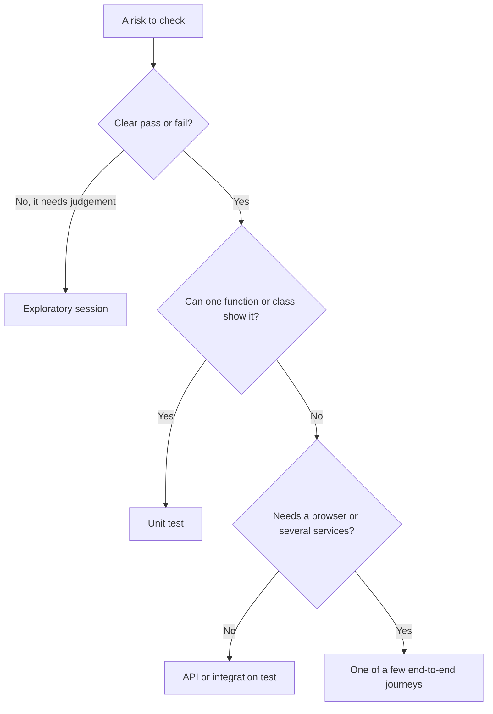
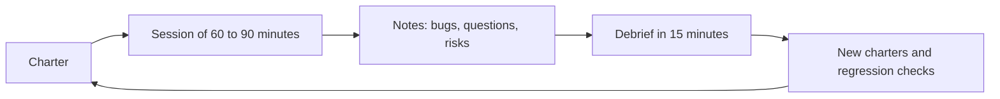

# Module 5 — Strategy and delivery

*Modules 2 to 4 gave Najm Bank's Quality Engineering team the techniques for testing code, interfaces and qualities. This module answers the questions that sit above any single test: how much testing is enough, where in the delivery process each check should run, and how testers work with the people who build and use the product. Lesson 5.1 turns risk into a test strategy, a suite shape and a few honest metrics, and shows why a coverage target is a trap. Lesson 5.2 wires those tests into a fast pipeline, polices flaky tests, and extends testing into production with feature flags, canaries and synthetic checks. Lesson 5.3 covers the human side: exploratory sessions that find what scripts cannot predict, whole-team quality in agile squads, BDD and the shared examples that make it worthwhile, and how to influence developers without authority. You will follow Rashid, Bilal, Amal and Nada on [the course's sample system](https://github.com/Tamoura/system-design-for-vibe-coders/tree/main/testing/sample). The AI thread: agents multiply the code and the tests you must judge, so strategy now includes a policy for both, and the pipeline is where that policy is enforced.*

> **Focus:** Strategy, Delivery — deciding what to test and how much, wiring tests into the pipeline and production, and working with the people who build and use the product.

---

# 5.1 — Test strategy and planning: risk-based testing, the test pyramid and quality metrics
*Level: 🟡 Intermediate* · *Prerequisites: 1.1, 2.3, 3.2* · *Focus: Strategy*

## ⚡ In 60 seconds
- A **test strategy** is the standing approach: what you test, at which level, who owns it. A **test plan** applies it to one release. Keep the strategy to a page.
- **Risk-based testing** scores areas by likelihood × impact (1 to 5 each); the score sets the depth. One override: a catastrophic impact is never "light".
- Shape the suite for where bugs live: the pyramid by default. The **ice-cream cone**, mostly slow UI tests, is the anti-pattern.
- Measure outcomes (escaped defects, time to feedback, flake rate), not activity (test counts, coverage targets). A measure turned into a target gets gamed.
- In the AI era add a policy for agent-written code and tests, and eval gates for AI features.

## 🧭 Why it matters
Rashid asks Nada for "the test strategy" for next quarter's Transfers work. She returns with 38 pages and a Gantt chart. No squad reads it. That month, in an invented story, release 2026.09 passes its gate with 1,800 tests and 90% line coverage, because the gate was a coverage target and an agent filled it with tests that assert nothing. In production a retry after a lost reply debits some customers twice. Duplicate submit is Transfers' riskiest part, and nobody tested it.

Rashid's questions are the strategy. Which five things must never break? Where does the first check for each live? How soon will we know about a bad merge? What are we choosing not to test, and who accepted that? Agents let squads open more pull requests than QE can read, so the strategy must say what earns trust.

## 📐 How it works

### 🟢 The essentials

**Strategy versus plan.** A strategy answers "how do we test here, in general?": risk and depth rules, levels and owners, environments and data, automation rules, metrics, AI policy. It is reviewed each quarter: "Deep areas get a charter every release." A plan answers "what do we test for this release, and when?": scope, schedule, people, this release's risks. It is written per release: "2026.10 changes the cut-off code, so Amal runs the cut-off charter on Tuesday."

**Risk-based testing.** You cannot test everything (principle 2, lesson 1.1), so spend effort where failure hurts. **Risk = likelihood × impact**: how likely is a defect here, and how bad if it escapes? Nada and Rashid score the Transfers areas with the squad, each factor from 1 to 5. A script turns scores into depth, so the rule is written down, not a mood.

```python
# risk.py
RISKS = [   # (area, likelihood 1-5, impact 1-5), scored by the squad and QE in refinement
    ("Duplicate submit and retries", 3, 5),
    ("Cut-off, time zone and value date", 4, 3),
    ("Daily and per-transfer limits", 3, 4),
    ("Authorisation: own accounts only", 2, 5),
    ("Fee calculation and rounding", 3, 3),
    ("Arabic right-to-left transfer form", 3, 3),
    ("Notification text", 3, 2),
    ("Recovery after a crash mid-transfer", 1, 5),
    ("Statement PDF layout", 2, 1),
]


def depth(likelihood: int, impact: int) -> str:
    score = likelihood * impact
    if score >= 10 or impact == 5:        # override: a catastrophic impact is never "light"
        return "Deep"
    if score >= 7:
        return "Standard"
    return "Light" if score >= 3 else "Smoke"


if __name__ == "__main__":
    for area, l, i in sorted(RISKS, key=lambda r: -r[1] * r[2]):
        print(f"{l * i:>3}  {depth(l, i):<8} {area}")
```

```text
 15  Deep     Duplicate submit and retries
 12  Deep     Cut-off, time zone and value date
 12  Deep     Daily and per-transfer limits
 10  Deep     Authorisation: own accounts only
  9  Standard Fee calculation and rounding
  9  Standard Arabic right-to-left transfer form
  6  Light    Notification text
  5  Deep     Recovery after a crash mid-transfer
  2  Smoke    Statement PDF layout
```

Duplicate submit scores 15 (3 × 5), the top. Crash recovery scores only 5 because it is rare, but its impact is 5, so the override lifts it to Deep; without it, multiplication hides rare disasters. **Deep** means boundary and property tests, an API negative and authorisation matrix, one end-to-end journey, an exploratory charter every release, a mutation score gate on changed code (lesson 2.3) and a production alert. **Standard**: unit tests for the rules, API happy and error cases, an exploratory pass when the area changes. **Light**: a few unit tests plus API smoke tests. **Smoke**: one check at release, no upkeep.

**Weak versus strong.** Weak: "Regression pack: 600 end-to-end cases on every change, statement layout included." Slow, equal for everything, blind to the top risk. Strong: duplicate submit gets a unit test, an API test for the double submit, a property test, a charter, and an alert on two identical transfers within a minute. **When not to:** a one-line copy change needs no register. Scoring is judgement: two people scoring separately and arguing about gaps is the value, and a weighted model is false precision.

**Pyramid, trophy, honeycomb.** Shapes of emphasis, not laws. The **pyramid** (Mike Cohn; Martin Fowler) wants many unit tests, fewer integration tests, few end-to-end tests; it suits rule-heavy back ends such as fees and limits. Kent C. Dodds's **trophy** and Spotify's **honeycomb** put most weight on integration tests: the trophy for front ends where components cooperate, the honeycomb for many small services. All say: test where the bug lives, as cheaply as you can. The anti-pattern is the **ice-cream cone**: a few unit tests under a mountain of slow UI tests.



Every level needs an owner, or it rots. Unit and integration tests: developers, on Bilal's framework. Contract tests: the consumer and provider squads, gating deploys. End-to-end: Bilal's team keeps the framework, squads own their journeys. Exploratory: Amal with the whole team (lesson 5.3). Production checks: Maha's SRE team with QE (lesson 5.2).

### 🟡 Going deeper

**Entry and exit criteria, definition of done.** **Entry criteria** say when testing may start: build in QA, smoke green, data loaded. **Exit criteria** say when it may stop, as evidence, not a date: no open Sev1 or Sev2 unless a named owner accepts it in writing; every Deep area green on this build; rollback rehearsed. The **definition of done** is the same idea for one story: reviewed, tests that fail without the change, logs and alerts added, Arabic and accessibility checked if the screen changed.

**Environments and data.** The strategy adds rules that stop lesson 0.3's four environments rotting: staging mirrors production's versions and configuration; QA is booked, because two squads on one build cause flaky runs; data is synthetic or masked with Sara's approval, and never enters an external AI tool.

**Automation strategy.** Automate what is stable, high-risk, deterministic and run often. Leave alone one-offs, screens that change weekly and judgement calls such as "does this feel trustworthy?". Count the return: a 20-minute manual check run twice a week costs 40 minutes a week. Automating it takes 3 hours plus about 15 minutes a month of upkeep, so it saves about 36 minutes a week and pays back in five weeks, unless the screen is redesigned next month.

**Metrics that help, metrics that mislead.**

| Measure | Question it answers | Watch out for |
|---|---|---|
| **Defect escape rate** | Of a release's defects, what share did customers find first? Escapes ÷ (found before + escapes) in a fixed window such as 30 days: 2 ÷ (23 + 2) = 8% | A trend, never a target: targets make people stop logging |
| **Time to feedback** | How long from push to a trusted pass or fail? p50 and p95 of pull-request checks | Averages hide the slow tail |
| **Flake rate** | What share of CI runs went red, then green, on the same commit? | Retries hide it; count them (lesson 5.2) |
| **MTTD, MTTR** | Mean time to detect a fault; mean time to restore service | Means hide long tails |

The DORA research programme's classic four are deployment frequency, lead time for changes, change failure rate (the share of deployments needing a fix or rollback) and time to restore service; recent reports refine the names, so check dora.dev. Test counts, "bugs found per tester", pass rate and raw coverage targets are vanity metrics. **Goodhart's law**, in Marilyn Strathern's wording: when a measure becomes a target, it ceases to be a good measure. Here is that story in miniature on the sample: an agent told to reach the target writes this booster:

```python
# tests/test_booster.py -- written to hit a coverage target. It asserts nothing.
from datetime import datetime
from zoneinfo import ZoneInfo

from najm.transfers import TransferRejected, TransferService, check_transfer, value_date

REQ = {"from_account": "acc-1", "to_account": "acc-2", "amount": "100.00", "currency": "QAR", "kind": "domestic"}


def test_coverage_booster():
    for amount, kind, sent in [("5000", "domestic", "0"), ("90", "international", "0"), ("30000", "own", "0"),
                               ("0.5", "own", "0"), ("100", "own", "49950"), ("10.005", "own", "0"), ("10", "wire", "0")]:
        try:
            check_transfer(amount, "QAR", kind, sent)
        except TransferRejected:
            pass
    value_date(datetime(2026, 10, 5, 16, tzinfo=ZoneInfo("Asia/Qatar")))
    svc = TransferService()
    svc.submit("alice", REQ, "k1")
    svc.submit("alice", REQ, "k1")
```

Against it, three exact tests:

```python
# tests/test_strong.py
from decimal import Decimal

import pytest

from najm.transfers import TransferRejected, check_transfer, fee


def test_international_fee_rounds_half_up():
    assert fee("3090", "QAR", "international") == Decimal("10.82")


def test_a_day_total_of_exactly_the_limit_is_allowed():
    assert check_transfer("1000", "QAR", "domestic", sent_today="49000").total == Decimal("1000.00")


def test_a_day_total_just_over_the_limit_is_refused():
    with pytest.raises(TransferRejected) as e:
        check_transfer("1000.01", "QAR", "domestic", sent_today="49000")
    assert e.value.code == "daily_limit_exceeded"
```

Measured per file, `pytest tests/test_booster.py --cov=najm.transfers --cov-branch`, then with each of the five `NAJM_BUGS` on:

| Suite | Tests | Coverage | Seeded bugs caught, of 5 |
|---|---|---|---|
| The booster above | 1 | 74% | 0 |
| The three exact tests | 3 | 43% | 2 (`float_fee`, `limit_off_by_one`) |

```text
# trimmed output
$ NAJM_BUGS=float_fee pytest tests/test_booster.py tests/test_strong.py
E       AssertionError: assert Decimal('10.81') == Decimal('10.82')
FAILED tests/test_strong.py::test_international_fee_rounds_half_up
1 failed, 3 passed
```

The booster scored higher and caught nothing; three small tests scored lower and caught two bugs. Neither suite is enough: the three misses (`tz_cutoff`, `no_idempotency`, `bola`) all sit in Deep areas, so the register says where the next tests go. Coverage finds code no test runs; it is never a goal. Pair it with the mutation score (lesson 2.3).

**Reporting quality.** Stakeholders want a decision, not a log. The one-page dashboard has five blocks: a headline (ship, ship with conditions or hold) with reasons and an owner; four outcome numbers with trends (escape rate, change failure rate, p95 time to feedback, flake rate); a risk map with each Deep or Standard area green, amber or red by evidence; open Sev1 and Sev2 by age, with accepted risks and expiry dates; and what was **not** tested. Weak: "1,812 tests passed (100%)." Strong: "Four Deep areas green, one amber (cut-off not exercised on a Friday evening); two Sev2 open with owners; last escape rate 8%." The second can be checked and challenged, so it can be trusted.

### 🔴 Expert view

**Regulated context.** A bank must evidence testing and change control: which requirement, which test, which build, what result, who approved. Code-first teams get **traceability** cheaply by tagging tests with requirement IDs:

```python
# conftest.py. Needs "junit_family = xunit1" in pytest.ini (xunit2 warns) and a declared "req" marker
import pytest


@pytest.fixture(autouse=True)
def requirement(request, record_property):
    marker = request.node.get_closest_marker("req")
    if marker:
        record_property("requirement", marker.args[0])    # appears as a <property> in the JUnit XML
```

Mark a test `@pytest.mark.req("TRF-212")`, run `pytest --junitxml=report.xml`, and the XML links requirement and result. **PCI DSS** (version 4.x at the time of writing) has requirements on testing changes before production, vulnerability scanning and penetration testing. The **EU's DORA**, the Digital Operational Resilience Act (Regulation (EU) 2022/2554), applies from January 2025 and includes resilience testing, with threat-led penetration testing for significant entities. Compliance owns the mapping to clauses; QE supplies the evidence.

**AI-era additions.** Three rules, previewing Modules 6 and 7. **Code written by agents** is new, unreviewed code: small diffs, and a higher likelihood score in Deep areas until evidence says otherwise ([*System Design for Vibe Coders*, lesson 9.4 — Verification before completion](../vibe/index.en.html#l9-4)). **Tests written by agents** are owned by a human, reviewed separately from the code they cover, and judged by whether they can fail (lessons 6.1 and 6.2). An **AI feature** such as Najm Assist ships only past an **eval gate**: a golden set, thresholds and a regression check in CI (lesson 7.1; see [*AI Product Management*, lesson 6.1 — Quality you can measure: metrics, golden sets and error analysis](../aipm/index.html#/6.1)).

## 🧰 The toolkit
| Tool, practice or technique | What it is and does | When to reach for it |
|---|---|---|
| **Risk-based testing** | Scores areas by likelihood × impact and sets test depth by score | Every refinement; deciding where the next test hour goes |
| **Test pyramid** (Mike Cohn; Martin Fowler) | Many unit tests, fewer integration tests, few end-to-end tests | The default shape; diagnosing a slow, brittle suite |
| **Testing trophy and honeycomb** | Shapes that weight integration tests (Kent C. Dodds; Spotify) | Front-end code, or many small services |
| **Definition of done** | A shared checklist that makes a story finished, tests included | Every team, every story |
| **DORA metrics** | Delivery measures such as lead time and change failure rate | Showing whether speed and quality rise together |
| **Test management tools** (Xray, Zephyr, TestRail, Azure DevOps Test Plans) | Store cases, link requirements, keep evidence; the risk is a second source of truth that drifts, so feed in CI results and give every case an owner | Audit trails and large manual suites |

## 🏛️ In practice at Najm Bank
Rashid and the squad leads publish **Najm Test Strategy v1**: one page, reviewed each quarter and after every Sev1 or Sev2. The numbers are starting points to adjust.

| Section | What it says |
|---|---|
| Purpose | Transfers never lost, duplicated or mis-rounded; Najm Assist never invents policy; release often, with evidence |
| Risk and depth | The register in `risk.py`, re-scored each quarter. Deep: duplicate submit, cut-off, limits, authorisation, crash recovery |
| Levels and owners | As above. End-to-end journeys: at most 15 |
| Environments, data | Dev, QA, staging, production. Synthetic data; none in external AI tools |
| Entry, exit | Entry: build in QA, smoke green. Exit: no open Sev1 or Sev2 without a named acceptance; Deep areas have evidence |
| Automation | Stable, high-risk, frequent; an owner per test; flaky tests quarantined in one working day, 14-day deadline |
| Metrics | Escape rate trend, p95 time to feedback (target 10 minutes), flake rate with retries counted, MTTR. Coverage reported, not targeted. Never used to rank people |
| AI policy | Humans own agent-written tests; at least 80% mutation score on changed money, limit and date code; AI features pass an eval gate |
| Reporting, gaps | The five-block dashboard each release, with accepted gaps, owners and expiry dates |

## 🛠️ Exercises
Copy `testing/sample` and use the venv from lesson 0.3 (`pytest-cov` is already in `requirements.txt`).

- 🟢 Pick a feature you know (a login, a booking form) and score at least eight areas in `risk.py`. *Done when:* every area has a depth, your top three name the level of their first check, and one row is lifted to Deep by the override.
- 🟡 Reproduce the Goodhart table. Write a no-assertion booster for `najm/transfers.py`, measure it alone with `pytest tests/test_booster.py --cov=najm.transfers --cov-branch`, and run it under each of the five `NAJM_BUGS`, one at a time. Add three exact tests and repeat. *Done when:* you have coverage and bugs caught for both suites, and two sentences on why the higher number was the worse suite.
- 🔴 Write a one-page strategy (under 400 words) for the sample system, Transfers and Najm Assist, plus a table mapping all nine seeded bugs (five in `NAJM_BUGS`, four in `NAJM_AI_BUGS`) to the level that should catch each and whether your suite does. *Done when:* every bug has a level and a yes or no, one line of the strategy changed because of a "no", and every level has an owner.

## ⚠️ Mistakes and traps
- **A strategy nobody reads.** Write one page with owners and numbers.
- **Equal effort everywhere.** The statement layout gets duplicate submit's suite. Let the score decide.
- **A coverage or test-count target.** The number rises and protection falls. Judge suites with seeded bugs and mutation scores.
- **Ranking people by bugs found.** It buys trivial and duplicate bugs. Use team outcomes.
- **Two DORAs.** The research metrics and the EU's resilience act share an acronym, nothing else.

## 🧾 Recap
- A strategy is the standing one-page approach; a plan applies it to one release.
- Risk = likelihood × impact sets depth, with an override for catastrophic impact.
- Put each check at the cheapest level that can show the risk, give each level an owner, and avoid the ice-cream cone.
- Exit on evidence, automate by return, measure outcomes, and report what was not tested.
- For AI, add a policy for agent-written code and tests, and eval gates for AI features.

## ✍️ Check yourself

**1. Crash recovery during a transfer scores likelihood 1 and impact 5, a score of 5. The squad wants "light" testing. What does the strategy say?**

- A. Light, because the score of 5 is below the Standard band
- B. Deep, because the override lifts any impact of 5 to Deep
- C. Smoke, because a failure this rare is not worth a suite
- D. Standard, as a compromise between the squad and the rule

<details><summary>Answer</summary>

**B.** The override exists because multiplication hides rare disasters. A, C and D let the score or rarity decide. (🟢 Risk-based testing.)

</details>

**2. Release 2026.09 has 90% line coverage and passes its gate, yet duplicate transfers reach customers. What is the best reading?**

- A. The coverage tool is broken and needs replacing
- B. Coverage must reach 95% before the gate is trusted
- C. The team did not write enough unit tests
- D. Coverage shows what ran, not what was checked

<details><summary>Answer</summary>

**D.** A target invites tests that run code and assert nothing. A and B keep the target; C counts tests, not checks. (🟡 Metrics.)

</details>

**3. The mobile squad has 40 unit tests, 15 API tests and 600 UI tests. The pipeline takes 55 minutes and fails randomly. What is the best first move?**

- A. Move the rule checks that need no screen down to API tests
- B. Add more workers so the 600 UI tests finish much sooner
- C. Rerun failed UI tests automatically until the build is green
- D. Delete the oldest UI tests to reach a round number

<details><summary>Answer</summary>

**A.** An ice-cream cone: moving checks down makes them faster and steadier. B treats the symptom, C hides flakes, D deletes by age. (🟢 Pyramid, trophy, honeycomb.)

</details>

**4. A manager proposes a bonus for the tester who files the most bugs. What is the likely result?**

- A. More real bugs are found, because testers dig harder for the bonus
- B. Higher quality overall, because testers are now properly motivated
- C. Padding: many trivial and duplicate reports, so the count rises
- D. Developers reject reports outright, so fewer bugs are filed

<details><summary>Answer</summary>

**C.** Once bug count is the target, people optimise the count. A and B assume it stays honest; D contradicts the incentive. (🔴 Metrics.)

</details>

**5. An agent's pull request changes the daily-limit code and its tests. What should the strategy require?**

- A. Merge it if the suite is green, because the agent updated the tests
- B. Reject it, because agents must never touch any test file
- C. Accept it if line coverage on the changed lines is at least 90%
- D. Review the test changes separately and check the mutation score

<details><summary>Answer</summary>

**D.** An agent can weaken a test to match its code; the mutation score shows whether tests can fail. A trusts the agent, B bans a useful practice, C uses coverage an empty test can fill. (🔴 AI-era additions.)

</details>

## 📚 References
- ISTQB Certified Tester Foundation Level syllabus (v4.0, 2023): [istqb.org](https://www.istqb.org/)
- Martin Fowler's TestPyramid note and Ham Vocke's "The Practical Test Pyramid", both on [martinfowler.com](https://martinfowler.com/)
- Google Testing Blog, on the limits of end-to-end tests: [testing.googleblog.com](https://testing.googleblog.com/)
- *Software Engineering at Google* (2020): [abseil.io/resources/swe-book](https://abseil.io/resources/swe-book)
- DORA research programme: [dora.dev](https://dora.dev/)
- EU Regulation (EU) 2022/2554 on digital operational resilience: [eur-lex.europa.eu](https://eur-lex.europa.eu/)
- pytest documentation: [docs.pytest.org](https://docs.pytest.org/)

---

# 5.2 — Testing in CI/CD and in production: fast pipelines, flaky-test policy, feature flags, canaries and synthetic monitoring
*Level: 🟡 Intermediate* · *Prerequisites: 2.3, 3.2, 5.1* · *Focus: Delivery, Reliability*

## ⚡ In 60 seconds
- A **pipeline** orders checks by cost: cheap and fast first, slow and broad later. Each stage answers one question.
- Set a **feedback budget** and defend it. Najm's: 95% of pull-request checks finish within 10 minutes. Cache, parallelise and shard before buying bigger machines.
- A **flaky test** passes and fails on the same code. Detect it, quarantine it with an owner and a deadline, fix it, and report every retry.
- **Shift-right** adds evidence from real traffic: flags, canaries, synthetic checks, traces. It never replaces pre-production testing, and needs a kill switch.
- Biggest trap: muting a "flaky" test that is really a race condition.

## 🧭 Why it matters
Bilal's pipeline for the Najm Mobile API takes 31 minutes. One end-to-end test, "double-tapping Send creates one transfer", fails about one run in six. Developers press re-run, and the pipeline retries failures twice, so it ends green. The test is not flaky: it is finding the real race that lesson 3.1 hunts, two simultaneous requests with one idempotency key. Three weeks later, in this invented story, a deploy leaves a few customers debited twice. Production has no canary or synthetic check, so the first signal is a phone call.

## 📐 How it works

### 🟢 The essentials

**Stages.** Each stage answers one question, where its checks are cheapest.

| Stage | Question | Typical checks |
|---|---|---|
| Pre-commit | Did I break the basics? | Format, lint, nearby unit tests |
| Pull request | Safe to merge? | Unit, API, contract, scans, a few smoke journeys |
| Merge | Does `main` still work? | Build once, deploy to QA, journeys |
| Nightly | Is anything rotting? | Long suites, random-order repeats |
| Pre-release | Are we ready? | Performance, security, rollback rehearsal, UAT |
| Post-deploy | Did it land safely? | Smoke, canary analysis, synthetic checks |

**Feedback budgets.** Slow checks get skipped, so write the budget down (Najm: 95% of pull-request checks within 10 minutes), graph the p95, and when a new check breaks it, move something: to parallel jobs, after the merge or overnight. [*Cloud & DevOps*, lesson 4.1 — Continuous integration: pipelines, tests, artefacts and fast feedback](../cloud/index.html#/4.1) covers the mechanics; [*System Design for Vibe Coders*, lesson 8.3 — CI preflight and the boy-who-cried-wolf check](../vibe/index.en.html#l8-3) the solo-builder version.

**Parallelism, sharding, caching.** Three levers, cheapest first: cache dependencies; run in parallel on one machine (`pytest -n auto` with pytest-xdist, Playwright workers); split the suite across machines in **shards**. **When not to:** a suite that runs in two minutes gains little, because every shard repeats the set-up. The sample's two browser tests would not justify three shards (the empty third simply passes); read the numbers as a template. This workflow, for a repository holding a copy of the sample, runs Python in four shards and Playwright in three. A `gate` job is the one check branch protection requires, so renaming a shard breaks nothing. Merge the downloaded blob reports later with `npx playwright merge-reports --reporter html ./all-blob-reports`.

```yaml
# .github/workflows/ci.yml   (lint with actionlint; action major versions move on)
name: ci
on:
  pull_request:
  push:
    branches: [main]

permissions:
  contents: read

jobs:
  python:
    name: python, shard ${{ matrix.shard }} of 4
    runs-on: ubuntu-latest
    timeout-minutes: 10
    strategy:
      fail-fast: false            # every shard reports
      matrix:
        shard: [1, 2, 3, 4]
    steps:
      - uses: actions/checkout@v4
      - uses: actions/setup-python@v5
        with:
          python-version: "3.12"
          cache: pip
      - run: pip install -r requirements.txt pytest-xdist
      - run: pytest -n auto --shard ${{ matrix.shard }}/4 --durations=5

  e2e:
    name: playwright, shard ${{ matrix.shard }} of 3
    runs-on: ubuntu-latest
    timeout-minutes: 15
    strategy:
      fail-fast: false
      matrix:
        shard: [1, 2, 3]
    steps:
      - uses: actions/checkout@v4
      - uses: actions/setup-python@v5
        with:
          python-version: "3.12"
          cache: pip
      - run: pip install -r requirements.txt
      - uses: actions/setup-node@v4
        with:
          node-version: 22
          cache: npm              # needs a committed package-lock.json
      - run: npm ci
      - run: npx playwright install --with-deps chromium
      - run: npx playwright test --config e2e/playwright.config.ts --shard=${{ matrix.shard }}/3 --reporter=blob
      - uses: actions/upload-artifact@v4
        if: ${{ !cancelled() }}
        with:
          name: blob-report-${{ matrix.shard }}
          path: blob-report

  gate:
    needs: [python, e2e]
    if: ${{ always() }}
    runs-on: ubuntu-latest
    steps:
      - run: test "${{ needs.python.result }}" = "success" && test "${{ needs.e2e.result }}" = "success"
```

Playwright has `--shard` built in; pytest does not, so the Python job needs a few lines. On the sample's 24 tests they give shards of 8, 6, 6 and 4 that together cover the suite exactly once:

```python
# conftest.py (repository root)
import zlib


def pytest_addoption(parser):
    parser.addoption("--shard", default=None)       # for example 2/4


def pytest_collection_modifyitems(config, items):
    spec = config.getoption("--shard")
    if not spec:
        return
    index, total = (int(part) for part in spec.split("/"))
    keep, drop = [], []
    for item in items:
        (keep if zlib.crc32(item.nodeid.encode()) % total == index - 1 else drop).append(item)
    config.hook.pytest_deselected(items=drop)
    items[:] = keep
```

**Weak versus strong.** Weak: `hash(item.nodeid) % total`. Python randomises string hashes per process, so separate shard jobs disagree: a test can land in two shards and another in none, while everything stays green. Strong: a stable hash, plus a check that the shards' test IDs together equal the full suite (exercise 🟢).

### 🟡 Going deeper

**Test selection.** If a suite is still too slow, run only what a change can affect. Playwright's `--only-changed` runs test files changed since a Git ref, including specs that import a changed file. pytest has plugins such as `pytest-testmon`. Selection can miss configuration and wiring, so an unmapped change runs everything, and the full suite still runs nightly.

**Flaky-test policy.** **Detect**: count tests that go red then green (Playwright marks them `flaky` yet exits 0; `--fail-on-flaky-tests` makes them fail), and use `--repeat-each` on suspects. **Quarantine** within one working day: tag the test `@quarantine`, run it in a non-blocking job (`--grep @quarantine`), exclude it from the blocking job (`--grep-invert @quarantine`), and record an owner, a ticket and a 14-day deadline (lesson 2.3). **Fix**: when the deadline passes, the test blocks again or is deleted. This script reads Playwright's JSON report and the register, and fails when a deadline has passed:

```python
# tools/flake_gate.py   usage: python tools/flake_gate.py results.json quarantine.json
# quarantine.json: [{"test": "...", "owner": "nada", "issue": "QE-377", "until": "2026-10-02"}]
import datetime
import json
import sys


def flaky(suite):
    for spec in suite.get("specs", []):
        for test in spec["tests"]:
            if test["status"] == "flaky":          # failed, then passed on retry
                yield spec["title"]
    for child in suite.get("suites", []):
        yield from flaky(child)


results, register = (json.load(open(path)) for path in sys.argv[1:3])
titles = [title for suite in results["suites"] for title in flaky(suite)]
stats = results["stats"]
print(f"retried green: {len(titles)} of {stats['expected'] + stats['unexpected'] + stats['flaky']} tests", titles)
late = [e for e in register if datetime.date.fromisoformat(e["until"]) < datetime.date.today()]
for e in late:
    print(f"quarantine expired: {e['test']} (owner {e['owner']}, {e['issue']}, due {e['until']})")
sys.exit(1 if late else 0)
```

```text
retried green: 1 of 1 tests ['exchange rate banner appears @quarantine']
quarantine expired: exchange rate banner appears @quarantine (owner nada, QE-377, due 2026-10-02)
```

The exit code stays 1 until someone fixes the test or renews the quarantine in a reviewed change. First ask whether the test is flaky or right: Bilal's was right.

**Ephemeral environments and service virtualisation.** An **ephemeral environment** is a short-lived copy of the system for one pull request: no QA queue, but cost, start-up time and data seeding. **Service virtualisation** replaces dependencies you cannot or should not call (a card network, an FX provider, an SMS gateway); WireMock and MockServer replay stubbed behaviour, including slow replies and 500s. A virtual service agrees with your assumptions, so keep it honest with contract tests (lesson 2.2).

**Deployment gates.** A **contract gate**: `pact-broker can-i-deploy --pacticipant najm-mobile --version "$GIT_SHA" --to-environment production` fails if the contracts are not verified against what production runs (it needs a Pact Broker). **Smoke tests** after each deploy: a few read-only checks, such as a synthetic customer's balance. Weak: `GET /health` returns 200, which passes while the old version still serves. Strong: it also compares the build SHA with the deployed one (a testability request, lesson 5.3). An **SLO gate**: do not promote while the error budget is burning ([*Cloud & DevOps*, lesson 5.2 — SLOs, error budgets, alerting and on-call that people can sustain](../cloud/index.html#/5.2)).

### 🔴 Expert view

**Feature flags.** A **feature flag** separates deploying code from releasing a behaviour. OpenFeature is an open, vendor-neutral flag-evaluation API with SDKs in several languages. Rules: test both states, because the off path is what you roll back to; make the code default the value you can live with when the flag service is down (for this existing feature's kill switch, on), and test a provider that knows nothing; remove flags once rolled out; test interacting flags in pairs (lesson 1.2), not every combination. This runs on the sample with the Python SDK (tested with version 0.10.0; names can change between releases):

```python
# tests/test_flags.py   (pip install openfeature-sdk)
import pytest
from openfeature import api
from openfeature.provider.in_memory_provider import InMemoryFlag, InMemoryProvider

from najm.transfers import TransferRejected, check_transfer


def check_with_switch(amount, currency, kind):
    if kind == "international" and not api.get_client().get_boolean_value("international-transfers", True):
        raise TransferRejected("temporarily_unavailable")
    return check_transfer(amount, currency, kind)


@pytest.mark.parametrize("variant, allowed", [("on", True), ("off", False)])
def test_the_kill_switch_in_both_states(variant, allowed):
    api.set_provider(InMemoryProvider({"international-transfers": InMemoryFlag(variant, {"on": True, "off": False})}))
    if allowed:
        assert str(check_with_switch("3090", "QAR", "international").fee) == "10.82"
    else:
        with pytest.raises(TransferRejected):
            check_with_switch("3090", "QAR", "international")


def test_a_provider_that_knows_nothing_gets_the_code_default():
    api.set_provider(InMemoryProvider({}))          # flag service down, or flag never created
    assert str(check_with_switch("3090", "QAR", "international").fee) == "10.82"
```

**Canary analysis.** A **canary** sends a small share of real traffic to the new version and compares it with the stable one over the same window. Argo Rollouts, Flagger and Kayenta automate this. The idea fits in a function, and its first line matters most:

```python
# canary.py
def canary_verdict(baseline, canary, min_requests=1500, extra_error_rate=0.002, max_p95_ratio=1.2):
    """Arguments are dicts with requests, errors and p95_ms. Returns wait, rollback or promote."""
    if canary["requests"] < min_requests:
        return "wait"                      # a quiet canary has proved nothing
    base_rate = baseline["errors"] / baseline["requests"]
    canary_rate = canary["errors"] / canary["requests"]
    if canary_rate > base_rate + extra_error_rate:
        return "rollback"
    if canary["p95_ms"] > baseline["p95_ms"] * max_p95_ratio:
        return "rollback"
    return "promote"
```

Against a stable version with 40,000 requests, 40 errors (a 0.10% rate) and p95 of 310 ms:

| Canary requests | Errors | p95 | Verdict |
|---|---|---|---|
| 2,000 | 2 | 320 ms | promote |
| 2,000 | 12, a 0.60% rate | 315 ms | rollback |
| 2,000 | 2 | 480 ms | rollback |
| 200 | 0 | 300 ms | wait |

The last row is the lesson. With zero errors in n requests, a rough 95% upper bound on the true error rate is 3/n (the "rule of three"). At 200 requests that is 1.5%, fifteen times the stable rate, so a clean 200 proves nothing; at 1,500 it is 0.2%, where the default comes from. Delete the first `if` and the last row returns `promote`. Real tools use proper statistics.

**Synthetic monitoring.** A **synthetic check** runs a scripted journey against production on a schedule and alerts on failure, so you hear before customers do. It is lesson 3.2's journey with three differences: it runs continuously, its URL comes from configuration with no default (a missing value fails loudly instead of testing the wrong system), and it uses a dedicated synthetic customer. Schedule it with a GitHub Actions `schedule` trigger (runs can start late), a monitoring product or a CronJob.

```typescript
// synthetic/transfer.spec.ts
import { test, expect } from '@playwright/test';

test('a synthetic customer can send 1.00 QAR', async ({ page }) => {
  await page.goto('/app');
  await page.getByLabel('Amount').fill('1.00');
  await page.getByRole('button', { name: 'Send transfer' }).click();
  await expect(page.getByRole('status')).toContainText('Transfer sent', { timeout: 8_000 });   // the journey's time budget
});
```

Its config sets `baseURL: process.env.BASE_URL`, one retry that is reported, `trace: 'retain-on-failure'` and an `x-synthetic-check` header, so logs and dashboards can tell it from customers. Run it against your own copy of the sample with `BASE_URL=http://127.0.0.1:8000`; it moves exactly 1.00 QAR. In production that is real money, so it needs a synthetic account pair, a daily cap, exclusion from regulatory files and statements, and approval from Compliance and Sara.

**Observability-driven debugging.** A failing check should say why: keep the Playwright trace, name the build SHA and send a W3C `traceparent` header so the backend trace links up ([*Cloud & DevOps*, lesson 5.1 — Telemetry: logs, metrics, traces and OpenTelemetry](../cloud/index.html#/5.1)).

**Testing in production, safely.** Shift-right is controlled experiment, not a licence to skip staging. **Dark launch**: deploy code switched off and exercise it with staff. **Shadow traffic**: mirror real requests to the new version, compare answers and discard its replies; mirror reads and quotes, never writes. **Test accounts**: flagged, capped, excluded from reports. **Kill switch**: a flag with a named owner, drilled each quarter; an untested one is a hope.

**Rollback tests.** A rollback is a deploy of the previous version, so rehearse it: in staging deploy N, create data, deploy N-1, run smoke tests and read what N wrote. Check migrations, flag defaults and message formats stay compatible ([*Cloud & DevOps*, lesson 4.2 — Release strategies: rolling, blue-green, canary, feature flags and rollback](../cloud/index.html#/4.2); [*System Design for Vibe Coders*, lesson 4.4 — Rollback, staging, and release gates](../vibe/index.en.html#l4-4)).

**AI-era note.** Agents open more pull requests, so feedback time matters more. An agent told to "make CI green" may edit the workflow or tests: put both under CODEOWNERS review.

## 🧰 The toolkit
| Tool, practice or technique | What it is and does | When to reach for it |
|---|---|---|
| **GitHub Actions** | CI in YAML: matrix jobs, caching, artefacts, schedules | The workflow above; free for public repositories at the time of writing |
| **pytest-xdist and Playwright sharding** | Parallel workers on one machine; `--shard=x/y` and blob reports across machines | A suite that outgrows one worker |
| **Flaky-test quarantine** | A register with owner, ticket and deadline | A test that passes and fails on the same code |
| **OpenFeature** | A vendor-neutral API for evaluating feature flags | Kill switches and gradual releases |
| **Canary analysis** (Argo Rollouts, Flagger) | Compares new-version traffic with the stable one | Every production release of a busy service |
| **Synthetic monitoring** | A scheduled, scripted journey against production | Hearing about a broken journey first |

## 🏛️ In practice at Najm Bank
Bilal and Maha publish the **Najm Release Test Gates v1**, a table every pipeline implements. Budgets are starting points.

| Gate | Where | Blocks | Budget | Owner |
|---|---|---|---|---|
| Lint, unit, API, contract, quarantine check | Pull request | Merge | 10 min at p95 | Squad |
| End-to-end journeys (at most 15) | QA, after merge | Staging | 20 min | Squad, Bilal |
| Performance, security, rollback rehearsal | Staging | Release | As scheduled | Maha, Noura, QE |
| `can-i-deploy` and smoke tests | Around each deploy | Rollout | 5 min | Squad |
| Canary verdict | 5% then 25% of traffic | Full rollout | 30 min per step | Maha |
| Synthetic transfer journey | Production, every 15 minutes | Pages on two failures | 8 s | Maha, QE |

No whole-pipeline retries. One reported retry for browser tests. Flaky tests are quarantined within one working day, with a 14-day deadline. Every gate has an owner and a logged break-glass path.

## 🛠️ Exercises
Copy `testing/sample` and run `pip install pytest-xdist`.

- 🟢 Add the shard hook to `conftest.py` and run `pytest --shard i/4 --collect-only -q -o addopts=""` for `i` from 1 to 4. *Done when:* the four lists together equal the unsharded list with no test twice, and swapping `zlib.crc32(...)` for `hash(...)` makes runs under two `PYTHONHASHSEED` values disagree.
- 🟡 Add a deliberately flaky Playwright test (fail when `testInfo.retry === 0`) tagged `@quarantine`. Run the suite with `--grep-invert @quarantine`. Then run the quarantine job (`--grep @quarantine --retries=1 --reporter=json`, with `PLAYWRIGHT_JSON_OUTPUT_NAME=results.json`; the file lands next to the config file) and give the report and an expired register entry to the flake gate. *Done when:* the blocking run ignores the test, the gate names the retried test and the expired entry and exits 1, and a future deadline makes it exit 0.
- 🔴 Simulate shadow traffic. Start two copies of the sample, the second with `NAJM_BUGS=float_fee`, and write a script that posts the same international transfers to both (`token-alice`, a fresh `Idempotency-Key` each) and compares fees. *Done when:* it reports 10.82 against 10.81 for 3,090.00 QAR and `same` for 100.00, and one sentence says why a real shadow mirrors quotes, not submits.

## ⚠️ Mistakes and traps
- **Retry until green.** A defect report becomes a pass and the race ships. Report retries; quarantine with an owner and a deadline.
- **Shards that drop tests.** An unstable hash leaves tests unrun. Use a stable one and check coverage.
- **Everything on every pull request.** People batch changes. Set a budget; move slow suites later.
- **Trusting a quiet canary.** A clean 200 requests proves nothing. Require minimum evidence.

## 🧾 Recap
- Order the pipeline by cost, give each stage one question, and defend a written feedback budget.
- Cache, parallelise, shard and select; keep a stable shard rule and a full run nightly.
- Quarantine flaky tests with an owner and deadline, report retries, and first ask whether the test is right.
- Gates stop bad builds; flags, canaries and synthetic checks limit and reveal damage after deploy.
- Rehearse the rollback and the kill switch before you need them.

## ✍️ Check yourself

**1. A browser test fails about one run in six and the pipeline retries it twice, so the build is green. What is the best response?**

- A. Keep the retries, because the pipeline ends up passing
- B. Raise the retries to three so the build turns green more often
- C. Delete the test, because intermittent tests waste everyone's time
- D. Report the retries and look for a real race before quarantining

<details><summary>Answer</summary>

**D.** Retries hide a defect report, and an intermittent failure may be a real race. A and B keep hiding it; C discards a test that may be right. (🟡 Flaky-test policy.)

</details>

**2. A pytest sharding hook uses `hash(item.nodeid) % total`. What is the danger?**

- A. Hashes differ per process, so a test may run twice or never
- B. The remainder can be negative, so some tests get no shard
- C. Slow tests all pile into one shard, so that job runs far longer
- D. The built-in hash is far too slow for a large suite

<details><summary>Answer</summary>

**A.** Python randomises string hashes per process, so shards can disagree and tests silently go unrun. A stable hash such as `zlib.crc32` fixes it. (🟢 Parallelism, sharding, caching.)

</details>

**3. A canary has served 200 requests with no errors; the stable version has a 0.10% error rate. What should the judge return?**

- A. Promote, because the canary shows no errors at all
- B. Rollback, because there is nothing to compare it with
- C. Wait, because 200 requests is too little evidence to judge
- D. Promote, because nothing has been measured against latency

<details><summary>Answer</summary>

**C.** Zero errors in 200 requests only bounds the true rate near 1.5%, far above 0.10%. A and D accept thin evidence; B punishes a clean run. (🔴 Canary analysis.)

</details>

**4. Najm wants to test a new fee engine on real traffic without risking customers. What is safest?**

- A. Mirror real transfer submissions to the new engine and keep results
- B. Mirror fee quotes, discard the new replies and compare them
- C. Test it only in staging, since production is too risky
- D. Switch all traffic to the new engine and watch the error rate

<details><summary>Answer</summary>

**B.** Shadow traffic mirrors read-only requests and compares answers, so no customer is affected. A mirrors writes, C forgoes real evidence, D is a full release. (🔴 Testing in production, safely.)

</details>

**5. A deploy gate's only smoke test is `GET /health` returning 200. Why can it pass while the release has failed?**

- A. The old version may still be serving, so check the build too
- B. Health endpoints never return 200 while a deploy is running
- C. Smoke tests must always query the database directly themselves
- D. A single smoke test is always too slow to work as a gate

<details><summary>Answer</summary>

**A.** `/health` says something is up, not which build. Comparing the running build SHA with the deployed one shows the release landed. (🟡 Deployment gates.)

</details>

## 📚 References
- Playwright documentation on sharding, retries, reporters and CI: [playwright.dev](https://playwright.dev/docs/test-sharding)
- GitHub Actions documentation: [docs.github.com](https://docs.github.com/en/actions)
- pytest documentation, including `conftest.py` hooks: [docs.pytest.org](https://docs.pytest.org/)
- Pact documentation, including can-i-deploy: [docs.pact.io](https://docs.pact.io/)
- Google SRE resources on canarying releases: [sre.google](https://sre.google/)

---

# 5.3 — Exploratory testing, agile teams and BDD: working with developers, product owners and users
*Level: 🟡 Intermediate* · *Prerequisites: 1.3, 5.1* · *Focus: Strategy, Design*

## ⚡ In 60 seconds
- **Exploratory testing** is simultaneous learning, test design and execution. It finds what scripts cannot predict, and it is a skilled, planned activity, not random clicking.
- Plan it with a **charter** (a mission), a time box of 60 to 90 minutes, notes and a debrief. That is **session-based test management**.
- In agile teams quality is whole-team work: a **three amigos** conversation before coding, testers in refinement and planning, a shared definition of ready and done.
- **BDD** is valuable for the shared examples and the conversation that finds them; Gherkin and its tools are optional. **Example mapping** runs that conversation in 25 minutes.
- Testers earn influence without authority by bringing evidence, small asks and testability requests (logs, ids, toggles, APIs).
- Biggest trap: writing Gherkin alone, after the code, and calling it BDD.

## 🧭 Why it matters
Two days before a release, Amal gives Nada a 90-minute session on the Transfers page: "Explore the form with awkward amounts and repeated taps." The scripted suite is green. Within the hour Nada finds that a double-click on Send creates two transfers, that `1e30` leaves the page silent, and that customers see raw codes such as `currency_mismatch`. All three are real in the sample system, and no script asked those questions.

The week before, a different gap. Nada wrote Gherkin alone, from the story, after the developer finished. The product owner had meant "exactly 50,000.00 is allowed"; the developer, never asked, had coded "50,000.00 is too much". That is the seeded `limit_off_by_one` bug, and a 25-minute conversation about one example would have prevented it. This lesson is about both: finding what nobody thought of, and getting the shared understanding in before the code exists.

## 📐 How it works

### 🟢 The essentials

**Exploratory testing** is the tester learning about the product while designing and running tests, each result steering the next. Scripts check what you already know; the pesticide paradox (principle 5, lesson 1.1) says they wear out. Exploration beats scripts for a new feature, unclear requirements, usability, hunting after an incident, and anything where the question is "what could go wrong?". Scripts beat it for stable, frequent, repeatable checks. Use both. Weak: "Click around the form for an hour." Strong: a charter, a time box, notes and a debrief.

**Charters and sessions.** A **charter** states the mission: *Explore X with Y to discover Z* (Elisabeth Hendrickson, *Explore It!*, 2013). **Session-based test management** (Jonathan and James Bach) wraps it in structure: one charter, one uninterrupted session of 60 to 90 minutes, notes in three buckets as on the Bachs' session sheet (bugs, issues such as questions and risks, and notes or ideas for later), and a short debrief with a lead. Sessions, not hours of vague testing, become the unit you plan and report. Weak charter: "Test the transfer page." Strong: "Explore the amount field with awkward values to discover which ones the page accepts, rejects or ignores."



**Heuristics and tours.** A **heuristic** is a prompt that helps, not a rule that guarantees. James Bach's **SFDIPOT** lists seven product elements to vary:

| Letter | Ask | Transfers example |
|---|---|---|
| Structure | What is it made of? | The page, the API, the ledger |
| Function | What does it do? | Send, replay, reject |
| Data | What does it process? | Zero, 1e30, Arabic-Indic digits, a long name |
| Interfaces | How does it connect? | Browser to API; app to notification service |
| Platform | What does it run on? | iOS, Android, Chrome; a slow network |
| Operations | How is it really used? | A tired customer on a train, double-tapping |
| Time | When, in what order? | Before and after 15:00, a Friday, a session timeout |

**Tours** apply a theme. A **CRUD** tour creates, reads, updates and deletes each thing (a beneficiary, a limit). A **boundaries** tour revisits lesson 1.2's edges. An **interruptions** tour kills the app mid-submit, switches network, takes a call, changes the clock. James Whittaker's tours (the "money tour" follows the features that earn money) are a source of more. Keep notes as you go: what you did, what you saw, and a question mark for anything odd. A debrief then asks what was covered, what was not, what is risky and what to do next; Jonathan Bach's mnemonic is PROOF: past, results, obstacles, outlook, feelings.

### 🟡 Going deeper

**Agile testing.** The **quadrants** (Brian Marick; Lisa Crispin and Janet Gregory, *Agile Testing*, 2009) sort tests by purpose.

| | Supports the team | Critiques the product |
|---|---|---|
| **Business-facing** | Q2: examples, story tests, BDD scenarios | Q3: exploratory sessions, usability, UAT |
| **Technology-facing** | Q1: unit and component tests | Q4: performance, security, reliability |

A healthy team covers all four. An ice-cream cone (lesson 5.1) tends to be Q2-heavy and Q1-light.

**Whole-team quality.** Quality belongs to everyone who builds. The **three amigos** are a product owner, a developer and a tester who meet before a story is built to agree what it means: rules, examples, questions. A story is **ready** (definition of ready) when each rule has an example and no open question blocks it; it is **done** (lesson 5.1) when its tests exist and pass. The tester in **refinement** asks "how will we know?", spots missing rules and proposes examples; in **planning** sizes the test and testability work; in **retrospectives** brings the escapes and flaky-test numbers.

**BDD.** **Behaviour-driven development** (Dan North, 2006) describes behaviour as examples in the language of the business, Given/When/Then, in a notation called Gherkin. Cucumber, behave, pytest-bdd and Reqnroll run the scenarios as tests. Here are the transfer limits from lesson 1.3 and the file that runs them (`pip install pytest-bdd`; tested with version 9.0):

```gherkin
# tests/features/transfer_limits.feature
Feature: Transfer limits
  Exactly at a limit is allowed. A transfer that would break a limit is refused before any money moves.

  Scenario Outline: A transfer is checked against the limits
    Given a customer who has already sent <sent_today> QAR today
    When she sends <amount> QAR to another customer in Qatar
    Then the transfer is <outcome>

    Examples: the daily limit is 50,000.00 QAR and one transfer may be at most 25,000.00 QAR
      | sent_today | amount    | outcome                                                |
      | 49,000.00  | 1,000.00  | accepted                                               |
      | 25,000.00  | 25,000.00 | accepted                                               |
      | 49,000.00  | 1,000.01  | refused because it is over the daily limit             |
      | 0.00       | 25,000.01 | refused because it is over the single-transfer maximum |
```

```python
# tests/test_transfer_limits.py
from decimal import Decimal

import pytest
from pytest_bdd import given, parsers, scenarios, then, when

from najm.transfers import TransferRejected, check_transfer

scenarios("features/transfer_limits.feature")

REFUSALS = {                                    # business wording -> the rules engine's stable code
    "refused because it is over the daily limit": "daily_limit_exceeded",
    "refused because it is over the single-transfer maximum": "above_per_transfer_max",
}


def money(text: str) -> Decimal:
    return Decimal(text.replace(",", ""))


@pytest.fixture
def outcome():
    return {}


@given(parsers.parse("a customer who has already sent {sent_today} QAR today"), target_fixture="sent_today")
def _sent_today(sent_today):
    return money(sent_today)


@when(parsers.parse("she sends {amount} QAR to another customer in Qatar"))
def _sends(amount, sent_today, outcome):
    try:
        check_transfer(money(amount), "QAR", "domestic", sent_today)
        outcome["result"] = "accepted"
    except TransferRejected as rejected:
        outcome["result"] = rejected.code


@then(parsers.parse("the transfer is {expected}"))
def _is(expected, outcome):
    assert outcome["result"] == REFUSALS.get(expected, expected)
```

On the clean sample, `pytest tests/test_transfer_limits.py` reports `4 passed`. With the seeded bug on, two scenarios fail for the right reason, the two that sit exactly on a limit:

```text
$ NAJM_BUGS=limit_off_by_one pytest tests/test_transfer_limits.py
E       AssertionError: assert 'daily_limit_exceeded' == 'accepted'
FAILED tests/test_transfer_limits.py::test_a_transfer_is_checked_against_the_limits[49,000.00-1,000.00-accepted]
FAILED tests/test_transfer_limits.py::test_a_transfer_is_checked_against_the_limits[25,000.00-25,000.00-accepted]
2 failed, 2 passed
```

**Weak versus strong.** Weak scenarios narrate the screen: *Given I open "/app"; And I type "1000.01" in "Amount"; Then I see "daily_limit_exceeded"*. They break when the layout changes and say nothing about the rule. Strong ones state the rule's examples in business words, as above, and let the step code decide how to run them (unit, API or browser).

**The honest critique.** The value of BDD is the shared examples and the conversation that finds them. The tool is a layer: the same four rows are a `pytest.mark.parametrize` of about fifteen lines with no Gherkin. Pay for the extra layer only if people outside engineering read and edit the feature files. If only testers write them, you have a slower, odder test framework. Scenarios also rot when nobody owns them.

**Example mapping** (Matt Wynne) is a 25-minute card exercise for the three amigos. Stop when the red cards pile up: the story is not ready.

| Card | Content for the daily limit |
|---|---|
| Story (yellow) | A customer can send up to the daily limit |
| Rule (blue) | At most 50,000.00 QAR across all transfers today |
| Examples (green) | 49,000.00 sent, then 1,000.00: accepted; then 1,000.01: refused |
| Questions (red) | Is exactly 50,000.00 allowed? Do own-account transfers count? Does a refused transfer count? |

The first red card is the one Nada's story missed; its answer becomes the green example above. **ATDD** (acceptance test-driven development) writes acceptance tests from the agreed examples before the code, so "done" is checkable.

### 🔴 Expert view

**Beyond the team.** Each of these puts the product in front of different people for a different reason.

| Activity | Who, and when | What it gives | Limit |
|---|---|---|---|
| **UAT** (user acceptance testing) | Business users, before release | Confirms the product fits the work | Not the place to find basic bugs |
| **Beta** | A small group of real customers | Real devices, habits and data | Slow feedback; needs a way to report |
| **Dogfooding** | Staff use the pre-release app on their own accounts | Daily use finds friction | Staff are not typical customers |
| **Bug bash** | The whole team, 1 to 2 hours, with charters | Many eyes, fresh angles, shared ownership | Duplicates; triage afterwards |
| **Usability session** | 5 or so users, one at a time, with tasks | Shows where people really get stuck | Needs a designer's help |

Nielsen's rule of thumb is that about five users reveal most usability problems in a round; treat it as a heuristic, and run several small rounds rather than one big one.

**Working with developers.** **Pairing**: sit with a developer for a test or a session; they see their code through a user's eyes, you learn the design. **Reviewing tests**: read the assertion first, ask "what bug would this catch?", and ask to see it fail (lesson 2.3); apply it twice as hard to agent-written tests. **Testability requests** make testing cheaper for everyone: a build version in `/health`, correlation ids in logs and errors, stable accessible labels, a way to set up data through an API, a way to freeze the clock, flags to set state, deterministic seeds. Ask in a ticket: what you need, what it lets you test, what happens without it. **Influence without authority** is made of evidence (a reproduction and a business consequence, not "this is wrong"), small asks, visible results, credit to developers for their tests, and risk acceptance by a named owner in place of a veto. A gatekeeper gets bypassed; a partner gets invited.

**AI-era note.** An assistant can draft charters and test ideas from a story, and lesson 6.3 shows how and where it fails; it cannot hold the three amigos conversation or decide which ideas deserve 90 minutes. Use it to prepare questions for the people, not to replace them.

## 🧰 The toolkit
| Tool, practice or technique | What it is and does | When to reach for it |
|---|---|---|
| **Exploratory testing** | Simultaneous learning, test design and execution, steered by what you find | New features, unclear requirements, after incidents |
| **Session-based test management** (Jonathan and James Bach) | Charter, time-boxed session, notes, debrief | Making exploratory work plannable and reportable |
| **SFDIPOT** (James Bach) | A mnemonic for seven product elements to vary | Stuck for ideas; reviewing a charter's coverage |
| **Three amigos** | Product owner, developer and tester agree rules and examples before coding | Every story with a business rule |
| **Example mapping** (Matt Wynne) | Cards for story, rules, examples and questions | Refinement of a story that is not ready |
| **pytest-bdd** (also behave, Cucumber, Reqnroll) | Runs Gherkin scenarios as tests | When business people will read and edit the scenarios |
| **Bug bash** | A time-boxed team-wide testing event | Before a major release; building shared ownership |

## 🏛️ In practice at Najm Bank
Amal publishes the **Najm exploratory session kit**: a charter and a report. This is Nada's real session on the sample page, so you can reproduce every finding.

**Charter.** *Explore the Send transfer form with unusual amounts, repeated taps and mismatched accounts to discover how failures are communicated and whether money can move twice.* Area: Transfers web page, English and Arabic. Tester: Nada, with Amal on call. Time box: 90 minutes. Build: the sample, no seeded bugs.

**Session report.**

| Field | Notes |
|---|---|
| Time | 90 minutes: setup 10, testing 60, bug investigation 20; on charter 85% |
| Covered | Empty, letters, `1e30`, `250,00`, `10.005` and Arabic-Indic digits as amounts; double-click Send; Euro account with QAR selected; unknown recipient; the Arabic page |
| Bug 1, Sev1 | Double-click on Send creates two transfers and debits twice: each click makes a new idempotency key and the button stays enabled |
| Bug 2, Sev2 | Amount `1e30`: the API returns a 500, the page shows nothing at all |
| Bug 3, Sev3 | Raw codes shown to customers (`currency_mismatch`, `too_many_decimals`, `unknown_recipient`), in English on the Arabic page too; empty, `abc` and `250,00` all show only "error" |
| Questions | Arabic-Indic `٢٥٠.٠٠` is accepted and sent as 250.00: intended? Should the currency follow the chosen account? |
| Next charters | Network drop mid-submit; session timeout; screen reader on the result message |

**Debrief (15 minutes).** Bug 1 becomes a Deep-area regression test (lesson 5.1) and a charter on retries; bugs 2 and 3 go to Hessa and Tariq's squad; the questions go to the next three amigos meeting. **Testability asks** raised: build SHA in `/health`, a fee-quote endpoint, a request id in error responses.

## 🛠️ Exercises
Copy `testing/sample`, start it with `uvicorn najm.api:app --port 8000`, and open `/app`.

- 🟢 Run a 60-minute session with the charter above (shorten its time box), taking notes in the three buckets. *Done when:* you have a report in the table format with at least three findings, each with steps someone else can follow, and at least one question you could not answer alone.
- 🟡 Write the Gherkin for the 15:00 cut-off from `value_date`, in business words, with at least six examples, and run it with pytest-bdd. *Done when:* the scenarios pass on the clean sample, at least one fails under `NAJM_BUGS=tz_cutoff`, and you list one question the examples raised for the product owner.
- 🔴 Run a three amigos session (with two friends, or role-play all three) on "a customer can set a daily limit lower than the bank's limit", using example mapping. Then write the same examples as a plain `pytest.mark.parametrize`. *Done when:* you have the map, the examples in both forms, and a short note on which form the product owner would read.

## ⚠️ Mistakes and traps
- **Exploring without a charter.** Hours pass and nobody knows what was covered. Write the mission, time-box it, take notes, debrief.
- **Gherkin written alone, after the code.** It becomes a slow script. Write examples in the conversation, before building.
- **Imperative scenarios.** "Click, type, click" breaks with every layout change. Describe the behaviour and let the step code do the clicking.
- **Testing as gatekeeping.** A veto gets bypassed. Bring evidence and let a named owner accept the risk.
- **Skipping testability.** Hard-to-test code is slow to test. Ask early, in a ticket, with the reason.

## 🧾 Recap
- Exploratory testing is planned learning: charter, time box, notes, debrief. It finds what scripts cannot predict.
- SFDIPOT and tours give structure to ideas; the quadrants remind you to cover all four purposes.
- Quality is a whole-team job: three amigos before coding, testers in refinement and planning.
- BDD's value is shared examples. Example mapping finds them; Gherkin tooling is optional and pays off only if business people read it.
- Influence comes from evidence, small asks and testability requests, not from a veto.

## ✍️ Check yourself

**1. A tester spends two hours clicking around a new feature without notes. What would make this a proper exploratory session?**

- A. A charter, a 60 to 90 minute time box, notes and a debrief
- B. A longer session of four hours, so more screens are visited
- C. A script written in advance and followed exactly as written
- D. A second tester repeating exactly the same clicks later

<details><summary>Answer</summary>

**A.** Exploration is planned: a mission, a time box, notes and a debrief make coverage visible. B and D add clicking, and C is scripted testing, not exploration. (🟢 Charters and sessions.)

</details>

**2. The product owner meant "50,000.00 a day is allowed", but the developer coded "50,000.00 is too much". Which practice would most likely have caught this?**

- A. A much longer regression pack at the end of every sprint
- B. Higher line coverage on the daily-limit function code
- C. A bug bash held a few days after the release
- D. Example mapping with a concrete example at the limit

<details><summary>Answer</summary>

**D.** The disagreement is about one example at the boundary. Talking it through before coding exposes it. A, B and C look for it later or not at all. (🟡 Example mapping.)

</details>

**3. A team writes Gherkin only for testers to read, and the steps just call the same functions as the existing pytest tests. What is the honest assessment?**

- A. This is true BDD, because it uses Gherkin and the Given-When-Then format
- B. Gherkin should become mandatory for every test the team writes from now on
- C. A layer without the benefit: no business reader shares the examples
- D. The scenarios should be made much longer and more detailed to be useful

<details><summary>Answer</summary>

**C.** The value of BDD is the shared examples and the conversation. With no business reader, a parametrised test does the same job with less tooling. (🟡 The honest critique.)

</details>

**4. A developer calls a test-id attribute and a build version in `/health` "nice to have". How should a tester respond?**

- A. Insist on both changes as a condition of signing off the release
- B. Raise a ticket saying what is needed, what it lets you test and why
- C. Accept that those checks cannot be done and drop them from the plan
- D. Quietly add the changes to the code without asking the team

<details><summary>Answer</summary>

**B.** A clear, small request with a reason works through influence, not a veto. A turns testing into gatekeeping, C gives up, D bypasses the team. (🔴 Working with developers.)

</details>

**5. Five usability testers all find the same two confusing screens. What should the team do next?**

- A. Conclude there are no other problems left to find
- B. Fix them and run another small round of tests
- C. Recruit fifty users before changing anything at all
- D. Fix them and then treat usability testing as finished

<details><summary>Answer</summary>

**B.** Nielsen's five-user guidance is a rule of thumb: fix what you found and test again, because fixed problems reveal new ones. A overreaches, C delays, D stops after one round. (🔴 Beyond the team.)

</details>

## 📚 References
- Elisabeth Hendrickson, *Explore It!* (2013); James Bach and Jonathan Bach on session-based test management
- Lisa Crispin and Janet Gregory, *Agile Testing* (2009), on the quadrants and the whole-team approach
- Dan North, "Introducing BDD" (2006); Matt Wynne on example mapping; Martin Fowler's Given-When-Then note: [martinfowler.com](https://martinfowler.com/)
- ISTQB Foundation Level syllabus (v4.0, 2023), including its agile testing material: [istqb.org](https://www.istqb.org/)
- pytest documentation, which pytest-bdd builds on: [docs.pytest.org](https://docs.pytest.org/)
